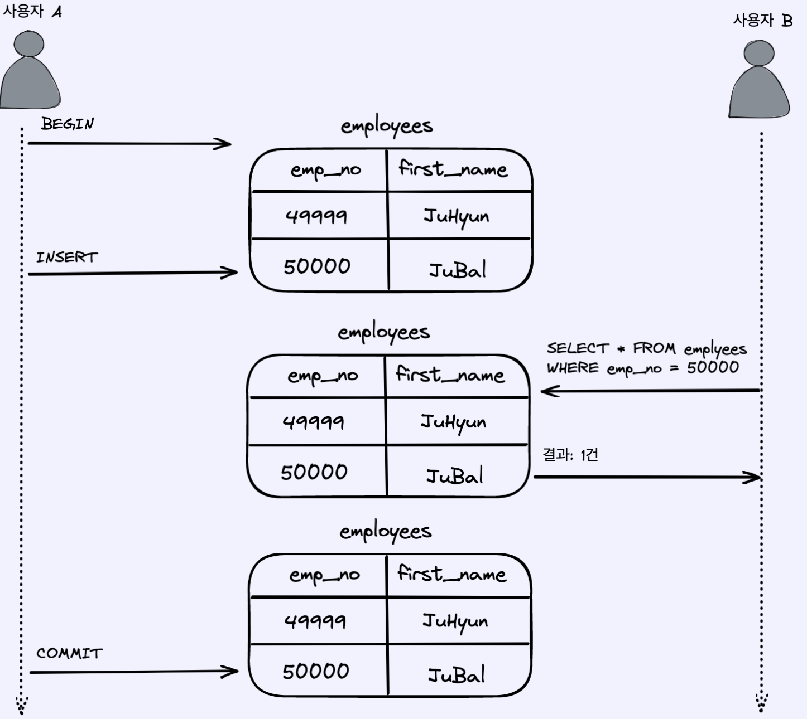
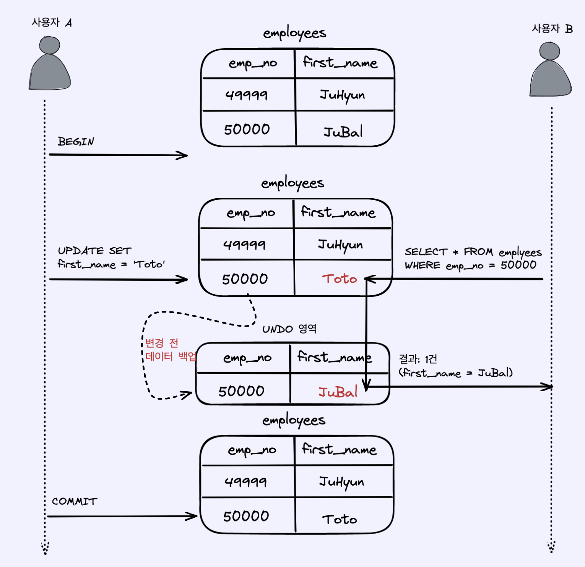
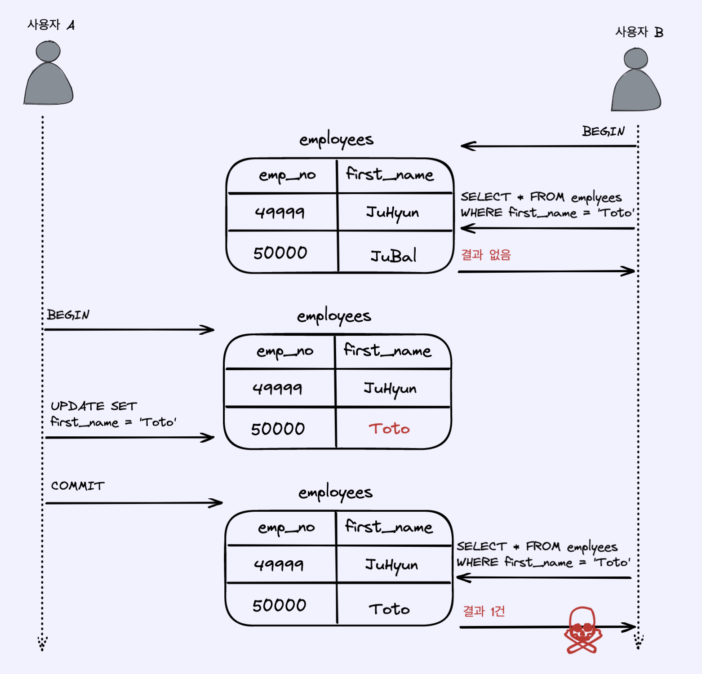
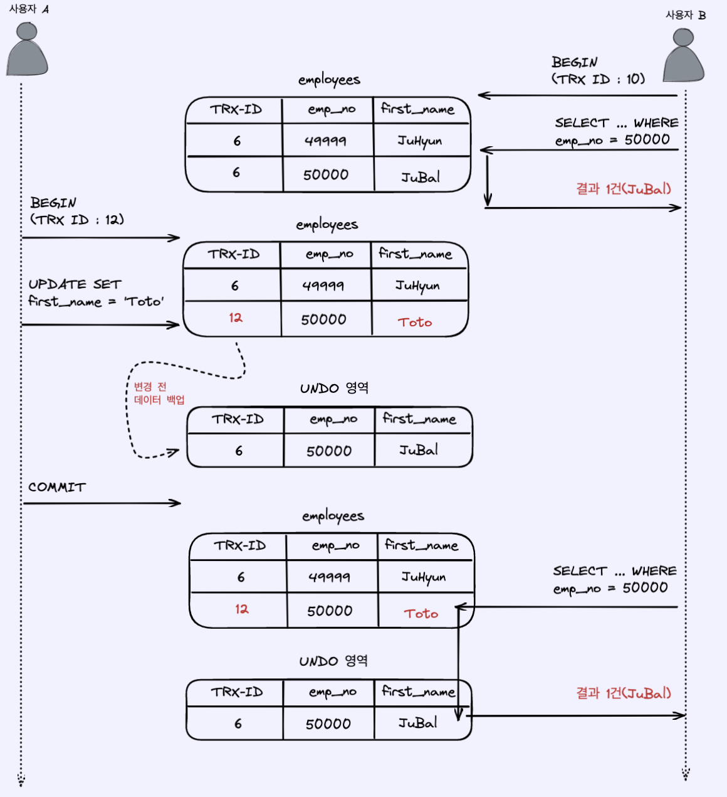

## Table of contents
{: .no_toc .text-delta }

1. TOC
{:toc}
---

- 아래의 글을 발췌하여 작성하였습니다
  - **[InnoDB Locking](https://dev.mysql.com/doc/refman/8.0/en/innodb-locking.html)**
  - **[MySQL InnoDB lock & deadlock 이해하기](https://www.letmecompile.com/mysql-innodb-lock-deadlock/)**
  - **[MySQL 트랜잭션 격리 수준](https://zzang9ha.tistory.com/381)**
  - **[트랜잭션 수준 읽기 일관성](http://wiki.gurubee.net/pages/viewpage.action?pageId=21200923)**
  - **[Dirty read, Non-repeatable read, and Phantom read](https://jennyttt.medium.com/dirty-read-non-repeatable-read-and-phantom-read-bd75dd69d03a)**
  - **[Transaction DeadLock](https://velog.io/@gsuchoi/DB-Transaction-DeadLock%EA%B5%90%EC%B0%A9%EC%83%81%ED%83%9C)**
  - **[MySQL SELECT FOR UPDATE 의 이해](https://jinhokwon.github.io/mysql/mysql-select-for-update/)**
  - **[mysql 동시성 문제 해결하기(FOR UPDATE)](https://lemontia.tistory.com/778)**
  - **[[mysql] myisam 과 innodb 뭐가 좋을까?](https://barnak.tistory.com/52)**

# **DB 트랜잭션 격리 수준**
- Thread에서 공유 자원에 동시 접근을 제한하기 위해 **Lock**을 걸듯이 DB에서도 **`Transaction`간에 같은 동일한 데이터에 대한 동시 접근을 제한**하기 위하여 **Lock**을 설정할 수 있다
  - *`Lock`을 건다는 것은 동시처리량이 줄어든다는 의미이기 때문에 과도하게 사용하면 성능에 문제가 생길 수 있다*

<br>

가장 낮은 **레벨 0**의 경우 `Lock`이 걸리지 않기 때문에 속도는 매우 빠르나 동시 접근을 허용하기 때문에 데이터 정합성에 문제가 생길 수 있다
<br>

가장 높은 **레벨 3**의 경우 완전히 `Lock`을 걸어 동시 접근을 차단하고 순차적으로 처리하기 때문에 정합성은 완벽하지만 동시에 처리할 수 있는 양이 적어 속도가 매우 느리다

> 🖐 실무 
> 
> `SHOW VARIABLES LIKE '%isolation';` → **REPEATABLE-READ**
> 
> 별도의 설정을 하지 않는다면 **REPEATABLE-READ**이 기본값이다


|**Isolation Level**|**Dirty Read**|**Nonrepeatable Read**|**Phantom Read**|
|:------------------|:-------------|:---------------------|:---------------|
|`레벨0` **Read Uncommited** 커밋되지 않은 읽기| 발생  |	발생	|발생       |
|`레벨1` **Read Committed**	커밋된 읽기| X	    |   발생	|발생       |
|`레벨2` **Repeatable Read** 반복 가능한 읽기| X	    |   X   	|발생  `InnoDB는 발생 X`     |
|`레벨3` **Serializable**	직렬화 가능| X	    |   X	    |X          |

> ✋ **Undo 로그**
> 
> **언두 영역**은 `UPDATE` 문장이나 `DELETE`와 같은 문장을 **데이터를 변경했을 때 변경되기 전의 데이터를 보관하는 곳이다.** 
> 
> `INSERT` 문장의 경우, **해당 데이터의 row id를 저장하고 이를 이용하여 물리적 메모리에 바로 접근할 수 있도록 보장한다.**
> 
> 트랜잭션의 롤백 대비용 , 트랜잭션의 격리 수준을 유지하면서 높은 동시성을 제공

## **READ UNCOMMITED**



- **각 트랜잭션에서의 변경 내용이 `COMMIT`이나 `ROLLBACK`여부에 상관없이 다른 트랜잭션에서 보여지게 된다**
- `Dirty Read`가 허용되는 격리 수준이다
- RDBMS 표준 에서는 트랜잭션의 격리 수준으로 인정하지 않을 정도로 문제가 많은 격리 수준

<br>

### `Dirty Read` 문제


<div class="code-example" markdown="1">
**한 트랜잭션에서 처리한 작업이 완료되지 않았음에도 불구하고 다른 트랜잭션에서 볼 수 있게 되는 현상**
</div>

```sql
set autocommit = FALSE;

set transaction_isolation = 'READ-UNCOMMITTED';
SHOW VARIABLES LIKE '%isolation';

-- <트랜잰셕 A>
start transaction;

update bookmark set name = 'SI 탈출 성공' where id = '1';
-- </트랜잰셕 A>

-- <트랜잭션 B>
select * from bookmark;
-- </트랜잭션 B>

-- <트랜잭션 A>
rollback;
-- </트랜잭션 A>
```

***

## **Read Committed**



- **온라인 서비스에서 가장 많이 선택되는 격리수준**
  - *오라클 DBMS에서 기본적으로 사용되고 있다*
- **Undo 영역**을 통해서 데이터를 가져오기 때문에 Dirty Read는 발생하지 않지만 , `NON_REPETABLE READ` 문제가 발생한다

### `NON-REPETABLE READ` 문제




<div class="code-example" markdown="1">
**동일한 SELECT 쿼리를 실행했을 때 항상 같은 결과를 보장해야 한다는 `"REPEATABLE READ"` 정합성에 어긋**
</div>

```sql
set autocommit = FALSE;

set transaction_isolation = 'READ-COMMITTED';
SHOW VARIABLES LIKE '%isolation';

-- <트랜잭션 A>
select * from bookmark;
-- </트랜잭션 A>

-- <트랜잭션 B>
start transaction;

update bookmark set name = 'SI 탈출 성공' where id = '1';
-- </트랜잭션 B>

-- <트랜잭션 A>
select * from bookmark;
-- </트랜잭션 A>

-- <트랜잭션 B>
COMMIT;
-- </트랜잭션 B>
```

***

## **REPETABLE_READ**
- **MySQL의 InnoDB 스토리지 엔진에서 기본적으로 사용되는 격리 수준**
- `"NON-REPEATABLE READ"` 부정합이 발생하지 않는다

<br>

**InnoDB 스토리지 엔진**은 트랜잭션이 `ROLLBACK`될 가능성에 대비해 **변경되기 전 레코드를 언두(Undo) 영역에 백업해두고 실제 레코드 값을 변경**<br>
이러한 변경 방식을 [`MVCC(Multi Version Concurrency Control)`](http://ronaldbradford.com/blog/understanding-innodb-mvcc-2009-07-15/)이라고 한다<br>

> ✋ `MVCC(Multi Version Concurrency Control)` - **잠금을 사용하지 않는 일관된 읽기를 제공**
> MVCC는 다중 버전 병행수행 제어의 약자로 DBMS에서는 쓰기(Write) 세션이 읽기(Read) 세션을 블로킹하지 않고, 
> 
> 읽기 세션이 쓰기 세션을 블로킹하지 않게 서로 다른 세션이 동일한 데이터에 접근했을 때 각 세션마다 스냅샷 이미지를 보장해주는 메커니즘
> 
> 이는 RDBMS에서 동시성을 높이기 위해 등장한 기술로, 소수의 전산실 운영자들이 서버 컴퓨터를 사용하던 시절에는 MVCC가 선택사항이었지만 인터넷이 보편화되고 
> 
> 온라인으로 업무를 처리하는 시대에서는 DBMS를 선택하는데 있어 MVCC가 가장 중요한 요소가 됐다. 
> 
> 출처 : 데이터넷 http://www.datanet.co.kr

- **REPEATABLE READ**는 이 `MVCC`를 위해 **언두 영역에 백업된 이전 데이터를 통해 동일한 트랜잭션 내에서는 동일한 결과를 보여줄 수 있도록 보장한다**
- **모든 InnoDB의 트랜잭션은 고유한 트랜잭션 번호(순차적으로 증가하는 값)를 가지며**, 언두 영역에 백업된 모든 레코드에는 변경을 발생시킨 트랜잭션의 번호가 포함되어 있다
- **REPEATABLE READ 격리 수준**에서는 `MVCC`를 보장하기 위해 실행중인 트랜잭션 가운데 가장 오래된 트랜잭션 번호보다 트랜잭션 번호가 앞선 언두 영역의 데이터는 삭제할 수 없다



### `PHANTOM READ` 문제


<div class="code-example" markdown="1">
**다른 트랜잭션에서 수행한 변경 작업에 의해 레코드가 보였다가 안보였다가 하는 현상을 `PHANTOM READ(PHANTOM ROW)`**
</div>

```sql
set transaction_isolation = 'REPEATABLE-READ';
SHOW VARIABLES LIKE '%isolation';

-- <트랜잭션 B>
start transaction;
select * from bookmark;
-- </트랜잭션 B>

-- <트랜잭션 A>
start transaction;

insert into bookmark(id , create_timestamp , name , star , domain , path) values(10 , NOW() , '디비비전' , 1 , 'dbvision.co.kr' , 'break');

commit;
-- </트랜잭션 A>

-- <트랜잭션 B>
select * from bookmark;
commit;
-- </트랜잭션 B>
```

***

# **Locking Read**
- **MySQL InnoDB 엔진**은 사용자가 필요에 따라 명시적으로 `locking read`를 할 수 있도록 두가지 쿼리를 제공한다

<br>

`SELECT ... LOCK IN SHARE MODE`<br>
- 한 트랜잭션에서 읽어간 데이터를 **다른 트랜잭션에서 배타적으로 수정하기 위해 락을 획득하려 할때** (읽어가는 것은 허용)

<br>

`SELECT ... FOR UPDATE`<br>
- 한 트랜잭션에서 읽어간 데이터를 **다른 트랜잭션에서 배타적으로 읽거나, 수정하기 위해 락을 획득하려할 때 기다리게 한다**

> MySQL 8.0 부터는 기존 *LOCK IN SHARE MODE* 대신 `FOR SHARE`라고 간략하게 적어줘도 된다.  *(하위 호환성을 위해 기존 구문도 문제 없이 실행됨)*

## MySQL InnoDB 락의 종류
- **Inno DB내부에서는 경우 여러 트랜잭션들이 경합하고 있는 상황에서 최대한의 성능을 위해서 `여러 방식의 다양한 락(Lock)을 조합`해서 사용하고 있다**

1. **Shared Lock** (`S`)
   - **Row-Level Lock**
   - `SELECT` 위한 **Read Lock**
   - **Shared Lock**이 걸려있는 동안 다른 트랜잭션이 해당 row에 대해 `X` lock 획득 (`exclusive write`)은 불가능하지만 `S` lock 획득 (`shared read`)은 가능
   - 한 row에 대해 **여러 트랜잭션이 동시에 `S` lock 획득이 가능**


2. **Exclusive Lock** (`X`)
   - **Row-Level Lock**
   - `UPDATE` , `DELETE` 위한 **Write Lock**
   - `exclusive lock`이 걸려있으면 다른 트랜잭션이 해당 row에 대해 `X` , `S` lock을 모두 획득하지 못하고 대기해야 한다

3. **Intention Lock** (`I`)
   - **Table-Level Lock**
   - 테이블안의 row에 대해 `Row-Level Lock`을 걸 것이라는 의도를 알려주기 위해 미리 **Table-Level Lock**을 거는 것
   - `SELECT ... LOCK IN SHARE MODE`이 실행되면,
     1. **Intention Shared Lock** (`IS`)이 테이블에 걸림
     2. 그 후 row-level에 `S` lock이 걸림
   - `SELECT ... FOR UPDATE` , `INSERT` , `DELETE` , `UPDATE`가 실행되면,
     1. **Intention Exclusive Lock** (`IX`)이 테이블에 걸림
     2. 그 후 row-level에 `X` lock이 걸림
   - `IS` , `IX` lock은 여러 트랜잭션에서 동시에 접근이 가능하다 (*서로 block하지 않는다*)
   - 하지만 동일한 row에 **Row-Level Lock**의 실제 lock (`S` 또는 `X`)을 획득하는 과정에서 동시 접근을 막거나 허용하는 제어를 하게 된다
   - `LOCK TABLES` , `ALTER TABLE` , `DROP TABLE`이 실행될 때는 `IS` , `IX`를 모두 **block**하는 **Table-Level Lock**이 걸린다 (즉 , `IS` 또는 `IX` lock을 획득하려는 트랜잭션은 대기상태로 빠진다)

...


# **DB Deadlock**
- 두 개 이상의 트랜잭션들이 동시에 진행될때 **서로가 서로에 대한 락을 소유한 상태로 대기 상태로 빠져서 더이상 진행하지 못하는 상황을 `데드락(deadlock)`이라고 한다**
- 하지만 일반적인 DBMS (Database Management System)에서는 **데드락 탐지(Deadlock detection) 기능**을 제공하기때문에 데드락이 발견되면 자동으로 해소시켜준다 
  - (*실제 데드락 상황이 아닐지라도 락에 대한 대기시간이 설정된 시간을 초과하면 이것도 데드락으로 처리된다*)


****

1. `synchronized` 키워드를 사용하였음에도 불구하고 테스트는 실패한다

```
expected: 0L
but was: 50L
```

- `Spring의 @Transactional`의 작동방식 때문이다
- `@Transactional`이 선언된 `decrease()`메소드는 프록시로 실행되는데 `decrease()`메소드 자체는 동기화가 되지만 해당 메소드가 진행되고 있는 중에도 다른 스레드의 트랜잭션이 시작할 수도 있기 때문이다
- **트랜잭션 시작** → `synchronized decrease()` → **트랜잭션 종료**
- 트랜잭션 시작과 종료 사이에 트랜잭션이 시작되는 스레드가 갱신되기 이전의 데이터를 조회해서 감소시키기 때문에 문제다
  - 그럼 프록시는 `synchronized`키워드를 무시하나보다
- `@Transactional`을 제거하면 테스트를 통과한다.

**문제점**<br>

- 자바의 `synchronized`는 **하나의 프로세스에서만 보장된다.**
  - 서버가 여러 대라면 근본적인 문제는 해결할 수 없다

2. DB의 비관적 락을 적용하면 해결된다 `1초 184ms`

```java
select stock0_.id as id1_0_, stock0_.program_id as program_2_0_, stock0_.quantity as quantity3_0_ from stock stock0_ where stock0_.id=? for update
```

3. 엔티티에 `version`필드 `@Version`어노테이션을 추가하여 낙관적 락 사용 `4초 704ms`
4. mysql `Named Lock`활용 40개의 커넥션, 32개의 스레드


- **Optimistic Lock**
  - lock 을 걸지않고 문제가 발생할 때 처리합니다.
  - 대표적으로 `version column` 을 만들어서 해결하는 방법이 있습니다.
  - `version`을 확인해가며 데이터를 조작한다.
  - 충돌이 빈번하다면 비관적 락을 사용하는게 이득일 것이다.
  - DB 작업에 실패한다면 재시도 로직을 개발자가 직접 작성해줘야 한다.
- **Pessimistic Lock (exclusive lock)**
  - 다른 트랜잭션이 특정 row 의 lock 을 얻는것을 방지합니다.
  - A 트랜잭션이 끝날때까지 기다렸다가 B 트랜잭션이 lock 을 획득합니다.
  - 특정 row 를 update 하거나 delete 할 수 있습니다.
  - 일반 select 는 별다른 lock 이 없기때문에 조회는 가능합니다.
  - row나 테이블 단위
  - 충돌이 빈번하다면 **낙관적 락보다 성능이 좋을 수 있다**
  - 하지만 별도의 락을 사용하기 때문에 성능 저하는 당연하다.
- **Named Lock 활용하기**
  - 이름과 함께 메타데이터 lock 을 획득합니다. 
  - 해당 lock 은 다른세션에서 획득 및 해제가 불가능합니다.
  - 트랜잭션이 종료될 때 락이 자동으로 풀리지 않기 때문에 별도의 명령어로 해제해주거나, 선점 시간이 끝나야 풀린다.
  - 분산 락을 구현할 떄 쓰인다

<br>

- [glos_exclusive_lock](https://dev.mysql.com/doc/refman/8.0/en/glossary.html#glos_exclusive_lock)
- [innodb-locking](https://dev.mysql.com/doc/refman/8.0/en/innodb-locking.html)
- [locking-functions](https://dev.mysql.com/doc/refman/8.0/en/locking-functions.html)

**Redis 이용해보기**<br>

1. **Lettuce** `7초 329ms`
  - 구현이 간단하다.
  - `spring data redis`를 이용하면 **Lettuce**가 기본이기 때문에 별도의 라이브러리를 사용하지 않아도 된다
  - `lock` 획득 대기 상태라면 Redis에 부하가 갈 수 있다.
  - `setnx` 명령어를 활용하여 분산 락 구현
  - `spin lock`
  - Redis에 부하를 줄이기 위해 `lock`을 얻기 위한 시도는 `100ms` 텀을 두고 시도
2. **Redisson** `1초 501ms`
   - 락 획득 재시도를 기본으로 제공한다
   - `pub-sub`기반 락 구현 제공
   - 별도의 재시도 로직을 작성하지 않아도 된다
   - 자신이 점유하고 있는 락을 해제할 때 같은 채널에 있는 스레드에게 락을 획득하라고 알린다
   - Redis에 부하를 줄일 수 있다
   - `lock`을 라이브러리 차원에서 제공해주기 때문에 사용법을 공부해야 한다
3. 실무에서는 ?
   - 재시도가 필요하지 않은 `lock`은 **Lettuce**를 활용
   - 재시도가 필요한 경우에는 **Redisson**을 활용
4. **Mysql**
   - 어느 정도의 트래픽까지는 문제없이 활용이 가능하다
   - Reids보다는 성능이 좋지 않다
5. **Redis**
   - 별도의 구축비용과 인프라 관리비용이 발생한다
   - Mysql보다 성능이 좋다