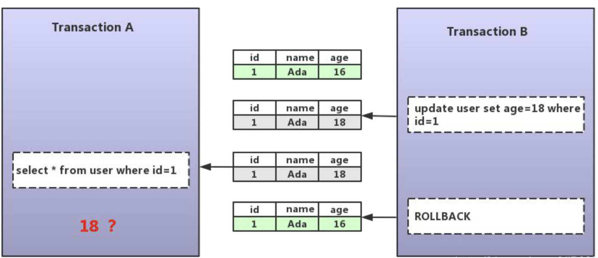

## Table of contents
{: .no_toc .text-delta }

1. TOC
{:toc}
---

- 아래의 글을 발췌하여 작성하였습니다
  - **[MySQL InnoDB lock & deadlock 이해하기](https://www.letmecompile.com/mysql-innodb-lock-deadlock/)**
  - **[DB 트랜잭션 격리 수준](https://www.letmecompile.com/database-transaction-isolation-level/)**
  - **[MySQL 트랜잭션 격리 수준 확인 / 변경](https://luran.me/325)**
  - **[트랜잭션 수준 읽기 일관성](http://wiki.gurubee.net/pages/viewpage.action?pageId=21200923)**
  - **[Dirty read, Non-repeatable read, and Phantom read](https://jennyttt.medium.com/dirty-read-non-repeatable-read-and-phantom-read-bd75dd69d03a)**
  - **[Transaction DeadLock](https://velog.io/@gsuchoi/DB-Transaction-DeadLock%EA%B5%90%EC%B0%A9%EC%83%81%ED%83%9C)**

# **DB 트랜잭션 격리 수준**
- Thread에서 공유 자원에 동시 접근을 제한하기 위해 **Lock**을 걸듯이 DB에서도 **`Transaction`간에 같은 동일한 데이터에 대한 동시 접근을 제한**하기 위하여 **Lock**을 설정할 수 있다
  - *`Lock`을 건다는 것은 동시처리량이 줄어든다는 의미이기 때문에 과도하게 사용하면 성능에 문제가 생길 수 있다*

 

가장 낮은 **레벨 0**의 경우 `Lock`이 걸리지 않기 때문에 속도는 매우 빠르나 동시 접근을 허용하기 때문에 데이터 정합성에 문제가 생길 수 있다
 

가장 높은 **레벨 3**의 경우 완전히 `Lock`을걸어 동시 접근을 차단하고 순차적으로 처리하기 때문에 정합성은 완벽하지만 동시에 처리할 수 있는 양이 적어 속도가 매우 느리다

> 🖐 실무 
> 
> `SHOW VARIABLES LIKE '%isolation';` → **REPEATABLE-READ**
> 
> 별도의 설정을 하지 않는다면 **REPEATABLE-READ**이 기본값이다

|**Isolation Level**|**Dirty Read**|**Nonrepeatable Read**|**Phantom Read**|
|:------------------|:-------------|:---------------------|:---------------|
|`레벨0` **Read Uncommited**	| 발생  |	발생	|발생       |
|`레벨1` **Read Committed**	    | X	    |   발생	|발생       |
|`레벨2` **Repeatable Read**	| X	    |   X   	|발생       |
|`레벨3` **Serializable Read**	    | X	    |   X	    |X          |

- `레벨1`
  - 하나의 레코드를 읽을 때 Lock을 설정하고 해당 레코드를 빠져 나가는 순간 Lock 해제
  - Oracle은 Lock을 사용하지 않고 쿼리시작 시점의 Undo 데이터를 제공하는 방식으로 구현
- `레벨2`
  - 선행 트랜잭션이 읽은 데이터는 트랜잭션이 종료될 때가지 후행 트랜잭션이 갱신하거나 삭제하는 것을 불허함으로써 같은 데이터를 두 번 쿼리했을 때 일관성 있는 결과를 리턴
- `레벨3`
  - 선행 트랜잭션이 읽은 데이터를 후행 트랜잭션이 갱신하거나 삭제하지 못할 뿐만 아니라 중간에 새로운 레코드를 산입하는 것도 막아줌

## **동시성 이슈란?**
- **하나 이상의 트랜잭션이 동시에 `동일한 데이터에 접근하여 읽기/쓰기` 오퍼레이션을 할 때 발생**

1. **Dirty Read**

2. **Non-Repeatable Read (Inconsistent Read)**

3. **Phantom Read**

- 트랜잭션1이 A테이블에서 SELECT한 이후 트랜잭션2에서 A테이블에 내용을 추가/삭제(INSERT/UPDATE)하는 상황 가정
Repeatable Read가 보장된 경우, A테이블에서 SELECT해왔던 데이터들을 다른 트랜잭션2가 수정(UPDATE)하여 commit한 후 트랜잭션1에서 다시 A테이블을 SELECT 하더라도 트랜잭션2의 수정내용을 읽어들일 수 없다.
하지만 트랜잭션2가 추가/삭제(INSERT/DELETE)를 한 경우, 다시 A 테이블에서 SELECT하게되면 기존에 A에서 SELECT했던 데이터에서 row가 추가되거나 사라질 수 있다.(유령 데이터)