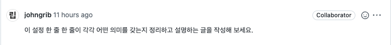

{: .no_toc }

<details open markdown="block">
  <summary>
    Table of contents
  </summary>
  {: .text-delta }
1. TOC
{:toc}
</details>

---



- [리뷰](https://github.com/CodeSoom/spring-week7-assignment-1/pull/74#discussion_r974239683)
<br>

이번 7주차 과제가 **Spring Security**를 적용해보는 과제였다.
- [`Spring Guides` Securing a Web Application](https://spring.io/guides/gs/securing-web/)
- [`Spring Guides` Spring Security Architecture](https://spring.io/guides/topicals/spring-security-architecture)

```
we take a look at the way security is applied in web applications by using filters and, more generally, by using method annotations. 
```

```
Spring Security는 Servlet을 기반으로 하므로 일반적으로 Filters의 역할을 먼저 살펴보는 것이 도움이 됩니다.
필터를 사용하고 보다 일반적으로 메서드 주석을 사용하여 웹 애플리케이션에 보안이 적용되는 방식을 살펴볼 수 있습니다.
Spring Security에는 인증과 권한 부여를 분리하도록 설계된 아키텍처가 있으며 둘 모두에 대한 전략과 확장점이 있습니다.
Spring Security는 Filter 체인에 단일로 설치되며 ("FilterChainProxy"), Spring Security 필터는 필터 체인 목록을 포함하고 일치하는 첫 번째 체인에 요청을 발송합니다.
```


- [위의 이미지 출처](https://spring.io/guides/topicals/spring-security-architecture)


<br>

## **필터 체인 생성 및 사용자 정의**

지금은 **WebSecurityConfigurerAdapter** 추상화 클래스를 상속받고 `configure(HttpSecurity http)` 메소드를 구현하면 등록된다고 생각하자
- *특정 인터페이스를 구현하거나 특정 클래스를 상속한 클래스들을 찾아 설정해주지 않을까?*
- [`Spring Docs` WebSecurityConfigurerAdapter](https://docs.spring.io/spring-security/site/docs/current/api/org/springframework/security/config/annotation/web/configuration/WebSecurityConfigurerAdapter.html)
- [`Spring Docs` WebSecurityConfigurer](https://docs.spring.io/spring-security/site/docs/current/api/org/springframework/security/config/annotation/web/WebSecurityConfigurer.html)
  - WebSecurity에 대한 사용자 정의를 허용합니다. 
  - 대부분의 경우 사용자는 EnableWebSecurity를 사용하고 SecurityFilterChain 빈을 노출하는 구성을 생성합니다. 
  - **이것은 EnableWebSecurity 주석에 의해 WebSecurity에 자동으로 적용됩니다.**

<br>

```java
@Configuration
@EnableGlobalMethodSecurity(prePostEnabled = true)
public class SecurityJavaConfig extends WebSecurityConfigurerAdapter {

    private final AuthenticationService authenticationService;

    public SecurityJavaConfig(AuthenticationService authenticationService) {
        this.authenticationService = authenticationService;
    }

    @Override
    public void configure(HttpSecurity http) throws Exception {
        Filter authenticationFilter = new JwtAuthenticationFilter(authenticationManager(), authenticationService);
        Filter authenticationErrorFilter = new AuthenticationErrorFilter();

        http.csrf().disable()
                .addFilter(authenticationFilter)
                .addFilterBefore(authenticationErrorFilter , JwtAuthenticationFilter.class)
                .sessionManagement()
                .sessionCreationPolicy(SessionCreationPolicy.STATELESS)
                .and()
                .exceptionHandling()
                .authenticationEntryPoint(new HttpStatusEntryPoint(HttpStatus.UNAUTHORIZED));
//        super.configure(http);
    }
}
```


- [`Spring Docs` HttpSecurity](https://docs.spring.io/spring-security/site/docs/current/api/org/springframework/security/config/annotation/web/builders/HttpSecurity.html)
- 위의 문서를 참고해서 설정 부분을 해석해보자


```java
csrf().disable()
```
- 기본적으로 CSRF가 활성화 되어 있지만 지금은 불필요하니 해제

***

```java
addFilter(javax.servlet.Filter filter)
```
- 스프링 시큐리티 프레임워크에 필터를 추가한다.

***

```java
addFilterBefore(javax.servlet.Filter filter, 
                java.lang.Class<? extends javax.servlet.Filter> beforeFilter)

...

addFilterBefore(authenticationErrorFilter , JwtAuthenticationFilter.class)
```
- 등록한 `filter`가 실행되기 전에 먼저 실행할 `beforeFilter`필터를 등록한다.
  - 7주차 과제에서는 **JwtAuthenticationFilter**에서 토큰을 분석하기 때문에 토큰이 유효하지 않을 때 던지는 예외를 잡아 응답 상태를 커스텀 하기 위해 **authenticationErrorFilter**를 등록하였다.

***

```java
.sessionManagement()
.sessionCreationPolicy(SessionCreationPolicy.STATELESS)
```

`sessionManagement()` 세션 관리 구성을 허용한다.<br>
- [`Spring Reference` 세션 관리](https://docs.spring.io/spring-security/reference/6.0/servlet/authentication/session-management.html) 
- 세션 시간 초과 감지 , 쿠키 삭제 , 다중 로그인 방지 , 세션 고정 공격 방지 🚩 등등..
- **반환** [`Spring Docs` SessionManagementConfigurer](https://docs.spring.io/spring-security/site/docs/current/api/org/springframework/security/config/annotation/web/configurers/SessionManagementConfigurer.html)

`sessionCreationPolicy(SessionCreationPolicy.STATELESS)`<br>
- 세션 생성 정책을 설정한다.

```java
public enum SessionCreationPolicy {
	/** 항상 HttpSession 생성 */
	ALWAYS,
	/**
	 * Spring Security는 HttpSession 을 생성하지 않지만 이미 존재하는 경우 HttpSession 을 사용합니다.
	 */
	NEVER,
	/** Spring Security는 필요한 경우에만 HttpSession 을 생성합니다. */
	IF_REQUIRED,
	/**
	 * Spring Security는 결코 HttpSession 을 생성하지 않으며 
     * SecurityContext 를 얻기 위해 그것을 사용하지 않을 것입니다.
	 */
	STATELESS
}
```

***

```java
.exceptionHandling()
.authenticationEntryPoint(new HttpStatusEntryPoint(HttpStatus.UNAUTHORIZED));
```

`exceptionHandling()` 예외 처리 관련 구성을 허용한다.<br>
- **EnableWebSecurity**를 쓸 때 자동으로 적용된다.
- **반환** [`Spring Docs` ExceptionHandlingConfigurer](https://docs.spring.io/spring-security/site/docs/current/api/org/springframework/security/config/annotation/web/configurers/ExceptionHandlingConfigurer.html)
  - 애플리케이션에 Spring Security 관련 예외에 대한 예외 처리를 추가한다.
  - 모든 속성에는 기본값이 있으므로 이 **SecurityConfigurer를 적용하는 것 외에는 추가 구성이 필요하지 않다.**
  - [`Spring Docs` ExceptionTranslationFilter](https://docs.spring.io/spring-security/site/docs/current/api/org/springframework/security/config/annotation/web/configurers/ExceptionHandlingConfigurer.html)

`authenticationEntryPoint(new HttpStatusEntryPoint(HttpStatus.UNAUTHORIZED))`<br>
- **ExceptionTranslationFilter**에서 인증 체계를 시작하는 데 사용한다.
- [`Spring Docs` Interface AuthenticationEntryPoint](https://docs.spring.io/spring-security/site/docs/current/api/org/springframework/security/web/AuthenticationEntryPoint.html)

`new HttpStatusEntryPoint(HttpStatus.UNAUTHORIZED)`<br>
- **일반 HttpStatus를 응답으로 보내는 AuthenticationEntryPoint**

### **정리**

Spring Security는 서블릿의 필터 기능을 이용한다.<br>
**주석 메서드**기능을 이용하거나 또는 `@EnableWebSecurity`어노테이션을 사용하여 적용한다.<br>
Spring Security를 위한 [`Spring Docs`**FilterChainProxy**](https://docs.spring.io/spring-security/site/docs/current/api/org/springframework/security/web/FilterChainProxy.html)가 필터 체인에 합류한다.<br>
세션과 예외 설정이 가능하다.


***

## **@PreAuthorize 및 @PostAuthorize를 사용한 액세스 제어**

- [`Spring Reference` @PreAuthorize 및 @PostAuthorize를 사용한 액세스 제어](https://docs.spring.io/spring-security/reference/5.7.4/servlet/authorization/expression-based.html#_access_control_using_preauthorize_and_postauthorize)
- [코드숨 7주차 과제](https://github.com/jdalma/spring-week7-assignment-1/blob/main/app/src/main/java/com/codesoom/assignment/security/UserAuthentication.java)

<br>

```java
@PostMapping
@ResponseStatus(HttpStatus.CREATED)
@PreAuthorize("isAuthenticated() and hasAuthority('USER')")
public Product create(
        @RequestBody @Valid ProductData productData
) {
    return productService.createProduct(productData);
}
```

<div class="code-example" markdown="1">
**UserAuthentication**
</div>

```java
public class UserAuthentication extends AbstractAuthenticationToken {

    private final Long userId;

    private static List<GrantedAuthority> authorities() {
        List<GrantedAuthority> authorities = new ArrayList<>();
        // TODO : userId에 따라서 권한을 따로 부여
        authorities.add(new SimpleGrantedAuthority("USER"));
        return authorities;
    }

    public UserAuthentication(Long userId) {
        super(authorities());
        this.userId = userId;
    }

    @Override
    public boolean isAuthenticated() {
        return true;
    }

    @Override
    public Object getCredentials() {
        return null;
    }

    @Override
    public Object getPrincipal() {
        return true;
    }
}
```

**@EnableGlobalMethodSecurity(prePostEnabled = true)** 설정으로 인해 `@PreAuthorize` 어노테이션이 동작한다.
- *이 설정이 메소드 주석 사용 방법 이라고 이해했다.*

<br>

하지만 `@PreAuthorize("isAuthenticated() and hasAuthority('USER')")` 안에 있는 메소드들은 어떻게 호출되는걸까??
- **isAuthenticated()** : AbstractAuthenticationToken를 상속한 `UserAuthentication.isAuthenticated()`의 메소드가 사용된다.
- **hasAuthority()** : [`Spring Reference` 표현식 기반 액세스 제어](https://docs.spring.io/spring-security/reference/6.0/servlet/authorization/expression-based.html)에서 공통으로 제공하는 내장 표현식이다.
  - Returns `true` if the current principal has the specified authority.