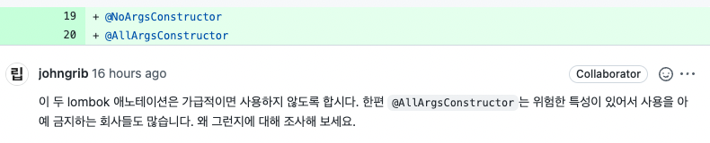

{: .no_toc }

<details open markdown="block">
  <summary>
    Table of contents
  </summary>
  {: .text-delta }
1. TOC
{:toc}
</details>

---


- 아래의 링크를 참고하였습니다
  - [`kwonnam` Lombok 사용상 주의점](https://kwonnam.pe.kr/wiki/java/lombok/pitfall)
  - [`projectlombok` constructor](https://www.projectlombok.org/features/constructor)
  - [`projectlombok` configuration](https://projectlombok.org/features/configuration)

# **@AllArgsConstructor**, **@RequiredArgsConstructor** 사용금지



- Lombok을 사용하면 IDE Generate보다 클래스위에 어노테이션을 자동완성 해왔다
  - *`@EqualsAndHashCode`도 막 사용한다*
- 생성자 어노테이션은 왜 위험할까??

<br>

- 이 [글](https://kwonnam.pe.kr/wiki/java/lombok/pitfall)에 따르면 **@AllArgsConstructor**, **@RequiredArgsConstructor** 클래스 필드 순서대로 생성자를 생성해준다고 한다
  - 이 때, **생성자 어노테이션이 작성된 클래스 필드들의 순서를 수정하면 이미 사용중인 영역에 영향이 간다**
  - 필드들의 타입이 달라서 컴파일 에러를 일으킨다면 다행이지만 , **타입이 같다면 큰 문제다**
- 직접 확인해보자

<br>

<div class="code-example" markdown="1">
**ProductData**
</div>


```java
@AllArgsConstructor
public class ProductData {
    private Long id;
    private String name;
    private String maker;
    private Integer price;
    private String imageUrl;
}
```

<div class="code-example" markdown="1">
컴파일된 클래스를 디컴파일한 **ProductData**
</div>

```java
public class ProductData {
    private Long id;
    private String name;
    private String maker;
    private Integer price;
    private String imageUrl;

    public ProductData(Long id, String name, String maker, Integer price, String imageUrl) {
        this.id = id;
        this.name = name;
        this.maker = maker;
        this.price = price;
        this.imageUrl = imageUrl;
    }
}
```

<div class="code-example" markdown="1">
필드들의 순서가 섞인 **ProductData**
</div>

```java
@AllArgsConstructor
public class ProductData {
    private Long id;
    private String imageUrl;
    private String maker;
    private Integer price;
    private String name;
}
```

<div class="code-example" markdown="1">
컴파일된 클래스를 디컴파일한 **순서가 섞인 ProductData**
</div>

```java
public class ProductData {
    private Long id;
    private String imageUrl;
    private String maker;
    private Integer price;
    private String name;

    public ProductData(Long id, String imageUrl, String maker, Integer price, String name) {
        this.id = id;
        this.imageUrl = imageUrl;
        this.maker = maker;
        this.price = price;
        this.name = name;
    }
}
```

- 필드의 순서에 맞게 생성자가 재정의 되었다. 꼭 필요하다면 직접 작성하자
- 특정 롬복 어노테이션을 막고 싶다면 `lombok.(featureName).flagUsage` 옵션을 사용하자
- [어떤 분](https://github.com/projectlombok/lombok/issues/2094#issuecomment-866351481)은 `@AllArgsConsructor`를 **"This annotation is simply a loaded gun.."**라고 말하기도 했다
