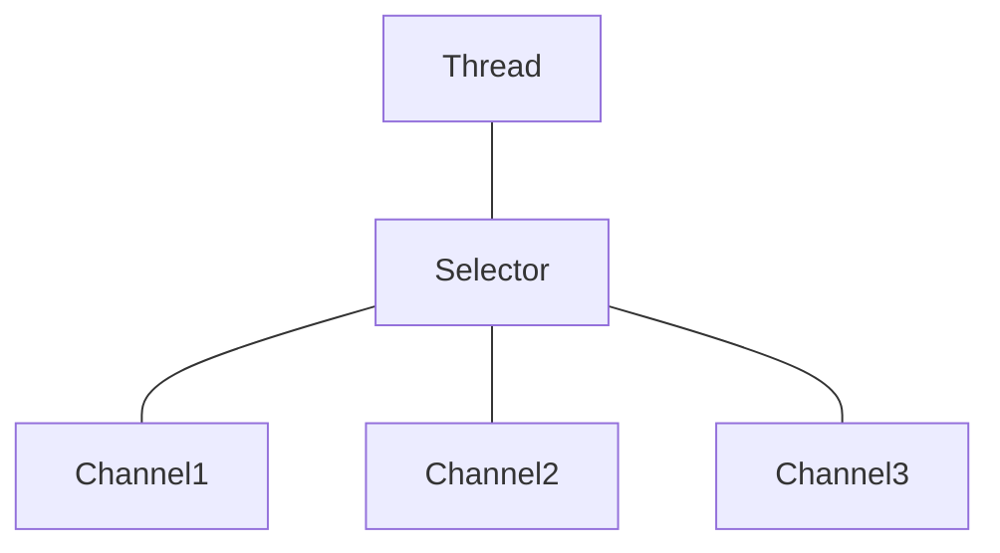
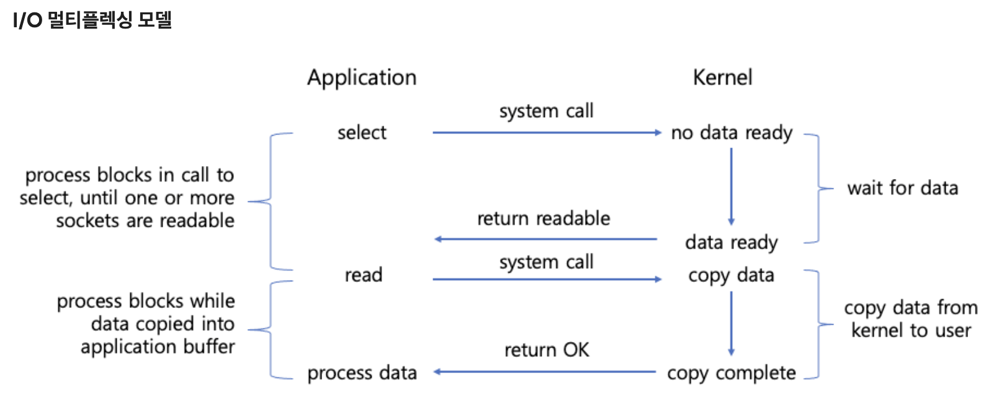

{: .no_toc }

  

    Table of contents
  

  {: .text-delta }
1. TOC
{:toc}

---

- 해당 게시글의 대부분의 내용은 아래에서 발췌하였습니다.
  - [네티 인 액션](http://www.yes24.com/Product/Goods/25662949)  
  - [비동기 서버에서 이벤트 루프를 블록하면 안 되는 이유](https://engineering.linecorp.com/ko/blog/do-not-block-the-event-loop-part1)

# **Java NIO**

## Channel, Buffer

서버에서 클라이언트와 데이터를 주고 받을 때 채널을 통해서 버퍼(ByteBuffer)를 이용해 읽고 쓴다.

**Channel**     
1. FileChannel
2. DatagramChannel : UDP를 이용해 네트워크에서 데이터를 읽고 쓴다
3. SocketChannel : TCP를 이용해 네트워크에서 데이터를 읽고 쓴다
4. ServerSocketChannel : 클라이언트의 TCP 연결 요청을 수신할 수 있으며, SocketChannel은 각 연결마다 생성된다

**Buffer**      
Buffer를 사용해 데이터를 읽고 쓰는 것은 4단계로 진행됩니다.

1. Buffer에 데이터 쓰기
2. Buffer의 `flip()` 메서드 호출
   - 버퍼를 쓰기 모드에서 읽기 모드로 변경
3. Buffer에서 데이터 읽기
4. Buffer의 `clear()` 혹은 `compact()` 메서드 호출
   - 모든 데이터를 읽은 후에는 전체 버퍼를 지울 수 있다

## 논블로킹(non-blocking) I/O

스레드가 버퍼로 데이터를 읽어달라고 채널에 요청하면, 채널이 버퍼에 데이터를 채워넣는 동안 해당 스레드는 다른 작업을 수행할 수 있다.  
이후 채널이 버퍼에 데이터를 채워 넣고 나면 스레드는 해당 버퍼를 이용해 처리를 진행한다.  
반대로 데이터를 채널로 보내는 경우에도 논블로킹으로 처리할 수 있다.  

## 셀렉터
`java.nio.channels.Selector`  
자바의 논블로킹 입출력 구현의 핵심  
Java NIO에는 여러 개의 채널에서 이벤트(예: 연결생성, 데이터 도착 등)를 모니터링 할 수 있는 **셀렉터**가 포함되어 있기 때문에 하나의 스레드로 여러 채널을 모니터링 할 수 있다.  
[`java docs` SelectProvider](https://docs.oracle.com/javase/7/docs/api/java/nio/channels/spi/SelectorProvider.html) . 

***

# **비동기**

[👩‍💻 동기 & 비동기 / 블로킹 & 논블로킹 💯 완벽 이해하기](https://inpa.tistory.com/entry/%F0%9F%91%A9%E2%80%8D%F0%9F%92%BB-%EB%8F%99%EA%B8%B0%EB%B9%84%EB%8F%99%EA%B8%B0-%EB%B8%94%EB%A1%9C%ED%82%B9%EB%85%BC%EB%B8%94%EB%A1%9C%ED%82%B9-%EA%B0%9C%EB%85%90-%EC%A0%95%EB%A6%AC#thankYou)  
[`evanmoon` 동기(Synchronous)는 정확히 무엇을 의미하는걸까?](https://evan-moon.github.io/2019/09/19/sync-async-blocking-non-blocking/#%EB%8F%99%EA%B8%B0-%EB%B0%A9%EC%8B%9D--%EB%85%BC%EB%B8%94%EB%A1%9D%ED%82%B9-%EB%B0%A9%EC%8B%9D)   
발생하는 이벤트에 대해 언제든지, 그리고 순서에 관계없이 응답할 수 있다는 것     

***

# 네티의 특징

네티의 비동기 프로그래밍 모델은 `Future`와 `콜백`의 개념, 그리고 더 깊은 단계에서 `이벤트`를 `핸들러 메서드`로 발송하는 작업을 기반으로 작동한다.  
네티는 `이벤트`를 발생시켜 `Selector`를 애플리케이션 밖으로 추상화하므로 개발자가 발송 코드를 직접 작성할 필요가 없다.  
각 `Channel`에 할당되는 `EventLoop`는 내부적으로 다음을 비롯한 모든 이벤트를 처리한다.  

1. 관심 이벤트 등록
2. 이벤트를 `ChannelHandler`로 발송
3. 추가 동작 스케줄링

`EventLoop`자체는 한 `Channel`의 모든 입출력 이벤트를 처리하는 한 스레드에 의해 제어되며, `EventLoop`의 수명 기간동안 달라지지 않는다.  
덕분에 `ChannelHandler`의 동기화와 관련된 모든 문제를 고려할 필요 없이, 처리할 데이터가 있을 때 실행할 올바른 논리를 제공하는데만 집중할 수 있다.  

# 네티가 제공하는 전송

## NIO
## Epoll
## OIO
## 로컬 (Local)
## 임베디드 (Embedded)

***

# **Netty의 핵심 컴포넌트**

## Channel

`자바 NIO의 기본 구조`  
다음과 같이 정의된다.  

> **하나 이상의 입출력 작업을 수행**할 수 있는 하드웨어 장치, 파일, 네트워크 소켓, 프로그램 컴포넌트와 같은 **엔티티에 대한 열린 연결**   

지금은 데이터를 위한 운송수단이라고 생각하자

## 콜백
다른 메서드로 자신에 대한 참조를 제공할 수 있는 메서드  
**네티는 이벤트를 처리할 때 내부적으로 콜백을 이용한다**    
콜백이 트리거 되면 [`ChannelHandler`인터페이스](https://netty.io/4.1/api/io/netty/channel/ChannelHandler.html)의 구현을 통해 이벤트를 처리할 수 있다     

## Future
`Future`는 작업이 완료되면 이를 애플리케이션에 알리는 한 방법이다.  
이 객체는 비동기 작업의 결과를 담는 **자리표시자 (placeholder)**역할을 하며, 미래의 어떤 시점에 작업이 완료되면 그 결과에 접근할 수 있게 해준다.  

JDK는 `java.util.concurrent.Future` 인터페이스를 제공하지만, 제공되는 구현에는 **수동으로 작업완료 여부**를 확인하거나, **완료되기 전까지 블로킹하는 기능**만 있다.  
그래서 네티는 비동기 작업이 실행됐을 때 이용할 수 있는 **자체 구현 [`ChannelFuture`](https://netty.io/4.0/api/io/netty/channel/ChannelFuture.html)**를 제공한다.  

`ChannelFuture`에는 `ChannelFutureListener`인스턴스를 하나 이상 등록할 수 있는 추가 메서드가 있다.  
작업이 완료되면 리스너의 콜백 메서드인 `operationComplete()`가 호출되며,  
이 시점에 작업이 정상적으로 완료됐는지, 아니면 오류가 발생했는지 확인할 수 있다.  

## 이벤트와 핸들러

네티는 작업의 상태 변화를 알리기 위해 **고유한 이벤트**를 이용하며, 발생한 이벤트를 기준으로 적절한 동작을 트리거 할 수 있다.  

1. 로깅
2. 데이터 변환
3. 흐름 제어
4. 애플리케이션 논리

네티는 네트워크 프레임워크 이므로 이벤트 역시 **인바운드**또는 **아웃바운드**데이터 흐름에 대한 연관성을 기준으로 분류된다.  
인바운드 데이터나 연관된 상태 변화로 트리거되는 이벤트는 다음을 포함한다.  

1. 연결 활성화 또는 비활성화
2. 데이터 읽기
3. 사용자 이벤트
4. 오류 이벤트

**각 핸들러 인스턴스가 특정 이벤트에 반응해 실행되는 일종의 `콜백`이다.**  
HTTP 및 SSL/TLS와 같은 프로토콜용 핸들러를 비롯해 곧바로 이용할 수 있는 미리 정의된 핸들러를 광범위 하게 제공한다.  

### Reactor 패턴 (이벤트 핸들링 패턴)

동시에 들어오는 여러 종류의 이벤트를 처리하기 위한 동시성을 다루는 디자인 패턴 중 하나이다.  
관리하는 리소스에서 **이벤트가 발생할 때 까지 대기**하다가 이벤트가 발생하면 **이벤트를 처리할 수 있는 핸들러에게 `dispatch`하는 방식**으로 **이벤트에 반응하는 패턴**

> 여기서 말하는 이벤트는 `TCP Buffer`에 있는 데이터를 애플리케이션 버퍼로 옮기고 스레드가 데이터를 사용할 수 있는 상황을 이벤트라고 이해했다.

**Reactor** [예제 코드](https://github.com/jdalma/reactor/blob/main/src/main/java/org/example/Reactor.java)
무한 반복문을 실행해 이벤트가 발생할 때까지 대기하다가 이벤트가 발생하면 처리할 수 있는 핸들러에게 디스패치 한다.  
**이벤트 루프라고도 부른다.**  

**Handler**     
이벤트를 받아 필요한 비즈니스 로직을 수행한다.  

## Channel

## EventLoop 📌

동시성을 제공하기 위한 프로그래밍 모델 중 하나로, 특정 이벤트가 발생할 때 까지 대기하다가 이벤트가 발생하면 디스패치해 처리하는 방식이다.  

## ChannelFuture

## ChannelHandler와 ChannelPipeline

## 부트스트랩

***

# **I/O 멀티플렉싱**

**입출력 다중화**란 하나의 프로세스 혹은 스레드에서 입력과 출력을 모두 다룰 수 있는 기술을 말한다.  

I/O 멀티플렉싱 기법을 사용하면 *비록 입출력 다중화에서도 입출력 함수 자체는 여전히 블록하는 것으로 작동하지만,*  
입출력 함수를 호출하기 전에 어떤 파일에서 입출력이 준비됐는지를 확인할 수 있다  

블로킹 I/O 모델에서는 하나의 스레드가 하나의 소켓에 대해 `read`함수를 호출하여 데이터가 커널 공간에 도착했는지 확인하고  
현재 읽을 수 있는 데이터 없는 경우에는 블록되어 대기했다면,  
멀티플렉싱 모델에서는 `select`함수를 호출해서 여러 개의 소켓 중 커널 내 버퍼에 복사된 데이터를 어플리케이션에서 사용하기 위해 사용자 공간으로 다시 복사를 하여  
사용할 수 있는 데이터가 준비되어 있는(`read`함수 호출이 가능) 소켓이 생길 때까지 대기한다.  
*여기서 말하는 버퍼는 TCP 버퍼로 추측된다*  

