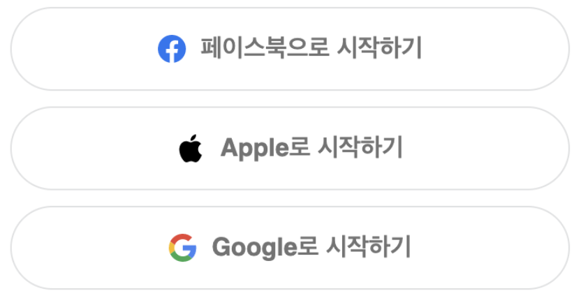
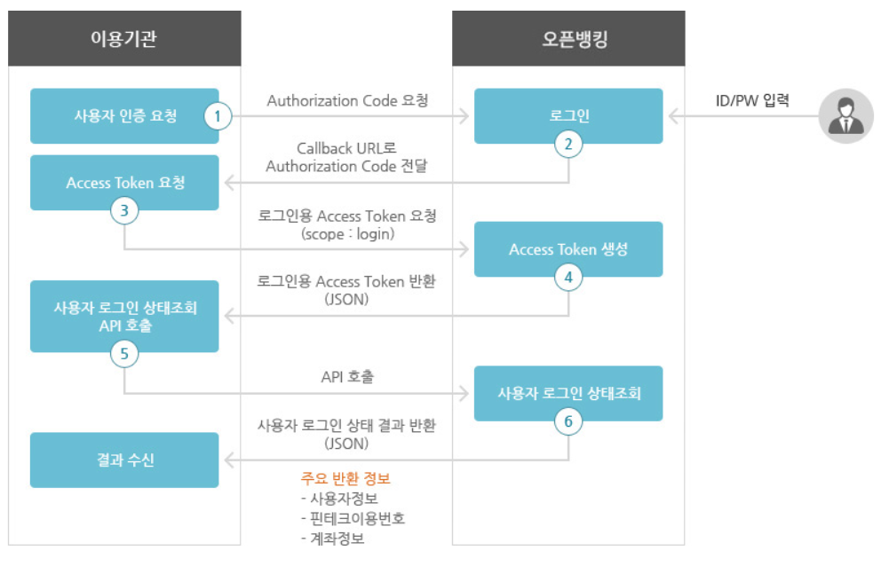

## Table of contents
{: .no_toc .text-delta }

1. TOC
{:toc}
---

- 이 게시글은 아래의 내용을 참고하여 작성하였습니다
  - [Naver D2 - OAuth와 춤을](https://d2.naver.com/helloworld/24942)
  - [생활코딩 - OAuth](https://opentutorials.org/course/3405)
  - [OAuth란?](https://velog.io/@undefcat/OAuth-2.0-%EA%B0%84%EB%8B%A8%EC%A0%95%EB%A6%AC)
  - [우테코 블로그 - OAuth 개념 및 동작 방식 이해하기](https://tecoble.techcourse.co.kr/post/2021-07-10-understanding-oauth/)
  - [Github Docs - OAuth 앱 승인](https://docs.github.com/en/developers/apps/building-oauth-apps/authorizing-oauth-apps)

# OAuth란?
- 사용자가 가입된 서비스의 `API`에 접근하기 위해서는 **사용자로부터 권한을 위임받아야 한다**
  - *쉬운 회원가입 또는 로그인을 위해*
- 이 떄 **사용자의 패스워드 없이도 권한을 위임 받을 수 있는 방법**이 필요하다
- 이를 위해서 고안된 기술이 `OAuth`이다
  - *많은 API들이 OAuth를 통해서 상호 연동을 지원하고 있다*

 

> 다른 서비스의 회원 정보를 **안전하게** 사용하기 위한 방법이라고 생각하면 된다
> 
> 여기에서 **안전하게**의 주체는 , 회원 정보를 가지고 있는 주체 , 우리의 **고객**이다
> 
> 즉 , 우리의 **고객이 안전하게** 다른 서비스의 정보를 우리 서비스에 건네주기 위한 방법이다

# OAuth 참여자
- `OAuth` 동작에 관여하는 참여자는 크게 세 가지로 구분할 수 있다

 

- **Client**
  - **Resource Server**에 접속해서 정보를 가져오고자 하는 클라이언트
  - *Web Application*
- **Resource Server** 
  - `Client`가 제어하고자 하는 자원을 보유하고 있는 서버
  - *Facebook , Google , Twitter* 등..
- **Resource Owner**
  - `Client`가 제공하는 서비스를 통해 로그인하는 실제 유저

# AccessToken
- `OAuth`의 핵심은 **Access Token**이다
  - *임의의 문자열 값*
  - 이 문자열의 정체는 이 **토큰을 발급해준 서비스만 알 수 있다**
    - ***JWT**의 경우 기본정보가 `Base64`인코딩으로 되어 있어서 정보를 살펴볼 수 있긴하지만*
- 이 토큰을 이용해 이 토큰값과 관련된 고객의 정보를 우리는 해당 서비스에 요청할 수 있다
  - **해당 서비스는 이 토큰을 검증하고 , 발급된게 맞다면 해당 고객의 정보를 넘겨준다**
  - 이 토큰의 존재 차제가 **고객이 정보를 넘겨주는 것을 동의함**의 징표라고 할 수 있다

 

> 🙋‍♂️ `티스토리 Open-API 사용하여 게시글 자동 수정`을 한적이 있다
> - *티스토리는 `OAuth 2.0`을 사용하고 있다*
> 
> 1. **인증 요청 및 Authentication code 발급**
>     - `Callback URL`을 설정하고 , `개인 APP ID`를 사용하여 Authentication code를 요청한다
>     - 티스토리의 OAuth 팝업으로 이동되며 [허가하기] 버튼을 클릭한다
>     - 위에서 설정한 `Callback URL`로 `code`에 **Authentication code**가 담겨서 온다
> 2. **Access Token 발급**
>     - 위의 **Authentication code**와 `개인 Secret Key`를 사용하여 **Access Token**을 요청한다
> 
> - [티스토리 Open-API 사용하여 게시글 자동 수정](https://jdalma.github.io/docs/toy-project/tistory-api/)
> - [티스토리 오픈 API](https://tistory.github.io/document-tistory-apis/)
> - [티스토리 오픈 API 앱 관리](https://www.tistory.com/guide/api/manage/list)
> - [결과 게시글](https://write-read.tistory.com/entry/2021?category=904669)
