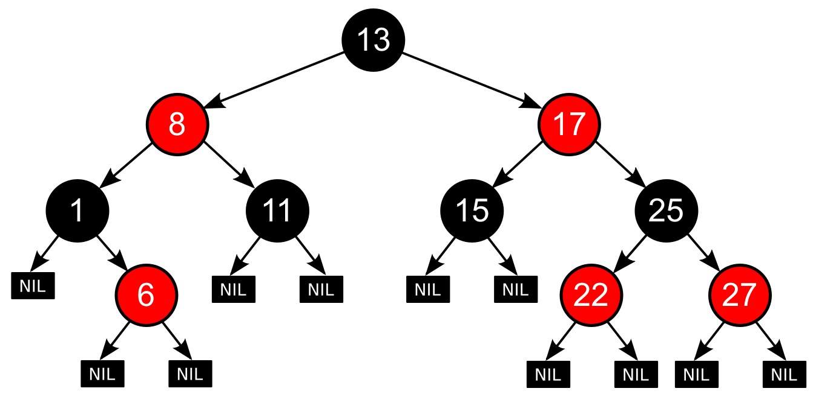
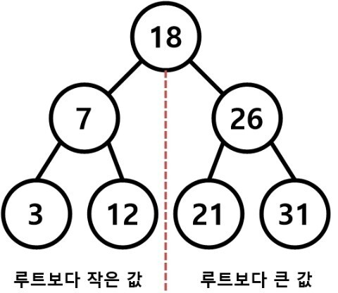
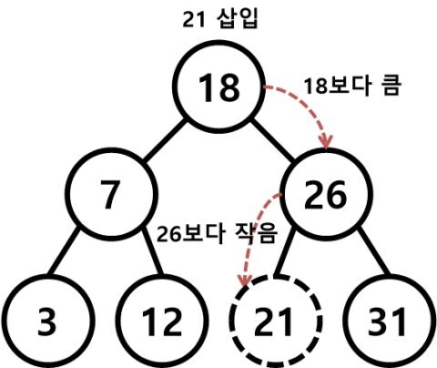
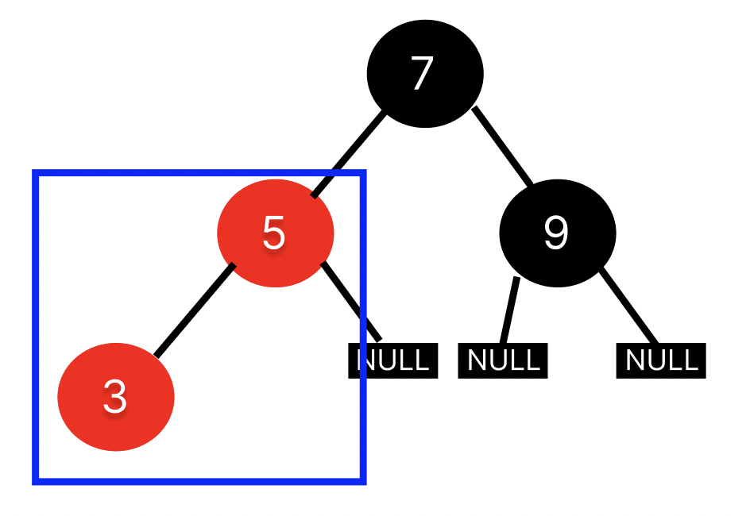
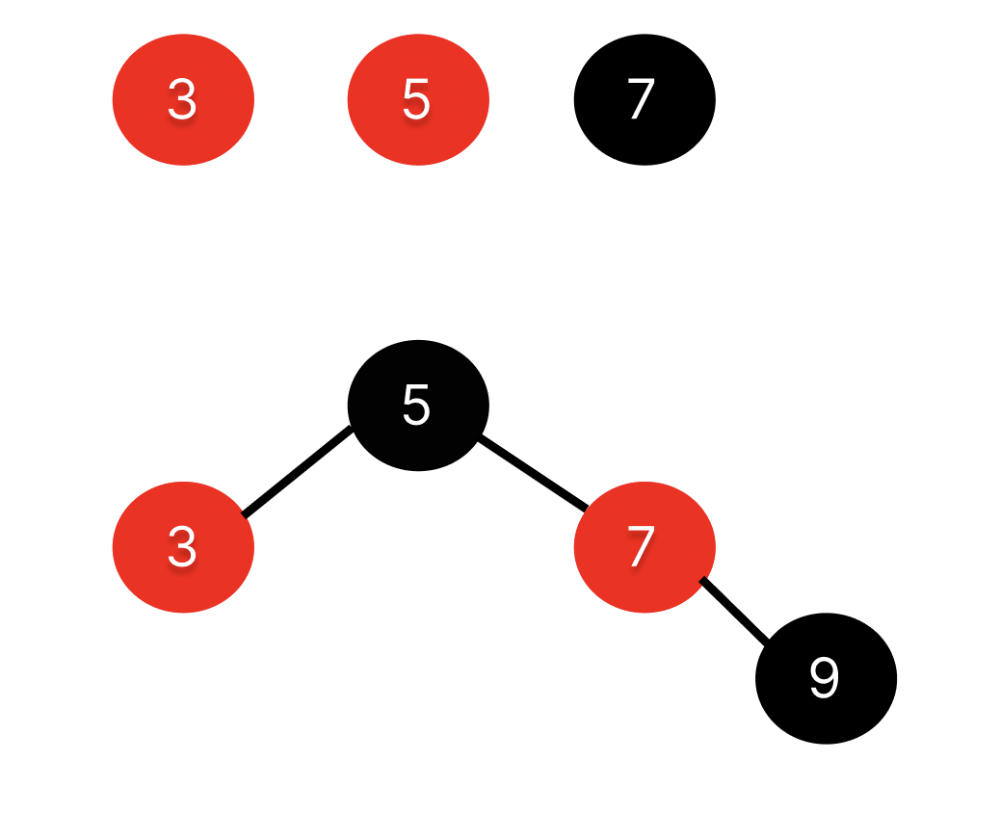
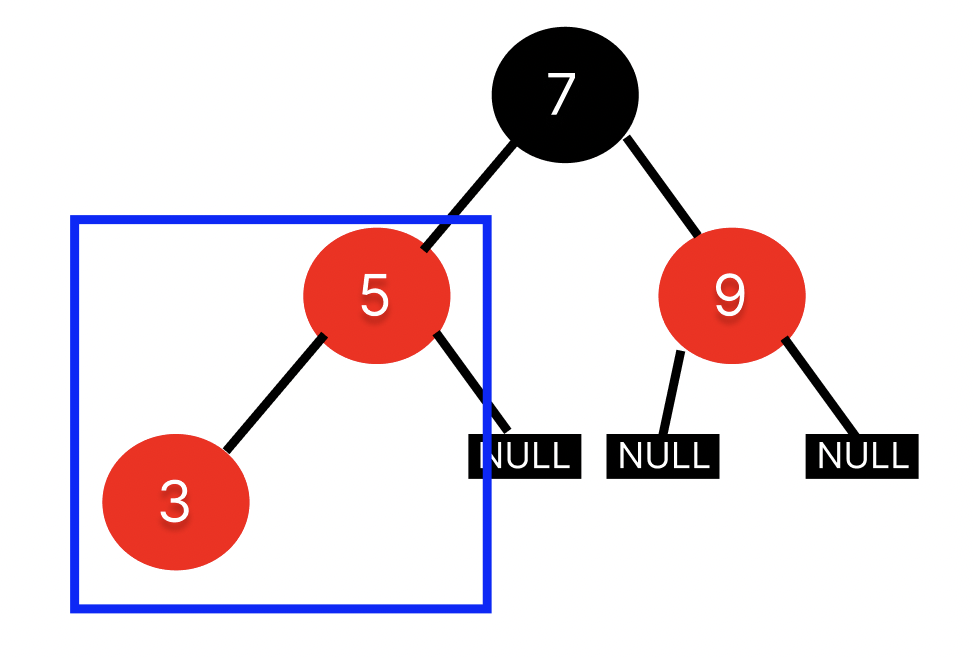
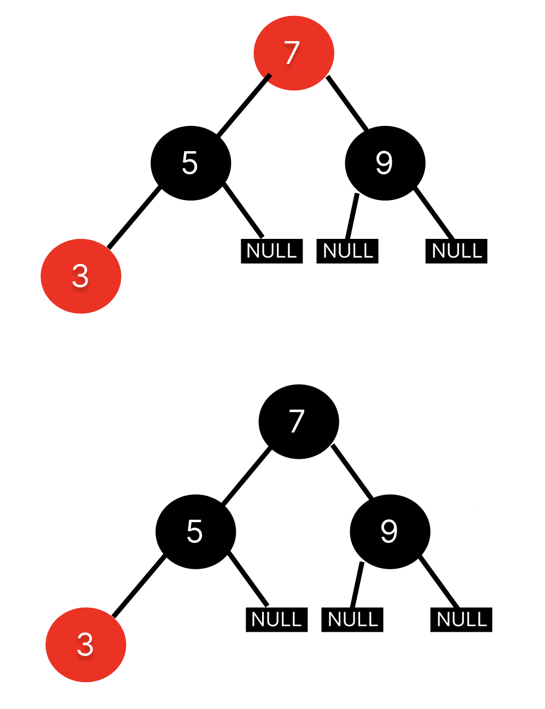
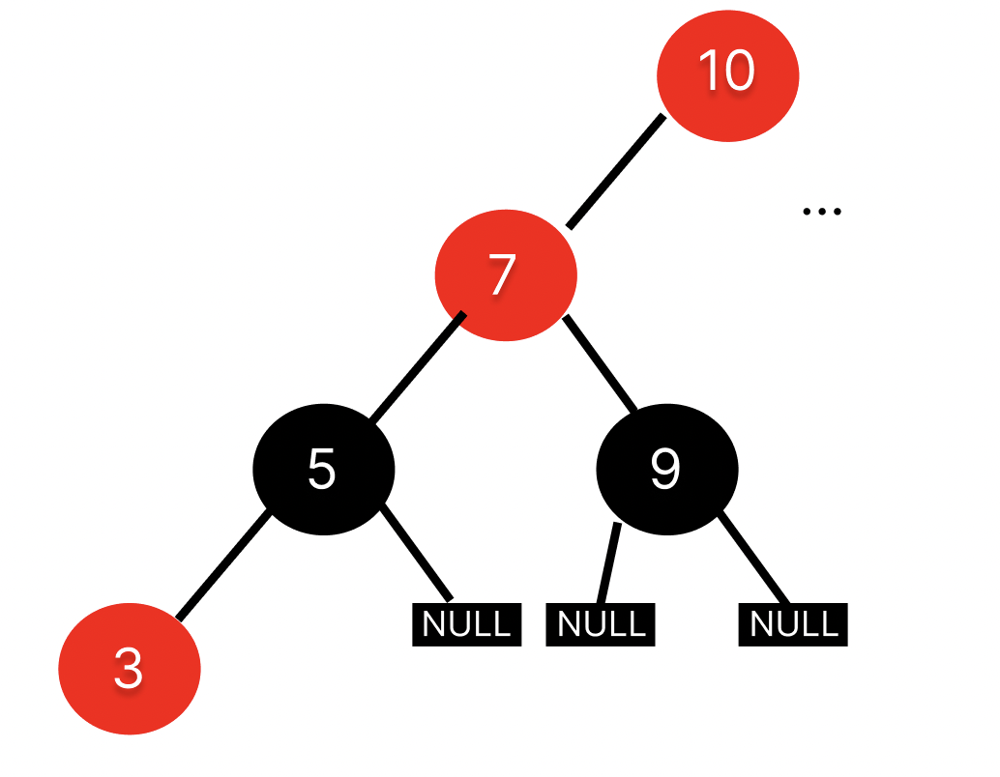

## Table of contents
{: .no_toc .text-delta }

1. TOC
{:toc}
---


- 참고
  - [Zedd, Red-Black Tree](https://zeddios.tistory.com/237)
  - [코딩 인터뷰 완전 분석](http://englishonlineclub.com/pdf/Cracking%20the%20Coding%20Interview%20-%20189%20Programming%20Questions%20and%20Solutions%20(6th%20Edition)%20[EnglishOnlineClub.com].pdf)

# **<span class="text-red-300">Red</span>-<span class="text-grey-dk-300">Black</span> Tree**
- 스스로 균형 잡은 **이진 탐색 트리의 종류**이다
- **`삽입` , `삭제` , `검색` 연산을 충분히 `O(log N)`에 수행하도록 보장한다**



```c
enum Color{ RED, BLACK };
struct RBTNode
{
	struct RBTNode* parent;
	struct RBTNode* left;
	struct RBTNode* right;

	int data;
	enum Color color;	
};
```

1. **모든 노드는 빨간색 혹은 검은색으로 칠해져 있다** 
2. **루트 노드는 검은색이다**
3. **`null`로 표기된 단말 노드는 검은색이다**
4. **모든 <span class="text-red-300">빨간 노드</span>는 두 개의 검은색 노드를 자식 노드로 갖고 있다**
   - *즉 , <span class="text-red-300">빨간 노드</span>가 <span class="text-red-300">빨간 노드</span>를 자식으로 가질 수 없다*
   - *검은색 노드는 검은색 노드를 자식으로 가질 수 있다*
5. **어떤 노드에서 단말 노드까지의 모든 경로에는 `같은 개수의 검은색 자식 노드`가 있어야 한다**

> - *따라서 , **빨간색 노드는 경로상 노드의 절반보다 많을 수 없다***
> - **최악의 경우**에도 **빨간색 노드의 차이는 2배 보다 많지 않다**

# **삽입**
- 일반적인 **이진 탐색 트리의 삽입 연산에서 부터 시작한다**


> 
> - 이진 탐색 트리 삽입 연산
> 1. 탐색 연산을 하여 데이터가 이미 존재하면 데이터를 삽입할 수 없다
> 2. 탐색을 시작하여 탐색을 실패한 위치에 삽입한다
> 

1. 트리가 비었는지 확인한다.
   1. 트리가 비었다면, 검은색 루트 노드를 삽입한다.
   2. 트리가 비어있지 않다면, 빨간색 리프 노드를 삽입한다.
      1. 새 노드의 부모가 검은색이라면, 연산을 마친다.
      2. 새 노드의 부모가 빨간색이면, 새 노드의 부모의 형제를 확인한다.
         1. 새 노드의 부모의 형제가 검은색 혹은 `NULL`이면, **재배치 `Restructuring`** 를 한다.
         2. 새 노드의 부모의 형제가 빨간색이면, **재색칠 `Recoloring`** 을 한다.

## 두 가지의 가능한 속성 위반
1. **<span class="text-red-300">빨간색 위반 `Double Red`</span>**
   - 빨간색 노드가 빨간색 자식 노드를 갖고 있다
   - 혹은 루트가 빨간색이다
2. **검은색 위반**
   - 어떤 경로가 다른 경로보다 더 많은 검색 노드를 갖고 있다

- 삽입된 노드의 색깔은 빨간색이다
- 단말 노드로의 어떤 경로에서도 검은색 노드의 개수를 바꾸지 않았다
  - *따라서 검은색 위반은 새로 발생할 수가 없다*
  - ***하지만 <span class="text-red-300">빨간색 위반</span>은 발생할 수 있다***
- 루트가 빨간색인 특별한 경우에는 , 이 색깔을 검은색으로 바꾸기만 하면 **2번 속성**을 만족할 수 있다
- 그 외의 위반은 **빨간색 노드가 빨간색 자식 노드를 갖고 있는 경우다**

### **Double Red → Restructuring**



- `3`과 `5`가 빨간색 위반이다 , `9`는 검은색이기 때문에 `Restructuring`를 수행한다

1. 나`3` 와 내 부모`5` , 내 조부모`7`를 오름차순으로 정렬
2. 무조건 **가운데 있는 값을 부모로 만들고 나머지 둘을 자식**으로 만든다
3. 올라간 가운데 있는 값을 검정색으로 만들고 , 그 두 자식들을 빨간색으로 만든다



- 📌  
  - `Restructuring`은 다른 서브트리에 영향을 끼치지 않기 때문에 **한번의 `Restructuring`**이면 끝난다
  - `Restructuring`의 자체 시간복잡도는 `O(1)`이지만
    1. 순서결정시간 - 상수시간
    2. 트리로 만드는시간 - 상수시간
    3. 원래있던 노드들의 구조들을 바꿔주는 시간 - 상수시간
    4. **탐색 시간 - `O(logN)`**

### **Double Red → Recoloring**



- `3`과 `5`가 빨간색 위반이다 , `9`는 빨간색 때문에 `Recoloring`을 수행한다

1. 내 부모`5` 와 그 형제 `9`를 검정색으로 하고 내 조부모`7` 를 빨간색으로 한다
2. 내 조부모`7`이 **Root Node**가 아닐시에는 **Double Red**가 다시 발생할 수 있다
3. 내 조부모`7`이 **Root Node**라면 **2번 조건**에 의해 검정색이 된다



- 하지만 여기서 `7`이 **Root Node**가 아니면 여전히 빨간색일 것이다
- 이때 `7`의 부모가 아래 사진 처럼 빨간색 노드라면 **Double Red**가 또 발생한다



- 📌 즉 , `Recoloring`은 **최악의 경우 Root까지 올라갈 수도 있다**
  - **Double Red**를 해결할 수 있는 방법은 `Restructuring` , `Recoloring` 이였는데 이 행위를 **Root**까지 할 가능성도 있다는 것