## Table of contents
{: .no_toc .text-delta }

1. TOC
{:toc}
---

- 이 글은 아래의 내용을 발췌하여 작성하였습니다
  - [[Network] TCP / UDP의 개념과 특징, 차이점](https://coding-factory.tistory.com/614)
  - [TCP/IP 전송 계층(트랜스포트 계층)과 포트(Port) 번호](https://better-together.tistory.com/134)
  - [TCP와 UDP의 특징과 차이](https://mangkyu.tistory.com/15)
  - [우테코 - 르윈 TCP , UDP](https://www.youtube.com/watch?v=ikDVGYp5dhg)
  - [TCP/IP와 OSI 7 레이어의 차이점](https://velog.io/@pixelstudio/TCPIP%EC%99%80-OSI-7-%EB%A0%88%EC%9D%B4%EC%96%B4%EC%9D%98-%EC%B0%A8%EC%9D%B4%EC%A0%90)
  - [TCP/IP 프로토콜](http://jkkang.net/unix/netprg/chap1/net1_2.html)
- 추가로 읽을 것
  - [TCP/IP 프로토콜과 패킷 교환 방식](https://better-together.tistory.com/110?category=887984)

> **프로토콜이란?**
> 
> 컴퓨터 내부에서, 또는 컴퓨터 사이에서 **데이터의 교환 방식을 정의하는 규칙 체계**입니다. 
> 
> 기기 간 통신은 교환되는 데이터의 형식에 대해 상호 합의를 요구합니다. 
> 
> 이런 **형식을 정의하는 규칙의 집합**을 `프로토콜`이라고 합니다. 

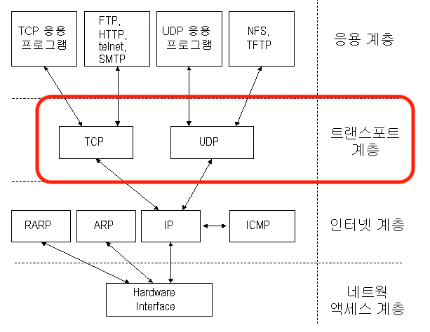

# 전송 계층
- 네트워크 **인터페이스 계층**과 **인터넷 계층**의 역할로 **수신지 컴퓨터 까지 데이터를 보낼 수 있다**
  - *특히 인터넷 계층의 `IP 프로토콜`은 수많은 네트워크가 복잡하게 얽힌 인터넷에서 **수신지 컴퓨터까지 경로를 찾아 패킷을 전송하는 중요한 역할**을 한다*

- **인터넷 계층**이 패킷 전송이라는 중요한 역할을 담당하지만 , `수신지까지 최적의 경로를 찾아 패킷을 전송할 뿐` 아래의 사항은 신경쓰지 않는다
  1. 수신지 컴퓨터가 인터넷에 존재하는지,
  2. 수신지 컴퓨터가 존재하더라도 패킷을 수신할 준비가 되어 있는지,
  3. 준비가 되어 있더라도 전송 과정에서 패킷이 손상되거나 유실되지 않았는지
- 즉 **인터넷 계층**의 `IP 프로토콜`은 전송 순서나 완전성을 보장하지 않기 때문에 **비신뢰형 서비스** `unreliable service`라고도 한다

 

- 📌 **패킷이 전송 과정에서 아무 문제 없이 제대로 수신지 컴퓨터에 도착할 수 있도록 패킷 전송을 제어하는 역할은 `전송 계층`이 담당한다**
  - 네트워크 혼잡 상황에 따라 패킷의 전송량을 조절하여 **패킷의 흐름을 제어**하고 ,
  - **패킷 전송의 오류를 점검**해서 수신지 컴퓨터까지 패킷이 제대로 도착했는지 확인하는 역할을 한다
- 다양한 애플리케이션이 동작하는 컴퓨터 내에서 어떤 애플리케이션이 사용하는 데이터인지 식별하여 수신지 컴퓨터에 **도착한 데이터를 수신지 컴퓨터 내의 애플리케이션에 배분하는 역할도 한다**
  - **인터넷 계층**이 호스트를 식별하기 위해 `IP 주소`를 사용하는 것 처럼 , **전송 계층**에서는 `포트 번호`를 사용한다
 
 

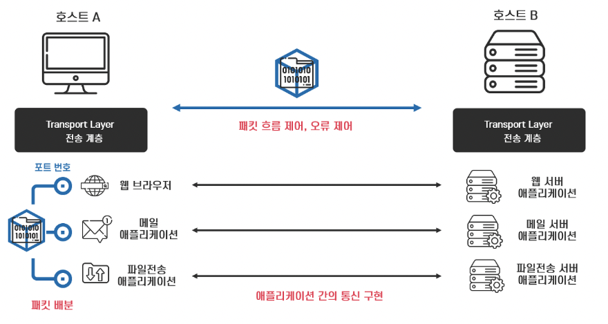

# 전송 계층의 통신 방식과 프로토콜
- **신뢰할 수 있고 정확한 데이터를 전달하는 통신**을 `연결형 통신`
  - 상대방과 확인해 가면서 통신하는 방식 
- **효율적으로 데이터를 전송하는 통신**을 `비연결형 통신`
  - 상대방의 확인을 거치지 않고 일방적으로 데이터를 전송하는 방식
- 보통 데이터의 정확성과 신뢰성이 중요한 웹이나 이메일에서는 `연결형 통신`
- 동영상 같이 빠른 데이터 전송에는 `비연결형 통신`

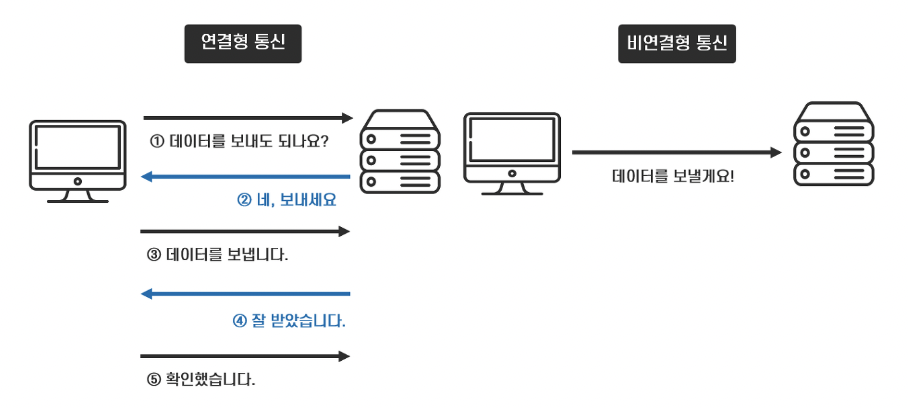

# TCP 프로토콜 `Transmission Control Protocol`
- 신뢰할 수 있고 정확한 데이터를 전달하기 위해 `연결형 통신`을 사용하는 프로토콜
- **TCP 프로토콜**은 
  1. 데이터를 패킷이라는 여러 개의 작은 조각으로 분할하고, 
  2. 패킷의 전송 속도를 조절하며, 
  3. 패킷이 수신지까지 제대로 전송되는지 확인한다 
     - *인터넷 계층에서 각각 독립적으로 전송되는 패킷은 네트워크의 혼잡도와 라우팅에 따라 `송신되는 순서와 수신되는 순서가 서로 다를 수 있다`* 
  4. 모든 패킷이 수신지에 제대로 도착했는지 확인하고 
  5. 수신한 데이터의 순서를 송신한 순서대로 재설정하여 패킷들을 재조립함으로써 전체 데이터가 올바르게 전송되도록 한다

## 패킷 분할과 조립 `세그먼트`

- 전송 계층의 **TCP 프로토콜**이 **응용 계층**의 데이터 단위인 `메시지`를 받아 작은 **조각으로 분할한 데이터 단위를 `세그먼트`** 라고 한다
  - 즉, TCP 프로토콜에 따라 **분할된 데이터에 `TCP 헤더`가 붙어 캡슐화된 전송 계층의 패킷이 세그먼트이다**
- 분할된 데이터에 **순서 번호 (Sequence Number)** 를 부여하여 **전송 과정에서 순서가 바뀌더라도 수신지에서 원래의 데이터로 재조립 할 수 있다**

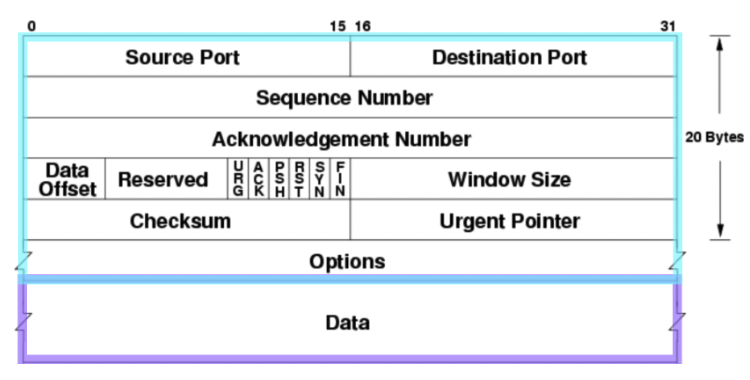

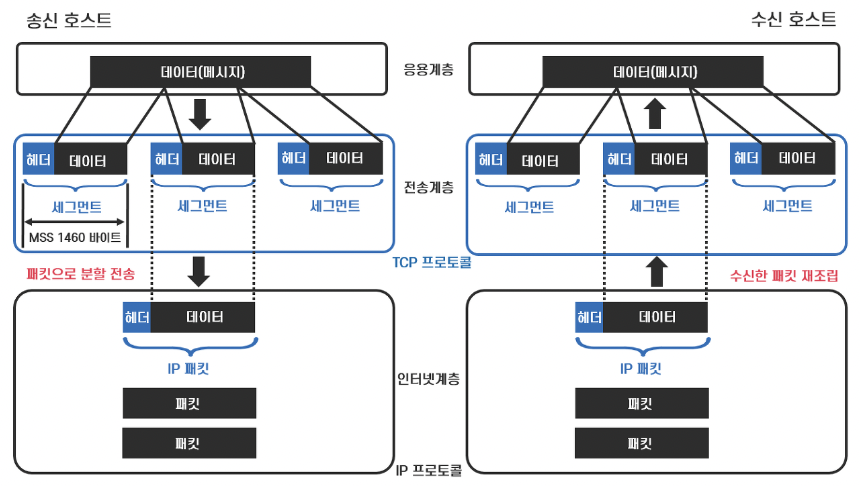

- `MSS` (Maximum Segment Size)
  - TCP에서 데이터를 분할하는 단위
  - 표준 크기는 `1460바이트`

## 통신 과정 

- TCP 프로토콜은 데이터를 전송하기 전에 먼저 **상대방이 데이터를 수신할 수 있는지 여부를 확인하여 상대방과의 연결을 확립한 후 통신을 시작**한다
- `①` 정상적인 통신이 가능한 상태인지를 확인하는 연결(또는 커넥션, connection) 확립에서 시작하여 
- `②` 데이터를 전송하고 
- `③` 연결을 해제하는 과정을 순차적으로 거치게 된다

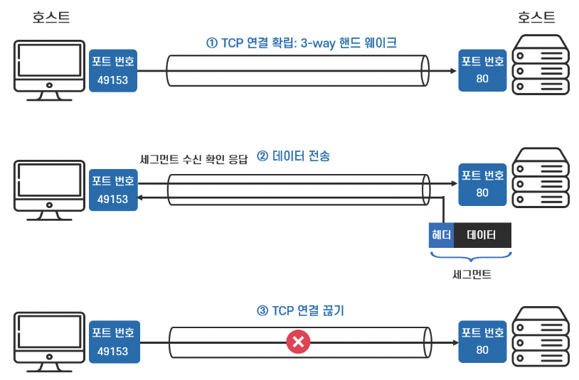

### `①` 연결 확립 `3-way handshake`

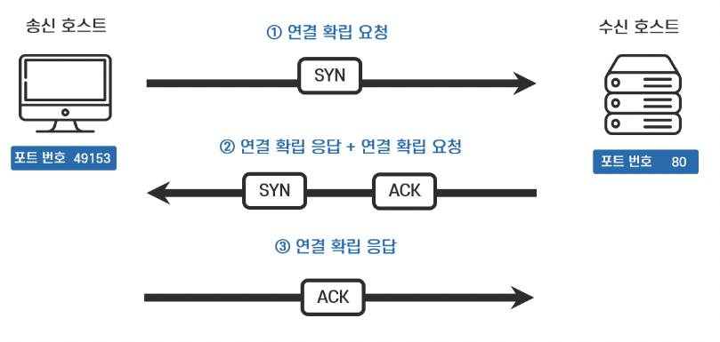

- `3-way handshake`에 의한 연결 확립 과정에서 송신 호스트와 수신 호스트의 상호 합의 하에 **MSS를 결정**
  - *각 호스트는 연결 확립 요청을 보낼 때 TCP헤더에 MSS 옵션을 붙여 자신의 통신 환경에 적합한 MSS를 통지한다* 
  - *양쪽의 값 중 적은 쪽의 값이 MSS로 사용된다*
- **MSS**에 크기에 맞춰 데이터를 분할하여 패킷을 만든다 
- 분할된 데이터가 몇 번째 데이터인지 알려 주는 역할을 하는 순서 번호의 초기값도 연결 확립이 이루어질 때 32비트로 구성된 임의의 숫자로 결정된다

### `②` 데이터 전송
- `3-way handshake`로 송신 호스트와 수신 호스트 사이에 연결 확립이 되면 데이터를 전송할 수 있는 연결 통로가 만들어진다
-  연결 확립 상태에서 송신 호스트가 데이터를 전송하면 **데이터를 수신한 호스트는 반드시 데이터 도착 여부를 확인해서 송신 호스트에게 알려준다**
   - 수신 호스트가 확인 응답 `ACK`을 보낸다 **데이터 도착의 신뢰성**
   - 확인 응답은 수신 호스트가 몇 번째 데이터를 수신했는지, 다음에 전송할 데이터는 몇 번째 데이터인지 알려주는 확인 응답 번호 `acknowledgement number`로 이루어진다

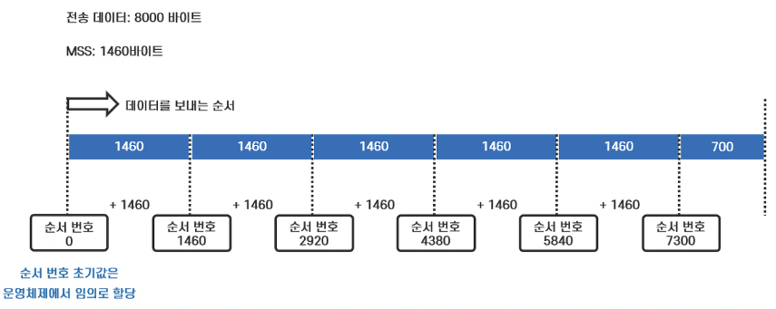

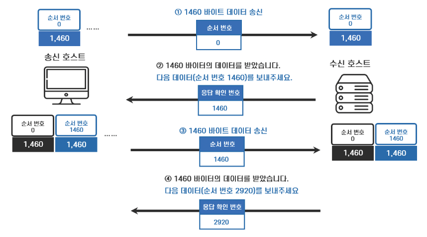

- 데이터 전송 과정에 오류가 발생해서 **수신 호스트에 데이터가 도착하지 않을 경우 수신 호스트는 확인 응답 번호를 반환하지 않는다**
- 송신 호스트는 수신 호스트의 **확인 응답을 일정 시간 기다리다가 확인 응답이 오지 않을 경우 데이터를 재전송하여 데이터 전송의 신뢰성을 확보한다**

### `③` 연결 해제

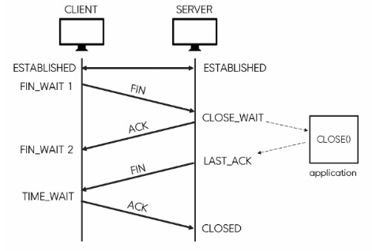

# TCP 흐름 제어
- 통신의 신뢰성 확보를 위해 **하나의 패킷(`세그먼트`)**을 전송할 때마다 확인 응답을 거치면, 송신 호스트는 확인 응답이 돌아올 때까지의 시간 동안 아무 일도 하지 않고 기다리기 때문에 패킷의 전송 속도가 지연된다
- 통신에서 신뢰성만큼 중요한 것이 통신 속도이기에 TCP는 **흐름 제어(flow control)** 를 통해 전송 효율을 높이고 있다

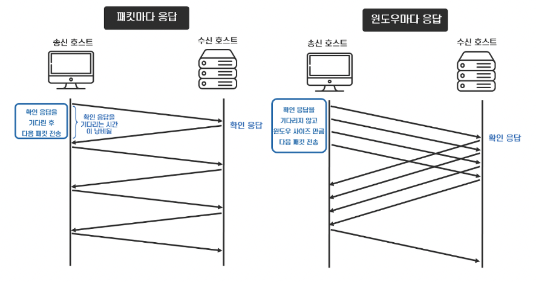

- **여러 패킷을 한꺼번에 연속해서 전송한 후 확인 응답을 받음으로써 전송 효율을 높이는 것**
- 확인 응답을 기다리지 않고 송신할 수 있는 데이터의 크기를 **윈도우 사이즈(window size)** 라고 한다
  - 데이터를 전송할 때 한 번에 전송할 수 있는 **전체 패킷의 크기를 의미**
- 송신 호스트는 윈도우 사이즈만큼 수신 호스트의 확인 응답을 기다리지 않고 패킷을 보낼 수 있다

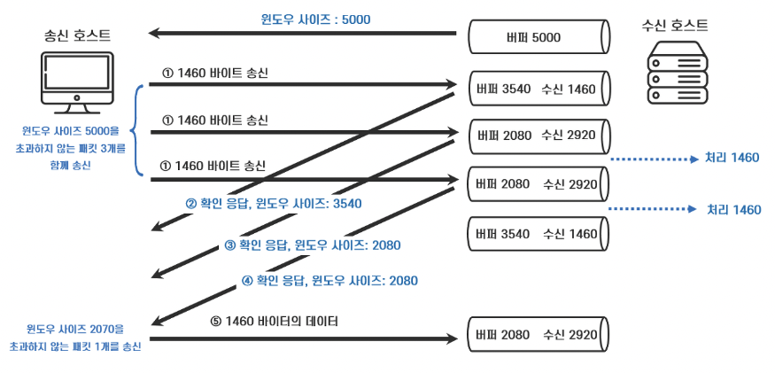

- **윈도우 사이즈**는 수신 호스트가 한 번에 받아낼 수 있는, 다시 말해 수신 가능한 버퍼*의 크기가 되어야 한다
  - *`버퍼(Buffer)`는 컴퓨터 메모리 상에 위치하여 송수신하는 패킷을 일시적으로 저장하는 장소를 뜻한다*
- 수신 호스트가 데이터를 수신하는 속도가 느려지는 경우 처리할 수 없는 데이터가 넘쳐흐르는 **오버플로(over flow)** 문제가 발생하기 때문에 **크기는 수신 호스트의 상황에 따라 변경되어야 한다**
  - 따라서, **윈도우 사이즈**는 수신 호스트가 결정해야 하며, **수신 호스트의 상황이 수시로 반영되어야 효율적인 통신을 할 수 있게 된다**
- **윈도우 사이즈**는 `3-way handshake`에 의한 연결 확립 시 수신 호스트가 초기값을 결정하며 수신 호스트는 확인 응답을 보낼 때 TCP 헤더에 윈도우 사이즈를 지정하여 현재 어느 정도까지 수신이 가능한지를 수시로 알려준다 
- 이렇게 **TCP는 수신 호스트가 윈도우 크기를 변경하는 방법으로 송신 호스트에게 데이터 전송량을 지시함으로써 데이터의 흐름을 제어하고 전송 효율을 높인다**

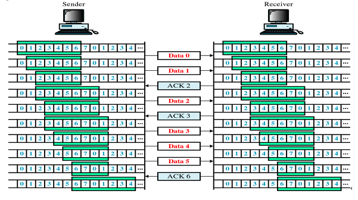

## TCP 오류 제어

> `ARQ(Automatic Repeat Request)` : 신뢰성있는 데이터 전달을 위해 재전송을 기반으로한 에러 제어 방식
> 
> ARQ 기법을 사용해 프레임이 손상되었거나 손실되었을 경우 재전송을 통해 오류를 복구한다

1. **Stop and Wait ARQ**
   - 데이터나 `ACK`가 분실되었을 경우 일정 간격의 시간을 두고 타임아웃이 되면 송신측은 데이터를 재전송한다

2. **Go Back n ARQ**
   - 전송된 프레임이 손상되거나 분실된 경우, 확인된 마지막 프레임 이후로 모두 재전송하는 기법이다

## TCP 혼잡 제어
- 송신측의 데이터는 지역망이나 인터넷으로 연결된 대형 네트워크를 통해 전달된다
- 만약 한 라우터에 데이터가 몰릴 경우 , 자신에게 온 데이터를 모두 처리할 수 없게 된다
- 이런 경우 호스트들은 또 다시 재전송을 하게 되고 결국 혼잡만 가중 시켜 오버플로우나 데이터 손실을 발생시키게 된다
- 이러한 네트워크의 혼잡을 피하기 위해 **송신측에서 보내는 데이터의 전송속도를 강제로 줄이는 것을 `혼잡 제어`**라고 한다
- **흐름제어**는 `송 수신 측 사이의 패킷 수를 제어하는 기능`이고, **혼잡제어**는 `네트워크 내의 패킷 수를 조절하여 네트워크의 오버플로우를 방지하는 기능`이다

### AIMD (Additive Increse/Multicative Decrease)
- 우리 말로 직역하면 **합 증가/곱 감소 방식** 
- AIMD 방식은 처음에 **패킷을 하나씩 보내고 문제 없이 도착하면 윈도우의 크기를 1씩 증가시켜가며 전송한다** 
- 만약, **전송에 실패하면 윈도우 크기를 반으로 줄인다**
- 윈도우 크기를 너무 조금씩 늘리기 때문에 네트워크의 모든 대역을 활용하여 **제대로 된 속도로 통신하기까지 시간이 오래 걸린다는 단점이 있다**

### Slow Start
- 위에서 이야기했듯이 AIMD 방식은 **윈도우 크기를 선형적으로 증가시키기 때문에, 제대로된 속도가 나오기까지 시간이 오래 걸린다** 
- 반면, Slow Start는 **윈도우의 크기를 1, 2, 4, 8, ...과 같이 지수적으로 증가시키다가 혼잡이 감지되면 윈도우 크기를 1로 줄이는 방식이다**
- 이 방식은 보낸 데이터의 ACK가 도착할 때마다 윈도우 크기를 증가시키기 때문에 처음에는 윈도우 크기가 조금 느리게 증가할지라도, 시간이 가면 갈수록 윈도우 크기가 점점 빠르게 증가한다는 장점이 있다

### 빠른 재전송 (Fast Retransmit)
- 패킷을 받는 수신자 입장에서는 **세그먼트로 분할된 내용들이 순서대로 도착하지 않는 경우가 생길 수 있다** 
- 이런 상황이 발생했을 때 **수신 측에서는 순서대로 잘 도착한 마지막 패킷의 다음 순번을 ACK 패킷에 실어서 보낸다** 
- 그리고 이런 **중복 ACK를 3개 받으면** 재전송이 이루어진다 
- 송신 측은 자신이 설정한 타임 아웃 시간이 지나지 않았어도 바로 해당 패킷을 재전송할 수 있기 때문에 보다 빠른 재전송률을 유지할 수 있다

 

> ✋ `3 Ack Duplicate`

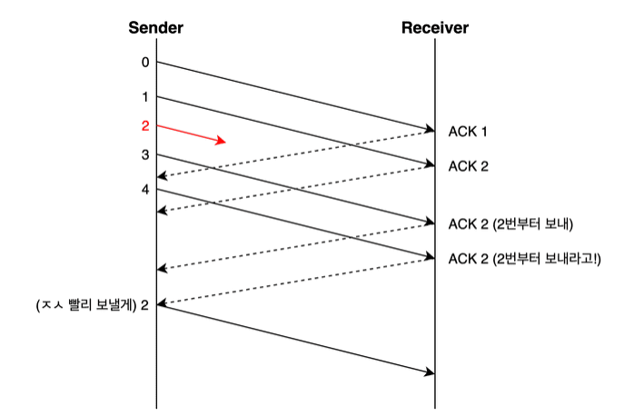

## 빠른 회복 (Fast Recovery)
- 빠른 회복은 혼잡한 상태가 되면 **윈도우 크기를 1로 줄이지 않고 반으로 줄이고 선형 증가시키는 방법이다** 
- **이 방법을 적용하면 혼잡 상황을 한 번 겪고나서부터는 `AIMD` 방식으로 동작한다**

# UDP 프로토콜 `User Diagram Protocol`

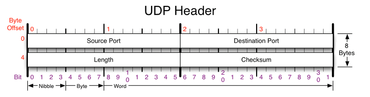

- **Source Port** : 시작포트
- **Destination Port** : 도착지 포트
- **Length** : 길이
- **Checksum** : 오류검출
- UDP는 흐름제어, 오류제어 또는 손상된 세그먼트의 수신에 대한 재전송을 하지 않는다 

## Checksum
- **Sender**
  - `16bit` 정수형
  - 전송 전 `checksum`에 0이 저장되어 있다
  - **Source Port** , **Destination Port** , **Length** , **Application Data** 를 모두 더한다
  - 위의 더한 값에 **1의 보수**를 취한 값을 `checksum`에 저장하여 **Receiver**에게 전송한다
- **Receiver**
  - 받은 패킷의 헤더 내용 **Source Port** , **Destination Port** , **Length** , **Application Data** 를 모두 더한 뒤 `checksum`과 더한다
  - 위의 `checksum`을 전송한다
    - *1이 아니라면 전송 과정에서 에러가 발생한 것*

> ✋ Sender의 `checksum`을 제외한 데이터를 더한 것이 **1110**인 경우
> 
> Sender가 Receiver에 보내는 `checksum`은 **0001**이다.(1의 보수 취함)
> 
> **데이터 손실이 없을 경우**
> - Receiver가 받은 데이터 값을 모두 더하면 **1110**이고 **`checksum`(0001)과 더하면 1111**이다
> 
> **데이터 손실 있는 경우**
> - Receiver가 받은 데이터 값을 모두 더하면 **1010**이고 **`checksum`(0001)과 더하면 1011**이다
> 
> *위에서 말하는 데이터 값들은 **Source Port** , **Destination Port** , **Length** , **Application Data**를 의미*