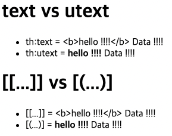

## Table of contents
{: .no_toc .text-delta }

1. TOC
{:toc}
---

- [공식 사이트](https://www.thymeleaf.org/)
  - [기본 기능](https://www.thymeleaf.org/doc/tutorials/3.0/usingthymeleaf.html)
  - [스프링 통합](https://www.thymeleaf.org/doc/tutorials/3.0/thymeleafspring.html)
  - [유틸리티 객체](https://www.thymeleaf.org/doc/tutorials/3.0/usingthymeleaf.html#expression-utility-objects)
  - [유틸리티 객체 예시](https://www.thymeleaf.org/doc/tutorials/3.0/usingthymeleaf.html#appendix-b-expression-utility-objects)
  - [URL](https://www.thymeleaf.org/doc/tutorials/3.0/usingthymeleaf.html#link-urls)

```html
<html xmlns:th="http://www.thymeleaf.org">
```


# **기본 기능**

```
- 간단한 표현
  - 변수 표현식: ${...}
  - 선택 변수 표현식: *{...}
  - 메시지 표현식: #{...}
  - 링크 URL 표현식: @{...}
  - 조각 표현식: ~{...}
- 리터럴
  - 텍스트: 'one text', 'Another one!' , ...
  - 숫자: 0, 34, 3.0, 12.3,...
  - 불린: true, false
  - 널: null
  - 리터럴 토큰: one, sometext, main,...
- 문자 연산:
  - 문자합치기:+
  - 리터럴 대체: |The name is ${name}|
- 산술 연산:
  - Binary operators: +, -, *, /, %
  - Minus sign (unary operator): - 
- 불린 연산:
  - Binary operators: and, or
  - Boolean negation (unary operator): !, not 
- 비교와 동등:
  - 비교:>,<,>=,<=(gt,lt,ge,le)
  - 동등 연산: ==, != (eq, ne)
- 조건 연산:
  - If-then: (if) ? (then)
  - If-then-else: (if) ? (then) : (else)
  - Default: (value) ?: (defaultvalue)
- 특별한 토큰:
    - No-Operation: _
```

## [text , utext](https://github.com/jdalma/thymeleaf-basic/pull/1/commits/a3190a395326674f67dbb5dc6ec1ab6d0e3bde22)
- 텍스트 출력
  
```html
  <li>th:text 사용 <span th:text="${data}"></span></li>
  <li>컨텐츠 안에서 직접 출력하기 = [[${data}]]</li>
```

### Escape
- HTML문서는 `<` , `>`같은 특수 문자를 기반으로 정의 되기 때문에 , **뷰 템플릿으로 HTML 화면을 생성할 때는 출력하는 데이터에 이러한 특수 문자가 있는 것을 주의해서 사용해야 한다**
- 타임리프가 제공하는 `th:text` , `[[...]]`는 **기본적으로 이스케이프를 제공한다**
- `<b>hello !!!!</b>` 의도와 다르게 `<b></b>`태그가 HTML에 뿌려졌다

```html
th:text 사용 <b>hello !!!!</b>
컨텐츠 안에서 직접 출력하기 = <b>hello !!!!</b>
```

- **HTML 엔티티**
  - 웹 브라우저는 `<`를 HTML의 시작으로 인식한다
  - 따라서 `<`를 태그의 시작이 아니라 **문자로 표현할 수 있는 방법을 HTML 엔티티**라고 한다
  - 이렇게 **HTML에서 사용하는 특수 문자를 HTML 엔티티로 변경하는 것을 `Escape`라 한다** 

### Unescape
- Escape기능을 사용하지 않으려면 `utext` 기능을 사용하자 
  - `th:text` → `th:utext`
  - `[[...]]` → `[(...)]`



***

## [변수 SpringEL](https://github.com/jdalma/thymeleaf-basic/pull/1/commits/166449e9184fa4c12ddef51aa80168bf4e74ab6d)

```
Object
${user.username} = userB
${user['username']} = userB
${user.getUsername()} = userB

List
${users[0].username} = userA
${users[0]['username']} = userA
${users[0].getUsername()} = userA

Map
${userMap['userA'].username} = userA
${userMap['userA']['username']} = userA
${userMap['userA'].getUsername()} = userA
```

### 지역변수 선언 `th:width`

- `th:width`가 선언된 **div**태그 내에서만 사용 가능하다

```html
<div th:with="first=${users[0]}">
    <p>처음 사람의 이름은 <span th:text="${first.username}"></span></p>
</div>
```

***

## [기본 객체들 `request` , `session`...](https://github.com/jdalma/thymeleaf-basic/pull/1/commits/b8e16a64ac31b3ab5210ef793011669f504b10b3)

```html
<h1>식 기본 객체 (Expression Basic Objects)</h1>
<ul>
    <li>request = <span th:text="${#request}"></span></li>
    <li>response = <span th:text="${#response}"></span></li>
    <li>session = <span th:text="${#session}"></span></li>
    <li>servletContext = <span th:text="${#servletContext}"></span></li>
    <li>locale = <span th:text="${#locale}"></span></li>
</ul>

<h1>편의 객체</h1>
<ul>
    <!-- 타임리프는 쿼리 파라미터도 직접 꺼낼 수 있다 -->
    <li>Request Parameter = <span th:text="${param.paramData}"></span></li>
    
    <li>session = <span th:text="${session.sessionData}"></span></li>

    <!-- Spring Bean에 직접 접근 가능하다 -->
    <li>spring bean = <span th:text="${@helloBean.hello('Spring!')}"></span></li>
</ul>
```

## [유틸리티 객체와 날짜](https://github.com/jdalma/thymeleaf-basic/pull/1/commits/1fea67fb3c19d4f8ab111211d47eb3dc5bae42a0)

- `#message` : 메시지, 국제화 처리
- `#uris` : URI 이스케이프 지원
- `#dates` : java.util.Date 서식 지원 
- `#calendars` : java.util.Calendar 서식 지원 
- `#temporals` : 자바8 날짜 서식 지원
- `#numbers` : 숫자 서식 지원
- `#strings` : 문자 관련 편의 기능
- `#objects` : 객체 관련 기능 제공
- `#bools` : boolean 관련 기능 제공
- `#arrays` : 배열 관련 기능 제공
- `#lists` , `#sets` , `#maps` : 컬렉션 관련 기능 제공 
- `#ids` : 아이디 처리 관련 기능 제공 🚩

### 자바 8 날짜
- 자바 8의 `LocalDate` , `LocalDateTime` , `Instant`를 사용하려면 추가 라이브러리가 필요하다
  - *스프링 부트 타임리프를 사용하면 해당 라이브러리가 자동으로 추가되고 통합된다*
  - *`thymeleaf-extras-java8time`*

```
LocalDateTime
  default = 2022-06-13T18:43:46.363332
  yyyy-MM-dd HH:mm:ss = 2022-06-13 18:43:46

LocalDateTime - Utils
  ${#temporals.day(localDateTime)} = 13
  ${#temporals.month(localDateTime)} = 6
  ${#temporals.monthName(localDateTime)} = 6월
  ${#temporals.monthNameShort(localDateTime)} = 6월
  ${#temporals.year(localDateTime)} = 2022
  ${#temporals.dayOfWeek(localDateTime)} = 1
  ${#temporals.dayOfWeekName(localDateTime)} = 월요일
  ${#temporals.dayOfWeekNameShort(localDateTime)} = 월
  ${#temporals.hour(localDateTime)} = 18
  ${#temporals.minute(localDateTime)} = 43
  ${#temporals.second(localDateTime)} = 46
  ${#temporals.nanosecond(localDateTime)} = 363332000
```

## [URL 링크](https://github.com/jdalma/thymeleaf-basic/pull/1/commits/f75387f90496c1933f63db1a73c43b32a71fe336)

```html
<li><a th:href="@{/hello}">basic url</a></li>
  → [http://localhost:8080/hello]

<li><a th:href="@{/hello(param1=${param1}, param2=${param2})}">hello query param</a></li>
  → [http://localhost:8080/hello?param1=data1&param2=data2]
  → ()에 있는 부분은 쿼리파라미터로 처리된다

<li><a th:href="@{/hello/{param1}/{param2}(param1=${param1}, param2=${param2})}">path variable</a></li>
  → [http://localhost:8080/hello/data1/data2]
  → 바인딩 될 곳이 있다면 ()부분은 경로 변수로 처리된다

<li><a th:href="@{/hello/{param1}(param1=${param1}, param2=${param2})}">path variable + query parameter</a></li>
  → [http://localhost:8080/hello/data1?param2=data2]
  → param2는 바인딩 될 곳이 없어서 쿼리파라미터로 붙는다
```

## [리터럴](https://github.com/jdalma/thymeleaf-basic/pull/1/commits/7ff090ecbd7b621e442eba14bef0e7809182aa9a)

- **텍스트** : 'one text', 'Another one!' , ...
- **숫자** : 0, 34, 3.0, 12.3,...
- **불린** : true, false
- **널** : null
- **리터럴 토큰** : one, sometext, main,...
- **문자 리터럴**은 항상 `'`(작은 따옴표)로 감싸야한다
  - *하지만 공백없이 쭉 이어진다면 하나의 토큰으로 인지한다*
  - **룰** : `A-Z` , `a-z` , `0-9` , `[]` , `.` , `-` , `_` 

```html
<!--주의! 다음 주석을 풀면 예외가 발생함-->
<!--    <li>"hello world!" = <span th:text="hello world!"></span></li>-->
<li>'hello' + ' world!' = <span th:text="'hello' + ' world!'"></span></li>
<li>'hello world!' = <span th:text="'hello world!'"></span></li>
<li>'hello ' + ${data} = <span th:text="'hello ' + ${data}"></span></li>
<li>리터럴 대체 |hello ${data}| = <span th:text="|hello ${data}|"></span></li>

'hello' + ' world!' = hello world!
'hello world!' = hello world!
'hello ' + ${data} = hello Spring
리터럴 대체 |hello ${data}| = hello Spring
```

## [연산](https://github.com/jdalma/thymeleaf-basic/pull/1/commits/bd7f8ddacafea9344272f776c67906553abffa2c)

- 타임리프 연산은 자바와 크게 다르지 않다
  - HTML에서 사용하기 때문에 **HTML 엔티티**만 주의하자
  - `>` (gt), `<` (lt), `>=` (ge), `<=` (le), `!` (not), `==` (eq), `!=` (neq, ne)

```html
<li>산술 연산
    <ul>
        <li>10 + 2 = <span th:text="10 + 2"></span></li>
        <li>10 % 2 == 0 = <span th:text="10 % 2 == 0"></span></li>
    </ul>
</li>
<li>비교 연산
    <ul>
        <li>1 > 10 = <span th:text="1 &gt; 10"></span></li>
        <li>1 gt 10 = <span th:text="1 gt 10"></span></li>
        <li>1 >= 10 = <span th:text="1 >= 10"></span></li>
        <li>1 ge 10 = <span th:text="1 ge 10"></span></li>
        <li>1 == 1 = <span th:text="1 == 10"></span></li>
        <li>1 != 1 = <span th:text="1 != 10"></span></li>
    </ul>
</li>
<li>조건식
    <ul>
        <li>(10 % 2 == 0)? '짝수':'홀수' = <span th:text="(10 % 2 == 0)? '짝수':'홀수'"></span></li>
    </ul>
</li>
<li>Elvis 연산자
    <ul>
        <li>${data}?: '데이터가 없습니다.' = <span th:text="${data}?: '데이터가 없습니다.'"></span></li>
        <li>${nullData}?: '데이터가 없습니다.' = <span th:text="${nullData}?: '데이터가 없습니다.'"></span></li>
    </ul>
</li>
<li>No-Operation : `_` 인 경우 마치 타임리프가 실행되지 않는 것 처럼 동작한다. 
    이것을 잘 사용하면 HTML 의 내용 그대로 활용할 수 있다. 마지막 예를 보면 `데이터가 없습니다`. 부분이 그대로 출력된다
    <ul>
        <li>${data}?: _ = <span th:text="${data}?: _">데이터가 없습니다.</span></li>
        <li>${nullData}?: _ = <span th:text="${nullData}?: _">데이터가 없습니다.</span></li>
    </ul>
</li>

산술 연산
  10 + 2 = 12
  10 % 2 == 0 = true
비교 연산
  1 > 10 = false
  1 gt 10 = false
  1 >= 10 = false
  1 ge 10 = false
  1 == 1 = false
  1 != 1 = true
조건식
  (10 % 2 == 0)? '짝수':'홀수' = 짝수
  Elvis 연산자
  ${data}?: '데이터가 없습니다.' = Spring!!!
  ${nullData}?: '데이터가 없습니다.' = 데이터가 없습니다.
No-Operation
  ${data}?: _ = Spring!!!
  ${nullData}?: _ = 데이터가 없습니다.
```

## [타임리프 태그 속성](https://github.com/jdalma/thymeleaf-basic/pull/1/commits/8e05e82b6ca55762f100a35bb3264db235985ab5)

- `th:*` 속성을 지정하면 타임리프는 기존 속성을 `th:*` 로 **지정한 속성으로 대체한다**
  - 기존 속성이 없다면 새로 만든다
- 속성 추가
  - `th:attrappend` : 속성 값의 뒤에 값을 추가한다
  - `th:attrprepend` : 속성 값의 앞에 값을 추가한다
  - `th:classappend` : class 속성에 자연스럽게 추가한다


```html
랜더링 전

<h1>속성 설정</h1>
<input type="text" name="mock" th:name="userA" />

<h1>속성 추가</h1>
- th:attrappend = <input type="text" class="text" th:attrappend="class=' large'" /><br/>
- th:attrprepend = <input type="text" class="text" th:attrprepend="class='large '" /><br/>
- th:classappend = <input type="text" class="text" th:classappend="large" /><br/>

<h1>checked 처리</h1>
- checked o <input type="checkbox" name="active" th:checked="true" /><br/>
- checked x <input type="checkbox" name="active" th:checked="false" /><br/>
- checked=false <input type="checkbox" name="active" checked="false" /><br/>

**********************************************
랜더링 후

<h1>속성 설정</h1>
<input type="text" name="userA" />

<h1>속성 추가</h1>
- th:attrappend = <input type="text" class="text large" /><br/>
- th:attrprepend = <input type="text" class="large text" /><br/>
- th:classappend = <input type="text" class="text large" /><br/>

<h1>checked 처리</h1>
- checked o <input type="checkbox" name="active" checked="checked" /><br/>
- checked x <input type="checkbox" name="active" /><br/>
- checked=false <input type="checkbox" name="active" checked="false" /><br/>

```

## [반복](https://github.com/jdalma/thymeleaf-basic/pull/1/commits/b61da64dabe0d7acb9baf98ecbffecd0df654416)

- `<tr th:each="user : ${users}">`
  - 반복시 오른쪽 컬렉션( `${users}` )의 값을 하나씩 꺼내서 왼쪽 변수( `user` )에 담아서 태그를 반복 실행한다
  - `th:each` 는 **List** 뿐만 아니라 **배열**, **java.util.Iterable** , **java.util.Enumeration** 을 구현한 모든 객체를 반복에 사용할 수 있다 - **Map** 도 사용할 수 있는데 이 경우 변수에 담기는 값은 `Map.Entry` 이다
- **반복 상태 유지**
  - `<tr th:each="user, userStat : ${users}">`
  - 반복의 두번째 파라미터를 설정해서 **반복의 상태를 확인 할 수 있다**
  - 두번째 파라미터는 생략 가능한데, **생략하면 지정한 변수명`( user ) + Stat`**
    - *여기서는 `user + Stat = userStat` 이므로 생략 가능하다*
  - `index` : 0 부터 시작
  - `count` : 1 부터 시작

```html
[HTML]
<h1>기본 테이블</h1>
<table border="1">
  <tr>
    <th>username</th>
    <th>age</th>
  </tr>
  <tr th:each="user : ${users}">
    <td th:text="${user.username}">username</td>
    <td th:text="${user.age}">0</td>
  </tr>
</table>

<h1>반복 상태 유지</h1>

<table border="1">
  <tr>
    <th>count</th>
    <th>username</th>
    <th>age</th>
    <th>etc</th>
  </tr>
  <tr th:each="user, userStat : ${users}">
    <td th:text="${userStat.count}">username</td>
    <td th:text="${user.username}">username</td>
    <td th:text="${user.age}">0</td>
    <td>
      index = <span th:text="${userStat.index}"></span> <br>
      count = <span th:text="${userStat.count}"></span> <br>
      size = <span th:text="${userStat.size}"></span> <br>
      even? = <span th:text="${userStat.even}"></span>  <br>
      odd? = <span th:text="${userStat.odd}"></span>  <br>
      first? = <span th:text="${userStat.first}"></span>  <br>
      last? = <span th:text="${userStat.last}"></span>  <br>
      current = <span th:text="${userStat.current}"></span> <br>
    </td>
  </tr>
</table>
```


<h1>기본 테이블</h1>
<table border="1">
  <tr>
    <th>username</th>
    <th>age</th>
  </tr>
  <tr>
    <td>a</td>
    <td>10</td>
  </tr>
  <tr>
    <td>b</td>
    <td>20</td>
  </tr>
  <tr>
    <td>c</td>
    <td>30</td>
  </tr>
</table>

<h1>반복 상태 유지</h1>

<table border="1">
  <tr>
    <th>count</th>
    <th>username</th>
    <th>age</th>
    <th>etc</th>
  </tr>
  <tr>
    <td>1</td>
    <td>a</td>
    <td>10</td>
    <td>
      index = <span>0</span> <br>
      count = <span>1</span> <br>
      size = <span>3</span> <br>
      even? = <span>false</span>  <br>
      odd? = <span>true</span>  <br>
      first? = <span>true</span>  <br>
      last? = <span>false</span>  <br>
      current = <span>BasicController.User(username=a, age=10)</span> <br>
    </td>
  </tr>
  <tr>
    <td>2</td>
    <td>b</td>
    <td>20</td>
    <td>
      index = <span>1</span> <br>
      count = <span>2</span> <br>
      size = <span>3</span> <br>
      even? = <span>true</span>  <br>
      odd? = <span>false</span>  <br>
      first? = <span>false</span>  <br>
      last? = <span>false</span>  <br>
      current = <span>BasicController.User(username=b, age=20)</span> <br>
    </td>
  </tr>
  <tr>
    <td>3</td>
    <td>c</td>
    <td>30</td>
    <td>
      index = <span>2</span> <br>
      count = <span>3</span> <br>
      size = <span>3</span> <br>
      even? = <span>false</span>  <br>
      odd? = <span>true</span>  <br>
      first? = <span>false</span>  <br>
      last? = <span>true</span>  <br>
      current = <span>BasicController.User(username=c, age=30)</span> <br>
    </td>
  </tr>
</table>

## [조건](https://github.com/jdalma/thymeleaf-basic/pull/1/commits/a17f8a1ba14c77c4934399b65fd54d1d4a2870b2)

- `th:if`, `th:unless`(if의 반대)
  - 타임리프는 **해당 조건이 맞지 않으면 태그 자체를 렌더링하지 않는다**
  - `<span th:text="'미성년자'" th:if="${user.age lt 20}"></span>`
  - 만약 다음 조건이 **false** 인 경우 `<span>...<span>` 부분 자체가 렌더링 되지 않고 사라진다
- `th:switch`
  - `*` 은 만족하는 조건이 없을 때 사용하는 디폴트이다

## [주석](https://github.com/jdalma/thymeleaf-basic/pull/1/commits/203d391cb70a4e57885897b1da34426e75872fde)

1. **표준 HTML 주석** `<!-- ... -->`
   - 자바스크립트의 표준 HTML 주석은 **타임리프가 렌더링 하지 않고, 그대로 남겨둔다**
2. **타임리프 파서 주석** `<!--/*--> ... <!--*/-->`
   - 타임리프 파서 주석은 타임리프의 진짜 주석 , **렌더링에서 주석 부분을 제거한다**
3. **타임리프 프로토타입 주석** `<!--/*/ ... /*/-->`
   - HTML 파일을 웹 브라우저에서 그대로 열어보면 HTML 주석이기 때문에 이 부분이 웹 브라우저가 렌더링하지 않는다
   - **HTML 파일을 그대로 열어보면 주석처리가 되지만, `타임리프를 렌더링 한 경우에만 보이는 기능`이다.**

```html
[HTML]
<h1>예시</h1>
<span th:text="${data}">html data</span>

<h1>1. 표준 HTML 주석</h1>
<!--
<span th:text="${data}">html data</span>
-->

<h1>2. 타임리프 파서 주석</h1>
<!--/* [[${data}]] */-->

<!--/*-->
<span th:text="${data}">html data</span>
<!--*/-->

<h1>3. 타임리프 프로토타입 주석</h1>
<!--/*/
<span th:text="${data}">html data</span>
/*/-->
```

<br>

```html
[소스 보기]
<h1>예시</h1>
<span>Hello Spring !!!</span>

<h1>1. 표준 HTML 주석</h1>
<!--
<span th:text="${data}">html data</span>
-->

<h1>2. 타임리프 파서 주석</h1>


<h1>3. 타임리프 프로토타입 주석</h1>

<span>Hello Spring !!!</span>
```

***

## [블록](https://github.com/jdalma/thymeleaf-basic/pull/1/commits/d0ab9eecfc84228b6875465120bded176c85f797)
- `th:block`은 HTML 태그가 아닌 타임리프의 유일한 자체 태그

```html
[HTML]
<th:block th:each="user : ${users}"> <!-- 이 태그는 랜더링 후 사라진다 -->
    <div>
        사용자 이름1 <span th:text="${user.username}"></span>
        사용자 나이1 <span th:text="${user.age}"></span>
    </div>
    <div>
        요약 <span th:text="${user.username} + ' / ' + ${user.age}"></span>
    </div>
</th:block>
```

```html
[소스 보기]
  <div>
      사용자 이름1 <span>a</span>
      사용자 나이1 <span>10</span>
  </div>
  <div>
      요약 <span>a / 10</span>
  </div>

  <div>
      사용자 이름1 <span>b</span>
      사용자 나이1 <span>20</span>
  </div>
  <div>
      요약 <span>b / 20</span>
  </div>

  <div>
      사용자 이름1 <span>c</span>
      사용자 나이1 <span>30</span>
  </div>
  <div>
      요약 <span>c / 30</span>
  </div>
```

## [자바스크립트 인라인](https://github.com/jdalma/thymeleaf-basic/pull/1/commits/2e9a77754331a177559756a0321bd66bf677cc99)
- 타임리프는 자바스크립트에서 타임리프를 편리하게 사용할 수 있는 자바스크립트 인라인 기능을 제공한다
- `<script th:inline="javascript">`

- **텍스트 렌더링**
  - `var username = [[${user.username}]];`
    - 인라인 사용 전 `var username = userA`; 
    - 인라인 사용 후 `var username = "userA"`;
  - 인라인 사용 후 렌더링 결과를 보면 문자 타입인 경우 `"`를 포함해준다
  - 추가로 자바스크립트에서 문제가 될 수 있는 문자가 포함되어 있으면 이스케이프 처리도 해준다. 예) `" \"`

<br>

- **자바스크립트 내추럴 템플릿**
  - 타임리프는 HTML 파일을 직접 열어도 동작하는 내추럴 템플릿 기능을 제공한다
  - 자바스크립트 인라인 기능을 사용하면 주석을 활용해서 이 기능을 사용할 수 있다.
  -`var username2 = /*[[${user.username}]]*/ "test username";` 
  - 인라인 사용 전 `var username2 = /*userA*/ "test username";` 
  - 인라인 사용 후 `var username2 = "userA";`

<br>

- **객체**
  - 타임리프의 자바스크립트 인라인 기능을 사용하면 객체를 JSON으로 자동으로 변환해준다
  - `var user = [[${user}]];`
  - 인라인 사용 전 `var user = BasicController.User(username=userA, age=10);` 
  - 인라인 사용 후 `var user = {"username":"userA","age":10};`

```javascript
[JS]
<!-- 자바스크립트 인라인 사용 전 -->
<script>
    var print = function(){
        console.log(username + " " + age + " " + username2);
        console.log(user);
    }

    var username = [[${user.username}]];
    var age = [[${user.age}]];

    //자바스크립트 내추럴 템플릿
    var username2 = /*[[${user.username}]]*/ "test username";

    //객체
    var user = [[${user}]];

    console.log("<자바스크립트 인라인 사용 전>");
    print();
    console.log("</자바스크립트 인라인 사용 전>");
</script>

<!-- 자바스크립트 인라인 사용 후 -->
<script th:inline="javascript">
    var username = [[${user.username}]];
    var age = [[${user.age}]];

    //자바스크립트 내추럴 템플릿
    var username2 = /*[[${user.username}]]*/ "test username";

    //객체
    var user = [[${user}]];

    console.log("<자바스크립트 인라인 사용 후>");
    print();
    console.log("</자바스크립트 인라인 사용 후>");
</script>

<!-- 자바스크립트 인라인 each -->
<script th:inline="javascript">

    console.log("<자바스크립트 인라인 each>");
    [# th:each="user, stat : ${users}"]
        var user[[${stat.count}]] = [[${user}]];
        console.log(user);
    [/]
    console.log("<자바스크립트 인라인 each>");

</script>
```

<br>

```javascript
[소스 보기]
<!-- 자바스크립트 인라인 사용 전 -->
<script>
    var username = userA;
    var age = 30;

    //자바스크립트 내추럴 템플릿
    var username2 = /*userA*/ "test username";

    //객체
    var user = BasicController.User(username=userA, age=30);

    console.log("<자바스크립트 인라인 사용 전>");
    console.log(username2);
    console.log(user1);
    console.log("</자바스크립트 인라인 사용 전>");
</script>

<!-- 자바스크립트 인라인 사용 후 -->
<script>
    var username = "userA";
    var age = 30;

    //자바스크립트 내추럴 템플릿
    var username2 = "userA";

    //객체
    var user1 = {"username":"userA","age":30};

    console.log("<자바스크립트 인라인 사용 후>");
    console.log(username + " " + age + " " + username2);
    console.log(user1);
    console.log("</자바스크립트 인라인 사용 후>");
</script>

<!-- 자바스크립트 인라인 each -->
<script>

    console.log("<자바스크립트 인라인 each>");
    
        var user1 = {"username":"a","age":10};
        console.log(user1);
        var user2 = {"username":"b","age":20};
        console.log(user2);
        var user3 = {"username":"c","age":30};
        console.log(user3);
    
    console.log("<자바스크립트 인라인 each>");

</script>
```

## [템플릿 조각](https://github.com/jdalma/thymeleaf-basic/pull/1/commits/4f021fde5aa74df2480bc5b0b566330a9fc340c8)
- 여러 페이지에서 함께 사용하는 영역들이 있다
- **파라미터를 전달해서 동적으로 조각을 렌더링 할 수도 있다**
- `th:fragment` 가 있는 태그는 **다른곳에 포함되는 코드 조각으로 이해하면 된다**
- `th:insert` 를 사용하면 **현재 태그( div ) 내부에 추가한다**
- `th:replace` 를 사용하면 **현재 태그( div )를 대체한다**
- `~{...}` 를 사용하는 것이 원칙이지만 **템플릿 조각을 사용하는 코드가 단순하면 이 부분을 생략할 수 있다**


<div class="code-example" markdown="1">
## fragmentMain.html
</div>

```html
<h2>부분 포함 insert</h2>
<div th:insert="~{template/fragment/footer :: copy}"></div>

<h2>부분 포함 replace</h2>
<div th:replace="~{template/fragment/footer :: copy}"></div>

<h2>부분 포함 단순 표현식</h2>
<div th:replace="template/fragment/footer :: copy"></div>

<h1>파라미터 사용</h1>
<div th:replace="~{template/fragment/footer :: copyParam ('데이터1', '데이터2')}"></div>
```

<div class="code-example" markdown="1">
## footer.html
</div>

```html
<footer th:fragment="copy">
    푸터 자리 입니다.
</footer>

<footer th:fragment="copyParam (param1, param2)">
    <p>파라미터 자리 입니다.</p>
    <p th:text="${param1}"></p>
    <p th:text="${param2}"></p>
</footer>
```

## [템플릿 레이아웃](https://github.com/jdalma/thymeleaf-basic/pull/1/commits/6e5debc97272d6384f412d8485cf3f8ece7272f4)

- **코드 조각을 레이아웃에 넘겨서 사용하는 방법**에 대해서 알아보자
- 예를 들어서 `<head>` 에 공통으로 사용하는 **css** , **javascript** 같은 정보들이 있는데, 
- 이러한 공통 정보들을 한 곳에 모아두고, 공통으로 사용하지만, 각 페이지마다 필요한 정보를 더 추가해서 사용하고 싶다면 다음과 같이 사용하면 된다
- `template/layout/base :: common_header(~{::title},~{::link})` 📌
  - `~{::title}` : 현재 페이지의 `title` 태그를 전달한다
  - `~{::link}` : 현재 페이지의 `link` 태그를 전달한다


<div class="code-example" markdown="1">
## base.html 공통 (+ `title` , `link`)
</div>

```html
<head th:fragment="common_header(title,links)">

    <title th:replace="${title}">레이아웃 타이틀</title>

    <!-- 공통 -->
    <link rel="stylesheet" type="text/css" media="all" th:href="@{/css/awesomeapp.css}">
    <link rel="shortcut icon" th:href="@{/images/favicon.ico}">
    <script type="text/javascript" th:src="@{/sh/scripts/codebase.js}"></script>

    <!-- 추가 -->
    <th:block th:replace="${links}" />

</head>
```

<div class="code-example" markdown="1">
## layoutMain.html

- 해당 HTML에서 **base.html을 호출할 때 `title` , `link` 태그들을 넘겨 포함시킨다**
</div>

```html
<head th:replace="template/layout/base :: common_header(~{::title},~{::link})">
    <title>메인 타이틀</title>
    <link rel="stylesheet" th:href="@{/css/bootstrap.min.css}">
    <link rel="stylesheet" th:href="@{/themes/smoothness/jquery-ui.css}">
</head>
<body>
메인 컨텐츠
</body>
```

<br>


- 위의 예시처럼 `<head>` 정도에만 적용하는게 아니라 `<html>` 전체에 적용할 수 있다

<div class="code-example" markdown="1">
## layoutFile.html
</div>

```html
<html th:fragment="layout (title, content)" xmlns:th="http://www.thymeleaf.org">
<head>
    <title th:replace="${title}">레이아웃 타이틀</title>
</head>
<body>
<h1>레이아웃 H1</h1>
<div th:replace="${content}">
    <p>레이아웃 컨텐츠</p>
</div>
<footer>
    레이아웃 푸터
</footer>
</body>
</html>
```

<div class="code-example" markdown="1">
## layoutExtendMain.html

1. `<html th:replace="~~">` 실행되며 `layoutFile.html`에 **현재 페이지의 `<title>` , `<section>`을 넘긴다**
2. 위에서 넘긴 태그들이 `layoutFile.html`에서 변환된다
3. 2번에서 변환된 모든 태그들이 현재 `layoutExtendMain.html`로 변환된다
</div>

```html
<html th:replace="~{template/layoutExtend/layoutFile :: layout(~{::title}, ~{::section})}"
      xmlns:th="http://www.thymeleaf.org">
<head>
    <title>메인 페이지 타이틀</title>
</head>
<body>
<section>
    <p>메인 페이지 컨텐츠</p>
    <div>메인 페이지 포함 내용</div>
</section>
</body>
</html>
```

- `layoutFile.html` 을 보면 기본 레이아웃을 가지고 있는데, `<html>` 에 `th:fragment` 속성이 정의되어 있다
- **이 레이아웃 파일을 기본으로 하고 여기에 필요한 내용을 전달해서 부분부분 변경하는 것으로 이해하면 된다**
- `layoutExtendMain.html` 는 현재 페이지인데, `<html>` 자체를 `th:replace` 를 사용해서 변경하는 것을 확인할 수 있다 
  - 결국 `layoutFile.html` 에 필요한 내용을 전달하면서 **`<html>` 자체를 `layoutFile.html` 로 변경한다.**