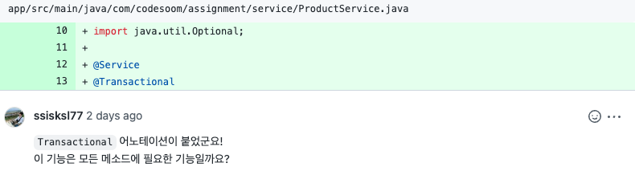

## Table of contents
{: .no_toc .text-delta }

1. TOC
{:toc}
---



- 리뷰에서 `@Transactional`에 대해 언급되었다
- 해당 리뷰를 보고 인터넷 강의를 들으면서 조회 메서드에 `@Transactional(readOnly = true)`를 쓰면 최적화가 된다는 것이 떠올랐다
- 왜 최적화가 되는지 간단하게 알아보자
- 참고 링크
    1. [`Hibernate` Persistence Context](https://docs.jboss.org/hibernate/orm/6.1/userguide/html_single/Hibernate_User_Guide.html#pc)
    2. [`stackoverflow` Spring @Transactional read-only propagation](https://stackoverflow.com/questions/1614139/spring-transactional-read-only-propagation)
    3. [`stackoverflow` difference between Hibernate Session and EntityManager](https://stackoverflow.com/questions/16670447/difference-between-hibernate-session-and-entitymanager)
    4. [`baeldung` Hibernate Second-Level Cache](https://www.baeldung.com/hibernate-second-level-cache)
    5. [`Hibernate` Configuring second-level cache mappings](https://docs.jboss.org/hibernate/orm/6.1/userguide/html_single/Hibernate_User_Guide.html#caching-mappings)

# **@Transactional(readOnly = true)**


```
First of all, since Spring doesn't do persistence itself, it cannot specify what readOnly should exactly mean. This attribute is only a hint to the provider, the behavior depends on, in this case, Hibernate.
```

- 스프링은 영속성과 무관하다 
- readOnly가 정확히 무엇을 의미해야 하는지 스프링은 지정할 수 없다
- 이 속성은 제공자에 대한 힌트일 뿐이며 동작은 구현체에 따라 다르다

<br>

```
If you specify readOnly as true, the flush mode will be set as FlushMode.NEVER in the current Hibernate Session preventing the session from committing the transaction.
```

- `readOnly`를 true로 지정하면 Hibernate Session에서 플러시 모드가 **FlushMode.NEVER**로 설정된다
- **Session이 트랜잭션을 커밋하는 것을 방지한다**

<br>

- readOnly를 따라가면 아래와 같은 인터페이스가 나온다

<div class="code-example" markdown="1">
**interface TransactionDefinition**
</div>

```java
    // 읽기 전용 트랜잭션으로 최적화할지 여부를 반환합니다.
    // ...
	default boolean isReadOnly() {
		return false;
	}
```

- 읽기 전용 트랜잭션이면 최적화를 한다고하는데 어떻게 최적화가 되는걸까??

<br>

```
read-only
If your application needs to read, but not modify, instances of a persistent class, a read-only cache is the best choice. Application can still delete entities and these changes should be reflected in second-level cache so that the cache does not provide stale entities. Implementations may use performance optimizations based on the immutability of entities.
```

- [`Hibernate` 공식문서](https://docs.jboss.org/hibernate/orm/6.1/userguide/html_single/Hibernate_User_Guide.html#caching-mappings)에서 수정없이 읽기만 할 때 최선의 선택이라고 한다
- 2차 캐시 🚩
- `hibernate.cache.default_cache_concurrency_strategy` 🚩


