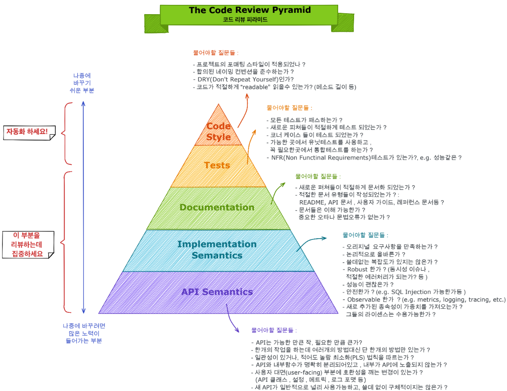

- `2022-06-13`
  - **[깃-던전 공략법](https://www.youtube.com/watch?v=dd7EPJ__hBs&list=PL1PI2d-NlJ8u7Kkb7k5bbSTuxZay62g2F)**

- `2022-06-09`
  - **[Garbage Collector의 동작 원리](https://sihyung92.oopy.io/java/garbage-collect/1)**
  - **[Spring vs Spring Boot](https://dzone.com/articles/spring-vs-spring-boot)**
    - [번역](https://sas-study.tistory.com/274)

- `2022-06-08`
  - **[어떻게 네트워를 공부할 것인가?](https://covenant.tistory.com/222?category=773722)**
  - **[생성자 주입은 왜 권장되며 순환참조란 뭘까?](https://velog.io/@walker/Spring-%EC%99%9C-%EC%83%9D%EC%84%B1%EC%9E%90-%EC%A3%BC%EC%9E%85%EC%9D%B4-%EA%B6%8C%EC%9E%A5%EB%90%98%EB%A9%B0-%EC%88%9C%ED%99%98%EC%B0%B8%EC%A1%B0%EB%9E%80-%EB%AD%98%EA%B9%8C)**
  - **[Lombok - 지양해야 할 annotation](https://velog.io/@rosa/Lombok-%EC%A7%80%EC%96%91%ED%95%B4%EC%95%BC-%ED%95%A0-annotation)**
  - **[호다닥 공부해보는 SSO와 친구들 (SAML, OAuth, OIDC)](https://gruuuuu.github.io/security/ssofriends/)**
  - **[Spring HandlerInterceptor를 활용하여 컨트롤러 중복 코드 제거하기](https://hudi.blog/spring-handler-interceptor/)**

- `2022-06-04`
  - **[TCP/IP란 무엇이며 어떤 원리로 작동하나요?](https://nordvpn.com/ko/blog/tcp-ip-protocol/)**
  - **[수리의 TCP/IP](https://www.youtube.com/watch?v=BEK354TRgZ8&ab_channel=%EC%9A%B0%EC%95%84%ED%95%9CTech)**

- `2022-06-03`
  - **[HTTP Method의 멱등성, 그리고 안전한 메서드](https://hudi.blog/http-method-idempotent/)**

- `2022-05-30`
  - **[Optional Anti-Patterns](https://dzone.com/articles/optional-anti-patterns)**
  - **[visualization](https://www.cs.usfca.edu/~galles/visualization/Algorithms.html)**

- `2022-05-27`
  - **[LSB와 MSB란 무엇인가?](https://blog.naver.com/ansdbtls4067/220886567257)**

- `2022-05-24`
  - **[주요 DBMS의 특징적인 SQL 기능 비교](https://d2.naver.com/helloworld/907716)**

- `2022-05-23`
  - 알고리즘 문제를 풀며 **떠오르는 아이디어를 기록하자 !!!**
  - **[이분 매칭 알고리즘 (Bipartite Matching)](https://yjg-lab.tistory.com/209)**
  - **[이진 탐색, 이분 탐색(binary search) 구현시 고려할 것들](https://eine.tistory.com/entry/%EC%9D%B4%EC%A7%84-%ED%83%90%EC%83%89-%EC%9D%B4%EB%B6%84-%ED%83%90%EC%83%89binary-search-%EA%B5%AC%ED%98%84%EC%8B%9C-%EA%B3%A0%EB%A0%A4%ED%95%A0-%EA%B2%83%EB%93%A4)**

- `2022-05-20`
  - **[DTO와 Domain Model을 분리해야 하는 이유](https://umbum.dev/1206)**
  - **[MyBatis Cache](https://umbum.dev/1201?category=1060202)**
  - **[뒤늦게 등장한 HTTP PATCH 메소드와 스프링의 디스패처 서블릿에 미친 영향](https://mangkyu.tistory.com/225?category=761302)**

- `2022-05-18`
  - **[Retrofit2 와 Resilience4j 를 이용한 빠른 Rest API Client 구현](https://medium.com/myrealtrip-product/retrofit2-%EC%99%80-resilience4j-%EB%A5%BC-%EC%9D%B4%EC%9A%A9%ED%95%9C-%EB%B9%A0%EB%A5%B8-rest-api-client-%EA%B5%AC%ED%98%84-81c10dcfb6)**

- `2022-05-16`
  - KMP (Failure Function 이해)

- `2022-05-15`
  - **[개발자가 도움이 되는 문서와 사이트를 정리하고 수집하는 데 전념하다](https://intrepidgeeks.com/)**

- `2022-05-13`
  - **[TCP 3-Way Handshake Process](https://www.geeksforgeeks.org/tcp-3-way-handshake-process/)**

- `2022-05-12`
  - **[HTTP/2 훑어보고 AWS에서 적용해보기](https://fe-developers.kakaoent.com/2022/220424-http2-with-aws/)**

- `2022-05-09`
  - **[ID Token and Access Token: What's the Difference?](https://auth0.com/blog/id-token-access-token-what-is-the-difference/)**

- `2022-04-26`
  - **[Jackson Unmarshalling JSON with Unknown Properties](https://www.baeldung.com/jackson-deserialize-json-unknown-properties#3-dealing-with-unknown-fields-at-the-class-level)**

- `2022-04-25`
  - 밀러-라빈 , 폴라드 로 , 페르마의 소정리 SCC , 오일러 경로 테크닉

- `2022-04-15`
  - **[우아한형제들 - 회원시스템 이벤트기반 아키텍처 구축하기](https://techblog.woowahan.com/7835/)**

- `2022-04-14`
  - **[Mozilla - Http Caching](https://developer.mozilla.org/ko/docs/Web/HTTP/Caching)**
  - **[웹 서비스 캐시 똑똑하게 다루기](https://toss.tech/article/smart-web-service-cache)**
  - **[웹 캐시 특징](https://hahahoho5915.tistory.com/33)**
  - **[javaguides.net](https://www.javaguides.net/)**
  - **[`RESTful API` 서버를 위협하는 한 글자, 슬래시 – CVE-2016-5007](https://netmarble.engineering/spring-security-path-matching-inconsistency-cve-2016-5007/)**
  - **[`@Transactional` 파헤치기](https://bluayer.com/54)**
  - **[`<meta>` 문서 레벨 메타데이터 요소](https://developer.mozilla.org/ko/docs/Web/HTML/Element/meta)**

- `2022-04-13`
  - **코드 리뷰 피라미드**

- `2022-04-12`
  - **[Cache 파헤치기](https://bluayer.com/55)**
  - **[`@ServletComponentScan`](https://www.baeldung.com/spring-servletcomponentscan)**

- `2022-04-10`
  - **[클린 코더스 강의](https://www.youtube.com/watch?v=60lLSe1phks&list=PLeQ0NTYUDTmMM71Jn1scbEYdLFHz5ZqFA)**

- `2022-04-08`
  - **[nGrinder](https://giron.tistory.com/83)**

- `2022-04-07`
  - **[Udacity Git Commit Message Style Guide](https://udacity.github.io/git-styleguide/)**
  - **[캠퍼스 핵데이 Java 코딩 컨벤션](https://naver.github.io/hackday-conventions-java)**

- `2022-04-05`
  - **[도움이 될수도 있는 JVM memory leak 이야기](https://techblog.woowahan.com/2628/)**

- `2022-04-01`
  - **[신입으로서 임원 면접을 준비할 때](https://velog.io/@wongue_shin/신입-개발자가-1차면접-통과-이후에-준비해야할-부분)**

- `2022-03-31`
  - **[Naver D2 - Java의 날짜와 시간 API](https://d2.naver.com/helloworld/645609)**
  - **[회고, 똑똑하게 때와 상황에 맞게 골라하자 !](https://jiyu0719.medium.com/%ED%9A%8C%EA%B3%A0-%EB%98%91%EB%98%91%ED%95%98%EA%B2%8C-%EB%95%8C%EC%99%80-%EC%83%81%ED%99%A9%EC%97%90-%EB%A7%9E%EA%B2%8C-%EA%B3%A8%EB%9D%BC%ED%95%98%EC%9E%90-42b57ae17a4a)**

- `2022-03-25`
  - **[해치지 않는 웹 네트워크](https://brunch.co.kr/magazine/webnetwork)**
  - **[ORACLE Java Language and Virtual Machine Specifications](https://docs.oracle.com/javase/specs/index.html)**

- `2022-03-24`
  - **[Common DBCP 이해하기](https://d2.naver.com/helloworld/5102792)**

- `2022-03-23`
  - **[JPA JPQL의 조회 동작 살펴보기](https://cheese10yun.github.io/jpa-jpql/)**

- `2022-03-16`
  - **[Spring Rest Docs](https://shirohoo.github.io/backend/test/2022-02-22-rest-docs-optimization/)**
  - **[@Comment](https://shirohoo.github.io/diary/2022-02-16-diary-34/)**

- `2022-03-14`
  - **[No newline at a end of file, 왜 체크해야하나?](https://minz.dev/19)**

- `2022-03-13`
  - **[누구나 쉽게 이해할 수 있는 Git](https://backlog.com/git-tutorial/kr/)**

- `2022-03-10`
  - **[식사하는 철학자 문제(운영체제)](https://luv-n-interest.tistory.com/438)**
  - **[뮤텍스(Mutex)와 세마포어(Semaphore)의 차이](https://worthpreading.tistory.com/90)**

- `2022-03-06`
  - **[Spring Data JPA - Reference Documentation](https://docs.spring.io/spring-data/jpa/docs/current/reference/html/#preface)**

- `2022-03-04`
  - **[Spring Docs](https://docs.spring.io/spring-framework/docs)**
  - **[DB 트랜잭션과 커넥션 이해하기](https://jiwondev.tistory.com/163)**

- `2022-03-03`
  - **[CSR , SSR / SPA , MPA](https://velog.io/@namezin/CSR-SSR)** 

- `2022-03-01`
  - **[Web Server와 WAS의 차이와 웹 서비스 구조](https://gmlwjd9405.github.io/2018/10/27/webserver-vs-was.html)**

- `2022-02-25`
  - **[AWS cache me if you can](https://www.youtube.com/results?search_query=AWS+cache+me+if+you+can)**

- `2022-02-21`
  -  **[ResponseEntity란 무엇인가?](https://a1010100z.tistory.com/106)**
     - `@ControllerAdvice`
     - `ExceptionHandler`

- `2022-02-19`
  - **[Guide to hashCode() in Java](https://www.baeldung.com/java-hashcode)**

- `2022-02-17`
  - **[[마틴 파울러] 리팩토링의 중요성 feat.테스트 코드를 짜는 이유](https://www.youtube.com/watch?v=mNPpfB8JSIU)**

- `2022-02-11`
  - **[@Transactional 사용 시 주의해야하는 8가지](https://flambeeyoga.tistory.com/entry/Transactional-%EC%82%AC%EC%9A%A9-%EC%8B%9C-%EC%A3%BC%EC%9D%98%EC%A0%90)**

- `2022-02-10`
  - **[언제 static 함수 모음 Class를 만들어야 할까?](http://kwon37xi.egloos.com/4844149)**

- `2022-01-27`
  - **[Curated List of Top 75 LeetCode Questions to Save Your Time](https://leetcode.com/list/xi4ci4ig/)**

- `2022-01-26`
  - **[JWT (로그인 기능 구현 시)](https://white-board.tistory.com/199)**
  - **[`Fail-Fast Iterator`](https://perfectacle.github.io/2021/08/14/fail-fast-iterator/)**

- `2022-01-25`
  - **[알고리즘 시간복잡도 뽀개기](https://goodgid.github.io/Algorithm-Time-Complexity-Analysis/)**
  - **[`Spring RequestContextHolder`](https://gompangs.tistory.com/entry/Spring-RequestContextHolder#%EA%B-%AC%EA%B-%--%EB%A-%--%EC%-D%--%--%EB%A-%B-%EC%-B%A-%ED%--%--%EC%A-%--%--%EB%A-%--%EC%-E%--)**
  - **[`Immutable Object`(불변객체)](https://velog.io/@conatuseus/Java-Immutable-Object%EB%B6%88%EB%B3%80%EA%B0%9D%EC%B2%B4)**
  - **[`OkHttp`로 `REST API` 호출하기](https://digitalbourgeois.tistory.com/59?category=678387)**
  - **[스프링 `RestTemplate`](https://advenoh.tistory.com/46)**
  - **[Spring WebSocket 소개](https://supawer0728.github.io/2018/03/30/spring-websocket/)**
  - **[교차 출처 리소스 공유 (CORS)](https://developer.mozilla.org/ko/docs/Web/HTTP/CORS)**
  - **[LeetCode 문제 추천 블로그]((https://inner-game.tistory.com/11))**
  - **[Java Code Conventions / 자바 코딩 규칙](http://kwangshin.pe.kr/blog/java-code-conventions-%EC%9E%90%EB%B0%94-%EC%BD%94%EB%94%A9-%EA%B7%9C%EC%B9%99/?ckattempt=1)**
  - **[목적의식 있는 연습을 통한 효과적인 학습](https://techblog.woowahan.com/2626/)**
  - 📢 **[The Top 433 Korean Open Source Projects on Github](https://awesomeopensource.com/projects/korean)**