## Table of contents
{: .no_toc .text-delta }

1. TOC
{:toc}

---

## 📌 **알고리즘을 얼마나 깊게 해야할까?**
```
문제를 많이 푼다면 구현 실력이나, 자신이 아는 요소(여기서는 그게 알고리즘이 되겠죠)를 적재적소에 활용하는 능력을 키울 수 있는 점은 분명하지만, 
이 알고리즘들이 모든 컴퓨터 분야에 필수인 것은 절대 아니고, 오히려 실무에서는 몰라도 큰 상관이 없을 때가 많습니다.
고급 알고리즘이 꼭 좋은 것도 아닙니다. 
실무와 개발에 있어서는 유지보수성과 협업을 신경쓰는 것도 굉장히 중요한데요. 
성능은 좋지만 그렇게 필수적이지는 않았는데도 구현이 난해한 알고리즘을 너무 남발하다 보면,
시간이 지나고 자신의 코드를 되돌아볼 때나 다른 사람과 협업해야 할 때, 
다른 사람이 이어서 작업해야 할 때 등 상당히 골치 아파지는 경우도 있을 것입니다. 
(물론, 항상 좋은 것이 아니랬지 성능이 무조건적으로 우선인 곳에서는 잘 사용할 때도 있습니다.)
(리눅스의 스케쥴러가 레드블랙트리로 구현되어 있는 것이 좋은 예)
어느 정도 가벼이 취미로 하기에 재밌기도 하고, 이때는 취미를 하면서 코딩/구현 실력도 늘릴 수 있다는 점에서 컴퓨터분야 종사자의 취미생활로써는 굉장히 도움이 많이 되지만, 
주 목적이 되는 일은 흔치 않을 것입니다. 
덤으로 제가 모든 개발자가 기본소양(?) 정도로 갖추면 좋겠을 지식은 기초 자료구조들 및 그리디, DP 정도가 뭔지를 아는 것이 끝입니다. 
또 어느때나 물어보면 즉시 구현이 가능할 정도도 아니고, 아는 것만으로 충분하다고 봅니다.
```
- [출처](https://blog.naver.com/kks227)

## **[코딩 인터뷰 완전 분석](https://www.aladin.co.kr/shop/wproduct.aspx?ItemId=115116545)**
### 📌 **[Cracking The Coding Interview 6th Edition In LeetCode](https://leetcode.com/discuss/general-discussion/1152824/cracking-the-coding-interview-6th-edition-in-leetcode#4)**

***

# **널리 사용되는 정렬 알고리즘**

## ✋ **[TimSort에 대해 - NaverD2](https://d2.naver.com/helloworld/0315536)**

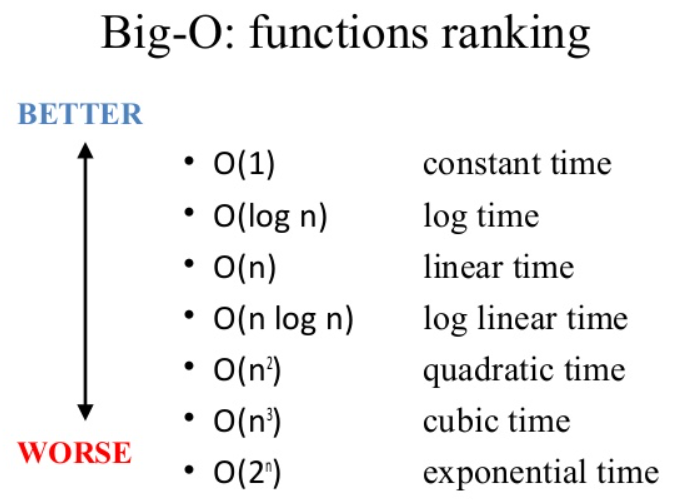
- [joshuajangblog.wordpress.com](https://joshuajangblog.wordpress.com/2016/09/21/time_complexity_big_o_in_easy_explanation/)
- **O(1) – 상수 시간** : 알고리즘이 문제를 해결하는데 오직 한 단계만 거칩니다.
- **O(log n) – 로그 시간** : 문제를 해결하는데 필요한 단계들이 연산마다 특정 요인에 의해 줄어듭니다.
- **O(n) – 직선적 시간** : 문제를 해결하기 위한 단계의 수와 입력값 n이 1:1 관계를 가집니다.
- **O(n<sup>2</sup>) – 2차 시간** : 문제를 해결하기 위한 단계의 수는 입력값 n의 제곱입니다.
- **O(C<sup>n</sup>) – 지수 시간** : 문제를 해결하기 위한 단계의 수는 주어진 상수값 C 의 n 제곱입니다. (상당히 큰수가 됩니다)

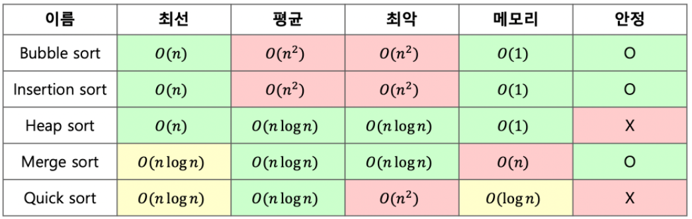

- **안정 정렬 (Stable Sort) , 불안정 정렬 (Unstable Sort)**
  - 정렬의 안정적 특성이란 **"정렬되지 않은 상태에서 같은 키값을 가진 원소의 순서가 정렬 후에도 유지되느냐"** 이다.
  - 정렬 방법 마다 **중복된 원소**가 본래 순서대로 정렬될 수도 있고 , 섞일 수도 있다.
  - **안정 정렬**
    - 중복된 값을 입력 순서와 동일하게 정렬되는 것
    - **삽입 정렬 , 병합 정렬 , 버블 정렬**
  - **불안정 정렬**
    - 중복된 값이 입력 순서와 동일하지 않게 정렬되는 것
    - **퀵 정렬 , 선택정렬 , 계수정렬**

## **버블 정렬 (Bubble Sort) - 평균 및 최악 실행 시간 : O(n<sup>2</sup>) , 메모리 : O(1)**

- **서로 인접한 두 원소의 대소를 비교하고, 조건에 맞지 않다면 자리를 교환하며 정렬하는 알고리즘**

1. 1회전에 첫 번째 원소와 두 번째 원소를, 두 번째 원소와 세 번째 원소를, 세 번째 원소와 네 번째 원소를, … 이런 식으로 (마지막-1)번째 원소와 마지막 원소를 비교하여 조건에 맞지 않는다면 서로 교환합니다.
2. **1회전을 수행하고 나면 가장 큰 원소가 맨 뒤로 이동하므로 2회전에서는 맨 끝에 있는 원소는 정렬에서 제외되고, 2회전을 수행하고 나면 끝에서 두 번째 원소까지는 정렬에서 제외됩니다.** 
- 이렇게 정렬을 1회전 수행할 때마다 정렬에서 제외되는 데이터가 하나씩 늘어납니다.


- **장점**
  - 정렬하고자 하는 배열 안에서 교환하는 방식이므로, 다른 메모리 공간을 필요로 하지 않는다.. ➜ 제자리 정렬(in-place sorting)
  - **안정 정렬(Stable Sort)**
- **단점**
  - **시간복잡도가 최악, 최선, 평균 모두 O(n^<sup>2</sup>)으로, 굉장히 비효율적입니다.**
  - 정렬 돼있지 않은 원소가 정렬 됐을때의 자리로 가기 위해서, 교환 연산(swap)이 많이 일어나게 됩니다.

## **선택 정렬 (Selection Sort) - 평균 및 최악 실행 시간 : O(n<sup>2</sup>) , 메모리 : O(1)**

- **해당 순서에 원소를 넣을 위치는 이미 정해져 있고, 어떤 원소를 넣을지 선택하는 알고리즘**
- **해당 자리를 선택하고 그 자리에 오는 값을 찾는 것**

1. 주어진 배열 중에 최소값을 찾는다.
2. 그 값을 맨 앞에 위치한 값과 교체한다.
3. 맨 처음 위치를 뺀 나머지 배열을 같은 방법으로 교체한다.


- **장점**
  - 정렬을 위한 비교 횟수는 많지만, Bubble Sort에 비해 실제로 교환하는 횟수는 적기 때문에 많은 교환이 일어나야 하는 자료상태에서 비교적 효율적이다.
  - 정렬하고자 하는 배열 안에서 교환하는 방식이므로, 다른 메모리 공간을 필요로 하지 않는다. ➜ 제자리 정렬(in-place sorting)

- **단점**
  - 시간복잡도가 O(n<sup>2</sup>)으로, 비효율적이다.
  - **불안정 정렬(Unstable Sort)**

## **삽입 정렬 (Insertion Sort) - 평균 및 최악 실행 시간 : O(n<sup>2</sup>) , 메모리 : 상황에 따라 다름**

- **2번째 원소부터 시작하여 그 앞(왼쪽)의 원소들과 비교하여 삽입할 위치를 지정한 후, 원소를 뒤로 옮기고 지정된 자리에 자료를 삽입 하여 정렬하는 알고리즘**
- 최선의 경우 O(N)이라는 엄청나게 빠른 효율성을 가지고 있어, <span style="color:red; font-weight:bold">다른 정렬 알고리즘의 일부로 사용될 만큼 좋은 정렬 알고리즘</span>
  - 모두 정렬이 되어있는 경우(Optimal)한 경우, 한번씩 밖에 비교를 안하므로 O(n) 의 시간복잡도를 가지게 된다.
  - **또한, 이미 정렬되어 있는 배열에 자료를 하나씩 삽입/제거하는 경우에는, 현실적으로 최고의 정렬 알고리즘이 된다.**

1. 정렬은 2번째 위치(index)의 값을 temp에 저장합니다.
1. temp와 이전에 있는 원소들과 비교하며 삽입해나갑니다.
1. '1'번으로 돌아가 다음 위치(index)의 값을 temp에 저장하고, 반복합니다.


- **장점**
  - 대부분의 원소가 이미 정렬되어 있는 경우, 매우 효율적일 수 있다.
  - 정렬하고자 하는 배열 안에서 교환하는 방식이므로, 다른 메모리 공간을 필요로 하지 않는다..  ➜ 제자리 정렬(in-place sorting)
  - **안정 정렬(Stable Sort)**
  - **Selection Sort나 Bubble Sort과 같은 O(n<sup>2</sup>) 알고리즘에 비교하여 상대적으로 빠르다.**
- **단점**
  - 평균과 최악의 시간복잡도가 O(n<sup>2</sup>)으로 비효율적입니다.
  - Bubble Sort와 Selection Sort와 마찬가지로, 배열의 길이가 길어질수록 비효율적입니다.

## **병합 정렬 (Merge Sort) - 평균 및 최악 실행 시간 : O(n log n) , 메모리 : 상황에 따라 다름**

- **배열을 절반씩 나누어 각각을 정렬한 다음 이 둘을 합하여 다시 정렬 하는 방법이다.**
- 나눈 절반을 정렬할 때도 같은 알고리즘이 사용되고 , **결국에는 원소 한 개짜리 배열 두 개를 병합하게 된다.**
- **분할 (Divide)** : 입력 배열을 같은 크기의 2개의 부분 배열로 분할
- **정복 (Conquer)** : 부분 배열을 정렬한다. 부분 배열의 크기가 충분히 작지 않으면 **순환 호출**을 이용하여 다시 분할 정복 방법을 적용한다.
- **결합 (Combine)** : 정렬된 부분 배열들을 하나의 배열에 합병한다.
- **안정 정렬(Stable Sort)**
- **분할 정복 알고리즘의 하나**

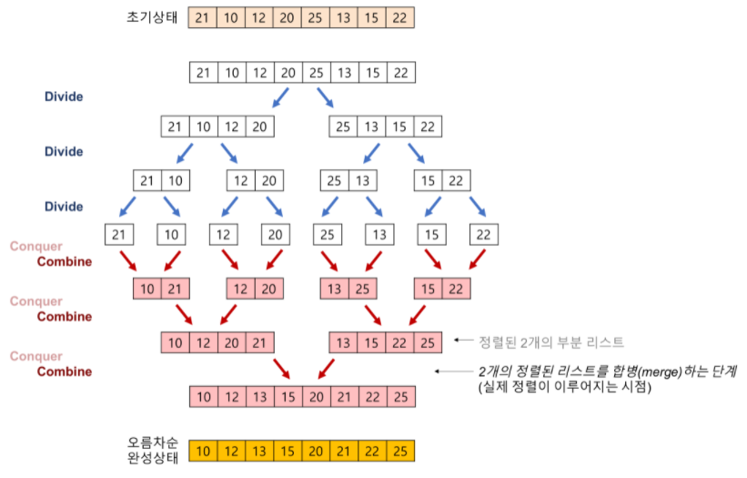

```java
import java.io.*;
import java.util.*;


class Main {
	
    public static void main(String[] args) throws IOException {
    	int[] numArr = new int[30];
    	
    	for(int i = 0 ; i < 30 ; i++) {
    		int value = (int)(Math.random()*100);
    		System.out.print(value + " ");
    		numArr[i] = value;
    	}
    	System.out.println();
    	
    	mergesort(numArr);
    	
    	for(int value : numArr) {
    		System.out.print(value + " ");
    	}
    	
//    	34 12 82 6 96 97 29 21 38 25 57 45 26 16 71 58 9 82 97 90 71 36 39 23 93 72 71 69 45 82 
//    	6 9 12 16 21 23 25 26 29 34 36 38 39 45 45 57 58 69 71 71 71 72 82 82 82 90 93 96 97 97 
    }	

	public static void mergesort(int[] array) {
		int[] helper = new int[array.length];
		mergesort(array, helper, 0, array.length - 1);
	}

	public static void mergesort(int[] array, int[] helper, int low, int high) {
		if (low < high) {
			int middle = (low + high) / 2;
			mergesort(array, helper, low, middle); // 왼쪽 절반 정렬
			mergesort(array, helper, middle + 1, high); // 오른쪽 절반 정렬
			merge(array, helper, low, middle, high); // 병합
		}
	}
	
	public static void merge(int[] array , int[] helper , int low , int middle , int high) {
		/* 절반짜리 두 배열을 helper 배열에 복사한다. */
		for(int i = low ; i <= high ; i++) {
			helper[i] = array[i];
		}
		
		int helperLeft = low;
		int helperRight = middle + 1;
		int current = low;
		
		/* helper 배열 순회 , 왼쪽 절반과 오른쪽 절반을 비교하여 작은 원소를 원래 배열에 복사하여 넣는다. */
		while(helperLeft <= middle && helperRight <= high) {
			if(helper[helperLeft] <= helper[helperRight]) {
				array[current] = helper[helperLeft];
				helperLeft++;
			}
			else { // 오른쪽 원소가 왼쪽 원소보다 작으면
				array[current] = helper[helperRight];
				helperRight++;
			}
			current++;
		}
		
		/* 왼쪽 절반 배열에 남은 원소들을 원래 배열에 복사해 넣는다. */
		int remaining = middle - helperLeft;
		for(int i = 0 ; i <= remaining ; i++) {
			array[current + i] = helper[helperLeft + i];
		}
	}
}
```

## **퀵 정렬 (Quick Sort) - 실행 시간： 평균 O(nlogn), 최악 O(n<sup>2</sup>). 메모리： O(log n)**

- **분할 정복(divide and conquer) 방법**
  - 문제를 작은 2개의 문제로 분리하고 각각을 해결한 다음, 결과를 모아서 원래의 문제를 해결하는 전략
  - Merge Sort와 달리 Quick Sort는 배열을 비균등하게 분할

- **JAVA에서 Arrays.sort() 내부적으로도 Dual Pivot Quick Sort로 구현되어 있을 정도로 효율적인 알고리즘이고, 기술 면접에서 정말 빈번하게 나오는 주제이므로 반드시 숙지하시길 바랍니다.**

1. 배열 가운데서 하나의 원소를 고릅니다. 이렇게 고른 원소를 피벗(pivot) 이라고 합니다.
2. 피벗 앞에는 피벗보다 값이 작은 모든 원소들이 오고, 피벗 뒤에는 피벗보다 값이 큰 모든 원소들이 오도록 피벗을 기준으로 배열을 둘로 나눕니다.
    - 이렇게 배열을 둘로 나누는 것을 **분할(Divide)** 이라고 합니다.
    - 분할을 마친 뒤에 피벗은 더 이상 움직이지 않습니다.
3. 분할된 두 개의 작은 배열에 대해 **재귀(Recursion)적으로 이 과정을 반복**합니다.
4. 재귀 호출이 한번 진행될 때마다 최소한 하나의 원소는 최종적으로 위치가 정해지므로, 이 알고리즘은 반드시 끝난다는 것을 보장할 수 있습니다.


- **장점**
  - 불필요한 데이터의 이동을 줄이고 먼 거리의 데이터를 교환할 뿐만 아니라, 한 번 결정된 피벗들이 추후 연산에서 제외되는 특성 때문에, 다른 정렬 알고리즘과 비교했을 때도 가장 빠르다.
  - 정렬하고자 하는 배열 안에서 교환하는 방식이므로, 다른 메모리 공간을 필요로 하지 않는다..  ➜ 제자리 정렬(in-place sorting)
- **단점**
  - **불안정 정렬(Unstable Sort)**
  - 정렬된 배열에 대해서는 Quick Sort의 불균형 분할에 의해 오히려 수행시간이 더 많이 걸린다.
  - 배열 분할에 사용되는 원소가 중간값에 가까운 값이 되리라는 보장이 없기 때문에 , 정렬 알고리즘이 느리게 동작할 수 있다.

```java
public class main {
	
	public static void main(String[] args) {
		int[] numArr = new int[30];
		for(int i = 0 ; i < 30 ; i++) {
			int value = (int)(Math.random()*100);
			System.out.print(value + " ");
			numArr[i] = value;
		}
		System.out.println();
		sort(numArr);

		for(int value : numArr) {
			System.out.print(value + " ");
		}
	}
	
	public static void sort(int[] a) {
		m_pivot_sort(a, 0, a.length - 1);
	}
	
	/**
	 *  중간 피벗 선택 방식
	 * @param a		정렬할 배열
	 * @param lo	현재 부분배열의 왼쪽
	 * @param hi	현재 부분배열의 오른쪽
	 */
	private static void m_pivot_sort(int[] a, int lo, int hi) {
		
		/*
		 *  lo가 hi보다 크거나 같다면 정렬 할 원소가 
		 *  1개 이하이므로 정렬하지 않고 return한다.
		 */
		if(lo >= hi) {
			return;
		}
		
		/*
		 * 피벗을 기준으로 요소들이 왼쪽과 오른쪽으로 약하게 정렬 된 상태로
		 * 만들어 준 뒤, 최종적으로 pivot의 위치를 얻는다.
		 * 
		 * 그리고나서 해당 피벗을 기준으로 왼쪽 부분리스트와 오른쪽 부분리스트로 나누어
		 * 분할 정복을 해준다.
		 * 
		 * [과정]
		 * 
		 * Partitioning:
		 *
		 *      left part      a[(right + left)/2]      right part      
		 * +---------------------------------------------------------+
		 * |    element < pivot    |  pivot  |    element >= pivot   |
		 * +---------------------------------------------------------+
		 *    
		 *    
		 *  result After Partitioning:
		 *  
		 *         left part         a[hi]          right part
		 * +---------------------------------------------------------+
		 * |   element < pivot    |  pivot  |    element >= pivot    |
		 * +---------------------------------------------------------+
		 *       
		 *       
		 *  result : pivot = hi     
		 *       
		 *
		 *  Recursion:
		 *  
		 * m_pivot_sort(a, lo, pivot)         m_pivot_sort(a, pivot + 1, hi)
		 *  
		 *         left part                           right part
		 * +-----------------------+             +-----------------------+
		 * |   element <= pivot    |             |    element > pivot    |
		 * +-----------------------+             +-----------------------+
		 * lo                pivot          pivot + 1                   hi
		 * 
		 */
		int pivot = partition(a, lo, hi);	
		
		m_pivot_sort(a, lo, pivot);
		m_pivot_sort(a, pivot + 1, hi);
	}
	
	/**
	 * pivot을 기준으로 파티션을 나누기 위한 약한 정렬 메소드
	 * 
	 * @param a		정렬 할 배열 
	 * @param left	현재 배열의 가장 왼쪽 부분
	 * @param right	현재 배열의 가장 오른쪽 부분
	 * @return		최종적으로 위치한 피벗의 위치(hi)를 반환
	 */
	private static int partition(int[] a, int left, int right) {
		// lo와 hi는 각각 배열의 끝에서 1 벗어난 위치부터 시작한다.
		int lo = left - 1;
		int hi = right + 1;
		int pivot = a[(left + right) / 2];		// 부분리스트의 중간 요소를 피벗으로 설정
		
 
		while(true) {
			/*
			 * 1 증가시키고 난 뒤의 lo 위치의 요소가 pivot보다 큰 요소를
			 * 찾을 떄 까지 반복한다.
			 */
			do { 
				lo++; 
			} while(a[lo] < pivot);
			
			/*
			 * 1 감소시키고 난 뒤의 hi 위치가 lo보다 크거나 같은 위치이면서
			 * hi위치의 요소가 pivot보다 작은 요소를 찾을 떄 까지 반복한다.
			 */
			do {
				hi--;
			} while(a[hi] > pivot && lo <= hi);
			
			/*
			 * 만약 hi가 lo보다 크지 않다면(엇갈린다면) swap하지 않고 hi를 리턴한다.
			 */
			if(lo >= hi) {
				return hi;
			}
			
			// 교환 될 두 요소를 찾았으면 두 요소를 바꾼다.
			swap(a, lo, hi);
		}
	}
	
	private static void swap(int[] a, int i, int j) {
		int temp = a[i];
		a[i] = a[j];
		a[j] = temp;
	}
}
```
- [퀵 정렬 구현코드 출처](https://st-lab.tistory.com/250)

***

# **`Binary Search` 이분,이진 탐색**
- 이진 탐색 알고리즘은 **정렬된 원소 리스트를 받아 리스트에 원하는 원소가 있을경우 그 원소의 위치를 반환**, 없을경우 null을 반환함.
- 시간복잡도는 O(log n)으로 매우 빠른편.

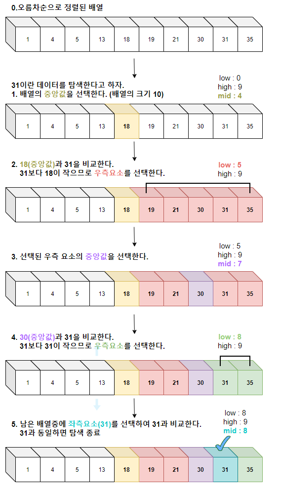

- [https://velog.io/@ming/](https://velog.io/@ming/%EC%9D%B4%EB%B6%84%ED%83%90%EC%83%89Binary-Search)


***

# **그래프**
- **노드와 그 노드를 연결하는 간선(edge)를 하나로 모아 놓은 것이다.**
- 방향성이 있을 수도 있고 없을 수도 있다.
- **여러 개의 고립된 부분 그래프 (isolated subgraphs)로 구성될 수 있다.**
- 모든 정점간에 경로가 존재하는 그래프는 **연걸 그래프**라고 부른다.
- 그래프에는 사이클이 존재할 수도 있고 존재하지 않을 수도 있다.

## **인접 리스트**
- 그래프를 표현할 때 사용되는 가장 일반적인 방법이다.

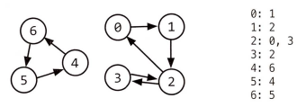


## **인접 행렬**
- `N*N` 행렬 로써 `행렬[i][j]`에 정보가 존재한다면 **i에서 j로의 간선**이 있다는 뜻이다.
- 무방향 그래프를 인접 행렬로 표현한다면 이 행렬은 **대칭 행렬(symmetric matrix)**이 된다.

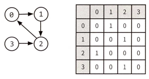

## **그래프 탐색**

### 깊이 우선 탐색 (DFS)
- **루트 노드 (혹은 다른 임의의 노드)에서 시작해서 다음 분기로 넘어가기 전에 해당 분기를 완벽하게 탐색하는 방법**
- 모든 노드를 방문하고자 할 때 더 선호되는 편이다.
- [백준(DFS , 백트래킹) - N과 M](https://www.acmicpc.net/workbook/view/9372)


- **[Binary Tree Level Order Traversal](https://leetcode.com/problems/binary-tree-level-order-traversal/)**

```java
/**
 * Definition for a binary tree node.
 * public class TreeNode {
 *     int val;
 *     TreeNode left;
 *     TreeNode right;
 *     TreeNode() {}
 *     TreeNode(int val) { this.val = val; }
 *     TreeNode(int val, TreeNode left, TreeNode right) {
 *         this.val = val;
 *         this.left = left;
 *         this.right = right;
 *     }
 * }
 */
class Solution {
    public List<List<Integer>> levelOrder(TreeNode root) {
        List<List<Integer>> list = new ArrayList<>();
        dfs(list , root , 0);
        return list;
    }

    public void dfs(List<List<Integer>> list , TreeNode node , int level){
        if(node != null){
            // 노드의 개수를 바로 알 수 있는 방법이 있다면 리스트에 레벨 만큼 미리 넣어줄 수 있는데??
            if(list.size() <= level) list.add(new ArrayList<Integer>());
            list.get(level).add(node.val);
            // System.out.println(node.val + " " + level);
            dfs(list , node.left , level + 1);
            dfs(list , node.right , level + 1);
        }
    }
}
```

### 넓이 우선 탐색 (BFS)
- 노드 사이의 최단 경로 혹은 임의의 경로를 찾고 싶을 때 사용한다.
- 큐(Queue)를 사용하여 구현한다.

- **[Find if Path Exists in Graph](https://leetcode.com/problems/find-if-path-exists-in-graph/)**

```java
class Solution {
    public boolean validPath(int n, int[][] edges, int start, int end) {
        List<ArrayList<Integer>> list = new ArrayList<>();
        Queue<Integer> queue = new LinkedList<Integer>();
        boolean[] visited = new boolean[n];
        if(start == end) return true;
        for(int i = 0 ; i <= n ; i++) list.add(new ArrayList<Integer>());
        for(int i = 0 ; i < edges.length ; i++){
            int x = edges[i][0];
            int y = edges[i][1];
            list.get(x).add(y);
            list.get(y).add(x);
        }

        queue.offer(start);

        while(!queue.isEmpty()){
            int now = queue.poll();
            visited[now] = true;
            for(int next : list.get(now)){
                if(next == end){
                    return true;
                }
                else if(!visited[next]){
                    queue.offer(next);
                }
            }
        }
        return false;
    }
}
```

### 양방향 탐색
- **출발지와 도착지 사이에 최단 경로를 찾을 때 사용된다.**
- 기본적으로 , 출발지와 도착지 두 노드에서 동시에 너비 우선 탐색을 사용한 뒤 , 두 탐색 지점이 충돌하는 경우에 경로를 찾는 방식이다.

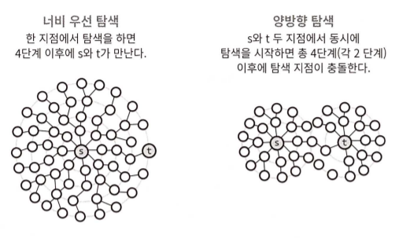

> 추가로 읽을 거리 - 위상정렬 , 다익스트라 , AVL , 레드블랙트리

# **트리**
- 노드로 이루어져있고 그래프의 한 종류인 자료구조이다.
- 트리는 하나의 루트 노드를 갖는다.
  - *꼭 가질 필요는 없지만 프로그래밍 면접에서 사용하는 트리에선 맞는 말이다.*
- 루트노드는 0개 이상의 자식 노드를 갖고 있다.
- 그 자식 노드 또한 0개 이상의 자식 노드를 갖고 있고 , 이는 반복적으로 정의된다.
- **사이클이 존재할 수 없다.**
- 노드들은 특정 순서로 나열될 수도 있고 그렇지 않을 수도 있다.
- 각 노드는 부모 노드로의 연결이 있을 수도 있고 없을 수도 있다.

## **이진 트리 (Binary Tree)**
- **이진 트리는 각 노드가 최대 두 개의 자식을 갖는 트리**를 말한다.

## **이진 탐색 트리 (Binary Search Tree)**
- **`모든 왼쪽 자식들 <= n < 모든 오른쪽 자식들` 속성은 모든 노드 n에 대해서 반드시 참이어야 한다.**
- 부등식의 경우에 대해서는 바로 아래 자식뿐만 아니라 **내 밑에 있는 모든 자식 노드들에 대해서 참이어야 한다.**

> - 같은 값을 처리하는 방식에 따라 이진 탐색 트리는 약간씩 정의가 달라질 수 있다.
> - 어떤 곳에서는 중복된 값을 가지면 안 된다고 나오고 , 또 다른 곳에서는 중복된 값은 오른 쪽 혹은 양쪽 어느 곳이든 존재할 수 있다고 나온다.

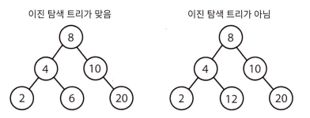

- 모든 노드에 대해서 그 **왼쪽 자식들의 값이 현재 노드 값보다 작거나 같도록 하고** , **오른쪽 자식들의 값은 현재 노드의 값보다 반드시 커야 한다**.

## **완전 이진 트리 (Complete Binary Search)**
- **트리의 모든 높이에서 노드가 꽉 차 있는 이진트리를 말한다.**
- 마지막 레벨은 꽉 차 있지 않아도 되지만 **왼쪽에서 오른쪽으로 채워져야 한다.**

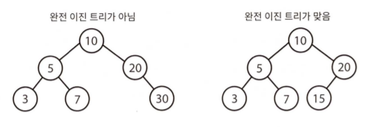

## **전 이진 트리 (Full Binary Tree)**
- **모든 노드의 자식이 없거나 정확히 두 개 있는 경우를 말한다.**
- 즉, *자식이 하나만 있는 노드가 존재해서는 안된다.*

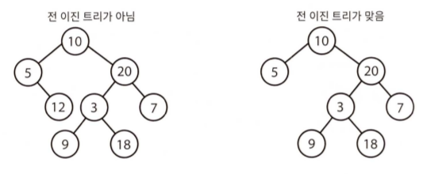

## **포화 이진 트리 (Perfect Binary Tree)**
- **전 이진 트리**이면서 **완전 이진 트리**인 경우를 말한다.
- **모든 말단 노드는 같은 높이에 있어야 하며 , 마지막 단계에서 노드의 개수가 최대가 되어야 한다.**
- 노드의 개수는 정확히 **2<sup>k-1</sup>(k는 트리의 높이)** 이다.

## 📌 **이진 트리 순회**

### 중위 순회 (in-order traversal)
- **왼쪽 가지 , 현재 노드 , 오른쪽 가지** 순서로 노드를 방문하는 것이다.
- **이진 탐색 트리를 이 방식으로 순회한다면 오름차순으로 방문하게 된다.**
- *가장 빈번하게 사용된다.*

### 전위 순회 (pre-order traversal)
- **자식 노드보다 현재 노드를 먼저 방문하는 방법을 말한다.**
- 가장 먼저 방문하게 될 노드는 언제나 루트이다.

### 후위 순회 (post-order traversal)
- **모든 자식 노드들을 먼저 방문한 뒤 마지막에 현재 노드를 방문하는 방법을 말한다.**
- 후위 순회에서 가장 마지막에 방문하게 될 노드는 언제나 루트이다.

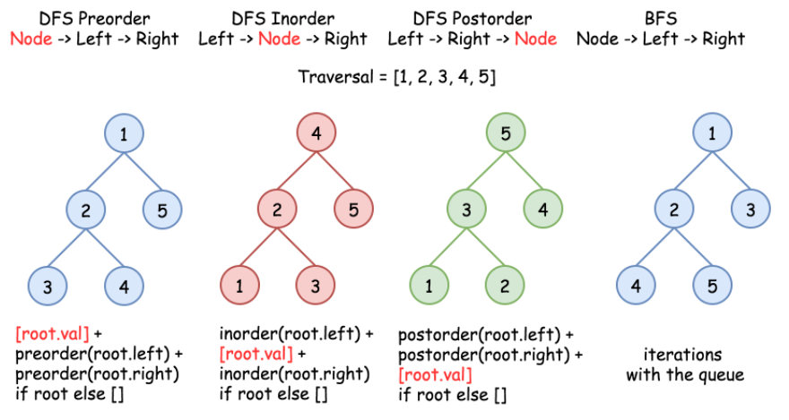


## **이진 힙 (최소 힙)**
- **최대 힙은 원소가 내림차순으로 정렬되어 있다는 점만 다를 뿐 , 최소 힙과 완전히 같다.**
- 최소 힙은 트리의 마지막 단계에서 오른쪽 부분을 뺀 나머지 부분이 가득 채워져 있다는 점에서 완전 이진 트리이다.
- **각 노드의 원소가 자식들의 원소보다 작다는 특성이 있다.**

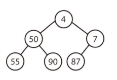

- **삽입 (Insert)**
  - **원소를 삽입할 때는 언제나 트리의 밑바닥에서부터 삽입을 시작한다.**
  - *완전 트리의 속성에 위배되지 않게 새로운 원소는 밑바닥 가장 오른쪽 위치로 삽입된다.*
  - 새로 삽입된 원소가 제대로 된 자리를 찾을 때 까지 부모 노드와 교환해 나간다.

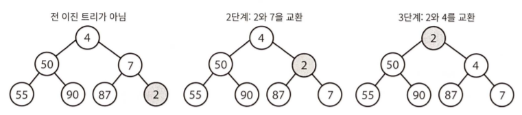

- **최소 원소 뽑아내기 (Extract_Min)**
  - 최소 원소는 가장 위에 놓이기 때문에 최소 원소를 찾기란 쉬운 일이다.
  - **이 최소 값을 어떻게 힙에서 제거하느냐가 까다로운 일이다.**
  1. 최소 원소를 제거한 후에 힙에 있는 가장 마지막 원소(밑바닥 가장 왼쪽에 위치한 원소)와 교환한다.
  2. 최소 힙의 성질을 만족하도록 , 해당 노드를 자식 노드와 교환해 나감으로 써 밑으로 내보낸다. (*자식들 중 최소 값을 선택한다.*)

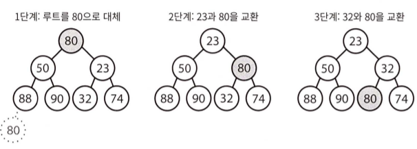

> 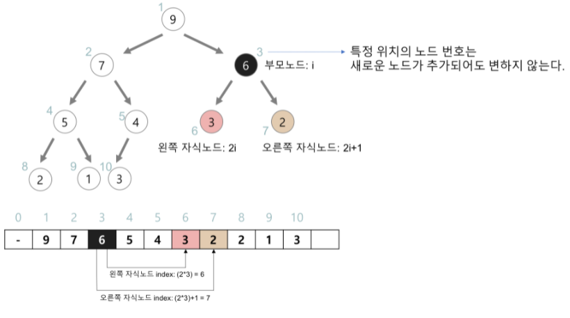
> - [출처 및 최대 힙](https://gmlwjd9405.github.io/2018/05/10/data-structure-heap.html)

## **균형 vs 비균형** (레드-블랙 트리 , AVL트리 ->고급 주제에서 다룰 예정)

## **트라이 Trie (접두사 트리)**
- **각 노드에 문자를 저장하는 자료구조 이다.**
- 따라서 트리를 아래쪽으로 순회하면 단어가 하나 나온다.
- **접두사를 빠르게 찾아보기 위한 아주 흔한 방식이다.**
- NULL 노드라고도 불리우는 **`*`노드** 는 종종 단어의 끝을 나타낸다.
  - **`*`노드** 의 실제 구현은 특별한 종류의 자식 노드로 표현될 수도 있다.
  - 아니면 **`*`노드** 의 **부모 노드 안에 boolean flag 새로 정의함으로써 단어의 끝을 표현할 수도 있다.**

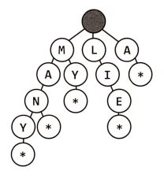

- **유효한 단어 집합을 이용하는 많은 문제들은 트라이를 통해 최적화 할 수 있다.**

***

# **TreeSet**
- 객체를 중복해서 저장할 수 없고 저장 순서가 유지되지 않는다는 **Set**의 성질을 그대로 가지고 있다.
- **이진 탐색 트리** 구조로 되어 있다.
- 추가와 삭제에는 시간이 조금 더 걸리지만 **정렬,검색**에 높은 성능을 보이는 자료구조 이다.
- 생성자의 매개변수로 Comparator객체를 입력하여 정렬 방법을 임의로 지정해 줄 수도 있다.
- **레드-블랙트리**로 구현되어 있다.
  - 부모노드보다 작은 값을 가지는 노드는 왼쪽 자식으로 ,
  - 큰 값을 가지는 노드는 오른쪽 자식으로 배치하여 균형을 맞춘다.


## [문제 - K번째 큰 수](https://jeongcode.github.io/docs/algorithm/javaAlgorithm/section4/#treeset-k%EB%B2%88%EC%A7%B8-%ED%81%B0-%EC%88%98-%EC%8B%A4%ED%8C%A8)

**TreeSet 선언**

```java
TreeSet<Integer> set1 = new TreeSet<Integer>();//TreeSet생성
TreeSet<Integer> set2 = new TreeSet<>();//new에서 타입 파라미터 생략가능
TreeSet<Integer> set3 = new TreeSet<Integer>(set1);//set1의 모든 값을 가진 TreeSet생성
TreeSet<Integer> set4 = new TreeSet<Integer>(Arrays.asList(1,2,3));//초기값 지정
```

**TreeSet 값 추가**
- 입력되는 값이 TreeSet 내부에 존재하지 않는다면 그 값을 추가한 뒤 true를 반환하고
- 내부에 값이 존재한다면 false를 반환한다.
- 7,4,9,2,5를 차례대로 TreeSet에 저장한다면 아래와같은 과정을 거치게 된다.

```java
  TreeSet<Integer> set = new TreeSet<Integer>();//TreeSet생성
  set.add(7); //값추가
  set.add(4);
  set.add(9);
  set.add(2);
  set.add(5);
```

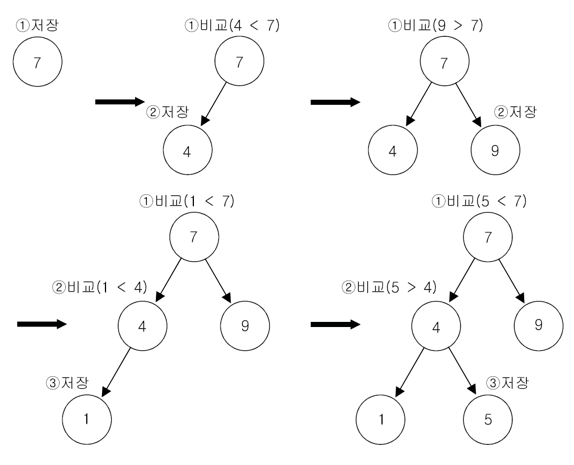


**TreeSet 값 삭제**
  -  매개변수 value의 값이 존재한다면 그 값을 삭제한 후 true를 반환하고 없으면 false를 반환한다.

```java
TreeSet<Integer> set = new TreeSet<Integer>();//TreeSet생성
set.remove(1);//값 1 제거
set.clear();//모든 값 제거
```

**TreeSet 값 출력**

```java
TreeSet<Integer> set = new TreeSet<Integer>(Arrays.asList(4,2,3));//초기값 지정
System.out.println(set); //전체출력 [2,3,4]
System.out.println(set.first());//최소값 출력
System.out.println(set.last());//최대값 출력
System.out.println(set.higher(3));//입력값보다 큰 데이터중 최소값 출력 없으면 null
System.out.println(set.lower(3));//입력값보다 작은 데이터중 최대값 출력 없으면 null

Iterator iter = set.iterator();	// Iterator 사용
while(iter.hasNext()) {//값이 있으면 true 없으면 false
    System.out.println(iter.next());
}
```

***

# **`Heap` 힙**
- **`Complete Binary Tree` 완전 이진 트리 이다.**
- **모든 노드에 저장된 값들은 자식 노드들의 것보다 크거나 같다.**
- **일종의 반정렬 상태(느슨한 정렬 상태) 를 유지한다.**
  - 큰 값이 상위 레벨에 있고 작은 값이 하위 레벨에 있다는 정도
  - 간단히 말하면 부모 노드의 키 값이 자식 노드의 키 값보다 항상 큰(작은) 이진 트리를 말한다.
- **힙을 저장하는 표준적인 자료구조는 배열** 이다.
  - 구현을 쉽게 하기 위하여 배열의 첫 번째 인덱스인 0은 사용되지 않는다.
  - 특정 위치의 노드 번호는 새로운 노드가 추가되어도 변하지 않는다.
  - 예를 들어 루트 노드의 오른쪽 노드의 번호는 항상 3이다.
- **힙에서의 부모 노드와 자식 노드의 관계**
  - **왼쪽 자식의 인덱스 = (부모의 인덱스) * 2**
  - **오른쪽 자식의 인덱스 = (부모의 인덱스) * 2 + 1**
  - **부모의 인덱스 = (자식의 인덱스) / 2**

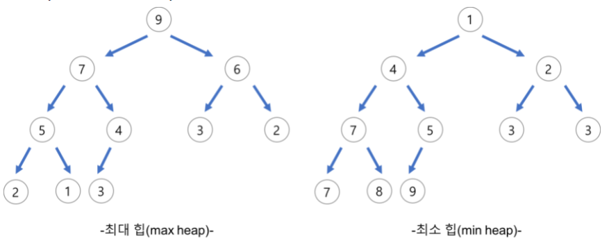

[출처](https://gmlwjd9405.github.io/2018/05/10/data-structure-heap.html)

***

# **해시 테이블**
- 간단한 해시 테이블을 구현하기 위해선 , **연결리스트**와 **해시 코드 함수**만 있으면 된다.
- **Hashtable 클래스는 컬렉션 프레임웍이 만들어지기 이전부터 존재**하던 것이기 때문에 컬렉션 프레임워의 명명법을 따르지 않는다.

## 📌 **키와 값을 해시테이블에 넣을 때**는 다음의 과정을 거친다.
1. **처음엔 키의 해시 코드를 계산한다.**
    - 키의 자료형은 보통 `int` 혹은 `long`이 된다.
    - **hashCode는 객체의 주소값을 변환하여 생성한 객체의 고유한 정수값이다.**
    - **서로 다른 두 개의 키가 같은 해시 코드를 가리킬 수 있다는 사실을 명심하자**
2. 그 다음엔 `hash(key) % array_length`와 같은 방식으로 해시 코드를 이용해 배열의 인덱스를 구한다.
    - **물론 서로 다른 두개의 해시 코드가 같은 인덱스를 가리킬 수도 있다.**
3. 배열의 각 인덱스에는 키와 값으로 이루어진 연결 리스트가 존재한다.
    - **충돌에 대비해서 반드시 연결 리스트를 이용해야 한다.**

> - 충돌이 자주 발생한다면 , 최악의 경우의 수행시간 `worst case runtime`은 `O(N)`이 된다.

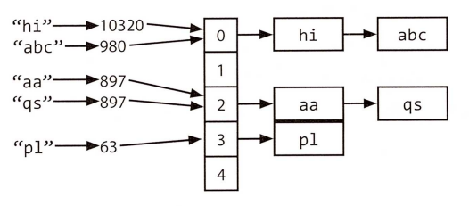

- **균형 이진 탐색 트리로 구현**
  - 이 경우에 탐색 시간은 `O(log N)`이 된다.
  - 키의 집합을 특정 순서로 차례대로 접근할 수 있는데 , 어떤 경우에는 이런 기능이 유용하기도 하다.

> ✋ **[객체의 hashCode() 와 String의 hashCode()](https://brunch.co.kr/@mystoryg/133)**
> - `equals()`가 **false**이고 `hashCode()`가 **true**인 경우 ➜ HashMap에서 **다른 key**로 처리
> - `equals()`가 **true**이고 `hashCode()`가 **false**인 경우 ➜ HashMap에서 **다른 key**로 처리
> - `equals()`가 **true**이고 `hashCode()`가 **true**인 경우 ➜ HashMap에서 **같은 key**로 처리

> ✋ **[HashTable vs HashMap vs ConcurrentHashMap](https://devlog-wjdrbs96.tistory.com/269)**

# **해시 충돌 해결 방법**

## **개방 주소법(Open Addressing)**
- 추가적인 메모리를 사용하는 `Chaining` 방식과 다르게 비어있는 해시 테이블의 공간을 활용하는 방법
- 개방 주소법을 구현하기 위한 대표적인 3가지 방식이 존재한다.
    1. **Linear Probing** : 만약 충돌이 `h[k]` 에서 난다면 `h[k + 1]`이 비어있는지 확인하고 비어 있지 않다면 `h[k + 2] . . .` 식으로 계속 확인하는 방법
    2. **Quadratic Probing** : 해시의 저장순서 폭을 제곱으로 저장하는 방식, 예를 들어 처음 충돌이 발생한 경우에는 `1`만큼 이동하고 그 다음 계속 충돌이 발생하면 `2^2, 3^2` 칸씩 옮기는 방식
    3. **Double Hashing Probing** : 해시된 값을 한번 더 해싱하여 새로운 주소를 할당하기 때문에 다른 방법들보다 많은 연산을 하게 된다.
    - 1, 2번은 버킷 조사를 원형으로 회전하게 된다 테이블의 마지막에 도달하면 다시 처음으로 이동한다.

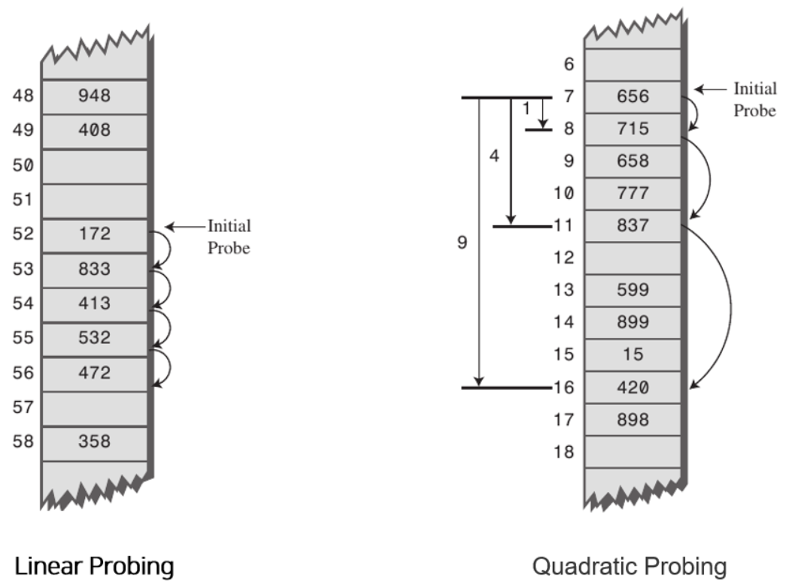


## **분리 연결법(Seperate Chaining)**
- **Java HashMap에서도 이용하고 있는 방식**
- 동일한 버킷의 데이터에 대해 **리스트 or 트리 자료구조를 이용해서 추가 메모리를 사용하여 다음 데이터의 주소를 저장하는 것**

> - 충돌이 많이 발생해서 리스트의 형태로 계속 데이터가 쌓이게 되면 검색하는데 **시간 복잡도가 `O(n)`** 으로 나빠지게 된다.
> - 그래서 Java8의 HashMap은 리스트의 개수가 8개 이상이 되면 **Self-Balancing Binary Search Tree 자료구조를 사용해 Chaining 방식을 구현** 하였다. **탐색할 때 `O(logN)`으로 성능이 좋아집니다.**


## **JAVA8의 분리 연결법**
- Java 7까지는 분리 연결법에서 충돌이 발생하면 연결 리스트를 이용하였다.
- 그런데 이러면 데이터가 많이 쌓였을 때 탐색하는데 시간이 많이 걸린다는 단점이 있기에,
- **Java 8에서는 일정 개수 이상이 되면 트리구조를 이용하는 것으로 발전했다**.
  - 그러면 `O(n)`의 탐색시간이 `O(logN)`으로 빨라질 수 있다.
- **버킷에 8개의 키-값 쌍이 쌓이면 리스트 ➜ 트리로 변경한다.** 그리고 **다시 6개이하가 되면 트리 ➜ 리스트의 형태로 바꾼다.**

```java
static final int TREEIFY_THRESHOLD = 8;

static final int UNTREEIFY_THRESHOLD = 6;
```

> - Java 8 HashMap에서는 `Entry` 클래스 대신 `Node` 클래스를 사용한다.
> - **`Node` 클래스 자체는 사실상 Java 7의 `Entry` 클래스와 내용이 같지만, 링크드 리스트 대신 트리를 사용할 수 있도록 하위 클래스인 `TreeNode`가 있다는 것이 Java 7 HashMap과 다르다.**
> - 이때 사용하는 트리는 **Red-Black Tree**인데, Java Collections Framework의 TreeMap과 구현이 거의 같다.

> ✋ **정리**
> - 개방주소법은 연속된 공간에 데이터를 저장하기 때문에 `Seperate Chaining`에 비하여 캐시 효율이 높다.
> - 따라서 **데이터의 개수가 충분히 적다면 개방 주소법이 분리 연결법보다 성능이 더 좋다**.
> - **하지만 배열의 크기가 커질수록 캐시의 효율이라는 개방 주소법의 장점은 사라진다.**
> - **Java HashMap에서 사용하고 있는 것은 `Seperate Chaining`이다.**
> - **key-value 쌍이 일정 개수 이상 많아지면 개방 주소법이 분리 연결법보다 속도가 느리다는 단점이 있다.**


[d2.naver.com 자세히 읽어보기](https://d2.naver.com/helloworld/831311)

***

# **StringBuilder**

- **[문자열(String) 객체가 저장되는 String Pool에 대하여](https://dololak.tistory.com/718)**
- **[String은 항상 StringBuilder로 변환될까?](https://siyoon210.tistory.com/160)**

***

# **재귀 Recursive 와 동적 프로그래밍 Dynamic Programming**
- 재귀적 해법은 , **부분 문제(subproblem)**에 대한 해법을 통해 완성된다.
  1. 단순히 `f(n-1)`에 대한 해답에 무언가를 더하거나, 제거하거나,
  2. 그 해답을 변경하여 `f(n)`을 계산해내거나,
  3. 데이터를 반으로 나눠 각각에 대해서 문제를 푼 뒤 이 둘을 **병합 (merge)**하기도 한다.
- 주어진 문제를 부분문제로 나누는 3가지 방법
  - 상향식 (bottom-up)
  - 하향식 (top-down)
  - 반반 (half-half)

## **상향식 접근법 (bottom-up approach)**
- 가장 직관적인 경우가 많다.
- **이 접근법은 우선 간단한 경우들에 대한 풀이법을 발견하는 것으로부터 시작한다.**
- 리스트를 예로 들어보면,
  1. 처음에는 원소 하나를 갖는 리스트로부터 시작한다.
  2. 다음에는 원소를 두 개가 들어 있는 리스트에 대한 풀이법을 찾고,
  3. 그 다음에는 세 개 원소를 갖는 리스트에 대한 풀이법을 찾는다.
  4. 이런 식으로 계속해 나간다.
- 📌 **이 접근법의 핵심은 , 이전에 풀었던 사례를 확장하여 다음 풀이를 찾는다는 점이다.**

## **하향식 접근법 (top-down approach)**
- 해당 접근법은 덜 명확해서 복잡해 보일 수 있다.
- 이러한 문제들은 **어떻게 하면 `N`에 대한 문제를 부분 문제로 나눌 수 있을지 생각해 봐야 한다.**
- 나뉜 부분 문제의 경우가 서로 겹치지 않도록 주의한다.

## **반반 접근법 (half-and-half approach)**
- 위에 소개된 2개의 접근법 외에 데이터를 절반으로 나누는 방법도 종종 유용하다.
- **이진 탐색**은 **반반 접근법**을 이용한 탐색 방법이다.
- **병합 정렬** 또한 **반반 접근법**을 이용한 정렬 방법이다.
  - 배열 절반을 각각 정렬한 뒤 이들을 하나로 병합한다.

## **동적계획법 & 메모이제이션**
- **동적 프로그래밍은 거의 대부분 재귀적 알고리즘과 반복적으로 호출되는 부분문제를 찾아내는 것이 관건이다.**
- 이를 찾은 뒤에는 나중을 위해 현재 결과를 캐시에 저장해 놓으면 된다.

### Recursive Fibo

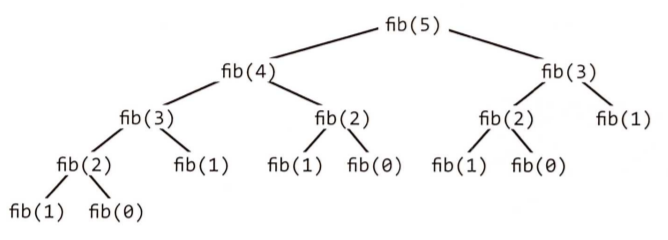

```java
int fibo(int i){
    if (i == 0) return 0;
    if (i == 1) return 1;
    return fibo(i - 1) + fibo(i - 2);
}
```

- 트리의 말단 노드는 기본 경우인 `fibo(1)`아니면 `fibo(0)`인 것을 알 수 있다.
- **각 호출에 소요되는 시간이 `O(1)`이므로 트리의 전체 노드의 개수와 수행 시간은 같다.**
- **O(2<sup>n</sup>)** 개의 노드를 갖게 되며 총 호출 횟수가 수행 시간이 된다.

### 하향식 동적 프로그래밍 (메모이제이션)
- **`fibo(i)`를 계산할 때 마다 이 결과를 캐시에 저장하고 나중에는 저장된 값을 사용하는 것이 좋다.**

```java
public int fibo(int i){
    if (i == 0) return 0;
    else if (i == 1) return 1;
    else if (memo[i] != 0) return memo[i];
    return memo[i] = fibo(i - 1) + fibo(i - 2);
}
```

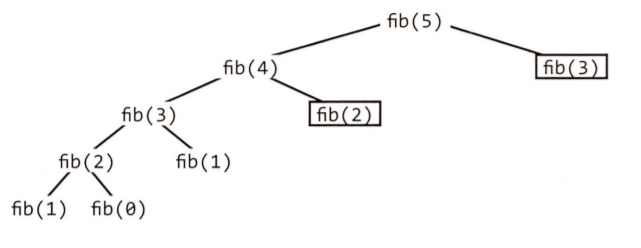

- **사각형 부분은 캐시값을 그대로 사용한 부분이며 , `O(N)` 수행 시간이 걸린다.**


### 상향식 동적 프로그래밍

```java
public int fibo(int n){
    if(n == 0) return 0;
    else if(n == 1) return 1;
    int[] memo = new int[n];
    memo[0] = 0;
    memo[1] = 1;
    for(int i = 2 ; i < n ; i++){
        memo[i] = memo[i - 1] + memo[i - 2];
    }
    return memo[n - 1] + memo[n - 2];
}
```

- `fibo(0)` 과 `fibo(1)`을 계산하고 , 이 둘을 이용해(이전의 결과를 이용해) 위로 점차 올라간다.
- `memo[i]`는 `memo[i + 1]` 과 `memo[i + 2]`를 계산할 때만 사용될 뿐 , 그 뒤에는 전혀 사용되지 않는다.
  - 따라서 `memo` 배열 말고 변수 몇 개를 사용해서 풀 수도 있다.


```java
public int fibo(int n){
    if(n == 0) return 0;
    int a = 0;
    int b = 1;
    for(int i = 2 ; i < n ; i++){
        int c = a + b;
        a = b;
        b = c;
    }
    return a + b;
}
```

- 피보나치 수열의 마지막 숫자 두 개를 `a`와 `b`변수에 저장하도록 바꾼 결과다.

***

# **최단경로 문제**
- 최단 경로 문제란 두 노드를 잇는 가장 짧은 경로를 찾는 문제입니다. 
- **가중치가 있는 그래프(Weighted Graph)에서는 엣지 가중치의 합이 최소가 되도록 하는 경로를 찾으려는 것이 목적입니다.**
- 최단 경로 문제엔 다음과 같은 변종들이 존재합니다.
- **단일 출발(single-source) 최단경로** : 단일 노드 v에서 출발하여 그래프 내의 모든 다른 노드에 도착하는 가장 짧은 경로를 찾는 문제.
- **단일 도착(single-destination) 최단경로** : 모든 노드들로부터 출발하여 그래프 내의 한 단일 노드 v로 도착하는 가장 짧은 경로를 찾는 문제. 그래프 내의 노드들을 거꾸로 뒤집으면 단일 출발 최단경로문제와 동일.
- **단일 쌍(single-pair) 최단 경로** : 주어진 꼭지점 u와 v에 대해 u에서 v까지의 최단 경로를 찾는 문제.
- **전체 쌍(all-pair) 최단 경로** : 그래프 내 모든 노드 쌍들 사이의 최단 경로를 찾는 문제.

> ✋ 
> - **플로이드-와샬 알고리즘**은 **전체 쌍 최단 경로**문제에 널리 쓰인다.
> - **다익스트라 알고리즘** , **벨만-포드 알고리즘** , **SPFA**는 **단일 출발 최단경로**문제를 푸는데 적합합니다. 하지만 여기에서 **조금 더 응용하면 나머지 세 문제도 풀 수 있습니다.**

- **출처 [ratsgo.github.io](https://ratsgo.github.io/data%20structure&algorithm/2017/11/25/shortestpath/)**

## 다익스트라 알고리즘
- 그래프의 간선에 가중치를 부여돼어있을 때 , `현재 위치에서 목표 위치까지 최단 경로`는?(**단일 출발 최단경로**문제) **다익스트라 알고리즘**
- 📌 **사이클이 있을수도 있는 가중 방향 그래프에서 두 지점간의 최단 경로를 찾는 방법이다.**
- **참고 예제**
  - [백준 - 최단경로](https://jeongcode.github.io/docs/algorithm/2021y10m/#%EB%B0%B1%EC%A4%80-%EB%8B%A4%EC%9D%B5%EC%8A%A4%ED%8A%B8%EB%9D%BC---%EA%B8%B0%EC%B4%88%EB%AC%B8%EC%A0%9C-%EC%B5%9C%EB%8B%A8%EA%B1%B0%EB%A6%AC)
  - [백준 - 숨바꼭질3](https://jeongcode.github.io/docs/algorithm/2021y09m/#-%EB%B0%B1%EC%A4%80-bfs-%EC%88%A8%EB%B0%94%EA%BC%AD%EC%A7%883)
- **동작 원리**
  1. `s`에서 시작한다．
  2. `s`의 유출 간선의 개수만큼 우리 자신을 복제한 뒤 해당 간선을 걸어간다.`(s, x)`
  의 가중치가 `5`라면 `x`에 도달하는 데 실제로 **5분**이 걸린다는 뜻이다．
  3. **노드에 도착하면 이전에 누가 방문했었는지 확인한다. 만약 방문했었다면 거기
  서 멈춘다.** `s`에서 시작한 다른 누군가가 이미 우리보다 빨리 도착했기 때문에
  자동으로 현재 경로는 다른 경로보다 더 빠를 수 없게 된다. **아무도 도착한 적
  이 없다면 , 다시 우리 자신을 복제한 뒤 가능한 모든 경로로 나아간다.**
  4. 먼저 `t`에 도착하는사람이 이긴다.

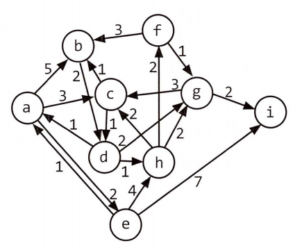

<!-- |    |**a**|**b**|**c**|**d**|**e**|**f**|**g**|**h**|**i**|
|----|---|---|---|---|---|---|---|---|---|
|**a**|0|5|3||2|||||
|**b**||0||2||||||
|**c**||1|0|1||||||
|**d**|1|||0|||2|1||
|**e**|1||||0|||4|7|
|**f**||3||||0|1|||
|**g**|||3||||0||2|
|**h**|||2||||2|0||
|**i**|||||||||0| -->


- `path_weight[node]` : 시작 지점에서 `node`로의 최단 경로의 길이가 적혀있다.
  - `path_weight[0]`만 **0**으로 초기화 되어 있고 , 나머지는 모두 무한대 값으로 초기화 된다.
- `previous[node]` : 현재까지의 최단 경로가 주어졌을 때 , 각 노드를 방문하기 이전 노드의 정보가 적혀있다.
- `remaining` : **모든 노드에 대한 우선순위 큐 이다.**
  - 각 노드의 우선순위는 `path_weight`에 의해 정의된다.
- **`remaining`이 빌 때까지 노드를 꺼내 와서 다음을 수행한다.**
    1. `remaining`에서 `path_weight`가 가장 작은 노드를 선택한다.
       - 이노드를 `n`이라 하자.
    2. 📌 **인접한 노드들에 대해서 `path_weight[x]`(현재까지의 `a`에서 `x`로의 최단 경로)와 `path_weight[n] + edge_weight[(n , x)]`를 비교한다.**
        - `a`에서 `x`로 가는 현재까지의 경로보다 더 짧은 경로가 존재한다면 , `path_weight`와 `previouse`를 갱신한다.
    3. `remaining`에서 `n`을 삭제한다.
    4. `remaining`이 비면 `path_weight`에는 `a`에서 각각의 노드로의 최단 경로의 거리가 들어있게 된다.
- **위의 `previous`를 쫓아가면서 최단 경로를 재구성할 수 있다.**
    1. `n`의 첫번째 값은 `a`가 된다. 
    2. 인접한 노드 `(b , c , e)`를 보고 `path_weight (각각 5 , 3 , 2)` 와 `previous(a)`를 갱신하고 `remaining`에서 `a`를 삭제한다.
    3. 그 다음으로 작은 노드인 `e`를 선택한다. `path_weight[e]`를 2로 갱신했었다. 
    4. `e`의 인접한 노드는 `h`,`i`이므로 `path_weight (각각 6 , 2)`와 `previous`를 갱신한다. 
       - 6은 `path_weight[e](2) + (e , h)(4)`의 결과이다.
    5. 그 다음으로 작은 노드는 3인 `c`이다. 인전합 노드는 `b`와 `d`이다. 
    6. `path_weight[d]`는 무한대 값이므로 4로 갱신한다. `path_weight[c] + weight(c , d)`, `path_weight[b]`는 이전에 5였지만 , `path_weight[c] + weight(c , b) (3+1=4)`가 5보다 작으므로 `path_weight[b]`는 4로 갱신되고 `previous`는 `c`로 갱신된다.
       - `a`에서 `b`로 가는 경로가 `c`를 통해서 가는 경로로 개선되었다는 뜻이다.
- 아래의 다이어그램은 `path_weight`(왼쪽)와 `previous`(오른쪽)가 변하는 것을 단계별로 보여준다.


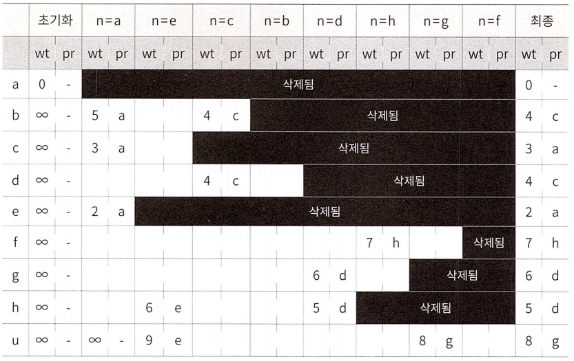

## 벨만-포드 알고리즘
- **출처 [ratsgo.github.io](https://ratsgo.github.io/data%20structure&algorithm/2017/11/27/bellmanford/)**
- **단일 출발 최단경로**문제에 적합하며 , 가중치가 **음수**일 때도 사용 가능하다.
  - *하지만 , 다익스트라 알고리즘에 비해 느리므로 , **가중치가 모두 양수일 경우에는 다익스트라 알고리즘을 사용한다.***
- **동작 원리**

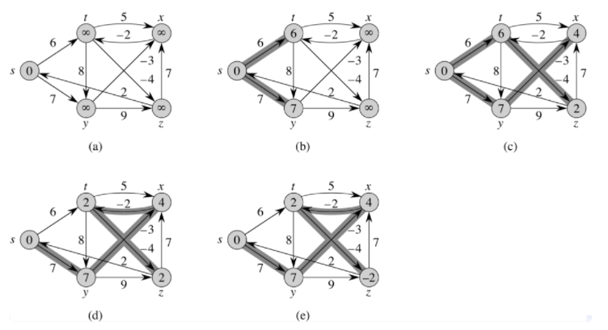

- [벨만-포드 참고](https://coder-in-war.tistory.com/entry/%EA%B0%9C%EB%85%90-38-%EB%B2%A8%EB%A7%8C%ED%8F%AC%EB%93%9CBellman-Ford-%EC%95%8C%EA%B3%A0%EB%A6%AC%EC%A6%98)
  - `(vertex - 1) * edge`만큼만 확인하는 이유
  - `INF`일 때 `contiune`하는 이유
  - `costArr`이 `long`인 이유
  

### 음수간선


> - 위 그림에서 `c`,`d` 그리고 `e`,`f`가 사이클을 이루고 있는 걸 확인할 수 있습니다. 
> - `c`,`d`의 경우 사이클을 돌 수록 거리가 커져서 최단경로를 구할 때 문제가 되지 않습니다. 
> - 반면 **`e`,`f`의 경우 사이클을 돌면 돌수록 그 거리가 작아져 벨만-포드 알고리즘으로 최단경로를 구하는 것 자체가 의미가 없어집니다.**
> - 따라서 그래프 모든 엣지에 대해 **edge relaxation (변 경감)**을 시작노드를 제외한 전체 노드수 만큼 반복 수행한 뒤, 
> - **마지막으로 그래프 모든 엣지에 대해 edge relaxation을 1번 수행**해 줍니다. 
> - 📌 이때 한번이라도 업데이트가 일어난다면 위와 같은 **negative cycle**이 존재한다는 뜻이 되어서 결과를 구할 수 없다는 의미의 **false를 반환하고 함수를 종료하게 됩니다.** 

## SFPA (Shortest Path Faster Algorithm) - `벨만-포드 알고리즘 보완`
- [**MCMF**(Minimum Cost Maximum Flow)](https://www.crocus.co.kr/1090)에서 자주 쓰인다.
- **벨만-포드**와 같은 아이디어지만 차이점은
  - **벨만-포드**는 <span style="color:red; font-weight:bold;">모든 간선에 대해 업데이트를 진행</span>
  - **SPFA**는 <span style="color:red; font-weight:bold;">바뀐 정점과 연결된 간선에 대해서만 업데이트를 진행</span>
- **이를 위해 바뀐 정점은 큐를 이용해서 관리하고, 큐에 해당 정점이 있는지 없는지는 배열을 이용해서 체크한다.**


***

# **`Kruskal Algorithm` 크루스칼 알고리즘**
- [참고 문제](https://jeongcode.github.io/docs/javaAlgorithm/section9/#-%EC%9B%90%EB%8D%94%EB%9E%9C%EB%93%9C)
- **가장 적은 비용으로 모든 노드를 연결** 하기 위해 사용 한다.
- **`Minimum Spanning Tree, MST` 최소 신장 트리**를 구하기 위해 사용한다.
  - 그래프에서 **모든 정점을 포함**
  - **정점 간 서로 연결이 되며 사이클이 존재하지 않는** 그래프
  - 따라서 **정점의 갯수가 n개일 때 , 간선이 n-1개가 된다.**
- 그리디 알고리즘의 일종이다.
  - 그래프 간선들을 **가중치의 오름차순**으로 정렬해 놓은 뒤 , 사이클을 형성하지 않는 선에서 정렬된 순서대로 간선을 선택한다.
- **`Union & Find 활용` 사이클 판단하기**
  - **Union-Find 란?**
    - Disjoint Set (서로소 집합) 을 표현하는 자료구조
    - **서로 다른 두 집합을 병합하는 Union 연산**, **집합 원소가 어떤 집합에 속해있는지 찾는 Find 연산**을 지원하기에 이러한 이름이 붙었다. 
    - [참고 문제](https://jeongcode.github.io/docs/javaAlgorithm/section9/#-disjoint-set%EC%84%9C%EB%A1%9C%EC%86%8C-%EC%A7%91%ED%95%A9--unionfind-%EC%95%8C%EA%B3%A0%EB%A6%AC%EC%A6%98-%EC%B9%9C%EA%B5%AC%EC%9D%B8%EA%B0%80--)

***

# **`LIS` 최장 증가 부분 수열 알고리즘**
- 원소가 n개인 배열의 일부 원소를 골라내서 만든 부분 수열 중,
- 각 원소가 이전 원소보다 크다는 조건을 만족하고, 그 길이가 최대인 부분 수열을 **최장 증가 부분 수열**이라고 합니다.

- 예를 들어, { 6, **2**, **5**, 1, **7**, 4, **8**, 3} 이라는 배열이 있을 경우, LIS는 **{ 2, 5, 7, 8 }** 이 됩니다.
- { 2, 5 }, { 2, 7 } 등 증가하는 부분 수열은 많지만 그 중에서 가장 긴 것이 { 2, 5, 7, 8 } 입니다.
-  일반적으로 최장 증가 부분 수열의 길이가 얼마인지 푸는 간편한 방법은 **DP**를 이용하는 것입니다.
    - 시간복잡도를 개선하기 위하여 LIS를 구성할 때 이분탐색을 활용한다.

[출처](https://chanhuiseok.github.io/posts/algo-49/)

***

# **`Backtracking` 백트래킹 특징**
- 백트래킹은 말 그대로 **역추적**을 의미한다
- 문제 해결을 위한 모든 경우의 수를 따져보기 위해서 일반적으로 활용되는 기법 중 하나이다.
  - `(완전 검색 (Exhaustive search), 실제로 모든 케이스를 다 직접 확인한다는 의미는 아니다)`
- 백트래킹은 우선 어떤 하나의 가능한 케이스를 확인하고, 가능하지 않다면 다시 Back하고,
- 다시 다른 가능성있는 케이스를 확인하면서 Solution이 도출될 때까지 이런 과정이 계속적으로 반복되도록 구현하게 된다.
- 따라서 **일반적으로 백트래킹은 알고리즘의 구조 특성상 재귀함수를 사용하여 구현**된다.
- 백트래킹에 있어 중요한 것은 문제의 요구사항에 따라서, 구현된 알고리즘의 연산량이 제한 시간을 넘어버리게 되는 경우가 발생한다는 것이다.
- 무작정 전 검색을 수행하는 데에는 한계가 발생할 수 밖에 없다.
- 따라서, 더 이상 탐색할 필요가 없는 후보군에 대해서는 재귀 호출을 더 이상 하지 않고 **가지치기 (Pruning 또는 Branch and bound) 하는 것이 매우 중요**합니다.
- 굳이 체크할 필요가 없다고 판단되는 후보군들을 적절히 제외시켜서, 연산 시간은 줄이면서 완전 검색이 수행되도록 하는 것이 백트래킹의 핵심이라고 할 수 있다.
- [N Queen 문제 최적화 (Backtracking)](https://jayce-with.tistory.com/17)

[출처 Jayce's Blog](https://jayce-with.tistory.com/16)

***