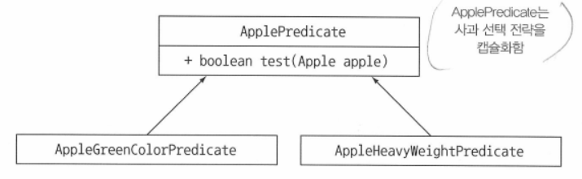
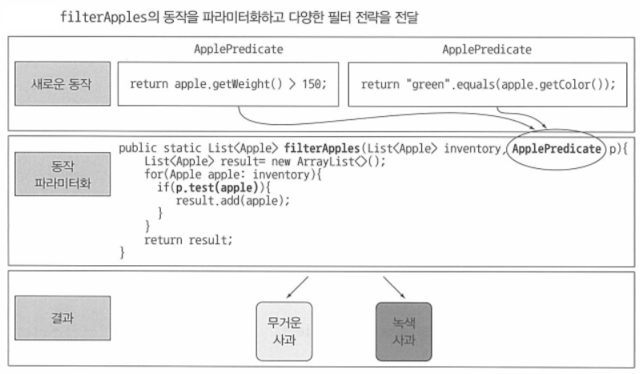

## Table of contents
{: .no_toc .text-delta }

1. TOC
{:toc}
---

# **동작 파라미터화**

- 농부의 요구사항
1. 무게가 150그램 이상인 사과
2. 녹색 사과


## **첫 번째 시도** , 가능한 모든 속성으로 필터링

```java
public static List<Apple> filterApples(List<Apple> inventory , Color color , int weight , boolean flag){
    List<Apple> result = new ArrayList<>();
    for(Apple apple : inventory){
        if((flag && apple.getColor().equals(color)) ||
            (!flag && apple.getWeight() > weight)){
                result.add(apple);
            }
    }
    return result;
}
```

- **형편없는 코드다.**
- 대체 `true` 와 `false`는 뭘 의미하는걸까?
- 요구사항이 바뀌었을 때 유연하게 대응할 수도 없다.
  - 예를들어 , 사과의 크기 , 모양 , 출하지 등으로 사과를 필터링 하고 싶다면?

## **두 번째 시도** , 추상적 조건으로 필터링

### 선택 조건을 결정하는 인터페이스

```java
// 인터페이스
public interface ApplePredicate{
    boolean test (Apple apple);
}

public class AppleHeavyWeightPredicate implements ApplePredicate{
    public boolean test(Apple apple){
        return apple.getWeight() > 150;
    }
}

public class AppleGreenColorPredicate implements ApplePredicate{
    public boolean test(Apple apple){
        return GREEN.equals(apple.getColor());
    }
}

```




> ✋ **전략 디자인 패턴**
> - 각 알고리즘 (전략이라 불리는)을 캡슐화하는 알고리즘 패밀리를 정의해둔 다음, 
> - 런타임에 알고리즘을 선택하는 기법이다.
> - `ApplePredicate`가 **알고리즘 패밀리**이고 ,
> - `AppleHeavyWeightPredicate` , `AppleGreenColorPredicate`가 **전략**이다.

- 이렇게 **동작 파라미터화** , 즉 메서드가 다양한 동작(전략)을 **받아서** 내부적으로 다양한 동작을 **수행**할 수 있다.
- 이제 `ApplePredicate`객체를 인수로 받도록 고칠 수 있다.

```java
public static List<Apple> filterApples(List<Apple> inventory , ApplePredicate p){
    List<Apple> result = new ArrayList<>();
    for(Apple apple : inventory){
        if(p.test(apple)){ // Predicate 객체로 사과 검사조건을 캡슐화 했다.
            result.add(apple);
        }
    }
    return result;
}
```



- **우리는 `filterApples` 메서드의 동작을 파라미터화한 것이다.**
- 이는 `코드를 전달`할 수 있는 것이나 다름없다.

***

# **복잡한 과정 간소화**

- 현재 `filterApples` 메서드로 새로운 동작을 전달하려면 `ApplePredicate` 인터페이스를 구현하는 여러 클래스를 정의한 다음에 인스턴스화 해야한다.
  - *이는 상당히 번거로우며 , 시간낭비다.*

```java
public interface ApplePredicate{
    boolean test (Apple apple);
}

public class AppleHeavyWeightPredicate implements ApplePredicate{
    public boolean test(Apple apple){
        return apple.getWeight() > 150;
    }
}

public class AppleGreenColorPredicate implements ApplePredicate{
    public boolean test(Apple apple){
        return GREEN.equals(apple.getColor());
    }
}

public class FilteringApples{
    public static void main(String... args){
        List<Apple> inventory = Arrays.asList(new Apple(80 , GREEN),
                                                new Apple(155 , GREEN),
                                                new Apple(120 , RED));

        List<Apple> heavyApples = filterApples(inventory , new AppleHeavyWeightPredicate());
        List<Apple> greenApples = filterApples(inventory , new AppleGreenColorPredicate());
    }

    public static List<Apple> filterApples(List<Apple> inventory , ApplePredicate p){
        List<Apple> result = new ArrayList<>();
        for(Apple apple : inventory){
            if(p.test(apple)){
                result.add(apple);
            }
        }
        return result;
    }
}
```

- 자바는 클래스의 선언과 인스턴스화를 동시에 수행할 수 있도록 **익명 클래스**라는 기법을 제공한다.

## **세 번째 시도** , 익명 클래스 적용

- 자바의 지역 클래스 (블록 내부에 선언된 클래스)와 비슷한 개념이다.
- 말 그대로 이름이 없는 클래스다.
- **클래스 선언과 인스턴스화를 동시에 할 수 있다.**
  - 즉 , **즉석에서 필요한 구현을 만들어서 사용할 수 있다.**
- 익명 클래스를 이용해서 `ApplePredicate`를 구현하는 객체를 만드는 방법으로 필터링 예제를 다시 구현한 코드다.

```java

List<Apple> redApples = filterApples(inventory , new ApplePredicate(){
    // 메서드의 동작을 직접 파라미터화 했다.
    public boolean test(Apple apple){
        return RED.equals(apple.getColor());
    }
});

```

- 많은 프로그래머가 익명 클래스의 사용에 익숙하지 않다.
- 아래의 실행결과는 무엇일까?

```java

public class MeaningOfThis{
    public final int value = 4;
    public void doIt(){
        int value = 6;
        Runnable r = new Runnable(){
            public final int value = 5;
            public void run(){
                int value = 10;
                System.out.println(this.value);
            }
        };
        r.run();
    }

    public static void main(String... args){
        MeaningOfThis m = new MeaningOfThis();
        m.doIt();
    }
}

```

- 코드에서 `this`는 MeaningOfThis가 아니라 **Runnable**을 참조하므로 **5**가 정답이다.
- 코드의 장황함은 나쁜 특성이다.
- 결국은 객체를 만들고 명시적으로 새로운 동작을 정의하는 메서드를 구현해야 한다는 점은 변하지 않는다.
- **람다 표현식이라는 더 간단한 코드 전달 기법을 도입해서 이 문제를 해결했음을 보게 될 것이다.**

## **네 번째 시도** , 👍 람다 표현식 사용

```java
List<Apple> result = filterApples(inventory , (Apple apple) -> RED.equals(apple.getColor()));
```

## **다섯 번째 시도** , 👍 리스트 형식으로 추상화

```java

public interface Predicate<T>{
    boolean test(T t);
}

public static <T> List<T> filter(List<T> list , Predicate<T> p){
    List<T> result = new ArrayList<>();
    for(T e : list){
        if(p.test(e)) result.add(e);
    }
    return result;
}

```

- 이제 바나나 , 오렌지 , 정수 , 문자열 등의 리스트에 필터 메서드를 사용할 수 있다.

```java

List<Apple> redApples = filter(inventory , (Apple apple) -> RED.equals(apple.getColor()));

List<Integer> evenNumbers = filter(numbers , (Integer i) -> i % 2 == 0);

```

***

# **실전 예제**

- 동작 파라미터화 패턴은 동작을 (한 조각의 코드로) 캡슐화 한 다음에 메서드로 전달해서 메서드의 동작을 파라미터화 한다.
- 📌 **지금까지 살펴본 것처럼 동작 파라미터화를 이용하면 요구사항 변화에 더 유연하게 대응할 수 있으므로 모든 프로그래머가 동작 파라미터화를 사용하도록 권장한다.**

## Comparator로 정렬하기

- 자바 8의 `List`에는 `sort`메서드가 포함되어 있다.
- 다음과 같은 인터페이스를 갖는 `java.util.Comparator`객체를 이용해서 `sort`의 동작을 파라미터화 할 수 있다.
- `Comparator`를 구현해서 `sort`메서드의 동작을 다양화할 수 있다.


```java
// java.util.Comparator
public interface Comparator<T>{
    int compare(T o1 , T o2);
}

// 무게가 적은 순서로 정렬

inventory.sort(new Comparator<Apple>(){
    public int compare(Apple a1 , Apple a2){
        return a1.getWeight().compareTo(a2.getWeight());
    }
});

// 람다 표현식 사용

inventory.sort((Apple a1 , Apple a2) -> a1.getWeight().compareTo(a2.getWeight()));

```