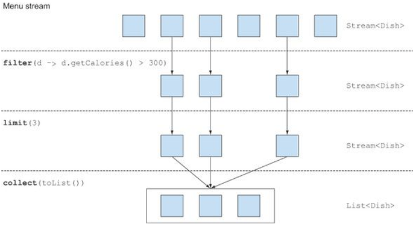
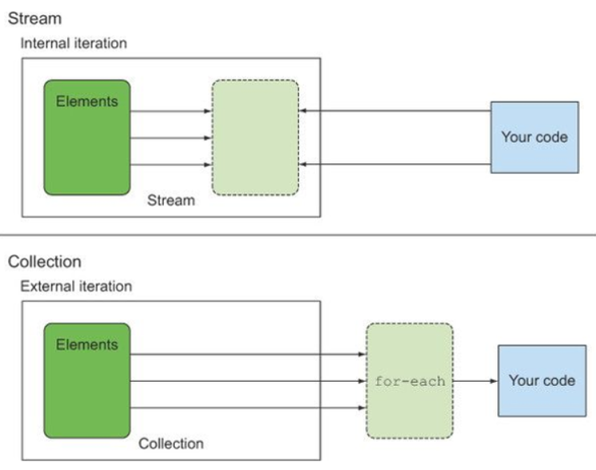

## Table of contents
{: .no_toc .text-delta }

1. TOC
{:toc}
---

- **`SELECT name FROM dishes WHERE calorie < 400`**
  - SQL질의 언어에서는 우리가 기대하는 것이 무엇인지 직접 표현할 수 있다.
- **컬렉션으로도 이와 비슷한 기능을 만들 수 있지 않을까?**
- **많은 요소를 포함하는 커다란 컬렉션은 어떻게 처리해야 할까?**
  - 성능을 높이려면 멀티코어 아키텍처를 활용해서 병렬로 컬렉션의 요소를 처리해야한다.
  - 하지만 병렬 처리 코드를 구현하는 것은 단순 반복 처리 코드에 비해 복잡하고 어렵다.
  - 게다가 복잡한 코드는 디버깅도 어렵다.

# **스트림이란 무엇인가?**

- 📌 **스트림을 이용하면**
  -  선언형(**즉 , 데이터를 처리하는 임시 구현 코드 대신 질의로 표현할 수 있다.**)으로 컬렉션 데이터를 처리할 수 있다.
  - 멀티 스레드 코드를 구현하지 않아도 **데이터를 투명하게 병렬로 처리할 수 있다.** (7장에서 자세히)


**예제 (filter , sort , 반환)**
  - **저칼로리의 요리명을 반환하고 , 칼로리를 기준으로 요리를 정렬한다.**

**자바 7**
```java
  List<Dish> lowCaloricDishes = new ArrayList<>();
  for(Dish dish : menu){
      if(dish.getCalories() < 400){
          lowCaloricDishes.add(dish);
      }
  }
  Collections.sort(lowCaloricDishes , new Comparator<Dish>(){ // 익명클래스로 정렬
      public int compare(Dish dish1 , Dish dish2){
          return Integer.compare(dish1.getCalories() , dish2.getCalories());
      }
  });
  List<String> lowCaloricDishesName = new ArrayList<>();
  for(Dish dish : lowCaloricDishes){
      lowCaloricDishesName.add(dish.getName());
  }
```
- `lowCaloricDishes`는 컨테이너 역할만 하는 중간 변수다. **(가비지 변수)**
- 자바 8 에서 이러한 세부 구현은 라이브러리 내에서 모두 처리한다.

> ✋ [Comparator와 Comparable](https://velog.io/@injoon2019/%EC%9E%90%EB%B0%94-Comparator%EC%99%80-Comparable)

**자바 8**
```java
  import static java.util.Comparator.comparing;
  import static java.util.stream.Collectors.toList;

  List<String> lowCaloricDishesName =
              menu.stream()
                  .filter(dish -> dish.getCalories() < 400)
                  .sorted(comparing(Dish::getCalories))
                  .map(Dish::getName)
                  .collect(toList());

  List<String> lowCaloricDishesName =
              menu.parallelStream() // 병렬 실행
                  .filter(dish -> dish.getCalories() < 400)
                  .sorted(comparing(Dish::getCalories))
                  .map(Dish::getName)
                  .collect(toList());
```
> - **7장**에서 아래의 항목에 대해 설명한다.
>   - `parallelStream()`을 호출했을 때 정확히 어떤 일이 일어날까?
>   - 얼마나 많은 스레드가 사용되는 걸까?
>   - 얼마나 성능이 좋을까?

- **선언형으로 코드를 구현하여 변하는 요구사항에 쉽게 대응할 수 있다.**
- `filter` , `sorted` , `map` , `collect` 같은 **여러 빌딩 블록 연산을 연결해서 복잡한 데이터 처리 파이프라인을 만들 수 있다.**
  - 위의 4가지 연산은 **고수준 빌딩 블록**으로 이루어져 있으므로 특정 스레딩 모델에 제한되지 않고 자유롭게 어떤 상황에서든 사용할 수 있다.
- 📌 **결과적으로 데이터 처리 과정을 병렬화하면서 스레드와 락을 걱정할 필요가 없다.**

 ❗ **6장 `스트림으로 데이터 수집` 예제 맛보기**
 ```java
 Map<Dish.Type , List<Dish>> dishesByType
            = menu.stream().collect(groupingBy(Dish::getType));
 ```
 ```
 FISH = [prawns , salmon]
 OTHER = [french fries , rice , season fruit , pizza]
 MEAT = [pork , beef , chicken]
 ```

> **기타 라이브러리 : 구아바 , 아파치 , 람다제이**
> - 자바 프로그래머가 컬렉션을 제어하는 데 도움이 되는 다양한 라이브러리가 있다.
> - **구글 ➜ 구아바(Guava)** 는 멀티맵 , 멀티셋등 추가적인 컨테이너 클랙스를 제공한다.
> - **아파치 공통 컬렉션 라이브러리**도 위와 비슷한 기능을 제공한다.
> - **람다제이**는 함수형 프로그래밍에서 영감을 받은 선언형으로 컬렉션을 제어하는 다양한 유틸리티를 제공한다.

***

# **스트림 시작하기**

- `List<Dish> menu = Arrays.asList(...)`
```java
  List<Dish> menu = Arrays.asList(
                  new Dish("pork" , false , 800 , Dish.Type.MEAT),
                  new Dish("beef" , false , 700 , Dish.Type.MEAT),
                  new Dish("chicken" , false , 400 , Dish.Type.MEAT),
                  new Dish("french fries" , true , 530 , Dish.Type.OTHER),
                  new Dish("rice" , true , 350 , Dish.Type.OTHER),
                  new Dish("season fruit" , true , 120 , Dish.Type.OTHER),
                  new Dish("pizza" , true , 550 , Dish.Type.OTHER),
                  new Dish("prawns" , false , 300 , Dish.Type.FISH),
                  new Dish("salmon" , false , 450 , Dish.Type.FISH)
  );
```

- `public Class Dish{..}`
```java
public class Dish {
    private final String name;
    private final boolean vegetarian;
    private final int calories;
    private final Type type;

    public Dish(String name, boolean vegetarian, int calories , Type type) {
        this.name = name;
        this.vegetarian = vegetarian;
        this.calories = calories;
        this.type = type;
    }

    public String getName() {
        return name;
    }

    public boolean isVegetarian() {
        return vegetarian;
    }

    public int getCalories() {
        return calories;
    }

    public Type getType() {
        return type;
    }

    public enum Type {MEAT , FISH , OTHER}
}
```

## **스트림이란 , `데이터 처리 연산을 지원하도록 소스에서 추출된 연속된 요소`로 정의할 수 있다.**
- 자바 8 컬렉션에는 스트림을 반환하는 `stream`메서드가 추가됐다.
- 스트림의 인터페이스 정의는 `java.util.stream.Stream` 참고

1. **연속된 요소**
    - 컬렉션과 마찬가지로 스트림은 특정 요소 형식으로 이루어진 연속된 값 집합의 인터페이스를 제공한다.
    - **컬렉션의 주제는 데이터이고 , 스트림의 주제는 계산이다.**

2. **소스**
    - **스트림은 컬렉션 , 배열 , I/O 자원등의 데이터 제공 소스로부터 데이터를 소비한다.**
    - 리스트로 스트림을 만들면 스트림의 요소는 리스트의 요소와 같은 순서를 유지한다.

3. **데이터 처리 연산**
    - **스트림은 함수형 프로그래밍 언어에서 일반적으로 지원하는 연산과 데이터베이스와 비슷한 연산을 지원한다.**
    - **스트림 연산은 순차적으로 또는 병렬로 실행할 수 있다.**

4. **파이프라이닝**
    - **대부분의 스트림 연산은 스트림 연산끼리 연결해서 커다란 파이프라인을 구성할 수 있도록 스트림 자신을 반환한다.**
    - 그 덕분에 **laziness , short-circuiting**같은 최적화도 얻을 수 있다. *(5장에서 설명)*
    - **연산 파이프라인은 데이터 소스에 적용하는 데이터베이스 질의와 비슷하다.**

5. **내부 반복**
    - 반복자를 이용해서 명시적으로 반복하는 컬렉션과 달리 **스트림은 내부 반복을 지원한다.** *(4.3.2절 에서 설명)*

## 예제

```java
  List<String> threeHighCaloricDishNames =
          menu.stream()
              .filter(dish -> dish.getCalories() > 300)
              .map(Dish::getName)
              .limit(3)
              .collect(toList());
  System.out.println(threeHighCaloricDishNames);
  // [pork, beef, chicken]
```



1. menu에 `stream()` 메서드를 호출해서 스트림을 얻었다.
    - **데이터 소스**는 요리 리스트다.
    - 요리 리스트는 **연속된 요소**를 스트림에 제공한다.
2. 다음으로 스트림에 `filter` , `map` , `limit` 로 이어지는 일련의 **데이터 처리 연산**을 적용한다.
    - 📌 **`collect`를 제외한 모든 연산은 서로 파이프라인을 형성할 수 있도록 스트림을 반환한다.**
    - **파이프라인은 소스에 적용하는 질의 같은 존재다.**
3. 마지막으로 `collect`연산으로 파이프라인을 처리해서 결과를 반환한다.
    - **마지막에 `collect`를 호출하기 전까지는 menu에서 무엇도 선택되지 않으며 출력 결과도 없다.**
    - ✋ [종료형 오퍼레이터 유무 , 종료형 오퍼레이터는 없지만 인스턴스가 사용될 때](https://jeongcode.github.io/docs/java/java8/stream-optional/#-%EC%A2%85%EB%A3%8C%ED%98%95-%EC%98%A4%ED%8D%BC%EB%A0%88%EC%9D%B4%ED%84%B0%EB%8A%94-%EC%97%86%EC%A7%80%EB%A7%8C-%EC%9D%B8%EC%8A%A4%ED%84%B4%EC%8A%A4%EA%B0%80-%EC%82%AC%EC%9A%A9%EB%90%A0-%EB%95%8C)
      - *필요할 때만 값을 계산한다.*
> ✋ [JAVA에서 제공하는 함수형 인터페이스](https://jeongcode.github.io/docs/java/java8/functionalInterface-lambda/#java%EC%97%90%EC%84%9C-%EC%A0%9C%EA%B3%B5%ED%95%98%EB%8A%94-%ED%95%A8%EC%88%98%ED%98%95-%EC%9D%B8%ED%84%B0%ED%8E%98%EC%9D%B4%EC%8A%A4)

***
# **컬렉션과 스트림**
- **데이터를 언제 계산하느냐**가 컬렉션과 스트림의 가장 큰 차이다.
- **컬렉션**은 현재 자료구조가 포함하는 **모든**값을 메모리에 저장하는 자료구조다.
  - 즉 , **컬렉션의 모든 요소는 컬렉션에 추가하기 전에 계산되어야 한다.**
- **스트림**은 이론적으로 **요청할 때만 요소를 계산**하는 고정된 자료구조다.
  - **스트림에 요소를 추가하거나 제거할 수 없다.**
  - 📌 **사용자가 요청하는 값만 스트림에서 추출한다는 것이 핵심이다.**
  - 게으르게 만들어지는 컬렉션과 같다.

## 딱 한 번만 탐색할 수 있다.
- **반복자와 마찬가지로 한 번 탐색한 요소를 다시 탐색하려면 초기 데이터 소스에서 새로운 스트림을 만들어야한다.**
  - *즉 , 탐색된 스트림의 요소는 소비된다.*
  - 컬렉션처럼 반복 사용할 수 있는 데이터 소스여야한다. 데이터 소스가 `I/O 채널`이라면 소스를 반복 사용할 수 없으므로 새로운 스트림을 만들 수 없다.
  - <span style="color:red; font-weight:bold">스트림은 단 한번만 소비할 수 있다는 점을 명심하자!</span>

```java
  Stream<String> threeHighCaloricDishNames =
          menu.stream()
                  .filter(dish -> dish.getCalories() > 300)
                  .map(dish -> dish.getName())
                  .limit(3);

  System.out.println(threeHighCaloricDishNames);
  System.out.println(threeHighCaloricDishNames);

  threeHighCaloricDishNames.forEach(System.out::println);
  threeHighCaloricDishNames.forEach(System.out::println);

/*
java.util.stream.SliceOps$1@6acbcfc0
java.util.stream.SliceOps$1@6acbcfc0
pork
beef
chicken
Exception in thread "main" java.lang.IllegalStateException: stream has already been operated upon or closed
    at java.base/java.util.stream.AbstractPipeline.evaluate(AbstractPipeline.java:229)
    at java.base/java.util.stream.ReferencePipeline.forEach(ReferencePipeline.java:497)
    at Main.main(Main.java:34)
*/
```

## 내부 반복과 외부 반복
- **외부 반복**
  - 사용자가 직접 요소를 반복하는 것 (컬렉션 인터페이스 `for-each`등)
  - 컬렉션 내부적으로 숨겨졌던 반복자를 사용하는 것
  - **즉 , 명시적으로 컬렉션 항목을 하나씩 가져와서 처리한다.**
  - **병렬성을 스스로 관리**해야한다.
```java
  List<String> names = new ArrayList<>();
  for(Dish dish : menu){
      names.add(dish.getName());
  }

  Iterator<Dish> iterator = menu.iterator();
  while(iterator.hasNext()){
      Dish dish = iterator.next();
      names.add(dish.getName());
  }
```


- 스트림 라이브러리는 **내부 반복**을 사용한다.
  - **반복을 알아서 처리하고 결과 스트림 값을 어딘가에 저장해주는 것**
  - **함수에 어떤 작업을 수행할지만 지정하면 모든것이 알아서 처리된다.**
  - **작업을 투명하게 병렬로 처리하거나 , 더 최적화된 다양한 순서로 처리할 수 있다**.
```java
List<String> innerIterNames = menu.stream()
                                  .map(dish -> dish.getName())
                                  .collect(toList());
```



***

# **스트림 연산**
- `java.util.stream.Stream` 인터페이스는 많은 연산을 정의한다.

## 중간 연산
- **연결할 수 있는 스트림 연산**
- `filter` 나 `sorted` 같은 중간 연산은 **다른 스트림을 반환한다.**
- 📌**중간 연산의 중요한 특징은 최종 연산을 스트림 파이프라인에 실행하기 전까지는 아무 연산도 수행하지 않는다는 것** ➜ `lazy`
  - *중간 연산을 합친 다음에 합쳐진 중간 연산을 최종 연산으로 한 번에 처리하기 때문이다.*

```java
  List<String> threeHighCaloricDishNames =
          menu.stream()
                  .filter(dish -> {
                      System.out.println("filtering : " + dish.getName());
                      return dish.getCalories() > 300;
                  })
                  .map(dish -> {
                      System.out.println("mapping : " + dish.getName());
                      return dish.getName();
                  })
                  .limit(3)
                  .collect(toList());

  System.out.println(threeHighCaloricDishNames);
```
```
filtering : pork
mapping : pork
filtering : beef
mapping : beef
filtering : chicken
mapping : chicken
[pork, beef, chicken]
```
**`lazy`한 특성 덕분에 몇 가지 최적화 효과를 얻을 수 있었다.**
1. 300칼로리가 넘는 요리는 여러 개지만 오직 처음 3개만 선택되었다.
    - 이는 `limit`연산 그리고 **쇼트 서킷**이라 불리는 기법 덕분이다. *(5장에서 설명)*
2. `filter`와 `map`은 서로 다른 연산이지만 **루프 퓨전**을 사용하여 **한 과정으로 병합되었다.**

|연산|반환 형식|연산의 인수|함수 디스크립터|
|------|---|---|---|
|**filter**|`Stream<T>`|`Predicate<T>`| T ➜ boolean
|**map**|`Stream<T>`|`Function<T , R>`| T ➜ R
|**limit**|`Stream<T>`|
|**sorted**|`Stream<T>`|`Comparator<T>`|  (T , T) ➜ int
|**distinct**|`Stream<T>`|

## 최종 연산
- **스트림을 닫는 연산**
- 스트림 파이프라인에서 결과를 도출한다.
- **보통 최종 연산에 의해 List , Integer , void 등 스트림 이외의 결과가 반환된다.**

|연산|반환 형식|목적|
|------|---|---|
|**forEach**|`void`|스트림의 각 요소를 소비하면서 람다를 적용한다.|
|**count**|`long`|스트림의 요소개수를 반환한다.|
| **collect** || 스트림을 리듀스해서 리스트 , 맵 , 정수 형식의 컬렉션을 만든다. *6장 참조* |

## 퀴즈
- **다음 스트림 파이프라인에서 중간 연산과 최종 연산을 구별하시오.**
```java
long count = menu.stream()
                  .filter(d -> d.getCalories() > 300)
                  .distinct()
                  .limit(3)
                  .count();
```
- `count`는 스트림이 아닌 `long`을 반환한다.
- 따라서 `count`는 최종 연산이다.
- `filter` , `distinct` , `limit`은 스트림을 반환하며 서로 연결할 수 있으니 , 중간 연산이다.

***

# **스트림 이용하기**
- **스트림 이용 과정은 다음과 같이 세가지로 요약할 수 있다.**
1. **질의를 수행할 (컬렉션 같은) 데이터 소스**
2. **스트림 파이프라인을 구성할 중간 연산 연결**
3. **스트림 파이프라인을 실행하고 결과를 만들 최종 연산**

- 스트림 파이프라인의 개념은 **빌더 패턴**과 비슷하다.
  - 빌더 패턴에서는 호출을 연결해서 설정을 만든다.
    - *스트림에서 중간 연산을 연결하는 것과 같다.*
  - 그리고 준비된 설정에 `build`메서드를 호출한다
    - *스트림에서 최종 연산과 같다.*

***

# 📌**마치며**
- 스트림은 소스에서 추출된 연속 요소로 , 데이터 처리 연산을 지원한다.
- 스트림은 내부 반복을 지원한다.
- 스트림에는 중간 연산과 최종 연산이 있다.
- 중간 연산은 `stream`을 반환하는 것이며 , 중간 연산으로는 어떤 결과도 생성할 수 없다.
- 최종 연산은 `forEach`나 `count`처럼 `stream`을 반환하지 않는 것이다.
- 스트림의 요소는 요청할 때 `lazy`하게 계산된다.
