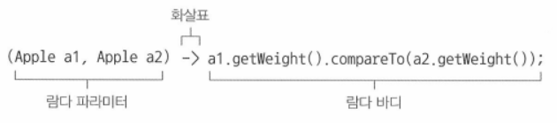
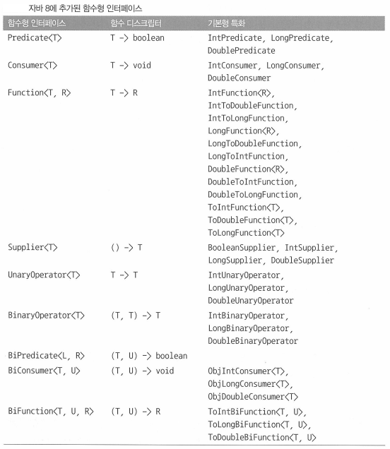
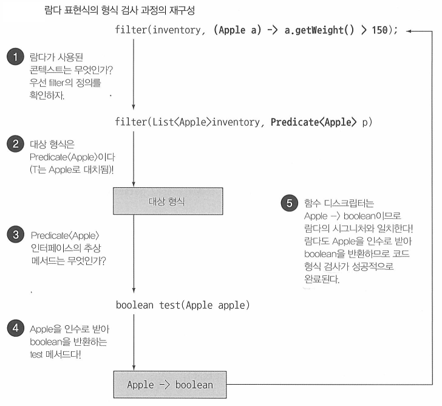
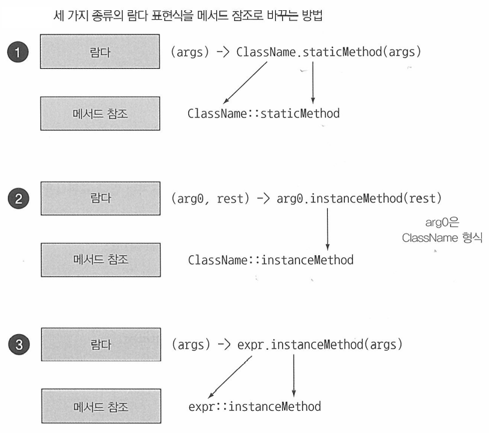

## Table of contents
{: .no_toc .text-delta }

1. TOC
{:toc}
---

# **람다 표현식**
- 익명 클래스처럼 이름이 없는 함수면서 메서드를 인수로 전달할 수 있으므로 일단은 람다 표현식이 익명 클래스와 비슷하다고 생각하자.
- 람다가 기술적으로 자바 8 이전의 바로 할 수 없었던 일을 제공하는 것은 아니다.
- **다만 동작 파라미터를 이용할 때 익명 클래스 등 판에 박힌 코드를 구현할 필요가 없다.**
- **람다 표현식은 광범위하게 사용되므로 이 장의 내용을 완벽하게 이해해야 한다.**

## 람다의 기본 문법
- 표현식 스타일
    - `(parameters) -> expression`
    - `return`을 명시하지 않는다.
- 블록 스타일
    - `(parameters) -> { statements; }`
    - 명시적으로 `return`문을 사용해야 한다.

## 람다란 무엇인가?

- **람다 표현식**은 메서드로 전달할 수 있는 익명 함수를 단순화한 것이라고 할 수 있다.
- 람다의 특징
  1. **익명** 
       - 보통의 메서드와 달리 이름이 없으므로 **익명**이라 표현한다.
  2. **함수**
       - 람다는 메서드처럼 특정 클래스에 종속되지 않으므로 함수라고 부른다.
       - 하지만 메서드 처럼 **파라미터 리스트** , **바디** , **반환 형식** , **발생할 수 있는 예외 리스트**는 가질 수 있다.
  3. **전달**
       - **람다 표현식을 메서드 인수로 전달하거나 변수로 저장할 수 있다.**
  4. **간결성**
       - 익명 클래스처럼 많은 자질구레한 코드를 구현할 필요가 없다.
- `Comparator`를 구현하는 기존 코드
```java
    Comparator<Apple> byWeight = new Comparator<Apple>(){
        public int compare(Apple a1 , Apple a2){
            return a1.getWeight().compareTo(a2.getWeight());
        }
    };
```
- `람다`를 사용한 코드
```java
    Comparator<Apple> byWeight = (Apple a1 , Apple a2) -> a1.getWeight().compareTo(a2.getWeight());
```



- **파라미터 리스트**
  - `Comparator`의 `compare`메서드 파라미터
- **화살표**
  - **람다의 파라미터 리스트와 바디를 구분한다.**
- **람다 바디**
  - 두 사과 무게를 비교한다. **람다의 반환값에 해당하는 표현식이다.**

## 람다 표현식 예제

```java
    (String s) -> s.length
```
- `String` 형식의 파라미터 하나를 가지며 `int`를 반환한다.
- **람다 표현식에는 return이 함축되어 있으므로 return 문을 명시적으로 사용하지 않아도 된다.**

```java
    (Apple a) -> a.getWeight() > 150
```
- `Apple`형식의 파라미터 하나를 가지며 `boolean`을 반환한다.

```java
    (int x , int y) -> {
        System.out.println("Result : " + x + y);
    }
```
- `int`형식의 파라미터 두 개를 가지며 `void` 리턴이다.
- **람다 표현식은 여러 행의 문장을 포함할 수 있다.**

```java
() -> 42
```
- 파라미터가 없으며 `int` 42를 반환한다.

# **어디에 , 어떻게 람다를 사용할까?**
- **함수형 인터페이스**라는 문맥에서 람다 표현식을 사용할 수 있다.

## 함수형 인터페이스
- **정확히 하나의 추상 메서드를 지정하는 인터페이스**
- 📌 함수형 인터페이스로 뭘 할 수 있을까?
  - 람다 표현식으로 함수형 인터페이스의 추상 메서드 구현을 직접 전달할 수 있으므로 **전체 표현식을 함수형 인터페이스의 인스턴스로 취급**할 수 있다.
  - *기술적으로 따지면 함수형 인터페이스를 **구현한** 클래스의 인스턴스*

- `java.util.Comparator`
```java
    public interface Comparator<T>{
        int compare(T o1 , T o2);
    }
```

- `java.lang.Runnable`
```java
    public interface Runnable{
        void run();
    }
```

- `java.awt.event.ActionListener`
```java
    public interface ActionListener extends EventListener{
        void actionPerformed(ActionEvent e);
    }
```

- `java.util.concurrent.Callable`
```java
    public interface Callable<V>{
        V call() thorws Exception;
    }
```

- `java.security.PrivilegedAction`
```java
    public interface PrivilegedAction<T>{
        T run();
    }
```

> - 인터페이스는 **디폴트 메서드 (인터페이스의 메서드를 구현하지 않은 클래스를 고려해서 기본 구현을 제공하는 바디를 포함하는 메서드)** 를 포함할 수 있다.
> - 📌 많은 디폴트 메서드가 있더라도 **추상 메서드가 오직 하나** 이면 함수형 인터페이스다.

- `Runnable`이 오직 하나의 추상 메서드 `run`을 정의하는 함수형 인터페이스 이므로 아래 예제는 올바른 구현 코드이다.

```java
    class Main {
        public static void main(String[] args) throws IOException {
            // 람다 사용
            Runnable r1 = () -> System.out.println("Hello World");

            // 익명 클래스 사용
            Runnable r2 = new Runnable(){
                public void run(){
                    System.out.println("Hello World 2");
                }
            };

            process(r1);
            process(r2);
            // 직접 전달된 람다 표현식
            process(() -> System.out.println("Hello World 3"));

            // Hello World
            // Hello World 2
            // Hello World 3        
        }

        public static void process(Runnable r){
            r.run();
        }
    }
```

## 왜 함수형 인터페이스를 인수로 받는 메서드에만 람다 표현식을 사용할 수 있을까?
- 언어 설계자들은 함수 형식(*람다 표현식을 표현하는데 사용한 시그니처와 같은 특별한 표기법*)을 추가하는 방법도 대안으로 고려했다.
- 하지만 언어 설계자들은 언어를 더 복잡하게 만들이 않는 현재 방법을 선택했다.
- **어디에 람다를 사용할 수 있을까?**

```java

1. 
    execute(() -> {});
    public void execute(Runnable r){
        r.run();
    }

2. 
    public Callable<String> fetch(){
        return () -> "Tricky Example";
    }
    System.out.println(fetch().call());

3. 
    Predicate<Apple> p = (Apple a) -> a.getWeight();
    
```

- 1번과 2번은 유효한 람다 표현식이다.
- `() -> {}`의 시그니처는 `() -> void`며 `Runnable`의 추상 메서드 `run`의 시그니처와 일치하므로 유효한 람다 표현식이다.
- `Callable<String>`의 시그니처는 `() -> String`이 된다.
- `(Apple a) -> a.getWeight()` 는 `(Apple) -> Integer`이므로 `Predicate`의 시그니처와 일치하지 않기 때문에 유효하지 않다.
- ✋ `Callable`

```java

@FunctionalInterface
public interface Callable<V> {
    /**
     * Computes a result, or throws an exception if unable to do so.
     *
     * @return computed result
     * @throws Exception if unable to compute a result
     */
    V call() throws Exception;
}

```

> - ✋ **`@FunctionalInterface`는 무엇인가?**
> - 함수형 인터페이스임을 가리키는 어노테이션이다.
> - `@FunctionalInterface`로 인터페이스를 선언했지만 실제로 함수형 인터페이스가 아니면 컴파일러가 에러를 발생시킨다.
> - 예를들어 , 추상 메서드가 한 개 이상이라면 **"Multiple nonoverriding abstract methods found int interface Foo"**(인터페이스 Foo에 오버라이드 하지 않은 여러 추상 메서드가 있다) 같은 에러가 발생할 수 있다.

# **람다 활용 : 실행 어라운드 패턴**
- 람다와 동작 파라미터화로 유연하고 간결한 코드를 구현하는 데 도움을 주느 실용적인 예제를 살펴보자
- **자원 처리** (예를 들면 , 데이터 베이스의 파일처리)에 사용하는 **순환 패턴**은 자원을 열고 , 처리한 다음에 , 자원을 닫는 순서로 이루어진다.
- 즉 , **실제 자원을 처리하는 코드**를 **설정**과 **정리** 두 과정이 둘러싸는 형태를 **실행 어라운드 패턴**이라고 부른다.

```java

    public String processFile() throws IOException{
        try(BufferedReader br = new BufferedReader(new FileReader("data.txt"));){
            return br.readLine();
        }
    }

```

- ✋ 해당 예제는 자바 7에 새로 추가된 [try-with-resources](https://ryan-han.com/post/java/try_with_resources/)를 사용했다.

## 1단계 : **동작 파라미터화를 기억하라**
- 현재 코드는 파일에서 한 번에 한 줄만 읽을 수 있다.
- 한 번에 두 줄을 읽거나 가장 자주 사용되는 단어를 반환하려면 어떻게 해야할까?
- 기존의 설정 , 정리 과정은 재사용하고 `processFile`메서드의 동작을 파라미터화 해야한다.

## 2단계 : **함수형 인터페이스를 이용해서 동작 전달**
- `BufferedReader -> String`과 `IOException`을 던질 수 있는 시그니처와 일치하는 함수형 인터페이스를 만들어 `processFile`메서드의 인수로 전달할 수 있다.

```java

    @FunctionalInterface
    public interface BufferedReaderProcessor{
        String process(BufferedReader br) throws IOException;
    }

    String result = processFile((BufferedReader br) -> br.readLine() + br.readLine());
```
- ✋ [람다 표현식 , 익명 , 내부 클래스 각각 지역변수 참조](https://jeongcode.github.io/docs/java/java8/functionalInterface-lambda/#%EB%B3%80%EC%88%98-%EC%BA%A1%EC%B2%98-variable-capture)

## 3단계 : **동작 실행**

- `process` 메서드의 시그니처 `(BufferedReader -> String)`과 일치하는 함수형 인터페이스를 람다 표현식으로 추상 메서드 구현을 직접 전달할 수 있다.
- 전달된 코드는 함수형 인터페이스의 인스턴스로 전달된 코드와 같은 방식으로 처리한다.

```java

    public String processFile(BufferedReaderProcessr p) throws IOException{
        try(BufferedReader br = new BufferedReader(new FileReader("data.txt"));){
            return p.process(br);
        }
    }

```

## 4단계 : **람다 전달**

- 함수형 인터페이스를 람다로 인스턴스화 해서 다양한 동작을 `processFile` 메서드로 전달할 수 있다.
- `한 행을 처리하는 코드`

```java
    String oneLine = processFile((BufferedReader br) -> br.readLine());
```

- `두 행을 처리하는 코드`

```java
    String twoLines = processFile((BufferedReader br) -> br.readLine() + br.readLine());
```

# **함수형 인터페이스 사용**
- 함수형 인터페이스는 오직 하나의 추상 메서드를 지정한다.
- 함수형 인터페이스의 추상 메서드는 람다 표현식의 [시그니처](https://wanna-b.tistory.com/75)를 묘사한다.
- 함수형 인터페이스의 추상 메서드 시그니처를 **함수 디스크립터**라고 한다.
- **다양한 람다 표현식을 사용하려면 공통의 함수 디스크립터를 기술하는 함수형 인터페이스 집합이 필요하다.**
- `java.util.function` 패키지로 여러가지 새로운 함수형 인터페이스를 제공한다.

## `Predicate<T>`
- 제네릭 형식 `T`의 객체를 인수로 받아 `boolean`을 반환하는 `test`라는 추상 메서드를 정의한다.

```java

    public <T> List<T> filter(List<T> list , Predicate<T> p){
        List<T> results = new ArrayList<>();
        for(T t : list){
            if(p.test(t)) results.add(t);
        }
        return results;
    }

    Predicate<String> nonEmptyStringPredicate = (String s) -> !s.isEmpty();
    List<String> nonEmpty = filter(listOfStrings , nonEmptyStringPredicate);

```

## `Consumer<T>`
- 제네릭 형식 `T`의 객체를 인수로 받아 `void`을 반환하는 `accept`라는 추상 메서드를 정의한다.
- `T`형식의 **객체를 인수로 받아서 어떤 동작을 수행하고 싶을 때** `Consumer`라는 인터페이스를 사용할 수 있다.

```java

    public <T> void forEach(List<T> list , Consumer<T> c){
        for(T t : list){
            c.accept(t);
        }
    }

    forEach(
        Arrays.asList(1,2,3,4,5);
        (Integer i) -> System.out.println(i); // Consumer의 accept메서드를 구현하는 람다
    )

```

## `Function<T , R>`

- 제네릭 형식 `T`를 인수로 받아 `R` 객체를 반환하는 `apply`라는 추상 메서드를 정의한다.
- **입력을 출력으로 매핑하는 람다를 정의할 때 `Function`인터페이스를 활용할 수 있다.**
  - 사과의 무게 정보를 추출하거나 , 문자열을 길이와 매핑

```java

    @FunctionalInterface
    public interface Function<T , R>{
        R apply(T t);
    }


    public <T , R> List<R> map(List<T> list , Function<T , R> f){
        List<R> result = new ArrayList<>();
        for(T t : list){
            result.add(f.apply(t));
        }
        return result;
    }

    List<Integer> list = map(
        Arrays.asList("lambdas" , "in" , "action"),
        (String s) -> s.length()
    );

```

## 기본형 특화
- 자바의 모든 형식은 **참조형** (Byte , Integer , Object , List...) 아니면 **기본형** (int , double , byte , char...)에 해당한다.

```java
    // int ➜ Integer 오토박싱
    List<Integer> list = new ArrayList<>();
    for(int i = 300 ; i < 400 ; i++){
        list.add(i);
    }
```

- **함수형 인터페이스의 제네릭 파라미터에는 참조형만 사용할 수 있기 때문에 위와 같은 오토박싱 변환 과정을 수행하는 비용이 소모된다.**
  - 박싱한 값은 기본형을 감싸는 래퍼며 힙에 저장된다.
  - 따라서 박싱한 값은 메모리를 더 소비하며 기본형을 가져올 때도 메모리를 탐색하는 과정이 필요하다.
- 📌 자바 8 에서는 기본형을 입출력으로 사용하는 상황에서 **오토박싱 동작을 피할 수 있도록 틀벽한 버전의 함수형 인터페이스를 제공한다.**

```java

    public interface IntPredicate{
        boolean test(int t);
    }

    IntPredicate evenNumbers = (int i) -> i % 2 == 0;
    evenNumbers.test(1000);

    Predicate<Integer> oddNumbers = (Integer i) -> i % 2 != 0;
    oddNumbers.test(1000);

```



## 예제

- `T -> R`
   - `Function<T , R>`이 대표적인 예제다.
   - `T`형식의 객체를 `R`형식의 객체로 변환할 때 사용한다.
- `(int , int) -> int`
    - `IntBinaryOperator`는 `(int , int) -> int`형식의 시그니처를 갖는 추상 메서드 `applyAsInt`를 정의한다.
- `() -> T`
    - `Supplier<T>`는 `() -> T`형식의 시그니처를 갖는 추상 메서드 `get`을 정의한다.
    - `Callable<T>`도 `() -> T`형식의 시그니처를 갖는 추상 메서드 `call`을 정의한다.
- `(T , U) -> R`
    - `BiFunction<T , U , R>`은 `(T , U) -> R`형식의 시그니처를 갖는 추상 메서드 `apply`를 정의한다.
- **boolean표현**

```java
    // 람다 예제
    (List<String> list) -> list.isEmpty()

    // 대응하는 함수형 인터페이스
    Predicate<List<String>>
```

- **객체 생성**

```java
    // 람다 예제
    () -> new Apple(10)

    // 대응하는 함수형 인터페이스
    Supplier<Apple>
```

- **객체에서 소비**

```java
    // 람다 예제
    (Apple a) -> System.out.println(a.getWeight())

    // 대응하는 함수형 인터페이스
    Consumer<Apple>
```

- **객체에서 선택/추출**

```java
    // 람다 예제
    (String s) -> s.length()

    // 대응하는 함수형 인터페이스
    Function<String , Integer> 또는
    ToIntFunction<String>
```

- **두 값 조합**

```java
    // 람다 예제
    (int a , int b) -> a * b

    // 대응하는 함수형 인터페이스
    intBinaryOperator
```

- **두 객체 비교**

```java
    // 람다 예제
    (Apple a1 , Apple a2) -> a1.getWeight().compareTo(a2.getWeight())

    // 대응하는 함수형 인터페이스
    Comparator<Apple> 또는
    BiFunction<Apple , Apple , Integer> 또는
    ToIntBiFunction<Apple , Apple>
```

- **예외를 던지는 람다 표현식**

```java

    // 함수형 인터페이스에서 직접 정의
    public String processFile(BufferedReaderProcessr p) throws IOException{
        try(BufferedReader br = new BufferedReader(new FileReader("data.txt"));){
            return p.process(br);
        }
    }

    // try/catch 블록
    Function<BufferedReader , String> f = (BufferedReader b) -> {
        try{
            return b.readLine();
        }
        catch(IOException e){
            throw new RuntimeException(e);
        }
    };
```

# **형식 검사 , 형식 추론 , 제약**
- 람다 표현식 자체에는 람다가 어떤 함수형 인터페이스를 구현하는지의 정보가 포함되어 있지 않다.
- 람다의 실제 형식을 파악해보자

## 형식 검사
- 람다가 사용되는 **콘텍스트**를 이용해서 람다의 형식을 **추론**할 수 있다.
- 어떤 콘텍스트 *(람다가 전달된 메서드 파라미터나 람다가 할당되는 변수 등)*에서 기대되는 람다 표현식의 형식을 **대상 형식**이라고 부른다.

```java
    List<Apple> heavierThan150g = filter(inventory , (Apple apple) -> apple.getWeight() > 150);
```



## 같은 람다 , 다른 함수형 인터페이스

- **대상 형식**이라는 특징 때문에 같은 람다 표현식이더라도 호환되는 추상 메서드를 가진 다른 함수를 인터페이스로 사용될 수 있다.
- **즉, 하나의 람다 표현식을 다양한 함수형 인터페이스에 사용할 수 있다.**

```java

    Comparator<Apple> c1 = 
                    (Apple a1 , Apple a2) -> a1.getWeight().compareTo(a2.getWeight());
    ToIntBiFunction<Apple , Apple> c2 = 
                    (Apple a1 , Apple a2) -> a1.getWeight().compareTo(a2.getWeight());
    BiFunction<Apple , Apple , Integer> c3 = 
                    (Apple a1 , Apple a2) -> a1.getWeight().compareTo(a2.getWeight());

```

## 형식 추론
- 자바 컴파일러는 람다 표현식이 사용된 콘텍스트(대상 형식)을 이용해서 람다 표현식과 관련된 함수형 인터페이스를 추론한다.
- 즉, 대상 형식을 이용해서 함수 디스크립터를 알 수 있으므로 컴파일러는 람다의 시그니처도 추론할 수 있다.
- 결과적으로 **컴파일러는 람다 표현식의 파라미터 형식에 접근할 수 있으므로 람다 문법에서 이를 생략할 수 있다.**

```java
    Comparator<Apple> c1 = (a1 , a2) -> a1.getWeight().compareTo(a2.getWeight());
```

## 지역 변수 사용 [변수 캡쳐](https://jeongcode.github.io/docs/java/java8/functionalInterface-lambda/#%EB%B3%80%EC%88%98-%EC%BA%A1%EC%B2%98-variable-capture)
- 람다 표현식에서는 익명 함수가 하는 것처럼 **자유 변수 (파라미터로 넘겨진 변수가 아닌 외부에서 정의된 변수)**를 활용할 수 있다.
- 이와 같은 동작을 **람다 캡쳐링**이라고 부른다.

```java

    int portNumber = 1337;
    Runnable r = () -> System.out.println(portNumber);
    portNumber = 3338;

```

- 지역변수는 명시적으로 `final`로 선언되어 있어야 하거나 , 실질적으로 `final`로 선언된 변수와 똑같이 사용되어야 한다.
- 위의 예제는 컴파일 할 수 없다.

### 지역 변수의 제약
- 인스턴스 변수는 힙에 위치하며 , 지역 변수는 스택에 위치한다.
- 람다가 스레드에서 실행된다면 변수를 할당한 스레드가 사라져서 변수 할당이 해제되었는데도 람다를 실행하는 스레드에서는 해당 변수에 접근하려 할 수 있다.
- 따라서 자바 구현에서는 **원래 변수에 접근을 허용하는 것이 아니라 자유 지역 변수의 복사본을 제공한다.**
  - *복사본의 값이 바뀌지 않아야 하므로 지역 변수에는 한 번만 값을 할당해야 한다는 제약이 생긴 것이다.*
- 병렬화를 방해하는 요소가 될 수도 있다.


# **메서드 참조**
- 특정 메서드만을 호출하는 람다의 축약형이라고 생각할 수 있다.
- 메저드 참조를 이용하면 기존 메서드 구현으로 람다 표현식을 만들 수 있다.
- 메서드명 앞에 구분자 `::`를 붙이는 방식으로 메서드 참조를 활용할 수 있다.
- **실제로 메서드를 호출하는 것은 아니므로 괄호는 필요 없음을 기억하자**
- 메서드 참조를 새로운 기능이 아니라 하나의 메서드를 참조하는 람다를 편리하게 표현할 수 있는 문법으로 간주할 수 있다.

| 람다    | 메서드 참조 단축 표현  |
|:--------------|:---------------------|
| `(Apple apple) -> apple.getWeight()`| `Apple::getWeight`|
| `() -> Thread.currentThread().dumpStack()`| `Thread.currentThread()::dumpStack`|
| `(str , i) -> str.substring(i)` | `String::substring` |
| `(String s) -> System.out.println(s)` | `System.out::println`|
| `(String s) -> this.isValidName(s)` | `this::isValidName`|

## 메서드 참조를 만드는 방법

1. **정적 메서드 참조**
   - `Integer::parseInt` ...
2. **다양한 형식의 인스턴스 메서드 참조**
   - `String`의 `length`메서드는 `String::length`
3. **기존 객체의 인스턴스 메서드 참조**
   - `Transaction`클래스에는 `getValue`메서드가 있고 해당 클래스를 할당 받은 `expensiveTransaction`지역 변수가 있다.
   - 이를 `expensiveTransaction::getValue`표현할 수 있다.



```java

    List<String> str = Arrays.asList("a" , "b" , "A" , "B");
    str.sort((s1 , s2) -> s1.compareToIgnoreCase(s2));
    str.sort(String::compareToIgnoreCase);

    1.  ToIntFunction<String> stringToInt = (String s) -> Integer.parseInt(s);
        ToIntFunction<String> stringToInt = Integer::parseInt;

    2.  BiPredicate<List<String> , String> contains = (list , element) -> list.contains(element);
        BiPredicate<List<String> , String> contains = List::contains;

    3.  // 비공개 헬퍼 메서드 호출
        class test{
            Predicate<String> startsWithNumber = (String string) -> this.startsWithNumber(string);
            Predicate<String> startsWithNumber2 = this::startsWithNumber;

            private boolean startsWithNumber(String string) {
                return true;
            }
        }

```

## 생성자 참조

- `ClassName::new`처럼 클래스명과 `new`키워드를 이용해서 기존 생성자의 참조를 만들 수 있다.
- 이것은 정적 메서드의 참조를 만드는 방법과 비슷하다.
- 예를 들어 인수가 없는 생성자 , `Supplier`의 `() -> Apple`과 같은 시그니처를 갖는 생성자가 있다고 가정하자.

```java

    @FunctionalInterface
    public interface TriFunction<T , U , V , R> {
        R get(T t, U u, V v);
    }

    class Apple{
        int weight;
        Color color;
        String status;
        int objectHashCode = this.hashCode();

        public Apple() {
        }
        public Apple(int weight) {
            this.weight = weight;
        }
        public Apple(int weight, Color color) {
            this.weight = weight;
            this.color = color;
        }
        public Apple(int weight, String status) {
            this.weight = weight;
            this.status = status;
        }
        public Apple(int weight, Color color, String status) {
            this.weight = weight;
            this.color = color;
            this.status = status;
        }

        @Override
        public String toString() {
            return "Apple{" +
                    "weight=" + weight +
                    ", color='" + color + '\'' +
                    ", status='" + status + '\'' +
                    ", objectHashCode=" + objectHashCode +
                    '}';
        }
        public enum Color {GREEN , RED , YELLOW}
    }

    class Main {
        public static void main(String[] args) throws Exception {
            run();

            Supplier<Apple> supplier1 = Apple::new;
            System.out.println(supplier1.get());

            Supplier<Apple> supplier2 = () -> new Apple();
            System.out.println(supplier2.get());

            Function<Integer , Apple> function1 = Apple::new;
            System.out.println(function1.apply(11));

            List<Integer> weights = Arrays.asList(21 , 22 , 23 , 24 , 25);
            List<Apple> apples = map(weights , function1);
            apples.forEach(System.out::println);

            BiFunction<Integer , Apple.Color, Apple> biFunction1 = Apple::new;
            System.out.println(biFunction1.apply(31 , Apple.Color.GREEN));

            BiFunction<Integer , String , Apple> biFunction2 = Apple::new;
            System.out.println(biFunction2.apply(41 , "GOOD"));

            TriFunction<Integer , Apple.Color , String , Apple> triFunction1 = Apple::new;
            System.out.println(triFunction1.get(51 , Apple.Color.RED , "BAD"));

    //        Apple{weight=0, color='null', status='null', objectHashCode=1854731462}
    //        Apple{weight=0, color='null', status='null', objectHashCode=214126413}
    //        Apple{weight=11, color='null', status='null', objectHashCode=1867750575}
    //        Apple{weight=21, color='null', status='null', objectHashCode=2046562095}
    //        Apple{weight=22, color='null', status='null', objectHashCode=1342443276}
    //        Apple{weight=23, color='null', status='null', objectHashCode=769287236}
    //        Apple{weight=24, color='null', status='null', objectHashCode=1587487668}
    //        Apple{weight=25, color='null', status='null', objectHashCode=1199823423}
    //        Apple{weight=31, color='GREEN', status='null', objectHashCode=1896277646}
    //        Apple{weight=41, color='null', status='GOOD', objectHashCode=1702297201}
    //        Apple{weight=51, color='RED', status='BAD', objectHashCode=1296064247}

        }

        public static List<Apple> map(List<Integer> list , Function<Integer , Apple> f){
            List<Apple> result = new ArrayList<>();
            for(Integer i : list){
                result.add(f.apply(i));
            }
            return result;
        }
    }
```

- 인스턴스화 하지 않고도 생성자에 접근할 수 있는 기능을 다양한 상황에 응용할 수 있다.
- 예를 들어 `Map`으로 생성자와 문자열 값을 관련시킬 수 있다.
- 그리고 `String`과 `Integer`가 주어졌을 때 다양한 무게를 갖는 여러 종류의 과일을 만드는 `giveMeFruit`메서드를 만들 수 있다.

```java

    static Map<String , Function<Integer , Fruit>> map = new HashMap<>();
    static{
        map.put("apple" , Apple::new);
        map.put("orange" , Orange::new);
        ...
    }

    public static Fruit giveMeFruit(String fruit , Integer weight){
        return map.get(fruit.toLowerCase()) // map에서 Function<Integer , Fruit>을 얻었다.
                  .apply(weight);           // Function의 apply메서드에 정수를 제공하여 Fruit을 생성할 수 있다.
    }

```

# **람다 , 메서드 참조 활용하기**

## 1단계 : **코드 전달**

- `List`의 `sort`메서드 시그니처

```java
    void sort(Comparator<? super E> c)
```

- 1단계의 코드는 다음와 같다
- `sort`의 **동작**은 **파라미터화**되었다. (정렬 전략에 따라 동작이 달라진다.)

```java
    
    public class AppleComparator implements Comparator<Apple>{
        public int compare(Apple a1 , Apple a2){
            return a1.getWeight().compareTo(a2.getWeight());
        }
    }
    inventory.sort(new AppleComparator());

```

## 2단계 : **익명 클래스 사용**

- 한 번만 사용할 `Comparator`를 구현하기 보다는 **익명 클래스**를 이용하는 것이 좋다.

```java

    inventory.sort(new Comparator<Apple>(){
        public int compare(Apple a1 , Apple a2){
            return a1.getWeight().compareTo(a2.getWeight());
        }
    });

```

## 3단계 : **람다 표현식 사용**

- **함수형 인터페이스**를 기대하는 곳 어디에나 람다 표현식을 사용할 수 있다.

```java

    inventory.sort((Apple a1 , Apple a2) ->> a1.getWeight().compareTo(a2.getWeight()));
    
```

- 자바 컴파일러는 람다 표현식이 사용된 콘텍스트를 활용해서 **람다의 파라미터 형식을 추론**하기 때문에 더 줄일 수 있다.

```java

    inventory.sort((a1 , a2) ->> a1.getWeight().compareTo(a2.getWeight()));

```

## 4단계 : **메서드 참조 사용**

- `java.util.Comparator.comparing`을 정적으로 임포트했다고 가정
- ✋ `comparing()`
    - `Comparator`는 `Comparable`키를 추출해서 `Comparator`객체로 만드는 `Function`함수를 인수로 받는 정적 메서드 `comparing`을 포함한다.
    - 이 메서드가 정적 메서드인 이유는 9장에서 설명한다.

```java

    Comparator<Apple> c = Comparator.comparing((Apple a) -> a.getWeight());

    import static java.util.Comparator.comparing;
    inventory.sort(comparing(apple -> a.getWeight()));

```

- 메서드 참조를 사용하여 코드를 조금더 간소화 하자

```java

    inventory.sort(comparing(Apple::getWeight));

```

- 최적의 코드 , 코드의 의미도 명확하다.
- `Apple을 weight별로 비교해서 inventory를 sort하라`

# **람다 표현식을 조합할 수 있는 유용한 메서드**
- 몇몇 함수형 인터페이스는 다양한 유틸리티 메서드를 포함한다.
- 간단한 여러 개의 람다 표현식을 조합해서 복잡한 람다 표현식을 만들 수 있다.
- 이와 같은 기능을 가능케 하는것은 **디폴트 메서드**이다. (9장에서 자세히 설명)
- **디폴트 메서드**가 어떤 메서드인지만 이해하자.

## `Comparator` 조합
- 이전에도 보았듯이 , 정적 메서드 `Comparator.comparing`을 이용해서 비교에 사용할 키를 추출 하는 `Function` 기반의 `Comparator`를 반환할 수 있다.

```java

    public static <T, U extends Comparable<? super U>> Comparator<T> comparing(
        Function<? super T, ? extends U> keyExtractor)
    {
        Objects.requireNonNull(keyExtractor);
        return (Comparator<T> & Serializable)
            (c1, c2) -> keyExtractor.apply(c1).compareTo(keyExtractor.apply(c2));
    }


    Comparator<Apple> c = Comparator.comparing((Apple a) -> a.getWeight());

```

### 역정렬
- 사과의 무게를 내림차순으로 정렬하고 싶다면? 다른 `Comparator`인스턴스를 만들 필요가 없다.
- 인터페이스 자체에서 `reversed`라는 디폴트 메서드를 제공하기 때문이다.

```java

    inventory.sort(comparing(Apple::getWeight).reversed());

```

### `Comparator`연결
- 무게가 같은 사과는 어떻게 정렬 해야 할까?
- 이럴 땐 비교 결과를 더 다듬을 수 있는 두 번째 `Comparator`를 만들 수 있다.
- `thenComparing`메서드로 두 번째 비교자를 만들 수 있다.

```java

    inventory.sort(comparing(Apple::getWeight)
                    .reversed()
                    .thenComparing(Apple::getCountry));

```

## `Predicate` 조합
- `negate` , `and` , `or` 세가지 메서드를 제공한다.

### `negate`

```java

    Predicate<Apple> notRedApple = redApple.negate();

```

### `and`

```java

    Predicate<Apple> redAndHeavyApple = redApple.and(apple -> apple.getWeight > 150);

```

### `or`

```java

    Predicate<Apple> redAndHeavyAppleOrGreen = redApple.and(apple -> apple.getWeight > 150)
                                                       .or(apple -> GREEN.equals(apple.getColor()));

```

## `Function` 조합
- `Function` 인스턴스를 반환하는 `andThen` , `compose` 두 가지 디폴트 메서드를 제공한다.

### `andThen`

```java

    Function<Integer , Integer> f = x -> x + 1;
    Function<Integer , Integer> g = x -> x * 2;
    Function<Integer , Integer> h = f.andThen(g);

    int result = h.apply(1);
    // g(f(x))
    // 4를 반환
```

### `compose`

```java

    Function<Integer , Integer> f = x -> x + 1;
    Function<Integer , Integer> g = x -> x * 2;
    Function<Integer , Integer> h = f.compose(g);

    int result = h.apply(1);
    // f(g(x))
    // 3을 반환

```

- 유틸리티 메서드를 조합해서 다양한 변환 파이프 라인을 만들 수 있다.

```java

    Function<String , String> addHeader = Letter::addHeader;
    Function<String , String> transformationPipeline = addHeader.andThen(Letter::checkSpelling)
                                                                .andThen(Letter::addFooter);

```

# 📌 **마치며**

- **람다 표현식**은 익명 함수의 일종이다.
  - 이름은 없지만 , 파라미터 리스트 , 바디 , 반환 형식을 가지며 예외를 던질 수 있다.
- **함수형 인터페이스**는 하나의 추상 메서드만을 정의하는 인터페이스다.
  - *함수형 인터페이스를 기대하는 곳에서만 람다 표현식을 사용할 수 있다.*
- 람다 표현식을 이용해서 함수형 인터페이스의 추상 메서드를 즉석으로 제공할 수 있으며 **람다 표현식 전체가 함수형 인터페이스의 인스턴스로 취급된다.**
- 자바 8은 제네릭 함수형 인터페이스와 관련한 박싱 동작을 피할 수 있는 기본형 특화 인터페이스가 제공된다.
- 실행 어라운드 패턴 *(자원의 할당 , 자원 정리 등 코드 중간에 실행해야 하는 메서드에 꼭 필요한 코드)*을 람다와 활용하면 유연성과 재사용성을 얻을 수 있다.
- 람다 표현식의 기대 형식을 **대상 형식** 이라고 한다.
- **메서드 참조를 이용하면 기존의 메서드 구현을 재사용하고 직접 전달할 수 있다.**
