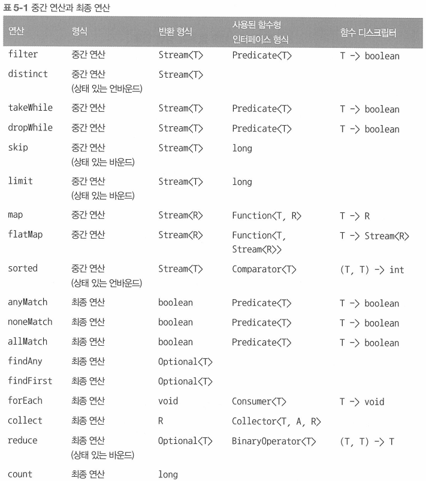
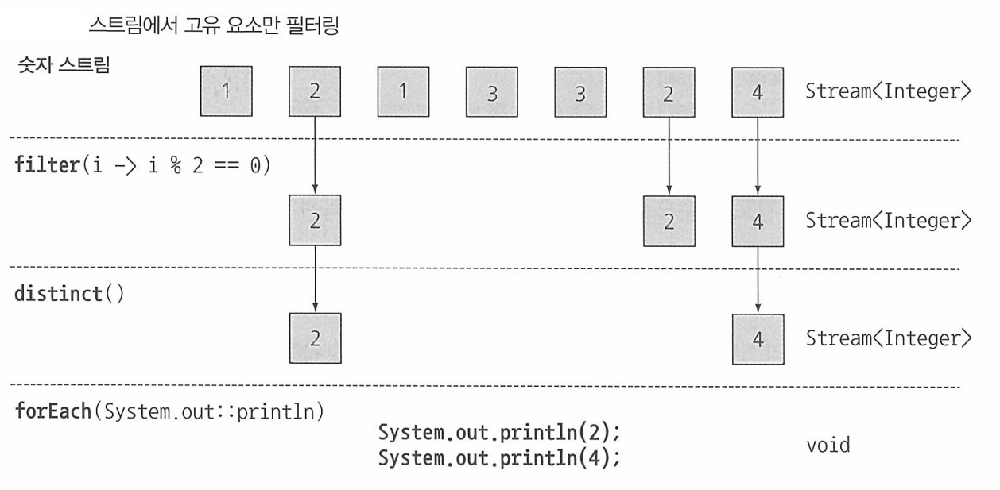
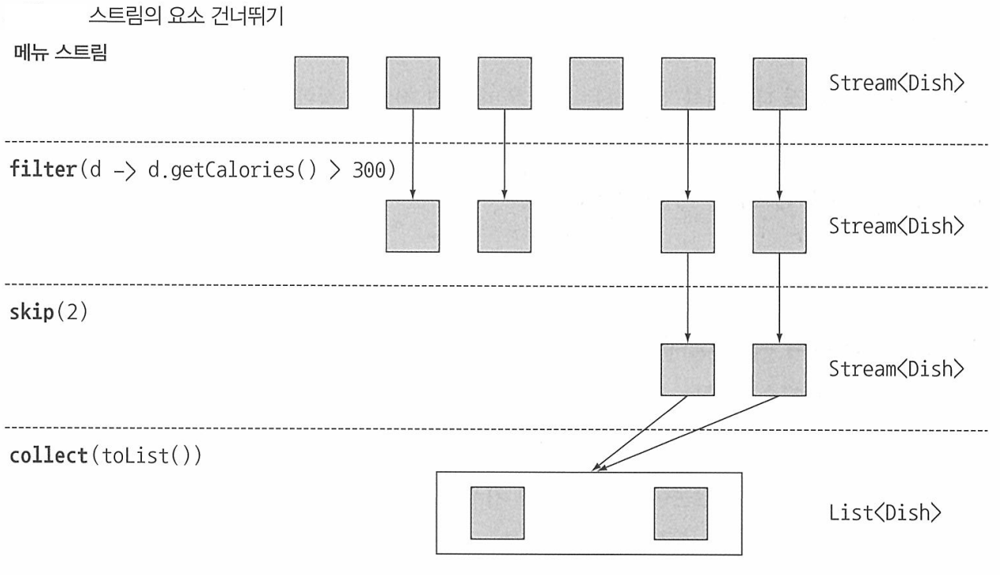
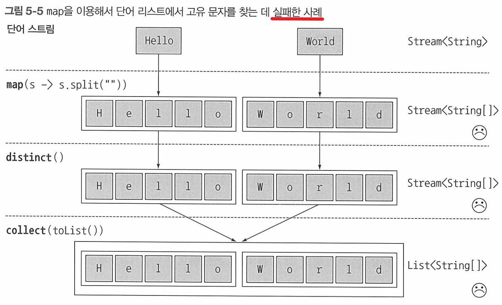
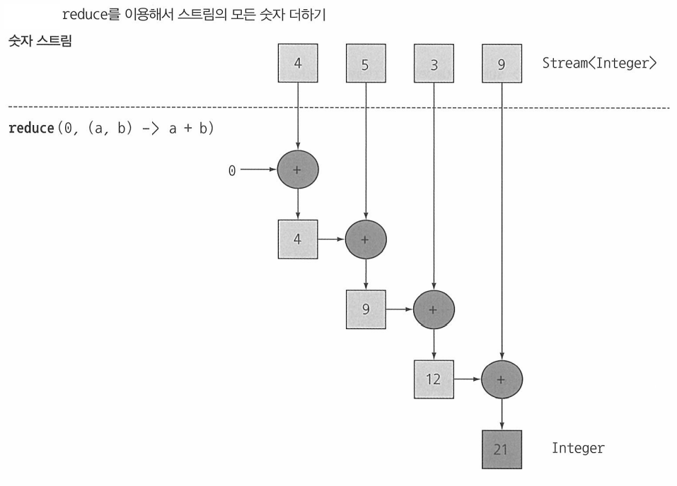

## Table of contents
{: .no_toc .text-delta }

1. TOC
{:toc}
---




# **필터링**

## `Predicate` 필터링

```java

    List<Dish> vegetarianMenu = menu.stream()
                                    .filter(Dish::isVegetarian)
                                    .collect(toList());

```

## 고유 요소 필터링

- 스트림은 고유 요소로 이루어진 스트림을 반환하는 `distinct`메서드도 지원한다.
  - *고유 여부는 스트림에서 만든 객체의 `hashCode` , `equals`로 결정된다*

```java
    // 리스트의 모든 짝수를 선택하고 중복을 필터링한다.
    List<Integer> numbers = Arrays.asList(1 , 2 , 1 , 3 , 3 , 2 , 4);
    numbers.stream()
           .filter(i -> i % 2 == 0)
           .distinct()
           .forEach(System.out::println);

```



# **스트림 슬라이싱**
- 스트림의 요소를 선택하거나 스킵하는 다양한 방법을 설명한다.

## `Predicate`를 이용한 슬라이싱
- 자바 9는 스트림의 요소를 효과적으로 선택할 수 있도록 `takeWhile` , `dropWhile` 두 가지 새로운 메서드를 지원한다.

### **`takeWhile` 활용**

```java

    List<Dish> specialMenu = Arrays.asList(
        new Dish("seasonal fruit" , true , 120 , Disy.Type.OTHER),
        new Dish("prawns" , false , 300 , Disy.Type.FISH),
        new Dish("rice" , true , 350 , Disy.Type.OTHER),
        new Dish("chicken" , false , 400 , Disy.Type.MEAT),
        new Dish("french fires" , true , 530 , Disy.Type.OTHER)
    );

```

- 320칼로리 이하의 요리를 선택하라고 하면 본능적으로 아래와 같이 `filter`를 생각할 것이다.


```java

    List<Dish> filteredMenu = specialMenu.stream()
                                         .filter(dish -> dish.getCalories() < 320)
                                         .collec(toList());

```

- `filter`연산을 이용하면 각 요소에 `Predicate`를 적용하게 된다.
- 하지만 위 `specialMenu` 리스트는 칼로리가 오름차순으로 정렬되어 있다.
    - 따라서 **320칼로리보다 크거나 같은 요리가 나왔을 때 반복 작업을 중단하면 된다.**
- **무한 스트림을 포함한 모든 스트림에 프레디케이트를 적용해 스트림을 슬라이스 할 수 있다.**


```java

    List<Dish> sliceMenu1 = specialMenu.stream()
                                       .takeWhile(dish -> dish.getCalories() < 320)
                                       .collect(toList());

```

### **`dropWhile`** 활용

- 나머지 요소를 선택하려면 어떻게 해야 할까?

```java

    List<Dish> slicedMenu2 = specialMenu.stream()
                                        .dropWhile(dish -> dish.getCalories() < 320)
                                        .collect(toList());

```

- `dropWhile`은 `takeWhile`과 정반대의 작업을 수행한다.
- **`dropWhile`은 `Predicate`가 처음으로 거짓이 되는 지점까지 발견된 요소를 버린다.**
  - `Predicate`가 거짓이되면 그 지점에서 작업을 중단하고 남은 요소를 모두 반환한다.
  - 무한한 남은 요소를 가진 무한 스트림에서도 동작한다.

## **스트림 축소**

- **스트림은 주어진 값 이하의 크기를 갖는 새로운 스트림을 반환하는 `limit(n)` 메서드를 지원한다.**

```java

    List<Dish> dishes = specialMenu.stream()
                                   .filter(dish -> dish.getCalories() > 300)
                                   .limit(3)
                                   .collect(toList());

```

- **처음 등장하는 두 고기 요리를 필터링 하시오**

```java

    List<Dish> dishes = menu.stream()
                            .filter(d -> d.getType == Dish.Type.MEAT)
                            .limit(2)
                            .collect(toList());

```

## **요소 건너뛰기**

- 스트림은 처음 `n`개 요소를 제외한 스트림을 반환하는 `skip(n)`메서드를 지원한다.
- `n`개 이하의 요소를 포함하는 스트림에 `skip(n)`을 호출하면 빈 스트림이 반환된다.
- `limit(n)`과 `skip(n)`은 상호 보완적인 연산을 수행한다.

```java

    List<Dish> dishes = menu.stream()
                            .filter(d -> d.getCalories() > 300)
                            .skip(2)
                            .collect(toList());

```



# **매핑**

- 특정 객체에서 특정 데이터를 선택하는 작업은 데이터 처리 과정에서 자주 수행되는 연산이다.
- `map` 과 `flatMap`메서드는 특정 데이터를 선택하는 기능을 제공한다.

## `map`

- 스트림은 **함수를 인수로 받는 `map`메서드를 지원한다.**
- **인수로 제공된 함수는 각 요소에 적용되며 함수를 적용한 결과가 새로운 요소로 매핑된다.**
  - *(이 과정은 기존의 값을 `고친다` 라는 개념보다는 `새로운 버전을 만든다`라는 개념에 가까우므로 **변환**에 가까운 **매핑**이라는 단어를 사용한다.)*
- 스트림의 요리명을 추출하는 코드

```java

    List<String> dishNames = menu.stream()
                                 .map(Dish::getName)
                                 .collect(toList());
    
```

- 단어 리스트가 주어졌을 때 단어가 포함하는 글자 수의 리스트를 반환

```java

    List<String> words = Arrays.asList("Modern" , "Java" , "In" , "Action");
    List<Integer> wordLengths = words.stream()
                                     .map(String::length)
                                     .collect(toList());

```

## 스트림 평면화

- 리스트에서 **고유 문자**로 이루어진 리스트를 반환해보자.
- `["Hello" , "World"]` ➜ `["H" , "e" , "l" , "l" , "o" , "W" , "o" , "r" , "l" , "d"]`;

```java

    List<String> words = Arrays.asList("Hello" , "World");
    List<String> result = words.stream()
                                .map(str -> str.split(""))
                                .distinct()
                                .collect(Collectors.toList());    

```

- 위 코드에서 `map`으로 전달한 람다는 각 단어의 `String[]`을 반환한다는 점이 문제다.
- `map`메소드가 반환된 스트림의 형식은 `Stream<String[]>`이다.
- 우리가 원하는 것은 `Stream<String>`



### `map` 과 `Arrays.stream` 활용 - 실패 사례

- 우선 배열 스트림 대신 문자열 스트림이 필요하다.
- **문자열을 받아 스트림을 만드는 `Arrays.stream()` 메서드가 있다.**

```java

    String[] arrayOfWords = {"Goodbye" , "World"};
    Stream<String> streamOfWords = Arrays.stream(arrayOfWords);
    // [Goodbye, World]

    // 적용
    List<String> words = Arrays.asList("Hello" , "World");

    words.stream()
            .map(str -> str.split(""))
            .map(Arrays::stream)
            .distinct()
            .collect(Collectors.toList());

```

- 결국 스트림 리스트 (엄밀히 따지면 `List<Stream<String>>`)가 만들어지면서 **문제가 해결되지 않았다.**
- 📌 **문제를 해결하려면 각 단어를 개별 문자열로 이루어진 배열로 만든 다음에 각 배열을 별도의 스트림으로 만들어야한다.**

### `flatMap` 사용

```java

    List<String> uniqueCharacters = words.stream()
                                            .map(word -> word.split(""))
                                            .flatMap(Arrays::stream)
                                            .distinct()
                                            .collect(Collectors.toList());
    // [H, e, l, o, W, r, d]
```


- `flatMap`은 각 배열을 스트림이 아니라 스트림의 콘텐츠로 매핑한다.
  - **스트림의 각 값을 다른 스트림으로 만든 다음에 모든 스트림을 하나의 스트림으로 연결하는 기능을 수행한다.**
- 즉 , **`map(Arrays::stream)`과 달리 `flatMap`은 하나의 평면화된 스트림을 반환한다.**

# **검색과 매칭**
- **특정 속성이 데이터 집합에 있는지 여부를 검색하는 데이터 처리도 자주 사용된다.**
- `anyMatch` , `allMatch` , `noneMatch` , `findFirst` , `findAny` 등의 연산은 **스트림 쇼트서킷** 기법이다.
    - 즉 *자바의 `&&` , `||`와 같은 연산을 활용한다.*

> - ✋ **쇼트 서킷**
> - 모든 스트림의 요소를 처리하지 않고 원하는 요소를 찾았으면 결과를 반환할 수 있다.
> - 마찬가지로 스트림의 모든 요소를 처리할 필요 없이 주어진 크기의 스트림을 생성하는 `limit`도 **쇼트 서킷** 연산이다.
> - **특히 무한한 요소를 가진 스트림을 유한한 크기로 줄일 수 있는 유용한 연산이다.**


## `anyMatch`
- `Predicate`가 주어진 스트림에서 적어도 한 요소와 일치하는지 확인할 때 `anyMatch`메서드를 이용한다.

```java

    if(menu.stream().anyMatch(Dish::isVegetarian)){
        System.out.println("The menu is (somewhat) vegetarian friendly!!");
    }

```

## `allMatch`
- 스트림의 모든 요소가 주어진 `Predicate`와 일치하는지 검사한다.

```java

    boolean isHealthy = menu.stream()
                            .allMatch(dish -> dish.getCalories() < 1000);

```

## `noenMatch`
- `allMatch`와 반대연산을 수행한다.
- 주어진 `Predicate`와 일치하는 요소가 없는지 확인한다.

 ```java

    boolean isHealthy = menu.stream()
                            .noneMatch(dish -> dish.getCalories() >= 1000);

 ```

## `findAny`
- 현재 스트림에서 임의의 요소를 반환한다.
- 다른 스트림 연산과 연결해서 사용할 수 있다.

```java

    Optional<Dish> dish = menus.stream()
                               .filter(Dish::isVegetarian)
                               .findAny()
                               // 값이 없으면 출력하지 않는다.
                               .ifPresent(dish -> System.out.println(dish.getName()));

```

> - ✋ **[Optional 이란?](https://jeongcode.github.io/docs/java/java8/stream-optional/#optional)**
> - 값의 존재나 부재 여부를 표현하는 컨테이너 클래스
> - `findAny`는 아무 요소도 반환하지 않을 수 있다. `null`은 쉽게 에러를 일으킬 수 있으므로 ,
> - `null`확인 관련 버그를 피하는 방법이다.

## `findFirst`
- 리스트 또는 정렬된 연속 데이터로 부터 생성된 스트림처럼 일부 스트림에는 **논리적인 아이템 순서**가 정해져 있을 수 있다.

```java

    List<Integer> someNumbers = Arrays.asList(1 , 2 , 3 , 4 , 5);
    Optional<Integer> firstSquareDivisibleByThree = someNumbers.stream()
                                                                .map(n -> n * n)
                                                                .filter(n -> n % 3 == 0)
                                                                .findFirst();    

```

## ✋ 왜 `findFirst`와  `findAny` 메서드가 모두 필요할까?
- **병렬성** 때문이다.
- 병렬 실행에서는 첫 번째 요소를 찾기 어렵다.
- 따라서 요소의 반환 순서가 상관없다면 병렬 스트림에서는 제약이 적은 `findAny`를 사용한다.

# **리듀싱**
- `reduce`연산을 이용해서 **메뉴의 모든 칼로리의 합계를 구하시오** , **메뉴에서 칼로리가 가장 높은 요리는?** 같이 스트림 요소를 조합해서 더 복잡한 질의를 표현하는 방법을 설명한다.
- 이러한 질의를 수행하려면 `Integer` 같은 결과가 나올 때 까지 스트림의 모든 요소를 반복적으로 처리해야 한다.
- 이런 질의를 **리듀싱 연산 (모든 스트림 요소를 처리해서 값으로 도출하는)** 이라고 한다.
- 이 과정이 마치 종이(우리의 스트림)를 작은 조각이 될 때 까지 반복해서 접는 것과 비슷하다는 의미로 **폴드**라고 부른다.

## 요소의 합
- `for-each`
  - `sum`변수의 초깃값 0
  - 리스트의 모든 요소를 조합하는 연산 `+`
```java
    
    int sum = 0;
    for(int x : numbers) sum += x;

```

- `reduce`
  - 초기값 0
  - 두 요소를 조합해서 새로운 값을 만드는 `BinaryOperator<T>`
  - `map`과 `reduce`를 연결하는 기법을 **맵 리듀스 패턴**이라 하며 , 쉽게 병렬화하는 특징 덕분에 구글이 웹 검색에 적용하면서 유명해졌다.

```java

    // 람다 표현식
    int sum = numbers.stream().reduce(0 , (a , b) -> a + b);

    // 메서드 참조
    int sum = numbers.stream().reduce(0 , Integer::sum);

```




> - ✋ `reduce` **메서드의 장점과 병렬화**
> - 기존의 단계적 반복으로 합계를 구하는 것과 `reduce`를 이용해서 합계를 구한느 것은 어떤 차이가 있을까?
> - `reduce`를 이용하면 내부 반복이 추상화되면서 **내부 구현에서 병렬로 `reduce`를 실행할 수 있게 된다.**
> - **반복적인 합계에서는 `sum`변수를 공유해야 하므로 쉽게 병렬화하기 어렵다.**
> - `parallelStream`메서드를 사용하여 병렬로 실행할 수 있지만 , `reduce`에 넘겨준 람다의 상태(인스턴스 변수 같은)가 바뀌지 말아야 하며 , 연산이 어떤 순서로 실행되더라도 결과가 바뀌지 않는 구조여야 한다.

# ✋ **스트림 연산 : 상태 없음과 상태 있음**
- `map` , `filter` 등은 입력 스트림에서 각 요소를 받아 0 또는 결과를 출력 스트림으로 보낸다.
  - 따라서 *(사용자가 제공한 람다나 메서드 참조가 내부적인 가변 상태를 갖지 않는다는 가정하에)* 이들은 보통 상태가 없는 , **내부 상태를 갖지 않는 연산**이다.
- 하지만 `reduce` , `sum` , `max` 같은 연산은 결과를 누적할 내부 상태가 필요하다.
  - 예제에서는 `int`나 `double`을 내부 상태로 사용했다.
  - 스트림에서 처리하는 요소 수와 관계없이 내부 상태의 크기는 **한정**되어 있다.
- 반면 `sorted`나 `distinct` 같은 연산은 `filter`나 `map`처럼 스트림을 입력으로 받아 다른 스트림을 출력하는 것처럼 보일 수 있다.
- 스트림의 요소를 정렬하거나 , 중복을 제거하려면 과거의 이력을 알고 있어야 한다.
- 예를 들어 어떤 요소를 출력 스트림으로 추가하려면 **모든 요소가 버퍼에 추가돼 있어야 한다.**
  - 연산을 수행하는데 필요한 저장소 크기는 정해져있지 않다.
- 따라서 **데이터 스트림의 크기가 크거나 무한이라면 문제가 될 수 있다.**
  - 예를 들어 , 모든 소수를 포함하는 스트림을 역순으로 만들면 어떤일이 일어날까?
  - 첫 번째 요소로 가장 큰 소수 , 즉 세상에 존재하지 않는 수를 반환해야 한다.
- 이러한 연산을 **내부 상태를 갖는 연산**이라 한다.

# 📌 **실전 연습**


# 📌 **퀴즈**

1. 숫자 리스트가 주어졌을 때 각 숫자의 제곱근으로 이루어진 리스트를 반환하시오
   - `[1 , 2 , 3 , 4 , 5]` ➜ `[1 , 4 , 9 , 16 , 25]`

```java

    List<Integer> numbers = Arrays.asList(1 , 2 , 3 , 4 , 5);
    List<Integer> squares = numbers.stream()
                                    .map(number -> number * number)
                                    .collect(Collectors.toList());

```

2. 두 개의 숫자 리스트가 있을 때 모든 숫자 쌍의 리스트를 반환하시오.
   - `[1 , 2 , 3]` , `[3 , 4]` ➜ `[(1 ,3) , (1 , 4) , (2 , 3) , (2 , 4) , (3, 3) , (3 , 4)]`

```java

    List<Integer> numbers1 = Arrays.asList(1 , 2 , 3);
    List<Integer> numbers2 = Arrays.asList(3 , 4);

    List<int[]> pairs = numbers1.stream()
                                .flatMap(i -> numbers2.stream()
                                                        .map(j -> new int[]{i , j}))
                                .collect(Collectors.toList());

    for(int[] numbers : pairs){
        System.out.println(numbers[0] + " , " + numbers[1]);
    }

//        1 , 3
//        1 , 4
//        2 , 3
//        2 , 4
//        3 , 3
//        3 , 4

```

3. 이전 예제에서 합이 3으로 나누어떨어지는 쌍만 반환하려면 어떻게 해야 할까?
   - `(2 , 4) , (3 , 3)`을 반환해야한다.


```java

    List<Integer> numbers1 = Arrays.asList(1 , 2 , 3);
    List<Integer> numbers2 = Arrays.asList(3 , 4);

    List<int[]> pairs = numbers1.stream()
                                .flatMap(i -> numbers2.stream()
                                                        .filter(j -> (i + j) % 3 == 0)
                                                        .map(j -> new int[]{i , j}))
                                .collect(Collectors.toList());

    for(int[] numbers : pairs){
        System.out.println(numbers[0] + " , " + numbers[1]);
    }

//        2 , 4
//        3 , 3    

```

4. `map`과 `reduce`를 이용해서 스트림의 요리 개수를 반환하시오

```java

    int count = menus.stream()
                     .map(e -> 1)
                     .reduce(0 , (e1 , e2) -> e1 + e2);


```
