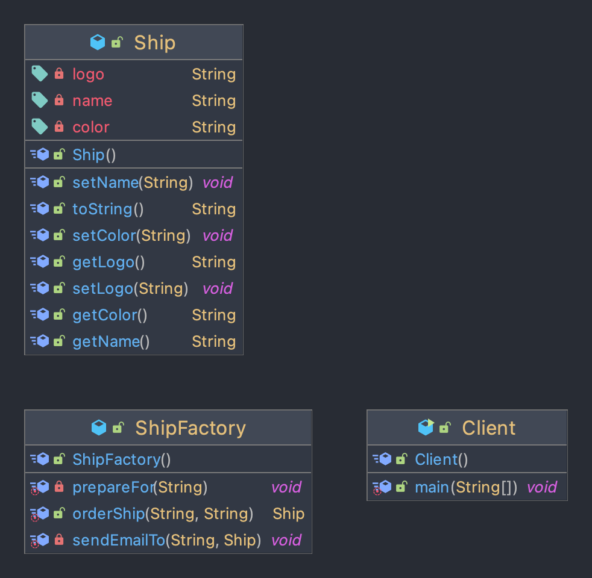
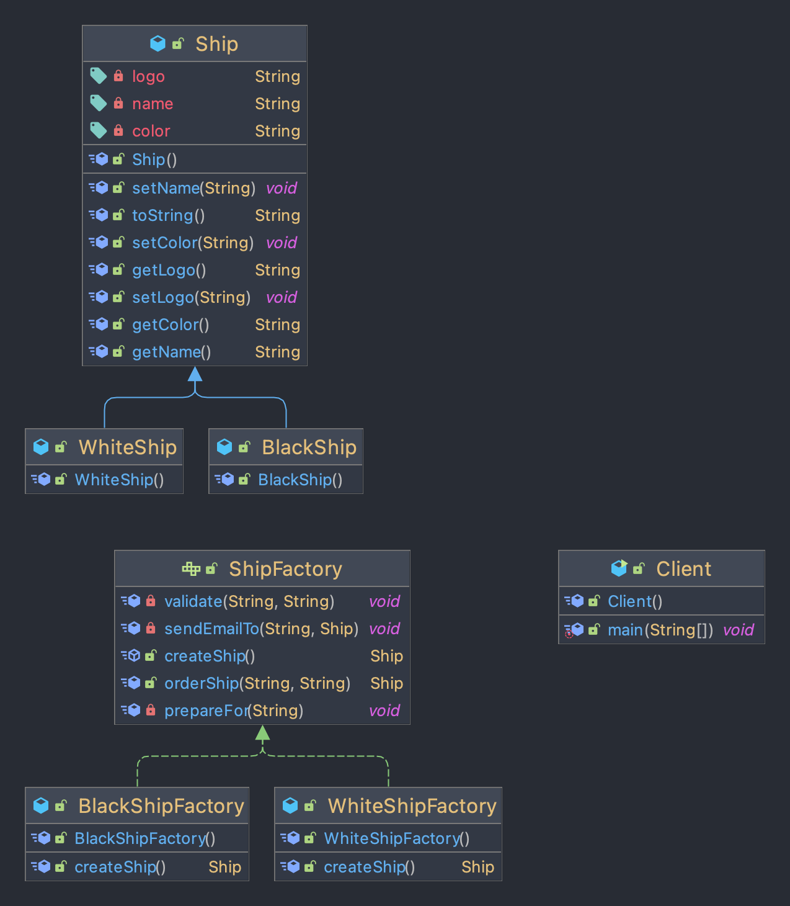

## Table of contents
{: .no_toc .text-delta }

1. TOC
{:toc}
---

# **[Builder Pattern](https://github.com/jdalma/design-patterns/tree/master/src/main/java/me/whiteship/designpatterns/_01_creational_patterns/_04_builder)**

- **동일한 프로세스를 거쳐 다양한 구성의 인스턴스를 만드는 방법**
- (복잡한) 객체를 만드는 프로세스를 독립적으로 분리할 수 있다.


- 인스턴스를 만드는 방법들을 단계별로 인터페이스에 정의를 한다.
- `Client`가 직접 `ConcreteBuilder`를 직접 사용하지 않고 `Director`클래스를 통하여 `Builder`를 사용하는 방법도 있다.

## **Before**

```java
    public static void main(String[] args) {
        TourPlan shortTrip = new TourPlan();
        shortTrip.setTitle("오레곤 롱비치 여행");
        shortTrip.setStartDate(LocalDate.of(2021, 7, 15));


        TourPlan tourPlan = new TourPlan();
        tourPlan.setTitle("칸쿤 여행");
        tourPlan.setNights(2);
        tourPlan.setDays(3);
        tourPlan.setStartDate(LocalDate.of(2020, 12, 9));
        tourPlan.setWhereToStay("리조트");
        tourPlan.addPlan(0, "체크인 이후 짐풀기");
        tourPlan.addPlan(0, "저녁 식사");
        tourPlan.addPlan(1, "조식 부페에서 식사");
        tourPlan.addPlan(1, "해변가 산책");
        tourPlan.addPlan(1, "점심은 수영장 근처 음식점에서 먹기");
        tourPlan.addPlan(1, "리조트 수영장에서 놀기");
        tourPlan.addPlan(1, "저녁은 BBQ 식당에서 스테이크");
        tourPlan.addPlan(2, "조식 부페에서 식사");
        tourPlan.addPlan(2, "체크아웃");
    }
```

## **After**


- `App`

```java
    public static void main(String[] args) {
        TourPlanBuilder builder = new DefaultTourBuilder();
        TourDirector tourDirector = new TourDirector(new DefaultTourBuilder());

        TourPlan longBeachTrip1 = builder.title("오레곤 롱비치 여행")
                .startDate(LocalDate.of(2021, 7, 15))
                .getPlan();

        TourPlan longBeachTrip2 = tourDirector.longbeachTrip();


        TourPlan cancunTrip1 = builder.title("칸쿤 여행")
                .nightsAndDays(2 , 3)
                .startDate(LocalDate.of(2020, 12, 9))
                .whereToStay("리조트")
                .addPlan(0, "체크인 이후 짐풀기")
                .addPlan(0, "저녁 식사")
                .addPlan(1, "조식 부페에서 식사")
                .addPlan(1, "해변가 산책")
                .addPlan(1, "점심은 수영장 근처 음식점에서 먹기")
                .addPlan(1, "리조트 수영장에서 놀기")
                .addPlan(1, "저녁은 BBQ 식당에서 스테이크")
                .addPlan(2, "조식 부페에서 식사")
                .addPlan(2, "체크아웃")
                .getPlan();

        TourPlan cancunTrip2 = tourDirector.cancunTrip();
    }
```

- `interface`

```java
public interface TourPlanBuilder {

    TourPlanBuilder title(String title);
    TourPlanBuilder nightsAndDays(int nights , int days);
    TourPlanBuilder startDate(LocalDate localDate);
    TourPlanBuilder whereToStay(String whereToStay);
    TourPlanBuilder addPlan(int day , String plan);
    TourPlan getPlan();

}
```

- `implementation`

```java
public class DefaultTourBuilder implements TourPlanBuilder {

    private String title;
    private int nights;
    private int days;
    private LocalDate startDate;
    private String whereToStay;
    private List<DetailPlan> plans;

    @Override
    public TourPlanBuilder nightsAndDays(int nights, int days) {
        this.nights = nights;
        this.days = days;
        return this;
    }

    @Override
    public TourPlanBuilder title(String title) {
        this.title = title;
        return this;
    }

    @Override
    public TourPlanBuilder startDate(LocalDate startDate) {
        this.startDate = startDate;
        return this;
    }

    @Override
    public TourPlanBuilder whereToStay(String whereToStay) {
        this.whereToStay = whereToStay;
        return this;
    }

    @Override
    public TourPlanBuilder addPlan(int day, String plan) {
        if (this.plans == null) {
            this.plans = new ArrayList<>();
        }

        this.plans.add(new DetailPlan(day, plan));
        return this;
    }

    @Override
    public TourPlan getPlan() {
        return new TourPlan(title, nights, days, startDate, whereToStay, plans);
    }-
}
```

- `director`

```java
public class TourDirector {
    private TourPlanBuilder tourPlanBuilder;

    public TourDirector(TourPlanBuilder tourPlanBuilder){
        this.tourPlanBuilder = tourPlanBuilder;
    }

    public TourPlan cancunTrip(){
        return tourPlanBuilder.title("칸쿤 여행")
                            .nightsAndDays(2 , 3)
                            .startDate(LocalDate.of(2020, 12, 9))
                            .whereToStay("리조트")
                            .addPlan(0, "체크인 이후 짐풀기")
                            .addPlan(0, "저녁 식사")
                            .addPlan(1, "조식 부페에서 식사")
                            .addPlan(1, "해변가 산책")
                            .addPlan(1, "점심은 수영장 근처 음식점에서 먹기")
                            .addPlan(1, "리조트 수영장에서 놀기")
                            .addPlan(1, "저녁은 BBQ 식당에서 스테이크")
                            .addPlan(2, "조식 부페에서 식사")
                            .addPlan(2, "체크아웃")
                            .getPlan();
    }

    public TourPlan longbeachTrip(){
        return tourPlanBuilder.title("오레곤 롱비치 여행")
                            .startDate(LocalDate.of(2021, 7, 15))
                            .getPlan();
    }
}

```

## 실무 적용 예시

- 자바 8 `Stream.Builder` API
  - `Stream<String> names = Stream.<String>builder().add("2022").add("-01-18").build();`
- 스프링
  - `UriComponentsBuilder`
  - `MockMvcWebClientBuilder`
  - `...Builder`
- [`롬복의 @Builder`](https://projectlombok.org/features/Builder)

## 장점과 단점

- `장점`
  1. 만들기 복잡한 객체를 순차적으로 만들 수 있다.
  2. 복잡한 객체를 만드는 구체적인 과정을 숨길 수 있다.
  3. 동일한 프로세스를 통해 각기 다르게 구성된 객체를 만들 수도 있다.
  4. 불완전한 객체를 사용하지 못하도록 방지할 수 있다.
- `단점`
  1. 원하는 객체를 만들려면 빌더 또는 다이렉터 부터 만들어야 한다.
  2. 구조가 복잡해 진다. (트레이드 오프)


***

# **[Factory Method Pattern](https://github.com/jdalma/design-patterns/tree/master/src/main/java/me/whiteship/designpatterns/_01_creational_patterns/_02_factory_method)**

- **구체적으로 어떤 인스턴스를 만들지는 서브클래스가 정한다**
- 다양한 구현체 (`Product`)가 있고 , 그 중에서 특정한 구현체를 만들 수 있는 다양한 팩토리 (`Creator`)를 제공할 수 있다
- [Concrete Class](https://www.geeksforgeeks.org/concrete-class-in-java/)


- [이미지 출처](http://nsnotification.blogspot.com/2013/01/factory-method-pattern.html)

## **Before**



- 현재는 `ShipFactory.orderShip()`안에 검은색 배 , 하얀색 배를 만드는 로직이 같이 들어가있다

```java
Ship ship = new Ship();
```

- 배를 만드는 부분을 하위 클래스에서 결정하게 수정하자

## **After**



> ✋ 
> 
> 여기서는 추상클래스를 사용하지 않고 인터페이스의 `default`키워드를 사용한다 (+ `JAVA 8`)
> 
> 인터페이스에 `private method`를 추가하여 사용한다 (+ `JAVA 9`)
> - 9버전 보다 아래라면 `ShipFactory`와 `ShipFactory의 구현체` **사이에 추상 클래스를 작성할 수도 있다**

- **Client**에서 `Ship`을 만들 때 무슨 Ship을 만들지 직접 정의해 준다
- **Factory**를 통해 *`Ship`을 확장하는* `WhiteShip` 또는 `BlackShip`을 생성하여 `orderShip()`을 호출한다
- 추가적인 `Ship`이 더 필요하다면 **`Factory`를 구현하는 Class**와 **`Ship`을 확장하는 Model을 추가**하면 된다 
  - **기존 코드를 전혀 건드리지 않고 새로운 공장과 새로운 제품을 추가한다**
  - 따라서, 확장에 열려있고 변경에는 닫혀있는 코드가 된다

<br>

```java
public class Client {
    public static void main(String[] args) {
        Ship whiteship = new WhiteShipFactory().orderShip("Whiteship", "keesun@mail.com");
        System.out.println(whiteship);

        Ship blackShip = new BlackShipFactory().orderShip("BlackShip" , "test");
        System.out.println(blackShip);
    }
}
```

<div class="code-example" markdown="1">
**Ship Class**
</div>

```java
public class Ship {

    private String name;

    private String color;

    private String logo;

    // Getter , Setter , toString ...
}
```

<div class="code-example" markdown="1">
**WhiteShip , BlackShip** extends Ship
</div>

```java
public class WhiteShip extends Ship{

    public WhiteShip(){
        super.setName("whiteship");
        super.setLogo("\uD83D\uDEE5️");
        super.setColor("white");
    }
}


public class BlackShip extends Ship{

    public BlackShip() {
        super.setName("blackship");
        super.setColor("black");
        super.setLogo("⚓");
    }
}
```

<div class="code-example" markdown="1">
**ShipFactory Interface**
</div>

```java
public interface ShipFactory {

    Ship createShip();

    default Ship orderShip(String name , String email){
        validate(name , email);
        prepareFor(name);
        Ship ship = createShip();
        sendEmailTo(email, ship);
        return ship;
    }

    private void validate(String name , String email){
        if (name == null || name.isBlank()) {
            throw new IllegalArgumentException("배 이름을 지어주세요.");
        }
        if (email == null || email.isBlank()) {
            throw new IllegalArgumentException("연락처를 남겨주세요.");
        }
    }

    private void prepareFor(String name) {
        System.out.println(name + " 만들 준비 중");
    }

    private void sendEmailTo(String email, Ship ship) {
        System.out.println(ship.getName() + " 다 만들었습니다.");
    }
}
```


<div class="code-example" markdown="1">
**WhiteShipFactory , BlackShipFactory** implements ShipFactory
</div>

```java
public class WhiteShipFactory implements ShipFactory{
    @Override
    public Ship createShip() {
        return new WhiteShip();
    }
}

public class BlackShipFactory implements ShipFactory{
    @Override
    public Ship createShip() {
        return new BlackShip();
    }
}
```

- 💡 **Client**는 변경됐지 않나요??
  - 그럼 변경에 닫혀있는게 맞는건가?? 
  - 그래서 보통 **인터페이스 기반**으로 작성하여 **구체적인 클래스를 의존성 주입**을 받게끔 작성한다

## **After** (+ `Interface`적용)
- 현재는 **Client**는 **Factory**가 추가될 때 마다 **구체적인 Factory를 알고 주문해야 하기 때문에** Client는 계속 변경될 여지가 있다

```java
public class Client {
    public static void main(String[] args) {
        Client client = new Client();
        client.print(new WhiteShipFactory() , "Whiteship", "keesun@mail.com");
        client.print(new BlackShipFactory() , "Blackship", "test@mail.com");
    }

    private void print(ShipFactory factory, String name, String email) {
        System.out.println(factory.orderShip(name , email));
    }
}
```

- 위와 같이 `print()`메소드 에서 `ShipFactory`를 인터페이스로 받게 작성하면 조금 더 유연하게 사용이 가능하다