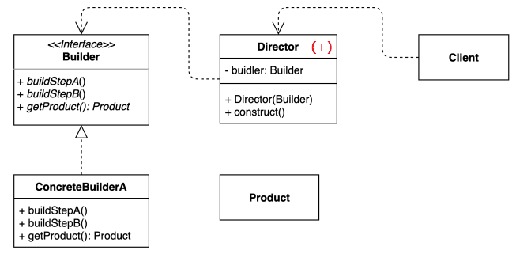
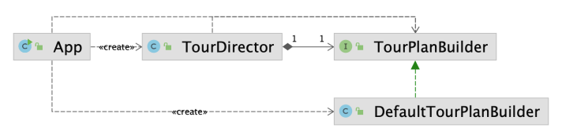

## Table of contents
{: .no_toc .text-delta }

1. TOC
{:toc}
---

# **[`Builder Pattern`](https://github.com/jdalma/design-patterns/tree/master/src/main/java/me/whiteship/designpatterns/_01_creational_patterns/_04_builder)** 

## 패턴 소개
- **동일한 프로세스를 거쳐 다양한 구성의 인스턴스를 만드는 방법**
- (복잡한) 객체를 만드는 프로세스를 독립적으로 분리할 수 있다.



- 인스턴스를 만드는 방법들을 단계별로 인터페이스에 정의를 한다.
- `Client`가 직접 `ConcreteBuilder`를 직접 사용하지 않고 `Director`클래스를 통하여 `Builder`를 사용하는 방법도 있다.

## 패턴 적용하기

### `Before`

```java
    public static void main(String[] args) {
        TourPlan shortTrip = new TourPlan();
        shortTrip.setTitle("오레곤 롱비치 여행");
        shortTrip.setStartDate(LocalDate.of(2021, 7, 15));


        TourPlan tourPlan = new TourPlan();
        tourPlan.setTitle("칸쿤 여행");
        tourPlan.setNights(2);
        tourPlan.setDays(3);
        tourPlan.setStartDate(LocalDate.of(2020, 12, 9));
        tourPlan.setWhereToStay("리조트");
        tourPlan.addPlan(0, "체크인 이후 짐풀기");
        tourPlan.addPlan(0, "저녁 식사");
        tourPlan.addPlan(1, "조식 부페에서 식사");
        tourPlan.addPlan(1, "해변가 산책");
        tourPlan.addPlan(1, "점심은 수영장 근처 음식점에서 먹기");
        tourPlan.addPlan(1, "리조트 수영장에서 놀기");
        tourPlan.addPlan(1, "저녁은 BBQ 식당에서 스테이크");
        tourPlan.addPlan(2, "조식 부페에서 식사");
        tourPlan.addPlan(2, "체크아웃");
    }
```

### `After`



- `App`

```java
    public static void main(String[] args) {
        TourPlanBuilder builder = new DefaultTourBuilder();
        TourDirector tourDirector = new TourDirector(new DefaultTourBuilder());

        TourPlan longBeachTrip1 = builder.title("오레곤 롱비치 여행")
                .startDate(LocalDate.of(2021, 7, 15))
                .getPlan();

        TourPlan longBeachTrip2 = tourDirector.longbeachTrip();


        TourPlan cancunTrip1 = builder.title("칸쿤 여행")
                .nightsAndDays(2 , 3)
                .startDate(LocalDate.of(2020, 12, 9))
                .whereToStay("리조트")
                .addPlan(0, "체크인 이후 짐풀기")
                .addPlan(0, "저녁 식사")
                .addPlan(1, "조식 부페에서 식사")
                .addPlan(1, "해변가 산책")
                .addPlan(1, "점심은 수영장 근처 음식점에서 먹기")
                .addPlan(1, "리조트 수영장에서 놀기")
                .addPlan(1, "저녁은 BBQ 식당에서 스테이크")
                .addPlan(2, "조식 부페에서 식사")
                .addPlan(2, "체크아웃")
                .getPlan();

        TourPlan cancunTrip2 = tourDirector.cancunTrip();
    }
```

- `interface`

```java
public interface TourPlanBuilder {

    TourPlanBuilder title(String title);
    TourPlanBuilder nightsAndDays(int nights , int days);
    TourPlanBuilder startDate(LocalDate localDate);
    TourPlanBuilder whereToStay(String whereToStay);
    TourPlanBuilder addPlan(int day , String plan);
    TourPlan getPlan();

}
```

- `implementation`

```java
public class DefaultTourBuilder implements TourPlanBuilder {

    private String title;
    private int nights;
    private int days;
    private LocalDate startDate;
    private String whereToStay;
    private List<DetailPlan> plans;

    @Override
    public TourPlanBuilder nightsAndDays(int nights, int days) {
        this.nights = nights;
        this.days = days;
        return this;
    }

    @Override
    public TourPlanBuilder title(String title) {
        this.title = title;
        return this;
    }

    @Override
    public TourPlanBuilder startDate(LocalDate startDate) {
        this.startDate = startDate;
        return this;
    }

    @Override
    public TourPlanBuilder whereToStay(String whereToStay) {
        this.whereToStay = whereToStay;
        return this;
    }

    @Override
    public TourPlanBuilder addPlan(int day, String plan) {
        if (this.plans == null) {
            this.plans = new ArrayList<>();
        }

        this.plans.add(new DetailPlan(day, plan));
        return this;
    }

    @Override
    public TourPlan getPlan() {
        return new TourPlan(title, nights, days, startDate, whereToStay, plans);
    }-
}
```

- `director`

```java
public class TourDirector {
    private TourPlanBuilder tourPlanBuilder;

    public TourDirector(TourPlanBuilder tourPlanBuilder){
        this.tourPlanBuilder = tourPlanBuilder;
    }

    public TourPlan cancunTrip(){
        return tourPlanBuilder.title("칸쿤 여행")
                            .nightsAndDays(2 , 3)
                            .startDate(LocalDate.of(2020, 12, 9))
                            .whereToStay("리조트")
                            .addPlan(0, "체크인 이후 짐풀기")
                            .addPlan(0, "저녁 식사")
                            .addPlan(1, "조식 부페에서 식사")
                            .addPlan(1, "해변가 산책")
                            .addPlan(1, "점심은 수영장 근처 음식점에서 먹기")
                            .addPlan(1, "리조트 수영장에서 놀기")
                            .addPlan(1, "저녁은 BBQ 식당에서 스테이크")
                            .addPlan(2, "조식 부페에서 식사")
                            .addPlan(2, "체크아웃")
                            .getPlan();
    }

    public TourPlan longbeachTrip(){
        return tourPlanBuilder.title("오레곤 롱비치 여행")
                            .startDate(LocalDate.of(2021, 7, 15))
                            .getPlan();
    }
}

```

## 실무 적용 예시

- 자바 8 `Stream.Builder` API
  - `Stream<String> names = Stream.<String>builder().add("2022").add("-01-18").build();`
- 스프링
  - `UriComponentsBuilder`
  - `MockMvcWebClientBuilder`
  - `...Builder`
- [`롬복의 @Builder`](https://projectlombok.org/features/Builder)

## 장점과 단점

- `장점`
  1. 만들기 복잡한 객체를 순차적으로 만들 수 있다.
  2. 복잡한 객체를 만드는 구체적인 과정을 숨길 수 있다.
  3. 동일한 프로세스를 통해 각기 다르게 구성된 객체를 만들 수도 있다.
  4. 불완전한 객체를 사용하지 못하도록 방지할 수 있다.
- `단점`
  1. 원하는 객체를 만들려면 빌더 또는 다이렉터 부터 만들어야 한다.
  2. 구조가 복잡해 진다. (트레이드 오프)
