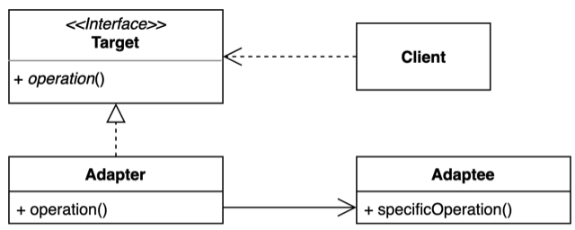
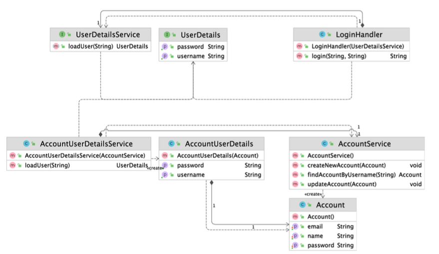

## Table of contents
{: .no_toc .text-delta }

1. TOC
{:toc}
---

# **[Adapter Pattern](https://github.com/jdalma/design-patterns/tree/master/src/main/java/me/whiteship/designpatterns/_02_structural_patterns/_06_adapter)**

## 패턴 소개
- **기존 코드를 클라이언트가 사용하는 인터페이스의 구현체로 바꿔주는 패턴**
  - *클라이언트가 사용하는 인터페이스를 따르지 않는 기존 코드를 재사용할 수 있게 해준다*

- **UserDetail** , **UserDetailsService** 인터페이스가 `Target`에 해당한다
- **Account** 와 **AccountService**가 `Adaptee`에 해당한다
- 📌
  - 어떻게 **UserDetailsService**와 **AccountService**를 연결할 것 인가?
  - 어떻게 **Account**와 **UserDetails**를 연결할 것인가?