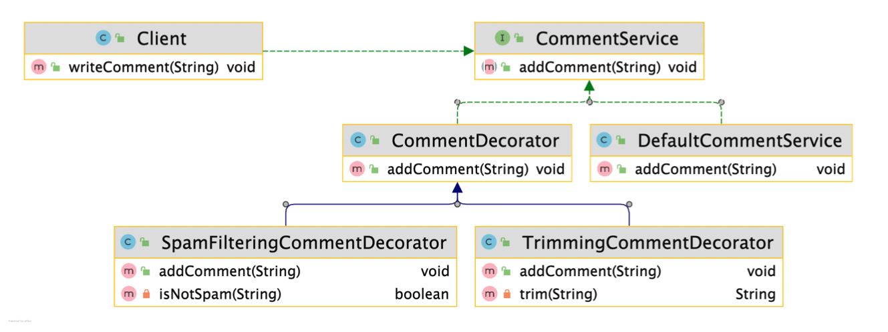

## Table of contents
{: .no_toc .text-delta }

1. TOC
{:toc}
---

# **[Adapter Pattern](https://github.com/jdalma/design-patterns/tree/master/src/main/java/me/whiteship/designpatterns/_02_structural_patterns/_06_adapter)**

## 패턴 소개
- **기존 코드를 클라이언트가 사용하는 인터페이스의 구현체로 바꿔주는 패턴**
  - *클라이언트가 사용하는 인터페이스를 따르지 않는 기존 코드를 재사용할 수 있게 해준다*


- **UserDetail** , **UserDetailsService** 인터페이스가 `Target`에 해당한다
- **Account** 와 **AccountService**가 `Adaptee`에 해당한다
- 📌
  - 어떻게 **UserDetailsService**와 **AccountService**를 연결할 것 인가?
  - 어떻게 **Account**와 **UserDetails**를 연결할 것인가?


***

# **[Decorator Pattern](https://github.com/jdalma/design-patterns/commit/9537c45bc4b9c53e0f9af0d4bd48c7503998fc2d)**

## 패턴 소개

- **기존 코드를 변경하지 않고 부가 기능을 추가하는 패턴**
- 상속이 아닌 위임을 사용해서 보다 유연하게 (런타임에) 부가 기능을 추가하는 것도 가능하다.



```java
public static void main(String[] args) {
    CommentService commentService = new DefaultCommentService();

    if (enabledSpamFilter) {
        commentService = new SpamFilteringCommentDecorator(commentService);
    }

    if (enabledTrimming) {
        commentService = new TrimmingCommentDecorator(commentService);
    }
    ...
}
```
- 이 코드를 보면 대략 알 수 있을 것이다.

## 장점과 단점

- **장점**
  - 새로운 클래스를 만들지 않고 **기존 기능을 조합할 수 있다.**
  - 컴파일 타임이 아닌 런타임에 동적으로 기능을 변경할 수 있다.
- **단점**
  - 데코레이터를 조합하는 코드가 복잡할 수 있다.

## 적용 예제

1. `InputStream`, `OutputStream`, `Reader`, `Writer`의 생성자를 활용한 랩퍼
2. `Collections`이 제공하는 데코레이터 메소드
   - `Collections.checkedXXX()`
   - `Collections.synchronizedXXX()`
   - `Collections.unmodifiableXXX()`
3. 웹플럭스 `ServerHttpRequestDecorator`, `ServerHttpResponseDecorator`
4. 빈 설정 데코레이터 `BeanDefinitionDecorator`