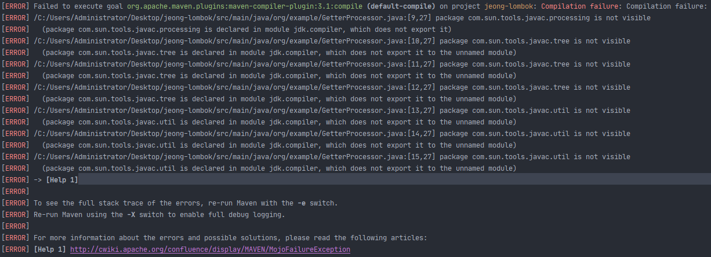

## Table of contents
{: .no_toc .text-delta }

1. TOC
{:toc}

---

# **JSON 파싱**
🚨`java.lang.ClassCastException: org.json.simple.JSONObject cannot be cast to net.sf.json.JSONObject`

```java
JSONArray slaveGridList = (JSONArray) parser.parse(entity.getSlaveGrid());

for(int i = 0 ; i < slaveGridList.size() ; i++) {
    JSONObject row = (JSONObject) slaveGridList.get(i);
    Mbsreq002Basis basisEntity = new Mbsreq002Basis(row);
    basisEntity.setRegId(entity.getRegId());

    // 저장 로직
}
```

1. MasterForm의 데이터를 `entity` 생성
2. `entity`안에 든 `slaveGridList`(JSON문자열) 데이터를 꺼낸다.
3. JSONArray ➜ JSONObject 캐스팅 예외

## **해결**
```java
JSONParser parser = new JSONParser();
org.json.simple.JSONArray slaveGridList = (org.json.simple.JSONArray) parser.parse(entity.getSlaveGrid());

for(int i = 0 ; i < slaveGridList.size() ; i++) {
    org.json.simple.JSONObject row = (org.json.simple.JSONObject) slaveGridList.get(i);
    Mbsreq002Basis basisEntity = new Mbsreq002Basis(row);
    basisEntity.setRegId(entity.getRegId());
    ...
}
```
- JSON import문제
- 현재 Service로직은 net.sf.json을 사용
- 해당 로직만 json.simple 사용

***

# **JDK 11 `com.sun.*` import 문제**

- 컴파일 시점 Annotation Processor를 통한 자바 코드 수정을 위하여 AST 접근에 필요한
```java
import com.sun.source.tree.ClassTree;
import com.sun.source.tree.CompilationUnitTree;
import com.sun.source.util.TreePath;
import com.sun.source.util.TreePathScanner;
import com.sun.source.util.Trees;
import com.sun.tools.javac.processing.JavacProcessingEnvironment;
import com.sun.tools.javac.tree.JCTree;
import com.sun.tools.javac.tree.TreeMaker;
import com.sun.tools.javac.tree.TreeTranslator;
import com.sun.tools.javac.util.Context;
import com.sun.tools.javac.util.List;
import com.sun.tools.javac.util.Names;
```
- 런타임 에러는 나지 않지만 `mvn clean install` 빌드 시
- 

## **원인**
- 출처
  - [Java 9에서 com.sun.tools.javac.util 액세스](https://stackoverflow.com/questions/46773519/accessing-com-sun-tools-javac-util-from-java-9)
  - [Java 8에서 Java 11로 업그레이드-sun.util 패키지가 없습니다.](https://www.javaer101.com/en/article/114435.html)
  - [ "내부 API에 대한 불법 액세스"장 읽기](https://nipafx.dev/java-11-migration-guide/)

> ✋
> - 모듈 시스템의 가장 큰 포인트 중 하나는 강력한 캡슐화입니다.
> - 내보내지 않은 패키지의 클래스뿐만 아니라 비공개 클래스도 모듈 외부에서 액세스 할 수 없도록합니다.
> - 이것은 JDK와 함께 제공되는 플랫폼 모듈에 적용되며, 여기서 `java. *` 및 `javax. *` 패키지 만 완전히 지원됩니다.
> - **반면에 대부분의 `com.sun. *` 및 `sun. *` 패키지는 내부 패키지이므로 기본적으로 접근 할 수 없습니다.**


## **maven dependency , plugin차이**
- [출처](https://stackoverflow.com/questions/26292073/whats-the-difference-between-maven-plugins-and-dependencies)
- 종속성 은 프로젝트가 특정 시점 (즉, 컴파일 타임 또는 런타임)에서 클래스 경로에서 사용할 수 있어야하는 아티팩트 (예 : jar)입니다.
- 그러나 플러그인은 프로젝트 빌드 중에 실제로 작업을 수행하도록 프로젝트에서 구성 할 수있는 아티팩트입니다. (예를 들어 실제로 Java 클래스를 컴파일하거나 파일을 복사하거나 데이터베이스를 시작 및 중지하는 플러그인이 있습니다.) 프로젝트의 클래스 경로에서 플러그인을 사용할 수 없습니다.

***

# `Arrays.asList`

- `Arrays.asList` 해당 메서드로 생성된 리스트는 수정할 수 없다.
- `unmodifiable`이라 하여 remove 및 add를 할 수 가 없다.

```java
    List<Integer> list = Arrays.asList(1 ,2 ,3 ,4 , 5);
    list.remove(2);
    // java.lang.UnsupportedOperationException 예외 발생
```