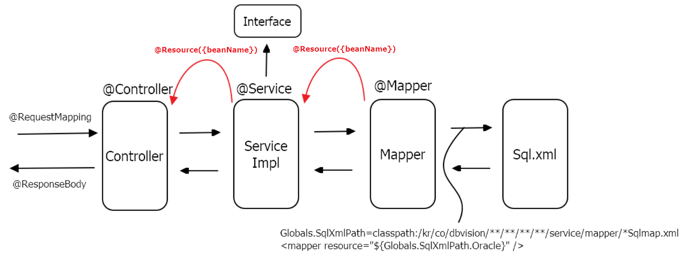

## Table of contents
{: .no_toc .text-delta }

1. TOC
{:toc}

---

## `mysql Connection 끊어지는 문제`

- `validateQuery`가 없어서 나는 문제
- 관련 분석이 필요하다.
- [Common DBCP 이해하기](https://d2.naver.com/helloworld/5102792)
- [Common](https://commons.apache.org/proper/commons-dbcp/configuration.html)

## `org.apache.ibatis.binding.BindingException`

### `Invalid bound statement (not found): {classPath}.testMapper.selectAll`

- 해당 `Mapper`는 `org.apache.ibatis.binding.MapperProxy@9d77d5` 주입받았지만
- `SelectAll`쿼리가 실행이 안됐다.

1. `@Mapper` 확인
2. `ServiceImpl`단에서 **DI**받는 Bean이름 확인
3. 위의 1,2번은 문제 없었지만 `SQL xml`의 `<mapper namespace="{classPath}.testMapper"></mapper>` 해당 `classPath`가 틀리게 입력되어 있었다.



- `context-dataSource.xml`

```xml
	<bean id="propertyConfigurer"
		class="org.springframework.beans.factory.config.PropertyPlaceholderConfigurer">
		<property name="locations">
			<list>
				<value>classpath:/egovframework/properties/globals.properties
				</value>
			</list>
		</property>
	</bean>

	<bean id="dataSource" class="org.apache.commons.dbcp.BasicDataSource" destroy-method="close">
		<property name="driverClassName"
			value="${Globals.DriverClassName}" />
		<property name="url" value="${Globals.Url}" />
		<property name="username" value="${Globals.UserName}" />
		<property name="password" value="${Globals.Password}" />
	</bean>
```

- `context-transaction.xml`

```xml
	<bean id="txManager" class="org.springframework.jdbc.datasource.DataSourceTransactionManager">
		<property name="dataSource" ref="dataSource"/>
	</bean>

	<tx:advice id="txAdvice" transaction-manager="txManager">
		<tx:attributes>
			<tx:method name="*" rollback-for="Exception"/>
		</tx:attributes>
	</tx:advice>

	<aop:config>
		<aop:pointcut id="requiredTx" expression="execution(* kr.co.test.api..impl.*Impl.*(..))"/>
		<aop:advisor advice-ref="txAdvice" pointcut-ref="requiredTx" />
	</aop:config>
	
	<tx:annotation-driven transaction-manager="txManager"/>
```

- `context-mapper.xml`

```xml
	<!-- SqlSession setup for MyBatis Database Layer -->
	<bean id="sqlSession" class="kr.co.dbvision.lib.RefreshableSqlSessionFactoryBean">
		<property name="dataSource" ref="dataSource" />
		<property name="configLocation" value="classpath:/egovframework/sqlmap/sql-mapper-config.xml" />
		<property name="mapperLocations" value="classpath:/kr/co/test/**/**/**/**/service/mapper/*Sqlmap.xml" />
	</bean>

	<!-- MapperConfigurer setup for MyBatis Database Layer with @Mapper("deptMapper") in DeptMapper Interface -->
 	<bean class="egovframework.rte.psl.dataaccess.mapper.MapperConfigurer">
		<property name="basePackage" value="kr.co.test" />
		<property name="sqlSessionFactoryBeanName" value="sqlSession"/>
	</bean>
    
```

- `Mapper Interface`

```java
@Mapper("testMapper")
public interface testMapper {

    ...

}
```

- `SQL xml`

```xml
<?xml version="1.0" encoding="UTF-8"?>
<!DOCTYPE mapper PUBLIC "-//mybatis.org//DTD Mapper 3.0//EN" "http://mybatis.org/dtd/mybatis-3-mapper.dtd">

<mapper namespace="{classPath}.testMapper">

    <select id="selectAll">
        ...
    </select>

    ...

</mapper>
```