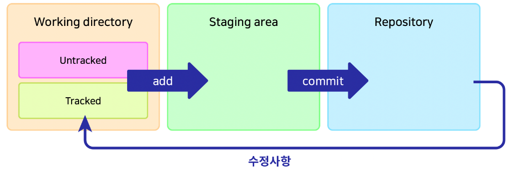
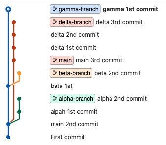
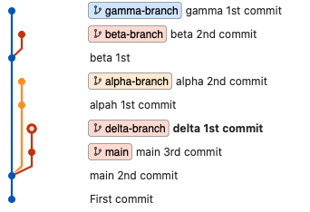
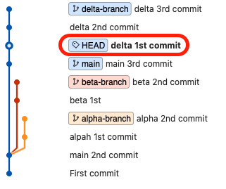
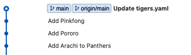

{: .no_toc }

<details open markdown="block">
  <summary>
    Table of contents
  </summary>
  {: .text-delta }
1. TOC
{:toc}
</details>

---


- [제대로 파는 Git & GitHub - by 얄코](https://www.inflearn.com/course/%EC%A0%9C%EB%8C%80%EB%A1%9C-%ED%8C%8C%EB%8A%94-%EA%B9%83/dashboard)
- [얄코](https://www.yalco.kr/@git-github-dive/5-2/)

***

- 공식 문서
  1. [gitignore](https://git-scm.com/docs/gitignore)
  2. [Git cheatsheet](https://training.github.com/downloads/ko/github-git-cheat-sheet/)
  3. [Visual Git cheatsheet](https://ndpsoftware.com/git-cheatsheet.html#loc=index;)
  4. [Pro Git](https://git-scm.com/book/ko/v2)

# 깃의 3가지 공간



1. **Working directory**
   - `untracked` : Add된 적 없는 파일, ignore 된 파일
   - `tracked` : Add된 적 있고 변경내역이 있는 파일
   - `git add` 명령어로 Staging area로 이동

2. **Staging area**
   - 커밋을 위한 준비 단계
   - 예시: 작업을 위해 선택된 파일들
   - `git commit` 명령어로 repository로 이동

3. **Repository**
   - `.git` directory라고도 불림
   - 커밋된 상태

# 파일의 삭제와 이동
1. **git rm**
   - 파일의 삭제가 **Stagin Area**에 있음
2. **직접 삭제**
   - 파일의 삭제가 **Working Directory**에 있음
3. **git mv** 도 동일

# 깃의 각종 설정
1. `global` 설정과 `local` 설정
   - `config`를 `--global`과 함께 지정하면 전역으로 설정된다
2. `git config (--global) --list`
   - `config` 조회
3. `git config (--global) -e`
   - 에디터에서 보기
4. `git config --global core.editor "code --wait"`
   - 또는 `code` 자리에 **원하는 편집 프로그램의 .exe파일 경로 연결**
   - `--wait` : 에디터에서 수정하는 동안 CLI를 정지
   - ✋ git commit 등의 편집도 지정된 에디터에서 열게 됨

# 유용한 설정

<div class="code-example" markdown="1">
**협업시 윈도우와 맥에서 엔터 방식 차이로 인한 오류를 방지합니다.**
</div>

```
git config --global core.autocrlf (윈도우: true / 맥: input)
```

<div class="code-example" markdown="1">
**기본 branch는 `master`이지만 `main`으로 기본 브랜치를 변경**
</div>

```
git config --global init.defaultBranch main
```

<div class="code-example" markdown="1">
**`pull`기본 전략 `merge`또는 `rebase`로 설정**
</div>

```
git config pull.rebase false
git config pull.rebase true
```

<div class="code-example" markdown="1">
**`push`시 로컬과 동일한 브랜치명으로**
</div>

```
git config --global push.default current
```

# 명령어 

<div class="code-example" markdown="1">
**작업 폴더에서 해당 명령어를 치면 git이 관리하게 된다**
</div>

```
git init
```

<div class="code-example" markdown="1">
**gitignore 형식**
</div>

```yaml
# 이렇게 #를 사용해서 주석

# 모든 file.c
file.c

# 최상위 폴더의 file.c
/file.c

# 모든 .c 확장자 파일
*.c

# .c 확장자지만 무시하지 않을 파일
!not_ignore_this.c

# logs란 이름의 파일 또는 폴더와 그 내용들
logs

# logs란 이름의 폴더와 그 내용들
logs/

# logs 폴더 바로 안의 debug.log와 .c 파일들
logs/debug.log
logs/*.c

# logs 폴더 바로 안, 또는 그 안의 다른 폴더(들) 안의 debug.log
logs/**/debug.log
```

# **restore**

<div class="code-example" markdown="1">
파일을 **Staging Area**에서 **Working Directory**로
</div>

```
git restore --staged {파일명}
```
- `--staged`를 빼면 **Working Directory**에서 제거


# **reset** vs **revert**

- `git reset --hard {돌아갈 커밋 해시}` : **원하는 시점으로 돌아간 뒤 이후 내역들을 지운다**
- `git reset --hard` : 뒤에 커밋 해시가 없으면 마지막 커밋 상태로 이동
- *`git reset`을 사용해서 `revert` 커밋을 날리는 것도 가능하다*

1. `--soft` : **repository**에서 **staging area**로 이동
2. `--mixed` : (default) **repository**에서 **working directory**로 이동
3. `--hard` : 수정사항 완전히 삭제

<br>

- `git revert {되돌릴 커밋 해시}` : 되돌리기 원하는 시점의 커밋에 해당하는 수정 정보를 삭제한다
  1. 해당 revert작업을 위한 커밋이 새로 생긴다


- `git revert --no-commit {되돌릴  커밋 해시}` : 커밋해버리지 않고 `revert`하기
  1. 원하는 다른 작업을 추가한 다음 함께 커밋
  2. 취소하려면 `git reset --hard`

# **branch**


<div class="code-example" markdown="1">
**여러 브랜치의 내역 편리하게 보기**
</div>

```
git log --all --decorate --oneline --graph
```

<div class="code-example" markdown="1">
**로컬 브랜치와 원격 브랜치 한 번에 보기**
</div>

```
git branch -a
```

<div class="code-example" markdown="1">
**원격 브랜치 삭제하기**
</div>

```
git push {원격 이름} --delete {원격의 브랜치 명}
```


<div class="code-example" markdown="1">
**브랜치 생성**
</div>

```
git branch {브랜치 이름}
```

<div class="code-example" markdown="1">
**브랜치 이동**
checkout 명령어가 Git 2.23 버전부터 `switch`, `restore`로 분리
</div>

```
git switch {브랜치 이름}
```

<div class="code-example" markdown="1">
**브랜치 생성과 이동 동시에 하기**
</div>

```
git switch -c {브랜치 이름}
```

<div class="code-example" markdown="1">
**브랜치 삭제하기**
</div>

```
git branch -d {브랜치 이름}
git branch -D {브랜치 이름} #강제 삭제
```

<div class="code-example" markdown="1">
**브랜치 이름 변경하기**
</div>

```
git branch -m {기존 브랜치} {브랜치 변경할 이름}
```

# **merge** vs **rebase**
- `merge` : 두 브랜치를 한 커밋에 이어붙인다
  1. **브랜치 사용내역을 남길 필요가 있을 때 적합한 방식**
  2. 새로운 커밋이 생성되며 해당 커밋은 reset으로 삭제할 수 있다


<div class="code-example" markdown="1">
1. `add-coach` 브랜치를 `main` 브랜치로 **merge**
   - 대상 브랜치로 이동 (`main` 브랜치로 이동)
</div>

```
git switch main
git merge add-coach
```


<div class="code-example" markdown="1">
1. `add-coach` 브랜치를 삭제
</div>

```
git branch -d add-coach
```


<br>

- `rebase` : 브랜치를 다른 브랜치에 이어붙인다
  1. **한 줄로 깔끔히 정리된 내역을 유지하기 원할 때 적합**
  2. 이미 팀원과 **공유된 커밋들에 대해서는 사용하지 않는 것이 좋다**


<div class="code-example" markdown="1">
1. `new-teams` 브랜치를 `main` 브랜치로 **rebase**
   - new-teams 브랜치로 이동 `(merge때와는 반대!)`
</div>

```
git switch new-teams
git rebase main
```


- `rebase` 직후 위와 같이 `new-teams`의 커밋내역(2개)이 `main`브랜치로 옮겨졌다
- 그리고 **서로의 위치가 다르다**
- **`main`브랜치를 `new-teams`의 커밋 위치로 옮겨줘야한다** 📌

<div class="code-example" markdown="1">
main 브랜치로 이동 후 아래 명령어로 `new-teams`의 시점으로 **fast-forward**
</div>

```
git switch main
git merge new-teams
```


<div class="code-example" markdown="1">
`new-teams`브랜치 삭제
</div>

```
git branch -d new-teams
```


## **merge** 충돌 해결하기


<div class="code-example" markdown="1">
`conflict-1`브랜치를 `main`브랜치에 병합하기
</div>

```
git switch main
git merge conflict-1

------------------------

자동 병합: tigers.yaml
충돌 (내용): tigers.yaml에 병합 충돌
자동 병합이 실패했습니다. 충돌을 바로잡고 결과물을 커밋하십시오.

```


- **충돌 부분을 수정한 뒤 커밋을 하거나** , `git merge --abort`를 통해 **merge를 중단**한다

***

## **rebase** 충돌 해결하기


<div class="code-example" markdown="1">
`conflict-2`브랜치를 `main`브랜치에 rebase하기
</div>

```
git switch conflict-2
git rebase main

------------------------

자동 병합: leopards.yml
충돌 (내용): leopards.yml에 병합 충돌
error: 다음을 적용할(apply) 수 없습니다: 6e7cd96... Edit Leopards
힌트: Resolve all conflicts manually, mark them as resolved with
힌트: "git add/rm <conflicted_files>", then run "git rebase --continue".
힌트: You can instead skip this commit: run "git rebase --skip".
힌트: To abort and get back to the state before "git rebase", run "git rebase --abort".
Could not apply 6e7cd96... Edit Leopards

------------------------

git status

대화형 리베이스 진행 중. 갈 위치는 3e10c27
최근 완료한 명령 (1개 명령 완료):
   pick 6e7cd96 Edit Leopards
다음에 할 명령 (1개 명령 남음):
   pick 92319f7 Edit Panthers
  (보고 편집하려면 "git rebase --edit-todo"를 사용하십시오)
현재 'conflict-2' 브랜치를 '3e10c27' 위로 리베이스하는 중입니다.
  (충돌을 바로잡고 "git rebase --continue"를 사용하십시오)
  (이 패치를 건너뛰려면 "git rebase --skip"을 사용하십시오)
  (원본 브랜치를 가져오려면 "git rebase --abort"를 사용하십시오)

병합하지 않은 경로:
  (use "git restore --staged <file>..." to unstage)
  (해결했다고 표시하려면 "git add <파일>..."을 사용하십시오)
        양쪽에서 수정:  leopards.yml

커밋할 변경 사항을 추가하지 않았습니다 ("git add" 및/또는 "git commit -a"를
사용하십시오)

```

- 해결이 어려울 경우 `git rebase --abort`를 통해 **rebase를 중단**할 수 있다
- 또는 해결 가능할 경우
  1. 충돌 부분을 수정한 뒤 `git add .`
  2. `git rebase --continue` (충돌이 또 발생할 수 있기 때문에 `--continue`)
  3. 충돌이 모두 해결될 때 까지 반복
  4. `main`에서 `git merge conflict-2`로 마무리

- 하지만 `conflict-2`의 **Edit Panthers**의 커밋이 다시 충돌난다


- 다시 충돌 내용을 잡아주면 아래와 같은 log가 된다


- `main`이 `conflict-2`보다 뒤쳐져있기 때문에 merge하고 나머지 branch를 삭제하자

```
git switch main
git merge conflict-2
git branch -d conflict-1
git branch -d conflict-2
```


> ✋ 두 마디 짜리 `conflict-2`브랜치를 `rebase` 했는데 결과는 왜 한 마디만 추가되나요?
> 
> 충돌 해결 중 두 번째 것에는 `currunt` , 즉 `main`브랜치 것 (Shirley)을 채택했기 때문에 *(rebase의미가 없어졌으므로)* 커밋을 추가할 필요가 없어졌기 때문이다

***

# Repository 연동

1. **git remote add origin {원격 저장소 주소}**
   - 로컬의 Git저장소에 원격 저장소로의 연결 추가
   - 원격 저장소에 이름은 흔히 `origin`사용
2. **git branch -M main`**
   - 기본 브랜치 명 `main` (Github 권장)
3. **git push -u origin main**
   - 로컬 저장소의 커밋 내역들(`main`)을 원격(`origin`) 으로 `push`
   - `-u`또는 `--set-upstream` : 현재 브랜치와 명시된 원격 브랜치 기본 연결

<br>

- **git push**
  - 이미 `git push -u origin main`으로 대상 원격 브랜치가 지정되었기 때문에 가능

## **pull**할 것이 있을 때 **push**를 하면?
- Local의 깃 저장소보다 원격 저장소보다 뒤쳐져있으면 `push`를 할 수 없다

- `push` 할 것이 있을 시 `pull` 하는 **두 가지 방법**
  1. **git pull --no-rebase** - `merge` 방식
  2. **git pull --rebase** - `rebase` 방식
     - pull 상의 rebase는 다름 (협업시 사용 OK)
- 또는 **git push --force**


## 새로운 브랜치로 **push**해보기

```
git branch {새로운 브랜치}
git switch {새로운 브랜치}
git push


fatal: 현재 브랜치 {새로운 브랜치}에 업스트림 브랜치가 없습니다.
현재 브랜치를 푸시하고 해당 리모트를 업스트림으로 지정하려면
다음과 같이 하십시오.

    git push --set-upstream origin {새로운 브랜치}
```

- `{새로운 브랜치}`를 원격 어디에 `push`해야하는지 지정해줘야함
  - `--set-upstream` = `-u`

```
git push -u origin {새로운 브랜치}
```

## 원격의 브랜치 로컬에 적용하기

1. **git fetch**
   - 원격의 브랜치를 로컬에 가져온다
   - `remote/origin/{원격의 새로운 브랜치}`
2. **git switch -t origin/{원격의 새로운 브랜치}**
   - 로컬에 원격의 새로운 브랜치를 생성하여 연결하고 `switch`한다

***

# **HEAD**

- 현재 속한 브랜치의 가장 최신 커밋이 `HEAD`다
- `switch`로 브랜치를 이동하면 해당 브랜치의 `HEAD`로 이동된다


## **HEAD**를 사용하여 **reset**하기



```
git switch delta-branch
git reset --hard HEAD~2
```



## **checkout**으로 앞뒤 이동해보기

- 시간선은 그대로 두고 그 때 파일의 상태로 돌아간다
  - *이전의 커밋으로 이동하면 브랜치를 새로 만들어서 이동한다 (`HEAD`)*
- 다시 다른 브랜치의 `HEAD`로 이동하려면 `git switch`를 사용하면 된다
1. **^** 또는 **~**
   - 갯수만큼 이전으로 이동
   - `git checkout HEAD^^^`, `git checkout HEAD~5`
2. 커밋 해시 이용
   - `git checkout {커밋해시}`



- `git checkout -` : **(이동을) 한 단계 되돌리기**


<div class="code-example" markdown="1">
특정 브랜치의 이전 커밋으로 이동 `checkout`하여 그 커밋에서 브랜치를 새로 만들수도 있다 
</div>

```
git switch beta-branch
git checkout HEAD~
git switch -c 'gamma-branch'
파일 수정
git commit -am 'gamma 1st commit'
```


***

# **fetch** vs **pull**
- `fetch` : **원격 저장소의 최신 커밋을 로컬로 가져오기만 함**
- `pull` : **원격 저장소의 최신 커밋을 로컬로 가져와 `merge` 또는 `rebase`**

<br>

1. **`fetch`한 내역 적용 전 살펴보기**
   - 원격의 main 브랜치에 커밋 추가
   - `git checkout origin/main`으로 확인해보기


2. **원격의 변경사항 `fetch`**
   - `git checkout origin/main`으로 확인해보기
   - `pull`로 적용



**원격의 새 브랜치 확인**<br>
1. `git checkout origin/{브랜치명}`
2. `git switch -t origin/{브랜치명}`

***

# **git help**

1. `git help`
   - 기본적인 명령어들과 설명
2. `git help -a`
   - Git의 모든 명령어들
   - j로 내리기, k로 올리기, :q로 닫기
3. `git {명령어} -h`
   - 해당 명령어의 설명과 옵션 보기
4. `git help {명령어}` or `git {명령어} --help`
   - 해당 명령어의 설명과 옵션 웹사이트에서 보기
   - 웹에서 열리지 않을 시 끝에 `-w`를 붙여 명시

# 세심하게 스테이징하고 커밋하기

<div class="code-example" markdown="1">
**hunk**별 스테이징 진행
- 옵션 설명을 보려면 `?`입력 후 엔터
- `y` 또는 `n`로 각 헝크 선택
</div>

```
git add -p
```

<div class="code-example" markdown="1">
변경사항을 확인하고 커밋하기
- `git diff --staged` + `commit` 이라고 생각하면 된다
</div>

```
git commit -v
```