{: .no_toc }

<details open markdown="block">
  <summary>
    Table of contents
  </summary>
  {: .text-delta }
1. TOC
{:toc}
</details>

---


- [제대로 파는 Git & GitHub - by 얄코](https://www.inflearn.com/course/%EC%A0%9C%EB%8C%80%EB%A1%9C-%ED%8C%8C%EB%8A%94-%EA%B9%83/dashboard)

***

# 공식 문서
  1.  [gitignore](https://git-scm.com/docs/gitignore)

# 기본 세팅

<div class="code-example" markdown="1">
**협업시 윈도우와 맥에서 엔터 방식 차이로 인한 오류를 방지합니다.**
</div>

```
git config --global core.autocrlf input
```

<div class="code-example" markdown="1">
**기본 branch는 `master`이지만 `main`으로 기본 브랜치를 변경**
</div>

```
git config --global init.defaultBranch main
```

<div class="code-example" markdown="1">
**작업 폴더에서 해당 명령어를 치면 git이 관리하게 된다**
</div>

```
git init
```

<div class="code-example" markdown="1">
**gitignore 형식**
</div>

```yaml
# 이렇게 #를 사용해서 주석

# 모든 file.c
file.c

# 최상위 폴더의 file.c
/file.c

# 모든 .c 확장자 파일
*.c

# .c 확장자지만 무시하지 않을 파일
!not_ignore_this.c

# logs란 이름의 파일 또는 폴더와 그 내용들
logs

# logs란 이름의 폴더와 그 내용들
logs/

# logs 폴더 바로 안의 debug.log와 .c 파일들
logs/debug.log
logs/*.c

# logs 폴더 바로 안, 또는 그 안의 다른 폴더(들) 안의 debug.log
logs/**/debug.log
```

# `reset` vs `revert`

- `git reset --hard {돌아갈 커밋 해시}` : 원하는 시점으로 돌아간 뒤 이후 내역들을 지운다
- `git reset --hard` : 뒤에 커밋 해시가 없으면 마지막 커밋 상태로 이동
- *`git reset`을 사용해서 `revert` 커밋을 날리는 것도 가능하다*

<br>

- `git revert {되돌릴 커밋 해시}` : 되돌리기 원하는 시점의 커밋에 해당하는 수정 정보를 삭제한다
  1. 해당 revert작업을 위한 커밋이 새로 생긴다

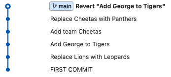

- `git revert --no-commit {되돌릴  커밋 해시}` : 커밋해버리지 않고 `revert`하기
  1. 원하는 다른 작업을 추가한 다음 함께 커밋
  2. 취소하려면 `git reset --hard`

# `branch`

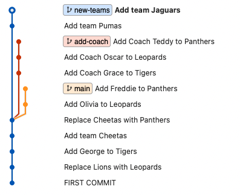

<div class="code-example" markdown="1">
**여러 브랜치의 내역 편리하게 보기**
</div>

```
git log --all --decorate --oneline --graph
```


<div class="code-example" markdown="1">
**브랜치 생성**
</div>

```
git branch {브랜치 이름}
```

<div class="code-example" markdown="1">
**브랜치 이동**
checkout 명령어가 Git 2.23 버전부터 `switch`, `restore`로 분리
</div>

```
git switch {브랜치 이름}
```

<div class="code-example" markdown="1">
**브랜치 생성과 이동 동시에 하기**
</div>

```
git switch -c {브랜치 이름}
```

<div class="code-example" markdown="1">
**브랜치 삭제하기**
</div>

```
git branch -d {브랜치 이름}
git branch -D {브랜치 이름} #강제 삭제
```

<div class="code-example" markdown="1">
**브랜치 이름 변경하기**
</div>

```
git branch -m {기존 브랜치} {브랜치 변경할 이름}
```

# `merge` vs `rebase`
- `merge` : 두 브랜치를 한 커밋에 이어붙인다
  1. **브랜치 사용내역을 남길 필요가 있을 때 적합한 방식**
  2. 새로운 커밋이 생성되며 해당 커밋은 reset으로 삭제할 수 있다


<div class="code-example" markdown="1">
1. `add-coach` 브랜치를 `main` 브랜치로 **merge**
   - 대상 브랜치로 이동 (`main` 브랜치로 이동)
</div>

```
git switch main
git merge add-coach
```

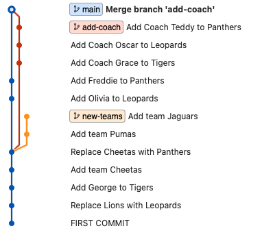

<div class="code-example" markdown="1">
1. `add-coach` 브랜치를 삭제
</div>

```
git branch -d add-coach
```

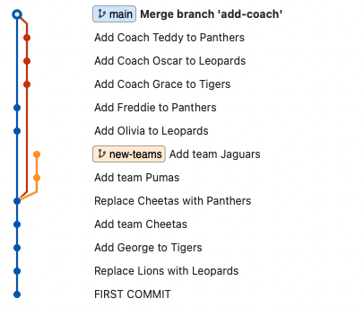

<br>

- `rebase` : 브랜치를 다른 브랜치에 이어붙인다
  1. **한 줄로 깔끔히 정리된 내역을 유지하기 원할 때 적합**
  2. 이미 팀원과 **공유된 커밋들에 대해서는 사용하지 않는 것이 좋다**


<div class="code-example" markdown="1">
1. `new-teams` 브랜치를 `main` 브랜치로 **rebase**
   - new-teams 브랜치로 이동 `(merge때와는 반대!)`
</div>

```
git switch new-teams
git rebase main
```

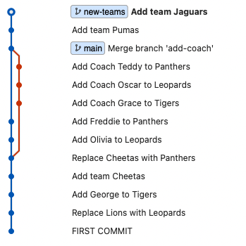

- `rebase` 직후 위와 같이 `new-teams`의 커밋내역(2개)이 `main`브랜치로 옮겨졌다
- 그리고 **서로의 위치가 다르다**
- **`main`브랜치를 `new-teams`의 커밋 위치로 옮겨줘야한다** 📌

<div class="code-example" markdown="1">
main 브랜치로 이동 후 아래 명령어로 `new-teams`의 시점으로 **fast-forward**
</div>

```
git switch main
git merge new-teams
```

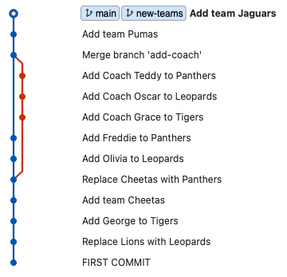

<div class="code-example" markdown="1">
`new-teams`브랜치 삭제
</div>

```
git branch -d new-teams
```

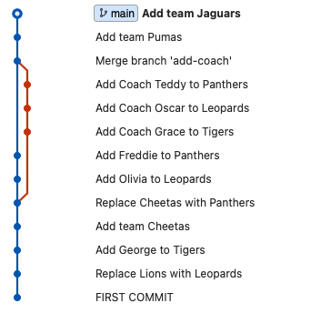

## `merge` 충돌 해결하기

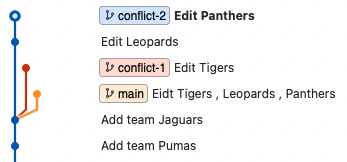

<div class="code-example" markdown="1">
`conflict-1`브랜치를 `main`브랜치에 병합하기
</div>

```
git switch main
git merge conflict-1

------------------------

자동 병합: tigers.yaml
충돌 (내용): tigers.yaml에 병합 충돌
자동 병합이 실패했습니다. 충돌을 바로잡고 결과물을 커밋하십시오.

```

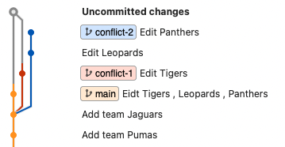

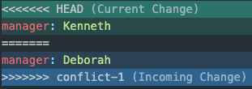

- **충돌 부분을 수정한 뒤 커밋을 하거나** , `git merge --abort`를 통해 **merge를 중단**한다

***

## `rebase` 충돌 해결하기

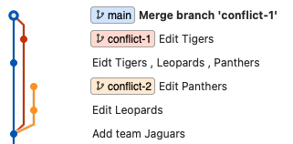

<div class="code-example" markdown="1">
`conflict-2`브랜치를 `main`브랜치에 rebase하기
</div>

```
git switch conflict-2
git rebase main

------------------------

자동 병합: leopards.yml
충돌 (내용): leopards.yml에 병합 충돌
error: 다음을 적용할(apply) 수 없습니다: 6e7cd96... Edit Leopards
힌트: Resolve all conflicts manually, mark them as resolved with
힌트: "git add/rm <conflicted_files>", then run "git rebase --continue".
힌트: You can instead skip this commit: run "git rebase --skip".
힌트: To abort and get back to the state before "git rebase", run "git rebase --abort".
Could not apply 6e7cd96... Edit Leopards

------------------------

git status

대화형 리베이스 진행 중. 갈 위치는 3e10c27
최근 완료한 명령 (1개 명령 완료):
   pick 6e7cd96 Edit Leopards
다음에 할 명령 (1개 명령 남음):
   pick 92319f7 Edit Panthers
  (보고 편집하려면 "git rebase --edit-todo"를 사용하십시오)
현재 'conflict-2' 브랜치를 '3e10c27' 위로 리베이스하는 중입니다.
  (충돌을 바로잡고 "git rebase --continue"를 사용하십시오)
  (이 패치를 건너뛰려면 "git rebase --skip"을 사용하십시오)
  (원본 브랜치를 가져오려면 "git rebase --abort"를 사용하십시오)

병합하지 않은 경로:
  (use "git restore --staged <file>..." to unstage)
  (해결했다고 표시하려면 "git add <파일>..."을 사용하십시오)
        양쪽에서 수정:  leopards.yml

커밋할 변경 사항을 추가하지 않았습니다 ("git add" 및/또는 "git commit -a"를
사용하십시오)

```

- 해결이 어려울 경우 `git rebase --abort`를 통해 **rebase를 중단**할 수 있다
- 또는 해결 가능할 경우
  1. 충돌 부분을 수정한 뒤 `git add .`
  2. `git rebase --continue` (충돌이 또 발생할 수 있기 때문에 `--continue`)
  3. 충돌이 모두 해결될 때 까지 반복
  4. `main`에서 `git merge conflict-2`로 마무리

- 하지만 `conflict-2`의 **Edit Panthers**의 커밋이 다시 충돌난다

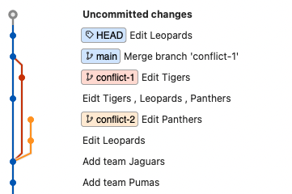

- 다시 충돌 내용을 잡아주면 아래와 같은 log가 된다

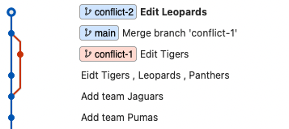

- `main`이 `conflict-2`보다 뒤쳐져있기 때문에 merge하고 나머지 branch를 삭제하자

```
git switch main
git merge conflict-2
git branch -d conflict-1
git branch -d conflict-2
```


> ✋ 두 마디 짜리 `conflict-2`브랜치를 `rebase` 했는데 결과는 왜 한 마디만 추가되나요?
> 
> 충돌 해결 중 두 번째 것에는 `currunt` , 즉 `main`브랜치 것 (Shirley)을 채택했기 때문에 *(rebase의미가 없어졌으므로)* 커밋을 추가할 필요가 없어졌기 때문이다