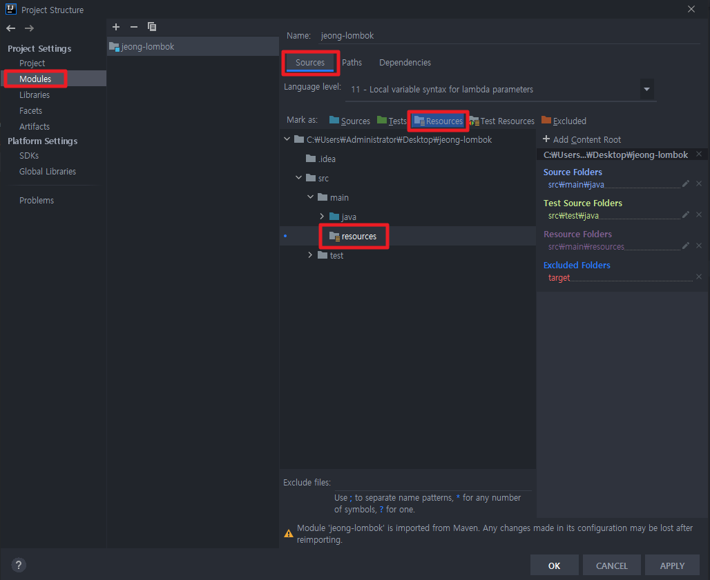
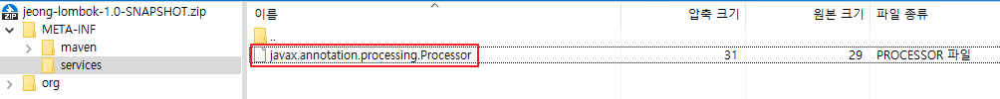
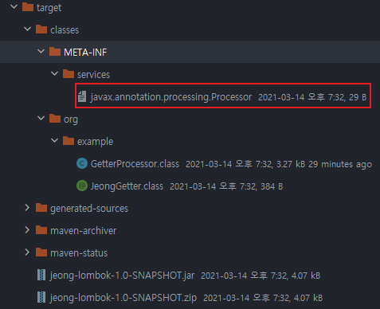
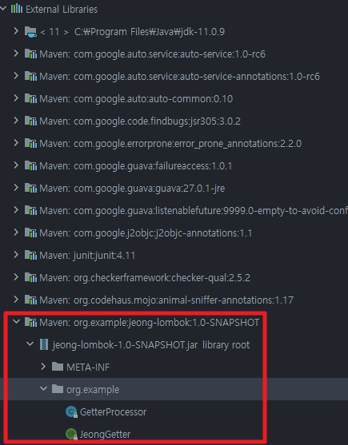
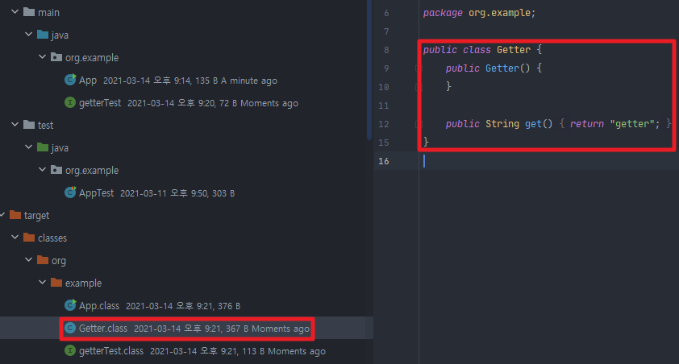
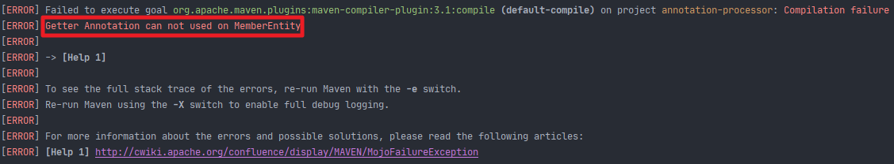
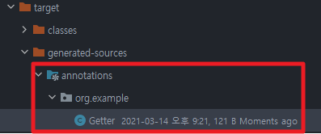
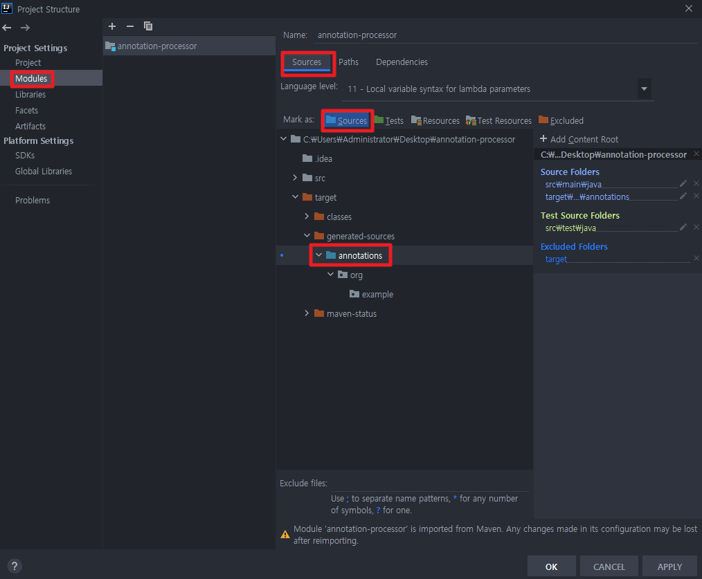
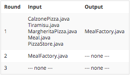

## Table of contents
{: .no_toc .text-delta }

1. TOC
{:toc}
---

# **Lombok은 어떻게 동작하는 걸까?**
✅ **`@Getter`, `@Setter`, `@Builder` 등의 애노테이션과 애노테이션 프로세서를 제공하여 표준적으로 작성해야 할 코드를 개발자 대신 생성해주는 라이브러리.**
{: .fh-default .fs-4 }

✅ **Annotation Processor의 대표적인 예**
{: .fh-default .fs-4 }

**[Lombok사용해보기](https://jeongcode.github.io/docs/spring/lombok-use/)**

**Maven**
```html
<dependency>
  <groupId>org.projectlombok</groupId>
  <artifactId>lombok</artifactId>
  <version>1.18.8</version>
  <scope>provided</scope>
</dependency>
```

> [Boilerplate code - 보일러플레이트 코드란?](https://charlezz.medium.com/%EB%B3%B4%EC%9D%BC%EB%9F%AC%ED%94%8C%EB%A0%88%EC%9D%B4%ED%8A%B8-%EC%BD%94%EB%93%9C%EB%9E%80-boilerplate-code-83009a8d3297)

## **동작 원리**
- 컴파일 시점에 **[애노테이션 프로세서](https://docs.oracle.com/javase/8/docs/api/javax/annotation/processing/Processor.html)** 를 사용하여 <span style="color:red; font-weight:bold">소스코드의 AST(abstract syntax tree)를 조작한다.</span> [AST??](https://javaparser.org/inspecting-an-ast/)
- **논란 거리**
  - 공개된 API가 아닌 컴파일러 내부 클래스를 사용하여 기존 소스 코드를 조작한다.
  -  특히 이클립스의 경우엔 [java agent](https://catsbi.oopy.io/6136946a-9139-4541-b2af-2af93bb634a5)를 사용하여 컴파일러 클래스까지 조작하여 사용한다. 해당 클래스들 역시 공개된 API가 아니다보니 버전 호환성에 문제가 생길 수 있고 언제라도 그런 문제가 발생해도 이상하지 않다.
  -  그럼에도 불구하고 엄청난 편리함 때문에 널리 쓰이고 있으며 대안이 몇가지 있지만 롬복의 모든 기능과 편의성을 대체하진 못하는 현실이다.
    - [AutoValue](https://github.com/google/auto/blob/master/value/userguide/index.md)
    - [Immutables](https://immutables.github.io)


# **Annotation Processor 실습**

> ✔
> - **추후 Toy Project에 `JeongLombok`을 게시할 예정**
> - 여기서는 핵심 로직만 확인하자.
> - [Maven 설치](https://dev-youngjun.tistory.com/109)

✅ **JAVA6 부터 제공하는 Annotation Processor API를 사용**
{: .fh-default .fs-4 }

✅ **[Processor 인터페이스](https://docs.oracle.com/en/java/javase/11/docs/api/java.compiler/javax/annotation/processing/Processor.html)** -  **여러 라운드(rounds)에 걸쳐 소스 및 컴파일 된 코드를 처리 할 수 있다.**
{: .fh-default .fs-4 }

✅ **[Filer 인터페이스](https://docs.oracle.com/en/java/javase/11/docs/api/java.compiler/javax/annotation/processing/Filer.html)** - **소스 코드, 클래스 코드 및 리소스를 생성할 수 있는 인터페이스**
{: .fh-default .fs-4 }


 > ✋  **[Javapoet](https://github.com/square/javapoet)**
 > - **소스 코드 생성 유틸리티 라이브러리**
 >
 > ```html
 > <dependency>
>    <groupId>com.squareup</groupId>
>    <artifactId>javapoet</artifactId>
>    <version>1.11.1</version>
> </dependency>
> ```

> ✋ **Resources 폴더 만들기**
> - Resources폴더로 지정하여야 .jar안에 포함된다.
> - 


> ✋ **[AutoService](https://github.com/google/auto/tree/master/service) - 서비스 프로바이더 레지스트리 생성기**
> - (이것도 Annotation Processor이다)
> - 위에서 한 Resources 폴더를 따로 만들지 않아도 된다.
> - 컴파일 시점에 애노테이션 프로세서를 사용하여
>    - `META-INF/services/javax.annotation.processor.Processor` 파일 자동으로 생성해준다.
> - **📌 [Service Provider](https://itnext.io/java-service-provider-interface-understanding-it-via-code-30e1dd45a091?gi=6d82ed277a29)의 개념이다.**
>
> ```html
> <dependency>
>   <groupId>com.google.auto.service</groupId>
>   <artifactId>auto-service</artifactId>
>   <version>1.0-rc6</version>
> </dependency>
> ```
> ```java
> @AutoService(Processor.class)
> public class GetterProcessor extends AbstractProcessor {
>   ...
> }
> ```
> - jar파일을 zip으로 변환하여 폴더 내부를 보면 자동으로 만들어준 걸 확인할 수 있다.
> - 
> - 인텔리
> - 

## 📌 **핵심 로직**
```java
// Google에서 제작한 AutoService를 사용하여
// 이 GetterProcessor를 Processor로 등록해달라고 하는 것이다.
@AutoService(Processor.class)
public class GetterProcessor extends AbstractProcessor {
    // implements Processor를 구현하여도 되지만
    // AbstractProcessor가 Processor를 어느정도 구현 해놓았다.

    // 이 프로세서가 어떤 어노테이션을 처리할 것인지
    @Override
    public Set<String> getSupportedAnnotationTypes() {
        // 처리할 어노테이션의 문자열
        return Set.of(JeongGetter.class.getName());
    }

    // 어떤 소스코드의 버전을 지원하는지
    @Override
    public SourceVersion getSupportedSourceVersion() {
        return SourceVersion.latestSupported();
    }

    // ture를 리턴 시 이 어노테이션의 타입을 처리하였으니 (여러 라운드의) 다음 프로세서들은 이 어노테이션의 타입을 다시 처리하진 않는다.
    @Override
    public boolean process(Set<? extends TypeElement> annotations, RoundEnvironment roundEnv) {
        Set<? extends Element> elements = roundEnv.getElementsAnnotatedWith(JeongGetter.class);

        for(Element element : elements){
            Name elementName = element.getSimpleName();
            if(element.getKind() != ElementKind.INTERFACE){
                // JeongGetter 어노테이션을 인터페이스가 아닌 다른 곳에 작성하였다면
                // 컴파일 에러 처리
                processingEnv.getMessager().printMessage(Diagnostic.Kind.ERROR , "Getter Annotation can not used on " + elementName);
            }
            else{
                // 인터페이스에 제대로 작성하였다면
                // 로깅
                processingEnv.getMessager().printMessage(Diagnostic.Kind.NOTE , "Processing " + elementName);
            }

            // javax.lang.model.element public interface TypeElement를
            // com.squareup.javapoet public final class ClassName 으로 변환할 수 있다.
            TypeElement typeElement = (TypeElement) element;
            // ClassName으로 그 클래스에 대한 정보를 사용할 수 있다.
            ClassName className = ClassName.get(typeElement);

            // com.squareup.javapoet public final class MethodSpec을 사용하여 메서드를 만들 수 있다.
            MethodSpec get = MethodSpec.methodBuilder("get")
                                        .addModifiers(Modifier.PUBLIC)
                                        .returns(String.class)
                                        .addStatement("return $S" , "getter")
                                        .build();

            // com.squareup.javapoet.TypeSpec을 사용하여 클래스를 만들 수 있다.
            TypeSpec makeClass = TypeSpec.classBuilder("Getter")
                                        .addModifiers(Modifier.PUBLIC)
                                        .addSuperinterface(className)
                                        .addMethod(get)
                                        .build();

            // 위에서 정의한 Spec을 사용하여 실제 Source 코드에 삽입해보자

            // 1. javax.annotation.processing public interface Filer 인터페이스를 가져오자
            Filer filer = processingEnv.getFiler();

            // 2. com.squareup.javapoet public final class JavaFile 을 사용
            // 2.1 makeClass를 해당 패키지에 만들어 달라.
            // 2.2 위에서 가저온 filer를 사용하여 써달라.
            try {
                JavaFile.builder(className.packageName() , makeClass)
                        .build()
                        .writeTo(filer);
            } catch (IOException e) {
                processingEnv.getMessager().printMessage(Diagnostic.Kind.ERROR , "FATA ERROR : " + e);
            }
        }
        return true;
    }

}
```

## **내가 만든 Annotation Processor 다른 프로젝트에 주입하기**
✅ **원하는 프로젝트에 추가**
{: .fh-default .fs-4 }

```html
<dependencies>
  ...
  <dependency>
    <groupId>org.example</groupId>
    <artifactId>jeong-lombok</artifactId>
    <version>1.0-SNAPSHOT</version>
  </dependency>

</dependencies>
```
✅ **라이브러리에 추가된 것을 볼 수 있다.**
{: .fh-default .fs-4 }


**mvn clean compile 시**
```java
@JeongGetter
public interface getterTest {
}
```

✅ **`@JeongGetter` 어노테이션에 의해 getterTest.interface의 Getter.class (구현체)가 생긴것을 볼 수 있다.**
{: .fh-default .fs-4 }


> ✋ **Interface가 아닌 class에 `@JeongGetter` 작성 시 컴파일 에러를 확인할 수 있다.**
> - 


**📌 해당 Annotation Processor로 생성된 코드를 사용하기**
{: .fh-default .fs-4 }

**해당 이미지의 `annotations` 폴더 아래의 파일들을 `Source`로 설정 해야 된다.**
- 
- 

```java
@JeongGetter
public interface getterTest {
    public String get();
}
```

```java
public static void main( String[] args ) {
    getterTest get = new Getter();
    System.out.println(get.get());
    // 출력
    // getter
}
```

# **📌 정리**
- **컴파일러가 컴파일 하는 중에 해당 어노테이션이 달린 클래스 정보를 읽어들여 새로운 소스 코드를 생성해내거나 기존 코드를 수정 (롬복 처럼) 할 수 있다.**
- **별개의 메서드나 클래스를 만들어 낼 수 있는 아주 강력한 기능이다.**
- `@JeongGetter` 어노테이션을 처리하는 Annotation Processor를 만들어 해당 Annotation Processor 프로젝트를 라이브러리로 땡겨 <span style="color:red; font-weight:bold">소스 코드에 없던 코드를 만들어 내보았다.</span>
- **`getterTest`인터페이스에  `@JeongGetter`어노테이션을 추가하여 컴파일시점에 `getterTest`의 구현체인 `Getter`를 생성해보았다.**
- 이 기술을 응용하여 `Jeong-Lombok`을 만들어보자!

**애노테이션 프로세서 사용 예**
- 롬복
- AutoService: java.util.ServiceLoader용 파일 생성 유틸리티
- `@Override`
  -  [참고](https://stackoverflow.com/questions/18189980/how-do-annotations-like-overridework-internally-in-java/18202623)
- Dagger 2: 컴파일 타임 DI 제공
- 안드로이드 라이브러리
  -  ButterKinfe: `@BindView` (뷰 아이디와 애노테이션 붙인 필드 바인딩)
  -  DeepLinkDispatch: 특정 URI 링크를 Activity로 연결할 때 사용

***

# **✍ 키워드**

- javax.annotation.processing
  - AbstractProcessor , **[Processor](https://docs.oracle.com/javase/8/docs/api/javax/annotation/processing/Processor.html)**
  - **[Filer 인터페이스](https://docs.oracle.com/en/java/javase/11/docs/api/java.compiler/javax/annotation/processing/Filer.html)**
  - RoundEnvironment
  - ProcessingEnvironment
- javax.lang.model
  - Element
  - TypeElement
-  **[Javapoet](https://github.com/square/javapoet)**
-  **[AutoService](https://github.com/google/auto/tree/master/service)**

# **Annotation Processor**
- [Annotation-Processing 101 번역본](https://medium.com/@jason_kim/annotation-processing-101-%EB%B2%88%EC%97%AD-be333c7b913)
- 컴파일 시간에 어노테이션들을 스캐닝하고 프로세싱하는 javac에 속한 빌드 툴, **JVM위에서 돌아간다.**
- 어노테이션 프로세싱은 자바5 부터 가능하지만 유용한 API들은 자바6(2006년 12월에 출시) 부터 사용 가능
- 특정 어노테이션을 위한 어노테이션 프로세서는 자바 코드(또는 컴파일된 바이트코드)를 인풋으로 받아서 아웃풋으로 파일(보통 .java파일)을 생성한다. ➜ 자바 코드를 생성할 수 있다.
- <span style="color:red; font-weight:bold">이미 존재하는 자바 파일을 수정해서 메서드를 추가하는 것은 할 수 없다.</span>

## **Abastract Processor**
- 프로세서 API
- 모든 프로세서들은 Abstract Processor를 상속 받아야 한다.

```java
public class MyProcessor extends AbstractProcessor {

	@Override
	public synchronized void init(ProcessingEnvironment env){ }

	@Override
	public boolean process(Set<? extends TypeElement> annoations, RoundEnvironment env) { }

	@Override
	public Set<String> getSupportedAnnotationTypes() { }

	@Override
	public SourceVersion getSupportedSourceVersion() { }

}
```

### `init(ProcessingEnvironment env)`
- **`ProcessingEnvironment`를 파라미터로 받아 어노테이션 프로세싱 툴이 호출하는 특별한 init()메서드를 가지고 있다.**
- **`ProcessingEnvironment`**
  - Elements
  - Types
  - Filer
  - ...
  - 위와 같이 유용한 유틸 클래스들을 제공한다.


### `process(Set<? extends TypeElement> annotations, RoundEnvironment env)`
- 각각의 프로세서의 main() 메서드의 역할을 한다.
- scanning , evaluating , 어노테이션 프로세싱 , 자바 파일 생성을 위한 코드를 작성한다.
- **`RoundEnvironment` 가지고 특정 어노테이션이 달린 것들을 찾을 수 있다.**

### `getSupportedAnnotationTypes()`
- 이 어노테이션 프로세서가 처리할 어노테이션들을 명시한다.

### `getSupportedSourceVersion()`
- 사용하고있는 특정 자바 버전을 명시하는데 사용한다.
- 보통 `SourceVersion.latestSupported()` 를 리턴하면 됩니다.

> ✋ **JAVA 7**
> ```java
> @SupportedSourceVersion(SourceVersion.latestSupported())
> @SupportedAnnotationTypes({
>   // Set of full qullified annotation type names
> })
>public class MyProcessor extends AbstractProcessor {
>
>	@Override
>	public synchronized void init(ProcessingEnvironment env){ }
>
>	@Override
>	public boolean process(Set<? extends TypeElement> annoations, RoundEnvironment env) { }
>}
> ```
- 특정 안드로이드의 호환성을 위해 `@SupportedAnnotationTypes` 와 `@SupportedSourceVersion` 대신에 `getSupportedAnnotationTypes()` 와 `getSupportedSourceVersion()` 를 사용할 것을 추천 합니다.


### **Error Handling**
- `init(ProcessingEnvironment env)` 메서드의 `ProcessingEnvironment` 객체에서 `Messager`를 가져올 수 있다.
- **`Messager`는 어노테이션 프로세서가 에러 메세지나 경고 문구나 다른 주의사항을 리포트 하는 법을 제공한다.**
- 해당 어노테이션 프로세서를 사용하는 개발자들에게 메세지를 제공할 때 사용한다.
- [메세지의 다양한 레벨](https://docs.oracle.com/javase/7/docs/api/javax/tools/Diagnostic.Kind.html)
  - Enum Diagnostic.Kind
    - `Kind.ERROR` 어노테이션 프로세싱의 실패를 알릴 때 사용
  - **Exception을 발생 시키는 전통적인 자바 어플리케이션과 약간 다른 컨셉이다.**
- **`process()`에서 exception을 발생 시키면 JVM은 Annotation Processing 크래쉬가 발생한다(일반 자바 어플리케이션 처럼).**
- 해당 어노테이션 프로세서를 사용하는 개발자들은 javac로 부터 알기힘든 Exception이 포함된 에러를 받을 수 있다.
- **그러므로 어노테이션 프로세서는 `Messager`클래스를 가지고 있다.**
- `messager.printMessage(Diagnostic.Kind.ERROR)` 발생 후 return을 하지 않는다면 해당 ERROR가 프로세스를 중지시키지 못해 게속 실행된다.
  - 그래서 에러 출력이후에 return 하지 않는다면내부적인 **NullPointerException** 과 같은 에러 환경에서도 계속 프로세서가 멈추지 않고 있게됩니다. 전에 말한것 처럼, process() 에서 다루지 못하는 예외가 발생한다면 javac는 `Messager` 의 에러 메세지가 아니라 내부적인 **NullPointerException** 의 stack trace 를 출력할 것입니다.

***

## **Processing Rounds**
- **어노테이션 프로세싱은 한번의 프로세싱 라운드 이상 일어난다.**
- 공식 javadoc에서는 프로세싱을 다음과 같이 정의 했다.

> “어노테이션 프로세싱은 연속적인 라운드에서 일어납니다. 각각의 라운드에서, 프로세서는 소스나 이전 라운드에서 생성된 클래스 파일에서 발견된 어노테이션들의 집합을 처리합니다. 첫번째 프로세싱 라운드의 인풋은 최초의 인풋입니다. 이 최초의 인풋들은 프로세싱 가상의 0번째 라운드의 아웃풋으로 간주됩니다.”

> ✋ **더 간단한 정의**
> 1. 프로세싱 라운드는 어노테이션 프로세서의 `process()` 를 호출합니다.
> 1. 해당 Processor(작성한 AnnotationProcessor)는 한번 인스턴스화 된다. (새로운 프로세서가 매 라운드마다 생성되지는 않는다.)
> 1. 하지만 새로운 소스파일이 생겨난다면 `process()`는 여러번 호출될 수 있다.
> - 참고 이미지 ([출처](http://hannesdorfmann.com/annotation-processing/annotationprocessing101/) - hannesdorfmann.com)
>   - 
>   -  첫번째 라운드에서 우리는 MagheritaPizza, CalzonePizza, Tiramisu 를 발견하고 MealFactory.java 를 생성
>   - 두번째 라운드에서 MealFactory 를 인풋으로 삼는다.
>   - `@Factory`(예제 어노테이션) 어노테이션이 없기 때문에 데이터가 수집되지 않고 , 에러를 유발하지도 않는다.

 📌 **어노테이션 프로세싱은 여러 라운드가 실행되고 이미 생성된 소스 파일을 덮어 쓰거나 재생성하지 않아야한다.**
 {: .fh-default .fs-5 }


***

#
