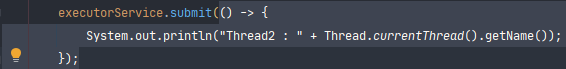

## Table of contents
{: .no_toc .text-delta }

1. TOC
{:toc}
---

**자바에서 지원하는 Concurrent 프로그래밍**
- **멀티 프로세싱(Process Builder)**
- **멀티 쓰레드**

# **[프로세스와 스레드의 차이](https://gmlwjd9405.github.io/2018/09/14/process-vs-thread.html)**

## **프로세스**
-   컴퓨터에서 연속적으로 실행되고 있는 컴퓨터 프로그램
-   **메모리에 올라와 실행되고 있는 프로그램의 인스턴스 (독립적인 객체)**
-   운영체제로 부터 시스템 자원을 할당받는 작업의 단위
-   즉, 동적인 개념으로는 실행된 프로그램을 의미한다.
-   할당받는 시스템 자원의 예
    -   CPU 시간
    -   운영되기 위해 필요한 주소 공간
    -   Code , Data , Stack , Heap의 구조로 되어 있는 독립된 메모리 영역
-   기본적으로 프로세스당 최소 1개의 스레드 (메인 스레드)를 가지고 있다.
-   각 프로세스는 별도의 주소 공간에서 실행되며 , 한 프로세스는 다른 프로세스의 변수나 자료 구조에 접근할 수 없다.
-   한 프로세스가 다른 프로세스의 자원에 접근하려면 프로세스 간의 통신 (IPC , Inter-Process-Communication)을 사용해야 한다.
    -   파이프 , 파일 , 소켓 등을 이용한 통신 방법 이용

## **스레드**

-   프로세스 내에서 실행되는 여러 흐름의 단위
-   **프로세스의 특정한 수행 경로**
-   **프로세스가 할당받은 자원을 이용하는 실행의 단위**
-   프로세스 내에서 각각 Stack만 따로 할당받고 Code , Data , Heap 영역은 공유한다.
-   한 프로세스 내에서 동작되는 여러 실행의 흐름으로 , 프로세스 내의 주소 공간이나 자원들(힙 공간 등) 을 같은 프로세스 내에 스레드 끼리 공유하면서 실행된다.
-   같은 프로세스 안에 있는 여러 스레드들은 같은 힙 공간을 공유한다. 반면에 프로세스는 다른 프로세스의 메모리에 직접 접근할 수 없다.
-   각각의 스레드는 별도의 레지스터와 스택을 갖고 있지만 , 힙 메모리는 서로 읽고 쓸 수 있다.
-   한 스레드가 프로세스 자원을 변경하면 , 다른 이웃 스레드(sibling thread)도 그 변경 결과를 즉시 볼 수 있다.

## **자바 스레드(Java Thread)**

-   일반 스레드와 거의 차이가 없으며  , JVM이 운영체제의 역할을 한다.
-   **자바에는 프로세스가 존재하지 않고 스레드만 존재하며 , 자바 스레드는 JVM에 의해 스케줄되는 실행 단위 코드 블록이다.**
-   자바에서 스레드 스케줄링은 전적으로 JVM에 의해 이루어진다.
-   아래과 같은 스레드와 관련된 많은 정보들도 JVM이 관리한다.
    -   스레드가 몇 개 존재하는지
    -   스레드로 실행되는 프로그램 코드의 메모리 위치는 어디인지
    -   스레드의 상태는 무엇인지
    -   스레드의 우선순위는 얼마인지
-   즉 , **개발자는 자바 스레드로 작동할 스레드 코드를 작성하고 , 스레드 코드가 생명을 가지고 실행을 시작하도록 JVM에 요청하는 일 뿐이다.**

***

# **자바 멀티 쓰레드 프로그래밍**

## **Thread 주요 기능**
-   **현재 Thread 멈춰 두기 (sleep)**
    -   다른 쓰레드가 처리할 수 있도록 기회를 주지만 그렇다고 락을 놔주진 않는다.
-   **다른 쓰레드 깨우기 (interrupt)**
    -   다른 쓰레드를 깨워서 interruptedException을 발생 시킨다.
    -   그 에러가 발생했을 때 할 일은 코딩하기 나름 , 종료 시킬 수도 있고 계속 하던 일 할 수도 있음
-   **다른 쓰레드 기다리기 (join)**
    -   다른 쓰레드가 끝날 때 까지 기다린다.

### Thread 테스트
```java
public class AppForConcurrentTest {
    public static void main(String[] args) {
        myThread myThread = new myThread();
        myThread.start();

        System.out.println("Hello");

        Thread thread = new Thread(new Runnable() {
            @Override
            public void run() {
                System.out.println("Thread :" + Thread.currentThread().getName());
            }
        });
        thread.start();

        // Runnable이 함수형 인터페이스로 변경 되었기 때문에 가능
        Thread thread2 = new Thread(() -> {
            try {
                Thread.sleep(1000L);
            } catch (InterruptedException e) {
                // InterruptedException
                // 자는 동안 이 스레드를 꺠우면 catch
                e.printStackTrace();
            }
            System.out.println("Thread2 : " + Thread.currentThread().getName());
        });
        thread2.start();
//        출력
//        Hello
//        MyThread : Thread-0
//        Thread :Thread-1
//        Thread2 : Thread-2
    }

    static class myThread extends Thread{
        @Override
        public void run(){
            System.out.println("MyThread : " + Thread.currentThread().getName());
        }
    }
}
```

### InterruptedException 테스트
```java
public class AppForConcurrentTest {
    public static void main(String[] args) throws InterruptedException {
        // InterruptedException 테스트
        Thread thread = new Thread(() -> {
            while(true){
                System.out.println("Thread : " + Thread.currentThread().getName());
                try {
                    Thread.sleep(1000L);
                } catch (InterruptedException e) {
                    System.out.println("exit!");
                    return;
                }
            }
        });
        thread.start();

        System.out.println("Hello : " + Thread.currentThread().getName());
        Thread.sleep(3000L);
        thread.interrupt();

//        출력
//        Thread : Thread-0
//        Hello : main
//        Thread : Thread-0
//        Thread : Thread-0
//        exit!
    }
}
```

### Thread.join()
```java
public class AppForConcurrentTest {
    public static void main(String[] args) throws InterruptedException {
        // InterruptedException 테스트
        Thread testThread = new Thread(() -> {
            try {
                Thread.sleep(3000L);
                System.out.println("Thread : " + Thread.currentThread().getName());
            } catch (InterruptedException e) {
                throw new IllegalStateException(e);
            }
        });
        testThread.start();

        System.out.println("Hello : " + Thread.currentThread().getName());
        // main thread 가 testThread를 기다린다.
        testThread.join();

        System.out.println(Thread.currentThread().getName() + " is finished ");

//        출력
//        Hello : main
//        (3초 후)
//        Thread : Thread-0
//        main is finished

//        "main is finished"는 main thread에 의해 "Thread : Thread-0" 이전에 나와야한다.
//        하지만 join 메서드로 인해 main thread는 testThread를 기다리게 된다.

    }
}
```
***

# **Executors**
✅**Runnable을 여전히 사용하지만**
{: .fh-default .fs-4 }
✅**Thread 와 Runnable 처럼 Low-Level API를 직접 다루는게 아니다.**
{: .fh-default .fs-4 }

## **고수준 (High Level) Concurrency 프로그래밍**

- **Thread를 만들고 관리하는 작업을 애플리케이션에서 분리**
- **그런 기능을 Executors에게 위임**

## **Executros가 하는일**

-   **Thread 만들기 :** 애플리케이션이 사용할 Thread Pool을 만들어 관리한다.
-   **Thread 관리 :** Thread 생명 주기를 관리한다.
-   **작업 처리 및 실행 :** Thread로 실행할 작업을 제공할 수 있는 API를 제공한다.

## **주요 인터페이스**

-   **Executor**
    -   execute(Runnable)
-   **ExecutorService**
    -   Executor 상속 받은 인터페이스로 , Callable도 실행할 수 있으며 . Executor를 종료 시키거나 , 여러 Callable을 동시에 실행하는 등의 기능을 제공한다.

### ExecutorService 테스트
```java

    public static void main(String[] args) {
        ExecutorService executorService = Executors.newSingleThreadExecutor();

        // 방법 1
        executorService.execute(new Runnable() {
            @Override
            public void run() {
                System.out.println("Thread : " + Thread.currentThread().getName());
            }
        });

        // 방법 2
        executorService.submit(() -> {
            System.out.println("Thread2 : " + Thread.currentThread().getName());
        });

        // ExecutorService는 실행 후 다음 작업을 대기 하고 있기 때문에 프로세스가 살아 있다.
        // 명시적으로 shutdown을 해야한다.
        // shutdown은 작업 완료가 보장된다.
        executorService.shutdown();
        executorService.shutdownNow();

//        출력
//        Thread : pool-1-thread-1
//        Thread2 : pool-1-thread-1

    }

```

### Executors.newFixedThreadPool(n) 테스트
```java
    public static void main(String[] args) {
        // 2개의 Thread를 선언
        ExecutorService executorService = Executors.newFixedThreadPool(2);
        // 2개의 Thread를 사용하여 5개의 작업을 한다.
        // Blocking-Queue와 Thread Pool이 존재한다.
        executorService.submit(getRunnable("Test1"));
        executorService.submit(getRunnable("Test2"));
        executorService.submit(getRunnable("Test3"));
        executorService.submit(getRunnable("Test4"));
        executorService.submit(getRunnable("Test5"));

//        출력
//        Test2 : pool-1-thread-2
//        Test1 : pool-1-thread-1
//        Test3 : pool-1-thread-1
//        Test4 : pool-1-thread-1
//        Test5 : pool-1-thread-1
    }
​
    private static Runnable getRunnable(String message) {
        return () -> {
            System.out.println(message + " : " + Thread.currentThread().getName());
        };
    }
```
***

###  ScheduledExecutorService
-   **ExecutorService를 상속 받은 인터페이스로 특정 시간 이후에 또는 주기적으로 작업을 실행할 수 있다.**

### Executors.newSingleThreadScheduledExecutor() 테스트
```java
    public static void main(String[] args) {
        // 2개의 Thread를 선언
        ScheduledExecutorService scheduledExecutorService
                = Executors.newSingleThreadScheduledExecutor();

        // 시작 1초 지연
        scheduledExecutorService
                .schedule(getRunnable("Thread1") , 1 , TimeUnit.SECONDS);

        // 시작 1초 지연 후 2초 간격으로 반복 실행
        scheduledExecutorService
                .scheduleAtFixedRate(getRunnable("Thread2") , 1 , 2, TimeUnit.SECONDS);

    }

    private static Runnable getRunnable(String message) {
        return () -> {
            System.out.println(message + " : " + Thread.currentThread().getName());
        };
    }
```

## **Fork/Join 프레임워크**
✅**ExecutorService의 구현체로 손쉽게 멀티 프로세서를 활용할 수 있게끔 도와준다.**
{: .fh-default .fs-4 }



***

# **Callable과 Future**

**Callable**
{: .fh-default .fs-5 }
- **Runnable과 유사하지만 리턴 값을 받을 수 있다.**

**Future**
{: .fh-default .fs-5 }
-   **비동기적인 작업의 현재 상태를 조회하거나 가져올 수 있다.**
-   **[Future (Java Platform SE 8 ) (oracle.com)](https://docs.oracle.com/javase/8/docs/api/java/util/concurrent/Future.html)**

## **get()**
-   결과를 가져오기
-   **블록킹 콜이다.**
-   타임아웃(최대한으로 기다릴시간)을 설정할 수 있다.

```java
public static void main(String[] args) throws ExecutionException, InterruptedException {
    ExecutorService executorService = Executors.newSingleThreadExecutor();

    Callable<String> hello = () ->{
        Thread.sleep(2000L);
        return "Hello";
    };

    // submit 메소드 - <T> Future<T> submit(Callable<T> task);
    Future<String> helloFuture = executorService.submit(hello);
    System.out.println("Started!");

    helloFuture.get();   // 블록킹 콜

    System.out.println("End!");
    executorService.shutdown();
}
```

## **isDone()**
-   작업상태 확인하기 
-   완료했으면 true 아니면 false를 리턴한다.

```java
public static void main(String[] args) throws ExecutionException, InterruptedException {
    ExecutorService executorService = Executors.newSingleThreadExecutor();

    Callable<String> hello = () ->{
        Thread.sleep(2000L);
        return "Hello";
    };

    // submit 메소드 - <T> Future<T> submit(Callable<T> task);
    Future<String> helloFuture = executorService.submit(hello);
    System.out.println("Start!, isDone? :" + helloFuture.isDone());

    helloFuture.get();   // 블록킹 콜

    System.out.println("End!, isDone? :" + helloFuture.isDone());
    executorService.shutdown();

//        출력
//        Start!, isDone? :false
//        (2초 후) - 블록킹 콜
//        End!, isDone? :true
}
```

## **cancel()**
-   작업 취소하기
-   취소 했으면 true, 못했으면 false를 리턴한다.
-   parameter로 true를 전달하면 현재 진행중인 Thread를 Interrupt하고 그러지 않으면 현재 진행중인 작업이 끝날 때 까지 기다린다.

```java
public static void main(String[] args) throws ExecutionException, InterruptedException {
    ExecutorService executorService = Executors.newSingleThreadExecutor();

    Callable<String> hello = () ->{
        Thread.sleep(2000L);
        return "Hello";
    };

    // submit 메소드 - <T> Future<T> submit(Callable<T> task);
    Future<String> helloFuture = executorService.submit(hello);
    System.out.println("Start!, isDone? :" + helloFuture.isDone());


    helloFuture.cancel(true);
    // cancel한 후 get을 하게 되면 java.util.concurrent.CancellationException이 발생한다.
    // helloFuture.get();

    System.out.println("End!, isDone? :" + helloFuture.isDone());
    executorService.shutdown();

//        출력
//        Start!, isDone? :false
//        End!, isDone? :true (cancel을 하게 되면 isDone은 ture를 반환한다.)
}
```

## **invokeAll()**
-   여러 작업 동시에 실행하기

```java
public static void main(String[] args) throws ExecutionException, InterruptedException {
    ExecutorService executorService = Executors.newSingleThreadExecutor();
//		ExecutorService executorService = Executors.newFixedThreadPool(4);
    Callable<String> test1 = () ->{
        Thread.sleep(1000L);
        return "Test1";
    };
    Callable<String> test2 = () ->{
        Thread.sleep(2000L);
        return "Test2";
    };
    Callable<String> test3 = () ->{
        Thread.sleep(3000L);
        return "Test3";
    };
    Callable<String> test4 = () ->{
        Thread.sleep(4000L);
        return "Test4";
    };
    long start = System.currentTimeMillis();
    List<Future<String>> list =
            executorService.invokeAll(Arrays.asList(test1, test2, test3, test4));
    long end = System.currentTimeMillis();
    for(Future<String> future : list){
        System.out.println(future.get());
    }
    System.out.println("경과 : " + (end - start) / 1000);
//        출력
//        Test1
//        Test2
//        Test3
//        Test4
//        경과 : 10

//        만약 스레드가 4개라면 4초가 걸린다.
    executorService.shutdown();
}
```

## **invokeAny()**
-   여러 작업중에 하나라도 먼저 응답이오면 끝내기
-   동시에 실행한 작업중에 제일 짧게 걸리는 작업 만큼 시간이 걸린다.
-   **블록킹 콜이다.**

```java
public static void main(String[] args) throws ExecutionException, InterruptedException {
    ExecutorService executorService = Executors.newFixedThreadPool(1);

    Callable<String> test2 = () ->{
        Thread.sleep(2000L);
        return "Test2";
    };
    Callable<String> test4 = () ->{
        Thread.sleep(4000L);
        return "Test4";
    };
    Callable<String> test1 = () ->{
        Thread.sleep(1000L);
        return "Test1";
    };
    Callable<String> test3 = () ->{
        Thread.sleep(3000L);
        return "Test3";
    };
    long start = System.currentTimeMillis();
    String s =
            executorService.invokeAny(Arrays.asList(test1, test2, test3, test4));
    long end = System.currentTimeMillis();
    System.out.println(s);
    System.out.println("경과 : " + (end - start) / 1000);
//        출력
//        Test1
//        경과 : 1

    executorService.shutdown();
}
```

# **참고**
[Lesson: Concurrency (The Java™ Tutorials > Essential Classes) (oracle.com)](https://docs.oracle.com/javase/tutorial/essential/concurrency/)
{: .fh-default .fs-4 }
[Thread (Java Platform SE 8 ) (oracle.com)](https://docs.oracle.com/javase/8/docs/api/java/lang/Thread.html#interrupt--)
{: .fh-default .fs-4 }
[Executors (The Java™ Tutorials > Essential Classes > Concurrency) (oracle.com)](https://docs.oracle.com/javase/tutorial/essential/concurrency/executors.html)
{: .fh-default .fs-4 }
