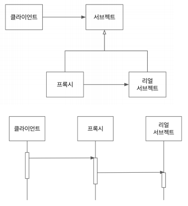

## Table of contents
{: .no_toc .text-delta }

1. TOC
{:toc}
---

# **스프링 데이터 JPA는 어떻게 동작할까?**

✅**Spring AOP를 기반으로 동작하며 RepositoryFactorySupport에서 프록시를 생성한다.**
{: .fh-default .fs-5 }
+ 리플렉션의 일부

```java
@Service
public class MemberService(){

  @Autowired
  MemberRepository memberRepository;

}
```
```java
public interface MemberRepository extends JpaRepository<Member, Long> , MemberRepository{
    @Override
    Optional<Member> findByName(String name);

    @Override
    Optional<Member> findById(Long aLong);
}
```

> ✋
> **interface인 MemberRepository가 어떻게 Service에 참조가 되는걸까??**
>
> - 📌 **RepositoryFactorySupport.class**를 사용한다.
>    -  **ProxyFactory.class**
>       - JAVA에서 제공하는 Dynamic Proxy를 추상화 해놓은 **Spring AOP의 핵심 클래스**

***

# **프록시 패턴**


- **프록시와 리얼 서브젝트가 공유하는 인터페이스가 있고, 클라이언트는 해당 인터페이스 타입으로 프록시를 사용한다.**
- 클라이언트는 프록시를 거쳐서 리얼 서브젝트를 사용하기 때문에 프록시는 리얼 서브젝트에 대한 접근을 관리하거나 부가기능을 제공하거나, 리턴값을 변경할 수도 있다.
- 📌 **리얼 서브젠트는 자신이 해야 할 일만 하면서(SRP) 프록시를 사용해서 부가적인 기능(접근 제한, 로깅, 트랜잭션, 등)을 제공할 때 이런 패턴을 주로 사용한다.**

> ✋
> - 스프링은 프록시 기반의 AOP를 제공하며, 이를 구현하기 위해 **Java Dynamic Proxy** 를 사용하거나 **Cglib**을 사용한다.
> - AopProxy 라는 Delegator 인터페이스로 표현되며 Dynamic Proxy 기반은 JdkDynamicAopProxy 클래스 Cglib 기반은 CglibAopProxy 클래스이다.
> - **Dynamic Proxy 기반과 Cglib 기반은 프록시 객체를 생성하는 방식에 차이가 있다.**
> - **Dynamic Proxy는 프록시 객체생성을 위해 인터페이스를 필수로 구현**
> - **Cglib은 인터페이스를 구현하지 않은 일반 클래스에 런타임 시 코드 조작으로 프록시 객체를 생성한다.**


**참고**
- https://www.oodesign.com/proxy-pattern.html
- https://en.wikipedia.org/wiki/Proxy_pattern
- https://en.wikipedia.org/wiki/Single_responsibility_principle

***

## **다이나믹 프록시**

✅ **런타임에 특정 인터페이스들을 구현하는 클래스 또는 인스턴스를 만드는 기술**
{: .fh-default .fs-5 }

- **다이나믹 프록시 사용처**
  -  스프링 데이터 JPA
  -  스프링 AOP
  -  Mockito
  - 하이버네이트 lazy initialzation
  - ...
- 참고
  - http://tutorials.jenkov.com/java-reflection/dynamic-proxies.htm

**`Object Proxy.newProxyInstance(ClassLoader, Interfaces, InvocationHandler)`**
{: .fh-default .fs-4 }

```java
public class TestServiceImpl implements TestService{
    @Override
    public void rent() {
        System.out.println("Impl rent");
    }

    @Override
    public void rent2() {
        System.out.println("Impl rent2");
    }
}
```

```java
TestService service = (TestService) Proxy.newProxyInstance(

      TestService.class.getClassLoader(),
      new Class[]{TestService.class},
      new InvocationHandler() {
          TestService testService = new TestServiceImpl();
          @Override
          public Object invoke(Object proxy, Method method, Object[] args) throws Throwable {
              // rent2 메서드에만 적용하기
              if(method.getName().equals("rent2")){
                  System.out.println("pre proxy");
                  Object invoke = method.invoke(testService , null);
                  System.out.println("post proxy");
                  return invoke;
              }
              return method.invoke(testService , null);
          }

      });

@Test
public void test(){
    service.rent();
    service.rent2();
    // 출력
    // Impl rent
    // pre proxy
    // Impl rent2
    // post proxy
}
```

> ✋
> - **이 코드는 유연하지가 않다.** 그래서 스프링 AOP가 등장했다.
> - 스프링 AOP를 프록시 기반의 AOP라 부른다.
> - 자세한 내용은 토비의 스프링 3.1 , 6장 AOP를 참고
> - 정리는 Spring 카테고리

***

## **클래스의 프록시가 필요하다면?**
✅ **서브 클래스를 만들 수 있는 라이브러리를 사용하여 프록시를 만들 수 있다.**
{: .fh-default .fs-5 }

**CGlib**
- https://github.com/cglib/cglib/wiki
- 스프링, 하이버네이트가 사용하는 라이브러리
- 버전 호환성이 좋치 않아서 서로 다른 라이브러리 내부에 내장된 형태로 제공되기도 한다.
- **Enhancer**

```xml
<dependency>
  <groupId>cglib</groupId>
  <artifactId>cglib</artifactId>
  <version>3.3.0</version>
</dependency>
```
```java
MethodInterceptor handler = new MethodInterceptor() {
    BookService bookService = new BookService();
    @Override
    public Object intercept(Object o, Method method, Object[] objects, MethodProxy methodProxy) throws Throwable {
        return method.invoke(bookService, objects);
    }
};
BookService bookService = (BookService) Enhancer.create(BookService.class, handler);
```

***
