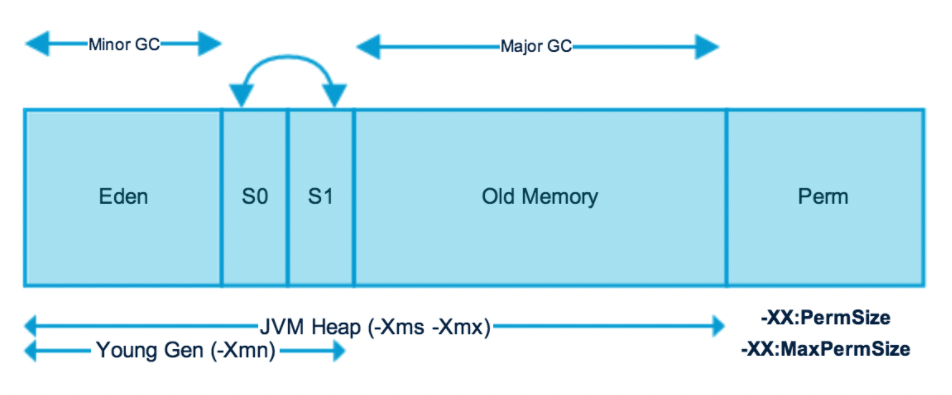
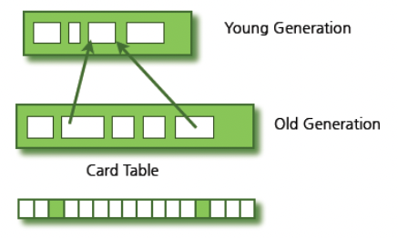
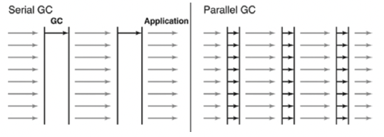
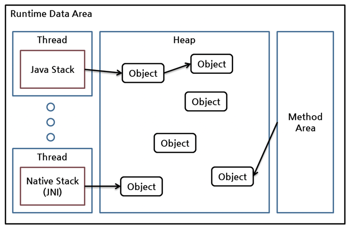
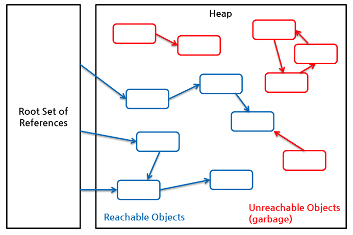
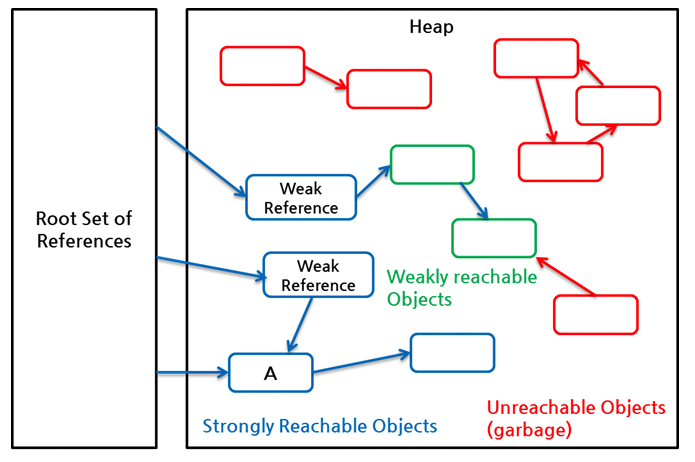

## Table of contents
{: .no_toc .text-delta }

1. TOC
{:toc}
---

[Garbage Collection 튜닝]: https://d2.naver.com/helloworld/37111
[Java Garbage Collection]: https://d2.naver.com/helloworld/1329
[Java Reference와 GC]: https://d2.naver.com/helloworld/329631
[ORACLE Java 8 Virtual Machine Specifications]: https://docs.oracle.com/javase/specs/jvms/se8/html/index.html
[Java (JVM) Memory Model – Memory Management in Java]: https://www.journaldev.com/2856/java-jvm-memory-model-memory-management-in-java
[Java GC 튜닝]: https://johngrib.github.io/wiki/java-gc-tuning/
[Minor GC - Eden에서 Survivor 영역으로]: https://johngrib.github.io/wiki/java-gc-eden-to-survivor/
[Java HotSpot VM Parallel Collector]: https://johngrib.github.io/wiki/java-gc-parallel-collector/

- **출처**
  - [Garbage Collection 튜닝][Garbage Collection 튜닝]
  - [Java Garbage Collection][Java Garbage Collection]
  - [Java Reference와 GC][Java Reference와 GC]
  - [ORACLE Java 8 Virtual Machine Specifications][ORACLE Java 8 Virtual Machine Specifications]
  - [Java (JVM) Memory Model – Memory Management in Java][Java (JVM) Memory Model – Memory Management in Java]
  - [Java GC 튜닝][Java GC 튜닝]
  - [Minor GC - Eden에서 Survivor 영역으로][Minor GC - Eden에서 Survivor 영역으로]
  - [Java HotSpot VM Parallel Collector][Java HotSpot VM Parallel Collector]
- 이 글은 위의 출처에서 각 내용을 발췌하여 작성하였습니다.

***

> 🖐 `stop-the-world`란?
> 
> **GC**를 실행하기 위해 **JVM**이 애플리케이션 실행을 멈추는 것이다.
> 
> `stop-the-world`가 발생하면 **GC를 실행하는 쓰레드를 제외한 나머지 쓰레드는 모두 작업을 멈춘다.**
> 
> **GC** 작업을 완료한 이후에야 중단했던 작업을 다시 시작한다.
> 
> **GC 튜닝**이란 이 `stop-the-world`시간을 줄이는 것이다.

# **General Garbage Collection 가비지 컬렉션 과정**
- 더 이상 필요없는 객체를 찾아 치우는 작업을 한다.
- 이 가비지 컬렉터는 두 가지 가정하에 만들어졌다.
  - **대부분의 객체는 금방 접근 불가능 상태 `unreachable`가 된다**
  - **오래된 객체에서 젊은 객체로의 참조는 아주 적게 존재한다.**
- 이 가정의 장점을 최대한 살리기 위해서 **HotSpot VM**에서는 크게 2개의 물리적 공간으로 나누었다.
- 추가로 JVM은 *보다 빠른 메모리 할당을 위해 두 가지 기술을 사용한다.* [Java Garbage Collection]참고



```
<----- Java Heap -----> <--------- Native Memory --------->
+------+----+----+-----+-----------+--------+--------------+
| Eden | S0 | S1 | Old | Metaspace | C Heap | Thread Stack |
+------+----+----+-----+-----------+--------+--------------+
```

## **Young Generation 영역**

- **새롭게 생성한 객체의 대부분이 여기에 위치한다.**
- 대부분의 객체가 금방 접근 불가능 상태가 되기 때문에 **매우 많은 객체가 `Young`영역에 생성되었다가 사라진다.**
- 이 영역에서 객체가 사라질 때 `Minor GC`가 발생한다고 말한다.
- `Eden` 영역 , `Survivor` 영역 2개로 구성되어 있다.

> 1. 새로 생성한 대부분의 객체는 `Eden`영역에 위치한다.
> 2. `Eden`영역에서 **GC**가 한 번 발생한 후 살아남은 객체는 `Survivor`영역 중 하나로 이동된다.
>   - `Eden`영역에서 **GC**가 발생하면 이미 살아남은 객체가 존재하는 `Survivor`영역으로 객체가 계속 쌓인다.
> 3. 하나의 `Survivor`영역이 가득차게 되면 그 중에서 살아남은 객체를 다른 `Survivor`영역으로 이동한다.
>   - 그리고 가득 찬 `Survivor`영역은 아무 데이터도 없는 상태로 된다.
> 4. 이 과정을 반복하다가 계속해서 살아남아 있는 객체는 `Old`영역으로 이동하게 된다.

- 위의 절차를 확인해 보면 알겠지만 `Survivor`영역 중 하나는 반드시 비어 있는 상태로 남아 있어야한다.
- 두 `Survivor`영역에 모두 데이터가 존재하거나 , 사용량이 0이라면 해당 시스템은 정상적인 상황이 아니다.

### `Eden` 에서 `Survivor` 영역으로

```
Eden
+---------------------------+
| ( ) (  ) (   ) ( ) (    ) |
+---------------------------+

Survivor 0              Survivor 1
+-------------------+   +-----------------+
| ( ) (   ) ( ) ( ) |   |                 |
+-------------------+   +-----------------+
```

- `Eden`과 `Survivor 0` 이 꽉 찬 상태이다.
- `Eden`이 꽉 찼으므로 **Minor GC**가 발생한다.
- JVM이 **Suspend 상태(Stop-the-world)로 들어간다.**
- 쓰레기와 쓰레기 아닌 것을 구분해야 하므로, `Mark` 작업을 시작한다.

```
Eden
+---------------------------+
| ( ) (  ) ( A ) ( ) (    ) |
+---------------------------+

Survivor 0              Survivor 1
+-------------------+   +-----------------+
| ( ) ( B ) (C) ( ) |   |                 |
+-------------------+   +-----------------+
```

- `Mark` 작업을 끝낸 결과, A, B, C가 쓰레기가 아니라는 표시를 달게 되었다.

```
Eden
+---------------------------+
| ( ) (  ) ( A ) ( ) (    ) |
+---------------------------+

Survivor 0              Survivor 1
+-------------------+   +-----------------+
| ( ) ( B ) (C) ( ) |   | ( A ) ( B ) (C) |
+-------------------+   +-----------------+
```

- A, B, C를 `Survivor 1` 영역으로 복사했다.

```
Eden
+---------------------------+
|                           |
+---------------------------+

Survivor 0              Survivor 1
+-------------------+   +-----------------+
|                   |   | ( A ) ( B ) (C) |
+-------------------+   +-----------------+
```

- `Eden`과 `Survivor 0` 을 깨끗하게 비워버린다.
- JVM의 **Suspend 상태가 해제된다.**

### `Survivor` 에서 `Old` 영역으로 **Promotion**

```
Eden
+---------------------------+
| ( ) (  ) (   ) (A) (    ) |
+---------------------------+

Survivor 0              Survivor 1
+-------------------+   +-------------------+
|                   |   | ( ) (   ) (B) (M) |
+-------------------+   +-------------------+

Old
+-------------------------------------------+
| (   ) (    )                              |
+-------------------------------------------+
```

- `Mark` 작업을 마친 후 위와 같은 상태가 되었다고 하자.
- `M`을 여러 차례의 **GC** 에서 살아남은 나이가 많은 객체라 하자.

```  
Eden
+---------------------------+
| ( ) (  ) (   ) (A) (    ) |
+---------------------------+

Survivor 0              Survivor 1
+-------------------+   +-------------------+
| (A) (B)           |   | ( ) (   ) (B) (M) |
+-------------------+   +-------------------+

Old
+-------------------------------------------+
| (   ) (    ) (M)                          |
+-------------------------------------------+
```

- `Survivor 0` 에 A, B가 복사되었다.
- `Old` 영역에 `M`이 복사되었다. **Promotion** 된 것이다.
- `Minor GC`에서 살아남아 `Survivor`로 이동할 때마다 객체의 **Age 가 증가**하는데, **이 Age가 일정 이상이 되면 Old 영역으로 이동하게 된다.**
- `Promotion`의 기준이 되는 **Age는 `-XX:MaxTenuringThreshold` 옵션으로 설정할 수 있다.**
  - Java SE 8 에서의 default 값은 **15** 이다. 설정 가능한 범위는 0 ~ 15.1

```
Eden
+---------------------------+
|                           |
+---------------------------+

Survivor 0              Survivor 1
+-------------------+   +-------------------+
| (A) (B)           |   |                   |
+-------------------+   +-------------------+

Old
+-------------------------------------------+
| (   ) (    ) (M)                          |
+-------------------------------------------+
```

- Eden과 Survivor 1 이 깨끗하게 비워진다.

### `Old`영역에 있는 객체가 `Young`영역의 객체를 참조하는 경우에는 어떻게 될까?



- 이러한 경우의 처리를 위해 `Old`영역에는 512바이트의 덩어리(chunk)로 되어 있는 **카드 테이블**이 존재한다.
- **카드 테이블**에는 `Old`영역에 있는 객체가 `Young`영역의 객체를 참조할 때 마다 정보가 표시된다.
- `Young`영역의 **GC**를 실행할 때에는 `Old`영역에 있는 모든 객체의 참조를 확인하지 않고 , 이 **카드 테이블만 뒤져서 GC 대상인지 식별한다.**

## **Old Generation 영역**

- **접근 불가능 상태로 되지 않아 `Young`영역에서 살아남은 객체가 여기로 복사된다.**
- 대부분 `Young`영역보다 크게 할당하며 , **크기가 큰 만큼 `Young`영역보다 GC는 적게 발생한다.**
- 이 영역에서 객체가 사라질 때 `Major GC` 혹은 `Full GC`가 발생한다고 말한다.
  - JAVA7 까지의 `Permanent Generation` (`Method Area`라고도 한다.) 영역도 `Full GC`의 대상이된다.

### [JDK 8에서 사용 가능한 GC종류](https://docs.oracle.com/javase/8/docs/technotes/guides/vm/gctuning/collectors.html#sthref27)

- **Serial GC** `-XX:+UseSerialGC`
  - **적은 메모리와 CPU 코어 개수가 적을 때 적합한 방식이다.**
  - `Old`영역의 **GC**는 `mark-sweep-compact`라는 알고리즘을 사용한다.
  - 이 알고리즘의 첫 단계는 `Old`영역에 살아 있는 객체를 식별하는 것이다. *mark*
  - 그 다음에는 **힙**부분의 앞 부분부터 확인하여 살아 있는 것만 남긴다. *sweep*
  - 마지막 단계에서는 각 객체들이 연속되게 쌓이도록 힙의 가장 앞 부분부터 채워서 객체가 존재하는 부분과 객체가 없는 부분으로 나눈다. *compaction*
- [**Parallel GC** `-XX:+UseParallelGC` - Default](https://docs.oracle.com/javase/8/docs/technotes/guides/vm/gctuning/parallel.html#CHDCFBIF)
  - **메모리가 충분하고 , 코어의 개수가 많을 때 유리하다.** `Throughput GC`라고도 부른다.
  - **Serial GC**와 기본적인 알고리즘은 같다.
  - 그러나 **Serial GC**는 **GC**를 처리하는 스레드가 하나인 것에 비해 , **Parallel GC**는 스레드가 여러 개 이다.



- [**CMS collector** `-XX:+UseConcMarkSweepGC`](https://docs.oracle.com/javase/8/docs/technotes/guides/vm/gctuning/cms.html#concurrent_mark_sweep_cms_collector)
- [**G1 GC** `-XX:+UseG1GC`](https://docs.oracle.com/javase/8/docs/technotes/guides/vm/gctuning/g1_gc.html#garbage_first_garbage_collection)

***

# **GC와 Reachability**

- **Java GC**는 객체가 가비지인지 판별하기 위해서 `reachability`라는 개념을 사용한다.
- 어떤 객체에 유효한 참조가 있으면 `reachable`로 , 없으면 `unreachable`로 구별한다.
- **`unreachable` 객체를 가비지로 간주해 GC를 수행한다**
- 객체들은 참조 사슬을 이루며 , 유효한 참조 여부를 파악하려면 항상 **유효한 최초의 참조가 있어야 하는데 이를 객체 참조의 `root set`이라고 한다.**



- `Heap`에 있는 객체들에 대한 참조는 다음 4가지 종류 중 하나이다.
  1. `Heap`내의 다른 객체에 의한 참조
  2. `Java Stack` , 즉 `Java`메서드 실행 시에 사용하는 지역 변수와 파라미터들에 의한 참조
  3. `Native Stack` , 즉 **JNI(Java Native Interface)**에 의해 생성된 객체에 대한 참조
  4. 메서드 영역의 정적 변수에 의한 참조
- 이들 중 `"힙 내의 다른 객체에 의한 참조"`를 제외한 나머지 3개가 `root set`으로 , `reachability`
를 판가름 하는 기준이 된다.



- 참조 사슬과 무관한 객체들이 `unreachable` 객체로 **GC**대상이다.
- 위의 참조는 모두 `java.lang.ref`패키지를 사용하지 않은 일반적인 참조이며 , 이를 흔히 **Strong Reference**라 부른다.

## **Soft , Weak , Phantom Reference**
- `java.lang.ref`는 **soft reference**와 **weak reference**, **phantom reference**를 클래스 형태로 제공한다.
- 이 3가지 클래스에 의해 생성된 객체를 `reference object`라고 부른다.
  - 이 `reference object`에 의해 참조된 객체는 `referent`라고 부른다.

```java
  WeakReference<Sample> wr = new WeakReference<Sample>(new Sample());  
  Sample ex = wr.get();  
  ...
  ex = null;  
```

- `new WeakReference()` 생성자로 생성된 객체는 `reference object`
- `new Sample()` 생성자로 생성된 객체는 `referent`이다.

## **Reference와 Reachability**
- 사용자 코드에서는 **GC 대상 여부**를 관여할 수 없었다.
- 그러나 `java.lang.ref` 패키지를 이용하면 `reachable`객체들을 **strongly reachable**, **softly reachable** , **weakly reachable** , **phantomly reachable**로 더 자세히 구별하여 **GC 대상 여부**를 판별하는 부분에 **사용자 코드가 개입할 수 있게 되었다.**



- **GC**가 동작할 때 `unreachable`객체 뿐만 아니라 **`weakly reachable`객체도 가비지 객체로 간주되어 메모리에서 회수된다.**
- `root set`으로부터 시작된 참조 사슬에 포함되어 있음에도 불구하고 **GC**가 동작할 때 회수된다.
  - `A`객체는 **strongly reachable** 객체이다.


- ... 여기까지 **GC 대상 여부**를 판별하는 부분에 **사용자 코드가 개입할 수 있다는 것**만 확인하자
- 추가적인 내용은 [Java Reference와 GC][Java Reference와 GC]