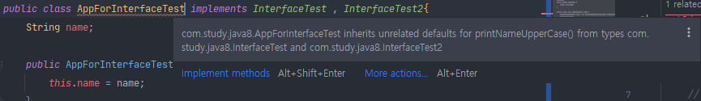
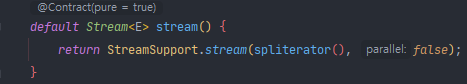

## Table of contents
{: .no_toc .text-delta }

1. TOC
{:toc}
---

# **인터페이스**

## **기본 메서드 (Default Methods)**
-   **인터페이스에 메서드 선언이 아니라 구현체를 제공하는 방법**
-   **해당 인터페이스를 구현한 클래스를 깨뜨리지 않고 새 기능을 추가할 수 있다.**
-   **기본 메서드는 구현체가 모르게 추가된 기능으로 그만큼 리스크가 있다.**
    -   컴파일 에러는 아니지만 구현체에 따라 런타임 에러가 발생할 수 있다.
    -   <span style="color:red; font-weight:bold">반드시 문서화 할 것</span>**(@implSpec 자바독 태그 사용 , 자바8에서 추가되었음)**

-    <span style="color:red; font-weight:bold">Object가 제공하는 기능 (equals , hashCode , toString 등등..)은 기본 메서드로 제공 할 수 없다.</span>
    -   **구현체를 재정의 해야 한다.**
-   **본인이 수정할 수 있는 인터페이스 에만 기본 메서드를 제공할 수 있다.**
-   **인터페이스를 상속받는 인터페이스에서 다시 추상 메서드로 변경할 수 있다.**
-   **인터페이스 구현체가 재정의 할 수도 있다.**

```java
public interface InterfaceTest {
    void printName();
    String getName();
//    void printNameUpperCase();

    /**
     * @implSpec 이 구현체는 getName()으로 가져온 문자열을 대문자로 바꿔 출력한다.
     */
    default void printNameUpperCase(){
        System.out.println("print name Upper case : " + getName().toUpperCase());
    }

//    void printNameUpperCase(); 를 추상메서드로 추가하게 되면
//    이 인터페이스를 구현하고있는 구현체를 다 수정하여야 하는 번거로움이 생긴다.

//    인터페이스에 메서드를 default를 선언하고 로직(바디)을 작성해 놓으면
//    이 인터페이스를 구현하는 구현체는 default 메서드를 쓸 수 있다.
}
```

```java
public interface InterfaceTest2 extends InterfaceTest{

    // 추상 메서드를 재정의 하지 않으면 InterfaceTest에서 제공하는
    // printNameUpperCase 구현체가 제공된다.
    // 만약, 재정의 하지 않고 InterfaceTest2를 구현하게 되어도
    // 그 구현체는 InterfaceTest의 printNameUpperCase의 메서드를 사용할 수 있다.
    void printNameUpperCase();
}
```

```java
public class AppForInterfaceTest implements InterfaceTest{
    String name;

    public AppForInterfaceTest(String name) {
        this.name = name;
    }

    @Override
    public void printName() {
        System.out.println("print name : " + this.name);
    }

    @Override
    public String getName() {
        return this.name;
    }

    @Override
    public void printNameUpperCase() {
        System.out.println("(Override)print name Upper case : " + getName().toUpperCase());
    }

    public static void main(String[] args) {
        AppForInterfaceTest test = new AppForInterfaceTest("Today 2021-01-10");
        test.printName();
        test.printNameUpperCase();

//        출력
//        print name : Today 2021-01-10
//        print name Upper case : TODAY 2021-01-10
//        (Override)print name Upper case : TODAY 2021-01-10
    }
}
```

**만약 InterfaceTest와 InterfaceTest2(extends InterfaceTest걷어낸 후)에서**

**동일한 default printNameUpperCase를 구현하면 ??**


✅ **AppForInterfaceTest는 2개의 인터페이스를 구현하는데 ,2개 중에 무슨 printNameUpperCase를 써야하는지 모르기 때문에 컴파일 에러가 발생한다.**
{: .fh-default .fs-4 }

***

## **스태틱 메서드 (Static Methods)**


✅ **해당 타입 관련 헬퍼 또는 유틸리티 메서드를 제공할 때 인터페이스 스태틱 메서드를 제공할 수 있다.**
{: .fh-default .fs-4 }

```java
public interface InterfaceTest {
    void printName();
    String getName();

    /**
     * @implSpec 이 구현체는 getName()으로 가져온 문자열을 대문자로 바꿔 출력한다.
     */
    default void printNameUpperCase(){
        System.out.println("print name Upper case : " + getName().toUpperCase());
    }

    static void printAnything(){
        System.out.println("Interface Test");
    }

}
```

```java
public class AppForInterfaceTest implements InterfaceTest{
    String name;

    public AppForInterfaceTest(String name) {
        this.name = name;
    }

    @Override
    public void printName() {
        System.out.println("print name : " + this.name);
    }

    @Override
    public String getName() {
        return this.name;
    }

    public static void main(String[] args) {
        InterfaceTest.printAnything();

        // 출력
        // Interface Test
    }
}
```

***

# **JAVA8 에서 추가한 기본 메서드로 인한 API 변화**

## **Iterable의 기본 메서드**

-   **forEach()**
-   **spliterator()**

```java
    public static void main(String[] args) {
        ArrayList<String> strList = new ArrayList<>();
        strList.add("test1");
        strList.add("test2");
        strList.add("test3");
        strList.add("test4");
        strList.add("test5");

        //strList.forEach(Consumer<? super String> action)
        strList.forEach((s) ->{
            System.out.println("forEach : " + s);
        });

        //메서드 레퍼런스
        strList.forEach(System.out::println);

//        출력
//        forEach : test1
//        forEach : test2
//        forEach : test3
//        forEach : test4
//        forEach : test5
//        test1
//        test2
//        test3
//        test4
//        test5


        // 쪼갤수 있는 기능을 가진 iterator
        Spliterator<String> spliterator = strList.spliterator();
        // List를 Spliterator로 변환한 것을 절반으로 나눈다.
        Spliterator<String> spliterator1 = spliterator.trySplit();
        Spliterator<String> spliterator2 = spliterator.trySplit();

        // hasNext가 아닌 tryAdvance
        while(spliterator.tryAdvance(System.out::println));
        System.out.println("=============================");
        while(spliterator1.tryAdvance(System.out::println));
        System.out.println("=============================");
        while(spliterator2.tryAdvance(System.out::println));

//        출력 (spliterator가 2개일 때)
//        test3
//        test4
//        test5
//        =============================
//        test1
//        test2

//        출력 (spliterator가 3개일 때)
//        test4
//        test5
//        =============================
//        test1
//        test2
//        =============================
//        test3
    }
```

## **Collection의 기본 메서드**

-   **stream() / parallelStream()**
    -   stream()
        -   자원들을 스트림으로 만들어 functional하게 처리 가능하다.
        - 
        - ✅ spliterator를 사용하고 있다
-   **removeIf(Predicate)**
-   **spliterator()**

```java
        ArrayList<String> strList2 = new ArrayList<>();
        strList2.add("test1");
        strList2.add("test2");
        strList2.add("test3");
        strList2.add("test3");
        strList2.add("test4");

        long cnt = strList2.stream().map(String::toUpperCase)
                            .filter(s -> s.endsWith("3"))
                            .count();
        System.out.println(cnt);

        // 출력
        // 2

        strList2.removeIf(s -> s.endsWith("4"));
        strList2.forEach(System.out::println);

//        출력
//        test1
//        test2
//        test3
//        test3
```

## **[Comparator](https://tourspace.tistory.com/9)의 기본 메서드 및 스태틱 메서드**

-   **reversed()**
-   **thenComparing()**
-   **(static) reverseOrder()  / naturalOrder()**
-   **(static) nullsFirst() / nullsLast()**
-   **(static) comparing()**

```java
       ArrayList<String> strList3 = new ArrayList<>();
        strList3.add("test1");
        strList3.add("tEst2");
        strList3.add("teSt3");
        strList3.add("TEST3");
        strList3.add("TesT4");

        // compareToIgnoreCase - 대소문자 무시
        strList3.sort(String::compareToIgnoreCase);
        strList3.forEach(System.out::println);

        System.out.println("=============================");

        Comparator<String> compareToIgnoreCase = String::compareToIgnoreCase;
        strList3.sort(compareToIgnoreCase.reversed());
        strList3.forEach(System.out::println);

//        출력
//        test1
//        tEst2
//        teSt3
//        TEST3
//        TesT4
//        =============================
//        TesT4
//        teSt3
//        TEST3
//        tEst2
//        test1
```

## **참고**

[https://docs.oracle.com/javase/8/docs/api/java/util/Spliterator.html](https://docs.oracle.com/javase/8/docs/api/java/util/Spliterator.html)
[https://docs.oracle.com/javase/8/docs/api/java/lang/Iterable.html](https://docs.oracle.com/javase/8/docs/api/java/lang/Iterable.html)
[https://docs.oracle.com/javase/8/docs/api/java/util/Collection.html](https://docs.oracle.com/javase/8/docs/api/java/util/Collection.html)
[https://docs.oracle.com/javase/8/docs/api/java/util/Comparator.html](https://docs.oracle.com/javase/8/docs/api/java/util/Comparator.html)
