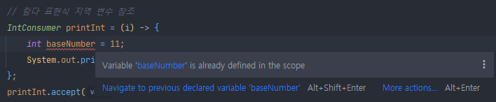
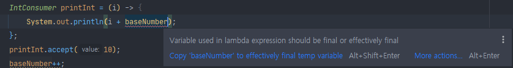
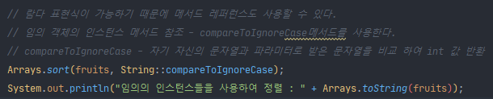

## Table of contents
{: .no_toc .text-delta }

1. TOC
{:toc}
---

# **함수형 인터페이스 (Functional Interface)**
-   <span style="color:red; font-weight:bold">추상 메서드를 딱 하나만</span>**가지고 있는 인터페이스**
-   **SAM (Single Abstract Method) 인터페이스**
-   **[default , static 메서드가](https://atoz-develop.tistory.com/entry/JAVA-8-interface-default-%ED%82%A4%EC%9B%8C%EB%93%9C%EC%99%80-static-%EB%A9%94%EC%86%8C%EB%93%9C) 사용 가능하다.**
    -   static은 재정의가 불가하지만 default는 재정의가 가능하다.

```java
// 추상화 메소드가 딱 1개라면 함수형 인터페이스 이다.
// 이 규칙을 위반하면 애노테이션에서 컴파일 에러가 발생한다.
@FunctionalInterface
public interface RunSomething {
    void doIt();
    static void printTestA(){
        System.out.println("테스트A");
    }
    default void printTestB(){
        System.out.println("테스트B");
    }
}
```

***

# **람다 표현식 (Lambda Expressions)**
-   **함수형 인터페이스의 인스턴스를 만드는 방법으로 쓰일 수 있다.**
-   **코드를 줄일 수 있다.**
-   **메서드 매개변수 , 리턴 타입 , 변수로 만들어 사용할 수도 있다.**
-   **(인자 리스트) ➜ {바디}**

```java
public static void main(String[] args) {

    // 익명 내부 클래스  anonymous inner class
    RunSomething runSomething = new RunSomething() {
        @Override
        public void doIt() {
            System.out.println("익명 내부 클래스!");
        }
    };

    // 함수형 인터페이스 라면 , 추상 메서드가 한 개라면
    // ALT + SHIFT + ENTER 사용 시 람다 표현식으로 변경 가능하다. (인텔리제이)
    RunSomething runSomething2 = () -> {
        System.out.println("함수형 인터페이스!");
    };
    runSomething2.doIt();
}
```

## **인자 리스트**

-   **인자가 없을 때 : ()**
-   **인자가 한 개 일 때 : (one) 또는 one**
-   **인자가 여러 개 일 때 : (one , two)**
-   **인자의 타입은 생략 가능 , 컴파일러가 추론 (infer) 하지만 명시할 수도 있다. (Integer one , Integer two)**

## **바디**

-   **화살표 오른쪽에 함수 본문을 정의한다.**
-   **여러 줄인 경우에 {}를 사용해서 묶는다.**
-   **한 줄인 경우에 생략 가능 , return도 생략 가능**

## **변수 캡처 (Variable Capture)**

-   **로컬 변수 캡처**
    -   **final 이거나 effective final 인 경우에만 참조할 수 있다.**
    -   **그렇지 않을 경우 concurrency(동시성) 문제가 생길 수 있어서 컴파일러가 방지한다.**
-   **effective final**
    -   **이것도 역시 자바 8 부터 지원하는 기능으로 "사실상" final인 변수이다.**
    -   **final 키워드를 사용하지 않은 변수를 익명 클래스 구현체 또는 람다에서 참조할 수 있다.**
-   **람다 표현식은 익명 클래스 구현체와 달리 "쉐도윙" 하지 않는다.**
    -   <span style="color:red; font-weight:bold">익명 클래스는 새로 scope(범위)를 만들지만 , 람다는 람다를 감싸고 있는 scope(범위)와 같다.</span>

```java
private void run(){
  // final 없어도 참조가 가능하다.
  // final 없지만 어디에서도 이 변수를 수정하지 않는 것 (사실상 final - effective final)
  int baseNumber = 10;

  // 쉐도윙
  // Foo class -> run method -> 람다 , 익명 클래스 , 내부 클래스
  // 내부 클래스 , 익명 클래스 - 쉐도윙이 일어난다.
  // 람다 - 쉐도윙이 일어나지 않는다.

  // 람다 표현식 지역 변수 참조
  IntConsumer printInt = (i) -> {
      int baseNumber = 11;
      System.out.println(i + baseNumber);
  };
  printInt.accept(10);


  // 익명 클래스에서 지역 변수 참조
  Consumer<Integer> test2 = new Consumer<Integer>() {
      @Override
      public void accept(Integer integer) {
          int baseNumber = 12;
          System.out.println(baseNumber);
      }
  };

  // 내부(로컬) 클래스에서 지역 변수 참조
  class LocalClass{
      void printBaseNumber(){
          int baseNumber = 13;
          System.out.println(baseNumber);
      }
  }
}
```
✅ **람다 scope 안의 int baseNumber = 11;은 컴파일 에러가 난다. (쉐도윙이 일어나지 않는다.)**
{: .fh-default .fs-4 }


-  **scope가 동일하여 동일한 변수가 2개 선언되었기 때문에**
-   **람다 표현식의 scope(범위)와 메소드의 scope가 동일하다.**
-   **scope가 동일하기 때문에 baseNumber가 변경된다면 컴파일 에러가 발생한다.**


-   **하지만 익명 클래스와 내부 클래스는 쉐도윙이 일어난다.**
    -   **익명 클래스와 내부 클래스에서 선언된 baseNumber가 run 메소드의 baseNumber를 덮어 버린다.**
***

# **자바에서 함수형 프로그래밍**
-   **함수를 First class object로 사용할 수 있다.**
    -   [**First class object란?**](https://medium.com/@lazysoul/functional-programming-%EC%97%90%EC%84%9C-1%EA%B8%89-%EA%B0%9D%EC%B2%B4%EB%9E%80-ba1aeb048059)
        -   변수나 데이터에 할당할 수 있어야 한다.
        -   객체의 인자로 넘길 수 있어야 한다.
        -   객체의 리턴값으로 리턴할 수 있어야한다.
-   **순수 함수 (Pure function)**
    -   사이드 이펙트가 없다. (함수 밖에 있는 값을 변경하지 않는다.)
    -   상태가 없다. (함수 밖에 있는 값을 사용하지 않는다.)
-   **고차 함수 (Higher-Order Function)**
    -   함수가 함수를 매개변수로 받을 수 있고 함수를 리턴할 수도 있다.
-   **불변성**

```java
public static void main(String[] args) {

    int base1 = 10;
    RunSomething runSomething = new RunSomething() {
        int base2 = 10;
        @Override
        public int doIt(int number) {
            base1++;
            base2++;
            return number + base1 + base2;
        }
    };
}
```
-   **`base1` 부분은 컴파일 에러가 발생된다.**
-   **`base2` 부분은 `base1`을 걷어낸다면 컴파일 에러가 나지는 않지만 순수한 함수라고 볼 수 없다.**

***

# **JAVA에서 제공하는 함수형 인터페이스**

✅ **[Java.lang.function](https://docs.oracle.com/javase/8/docs/api/java/util/function/package-summary.html) 패키지**
{: .fh-default .fs-4 }
✅ **자바에서 미리 정의해둔 자주 사용할만한 함수 인터페이스**
{: .fh-default .fs-4 }

## **`Function< T , R >`**
-   **항상 입력 인수를 반환하는 함수를 반환**
    -   (static) identity
-   **T 타입을 받아서 R 타입을 리턴하는 함수 인터페이스**
    -   R  apply(T t)
-   **함수 조합용 메서드**
    -   (default) andThen
    -   (default) compose

```java
public class FunctionTest implements Function<Integer , Integer> {
    @Override
    public Integer apply(Integer integer) {
        return integer + 100;
    }
}
```

```java
public static void main(String[] args) {

    // 객체 생성
    FunctionTest test1 = new FunctionTest();
    System.out.println("객체 생성 : " + test1.apply(10));

    // 람다 표현식
    Function<Integer , Integer> add = (i) -> i + 10;
    System.out.println("람다 표현식 (더하기) : " + add.apply(10));
    Function<Integer , Integer> multi = (i) -> i * 20;
    System.out.println("람다 표현식 (곱하기) : " + multi.apply(10));

    // 곱하기를 수행한 후 더하기를 수행한 값을 리턴한다.
    // 10 * 20 + 10
    Function<Integer , Integer> compose = add.compose(multi);
    System.out.println("람다 표현식 (compose) : " + compose.apply(10));

    // 더하기를 수행 한 후 곱하기를 수행한 값을 리턴한다.
    // 10 + 10 * 20
    Function<Integer , Integer> andThen = add.andThen(multi);
    System.out.println("람다 표현식 (andThen) : " + andThen.apply(10));

//        출력
//        객체 생성 : 110
//        람다 표현식 (더하기) : 20
//        람다 표현식 (곱하기) : 200
//        람다 표현식 (compose) : 210
//        람다 표현식 (andThen) : 400
}
```

## **`BiFunction<T , U , R>`**
-   **두 개의 값(T , U)를 받아 R 타입을 리턴하는 함수 인터페이스**
    -   R apply(T t , U u)
-   함수 조합용 메서드
    -   (default) andThen
        -   return (T t, U u) ➜ after.apply(apply(t, u));

## **`Consumer<T>`**
-   **T 타입을 받아서 아무 값도 리턴하지 않는 함수 인터페이스**
    -   void accept(T t)
-   함수 조합용 메서드
    -   (default) andThen

## **`Supplier<T>`**
-   **T 타입의 값을 제공하는 함수 인터페이스**
    -   T get()
```java
public static void main(String[] args) {
    Supplier<Integer> get = () -> 1;
    System.out.println(get.get());

    // 출력
    // 1
}
```

## **`Predicate<T>`**
-   **T 타입을 받아서 boolean을 리턴하는 함수 인터페이스**
    -   boolean test(T t)
-   함수 조합용 메서드
    -   And
    -   Or
    -   Negate (Not)

```java
public static void main(String[] args) {
    Predicate<String> startsWithTis = (s) -> s.startsWith("t");
    Predicate<Integer> isEven = (s) -> s%2 == 0;
    System.out.println("startsWithTis : " + startsWithTis.test("istory"));
    System.out.println("isEven : " + isEven.test(10));
    System.out.println("isEven (negate) : " + isEven.negate().test(10));
//        출력
//        startsWithTis : false
//        isEven : true
//        isEven (negate) : false
}
```

## **`UnaryOperator<T>`** `extends Function<T , T>`
-   **Function<T , R> 의 특수한 형태로 , 입력 값 하나를 받아서 동일한 타입을 리턴하는 함수 인터페이스**

```java
public static void main(String[] args) {
    UnaryOperator<Integer> add = (i) -> i + 10;
    System.out.println("UnaryOperator (더하기) : " + add.apply(10));
    UnaryOperator<Integer> multi = (i) -> i * 20;
    System.out.println("UnaryOperator (곱하기) : " + multi.apply(10));

//        출력
//        UnaryOperator (더하기) : 20
//        UnaryOperator (곱하기) : 200
}
```

## **`BinaryOperator<T>`** `extends BiFunction<T , T , T>`
-   **BiFunction<T , U , R>의 특수한 형태로 , 동일한 타입의 입력 값 두 개를 받아 리턴하는 함수 인터페이스**
-   **BiFunction 3개의 인자 값이 다 같다면 한 개로 줄여서 사용할 수 있다.**

## ✋ **upper , lower bounded**

**<? extends T>**
T와 그 자손 타입만 가능(upper bound)

**<? super T>**
T와 그 조상 타입만 가능(lower bound)

**<?>**
제한 없이 모든 타입이 가능. <? extneds Object>와 동일한 표현


***
# **메서드 레퍼런스**

✅ **람다가 하는 일이 기존 메서드 또는 생성자를 호출하는 거라면 , 메서드 레퍼런스를 사용해서 매우 간결하게 표현할 수 있다.**
{: .fh-default .fs-4 }

## **메서드 참조방법**

-   **스태틱 메서드 참조**
    -   타입::스태틱 메서드
-   **특정 객체의 인스턴스 메서드 참조**
    -   객체 레퍼런스::인스턴스 메서드
-   **임의 객체의 인스턴스 메서드 참조**
    -   타입::인스턴스 메서드
-   **생성자 참조**
    -   타입::new
-   **메서드 또는 생성자의 매개변수로 람다의 입력값을 받는다.**
-   **리턴값 또는 생성한 객체는 람다의 리턴값이다.**

## 📌 **예제**

```java
public static void main(String[] args) {

    // 인스턴스를 자세히 봐야 한다.

    // 스태틱 메서드 참조
    UnaryOperator<String> hi = Greeting::hi;
    String strHi = hi.apply("2021-01-10");
    System.out.println("스태틱 메서드 참조 : " + strHi);


    // 특정 객체의 인스턴스 메서드 참조
    Greeting greeting = new Greeting();
    UnaryOperator<String> hello = greeting::hello;
    String strHello = hello.apply("2021-01-10");
    System.out.println("특정 객체의 인스턴스 메서드 참조 : " + strHello);


    String[] fruits = {"banana" , "grape" , "apple" };
    // JAVA8 부터 Comparator 도 함수형 인터페이스 이다. (compare 메서드)
    // 람다 표현식으로 변경 가능
    Arrays.sort(fruits, new Comparator<String>() {
        @Override
        public int compare(String o1, String o2) {
            return 0;
        }
    });
    //람다 표현식
    Arrays.sort(fruits, (o1, o2) -> 0);

    // 람다 표현식이 가능하기 때문에 메서드 레퍼런스도 사용할 수 있다.
    // 임의 객체의 인스턴스 메서드 참조 - compareToIgnoreCase메서드를 사용한다.
    // compareToIgnoreCase - 자기 자신의 문자열과 파라미터로 받은 문자열을 비교 하여 int 값 반환
    Arrays.sort(fruits, String::compareToIgnoreCase);
    System.out.println("임의의 인스턴스들을 사용하여 정렬 : " + Arrays.toString(fruits));


    // 생성자 참조 (문자열을 받는)
    Function<String , Greeting> newFunction = Greeting::new;
    Greeting newGreeting1 = newFunction.apply("2021-01-10");
    System.out.println("생상자 참조(문자열을 받는) : " + newGreeting1.getName());


    // 기본 생성자 참조 (문자열을 받지 않는)
    Supplier<Greeting> newSupplier = Greeting::new;
    Greeting newGreeting2 = newSupplier.get();
    System.out.println("생성자 참조(문자열을 받지 않는) : " + newGreeting2.getName());
}
```


[이 부분이 잘 이해가 되지 않을 때](https://imcts.github.io/java-method-reference/)


**참고**
- [Method References (The Java™ Tutorials > Learning the Java Language > Classes and Objects)](https://docs.oracle.com/javase/tutorial/java/javaOO/methodreferences.html)
