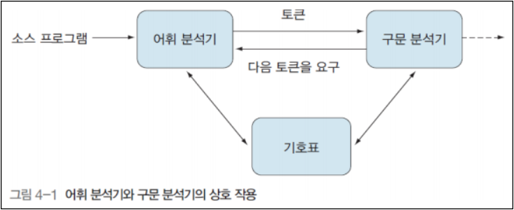
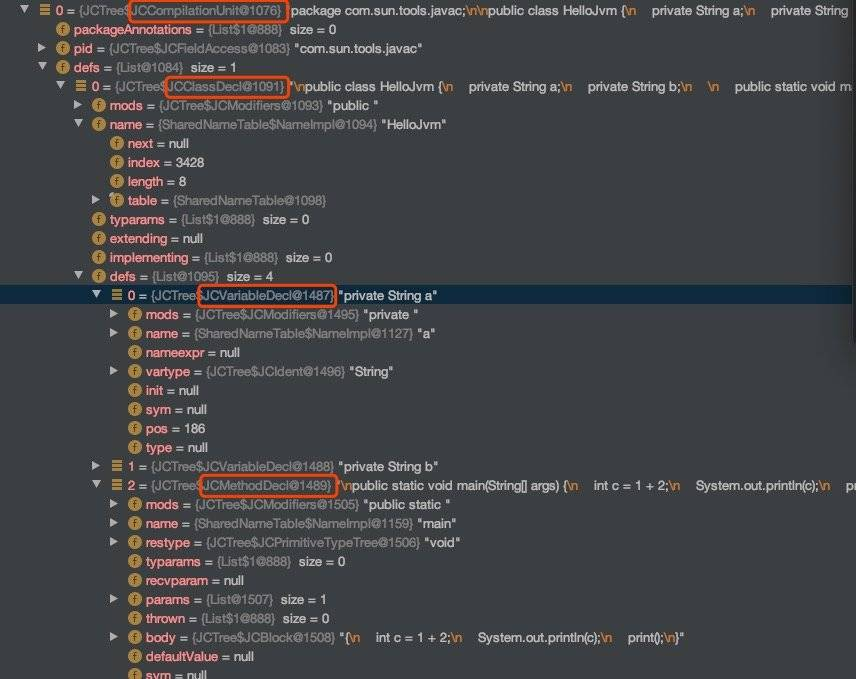

## Table of contents
{: .no_toc .text-delta }

1. TOC
{:toc}

---

## **javac의 원리**
- **추상 구문 트리**까지만 알아보자
- javac의 컴파일 과정은 실제 Java로 작성되어 있다.
- **컴파일 과정은 크게 세 단계로 나뉜다.**
- 참고
  - [juejin.cn](https://juejin.cn/post/6844904082084233223)
  - [kwangsiklee.com](http://www.kwangsiklee.com/2018/06/%EC%BB%B4%ED%8C%8C%EC%9D%BC%EB%9F%AC-%EA%B0%95%EC%9D%98-4-%EC%BB%B4%ED%8C%8C%EC%9D%BC%EB%9F%AC%EC%9D%98-%EC%96%B4%ED%9C%98%EB%B6%84%EC%84%9D/)
  - [homoefficio.github.io](https://homoefficio.github.io/2019/01/31/Back-to-the-Essence-Java-%EC%BB%B4%ED%8C%8C%EC%9D%BC%EC%97%90%EC%84%9C-%EC%8B%A4%ED%96%89%EA%B9%8C%EC%A7%80-1/)

> ✋  **추상 구문 트리**
> 


### **구문 분석 및 심볼 테이블 채우기**


**어휘 분석 및 문법 분석**
{: .fh-default .fs-4 }

- 이 단계는 구문 분석 및 채우기를 포함한  두 단계로 , 구문 분석은 **어휘 분석**과 **문법 분석**의 두 단계로 나뉜다.
  - **어휘 분석 (Lexical Analysis)**
    - 소스 코드에서 문자 단위로 읽어 어휘소(Lexeme)를 식별하고 어휘소를 설명하는 토큰 스트림을 생성한다.
    - 어휘소는 식별가능한 문자 시퀀스인데 다음과 같은 것들을 통칭한다.
      - 키워드(keywords): `public`, `class`, `main`, `for` 등
      - 리터럴(literals): `1L`, `2.3f`, `"Hello"` 등
      - 식별자(identifiers): 변수 이름, 상수 이름, 함수 이름 등
      - 연산자(operators): `+,` `-` 등
      - 구분 문자(punctuation characters): `,`, `[]`, `{}`, `()` 등
    - 예를 들어 Java `int a = b+2`에서 이 코드는 `Token` 각각 6개의 태그를 나타낸다.
    - `int , a , = , b , + 2` 키워드 `int`는 3개의 문자로 구성 되어 있지만 토큰 일 뿐이며 분할할 수 없다.
    - 토큰(Token)은 타입(키워드, 리터럴, 식별자 등)과 값(`public`, `1L`, `main` 등)으로 구성되며 어휘소를 설명하는 객체로 볼 수 있다.
    - 식별자 토큰은 어휘 분석 단계에서 **심볼 테이블**에 저장되고 이후 단계에서 계속 사용된다.
  - **구문 분석 (Syntax Analysis)**
    - 구문 분석기, 파서(Parser)라고도 한다.
    - 어휘 분석 결과로 나온 토큰 스트림이 언어의 스펙으로 정해진 문법 형식에 맞는지 검사한다.
      - `맞지 않으면 컴파일 에러를 내고 , 맞으면 추상 구문 트리를 생성한다.`
    - **토큰 시퀀스에 따라 추상 객체 트리를 구성하는 프로세스 이다.**
    - **추상 구문 트리**는 코드의 구문 구조를 설명하는데 사용 되는 트리 표현 방법이다.
    - 구문 트리의 각 노드는 프로그램 코드를 나타낸다.
    - 문법 구조 패키지 , 유형 , 수정자 , 연산자 , 인터페이스 , 반환 값 및 코드 주석
    - `JCTree`를 사용하여 트리 구조의 구문 분석, 하위 클래스가 무엇인 지 볼 수 있다.

```java
public class HelloJvm{

    private String a;
    private String b;
    public static void main( String[] args ) {

        int c = 1+2;
        System.out.println(c);
        print();
    }
    private static void print(){

    }
}
```
- 이것들이 모두 `JCTree`의 하위 범주라는 것을 알 수 있다.
- 트리가 `JCComilationUnit` 루트 노드의 컴파일이라는 것을 알 수 있다.
- 클래스 메서드 , 변수 , 클래스 범주와 같은 구성요소를 트리로 구성한다.



<br>

**심볼 테이블 채우기**
{: .fh-default .fs-4 }

- **문법 분석**과 **어휘 분석**을 마친 후 다음 단계는 심볼 테이블을 채우는 과정이다.
- **심볼 테이블**은 **기호 주소**와 , **기호 정보**의 집합으로 구성된 표이다.
- 심볼 테이블은 해시 표 , 순서가 지정된 심볼 테이블 , 트리 심볼 테이블 , 스택 구조 심볼 테이블 등 일 수 있다.
- 심볼 테이블에 등록된 정보는 컴파일의 여러 단계에서 사용되며 , **의미 분석**에서 심볼 표에 등록 된 내용은 의미 검사에 사용된다.

### **주석 처리**
- 심볼 테이블을 구문 분석하고 채우는 첫 번째 단계가 완료된 후 다음 단계는 어노테이션 프로세서이다.
- <span style="color:red; font-weight:bold">이 단계가 롬복의 핵심이다.</span>
- JDK1.5 이후 어노테이션을 지원하며 , 이러한 어노테이션은 일반 Java코드와 동일하며 런타임중에 역할을 수행한다.
- **JDK1.6 이후 컴파일 중에 어노테이션을 처리하기 위해 어노테이션 프로세서에 대한 표준 API가 제공 된다.**
  - [`java docs` javax.annotation.processing](https://docs.oracle.com/javase/8/docs/api/javax/annotation/processing/Processor.html)
- **추상 구문 트리**의 모든 요소를 읽고 , 수정하고 , 추가할 수 있다.
  
### **분석 및 바이트 코드 생성**
- ...
