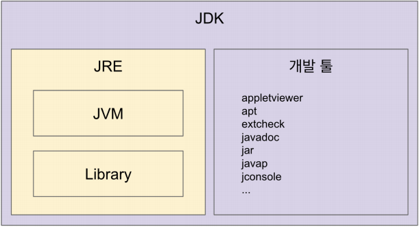
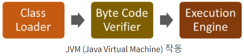
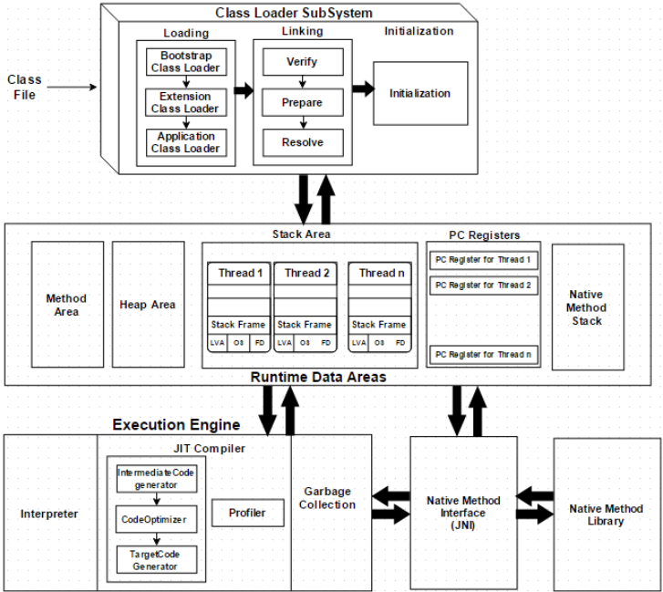
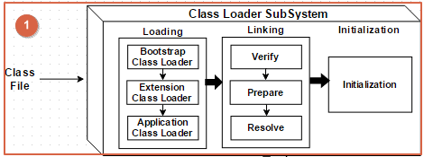
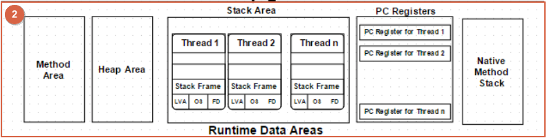
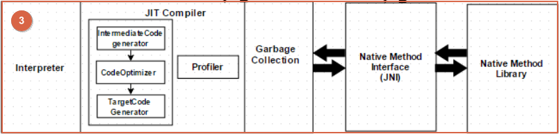

## Table of contents
{: .no_toc .text-delta }

1. TOC
{:toc}
---

# **JVM이란?**


✅**Java코드 또는 애플리케이션을 구동하기 위한 런타임 환경을 제공하는 엔진이다.**
{: .fh-default .fs-4 }
✅**Java 바이트 코드(.class) 를 기계 언어(OS에 특화된 언어)로 변환 한다.**
{: .fh-default .fs-4 }

## **JRE (Java Runtime Environment)**
-   **JVM + 라이브러리**
-   자바 애플리케이션을 실행할 수 있도록 구성된 배포판
-   JVM과 핵심 라이브러리 및 자바 런타임 환경에서 사용하는 프로퍼티 세팅이나 리소스 파일을 가지고 있다.
-   개발 관련 도구는 포함하지 않는다. ( JDK에서 제공 )


## **JDK (Java Development Kit)**

-   **JRE + 개발에 필요한 툴**
-   소스 코드를 작성할 때 사용 하는 자바 언어는 플랫폼에 독립적
-   **오라클 자바 11부터는 JDK만 제공하며 JRE를 따로 제공하지 않는다.**
-   자바 컴파일러도 JDK에 해당

> ✋ **자바 유료화 ?**
> - 오라클에서 만든 Oracle JDK 11 버전 부터 상용으로 사용할 때 유료
> - 11버전 하위 이거나 Open JDK 이거나 Amazon JDK (Corretto) 는 무료이다

***

# **JVM의 작동방식**

- **Java 코드가 바이트 코드로 컴파일 된다.**
  - **(바이트 코드는 호스트시스템과 JAVA 소스 사이의 중간 언어이다)**
- **Java의 JVM은 메모리 공간 할당을 담당한다.**

***

# **JVM 아키텍처**


## **Class Loader (Sub)System**


✅**Java의 동적 클래스 로딩 기능은 Class Loader System에서 처리합니다.**
{: .fh-default .fs-4 }

### Loading : 클래스 읽어오는 과정

-   <span style="color:red; font-weight:bold">클래스 로더가 .class 파일을 읽고 그 내용에 따라 적절한 바이너리 데이터를 만들고 "메소드"영역에 저장</span>
    -   **이 때 메소드 영역에 저장하는 데이터**
        -   **FQCN**
        -   **클래스 , 인터페이스 , 이늄**
        -   **메소드 와 변수**
        -   <span style="color:red; font-weight:bold">로딩이 끝나면 해당 클래스 타입의 Class객체를 생성하여 "힙" 영역에 저장</span>
-   클래스 로더는 계층 구조로 이뤄져 있으며 , 기본적으로 세가지 클래스 로더가 제공된다.
    -   **BootStrap ClassLoader**
        -   **JAVA\_HOME\\lib 에 있는 코어 자바 API를 제공한다.**
        -   클래스 로더 중 가장 높은 우선순위가 부여된다.
    -   **Extension ClassLoader(플랫폼 클래스로더)**
        -   **JAVA\_HOME\\lib\\ext 폴더 또는 java.ext.dirs 시스템 변수에 해당하는 위치에 있는 클래스를 읽는다.**
    -   **Application ClassLoader**
        -   **애플리케이션 클래스패스** (애플리케이션 실행할 때 주는 -classpath 옵션 또는 java.class.path 환경 변수의 값에 해당하는 위치) **에서 클래스를 읽는다.**

```java
public class App {
    public static void main(String[] args) {
        ClassLoader classLoader = App.class.getClassLoader();
        System.out.println(classLoader);
        System.out.println(classLoader.getParent());
        System.out.println(classLoader.getParent().getParent());

        // 클래스 로더는 계층형 구조
        // 출력
        //sun.misc.Launcher$AppClassLoader@18b4aac2
        //sun.misc.Launcher$ExtClassLoader@1540e19d
        //null - native코드로 구현되어 있기 때문에 출력할 수 없다.
    }
}

```

### Linking : 레퍼런스를 연결하는 과정

-   **Verify (확인)**
    -   **.class 파일 형식이 유효한지 체크한다.**
    -   바이트 코드 검증기는 생성된 바이트 코드가 적절한지 여부를 확인 한다.
    -   확인이 실패하면 확인 오류가 발생한다.
-   **Prepare(준비)**
    -   모든 정적 변수(static 변수) 에 대해 메모리가 할당 되고 기본값으로 할당 된다.
-   **Resolve(해결)**
    -   All symbolic memory references are replaced with the original references from Method Area.
    -   기호 참조를 유형에서 직접 참조로 변환한다.

### Initialization : static 값들 초기화 및 변수에 할당

-   **static 변수의 값 할당 , static 블록이 있다면 이 때 실행된다.**
-   클래스 로딩의 마지막 단계
-   여기서 모든 정적 변수([Static Keyword in Java](https://www.javainterviewpoint.com/use-of-static-keyword-in-java/))는 원래 값으로 할당되고 정적 블록([Java Static Import](https://www.javainterviewpoint.com/java-static-import/))이 실행된다.

***

## 📌 **Runtime Data Areas**


✅**런타임 데이터 영역은 5개의 주요 구성 요소로 나뉜다.**
{: .fh-default .fs-4 }
### Method Area(메소드 영역)

-   **클래스 수준의 정보 (클래스 이름 , 부모 클래스 이름 , 메소드 , 변수) 저장**
-   JVM 인스턴스 내에서 로드된 Types에 대한 정보 메소드 영역이라는 메모리의 논리적 영역에 저장된다.
-   정적 변수를 포함하여 모든 클래스 수준 데이터가 여기에 저장 된다.
-   JVM당 하나의 메소드 영역만 있으며 공유 자원이다.

### Heap Area(힙 영역)

-   모든 개체와 해당 인스턴스 변수 및 배열이 여기에 저장된다.
-   JVM당 하나의 힙 영역만 있다.
-   메소드 및 힙 영역은 멀티 스레드에 대한 메모리를 공유하므로 저장된 데이터는 스레드로 부터 안전하지 않다.
-   **Young Generation (만들어 지지 얼마 되지않은 객체들)**
    -   Eden
    -   2개의 Survivor Space
-   **Old Generation (오래된 객체들)**
-   [PermGen (JAVA8에서 사라짐 , Metaspace로 변경)](https://dzone.com/articles/permgen-and-metaspace)
-  ✋ **[문자열(String) 객체가 저장되는 String Pool에 대하여](https://dololak.tistory.com/718)**
    - Java6 버전까지는 JVM Heap내부의 PermGen 영역에 있었으며, 그러한 이유로 String Pool에 문자열 객체가 많이 생성된다거나 다른 이유로 이 영역이 가득 차게되면 OutOfMemory 에러가 발생했습니다.
    - Java7 부터는 다른 일반 객체들과 마찬가지로 Perm영역이 아닌 Heap에 String Pool을 생성합니다
    - **[String은 항상 StringBuilder로 변환될까?](https://siyoon210.tistory.com/160)**

### Stack Area(스택 영역)

-   **모든 스레드 마다 런타임 스택을 만들고 , 그 안에 메소드 호출을 스택 프레임 (메서드 콜)이라 부르는 블럭으로 쌓는다.**
    -   스레드 종료하면 런타임 스택도 사라진다.
    -   에러 메세지의 쌓여있는 예외 정보들이 스택 프레임(메서드 콜) 이다.
-   모든 지역 변수는 스택 메모리에 생성된다.
-   **스택 영역은 공유 자원이 아니므로 스레드로 부터 안전하다.**
-   스택프레임([Stack Frame)](https://www.artima.com/insidejvm/ed2/jvm8.html)은 아래 3가지 항목으로 나뉜다.
    -   **Local Varibale(로컬 변수)**
        -   메소드의 지역 변수들을 갖는다.
    -   **Operand stack(피연산자 스택)**
        -   메소드 내 계산을 위한 작업 공간이다.
    -   **Frame data(프레임 데이터)**

### PC(Program Counter) Registers

-   각 스레드에는 별도의 PC레지스터가 있으며 , 명령이 실행되면 현재 실행중인 명령의 주소를 유지하기 위해 PC레지스터가 다음 명령으로 업데이트 된다.
-   스레드 마다 스레드 내 현재 실행할 instruction의 위치를 가리키는 포인터가 생성된다.

### [Native Method Stacks](https://www.artima.com/insidejvm/ed2/jvm9.html)

-   **자세한 정보는** **[Java JVM Run-time Data Areas - Javapapers](https://javapapers.com/core-java/java-jvm-run-time-data-areas/#Program_Counter_PC_Register)**

***

## **Execution Engine**


✅**런타임 데이터 영역은 5개의 주요 구성 요소로 나뉜다.**
{: .fh-default .fs-4 }
✅**클래스 로더가 런타임 데이터 영역에 바이트 코드를 할당하면 실행 엔진(Execution Engine)에 의해 실행된다.**
{: .fh-default .fs-4 }
✅**자바 바이트 코드는 기계가 바로 수행할 수 있는 언어가 아니다.**
{: .fh-default .fs-4 }
✅**실행 엔진은 바이트 코드를 실제로 JVM내부에서 기계가 실행 할 수 있는 형태로 변경 하게 되는데 이 때 2가지 방식을 사용한다.**
{: .fh-default .fs-4 }

### Interpreter(인터프리터)

-   자바 바이트 코드를 명령어 단위로 읽어서 실행
-   **한 줄 단위로 받아들여 실행 하기 때문에 느리다.**

### JIT Compiler(Just-In-Time)

-   인터프리터 방식의 단점을 보완하기 위해 도입되었다.
-   **실행엔진은 바이트 코드를 변환할 때 인터프리터를 사용하지만 반복된 코드를 찾으면 전체 바이트 코드를 컴파일 하고 네이티브 코드로 변경하는 JIT를 사용한다.**
-   이 네이티브 코드는 캐시에 보관하기 때문에 한 번 컴파일된 코드는 빠르게 수행 된다.
-   JIT 컴파일러가 컴파일 하는 과정은 바이트 코드를 인터프리팅하는 것 보다 훨씬 오래 걸리므로 한 번만 실행되는 코드라면 컴파일 하지않고 인터프리팅 하는 것이 유리하다.
-   JIT 컴파일러를 사용하는 JVM들은 내부적으로 해당 메서드가 얼마나 자주 수행되는지 체크하여 일정 수가 넘을 때에만 실행한다.

### [Garbage Collector](https://d2.naver.com/helloworld/1329)

-   참조되지 않는 객체를 수집하고 제거한다.
-   System.gc()로 호출할 수는 있지만 실행이 보장되지는 않는다.

### JNI(Java Native Interface)

-   자바 애플리케이션에서 C , C++ , 어셈블리로 작성된 함수를 사용할 수 있는 방법 제공
-   Native 키워드를 사용한 메소드 호출
-   Native Method Libraries와 상호 작용하며 실행 엔진에 필요한 Native Libraries를 제공한다.

### Native Method Libraries

-   C , C++로 작성된 라이브러리
-   실행 엔진에 필요한 Native Libraries의 모음이다.

-   **[A Simple Java Native Interface (JNI) example in Java and Scala](https://schlining.medium.com/a-simple-java-native-interface-jni-example-in-java-and-scala-68fdafe76f5f)**

***

# **출처**
[Java Virtual Machine's Internal Architecture](https://www.artima.com/insidejvm/ed2/jvm.html)
{: .fh-default .fs-4 }
[The JVM Architecture Explained - DZone Java](https://dzone.com/articles/jvm-architecture-explained)
{: .fh-default .fs-4 }
[더 자바, 코드를 조작하는 다양한 방법 - 인프런](https://www.inflearn.com/course/the-java-code-manipulation/dashboard)
{: .fh-default .fs-4 }
