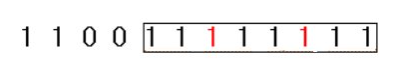

## Table of contents
{: .no_toc .text-delta }

1. TOC
{:toc}

---

# **`[Two Pointers]` 두 배열 합치기 ✔**
- **설명**
  - 오름차순으로 정렬이 된 두 배열이 주어지면 두 배열을 오름차순으로 합쳐 출력하는 프로그램을 작성하세요.
- **예시 입력 1**
  - 3
  - 1 3 5
  - 5
  - 2 3 6 7 9
- **예시 출력 1**
  - 1 2 3 3 5 6 7 9


## 풀어보기

```java
import java.util.*;
public class Main {
    public static void main(String[] args){
        Scanner kb = new Scanner(System.in);
        int n = kb.nextInt();
        int[] arr1 = new int[n];
        for(int i = 0 ; i < n ; i++){
            arr1[i] = kb.nextInt();
        }
        int m = kb.nextInt();
        int[] arr2 = new int[m];
        for(int i = 0 ; i < m ; i++){
            arr2[i] = kb.nextInt();
        }
        solution(arr1 , arr2);
    }

    public static void solution(int[] arr1 , int[] arr2){
        int totalLength = arr1.length + arr2.length;
        int[] resultArr = new int[totalLength];
        int index1 = 0 , index2 = 0;
        int val = 0;
        for(int i = 0 ; i < totalLength ; i++){
            if(index1 >= arr1.length || arr1[index1] > arr2[index2]){
                val = arr2[index2];
                index2++;
            }
            else{
                val = arr1[index1];
                index1++;
            }
            resultArr[i] = val;
        }
        Arrays.stream(resultArr).forEach(num -> {
            System.out.print(num + " ");
        });
    }
}

```

## 해답

```java
import java.util.*;
class Main {
	public ArrayList<Integer> solution(int n, int m, int[] a, int[] b){
		ArrayList<Integer> answer = new ArrayList<>();
		int p1 = 0, p2 = 0;
		while(p1 < n && p2 < m){
			if(a[p1] < b[p2]) answer.add(a[p1++]);
			else answer.add(b[p2++]);
		}
		while(p1<n) answer.add(a[p1++]);
		while(p2<m) answer.add(b[p2++]);
		return answer;
	}

	public static void main(String[] args){
		Main T = new Main();
		Scanner kb = new Scanner(System.in);
		int n = kb.nextInt();
		int[] a = new int[n];
		for(int i = 0 ; i < n ; i++){
			a[i] = kb.nextInt();
		}
		int m = kb.nextInt();
		int[] b = new int[m];
		for(int i = 0 ; i < m ; i++){
			b[i] = kb.nextInt();
		}
		for(int x : T.solution(n, m, a, b)) System.out.print(x+" ");
	}
}
```

***

# **`[Two Pointers]` 공통 원소 구하기 ✔**
- **설명**
  - A, B 두 개의 집합이 주어지면 두 집합의 공통 원소를 추출하여 오름차순으로 출력하는 프로그램을 작성하세요.
- **예시 입력 1**
  - 5
  - 1 3 9 5 2
  - 5
  - 3 2 5 7 8
- **예시 출력 1**
  - 2 3 5

## 풀어보기

```java
import java.util.*;
public class Main {
    public static void main(String[] args){
        Scanner kb = new Scanner(System.in);
        int n = kb.nextInt();
        int[] arr1 = new int[n];
        for(int i = 0 ; i < n ; i++){
            arr1[i] = kb.nextInt();
        }
        int m = kb.nextInt();
        int[] arr2 = new int[m];
        for(int i = 0 ; i < m ; i++){
            arr2[i] = kb.nextInt();
        }
        solution(arr1 , arr2);
    }

    public static void solution(int[] arr1 , int[] arr2){
        List<Integer> resultList = new ArrayList<>();
        Arrays.sort(arr1);
        Arrays.sort(arr2);
        int index1 = 0 , index2 = 0;
        for(int i = 0 ; i < arr1.length + arr2.length ; i++){
            if(index1 >= arr1.length || index2 >= arr2.length) break;
            else if(arr1[index1] == arr2[index2]){
                resultList.add(arr1[index1++]);
                index2++;
            }
            else if(arr1[index1] > arr2[index2]){
                index2++;
            }
            else{
                index1++;
            }
        }
        for (Integer integer : resultList) {
            System.out.print(integer + " ");
        }
    }
}
```

## 해답

```java
import java.util.*;
class Main {
	public ArrayList<Integer> solution(int n, int m, int[] a, int[] b){
		ArrayList<Integer> answer = new ArrayList<>();
		Arrays.sort(a);
		Arrays.sort(b);
		int p1 = 0, p2 = 0;
		while(p1 < n && p2 < m){
			if(a[p1] == b[p2]){
				answer.add(a[p1++]);
				p2++;
			}
			else if(a[p1] < b[p2]) p1++;
			else p2++;
		}
		return answer;
	}

	public static void main(String[] args){
		Main T = new Main();
		Scanner kb = new Scanner(System.in);
		int n = kb.nextInt();
		int[] a = new int[n];
		for(int i = 0 ; i < n ; i++){
			a[i] = kb.nextInt();
		}
		int m = kb.nextInt();
		int[] b = new int[m];
		for(int i = 0 ; i < m ; i++){
			b[i] = kb.nextInt();
		}
		for(int x : T.solution(n, m, a, b)) System.out.print(x+" ");
	}
}
```

***

# **`[Sliding Window]` [최대 매출](https://cote.inflearn.com/contest/10/problem/03-03) (❌<span style="color:red;">시간초과</span>)**

## 풀어보기

```java
import java.util.*;
public class Main {
    public static void main(String[] args){
        Scanner kb = new Scanner(System.in);
        int length = kb.nextInt();
        int days = kb.nextInt();
        int[] arr1 = new int[length];
        for(int i = 0 ; i < length ; i++){
            arr1[i] = kb.nextInt();
        }
        solution(arr1 , days);
    }

    public static void solution(int[] arr1 , int days){
        int total = 0;
        for(int i = 0 ; i < arr1.length - days ; i++){
            int tmp = 0;
            for(int k = i ; k < i + days ; k++){
                tmp += arr1[k];
            }
            if(total < tmp){
                total = tmp;
            }
        }
        System.out.println(total);
    }
}
```

## 해답

```java
import java.util.*;
class Main {
	public int solution(int n, int k, int[] arr){
		int answer, sum=0;
		for(int i = 0 ; i < k ; i++) sum += arr[i];
		answer = sum;
		for(int i = k ; i < n ; i++){
			sum += (arr[i] - arr[i - k]);
			answer = Math.max(answer, sum);
		}
		return answer;
	}

	public static void main(String[] args){
		Main T = new Main();
		Scanner kb = new Scanner(System.in);
		int n = kb.nextInt();
		int k = kb.nextInt();
		int[] arr = new int[n];
		for(int i = 0 ; i < n ; i++){
			arr[i] = kb.nextInt();
		}
		System.out.print(T.solution(n, k, arr));
	}
}
```

***

# **`[복합적 문제]` 연속 부분수열 ✔**

- **설명**
  - N개의 수로 이루어진 수열이 주어집니다.
  - 이 수열에서 연속부분수열의 합이 특정숫자 M이 되는 경우가 몇 번 있는지 구하는 프로그램을 작성하세요.
  - 만약 N=8, M=6이고 수열이 다음과 같다면
  - 1 2 1 3 1 1 1 2
  - 합이 6이 되는 연속부분수열은 {2, 1, 3}, {1, 3, 1, 1}, {3, 1, 1, 1}로 총 3가지입니다.
- **예시 입력 1**
  - 8 6
  - 1 2 1 3 1 1 1 2
- **예시 출력 1**
  - 3

## 풀어보기

```java
import java.util.*;
public class Main {

    public static void main(String[] args){
        Scanner in=new Scanner(System.in);
        int input1 = in.nextInt();
        int input2 = in.nextInt();
        int[] arr1 = new int[input1];
        for(int i = 0 ; i < input1 ; i++) {
            arr1[i] = in.nextInt();
        }
        solution(input1 , input2 , arr1);
    }

    public static void solution(int input1 , int input2 , int[] arr1) {
        int sum = 0 , answer = 0;
        int leftIndex = 0;
        for(int rightIndex = 0 ; rightIndex < input1 ; rightIndex++){
            sum += arr1[rightIndex];
            if(sum == input2) {
                answer++;
                sum -= arr1[leftIndex++];
            }
            while(sum > input2){
                sum -= arr1[leftIndex++];
                if(sum == input2) {
                    answer++;
                    sum -= arr1[leftIndex++];
                }
            }
        }
        System.out.println(answer);
    }
}
```

## 해답

```java
public int solution(int n, int m, int[] arr){
  int answer = 0 , sum = 0 , lt = 0 ;
  for(int rt = 0 ; rt < n ; rt++){
    sum += arr[rt];
    if(sum == m) answer++;
    while(sum >= m){
      sum -= arr[lt++];
      if(sum == m) answer++;
    }
  }
  return answer;
}

public static void main(String[] args){
  Main T = new Main();
  Scanner kb = new Scanner(System.in);
  int n = kb.nextInt();
  int m = kb.nextInt();
  int[] arr = new int[n];
  for(int i = 0 ; i < n ; i++){
    arr[i] = kb.nextInt();
  }
  System.out.print(T.solution(n, m, arr));
}
```

***

# **`[Sliding Window]` 연속된 자연수의 합 ✔**

- **설명**
  - N입력으로 양의 정수 N이 입력되면 2개 이상의 연속된 자연수의 합으로 정수 N을 표현하는 방법의 가짓수를 출력하는 프로그램을 작성하세요.
  - 만약 N=15이면
  - 7+8=15
  - 4+5+6=15
  - 1+2+3+4+5=15
  - 와 같이 총 3가지의 경우가 존재한다.
- **예시 입력 1**
  - 15
- **예시 출력 1**
  - 3

## 풀어보기

```java
import java.util.*;
public class Main {

    public static void main(String[] args){
        Scanner in=new Scanner(System.in);
        int input1 = in.nextInt();
        int[] arr1 = new int[input1];
        for(int i = 0 ; i < input1 ; i++) {
            arr1[i] = i + 1;
        }
        solution(input1 ,  arr1);
    }

    public static void solution(int input1 , int[] arr1) {
        int sum = 0 , result = 0;
        int leftIndex = 0 , index = 0;
        while(leftIndex <= arr1.length / 2 + 1){
            sum += arr1[index];
            if(sum >= input1){
                if(sum == input1) result++;
                leftIndex++;
                sum = 0;
                index = leftIndex;
            }
            index++;
        }
        System.out.println(result);
    }
}
```

## 해답

```java
import java.util.*;
class Main {
	public int solution(int n){
		int answer = 0 , sum = 0 ;
		int m = n / 2 + 1;
		int[] arr = new int[m];
		for(int i = 0 ; i < m ; i++) arr[i] = i + 1;
		int lt = 0 ;
		for(int rt = 0 ; rt < m ; rt++){
			sum += arr[rt];
			if(sum == n) answer++;
			while(sum >= n){
				sum -= arr[lt++];
				if(sum == n) answer++;
			}
		}
		return answer;
	}

	public static void main(String[] args){
		Main T = new Main();
		Scanner kb = new Scanner(System.in);
		int n = kb.nextInt();
		System.out.print(T.solution(n));
	}
}
```

## ✋ (수학) 해답

```java
import java.util.*;
class Main {
	public int solution(int n){
		int answer = 0;

    // 미리 1을 빼놓기
    int cnt = 1;
		n--;

		while(n > 0){
			cnt++;
			n = n - cnt;
			if(n % cnt == 0) answer++;
		}
		return answer;
	}

	public static void main(String[] args){
		Main T = new Main();
		Scanner kb = new Scanner(System.in);
		int n = kb.nextInt();
		System.out.print(T.solution(n));
	}
}
```

***

# **`[복합적 문제]` 최대 길이 연속부분수열 ✔**
- 다음과 같은 수열이 주어지고 k=2라면
- 1 1 0 0 1 1 0 1 1 0 1 1 0 1
- 여러분이 만들 수 있는 1이 연속된 연속부분수열은



- **입력**
  - 첫 번째 줄에 수열의 길이인 자연수 N(5<=N<100,000)이 주어집니다.
  - 두 번째 줄에 N길이의 0과 1로 구성된 수열이 주어집니다.
- **출력**
  - 첫 줄에 최대 길이를 출력하세요.
- **예시 입력 1**
  - 14 2
  - 1 1 0 0 1 1 0 1 1 0 1 1 0 1
- **예시 출력 1**
  - 8

## 풀어보기

```java
import java.util.*;
public class Main {

    public static void main(String[] args){
        Scanner in=new Scanner(System.in);
        int length = in.nextInt();
        int insert = in.nextInt();
        int[] arr1 = new int[length];
        for(int i = 0 ; i < length ; i++) {
            arr1[i] = in.nextInt();
        }
        solution(length , insert ,  arr1);
    }

    public static void solution(int length , int insert , int[] arr1) {
        int leftIndex = 0 , insertCnt = 0;
        int cntLength = 0 , tmpCntLength = 0;
        for(int index = 0 ; index < arr1.length ; index++){
            if(arr1[index] == 1) cntLength++;
            else if(arr1[index] == 0){
                if(insertCnt < insert) {
                    insertCnt++;
                    cntLength++;
                }
                else{
                    insertCnt = 0;
                    cntLength = 0;
                    index = ++leftIndex;
                }
            }
            if(tmpCntLength < cntLength){
                tmpCntLength = cntLength;
            }
        }
        System.out.println(Math.max(tmpCntLength , insert));
    }
}
```


## 해답

### ✋ `leftIndex`가 `rightIndex`를 쫓아가며 0을 찾을 때 까지 총 길이를 감소

```java
import java.util.*;
class Main {
	public int solution(int n, int k, int[] arr){
		int answer = 0, cnt = 0, lt = 0;
		for(int rt = 0 ; rt < n ; rt++){
			if(arr[rt] == 0) cnt++;
      // ***
			while(cnt > k){
				if(arr[lt] == 0) cnt--;
				lt++;
			}
      // ***
			answer = Math.max(answer, rt-lt+1);
		}
		return answer;
	}

	public static void main(String[] args){
		Main T = new Main();
		Scanner kb = new Scanner(System.in);
		int n = kb.nextInt();
		int k = kb.nextInt();
		int[] arr = new int[n];
		for(int i = 0 ; i < n ; i++){
			arr[i] = kb.nextInt();
		}
		System.out.print(T.solution(n, k, arr));
	}
}
```
