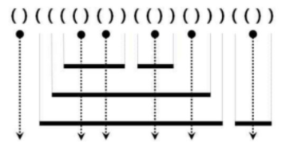
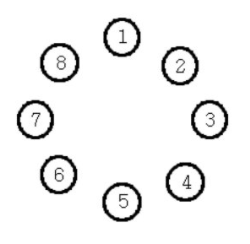

## Table of contents
{: .no_toc .text-delta }

1. TOC
{:toc}

---

# **`[Stack]` 올바른 괄호 ✔**

## ✋ Stack의 대표 문제

- **설명**
  - 괄호가 입력되면 올바른 괄호이면 “YES", 올바르지 않으면 ”NO"를 출력합니다.
  - (())() 이것은 괄호의 쌍이 올바르게 위치하는 거지만, (()()))은 올바른 괄호가 아니다.
- **예시 입력 1**
  - (()(()))(()
- **예시 출력 1**
  - NO

## 풀어보기

```java
import java.util.*;
class Main {

    public static void main(String[] args){
        Scanner sc = new Scanner(System.in);
        String str1 = sc.nextLine();
        solution(str1);
    }

    public static void solution(String str1){
        Queue<Character> que = new LinkedList<>();
        boolean result = true;
        for(int i = 0 ; i < str1.length() ; i++){
            if(que.size() == 0 && str1.charAt(i) == 41) {
                result = false;
                break;
            }
            else if(str1.charAt(i) == 40) que.add(str1.charAt(i));
            else que.poll();
        }
        if(que.size() != 0 || !result){
            System.out.println("NO");
        }
        else{
            System.out.println("YES");
        }
    }
}
```

## 풀이

```java
import java.util.*;
class Main {
    public String solution(String str){
        String answer = "YES";
        Stack<Character> stack = new Stack<>();
        for(char x : str.toCharArray()){
            if(x == '(') stack.push(x);
            else{
                if(stack.isEmpty()) return "NO";
                stack.pop();
            }
        }
        if(!stack.isEmpty()) return "NO";
        return answer;
    }

    public static void main(String[] args){
        Main T = new Main();
        Scanner kb = new Scanner(System.in);
        String str = kb.next();
        System.out.println(T.solution(str));
    }
}
```

***

# **`[Stack]` 괄호 문자 제거 ✔**
- **설명**
  - 입력된 문자열에서 소괄호 ( ) 사이에 존재하는 모든 문자를 제거하고 남은 문자만 출력하는 프로그램을 작성하세요.
- **예시 입력 1**
  - (A(BC)D)EF(G(H)(IJ)K)LM(N)
- **예시 출력 1**
  - EFLM

## 풀어보기

```java
import java.util.*;
class Main {

    public static void main(String[] args){
        Scanner sc = new Scanner(System.in);
        String str1 = sc.nextLine();
        solution(str1);
    }

    public static void solution(String str1){
        Stack<Character> stack = new Stack<>();
        for(char ch : str1.toCharArray()){
            if(ch != ')'){
                stack.add(ch);
            }
            else{
                while(stack.pop() != '(');
            }
        }
        for (Character character : stack) {
            System.out.print(character);
        }

    }
}

```


## 풀이

```java
import java.util.*;
class Main {
    public String solution(String str){
        String answer = "";
        Stack<Character> stack = new Stack<>();
        for(char x : str.toCharArray()){
            if(x == ')'){
                while(stack.pop() != '(');
            }
            else stack.push(x);
        }
        for(int i = 0 ; i < stack.size() ; i++) answer += stack.get(i);
        return answer;
    }

    public static void main(String[] args){
        Main T = new Main();
        Scanner kb = new Scanner(System.in);
        String str=kb.next();
        System.out.println(T.solution(str));
    }
}
```

***

# **`[Stack]` [크레인 인형뽑기](https://programmers.co.kr/learn/courses/30/lessons/64061) - 카카오 ✔**

## 풀어보기

```java
import java.util.*;
class Main {

    public static void main(String[] args){
        Scanner sc = new Scanner(System.in);
        int size = sc.nextInt();
        int[][] board = new int[size][size];
        for(int i = 0 ; i < size ; i++){
            for(int j = 0 ; j < size ; j++){
                board[i][j] = sc.nextInt();
            }
        }
        int count = sc.nextInt();
        int[] peekArr = new int[count];
        for(int i = 0 ; i < count ; i++){
            peekArr[i] = sc.nextInt();
        }
        solution(board , peekArr);
    }

    public static void solution(int[][] board , int[] peekArr){
        Stack<Integer> bucket = new Stack<>();
        // 4 3 1 1 3 2 0 4
        int result = 0;
        for(int i = 0 ; i < peekArr.length ; i++){
            int cell = peekArr[i];
            for(int j = 0 ; j < board[0].length ; j++){
                if(board[j][cell - 1] != 0){
                    int peekValue = board[j][cell - 1];
                    if(!bucket.isEmpty() && bucket.peek() == peekValue){
//                        System.out.println( bucket.peek() + " - " + peekValue);
                        result += 2;
                        bucket.pop();
                    }
                    else{
                        bucket.add(peekValue);
                    }
                    board[j][cell - 1] = 0;
                    break;
                }
            }
        }
        System.out.println(result);
    }
}

```

## 풀이

```java
import java.util.*;
class Main {
    public int solution(int[][] board, int[] moves){
        int answer=0;
        Stack<Integer> stack = new Stack<>();
        for(int pos : moves){
            for(int i=0; i<board.length; i++){
                if(board[i][pos-1]!=0){
                    int tmp=board[i][pos-1];
                    board[i][pos-1]=0;
                    if(!stack.isEmpty() && tmp==stack.peek()){
                        answer+=2;
                        stack.pop();
                    }
                    else stack.push(tmp);
                    break;
                }
            }
        }
        return answer;
    }
    public static void main(String[] args){
        Main T = new Main();
        Scanner kb = new Scanner(System.in);
        int n=kb.nextInt();
        int[][] board=new int[n][n];
        for(int i=0; i<n; i++){
            for(int j=0; j<n; j++){
                board[i][j]=kb.nextInt();
            }
        }
        int m=kb.nextInt();
        int[] moves=new int[m];
        for(int i=0; i<m; i++) moves[i]=kb.nextInt();
        System.out.println(T.solution(board, moves));
    }
}
```

***

# **`[Stack]` 후위식 연산 ✔**
- **설명**
  - 후위연산식이 주어지면 연산한 결과를 출력하는 프로그램을 작성하세요.
  - 만약 3*(5+2)-9 을 후위연산식으로 표현하면 352+*9- 로 표현되며 그 결과는 12입니다.
- **예시 입력 1**
  - 352+*9-
- **예시 출력 1**
  - 12

## 후위 표기식 읽는 법
- 왼쪽에서 부터 순차적으로 읽기 시작한다.
- 피연산자(숫자)는 일단 지나치고, 연산자(+-*/)가 나오게 되면, 연산자 앞쪽 두 개의 숫자로 연산을 진행한다.

- 예제) 4 7 2 + *
  1.  왼쪽부터 순차적으로 읽으면서 연산자를 찾는다.
  2.  +연산자를 찾았다. +연산자를 기준으로 앞쪽 두개의 피연산자 7, 2 를 더한다.
  3.  연산을 진행하고 나면 연산된 값을 적어둔다. 4 9 *
  4.  다시 순차적으로 연산자를 찾는다.
  5.  *연산자를 찾았다. 앞쪽 두개의 피연산자를 이용하여 연산을 진행한다.
  6.  연산결과는 36


## 풀어보기

```java
import java.util.*;
class Main {

    public static void main(String[] args){
        Scanner sc = new Scanner(System.in);
        String str1 = sc.nextLine();
        solution(str1);
    }

    public static void solution(String str1){
        Stack<Integer> stack = new Stack<>();
        int result = 0;
        for(char ch : str1.toCharArray()){
            if(Character.isDigit(ch)) stack.push(Character.getNumericValue(ch));
            else{
                int tmp = stack.pop();
                if(ch == 43) result = stack.pop() + tmp;
                else if(ch == 45) result = stack.pop() - tmp;
                else if(ch == 42) result = stack.pop() * tmp;
                else result = stack.pop() / tmp;
                stack.push(result);
            }
        }
        System.out.println(result);
    }
}
```

## 풀이

```java
import java.util.*;
class Main {
    public int solution(String str){
        int answer = 0;
        Stack<Integer> stack = new Stack<>();
        for(char x : str.toCharArray()){
            if(Character.isDigit(x)){
                stack.push(x - 48);
            }
            else{
                int rt = stack.pop();
                int lt = stack.pop();
                if(x == '+') stack.push(lt + rt);
                else if(x == '-') stack.push(lt - rt);
                else if(x == '*') stack.push(lt * rt);
                else if(x == '/') stack.push(lt / rt);
            }
        }
        answer = stack.get(0);
        return answer;
    }
    public static void main(String[] args){
        Main T = new Main();
        Scanner kb = new Scanner(System.in);
        String str = kb.next();
        System.out.println(T.solution(str));
    }
}
```

***

# **`[Stack]` [쇠 막대기](https://www.acmicpc.net/problem/10799) ✔**



- **예시 입력 1**
  - ()(((()())(())()))(())
- **예시 출력 1**
  - 17
- **예시 입력 2**
  - (((()(()()))(())()))(()())
- **예시 출력 2**
  - 24

## 풀어보기

```java
import java.util.*;
class Main {

    public static void main(String[] args){
        Scanner sc = new Scanner(System.in);
        String str1 = sc.nextLine();
        solution(str1);
    }

    public static void solution(String str1){
        Stack<Character> stack = new Stack<>();
        int result = 0;
        int leftIndex = -1;
        int open = 0;
        for(int i = 0 ; i < str1.length(); i++){
            if(!stack.isEmpty() && stack.peek() == '(' && str1.charAt(i) == ')') {
                stack.add(str1.charAt(i));
                open--;
                result += open;
            }
            else if(str1.charAt(i) == ')'){
                open--;
                result++;
            }
            else {
                stack.add(str1.charAt(i));
                open++;
            }
        }
        System.out.println(result);
    }
}
```
```
(((()(()()))(())()))(()())
[(, (, (, (, )] / 3
[(, (, (, (, ), (, (, )] / 7
[(, (, (, (, ), (, (, ), (, )] / 11
[(, (, (, (, ), (, (, ), (, ), (, (, )] / 16
[(, (, (, (, ), (, (, ), (, ), (, (, ), (, )] / 19
[(, (, (, (, ), (, (, ), (, ), (, (, ), (, ), (, (, )] / 22
[(, (, (, (, ), (, (, ), (, ), (, (, ), (, ), (, (, ), (, )] / 23
24
```
## 풀이

```java
import java.util.*;
class Main {
    public int solution(String str){
        int cnt = 0;
        Stack<Character> stack = new Stack<>();
        for(int i = 0 ; i < str.length() ; i++){
            if(str.charAt(i) == '(') stack.push('(');
            else{
                stack.pop();
                if(str.charAt(i - 1) == '(') cnt += stack.size();
                else cnt++;
            }
        }
        return cnt;
    }
    public static void main(String[] args){
        Main T = new Main();
        Scanner kb = new Scanner(System.in);
        String str = kb.next();
        System.out.println(T.solution(str));
    }
}
```

***

# **`[Queue]` [공주 구하기](https://cote.inflearn.com/contest/10/problem/05-06) ❌**



- **예시 입력 1**
  - 8 3
- **예시 출력 1**
  - 7

## 풀어보기

```java
import java.util.*;

class Main {
    public static void main(String[] args){
        Scanner sc = new Scanner(System.in);
        int input1 = sc.nextInt();
        int input2 = sc.nextInt();
        Queue<Integer> que = new LinkedList<>();

        for(int i = 1 ; i <= input1 ; i++) que.offer(i);

        while(que.size() != 1){
            for(int i = 1 ; i <= input2 ; i++){
                if(i != input2){
                    que.offer(que.poll());
                }
                else que.poll();
            }
        }
        System.out.println(que.peek());
    }
}
```

## 풀이

```java
import java.util.*;
class Main {
    public int solution(int n, int k){
        int answer=0;
        Queue<Integer> Q=new LinkedList<>();
        for(int i=1; i<=n; i++) Q.offer(i);
        while(!Q.isEmpty()){
            for(int i=1; i<k; i++) Q.offer(Q.poll());
            Q.poll();
            if(Q.size()==1) answer=Q.poll();
        }
        return answer;
    }
    public static void main(String[] args){
        Main T = new Main();
        Scanner kb = new Scanner(System.in);
        int n=kb.nextInt();
        int k=kb.nextInt();
        System.out.println(T.solution(n, k));
    }
}
```

***

# **`[Queue]` 교육과정 설계 ✔**

- **입력**
  - 첫 줄에 한 줄에 필수과목의 순서가 주어집니다. 모든 과목은 영문 대문자입니다.
  - 두 번 째 줄부터 현수가 짠 수업설계가 주어집니다.(수업설계의 길이는 30이하이다)
- **출력**
  - 첫 줄에 수업설계가 잘된 것이면 “YES", 잘못된 것이면 ”NO“를 출력합니다.
- **예시 입력 1**
  - CBA
  - CBDAGE
- **예시 출력 1**
  - YES


## 풀어보기 (프로그래머스 LV2 - 스킬찍기와 동일)

```java
import java.util.*;
class Main {

    public static void main(String[] args){
        Scanner sc = new Scanner(System.in);
        String input1 = sc.nextLine();
        String input2 = sc.nextLine();
        solution(input1 , input2);
    }

    public static void solution(String input1 , String input2){
        if(input2.replaceAll("[^" + input1 + "]" , "").indexOf(input1) == 0){
            System.out.println("YES");
        }
        else{
            System.out.println("NO");
        }
    }
}

```

## 풀이

```java
import java.util.*;
class Main {
    public String solution(String need, String plan){
        String answer = "YES";
        Queue<Character> Q = new LinkedList<>();
        for(char x : need.toCharArray()) Q.offer(x);
        for(char x : plan.toCharArray()){
            if(Q.contains(x)){
                if(x != Q.poll()) return "NO";
            }
        }
        if(!Q.isEmpty()) return "NO";
        return answer;
    }
    public static void main(String[] args){
        Main T = new Main();
        Scanner kb = new Scanner(System.in);
        String a = kb.next();
        String b = kb.next();
        System.out.println(T.solution(a, b));
    }
}
```

***

# **`[Queue - Person객체]` [응급실](https://cote.inflearn.com/contest/10/problem/05-08) ❌**

## 풀이

```java
import java.util.*;

class Person{
    int id;
    int priority;
    public Person(int id, int priority){
        this.id=id;
        this.priority=priority;
    }
}

class Main {
    public int solution(int n, int m, int[] arr){
        int answer = 0 ;
        Queue<Person> Q = new LinkedList<>();
        for(int i = 0 ; i < n ; i++){
            Q.offer(new Person(i, arr[i]));
        }
        while(!Q.isEmpty()){
            Person tmp = Q.poll();
            for(Person x : Q){
                if(x.priority > tmp.priority){
                    Q.offer(tmp);
                    tmp = null;
                    break;
                }
            }
            if(tmp != null){
                answer++;
                if(tmp.id == m) return answer;
            }
        }
        return answer;
    }

    public static void main(String[] args){
        Main T = new Main();
        Scanner kb = new Scanner(System.in);
        int n = kb.nextInt();
        int m = kb.nextInt();
        int[] arr = new int[n];
        for(int i = 0 ; i < n ; i++){
            arr[i] = kb.nextInt();
        }
        System.out.println(T.solution(n, m, arr));
    }
}
```
