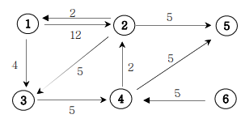
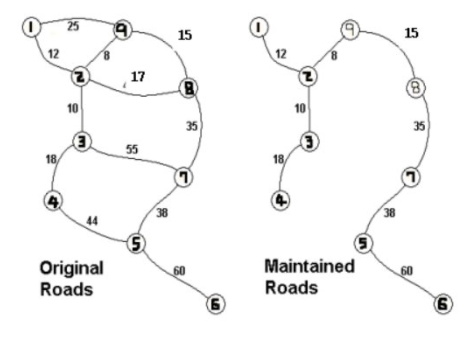

## Table of contents
{: .no_toc .text-delta }

1. TOC
{:toc}

---


# **[씨름 선수](https://cote.inflearn.com/contest/10/problem/09-01) ✔**

## 풀어보기


```java
import java.util.*;

class Person implements Comparable<Person>{
    int height;
    int weight;
    public Person(int height , int weight){
        this.height = height;
        this.weight = weight;
    }
    @Override
    public int compareTo(Person o){
      // 음수 또는 0이면 객체의 자리가 그대로 유지되며, 양수인 경우에는 두 객체의 자리가 바뀐다.
        if(this.height > o.height) return -1;
        else return 1;
    }

    @Override
    public String toString() {
        return this.height + " - " + this.weight;
    }
}

class Main {

    public static void main(String[] args) {
        Scanner sc = new Scanner(System.in);
        int input1 = sc.nextInt();
        List<Person> personList = new ArrayList<>();
        for(int i = 0 ; i < input1 ; i++){
            int height = sc.nextInt();
            int weight = sc.nextInt();
            personList.add(new Person(height , weight));
        }
        Collections.sort(personList);
//        for (Person person : personList) {
//            System.out.println(person);
//        }

        int result = 1;
        int maxWeight = personList.get(0).weight;
        for(int i = 1 ; i < personList.size() ; i++){
            Person now = personList.get(i);
            if(maxWeight < now.weight){
                result++;
                maxWeight = now.weight;
            }
        }
        System.out.println(result);
    }
}
```

## 해답

```java
import java.util.*;
class Body implements Comparable<Body>{
    public int h, w;
    Body(int h, int w) {
        this.h = h;
        this.w = w;
    }
    @Override
    public int compareTo(Body o){
        return o.h-this.h;
    }
}

class Main {
    public int solution(ArrayList<Body> arr, int n){
        int cnt=0;
        Collections.sort(arr);
        int max=Integer.MIN_VALUE;
        for(Body ob : arr){
            if(ob.w>max){
                max=ob.w;
                cnt++;
            }
        }
        return cnt;
    }

    public static void main(String[] args){
        Main T = new Main();
        Scanner kb = new Scanner(System.in);
        int n=kb.nextInt();
        ArrayList<Body> arr = new ArrayList<>();
        for(int i=0; i<n; i++){
            int h=kb.nextInt();
            int w=kb.nextInt();
            arr.add(new Body(h, w));
        }
        System.out.println(T.solution(arr, n));
    }
}
```

***

# **[회의실 배정](https://cote.inflearn.com/contest/10/problem/09-02) ✔**

## 풀어보기

```java
import java.util.*;

class Schedule implements Comparable<Schedule>{
    int start;
    int end;
    public Schedule(int start , int end){
        this.start = start;
        this.end = end;
    }
    @Override
    public int compareTo(Schedule o){
        if(this.end > o.end) return 1;
        else if(this.end == o.end){
            if(this.start > o.start){
                return 1;
            }
            else return -1;
        }
        else return -1;
    }

    @Override
    public String toString() {
        return this.start + " - " + this.end;
    }
}

class Main {

    public static void main(String[] args) {
        Scanner sc = new Scanner(System.in);
        int input1 = sc.nextInt();
        List<Schedule> schedules = new ArrayList<>();
        for(int i = 0 ; i < input1 ; i++){
            int start = sc.nextInt();
            int end = sc.nextInt();
            schedules.add(new Schedule(start , end));
        }

        Collections.sort(schedules);

        int result = 1;
        int tmpEnd = schedules.get(0).end;
        for(int i = 1 ; i < schedules.size() ; i++){
            if(schedules.get(i).start >= tmpEnd){
                result++;
                tmpEnd = schedules.get(i).end;
            }
        }
        System.out.println(result);
    }

}
```

## 해답

```java
import java.util.*;
class Time implements Comparable<Time>{
    public int s, e;
    Time(int s, int e) {
        this.s = s;
        this.e = e;
    }
    @Override
    public int compareTo(Time o){
        if(this.e==o.e) return this.s-o.s;
        else return this.e-o.e;
    }
}

class Main {
    public int solution(ArrayList<Time> arr, int n){
        int cnt=0;
        Collections.sort(arr);
        int et=0;
        for(Time ob : arr){
            if(ob.s>=et){
                cnt++;
                et=ob.e;
            }
        }
        return cnt;
    }

    public static void main(String[] args){
        Main T = new Main();
        Scanner kb = new Scanner(System.in);
        int n=kb.nextInt();
        ArrayList<Time> arr = new ArrayList<>();
        for(int i=0; i<n; i++){
            int x=kb.nextInt();
            int y=kb.nextInt();
            arr.add(new Time(x, y));
        }
        System.out.println(T.solution(arr, n));
    }
}
```

***

# **[결혼식](https://cote.inflearn.com/contest/10/problem/09-03) ✔ ~~❌~~**

## 풀어보기
```java
import java.util.*;

class Time implements Comparable<Time>{
    int time;
    char status;
    public Time(int time , char status){
        this.time = time;
        this.status = status;
    }
    @Override
    public int compareTo(Time o){
        if(this.time == o.time) return this.status - o.status;
        else return this.time - o.time;
    }

    @Override
    public String toString() {
        return this.time + " - " + this.status;
    }
}

class Main {

    public static void main(String[] args) {
        Scanner sc = new Scanner(System.in);
        int input1 = sc.nextInt();
        List<Time> times = new ArrayList<>();
        for(int i = 0 ; i < input1 ; i++){
            int start = sc.nextInt();
            times.add(new Time(start , 'S'));
            int end = sc.nextInt();
            times.add(new Time(end , 'E'));
        }

        Collections.sort(times);

        int cnt = 0;
        int result = 0;
        for(Time time : times){
            if(time.status == 'S') {
                cnt++;
            }
            else cnt--;
            result = Math.max(cnt , result);
        }
        System.out.println(result);
    }

}
```

## 해답

```java
import java.util.*;
class Time implements Comparable<Time>{
    public int time;
    public char state;
    Time(int time, char state) {
        this.time = time;
        this.state = state;
    }
    @Override
    public int compareTo(Time ob){
        if(this.time==ob.time) return this.state-ob.state;
        else return this.time-ob.time;
    }
}

class Main {
    public int solution(ArrayList<Time> arr){
        int answer=Integer.MIN_VALUE;
        Collections.sort(arr);
        int cnt=0;
        for(Time ob : arr){
            if(ob.state=='s') cnt++;
            else cnt--;
            answer=Math.max(answer, cnt);
        }
        return answer;
    }

    public static void main(String[] args){
        Main T = new Main();
        Scanner kb = new Scanner(System.in);
        int n=kb.nextInt();
        ArrayList<Time> arr = new ArrayList<>();
        for(int i=0; i<n; i++){
            int sT=kb.nextInt();
            int eT=kb.nextInt();
            arr.add(new Time(sT, 's'));
            arr.add(new Time(eT, 'e'));
        }
        System.out.println(T.solution(arr));
    }
}
```

***

# **`[PriorityQueue 응용문제]` [최대 수입 스케쥴](https://cote.inflearn.com/contest/10/problem/09-04) ❌**

## 풀어보기

```java
import java.util.*;

class Lecture implements Comparable<Lecture>{
    int money;
    int day;
    public Lecture(int money , int day){
        this.money = money;
        this.day = day;
    }
    @Override
    public int compareTo(Lecture o){
        return o.day - this.day;
    }

    @Override
    public String toString() {
        return this.money + " - " + this.day;
    }
}

class Main {

    public static void main(String[] args) {
        Scanner sc = new Scanner(System.in);
        int input1 = sc.nextInt();
        List<Lecture> lectures = new ArrayList<>();
        int maxDay = 0;
        for(int i = 0 ; i < input1 ; i++){
            int money = sc.nextInt();
            int day = sc.nextInt();
            if(maxDay < day) maxDay = day;
            lectures.add(new Lecture(money , day));
        }
        Collections.sort(lectures);
        lectures.add(new Lecture(0 , 0));
        PriorityQueue<Integer> priorityQueue = new PriorityQueue<Integer>(Collections.reverseOrder());
        int result = 0;

        for(int i = 0 ; i < lectures.size() ; i++){
            Lecture lec = lectures.get(i);
            if(maxDay != lec.day){
//                for(int test : priorityQueue){
//                    System.out.print(test + " ");
//                }
//                System.out.println();
                result += priorityQueue.poll();
                maxDay = lec.day;
            }
            priorityQueue.offer(lec.money);
//            System.out.println(lec);
        }
        System.out.println(result);
    }

}
```


## 해답

```java
import java.util.*;
class Lecture implements Comparable<Lecture>{
    public int money;
    public int time;
    Lecture(int money, int time) {
        this.money = money;
        this.time = time;
    }
    @Override
    public int compareTo(Lecture ob){
        return ob.time-this.time;
    }
}

class Main {
    static int n, max=Integer.MIN_VALUE;
    public int solution(ArrayList<Lecture> arr){
        int answer=0;
        PriorityQueue<Integer> pQ = new PriorityQueue<>(Collections.reverseOrder());
        Collections.sort(arr);
        int j=0;
        for(int i=max; i>=1; i--){
            for(; j<n; j++){
                if(arr.get(j).time<i) break;
                pQ.offer(arr.get(j).money);
            }
            if(!pQ.isEmpty()) answer+=pQ.poll();
        }
        return answer;
    }

    public static void main(String[] args){
        Main T = new Main();
        Scanner kb = new Scanner(System.in);
        n=kb.nextInt();
        ArrayList<Lecture> arr = new ArrayList<>();
        for(int i=0; i<n; i++){
            int m=kb.nextInt();
            int d=kb.nextInt();
            arr.add(new Lecture(m, d));
            if(d>max) max=d;
        }
        System.out.println(T.solution(arr));
    }
}
```

***

# **🔥 다익스트라 알고리즘 ❌**
- 아래의 가중치 방향그래프에서 1번 정점에서 모든 정점으로의 최소 거리비용을 출력하는 프로
그램을 작성하세요.
- 경로가 없으면 Impossible를 출력한다



- **출력설명**
1번 정점에서 각 정점으로 가는 최소비용을 2번 정점부터 차례대로 출력하세요.
- **입력예제 1**
  - 6 9
  - 1 2 12 // 1번 정점에서 2번정점으로 가는데 12의 비용이 든다.
  - 1 3 4
  - 2 1 2
  - 2 3 5
  - 2 5 5
  - 3 4 5
  - 4 2 2
  - 4 5 5
  - 6 4 5
- **출력예제 1**
  - 2 : 11
  - 3 : 4
  - 4 : 9
  - 5 : 14
  - 6 : impossible

## 풀어보기

```java
import java.util.*;

class Main {

    public static void main(String[] args) {
        Scanner sc = new Scanner(System.in);
        int arrSize = sc.nextInt();
        int size = sc.nextInt();
        List<List<Integer>> list = new ArrayList<>();
        int[][] array = new int[arrSize + 1][arrSize + 1];
        int[] distance = new int[arrSize + 1];
        for(int i = 0 ; i < size ; i++){
            int start = sc.nextInt();
            int end = sc.nextInt();
            int cost = sc.nextInt();
            array[start][end] = cost;
        }

        for(int i = 0 ; i < arrSize + 1 ; i++){
            for(int j = 0 ; j < arrSize + 1 ; j++){
                System.out.print(array[i][j] + " ");
            }
            System.out.println();
        }
    }

}
```

## 해답

### 📌 `Arrays.fill(dis, Integer.MAX_VALUE);`
### 📌 `PriorityQueue<Edge> pQ = new PriorityQueue<>();`
```java
import java.util.*;
class Edge implements Comparable<Edge>{
    public int vex;
    public int cost;
    Edge(int vex, int cost) {
        this.vex = vex;
        this.cost = cost;
    }
    @Override
    public int compareTo(Edge ob){
        return this.cost-ob.cost;
    }
}

class Main {
    static int n, m;
    static ArrayList<ArrayList<Edge>> graph;
    static int[] dis;
    public void solution(int v){
        PriorityQueue<Edge> pQ = new PriorityQueue<>();
        pQ.offer(new Edge(v, 0));
        dis[v]=0;
        while(!pQ.isEmpty()){
            Edge tmp=pQ.poll();
            int now=tmp.vex;
            int nowCost=tmp.cost;
            if(nowCost>dis[now]) continue;
            for(Edge ob : graph.get(now)){
                if(dis[ob.vex]>nowCost+ob.cost){
                    dis[ob.vex]=nowCost+ob.cost;
                    pQ.offer(new Edge(ob.vex, nowCost+ob.cost));
                }
            }
        }
    }

    public static void main(String[] args){
        Main T = new Main();
        Scanner kb = new Scanner(System.in);
        n=kb.nextInt();
        m=kb.nextInt();
        graph = new ArrayList<ArrayList<Edge>>();
        for(int i=0; i<=n; i++){
            graph.add(new ArrayList<Edge>());
        }
        dis=new int[n+1];
        Arrays.fill(dis, Integer.MAX_VALUE);
        for(int i=0; i<m; i++){
            int a=kb.nextInt();
            int b=kb.nextInt();
            int c=kb.nextInt();
            graph.get(a).add(new Edge(b, c));
        }
        T.solution(1);
        for(int i=2; i<=n; i++){
            if(dis[i]!=Integer.MAX_VALUE) System.out.println(i+" : "+dis[i]);
            else System.out.println(i+" : impossible");
        }
    }
}
```

***

# **🔥 `Disjoint-Set(서로소 집합) : Union&Find 알고리즘` [친구인가?](https://cote.inflearn.com/contest/10/problem/09-06) ✔ ~~❌~~**

## 풀어보기

```java
import java.util.*;

class Main {
    static int[] relation;

    public static void main(String[] args) {
        Scanner sc = new Scanner(System.in);
        int input1 = sc.nextInt();
        int input2 = sc.nextInt();
        relation = new int[input1 + 1];
        for(int i = 1 ; i < input1 + 1 ; i++) relation[i] = i;

        for(int i = 0 ; i < input2 ; i++){
            int value1 = sc.nextInt();
            int value2 = sc.nextInt();
            Union(value1 , value2);
        }
        int value1 = sc.nextInt();
        int value2 = sc.nextInt();
        if(Find(value1) != Find(value2)) System.out.println("NO");
        else System.out.println("YES");
    }

    public static int Find(int value){
        if(value == relation[value]) return value;
        else return relation[value] = Find(relation[value]);
    }

    public static void Union(int value1 , int value2){
        int findA = Find(value1);
        int findB = Find(value2);
        if(findA != findB) relation[findA] = findB;
    }

}
```

## 해답

### 📌 경로 압축 - `else return unf[v]=Find(unf[v]);`

```java
import java.util.*;
class Main {
    static int[] unf;
    public static int Find(int v){
        if(v==unf[v]) return v;
        else return unf[v]=Find(unf[v]);
    }
    public static void Union(int a, int b){
        int fa=Find(a);
        int fb=Find(b);
        if(fa!=fb) unf[fa]=fb;
    }
    public static void main(String[] args){
        Scanner kb = new Scanner(System.in);
        int n=kb.nextInt();
        int m=kb.nextInt();
        unf=new int[n+1];
        for(int i=1; i<=n; i++) unf[i]=i;
        for(int i=1; i<=m; i++){
            int a=kb.nextInt();
            int b=kb.nextInt();
            Union(a, b);
        }
        int a=kb.nextInt();
        int b=kb.nextInt();
        int fa=Find(a);
        int fb=Find(b);
        if(fa==fb) System.out.println("YES");
        else System.out.println("NO");
    }
}
```

***

# **🔥 [원더랜드](https://cote.inflearn.com/contest/10/problem/09-07)**



## `최소스패닝트리 : 크루스칼, Union&Find 활용`

### 풀어보기

```java
import java.util.*;

class Edge implements Comparable<Edge>{
    int vertex1;
    int vertex2;
    int cost;
    public Edge(int vertex1 , int vertex2 , int cost){
        this.vertex1 = vertex1;
        this.vertex2 = vertex2;
        this.cost = cost;
    }
    @Override
    public String toString() {
        return "Edge{" +
                "vertex1=" + vertex1 +
                ", vertex2=" + vertex2 +
                ", cost=" + cost +
                '}';
    }
    @Override
    public int compareTo(Edge o) {
        return this.cost - o.cost;
    }
}

class Main {
    static int[] relation;
    static List<Edge> roads;
    static int totalCost = 0;
    public static void main(String[] args) {
        Scanner sc = new Scanner(System.in);
        int input1 = sc.nextInt();
        int input2 = sc.nextInt();

        roads = new ArrayList<Edge>();
        relation = new int[input1 + 1];
        // 관계 배열 초기화
        for(int i = 0 ; i < input1 + 1 ; i++) relation[i] = i;

        for(int i = 0 ; i < input2 ; i++){
            int value1 = sc.nextInt();
            int value2 = sc.nextInt();
            int cost = sc.nextInt();
            roads.add(new Edge(value1 , value2 , cost));
        }
        Collections.sort(roads);

        for(Edge edge : roads){
            Union(edge);
        }
        System.out.println(totalCost);
    }

    // 집합 관계 찾기
    public static int Find(int vertex){
//        System.out.println(vertex + " - " + relation[vertex]);
        if(vertex == relation[vertex]) return vertex;
        else return relation[vertex] = Find(relation[vertex]);
    }

    // 집합 병합
    public static void Union(Edge edge){
        int vertex1 = Find(edge.vertex1);
        int vertex2 = Find(edge.vertex2);
        if(vertex1 != vertex2) {
            totalCost += edge.cost;
            relation[vertex1] = vertex2;
        }
    }

}
```

### 해답

```java

import java.util.*;
class Edge implements Comparable<Edge>{
    public int v1;
    public int v2;
    public int cost;
    Edge(int v1, int v2, int cost) {
        this.v1 = v1;
        this.v2 = v2;
        this.cost = cost;
    }
    @Override
    public int compareTo(Edge ob){
        return this.cost-ob.cost;
    }
}

class Main {
    static int[] unf;
    public static int Find(int v){
        if(v==unf[v]) return v;
        else return unf[v]=Find(unf[v]);
    }
    public static void Union(int a, int b){
        int fa=Find(a);
        int fb=Find(b);
        if(fa!=fb) unf[fa]=fb;
    }
    public static void main(String[] args){
        Scanner kb = new Scanner(System.in);
        int n=kb.nextInt();
        int m=kb.nextInt();
        unf=new int[n+1];
        ArrayList<Edge> arr=new ArrayList<>();
        for(int i=1; i<=n; i++) unf[i]=i;
        for(int i=0; i<m; i++){
            int a=kb.nextInt();
            int b=kb.nextInt();
            int c=kb.nextInt();
            arr.add(new Edge(a, b, c));
        }
        int answer=0;
        Collections.sort(arr);
        for(Edge ob : arr){
            int fv1=Find(ob.v1);
            int fv2=Find(ob.v2);
            if(fv1!=fv2){
                answer+=ob.cost;
                Union(ob.v1, ob.v2);
            }
        }
        System.out.println(answer);
    }
}
```

## `최소스패닝트리 : 프림, PriorityQueue 활용`

### 풀어보기

```java

```

### 해답

```java

```
