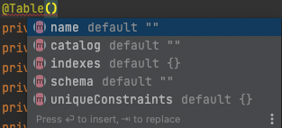
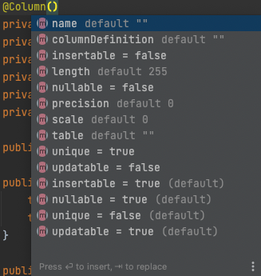

## Table of contents
{: .no_toc .text-delta }

1. TOC
{:toc}
---

# **Mapping Annotation**

- 다양한 매핑 어노테이션을 지원하는데 크게 4가지로 분류할 수 있다.
- **객체와 테이블 매핑** : `@Entity` , `@Table`
- **기본 키 매핑** : `@Id`
- **필드와 컬럼 매핑** : `@Column` , `@Enumerated` , `@Temporal` , `@Lob` , `@Transient`
- **연관관계 매핑** : `@ManyToOne` , `@JoinColumn`
- **기타** : `@Access`

# **@Id**
- 기본 키를 직접 할당할 수도 있지만 , `SEQUENCE` 또는 `AUTO_INCREMENT` 같은 기능은 어떻게 사용할까?

## **JPA가 제공하는 데이터베이스 기본 키 생성 전략**

###  **직접 할당**
- 기본 키를 애플리케이션에서 직접 할당한다.

### **자동 생성** 🚩 (131p)

- **IDENTITY**
- **SEQUENCE**
- **TABLE**

# **@Entity**

- 해당 어노테이션이 붙은 클래스는 JPA가 관리한다.
- **주의 사항**
    1. **기본 생성자 필수** (파라미터가 없는 `public`또는 `protected`생성자)
    2. `final` 클래스 (상속 방지 클래스), `enum` , `interface` , `inner` 클래스에는 사용할 수 없다.
    3. 저장할 필드에 `final`을 사용하면 안된다.

- `@Entity(name = {엔티티 이름})`
  - JPA에서 사용할 엔티티 이름 지정


# **@Table** (DDL 생성 기능)

- 해당 엔티티와 매핑할 테이블 이름을 지정한다.
- 생략하면 엔티티 이름을 테이블 이름으로 사용한다.



## 속성

- `name`
- `catalog`
- `indexes`
- `schema`
- `uniqueConstraints` 📌
    - `DDL`생성시에 유니크 제약조건을 만든다.
    - 2개 이상의 복합 유니크 제약조건도 만들 수 있다.
    - **이 기능은 스키마 자동 생성 기능을 사용해서 DDL을 만들 때만 사용된다.**

```java
@Entity
@Table(uniqueConstraints = {
        @UniqueConstraint(
                name = "NAME_UNIQUE",
                columnNames = {"NAME"}
        )
})
public class Member {

    @Id
    private Long id;
    
    private String name;

    private int age;

    @Enumerated(EnumType.STRING)
    private RoleType roleType;

    @Temporal(TemporalType.TIMESTAMP)
    private Date createdDate;

    @Temporal(TemporalType.TIMESTAMP)
    private Date lastModifiedDate;

    @Lob
    private String description;

    ...
```

```
alter table MEMBER 
       add constraint NAME_UNIQUE unique (NAME)
```

# **@Column** (DDL 생성 기능) 🚩 (145p) 

- 스키마 자동 생성하기를 통해 **DDL**을 생성할 수 있다.
- 속성은 아래와 같다.



# **@Enumerated** 🚩 

# **@Temporal** 🚩 

# **@Lob** 🚩 

# **@Transient** 🚩 

# **@Access** 🚩 


