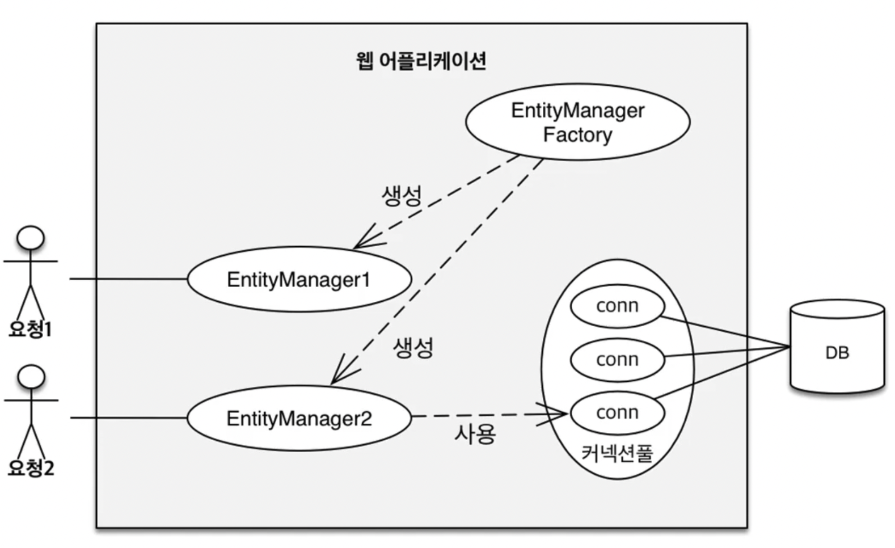
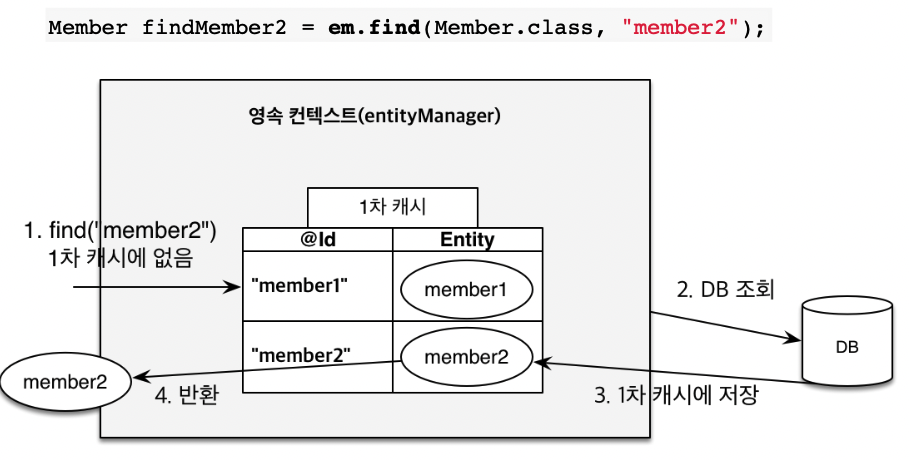
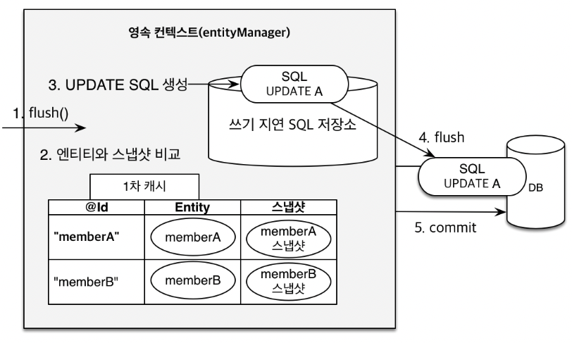
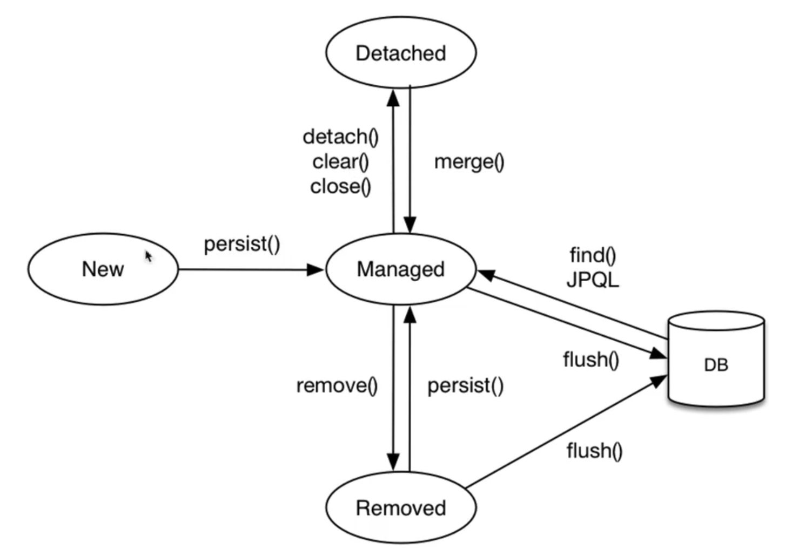
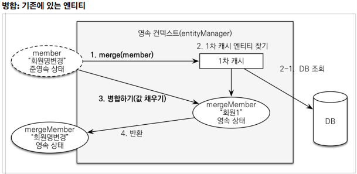
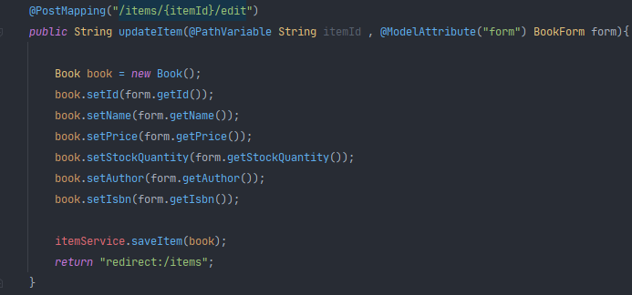
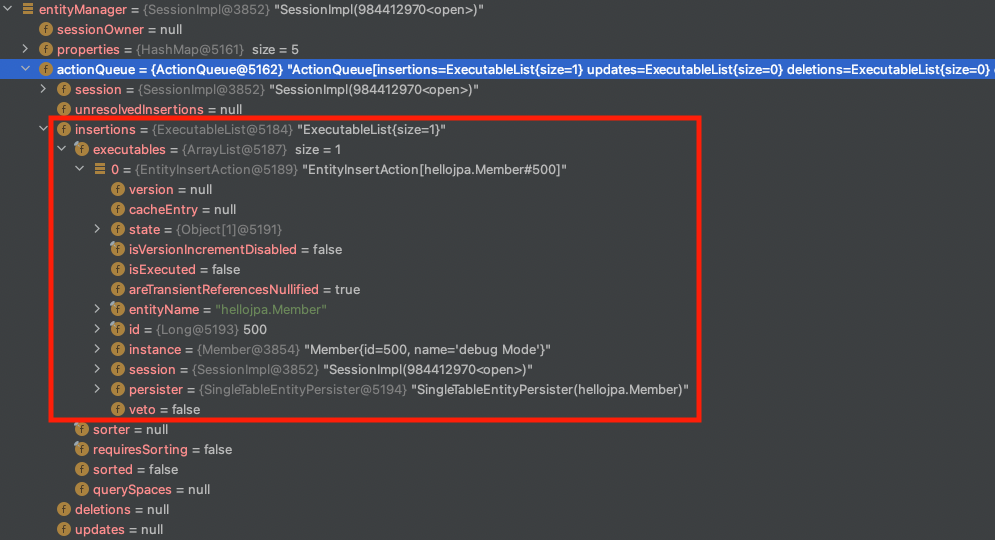
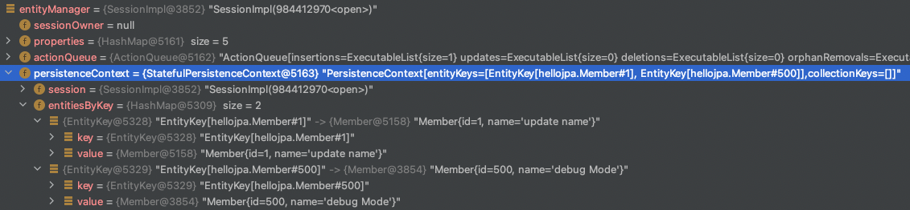
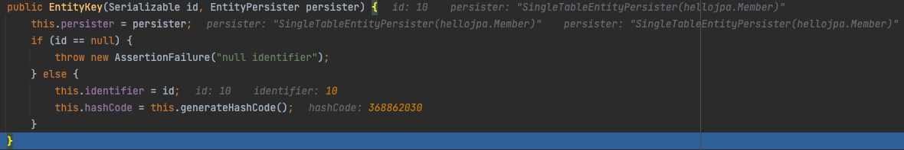
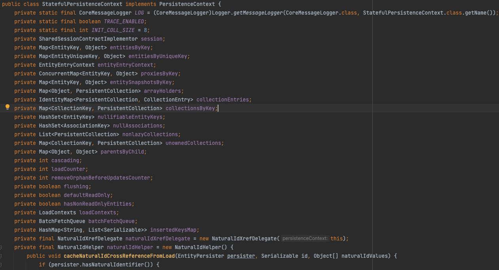

## Table of contents
{: .no_toc .text-delta }

1. TOC
{:toc}
---

# **영속성 컨텍스트**

- **"엔티티를 영구 저장하는 환경"** 이라는 뜻
- **엔티티**를 식별자 값(`@Id`로 테이블의 기본 키와 매핑한 값)으로 구분한다.
  - 따라서 , **영속 상태는 식별자 값이 반드시 있어야 한다.**
  - 식별자 값이 없으면 예외 발생



- 데이터베이스를 하나만 사용하는 애플리케이션은 일반적으로 `EntityManagerFactory`를 하나만 생성한다.
- `EntityManagerFactory`는 여러 스레드가 동시에 접근해도 안전하므로 서로 다른 스레드간에 공유해도 되지만 ,
- `EntityManager`는 **스레드간에 절대 공유하면 안된다.**

## 1차 캐시와 동일성 보장
- **같은 트랜잭션 안에서는 같은 엔티티를 반환**
- 애플리케이션에서 반복 가능한 읽기 `Repeatable Read` 보장
  - 트랜잭션 격리 수준을 `DB`가 아닌 애플리케이션 차원에서 제공
- `DB Isolation Level` ❓ 이 `Read Commit`❓

```java
    Member member = new Member();
    member.setId(10L);
    member.setName("1차 캐시에 넣기");

    entityManager.persist(member);

    Member cacheMember = entityManager.find(Member.class , 10L);

    System.out.println(member);
    System.out.println(cacheMember);
    System.out.println(member == cacheMember);

// Member{id=10, name='1차 캐시에 넣기'}
// Member{id=10, name='1차 캐시에 넣기'}
// true
```

```java
    Member member = new Member();
    member.setId(10L);
    member.setName("1차 캐시에 넣기");

    entityManager.persist(member);

    // 영속성 컨텍스트에도 없고 DB에도 없는 Member를 조회한다면 ?
    Member cacheMember = entityManager.find(Member.class , 11L);

    System.out.println(member);
    System.out.println(cacheMember);
    System.out.println(member == cacheMember);

// Hibernate: 
//     select
//         member0_.id as id1_0_0_,
//         member0_.name as name2_0_0_ 
//     from
//         Member member0_ 
//     where
//         member0_.id=?
// Member{id=10, name='1차 캐시에 넣기'}
// null
// false    
```

```java
    Member member = new Member();
    member.setId(10L);
    member.setName("1차 캐시에 넣기");

    entityManager.persist(member);

    // 영속성 컨텍스트에도 없고 DB에도 없는 Member를 조회한다면 ?
    Member cacheMember = entityManager.find(Member.class , 1L);

    System.out.println(member);
    System.out.println(cacheMember);
    System.out.println(member == cacheMember);

// Hibernate: 
//     select
//         member0_.id as id1_0_0_,
//         member0_.name as name2_0_0_ 
//     from
//         Member member0_ 
//     where
//         member0_.id=?
// Member{id=10, name='1차 캐시에 넣기'}
// Member{id=1, name='update name'}
// false
```



- `1차 캐시`에 없는 `row`를 찾는다면 , **DB에서 조회 후 `1차 캐시`에 저장하고 해당 `row`를 반환한다.**
    - 앞에서 말했듯이 `entityManager`는 하나의 쓰레드의 트랜잭션에 속해있다.

> - ✋ 객체의 `@Id`컬럼이 `@GeneratedValue`라면?
>   - 영속성 컨텍스트에 저장되려면 객체의 `Id`필드 값은 필수이며 , 
>   - `persist()`시점에 DB에서 `Id`필드 값을 조회하여 채워주게 된다.

## 트랜잭션을 지원하는 쓰기 지연 (`transactional write-behind`)
- 영속성 컨텍스트에 변경이 발생했을 때, 바로 데이터베이스로 쿼리를 보내지 않고 **SQL 쿼리를 쓰기 지연 SQL저장소에 모아뒀다가,** 
- **영속성 컨텍스트가 `flush` 하는 시점에 모아둔 SQL 쿼리를 데이터베이스로 보내는 기능**
  - ex) **XML설정** - `<property name="hibernate.jdbc.batch_size" value="10"/>`
  - JDBC BATCH SQL 기능을 사용해서 한번에 SQL 전송
  - UPDATE , DELETE로 인한 ROW 락 시간 최소화
    - 트랜잭션 커밋 시 UPDATE , DELETE SQL 실행하고 , 바로 커밋
- `쓰기 지연 SQL 저장소`는 어떤 구조로 생겼을까 ❓
- `JDBC BATCH SQL 기능`은 무엇일까 ❓

```java
updateItem(item1);
deleteItem(item2);

    // 비지니스 로직 수행 - 위에서 수정한 로우는 락이 걸리지 않는다.

// 커밋하는 순간 데이터베이스에 UPDATE , DELETE SQL을 보낸다
transaction.commit();
```

### `flush`가 발생하는 경우

> - ✋ `flush`모드 옵션
> - `entityManager.setFlushMode({mode})`
>   - `FlushModeType.AUTO` : 커밋이나 쿼리를 실행할 때 플러시 **(default)**
>   - `FlushModeType.COMMIT` : 커밋할 때만 플러시


- **직접 `flush()` 호출**
    - `flush()`를 호출하여도 `1차 캐시`는 계속 유지된다.
    - `쓰기 지연 SQL 저장소`에 있는 SQL만 전송한다.
- **`JPQL` 쿼리 실행시**
    - `persist`메서드에서 쿼리를 실행하는 것이 아니기 때문에 `member` , `member1` , `member2`가 없는 상태에서 `SELECT` 쿼리를 날릴 때 문제가 발생할 수 있다.
    - 이와 같은 이유로 `JPQL`실행 시 `flush`가 호출된다.

```java
    entityManager.persist(member);
    entityManager.persist(member1);
    entityManager.persist(member2);
    // persist한 객체의 순서는 보장된다.    
    // JPQL 실행
    TypedQuery<Member> query = 
                entityManager.createQuery("select m from Member m", Member.class);
    List<Member> members = query.getResultList();
```

- **트랜잭션 `commit()` 시**


## 변경 감지(`Dirty Checking`)

```java
        transaction.begin();

        Member member1 = entityManager.find(Member.class , 30L);
        member1.setName("first name 2");

        transaction.commit();
//            Hibernate:
//            select
//            member0_.id as id1_0_0_,
//                    member0_.name as name2_0_0_
//            from
//            Member member0_
//            where
//            member0_.id=?
//            Hibernate: 
//          /* update hellojpa.Member */ 
//            update Member
//            set name=?
//            where id=?
```



- `Snap Shot` 과 `Entity`를 비교하여 변경된 부분을 자동 **UPDATE**
  - `EntityManager.persist()`를 호출하면 안된다
  - 값을 바꾸게 되면 자동으로 쿼리가 생성된다.
- `SnapShot`
  - 영속성 컨텍스트 (1차 캐시)에 최초 읽어온 시점
  - `Snap Shot` 과 `Entity`를 어떻게 비교할까 ❓


## 지연 로딩(`Lazy Loading`)


***

# **Entity Life Cycle**



## **비영속 `new` / `transient`**
- **영속성 컨텍스트와 전혀 관계가 없는 새로운 상태**

```java
    Member member = new Member();
    member.setId("1");
    member.setName("멤버1");
```


## **영속 `managed`**
- 영속성 컨텍스트에게 **관리되는 상태**

```java
    // <비영속>
    Member member = new Member();
    member.setId(3L);
    member.setName("이 멤버는 영속상태");
    // </비영속>

    // <영속>
    entityManager.persist(member);
    // </영속>

    transaction.commit();
```

- 영속 시킨 후에 `Member`객체의 필드를 변경해도 적용된다.
- **하지만 아래의 두 경우는 쿼리가 날라가지 않는다.**

```java
    // 1. 영속 된 후 키 값을 바꾼다면?
    Member member = new Member();
    member.setId(5L);

    entityManager.persist(member);

    member.setId(6L);
    member.setName("영속 된 후 키 값을 바꾼다면?");

    transaction.commit();

    // 2. 영속 되기전에 키값을 넣지 않는다면?
    Member member = new Member();

    entityManager.persist(member);

    member.setId(6L);
    member.setName("영속 되기전에 키값을 넣지 않는다면?");

    transaction.commit();
```

## 📌 **준영속 `detached`**

- 영속 상태의 엔티티가 영속성 컨텍스트에서 **분리**된 상태
  -`영속성 컨텍스트의 관리를 받지 않는다.`
  - ✋ **임의로 만들어낸 엔티티도 기존 식별자를 가지고 있으면 준영속 엔티티로 볼 수 있다.**

1. `entityManager.detach({Object});`
   - 특정 엔티티만 준영속 상태로 전환 
2. `entityManager.clear()`
   - 영속성 컨텍스트를 완전히 초기화
3. `entityManager.close()`
   - 영속성 컨텍스트를 종료


```java
    // <비영속>
    Member member = new Member();
    member.setId(4L);
    member.setName("이 멤버는 영속상태 1");
    // </비영속>

    // <영속>
    entityManager.persist(member);
    // </영속>

    // <준영속>
    entityManager.detach(member);
    // 쿼리가 날라가지 않는다.
    // </준영속>

    transaction.commit();
```

### **준영속 엔티티를 수정하는 2가지 방법**

- **변경 감지 기능**

```java
    @Transactional
    // bookParam은 준영속 상태의 엔티티이다.
    public void updateItem(Long itemId , Book bookParam){
        // findItem은 영속상태이다.
        // JPA가 감시하는 대상이다.
        Item findItem = itemRepository.findOne(itemId);
        findItem.setPrice(bookParam.getPrice());
        ...
        findItem.setName(bookParam.getName());
    }
```
-   영속성 컨텍스트에서 엔티티를 다시 조회한 후에 데이터를 수정하는 방법
-   트랜잭션 안에서 엔티티를 다시 조회 , 변경할 값을 선택 ➜ 트랜잭션 커밋 시점에 변경 감지(`Dirty Checking`)
-   이 동작에서 데이터베이스 UPDATE SQL 실행

- **병합 (`merge`) 사용**

```java
    @Transactional
    // itemParam 파리미터로 넘어온 준영속 상태의 엔티티
    void update(Item itemParam) {
    	// mergeItem 영속 상태의 엔티티
        Item mergeItem = em.merge(itemParam);
    }
```
- 📌 **병합은 준영속 상태의 엔티티를 영속 상태로 변경할 때 사용하는 기능이다**



- 병합 (merge) 동작 방식

1.  `merge()`를 실행 
2.  파라미터로 넘어온 준영속 엔티티의 식별자 값으로 1차 캐시에서 엔티티를 조회
3.  만약 1차 캐시에 엔티티가 없으면 데이터베이스에서 엔티티 조회 후 1차 캐시에 저장
4.  조회한 영속 엔티티 `mergeMember` 에 `member` 엔티티의 값을 채워 넣는다.
    1.  `member`엔티티의 모든 값을 `mergeMember`에 밀어 넣는다.
    2.  이때 `mergeMember`의 `"회원 1"`이라는 이름이 `"회원명변경"`으로 바뀐다.
5.  영속 상태인 `mergeMember`를 반환한다.

**간단히 정리**
{: .fh-default .fs-4 }

1.  준영속 엔티티의 식별자 값으로 영속 엔티티를 조회한다.
2.  영속 엔티티의 값을 준영속 엔티티의 값으로 모두 교체한다.(병합한다)
3.  트랜잰셕 커밋 시점에 변경 감지 기능이 동작해서 데이터베이스 UPDATE SQL이 실행된다.

> ✋ **주의!** 
> - **변경 감지 기능을 사용하면 원하는 속성만 선택해서 변경할 수 있지만 , 병합을 사용하면 모든 속성이 변경된다.**
> - 병합 시 값이 없으면 null로 업데이트할 위험도 있다. (병합은 모든 필드를 교체한다)

***

### 예제

```java
package jpabook.jpashop.repository;
@Repository
public class ItemRepository {
    @PersistenceContext
    EntityManager em;


    public void save(Item item) {
        if (item.getId() == null) {
        	// 식별자 값이 없으면 새로운 엔티티로 판단해서 영속화(persist)하고
            em.persist(item);
        } else {
        	// 식별자 값이 있으면 병합(merge)
      	// 준영속 상태인 상품 엔티티를 수정할 때는 id 값이 있으므로 병합 수행
            // 주의!
            // Item mergeItem = em.merge(item)
            // em.merge의 반환을 받은 mergeItem은 영속 상태이고
            // 파라미터로 받아온 item은 여전히 준영속 상태이다.
            em.merge(item);
        }
    }
    //...
}
```

-   신규 데이터를 저장하는 것 뿐만 아니라 변경된 데이터의 저장도 한다.
-   여기서 사용하는 수정(병합)은 준영속 상태의 엔티티를 수정할 때 사용한다.

### 📌 핵심


> **Q.**  여기서의 **`new Book()`으로 생성된 `book` 객체는 준영속 엔티티**이다.
>
> HTML Form에서 가져온 `BookForm` `form`의 데이터를 담은 `book` 객체가 왜 준영속 엔티티일까?
>
> 단순히 `setId`를 해준 것 밖에 없는데?

> **A.** **준영속은 객체를 new 했거나 , 안 했거나를 기준으로 나누는 것은 아니다.**
>
> **핵심은 식별자(key)를 기준으로 영속상태가 되어 DB에 저장된 적이 있는가로 볼 수 있다.**
>
> new 상태인 객체와 준영속 상태의 객체는 `merge()`라는 명령에서 동작에 차이가 있다.
>
> **new 상태인 객체는 `merge()`를 호출할 때 완전히 새로운 엔티티를 만든다.**
>
> 반면에 준영속 상태의 엔티티는 DB에서 기존 엔티티를 찾고 그 값을 준영속 상태의 객체로 변경한 후 반환한다.
>
> 마치 준영속 상태의 객체가 영속 상태가 된 것 처럼

👍 **가장 좋은 해경 발법**
{: .fh-default .fs-5 }

**엔티티를 변경할 때는 항상 변경 감지를 이용하자**

-   컨트롤러에서 어설프게 엔티티를 생성하지 말자
-   트랜잭션이 있는 서비스 계층에서 식별자(id)와 변경할 데이터를 명확하게 전달하자
-   트랜잭션이 있는 서비스 계층에서 영속 상태의 엔티티를 조회 하고 , 엔티티의 데이터를 직접 변경하자.(원하는 필드만)

***

## **삭제 `removed`**


***

## `EntityManager` , `PersistenceContext` ??

```java
    Member member1 = new Member(500L , "debug Mode");
    entityManager.persist(member1);
    Member member2 = entityManager.find(Member.class , 10L);
```

- `insert`



- `PersistenceContext`



- `EntityKey`



- `StatefulPersistenceContext implements PersistenceContext`

