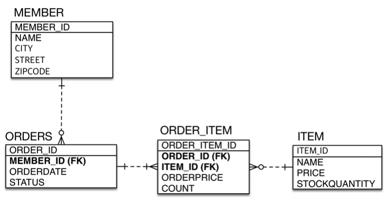
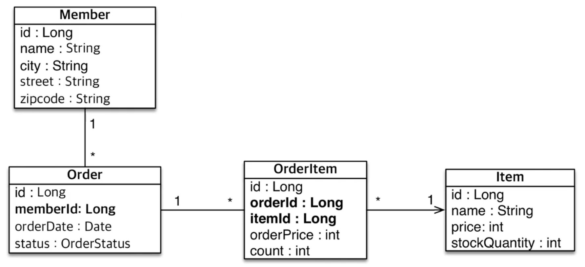
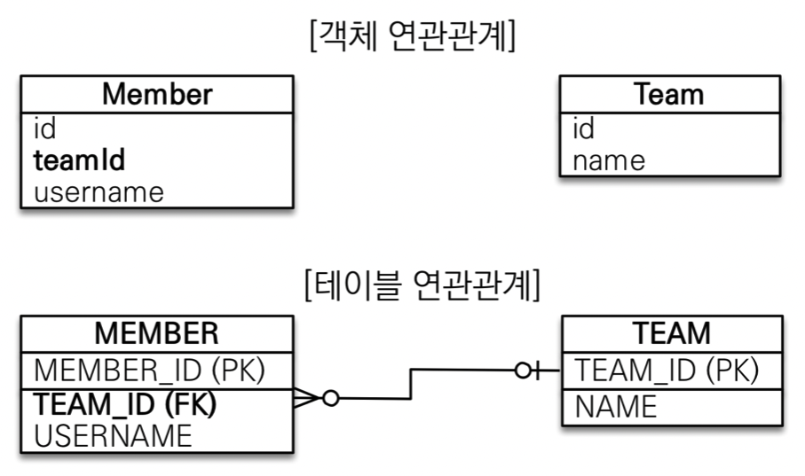
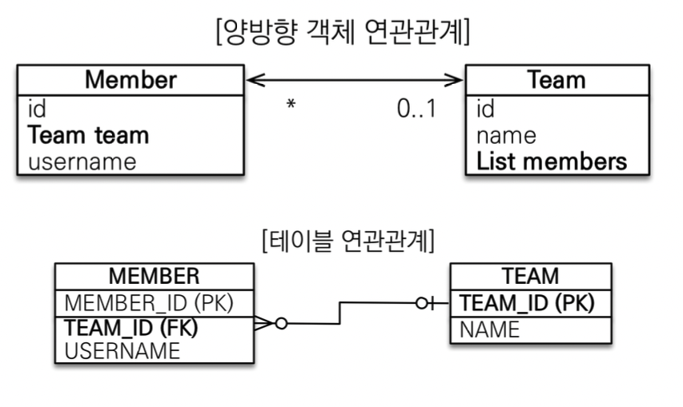
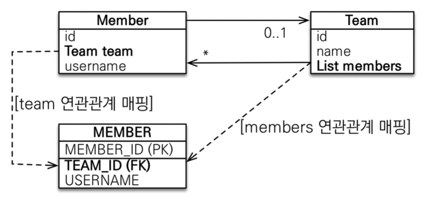
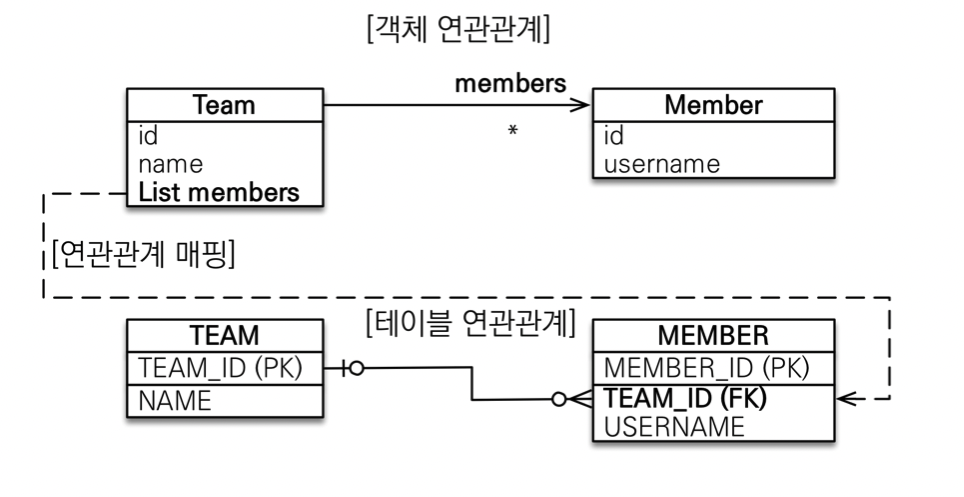

## Table of contents
{: .no_toc .text-delta }

1. TOC
{:toc}
---

# 연관관계 매핑시 고려사항 3가지

1. **다중성**
   - DB 관점에서의 다중성을 기준으로 고민하자
2. **단방향, 양방향**
   - DB 기준
     - 외래 키 하나로 양쪽 조인 가능, **방향이라는 개념이 없다**
   - 객체 기준
     - 참조용 필드가 있는 쪽으로만 참조 가능
     - **양방향 관계라는 말은 서로 다른 방향 관계가 두 개라는 것이다.**
     - **객체는 가급적이면 단방향이 좋다.**
3. **연관관계의 주인**
   - 테이블은 **외래 키 하나**로 두 테이블이 연관관계를 맺음
   - 객체 양방향 관계는 `A → B`, `B → A` 처럼 **참조가 2군데**
     - 둘 중 테이블의 외래 키를 관리할 곳을 지정해야 한다.
   - **연관관계의 주인** : 외래 키를 관리하는 참조
   - **주인의 반대편** : 외래 키에 영향을 주지 않는다. 단순 조회만

# 객체와 테이블간에 연관관계란?





- 객체 설계를 테이블 설계에 맞춘 방식
- 특히 **테이블의 외래키를 객체에 그대로 가져온 부분이 문제**다.
- 객체에서 참조 대신에 외래 키를 그대로 가지고 있으므로 `order.getMember()`처럼 객체 그래프 탐색이 불가능하다.
- 객체는 외래 키 대신에 참조를 사용해야한다.
- 외래 키만 가지고 있으면 연관된 엔티티를 찾을 때 외래 키로 다시 조회해야 한다.

```java
  Order order = em.find(Order.class , orderId);
  Member member = em.find(Meber.class , order.getMemberId());
```

- **객체는 참조를 사용해서 연관관계를 조회할 수 있다.**

```java
  Order order = em.find(Order.class , orderId);
  Member member = order.getMember();
```

- 객체는 참조를 사용해서 연관된 객체를 찾고 ,
- 테이블은 외래 키를 사용해서 연관된 테이블을 찾으므로 둘 사이에는 큰 차이가 있다.
- **객체 연관관계**
  - 회원 객체는 `Member.team`필드로 팀 객체와 연관관계를 맺는다.
  - 회원 객체와 팀 객체는 **단방향 관계**다.
  - 회원은 `Member.team`으로 팀을 알 수 있지만 , 팀은 회원을 알 수 없다.
- **테이블 연관관계**
  - 회원 테이블은 `TEAM_ID`외래 키로 팀 테이블과 연관관계를 맺는다.
  - 회원 테이블과 팀 테이블은 **양방향 관계**다.
  - 양쪽으로 조인이 가능하다.
- **객체 연관관계와 테이블 연관관계의 가장 큰 차이** 📌
  - **참조를 통한 연관관계는 언제나 단방향이다.**
  - 객체간에 연관관계를 양방향으로 만들고 싶다면 반대쪽애도 필드를 추가해서 참조를 보관해야 한다.
  - 정확히 이야기하면 **양방향 관계가 아니라 서로 다른 단방향 관계가 2개다.**
  - **객체는 `참조(주소)`로 연관관계를 맺는다.**
  - **테이블은 `외래 키`로 연관관계를 맺는다.**
- **참조와 외래 키를 어떻게 매핑하는지 알아보자**

***

# **@JoinColumn**
- 외래 키를 매핑할 때 사용
- 속성
  - `name`
    - 기본 값 : `필드명` + `_` + `참조하는 테이블의 기본 키 컬럼명`
    - 매핑할 외래 키 이름
  - `referenceColumnName`
    - 기본 값 : `참조하는 테이블의 기본 키 컬럼명`
    - 외래 키가 참조하는 대상 테이블의 컬럼명
  - `foreignKey` (DDL)
    - 외래 키 제약조건을 직접 지정할 수 있다.
    - 이 속성은 테이블을 생성할 때만 사용한다.
  - 나머지는 `@Column`의 속성과 같다.

> ✋ `@JoinColumn` 생략
> 
> - 다음처럼 `@JoinColumn`을 생략하면 외래 키를 찾을 때 기본전략을 사용한다.
> 
> ```java
> @ManyToOne
> private Team team;
> ```
> - 기본 전략 : `필드명` + `_` + `참조하는 테이블의 기본 키 컬럼명`
> - `team_TEAM_ID` 외래 키를 사용한다.

***

# **단방향 객체 연관관계**
- `다대일 (N:1)`단방향 관계를 가장 먼저 이해해야 한다.
- 회원과 팀의 관계를 통해 알아보자.
  - 회원과 팀이 있다.
  - 회원은 하나의 팀에만 소속될 수 있다.
  - 회원과 팀은 다대일 관계다.



***

# **양방향 객체 연관관계**



## **조회 - 객체 그래프 탐색**

```java
@Entity
public class Member {

    @Id @GeneratedValue
    @Column(name = "MEMBER_ID")
    private Long id;

//    @Column(name = "TEAM_ID")
//    private Long teamId;

    // Member입장에서 Many , Team입장에서 One
    @ManyToOne
    @JoinColumn(name = "TEAM_ID")
    private Team team;

    private String username;
    ...
}

@Entity
public class Team {

    @Id @GeneratedValue
    @Column(name = "TEAM_ID")
    private Long id;

    private String name;

    @OneToMany(mappedBy = "team")
    private List<Member> members;
    ...
}

/////////// main

    Team teamA = new Team();
    teamA.setName("teamA");

    entityManager.persist(teamA);

    Team teamB = new Team();
    teamB.setName("teamB");

    entityManager.persist(teamB);

    Member a = new Member(teamA , "a");
    Member b = new Member(teamA , "b");
    Member c = new Member(teamA , "c");
    Member d = new Member(teamB , "d");
    Member e = new Member(teamB , "e");

    entityManager.persist(a);
    entityManager.persist(b);
    entityManager.persist(c);
    entityManager.persist(d);
    entityManager.persist(e);

    entityManager.flush();
    entityManager.clear();

    Member readA = entityManager.find(Member.class , 3L);
    System.out.println(readA.getTeam());
    System.out.println(readA.getTeam().getMembers());
```

```
// 영속성 컨텍스트 flush , clear 후
// 3L의 멤버 찾는 쿼리
Hibernate: 
    select
        member0_.MEMBER_ID as MEMBER_I1_0_0_,
        member0_.TEAM_ID as TEAM_ID3_0_0_,
        member0_.USERNAME as USERNAME2_0_0_,
        team1_.TEAM_ID as TEAM_ID1_1_1_,
        team1_.NAME as NAME2_1_1_ 
    from
        MEMBER member0_ 
    left outer join
        TEAM team1_ 
            on member0_.TEAM_ID=team1_.TEAM_ID 
    where
        member0_.MEMBER_ID=?

// 해당 Member의 Team은 바로 가져올 수 있지만,
Team{id=1, name='teamA'}

// 해당 Member의 Team의 Members는 조회 필요
Hibernate: 
    select
        members0_.TEAM_ID as TEAM_ID3_0_0_,
        members0_.MEMBER_ID as MEMBER_I1_0_0_,
        members0_.MEMBER_ID as MEMBER_I1_0_1_,
        members0_.TEAM_ID as TEAM_ID3_0_1_,
        members0_.USERNAME as USERNAME2_0_1_ 
    from
        MEMBER members0_ 
    where
        members0_.TEAM_ID=?

[
    Member{id=3, team=Team{id=1, name='teamA'}, username='a'}, 
    Member{id=4, team=Team{id=1, name='teamA'}, username='b'}, 
    Member{id=5, team=Team{id=1, name='teamA'}, username='c'}
]
```

## **조회 - 객체지향 쿼리 사용**
- `:` 파라미터를 받는 바인딩 문법이다.
- `JPQL`은 객체를 대상으로하고 `SQL`보다 간결하다. (🚩 10장)

```java
  String jpql = "select m from Member m join m.team t where t.name = :teamName";

  List<Member> members = entityManager.createQuery(jpql , Member.class)
                                      .setParameter("teamName" , "teamA")
                                      .getResultList();
  members.forEach(System.out::println);
```

```
Hibernate: 
    /* select m from Member m join m.team t where t.name = :teamName */ 
        
        select
            member0_.MEMBER_ID as MEMBER_I1_0_,
            member0_.TEAM_ID as TEAM_ID3_0_,
            member0_.USERNAME as USERNAME2_0_ 
        from
            MEMBER member0_ 
        inner join
            TEAM team1_ 
                on member0_.TEAM_ID=team1_.TEAM_ID 
        where
            team1_.NAME=?
Hibernate: 
    select
        team0_.TEAM_ID as TEAM_ID1_1_0_,
        team0_.NAME as NAME2_1_0_ 
    from
        TEAM team0_ 
    where
        team0_.TEAM_ID=?
Member{id=6, team=Team{id=5, name='teamA'}, username='a'}
Member{id=7, team=Team{id=5, name='teamA'}, username='b'}
```


## **저장**
- ✋ **JPA에서 엔티티를 저장할 때 연관된 모든 엔티티는 영속 상태여야 한다.**
- 예를 들어 , `teamA` 객체가 영속 상태가 아니라면 , `a`,`b`는 저장되지 않는다.

```java
  Team teamA = new Team();
  teamA.setName("teamA");

  entityManager.persist(teamA);

  Member a = new Member(teamA , "a");
  Member b = new Member(teamA , "b");

  entityManager.persist(a);
  entityManager.persist(b);

  transaction.commit();
```

## **연관관계 삭제**
- `teamA`의 `Member`가 존재할 때 `teamA`를 삭제하면?
- <span style="color:red; font-weight:bold">참조 무결성 제약 조건 위반 (Referential integrity constraint violation)</span>

```java
  Team teamA = entityManager.find(Team.class , 5L);
  entityManager.remove(teamA);
```

- 특정 `Member`의 `Team`을 없애고 싶다면?

```java
  Member member = entityManager.find(Member.class , 6L);
  member.setTeam(null);

  // 또는

  Team teamA = entityManager.find(Team.class , 8L);
  List<Member> members = teamA.getMembers();

  members.get(0).setTeam(null);
```

***

# **연관관계의 주인**



```java
  Member member = entityManager.find(Member.class , 6L);
  member.setTeam(null);

  // 또는

  Team teamA = entityManager.find(Team.class , 8L);
  List<Member> members = teamA.getMembers();

  members.get(0).setTeam(null);
```

- 이와 같이, `Member`객체와 `Team`객체에서 어디서든 `MEMBER`테이블의 `TEAM_ID`를 수정할 수 있다.
- `MEMBER`테이블의 `TEAM_ID`는 어디서 수정을 해야할까??
- **양방향 매핑 규칙** 📌
  1. 객체의 두 관계중 하나를 연관관계의 주인으로 지정
  2. **연관관계의 주인만이 외래 키를 관리 (등록 , 수정 , 삭제)**
  3. **주인이 아닌쪽은 읽기만 가능**
  4. 주인은 `mappedBy`속성을 사용하지 않는다.
  5. 주인이 아니면 `mappedBy`속성으로 주인을 지정한다.
  6. **순수한 객체관계를 고려하면 항상 양쪽 다 값을 넣어주는게 맞다**
- **외래 키가 있는 곳을 주인으로 정해라**
- 연관관계의 주인은 외래 키의 위치와 관련해서 정해야지 비즈니스 중요도로 접근하면 안된다.

## **mappedBy** ⭐️

```java
@Entity
public class Member {
    @Id
    @GeneratedValue
    @Column(name = "MEMBER_ID")
    private Long id;

    @Column(name = "USERNAME")
    private String name;

    @ManyToOne
    @JoinColumn(name = "TEAM_ID")
    private Team team;
    ...
}

...

@Entity
public class Team {
    @Id
    @GeneratedValue
    @Column(name = "TEAM_ID")
    private Long id;

    @Column(name = "TEAMNAME")
    private String name;

    @OneToMany(mappedBy = "team")
    private List<Member> members = new ArrayList<>();
    ...
}
```

- `mappedBy`를 `"team"`으로 줄 수 있는 이유는 `Member엔티티`에서 **Team의 id를 갖는 필드변수가 team 이기 때문**이다
- `Team`이 연관관계의 주인이 아니며, `Team`의 `members`필드는 `Member`의 `team`필드에 의해 매핑 된다고 표시하는 것이다
- 연관관계의 주인이 아니라서 수정은 불가하고 조회만 가능하다
- 객체간 양방향 관계로 참조해야 한다면 아래와 같이 **연관관계 편의 메소드**를 작성하자

```java
// 두 개의 객체 중 한쪽에만 아래와 같은 메소드를 사용하면 편하다
public void addMember(Member member) {
    this.members.add(member);
    member.setTeam(this);
}
```


## 역방향에서 넣으면 저장이 될까?

- 아래의 코드는 `MEMBER`테이블에서 `a`의 `TEAM_ID`는 비어있다.
- `Member`객체의 `Team`의 필드가 연관관계의 주인이기 때문에 , `Team`객체의 `members`필드는 확인하지 않는다.

```java
  Member a = new Member("a");
  entityManager.persist(a);

  Team teamA = new Team("A_TEAM");
  teamA.getMembers().add(a);
  entityManager.persist(teamA);
```

## 양쪽에서 다 넣는것이 👍

```java
  Team teamA = new Team("A_TEAM"); // TEAM_ID : 1
  Team teamB = new Team("B_TEAM"); // TEAM_ID : 2
  entityManager.persist(teamA);
  entityManager.persist(teamB);

  Member a = new Member(teamA ,"a");
  Member b = new Member(teamA ,"b");
  entityManager.persist(a);
  entityManager.persist(b);

  entityManager.flush();
  entityManager.clear();

  Team findTeamA = entityManager.find(Team.class , teamA.getId());
  System.out.println(findTeamA.getMembers());

  Member c = new Member("c");
  entityManager.persist(c);

  findTeamA.getMembers().get(0).setUsername("update a");
  findTeamA.getMembers().get(0).setTeam(teamB);
  findTeamA.getMembers().add(c); // 무시된다.
```

```
MEMBER_ID 	USERNAME  	TEAM_ID  
3	        update a	2
4	        b	        1
5	        c	        null
```

- `flush`와 `clear`를 하지 않았을 때에는 `findTeamA.getMembers()`는 **1차 캐시에만 등록되어 있기 때문에** 비어있다.
- 결론은 **양방향 연관관계**에서는 **객체 관점에서 양쪽 방향에 모두 값을 입력해주는 것이 가장 안전**하다. 📌
  - JPA를 사용하지 않는 순수한 객체 상태에서 심각한 문제가 발생할 수 있다.
- 아래의 코드 처럼 양쪽 모두 관계를 설정해주는 것이 맞다.

```java
  Team teamA = new Team("A_TEAM");
  Team teamB = new Team("B_TEAM");
  entityManager.persist(teamA);
  entityManager.persist(teamB);

  Member a = new Member(teamA ,"a");
  Member b = new Member(teamA ,"b");
  entityManager.persist(a);
  entityManager.persist(b);

  teamA.getMembers().add(a);
  teamA.getMembers().add(b);

  Team findTeamA = entityManager.find(Team.class , teamA.getId());
  System.out.println(findTeamA.getMembers());

  Member c = new Member("c");
  entityManager.persist(c);

  findTeamA.getMembers().get(0).setUsername("update a");
  findTeamA.getMembers().get(0).setTeam(teamB);
  findTeamA.getMembers().add(c); // 무시된다.
```

- **양방향 관계를 모두 설정하도록 변경해보자**
- 양방향 매핑시에 무한 루프를 조심하자!!
  - ex) *toString() , lombok , JSON 생성 라이브러리*
  - 컨트롤러에서 엔티티를 반환하지 마라!!!
- `Setter`의 관례가 아닌 `changeTeam()`등등 메서드를 고쳐서 사용하는게 더 직관적이다.

```java
  public Member(Team team, String username) {
      removeTeam(team);
      team.getMembers().add(this);
      this.team = team;
      this.username = username;
  }

  public void setTeam(Team team) {
      removeTeam(team);
      this.team = team;
      team.getMembers().add(this);
  }

  public void removeTeam(Team team){
      if(this.team != null){
          this.team.getMembers().remove(this);
      }
  }
```

***

# **다양한 연관관계 매핑**

- `mappedBy` ⭐️
  - 연관관계의 주인이 아닌 쪽에서 사용하고 , 연관관계의 주인 필드 이름을 값으로 입력해야 한다.

## **`N:1` @ManyToOne** (속성 관련 8장 🚩)

## **`1:N` @OneToMany**

### **단방향**



- `1:N`에서 **1**이 연관관계의 주인이다.
- 항상 **N**쪽에 외래 키가 있다.
- 객체와 테이블의 차이 때문에 반대편 테이블의 외래 키를 관리하는 특이한 구조
- `Team`객체의 `List<Member>`가 연관관계의 주인이고 `MEMBER`테이블에 `TEAM_ID`를 관리해야 한다.
  - ex) `List<Member> members`에 `Member`객체가 추가 된다면 `MEMBER`테이블에 `TEAM_ID`가 변경되어야 한다.
- **`1:N` 단방향** 관계를 설정할 때는 `@JoinColumn`을 명시해야한다.
  - 그렇지 않으면 , 연결 테이블을 중간에두고 연관관계를 관리하는 **조인 테이블**전략을 기본으로 사용해서 매핑한다. (7.4절 🚩)
- **`1:N` 단방향 매핑보다는 `N:1` 양방향 매핑을 사용하자**

### **양방향**
- **`1:N` 양방향**매핑은 존재하지 않는다.
- 대신 **`N:1` 양방향** 매핑을 사용해야한다.
- `@ManyToOne`에는 `mappedBy`속성이 없다.

## **`1:1` @OneToOne**


## **`N:M` @OneToOne**

***

# **즉시 로딩과 지연 로딩**

## 지연로딩 fetch = FetchType.LAZY

```java
@Entity(name = "MEMBER")
public class Member {
  ...

  @ManyToOne(fetch = FetchType.LAZY)
  @JoinColumn(name = "TEAM_ID")
  private Team team;

  ...
}
```

```java
Member refMember = em.find(Member.class, member.getId());
System.out.println(emf.getPersistenceUnitUtil().isLoaded(refMember));
Hibernate.initialize(refMember);

System.out.println(refMember);
System.out.println(refMember.getTeam());
System.out.println(refMember.getTeam().getClass());
```

```
Hibernate: 
    select
        member0_.MEMBER_ID as MEMBER_I1_0_0_,
        member0_.city as city2_0_0_,
        member0_.USERNAME as USERNAME3_0_0_,
        member0_.street as street4_0_0_,
        member0_.TEAM_ID as TEAM_ID6_0_0_,
        member0_.zipcode as zipcode5_0_0_ 
    from
        MEMBER member0_ 
    where
        member0_.MEMBER_ID=?

true
Member{id=2, name='홍길동'}

Hibernate: // getTeam()이 호출될 때 조회한다
    select
        team0_.TEAM_ID as TEAM_ID1_1_0_,
        team0_.TEAMNAME as TEAMNAME2_1_0_ 
    from
        TEAM team0_ 
    where
        team0_.TEAM_ID=?
Team{id=1, name='Team'}
class Team$HibernateProxy$UMTk7OUY
```

- `getTeam()`으로 가져온 `Team`객체는 프록시다
- `LAZY`로 설정되어 있다면 원본 객체랑 연결된 추가 객체들은 **프록시**로 제공된다.

## 즉시로딩 

```java
@Entity(name = "MEMBER")
public class Member {
  ...

  @ManyToOne(fetch = FetchType.EAGER)
  @JoinColumn(name = "TEAM_ID")
  private Team team;

  ...
}
```

```java
Member refMember = em.find(Member.class, member.getId());
System.out.println(emf.getPersistenceUnitUtil().isLoaded(refMember));
Hibernate.initialize(refMember);

System.out.println(refMember);
System.out.println(refMember.getTeam());
System.out.println(refMember.getTeam().getClass());
```

```
Hibernate: 
    select
        member0_.MEMBER_ID as MEMBER_I1_0_0_,
        member0_.city as city2_0_0_,
        member0_.USERNAME as USERNAME3_0_0_,
        member0_.street as street4_0_0_,
        member0_.TEAM_ID as TEAM_ID6_0_0_,
        member0_.zipcode as zipcode5_0_0_,
        team1_.TEAM_ID as TEAM_ID1_1_1_,
        team1_.TEAMNAME as TEAMNAME2_1_1_ 
    from
        MEMBER member0_ 
    left outer join
        TEAM team1_ 
            on member0_.TEAM_ID=team1_.TEAM_ID 
    where
        member0_.MEMBER_ID=?
true
Member{id=2, name='홍길동'}
Team{id=1, name='Team'}
class Team
```

- **한 번에 다 가져온다.**
- `Team`객체는 프록시가 아니다

## 프록시와 즉시로딩 주의 ⭐️

- 가급적 **지연 로딩만 사용**
- 즉시 로딩을 적용하면 예상하지 못한 SQL이 발생
- 즉시 로딩은 JPQL에서 `N + 1 문제`를 일으킨다
- `@ManyToOne`, `@OneToOne`은 기본이 **즉시 로딩**
  - **지연 로딩**으로 설정해라
- `@OneToMany`, `@ManyToMany`는 기본이 **지연 로딩**
- 실무에서는 무조건 **지연 로딩**만 사용해라
- `JPQL fetch 조인`이나 `엔티티 그래프`기능을 사용해라

## **N + 1 문제**

`SELECT m FROM Member m`을 JPQL로 실행하게 된다면, 조회된 `Member`의 수 만큼 `Team`을 조회하는 것
  - **"N"** : 조회된 `Member`의 수만큼 `Team`을 다시 조회하니 N으로 부름
  - **"1"** : 최초 `Member`를 조회할 때 

**Fetch Join**으로 해결 <br>
- `inner join`

**@EntityGraph** <br>
- `outer join`
- 중복을 제거하기 위한 자료구조를 고려해야 한다
- **동적으로 그래프를 구성할 수 있다**

```java
@EntityGraph(attributePaths = "transactions")
@Query("select a from Account a where a.userId = :userId")
List<Account> findAllFetchJoinTransactionsByUserIdOrderByIdDesc(Long userId);
```

```
select
        account0_.id as id1_1_0_,
        transactio1_.id as id1_2_1_,
        account0_.created_at as created_2_1_0_,
        account0_.name as name3_1_0_,
        account0_.user_id as user_id4_1_0_,
        transactio1_.account_id as account_6_2_1_,
        transactio1_.amount as amount2_2_1_,
        transactio1_.created_at as created_3_2_1_,
        transactio1_.type as type4_2_1_,
        transactio1_.user_id as user_id5_2_1_,
        transactio1_.account_id as account_6_2_0__,
        transactio1_.id as id1_2_0__ 
    from
        accounts account0_ 
    left outer join
        transactions transactio1_ 
            on account0_.id=transactio1_.account_id 
    where
        account0_.user_id=?
```


**@NamedEntityGraphs**<br>
- **정적으로 엔티티에 선언하는 방법이다**
- 전략을 엔티티에 작성하는 것이라서 정적이다

