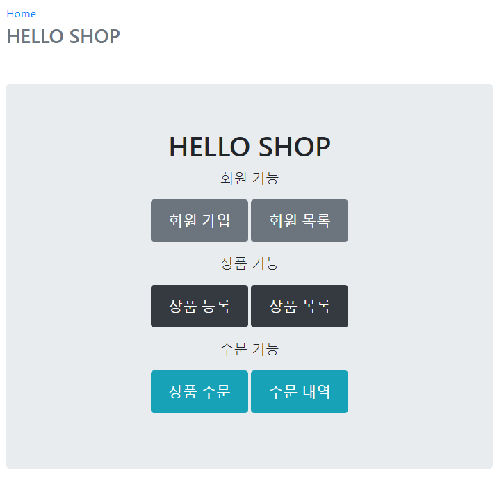

## Table of contents
{: .no_toc .text-delta }

1. TOC
{:toc}
---

# **테스트 케이스를 위한 설정**
-   테스트는 격리된 환경에서 실행하고 , 끝나면 데이터를 초기화하는 것이 좋다. 그런 면에서 **메모리 DB를 사용하는 것이 가장 이상적이다.**
-   추가로 테스트 케이스를 위한 스프링 환경과 , 일반적으로 애플리에키션을 실행하는 환경은 보통 다르므로 설정 파일을 다르게 사용하자
-   다음과 같이 간단하게 테스트용 설정 파일을 추가하면 된다.
-   test/resources/application.yml

```yaml
spring:
#  datasource:
#    url: jdbc:h2:mem:test
#    username: sa
#    password:
#    driver-class-name: org.h2.Driver
#
#  jpa:
#    hibernate:
#      ddl-auto: create
#    properties:
#      hibernate:
#        format_sql: true
logging.level:
  org.hibernate.SQL: debug
  org.hibernate.type: trace

  // #은 yml의 주석이다
```

-   이제 테스트에서 스프링을 실행하면 이 위치에 있는 설정 파일을 읽는다.
-   (만약 이 위치에 없으면 src/resources/application.yml을 읽는다)
-   스프링 부트는 datasource 설정이 없으면 기본적으로 메모리 DB를 사용하고 ,
-   driver-class도 현재 등록된 라이브러를 보고 찾아준다.
-   ddl-auto도 create-drop모드로 동작한다.
-   **따라서 데이터소스나 JPA관련된 별도의 추가 설정을 하지 않아도 된다.**

***

# **회원 도메인 개발**

## Repository
```java
@Repository
@RequiredArgsConstructor
public class MemberRepository {

    private final EntityManager em;

    public void save(Member member){
        em.persist(member);
    }

    public Member findOne(Long id){
        return em.find(Member.class , id);
    }

    public List<Member> findAll(){
        return em.createQuery("select m from Member m" , Member.class)
                .getResultList();
    }

    public List<Member> findByName(String name){
        return em.createQuery("select m from Member m where m.name = :name" , Member.class)
                .setParameter("name",name)
                .getResultList();
    }
}
```
-   **`@Repository`** : 스프링 빈으로 등록 , JPA 예외를 스프링 기반 예외로 예외 변환
-   **`@PersistenceContext`** : EntityManager 주입
-   **`@PersistenceUnit`** : EntityManagerFactory 주입

## Service

```java
@Service
@Transactional(readOnly = true)
//@Transactional을 메소드 레벨에 적용하여 readOnly를 구분하여주면 성능면에 이점이 많다.
@RequiredArgsConstructor
public class MemberService {

    private final MemberRepository memberRepository;

    // 회원 가입
    @Transactional(readOnly = false)
    public long join(Member member){
        validateDuplicateMember(member);
        memberRepository.save(member);
        return member.getId();
    }

    private void validateDuplicateMember(Member member) {
        // EXCEPTION 회원 중복 체크
        List<Member> members = memberRepository.findByName(member.getName());
        if(!members.isEmpty()){
            throw new IllegalStateException("이미 존재하는 회원입니다.");
        }
    }

    // 회원 전체 조회
    public List<Member> findMembers(){
        return memberRepository.findAll();
    }

    // 회원 단건 조회
    public Member findOne(Long memberId){
        return memberRepository.findOne(memberId);
    }
}
```

-   **`@Transactional` : 영속성 컨텍스트**
    -   readOnly=true 데이터의 변경이 없는 읽기 전용 메서드에 사용 (읽기 전용에는 다 적용)
    -   데이터베이스 드라이버가 지원하며 DB에서 성능 향상
-   **생성자 주입 방식을 권장**
    -   변경 불가능한 안전한 객체 생성 가능
    -   생성자가 하나면 `@Autowired`를 생략할 수 있다.
    -   `final` 키워드를 추가하면 컴파일 시점에 `memberRepository`를 설정하지 않는 오류를 체크할 수 있다.


## 기능 테스트
```java
@SpringBootTest
@Transactional
class MemberServiceTest {

    @Autowired
    MemberService memberService;
    @Autowired
    EntityManager em;

    @Test
    //@Rollback(false)
    // 테스트에서 Transactional은 Rollback 되기 때문에
    // Rollback을 false로 하여 commit되게 한다.
    public void 회원가입 () throws Exception {
        // given
        Member member = new Member();
        member.setName("jeong");

        // when
        Long saveId = memberService.join(member);

        // then
        //em.flush(); // Transactionl 떄문에 Rollback 되어야 하지만 강제로 반영
        Assert.assertEquals(member , memberService.findOne(saveId));
    }

    @Test
    public void 중복_회원_예외() throws Exception {
        // given
        Member member = new Member();
        member.setName("jeong1");

        Member member2 = new Member();
        member2.setName("jeong1");
        // when
        memberService.join(member);

        // then
        IllegalStateException exception =
                Assertions.assertThrows(IllegalStateException.class ,() -> memberService.join(member2));
        Assertions.assertEquals("이미 존재하는 회원입니다." , exception.getMessage());
    }
}
```

-   **`@SpringBootTest`** : 스프링 부트 띄우고 테스트 , 이게 없으면 `@Autowired` 다 실패
-   **`@Transactional`** : 반복 가능한 테스트 지원 , 각각의 테스트를 실행할 때 마다 트랜잭션을 시잔하고 테스트가 끝나면 트랜잭션을 강제로 롤백 , (이 어노테이션이 테스트 케이스에서 사용될 때만 롤백)

***

# **상품 도메인 개발**
-   **상품 등록**
-   **상품 목록 조회**
-   **상품 수정**

## Entity
```java
@Entity
@Getter @Setter
@Inheritance(strategy = InheritanceType.SINGLE_TABLE)
// 싱글 테이블 전략
@DiscriminatorColumn(name = "dtype")
public abstract class Item {

    @Id
    @GeneratedValue
    @Column(name = "item_id")
    private Long id;

    private String name;
    private int price;
    private int stockQuantity;

    @ManyToMany(mappedBy = "items")
    private List<Category> categories = new ArrayList<>();

    // == 비즈니스 로직 ==
    // 재고수량 증가
    public void addStock(int quantity){
        this.stockQuantity += quantity;
    }

    // 재고수량 감소
    public void removeStock(int quantity){
        int restStock = this.stockQuantity - quantity;
        if(restStock < 0){
            throw new NotEnoughStockException("need more stock");
        }
        this.stockQuantity = restStock;
    }
}
```

## Repository
```java
@Repository
@RequiredArgsConstructor
public class ItemRepository {

    private final EntityManager em;

    public void save(Item item){
        if(item.getId() == null){
            em.persist(item);
        }
        else{
            em.merge(item);
        }
    }

    public Item findOne(Long id){
        return em.find(Item.class , id);
    }

    public List<Item> findAll(){
        return em.createQuery("select i from Item i" , Item.class)
                .getResultList();
    }
}
```

## Service
```java
@Service
@Transactional(readOnly = true)
@RequiredArgsConstructor
public class ItemService {

    private final ItemRepository itemRepository;

    @Transactional
    public void saveItem(Item item){
        itemRepository.save(item);
    }

    public List<Item> findItems(){
        return itemRepository.findAll();
    }

    public Item findOne(Long id){
        return itemRepository.findOne(id);
    }
}
```

## Exception
```java
public class NotEnoughStockException extends RuntimeException{

    public NotEnoughStockException() {
        super();
    }

    public NotEnoughStockException(String message) {
        super(message);
    }

    public NotEnoughStockException(String message, Throwable cause) {
        super(message, cause);
    }

    public NotEnoughStockException(Throwable cause) {
        super(cause);
    }
}

```


***

# **주문 도메인 개발**
-   **상품 주문**
-   **주문 내역 조회**
-   **주문 취소**

## 주문 Entity
```java
@Entity
@Table(name = "orders")
@Getter
@Setter
@NoArgsConstructor(access = AccessLevel.PROTECTED)
// 객체 생성시 생성자를 protected하고 createOrder를 사용하여 Order를 생성하게 한다.
public class Order {
    @Id @GeneratedValue
    @Column(name = "order_id")
    private Long id;

    @ManyToOne(fetch = FetchType.LAZY)
    @JoinColumn(name = "member_id")
    private Member member;

    @OneToMany(mappedBy = "order" , cascade = CascadeType.ALL)
    private List<OrderItem> orderItems = new ArrayList<>();

    @OneToOne(fetch = FetchType.LAZY , cascade = CascadeType.ALL)
    @JoinColumn(name = "delivery_id")
    private Delivery delivery;

    private LocalDateTime orderDate;

    private OrderStatus status; // 주문상태 [ORDER , CANCEL]

    //== 연관관계 메서드 ==
    public void setMember(Member member){
        this.member = member;
        member.getOrders().add(this);
    }

    public void addOrderItem(OrderItem orderItem){
        orderItems.add(orderItem);
        orderItem.setOrder(this);
    }

    public void setDelivery(Delivery delivery){
        this.delivery = delivery;
        delivery.setOrder(this);
    }

    // == 생성 메서드 ==
    public static Order createOrder(Member member , Delivery delivery , OrderItem... orderItems){
        Order order = new Order();
        order.setMember(member);
        order.setDelivery(delivery);
        for(OrderItem orderItem : orderItems){
            order.addOrderItem(orderItem);
        }
        order.setStatus(OrderStatus.ORDER);
        order.setOrderDate(LocalDateTime.now());
        return order;
    }

    // == 비즈니스 로직 ==
    /**
     * 주문 취소
     */
    public void cancel(){
        if(delivery.getStatus() == DeliveryStatus.COMP){
            throw new IllegalStateException("이미 배송완료된 상품은 취소가 불가능합니다.");
        }
        this.setStatus(OrderStatus.CANCEL);
//        for(OrderItem orderItem : orderItems){
//            orderItem.cancel();
//        }
        orderItems.forEach(OrderItem::cancel);
    }

    // == 조회 로직 ==
    /**
     * 전체 주문 가격 조회
     */
    public int getTotalPrice(){
        int totalPrice = 0;
//        for(OrderItem orderItem : orderItems){
//            totalPrice += orderItem.getTotalPrice();
//        }
//        return totalPrice;
        return orderItems.stream().mapToInt(OrderItem::getTotalPrice).sum();
    }
}
```

## 주문 상품 Entity
```java
@Entity
@Getter
@Setter
@NoArgsConstructor(access = AccessLevel.PROTECTED)
// 객체 생성시 생성자를 protected하고 createOrderItem을 사용하여 OrderItem을 생성하게 한다.
public class OrderItem {

    @Id @GeneratedValue
    @Column(name ="order_item_id")
    private Long id;

    @ManyToOne(fetch = FetchType.LAZY)
    @JoinColumn(name = "item_id")
    private Item item;

    @ManyToOne(fetch = FetchType.LAZY)
    @JoinColumn(name = "order_id")
    private Order order;

    private int orderPrice;
    private int count;

    // == 생성 메서드 ==
    public static OrderItem createOrderItem(Item item , int orderPrice , int count){
        OrderItem orderItem = new OrderItem();
        orderItem.setItem(item);
        orderItem.setOrderPrice(orderPrice);
        orderItem.setCount(count);

        item.removeStock(count);
        return orderItem;
    }

    // == 비즈니스 로직 ==
    public void cancel() {
        getItem().addStock(count);
    }

    // == 조회 로직 ==

    /**
     * 주문 상품 전체 가격 조회
     * @return int
     */
    public int getTotalPrice() {
        return getOrderPrice() * count;
    }
}
```

## Repository

```java
@Repository
@RequiredArgsConstructor
public class OrderRepository {

    private final EntityManager em;

    public void save(Order order){
        em.persist(order);
    }

    public Order findOne(Long id){
        return em.find(Order.class , id);
    }

//    public List<Order> findAll(OrderSearch orderSearch){
//    }
}
```

## Service

```java
@Service
@Transactional(readOnly = true)
@RequiredArgsConstructor
public class OrderService {

    private final OrderRepository orderRepository;
    private final MemberRepository memberRepository;
    private final ItemRepository itemRepository;


    /**
     * 주문
     */
    @Transactional
    public Long order(Long memberId , Long itemId , int count){
        // 엔티티 조회
        Member member = memberRepository.findOne(memberId);
        Item item = itemRepository.findOne(itemId);

        // 배송 정보 생성
        Delivery delivery = new Delivery();
        delivery.setAddress(member.getAddress());

        // 주문상품 생성
        OrderItem orderItem = OrderItem.createOrderItem(item , item.getPrice() , count);

        // 주문 생성
        Order order = Order.createOrder(member , delivery , orderItem);

        // 주문 저장
        orderRepository.save(order);

        return order.getId();
    }

    /**
     * 주문 취소
     */
    @Transactional
    public void cancelOrder(Long orderId){
        Order order = orderRepository.findOne(orderId);
        order.cancel();
    }

    /**
     * 주문 검색
     */
//    public List<Order> findOrders(OrderSearch orderSearch){
//        return orderRepository.findAll();
//    }
}

```

## 기능 테스트

```java
@SpringBootTest
@Transactional
class OrderServiceTest {

    @Autowired
    EntityManager em;
    @Autowired
    OrderService orderService;
    @Autowired
    OrderRepository orderRepository;

    @Test
    public void 상품주문() throws Exception {
        // given
        Member member = createMember();

        Book book = createBook("시골 JPA", 10000, 10);

        int orderCount = 2;

        // when
        Long orderId = orderService.order(member.getId() , book.getId() , orderCount);

        // then
        Order getOrder = orderRepository.findOne(orderId);

        Assert.assertEquals("상품 주문시 상태는 ORDER" , OrderStatus.ORDER , getOrder.getStatus());
        Assert.assertEquals("주문한 상품 종류 수가 정확해야 한다." , 1 , getOrder.getOrderItems().size());
        Assert.assertEquals("주문 가격은 가격 * 수량이다." , 10000 * orderCount , getOrder.getTotalPrice());
        Assert.assertEquals("주문 수량만큼 재고가 줄어야한다." , 8 , book.getStockQuantity());

    }

    @Test
    public void 주문취소() throws Exception {
        // given
        Member member = createMember();
        Item item = createBook("시골 JPA", 10000, 10);

        int orderCount = 2;

        Long orderId = orderService.order(member.getId() , item.getId() , orderCount);
        // when
        orderService.cancelOrder(orderId);

        // then
        Order getOrder = orderRepository.findOne(orderId);

        Assert.assertEquals("주문 취소시 상태는 CANCEL이다" , OrderStatus.CANCEL , getOrder.getStatus());
        Assert.assertEquals("주문이 취소된 상품은 그만큼 재고가 증가해야 한다." , 10 , item.getStockQuantity());
    }

    @Test
    public void 상품주문_재고수량초과() throws Exception {
        // given
        Member member = createMember();

        Item item = createBook("시골 JPA", 10000, 10);

        int orderCount = 11;
        // when

        // then
        final NotEnoughStockException notEnoughStockException = Assertions.assertThrows(NotEnoughStockException.class,
                () -> orderService.order(member.getId(), item.getId(), orderCount),
                "재고수량이 부족 하면 예외가 발생 한다."
        );
        //        System.out.println(notEnoughStockException.getMessage());//need more stock
        //        assertEquals(notEnoughStockException.getMessage(), "need more Stock");
    }

    private Member createMember() {
        Member member = new Member();
        member.setName("회원1");
        member.setAddress(new Address("서울" , "은평구" , "145151"));
        em.persist(member);
        return member;
    }

    private Book createBook(String name, int price, int stockQuantity) {
        Book book = new Book();
        book.setName(name);
        book.setPrice(price);
        book.setStockQuantity(stockQuantity);
        em.persist(book);
        return book;
    }
}
```

## 주문 검색 기능

✅ **JPA에서 동적 쿼리를 어떻게 해결해야 하는가?**
{: .fh-default .fs-4 }
✅ **목표 쿼리 : SELECT o FROM Order o JOIN o.member m  WHERE o.status = :status AND m.name LIKE :name**
{: .fh-default .fs-4 }

```java
    // Querydsl
    public List<Order> findAllByQuerydsl_BestPractice(OrderSearch orderSearch){
        // Querydsl 소개 강의에서 적용 예정
        return null;
    }

    // JPA Criteria - JPA가 제공
    public List<Order> findAllByCriteria_BadPractice(OrderSearch orderSearch){
        CriteriaBuilder cb = em.getCriteriaBuilder();
        CriteriaQuery<Order> cq = cb.createQuery(Order.class);

        Root<Order> o = cq.from(Order.class);
        Join<Object , Object> m = o.join("member" , JoinType.INNER);

        List<Predicate> criteria = new ArrayList<>();

        // 주문 상태 검색
        if(orderSearch.getOrderStatus() != null){
            Predicate status = cb.equal(o.get("status") , orderSearch.getOrderStatus());
            criteria.add(status);
        }
        // 회원 이름 검색
        if(StringUtils.hasText(orderSearch.getMemberName())){
            Predicate name = cb.like(m.<String>get("name") , "%" + orderSearch.getMemberName() + "%");
            criteria.add(name);
        }

        cq.where(cb.and(criteria.toArray(new Predicate[criteria.size()])));
        TypedQuery<Order> query = em.createQuery(cq).setMaxResults(1000);

        return query.getResultList();
    }

    public List<Order> findAllByString_BadPractice(OrderSearch orderSearch){
        //language=JPAQL
        String jpql = "select o From Order o join o.member m";
        boolean isFirstCondition = true;
        //주문 상태 검색
        if (orderSearch.getOrderStatus() != null) {
            if (isFirstCondition) {
                jpql += " where";
                isFirstCondition = false;
            } else {
                jpql += " and";
            }
            jpql += " o.status = :status";
        }
        //회원 이름 검색
        if (StringUtils.hasText(orderSearch.getMemberName())) {
            if (isFirstCondition) {
                jpql += " where";
                isFirstCondition = false;
            } else {
                jpql += " and";
            }
            jpql += " m.name like :name";
        }
        TypedQuery<Order> query = em.createQuery(jpql, Order.class)
                .setMaxResults(1000); //최대 1000건
        if (orderSearch.getOrderStatus() != null) {
            query = query.setParameter("status", orderSearch.getOrderStatus());
        }
        if (StringUtils.hasText(orderSearch.getMemberName())) {
            query = query.setParameter("name", orderSearch.getMemberName());
        }
        return query.getResultList();
    }
```

-   **위 BadPractice들의 대안으로 Querydsl이 제시 됐다.**
-   **Querydsl 소개 파트에서 적용 예정이다.**

> 📌
> **주문 서비스의 [주문] 과 [주문취소] 메서드를 보면 비즈니스 로직 대부분이 엔티티에 있다.**
>
> 서비스 계층은 단순히 엔티티에 필요한 요청을 위임하는 역할을 한다.
> 이처럼 엔티티가 비즈니스 로직을 가지고 객체 지향의 특성을 적극 활용하는 것을 [도메인 모델 패턴](https://martinfowler.com/eaaCatalog/domainModel.html) 이라 한다.
>
> 반대로 엔티티에는 비즈니스 로직이 거의 없고 서비스 계층에서 대부분의 비즈니스 로직을 처리하는 것을 [트랜잭션 스크립트 패턴](https://martinfowler.com/eaaCatalog/transactionScript.html) 이라 한다.

> 📌
> **Q.** 왜 주문내역은 OrderService를 만들어서 save() 메소드에 적지 않고 Order에 직접 적어주는건가요?
> Order, OrderRepository , OrderItem, OrderItemRepository 처럼 엔티티마다 리포지토리를 각각 만들어서 사용하지 않고, OrderItem은 왜 OrderItemRepository가 없고, Order엔티티를 통해서 관리했나요?
>
> **A.** 이번 프로젝트는 Order가 OrderItem을 관리하도록 설계했습니다.
> **OrderItem을 저장하거나 관리하려면 별도의 리포지토리가 아니라, 항상 Order를 통해서 관리하는 하도록 설계를 제약했습니다.**
>
> 개념상 Order, OrderItem을 하나로 묶고(Aggregate), Order를 통해서만 OrderItem에 접근하게 강제했습니다.
> **이렇게 설계를 하면 외부에서는 Order, OrderItem 중에 Order만 알면 되기 때문에, 도메인을 좀 더 덜 복잡하게 설계할 수 있습니다. 이렇게 그룹을 대표하는 엔티티를 도메인 주도 설계(DDD)에서는 aggregate root(에그리게잇 루트) 엔티티라 합니다.**
>
> 이제 OrderItem의 생명주기는 모두 Order에 달려 있습니다. 심지어 OrderItem은 리포지토리도 없습니다. 모두 Order를 통해서 관리되는 것이지요. 물론 이런 생명주기는 Cascade 기능을 통해서 관리됩니다.
> 이번 예제에서는 이런 개념을 코드로 보여드리려고 이렇게 설계를 했습니다.


***

# **웹 계층 개발**

## **홈 화면과 레이아웃**



## **Home**

### HomeController

```java
@Controller
@Slf4j
public class HomeController {

    // @Slf4j 대체
    // Logger log = LoggerFactory.getLogger(getClass());

    @RequestMapping("/")
    public String home(){
        log.info("home controller");
        return "home";
    }
}
```

### home.html

```html
<!DOCTYPE HTML>
<html xmlns:th="http://www.thymeleaf.org">
<head th:replace="fragments/header :: header">
    <title>Hello</title>
    <meta http-equiv="Content-Type" content="text/html; charset=UTF-8" />
</head>
<body>
<div class="container">
    <div th:replace="fragments/bodyHeader :: bodyHeader" />
    <div class="jumbotron">
        <h1>HELLO SHOP</h1>
        <p class="lead">회원 기능</p>
        <p>
            <a class="btn btn-lg btn-secondary" href="/members/new">회원 가입</a>
            <a class="btn btn-lg btn-secondary" href="/members">회원 목록</a>
        </p>
        <p class="lead">상품 기능</p>
        <p>
            <a class="btn btn-lg btn-dark" href="/items/new">상품 등록</a>
            <a class="btn btn-lg btn-dark" href="/items">상품 목록</a>
        </p>
        <p class="lead">주문 기능</p>
        <p>
            <a class="btn btn-lg btn-info" href="/order">상품 주문</a>
            <a class="btn btn-lg btn-info" href="/orders">주문 내역</a>
        </p>
    </div>
    <div th:replace="fragments/footer :: footer" />
</div> <!-- /container -->
</body>
</html>
```

***

## **Member**

### MemberController

```java
@Controller
@RequiredArgsConstructor
public class MemberController {

    private final MemberService memberService;

    @GetMapping("/members/new")
    public String createForm(Model model){
        model.addAttribute("memberForm" , new MemberForm());
        return "members/createMemberForm";
    }

    @PostMapping("/members/new")
    public String create(@Valid MemberForm form , BindingResult result){
        if(result.hasErrors()){
            return "members/createMemberForm";
        }
        Address address = new Address(form.getCity(), form.getStreet(), form.getZipcode());
        Member member = new Member();
        member.setName(form.getName());
        member.setAddress(address);

        memberService.join(member);
        return "redirect:/";
    }

    @GetMapping("/members")
    public String list(Model model){
        model.addAttribute("members" , memberService.findMembers());
        return "members/memberList";
    }

}
```

### CreateMemberForm.html

```html
<!DOCTYPE HTML>
<html xmlns:th="http://www.thymeleaf.org">
<head th:replace="fragments/header :: header" />
<style>
    .fieldError {
        border-color: #bd2130;
    }
</style>
<body>
<div class="container">
    <div th:replace="fragments/bodyHeader :: bodyHeader"/>
    <form role="form" action="/members/new" th:object="${memberForm}" method="post">
        <div class="form-group">
            <label th:for="name">이름</label>
            <input type="text" th:field="*{name}" class="form-control"
                   placeholder="이름을 입력하세요"
                   th:class="${#fields.hasErrors('name')}? 'form-controlfieldError' : 'form-control'">
            <p th:if="${#fields.hasErrors('name')}"
               th:errors="*{name}">Incorrect date</p>
        </div>
        <div class="form-group">
            <label th:for="city">도시</label>
            <input type="text" th:field="*{city}" class="form-control"
                   placeholder="도시를 입력하세요">
        </div>
        <div class="form-group">
            <label th:for="street">거리</label>
            <input type="text" th:field="*{street}" class="form-control"
                   placeholder="거리를 입력하세요">
        </div>
        <div class="form-group">
            <label th:for="zipcode">우편번호</label>
            <input type="text" th:field="*{zipcode}" class="form-control"
                   placeholder="우편번호를 입력하세요">
        </div>
        <button type="submit" class="btn btn-primary">Submit</button>
    </form>
    <br/>
    <div th:replace="fragments/footer :: footer" />
</div> <!-- /container -->
</body>
</html>
```

### MemberList.html

```html
<!DOCTYPE HTML>
<html xmlns:th="http://www.thymeleaf.org">
<head th:replace="fragments/header :: header" />
<body>
<div class="container">
    <div th:replace="fragments/bodyHeader :: bodyHeader" />
    <div>
        <table class="table table-striped">
            <thead>
            <tr>
                <th>#</th>
                <th>이름</th>
                <th>도시</th>
                <th>주소</th>
                <th>우편번호</th>
            </tr>
            </thead>
            <tbody>
            <tr th:each="member : ${members}">
                <td th:text="${member.id}"></td>
                <td th:text="${member.name}"></td>
                <td th:text="${member.address?.city}"></td>
                <td th:text="${member.address?.street}"></td>
                <td th:text="${member.address?.zipcode}"></td>
            </tr>
            </tbody>
        </table>
    </div>
    <div th:replace="fragments/footer :: footer" />
</div> <!-- /container -->
</body>
</html>
```

**타임리프에서 ?를 사용하면 null 을 무시한다**

***

## **Item**

### ItemController
```java
@Controller
@RequiredArgsConstructor
public class ItemController {

    private final ItemService itemService;

    @GetMapping("/items/new")
    public String createForm(Model model){
        model.addAttribute("form" , new BookForm());
        return "items/createItemForm";
    }

    @PostMapping("/items/new")
    public String create(BookForm form , BindingResult result){
        if(result.hasErrors()){
            return "items/createItemForm";
        }
        Book book = new Book();
        book.setName(form.getName());
        book.setPrice(form.getPrice());
        book.setStockQuantity(form.getStockQuantity());
        book.setAuthor(form.getAuthor());
        book.setIsbn(form.getIsbn());

        itemService.saveItem(book);
        return "redirect:/";
    }

    @GetMapping("/items")
    public String list(Model model){
        List<Item> items = itemService.findItems();
        model.addAttribute("items" , items);
        return "items/itemList";
    }

    @GetMapping("/items/{itemId}/edit")
    public String updateItemForm(@PathVariable("itemId") Long itemId , Model model){
        Book item = (Book) itemService.findOne(itemId);

        BookForm form = new BookForm();
        form.setId(item.getId());
        form.setName(item.getName());
        form.setPrice(item.getPrice());
        form.setStockQuantity(item.getStockQuantity());
        form.setAuthor(item.getAuthor());
        form.setIsbn(item.getIsbn());

        model.addAttribute("form" , form);

        return "items/updateItemForm";
    }

    @PostMapping("/items/{itemId}/edit")
    public String updateItem(@PathVariable String itemId , @ModelAttribute("form") BookForm form){

        Book book = new Book();
        book.setId(form.getId());
        book.setName(form.getName());
        book.setPrice(form.getPrice());
        book.setStockQuantity(form.getStockQuantity());
        book.setAuthor(form.getAuthor());
        book.setIsbn(form.getIsbn());

        itemService.saveItem(book);
        return "redirect:/items";
    }
}
```

### CreateItemForm.html
​
```html
<!DOCTYPE HTML>
<html xmlns:th="http://www.thymeleaf.org">
<head th:replace="fragments/header :: header" />
<body>
<div class="container">
    <div th:replace="fragments/bodyHeader :: bodyHeader"/>
    <form th:action="@{/items/new}" th:object="${form}" method="post">
        <div class="form-group">
            <label th:for="name">상품명</label>
            <input type="text" th:field="*{name}" class="form-control"
                   placeholder="이름을 입력하세요">
        </div>
        <div class="form-group">
            <label th:for="price">가격</label>
            <input type="number" th:field="*{price}" class="form-control"
                   placeholder="가격을 입력하세요">
        </div>
        <div class="form-group">
            <label th:for="stockQuantity">수량</label>
            <input type="number" th:field="*{stockQuantity}" class="formcontrol" placeholder="수량을 입력하세요">
        </div>
        <div class="form-group">
            <label th:for="author">저자</label>
            <input type="text" th:field="*{author}" class="form-control" placeholder="저자를 입력하세요">
        </div>
        <div class="form-group">
            <label th:for="isbn">ISBN</label>
            <input type="text" th:field="*{isbn}" class="form-control"
                   placeholder="ISBN을 입력하세요">
        </div>
        <button type="submit" class="btn btn-primary">Submit</button>
    </form>
    <br/>
    <div th:replace="fragments/footer :: footer" />
</div> <!-- /container -->
</body>
</html>
```
​
### itemList.html
​
```html
<!DOCTYPE HTML>
<html xmlns:th="http://www.thymeleaf.org">
<head th:replace="fragments/header :: header" />
<body>
<div class="container">
    <div th:replace="fragments/bodyHeader :: bodyHeader"/>
    <div>
        <table class="table table-striped">
            <thead>
            <tr>
                <th>#</th>
                <th>상품명</th>
                <th>가격</th>
                <th>재고수량</th>
                <th></th>
            </tr>
            </thead>
            <tbody>
            <tr th:each="item : ${items}">
                <td th:text="${item.id}"></td>
                <td th:text="${item.name}"></td>
                <td th:text="${item.price}"></td>
                <td th:text="${item.stockQuantity}"></td>
                <td>
                    <a href="#" th:href="@{/items/{id}/edit (id=${item.id})}"
                       class="btn btn-primary" role="button">수정</a>
                </td>
            </tr>
            </tbody>
        </table>
    </div>
    <div th:replace="fragments/footer :: footer"/>
</div> <!-- /container -->
</body>
</html>
```
​
### updateItemForm.html
​
```html
<!DOCTYPE HTML>
<html xmlns:th="http://www.thymeleaf.org">
<head th:replace="fragments/header :: header" />
<body>
<div class="container">
    <div th:replace="fragments/bodyHeader :: bodyHeader"/>
    <form th:object="${form}" method="post">
        <!-- id -->
        <input type="hidden" th:field="*{id}" />
        <div class="form-group">
            <label th:for="name">상품명</label>
            <input type="text" th:field="*{name}" class="form-control" placeholder="이름을 입력하세요" />
        </div>
        <div class="form-group">
            <label th:for="price">가격</label>
            <input type="number" th:field="*{price}" class="form-control" placeholder="가격을 입력하세요" />
        </div>
        <div class="form-group">
            <label th:for="stockQuantity">수량</label>
            <input type="number" th:field="*{stockQuantity}" class="form-control" placeholder="수량을 입력하세요" />
        </div>
        <div class="form-group">
            <label th:for="author">저자</label>
            <input type="text" th:field="*{author}" class="form-control" placeholder="저자를 입력하세요" />
        </div>
        <div class="form-group">
            <label th:for="isbn">ISBN</label>
            <input type="text" th:field="*{isbn}" class="form-control" placeholder="ISBN을 입력하세요" />
        </div>
        <button type="submit" class="btn btn-primary">Submit</button>
    </form>
    <div th:replace="fragments/footer :: footer" />
</div> <!-- /container -->
</body>
</html>
```

***

## **Order**

### OrderController
```java
@Controller
@RequiredArgsConstructor
public class OrderController {

    private final OrderService orderService;
    private final MemberService memberService;
    private final ItemService itemService;

    @GetMapping("/order")
    public String createForm(Model model){
        List<Member> members = memberService.findMembers();
        List<Item> items = itemService.findItems();

        model.addAttribute("members" , members);
        model.addAttribute("items" , items);

        return "order/orderForm";
    }

    @PostMapping("/order")
    public String order(@RequestParam("memberId") Long memberId ,
                        @RequestParam("itemId") Long itemId ,
                        @RequestParam("count") int count){

        orderService.order(memberId , itemId , count);
        return "redirect:/orders";
    }

    @GetMapping("/orders")
    public String orderList(@ModelAttribute("orderSearch") OrderSearch orderSearch , Model model){
        List<Order> orders =  orderService.findOrders(orderSearch);
        model.addAttribute("orders" , orders);
        return "order/orderList";
    }

    @PostMapping("/orders/{orderId}/cancel")
    public String cancelOrder(@PathVariable("orderId") Long orderId){
        orderService.cancelOrder(orderId);
        return "redirect:/orders";
    }
}
```

### orderForm.html

```html
<!DOCTYPE HTML>
<html xmlns:th="http://www.thymeleaf.org">
<head th:replace="fragments/header :: header" />
<body>
<div class="container">
    <div th:replace="fragments/bodyHeader :: bodyHeader"/>
    <form role="form" action="/order" method="post">
        <div class="form-group">
            <label for="member">주문회원</label>
            <select name="memberId" id="member" class="form-control">
                <option value="">회원선택</option>
                <option th:each="member : ${members}"
                        th:value="${member.id}"
                        th:text="${member.name}" >
                </option>
            </select>
        </div>
        <div class="form-group">
            <label for="item">상품명</label>
            <select name="itemId" id="item" class="form-control">
                <option value="">상품선택</option>
                <option th:each="item : ${items}"
                        th:value="${item.id}"
                        th:text="${item.name}">
                </option>
            </select>
        </div>
        <div class="form-group">
            <label for="count">주문수량</label>
            <input type="number" name="count" class="form-control" id="count" placeholder="주문 수량을 입력하세요">
        </div>
        <button type="submit" class="btn btn-primary">Submit</button>
    </form>
    <br/>
    <div th:replace="fragments/footer :: footer" />
</div> <!-- /container -->
</body>
</html>
```

### orderList.html

```html
<!DOCTYPE HTML>
<html xmlns:th="http://www.thymeleaf.org">
<head th:replace="fragments/header :: header"/>
<body>
<div class="container">
    <div th:replace="fragments/bodyHeader :: bodyHeader"/>
    <div>
        <div>
            <form th:object="${orderSearch}" class="form-inline">
                <div class="form-group mb-2">
                    <input type="text" th:field="*{memberName}" class="form-control" placeholder="회원명"/>
                </div>
                <div class="form-group mx-sm-1 mb-2">
                    <select th:field="*{orderStatus}" class="form-control">
                        <option value="">주문상태</option>
                        <option th:each="status : ${T(jpabook.jpashop.domain.OrderStatus).values()}"
                                th:value="${status}"
                                th:text="${status}">option
                        </option>
                    </select>
                </div>
                <button type="submit" class="btn btn-primary mb-2">검색</button>
            </form>
        </div>
        <table class="table table-striped">
            <thead>
            <tr>
                <th>#</th>
                <th>회원명</th>
                <th>대표상품 이름</th>
                <th>대표상품 주문가격</th>
                <th>대표상품 주문수량</th>
                <th>상태</th>
                <th>일시</th>
                <th></th>
            </tr>
            </thead>
            <tbody>
            <tr th:each="item : ${orders}">
                <td th:text="${item.id}"></td>
                <td th:text="${item.member.name}"></td>
                <td th:text="${item.orderItems[0].item.name}"></td>
                <td th:text="${item.orderItems[0].orderPrice}"></td>
                <td th:text="${item.orderItems[0].count}"></td>
                <td th:text="${item.status}"></td>
                <td th:text="${item.orderDate}"></td>
                <td>
                    <a th:if="${item.status.name() == 'ORDER'}" href="#"
                       th:href="'javascript:cancel('+${item.id}+')'"
                       class="btn btn-danger">CANCEL</a>
                </td>
            </tr>
            </tbody>
        </table>
    </div>
    <div th:replace="fragments/footer :: footer"/>
</div> <!-- /container -->
</body>
<script>
    function cancel(id) {
        var form = document.createElement("form");
        form.setAttribute("method", "post");
        form.setAttribute("action", "/orders/" + id + "/cancel");
        document.body.appendChild(form);
        form.submit();
    }
</script>
</html>
```

**자세한 코드는**
[jeongcode/springboot-jpa-uses](https://github.com/jeongcode/springboot-jpa-uses)

***

# 📌 **폼 객체 vs 엔티티 직접 사용**

-   요구사항이 정말 단순할 때는 폼 객체(MemberForm) 없이 엔티티를 직접 등록과 수정화면에서 사용해도 된다.
-   하지만 화면 요구사항이 복잡해지기 시작하면 , 엔티티에 화면을 처리하기 위한 기능이 점점 증가한다.
-   결과적으로 엔티티는 점점 화면에 종속적으로 변하고 , 이렇게 화면 기능 때문에 지저분해진 엔티티는 결국 유지보수하기 어렵다.
-   **실무에서 엔티티는 핵심 비즈니스 로직만 가지고 있고 , 화면을 위한 로직은 없어야 한다.**
-   화면이나 API에 맞는 폼 객체나 DTO를 사용하자. 그래서 화면이나 API 요구사항을 이것들로 처리하고 , 엔티티는 최대한 순수하게 유지하자

# ✍
-   **setter를 쓰기보다 , static 메소드 ( 정적 팩토리 메서드 패턴 ) 를 사용하는게 좋은 이유**
    - [정적 팩토리 메서드(static factory method)<br>static 메서드로 객체 생성을 캡슐화한다](https://johngrib.github.io/wiki/static-factory-method-pattern/)

-   **javax.validation**
    -   `@Valid`
    -   `@NotEmpty`
-   **BindingResult**

- [Thymeleaf Page Layouts - Thymeleaf](https://www.thymeleaf.org/doc/articles/layouts.html)
