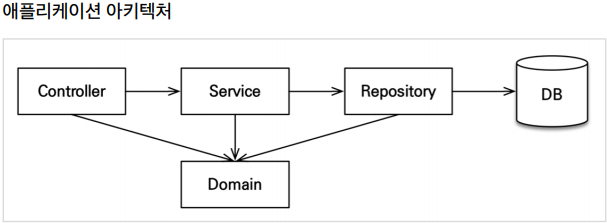
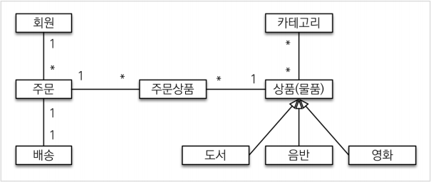
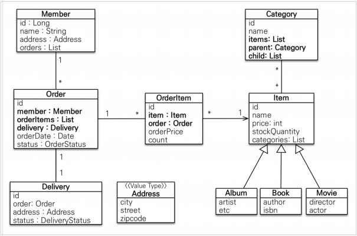
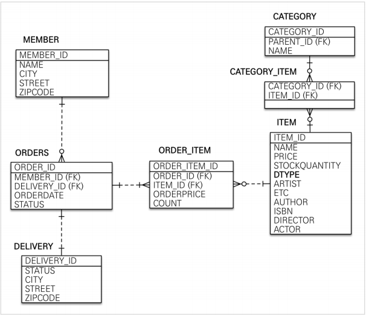

## Table of contents
{: .no_toc .text-delta }

1. TOC
{:toc}
---

# **애플리케이션 아키텍처**


 **계층형 구조 사용**
-   **controller , web** : 웹 계층
-   **service** : 비즈니스 로직 , 트랜잭션 처리
-   **repository** : JPA를 직접 사용하는 계층 , 엔티티 매니저 사용
-   **domain** : 엔티티가 모여있는 계층 , 모든 계층에서 사용

**패키지 구조**
-   jpabook.jpashop
    -   domain
    -   exception
    -   repository
    -   service
    -   web

***

# **연관관계 매핑 분석**

-   **회원 기능**
    -   회원 등록
    -   회원 조회
-   **상품 기능**
    -   상품 등록
    -   상품 수정
    -   상품 조회
-   **주문 기능**
    -   상품 주문
    -   주문 내역 조회
    -   주문 취소
-   **기타 요구사항**
    -   상품은 재고관리가 필요하다.
    -   상품의 종류는 도서 , 음반 , 영화가 있다.
    -   상품을 카테고리로 구분할 수 있다.
    -   상품 주문시 배송 정보를 입력할 수 있다.




> ✋ **실무에서는 회원이 주문을 참조하지 않고 , 주문이 회원을 참조하는 것으로 충분하다.**



-   **회원과 주문**
    -   일대다 , 다대일의 양방향 관계다. 따라서 연관관계의 주인을 정해야하는데 , 외래키가 있는 주문을 연관관계의 주인으로 정하는것이 좋다. 
-   **주문상품과 주문**
    -   다대일 양방향 관계다. 외래 키가 주문상품에 있으므로 주문상품이 연관관계의 주인이다.
-   **주문상품과 상품**
    -   다대일 단방향 관계다.
-   **주문과 배송**
    -   일대일 양방향 관계다.
-   **카테고리와 상품**
    -   `@ManyToMany`를 사용해서 매핑한다.
    -   <span style="color:red; font-weight:bold">실무에서 `@ManyToMany`를 사용하지는 말자.</span>

***

# **엔티티 클래스 개발**

> ✋ **실무에서는 가급적 Getter는 열어두고 , Setter는 꼭 필요한 경우에만 사용하는 것을 추천**

## **Member**
```java
@Entity
@Getter
@Setter
public class Member {
    @Id @GeneratedValue
    @Column(name = "member_id")
    private Long id;

    private String name;

    @Embedded
    private Address address;

    @OneToMany(mappedBy = "member")
    // Order 테이블(객체)의 member에 맵핑 되었다.
    private List<Order> orders = new ArrayList<>();
}
```

## **Address**
```java
@Embeddable
@Getter
public class Address {

    private String city;
    private String street;
    private String zipcode;

    protected Address() {
    }

    public Address(String city, String street, String zipcode) {
        this.city = city;
        this.street = street;
        this.zipcode = zipcode;
    }
}

```

## **Order**

```java
@Entity
@Table(name = "orders")
@Getter
@Setter
public class Order {
    @Id @GeneratedValue
    @Column(name = "order_id")
    private Long id;

    @ManyToOne(fetch = FetchType.LAZY)
    @JoinColumn(name = "member_id")
    private Member member;

    @OneToMany(mappedBy = "order" , cascade = CascadeType.ALL)
    private List<OrderItem> orderItems = new ArrayList<>();

    @OneToOne(fetch = FetchType.LAZY , cascade = CascadeType.ALL)
    @JoinColumn(name = "delivery_id")
    private Delivery delivery;

    private LocalDateTime orderDate;

    private OrderStatus status; // 주문상태 [ORDER , CANCEL]

        //== 연관관계 메서드 ==
    public void setMember(Member member){
        this.member = member;
        member.getOrders().add(this);
    }

    public void addOrderItem(OrderItem orderItem){
        orderItems.add(orderItem);
        orderItem.setOrder(this);
    }

    public void setDelivery(Delivery delivery){
        this.delivery = delivery;
        delivery.setOrder(this);
    }
}
```

## **OrderState**
```java
public enum OrderStatus {
    ORDER , CANCEL
}

```

## **OrderItem**
```java
@Entity
@Getter
@Setter
public class OrderItem {

    @Id @GeneratedValue
    @Column(name ="order_item_id")
    private Long id;

    @ManyToOne(fetch = FetchType.LAZY)
    @JoinColumn(name = "item_id")
    private Item item;

    @ManyToOne(fetch = FetchType.LAZY)
    @JoinColumn(name = "order_id")
    private Order order;

    private int orderPrice;
    private int count;
}
```

## **Delivery**
```java
@Entity
@Getter @Setter
public class Delivery {

    @Id @GeneratedValue
    @Column(name = "delivery_id")
    private Long id;

    @OneToOne(mappedBy = "delivery" , fetch = FetchType.LAZY)
    private Order order;

    @Embedded
    private Address address;

    @Enumerated(EnumType.STRING)
    // @Enumerated(EnumType.ORDINAL) ORDINAL은 숫자로 들어가니 꼭 STRING으로만 쓰자
    // Enum이 추가되어 숫자가 밀릴 가능성이 있다.
    private DeliveryStatus status; // READY , COMP
}
```

## **DeliveryStatus**

```java
public enum DeliveryStatus {
    READY , COMP
}
```

## **Item**

```java
@Entity
@Getter @Setter
@Inheritance(strategy = InheritanceType.SINGLE_TABLE)
// 싱글 테이블 전략
@DiscriminatorColumn(name = "dtype")
public abstract class Item {

    @Id
    @GeneratedValue
    @Column(name = "item_id")
    private Long id;

    private String name;
    private int price;
    private int stockQuantity;

    @ManyToMany(mappedBy = "items")
    private List<Category> categories = new ArrayList<>();
}
```

### Album

```java
@Entity
@Getter @Setter
@DiscriminatorValue("A")
public class Album extends Item {

    private String artist;
    private String etc;
}
```

### Book

```java
@Entity
@Getter @Setter
@DiscriminatorValue("B")
public class Book extends Item {

    private String author;
    private String isbn;
}
```

### Movie

```java
@Entity
@Getter @Setter
@DiscriminatorValue("M")
public class Movie extends Item{

    private String director;
    private String actor;
}

```

## **Category** , **CategoryItem**

```java
@Entity
@Getter @Setter
public class Category {

    @Id @GeneratedValue
    @Column(name = "category_id")
    private Long id;

    private String name;

    @ManyToMany
    @JoinTable(name = "category_item" ,
            joinColumns = @JoinColumn(name = "category_id"),
            inverseJoinColumns = @JoinColumn(name = "item_id"))
    private List<Item> items = new ArrayList<>();

    @ManyToOne(fetch = FetchType.LAZY)
    @JoinColumn(name = "parent_id")
    private Category parent;

    @OneToMany(mappedBy = "parent")
    private List<Category> child = new ArrayList<>();

    // == 연관관계 메서드 ==
    public void addChildCategory(Category child){
        this.child.add(child);
        child.setParent(this);
    }
}

```

## **테이블 생성**

```sql
2021-01-30 17:38:24.223  INFO 5828 --- [  restartedMain] p6spy                                    : #1611995904223 | took 1ms | statement | connection 3| url jdbc:h2:tcp://localhost/~/jpashop

    create table category (
       category_id bigint not null,
        name varchar(255),
        parent_id bigint,
        primary key (category_id)
    )
2021-01-30 17:38:24.225  INFO 5828 --- [  restartedMain] p6spy                                    : #1611995904225 | took 1ms | statement | connection 3| url jdbc:h2:tcp://localhost/~/jpashop

    create table category_item (
       category_id bigint not null,
        item_id bigint not null
    )
2021-01-30 17:38:24.229  INFO 5828 --- [  restartedMain] p6spy                                    : #1611995904229 | took 3ms | statement | connection 3| url jdbc:h2:tcp://localhost/~/jpashop

    create table delivery (
       delivery_id bigint not null,
        city varchar(255),
        street varchar(255),
        zipcode varchar(255),
        status varchar(255),
        primary key (delivery_id)
    );
2021-01-30 17:38:24.232  INFO 5828 --- [  restartedMain] p6spy                                    : #1611995904232 | took 1ms | statement | connection 3| url jdbc:h2:tcp://localhost/~/jpashop

    create table item (
       dtype varchar(31) not null,
        item_id bigint not null,
        name varchar(255),
        price integer not null,
        stock_quantity integer not null,
        artist varchar(255),
        etc varchar(255),
        author varchar(255),
        isbn varchar(255),
        actor varchar(255),
        director varchar(255),
        primary key (item_id)
    );
2021-01-30 17:38:24.235  INFO 5828 --- [  restartedMain] p6spy #1611995904235 | took 1ms | statement | connection 3| url jdbc:h2:tcp://localhost/~/jpashop

    create table member (
       member_id bigint not null,
        city varchar(255),
        street varchar(255),
        zipcode varchar(255),
        name varchar(255),
        primary key (member_id)
    );
2021-01-30 17:38:24.239  INFO 5828 --- [  restartedMain] p6spy #1611995904239 | took 2ms | statement | connection 3| url jdbc:h2:tcp://localhost/~/jpashop

    create table order_item (
       order_item_id bigint not null,
        count integer not null,
        order_price integer not null,
        item_id bigint,
        order_id bigint,
        primary key (order_item_id)
    );
2021-01-30 17:38:24.243  INFO 5828 --- [  restartedMain] p6spy #1611995904243 | took 2ms | statement | connection 3| url jdbc:h2:tcp://localhost/~/jpashop

    create table orders (
       order_id bigint not null,
        order_date timestamp,
        status integer,
        delivery_id bigint,
        member_id bigint,
        primary key (order_id)
    );
2021-01-30 17:38:24.253  INFO 5828 --- [  restartedMain] p6spy #1611995904253 | took 8ms | statement | connection 3| url jdbc:h2:tcp://localhost/~/jpashop

    alter table category
       add constraint FK2y94svpmqttx80mshyny85wqr
       foreign key (parent_id)
       references category

2021-01-30 17:38:24.259  INFO 5828 --- [  restartedMain] p6spy #1611995904259 | took 2ms | statement | connection 3| url jdbc:h2:tcp://localhost/~/jpashop

    alter table category_item
       add constraint FKcq2n0opf5shyh84ex1fhukcbh
       foreign key (category_id)
       references category

2021-01-30 17:38:24.263  INFO 5828 --- [  restartedMain] p6spy #1611995904263 | took 3ms | statement | connection 3| url jdbc:h2:tcp://localhost/~/jpashop

    alter table order_item
       add constraint FKija6hjjiit8dprnmvtvgdp6ru
       foreign key (item_id)
       references item

2021-01-30 17:38:24.267  INFO 5828 --- [  restartedMain] p6spy  #1611995904267 | took 2ms | statement | connection 3| url jdbc:h2:tcp://localhost/~/jpashop

    alter table order_item
       add constraint FKt4dc2r9nbvbujrljv3e23iibt
       foreign key (order_id)
       references orders

2021-01-30 17:38:24.271  INFO 5828 --- [  restartedMain] p6spy #1611995904271 | took 4ms | statement | connection 3| url jdbc:h2:tcp://localhost/~/jpashop

    alter table orders
       add constraint FKtkrur7wg4d8ax0pwgo0vmy20c
       foreign key (delivery_id)
       references delivery

2021-01-30 17:38:24.276  INFO 5828 --- [  restartedMain] p6spy #1611995904276 | took 3ms | statement | connection 3| url jdbc:h2:tcp://localhost/~/jpashop

    alter table orders
       add constraint FKpktxwhj3x9m4gth5ff6bkqgeb
       foreign key (member_id)
       references member

```

***


# 🚨 **엔티티 설계시 주의점**
-   **엔티티에는 가급적 Setter를 사용하지 말자**
-  📌  **모든 연관관계는 지연로딩으로 설정**
    -   즉시로딩 ( EAGER ) 은 예측이 어렵고 , 어떤 SQL이 실행될지 추적하기 어렵다.
    -   특히 JPQL을 실행할 때 N+1 문제가 자주 발생한다.
        -   select O from Order -> SELECT \* FROM ORDER
    -   실무에서 모든 연관관계는 지연로딩( LAZY )으로 설정해야 한다.
    -   **연관된 엔티티를 함께 DB에서 조회해야 하면 , fetch join 또는 엔티티 그래프 기능을 사용한다.**
    -   **`@XToOne(OneToOne , ManyToOne)` 관계는 기본이 즉시로딩 이므로 직접 지연로딩으로 설정해야 한다.**
    -   **`@XToMany 관계는 fetch = FetchType.LAZY`가 기본이다.**
-   **컬렉션은 필드에서 초기화하자.**
    -   컬렉션은 필드에서 바로 초기화 하는 것이 안전하다.
    -   null 문제에서 안전하다.
    -   **하이버네이트는 엔티티를 영속화 할 때 , 컬렉션을 감싸서 하이버네이트가 제공하는 내장 컬렉션으로 변경한다.**
    -   **만약 getOrders()처럼 임의의 메서드에서 컬렉션을 잘 못 생성하면 하이버네이트 내부 메커니즘에 문제가 발생할 수 있다.**
    -   따라서 필드레벨에서 생성하는 것이 가장 안전하고 , 코드도 간결하다.

    ```
    Member member = new Member();
    System.out.println(member.getOrders().getClass());
    em.persist(team);
    System.out.println(member.getOrders().getClass());

    //출력 결과
    class java.util.ArrayList
    class org.hibernate.collection.internal.PersistentBag
    ```

-   **테이블 , 컬럼명 생성 전략**
    -   스프링 부트에서 하이버네이트 기본 매핑 전략을 변경해서 실제 테이블 필드명은 다름
    -   [Spring Boot Reference Guide](https://docs.spring.io/spring-boot/docs/2.1.3.RELEASE/reference/htmlsingle/#howto-configure-hibernate-naming-strategy)
    -   [Hibernate ORM 5.4.27.Final User Guide (jboss.org)](https://docs.jboss.org/hibernate/orm/5.4/userguide/html_single/Hibernate_User_Guide.html#naming)
    -   하이버네이트 기존 구현 : 엔티티의 필드명을 그대로 테이블의 컬럼명으로 사용
        -   SpringPhysicalNamingStrategy
    -   스프링 부트 신규 설정 : 엔티티(필드) ➜ 테이블(컬럼)
        -   카멜케이스 ➜ 언더스코어 (`memberPoint` ➜ `member_point`)
        -   .(점) ➜ \_(언더스코어)
        -   대문자 ➜ 소문자
    -   **적용 2단계**
        -   **논리명 생성 : 명시적으로 컬럼 , 테이블명을 직접 적지 않으면 ImplictNamingStrategy 사용**
            -   spring.jpa.hibernate.naming.implict-strategy
        -   **물리명 적용 :** spring.jpa.hibernate.naming.physical-strategy 모든 논리명에 적용됨 , 실제 테이블에 적용
            -   username ➜ usernm 등으로 회사 룰로 바꿀 수 있음
            -   스프링 부트 기본 설정
                -   spring.jpa.hibernate.naming.implicit-strategy: org.springframework.boot.orm.jpa.hibernate.SpringImplicitNamingStrategy
                -   spring.jpa.hibernate.naming.physical-strategy: org.springframework.boot.orm.jpa.hibernate.SpringPhysicalNamingStrategy
