## Table of contents
{: .no_toc .text-delta }

1. TOC
{:toc}
---
# **실전! 스프링 부트와 JPA 활용1 - 웹 애플리케이션 개발**
실무에 가까운 예제로, 스프링 부트와 JPA를 활용해서 웹 애플리케이션을 설계하고 개발합니다. 이 과정을 통해 스프링 부트와 JPA를 실무에서 어떻게 활용해야 하는지 이해할 수 있습니다.
[www.inflearn.com](https://www.inflearn.com/course/%EC%8A%A4%ED%94%84%EB%A7%81%EB%B6%80%ED%8A%B8-JPA-%ED%99%9C%EC%9A%A9-1)

# **스프링 부트와 JPA 프로젝트 환경설정**

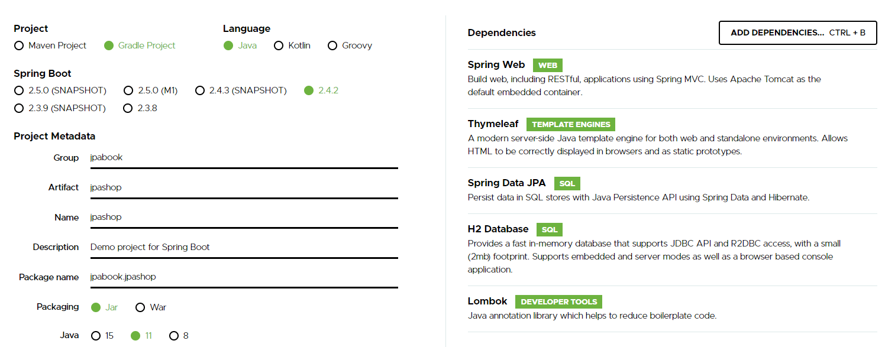

## **View 환경 설정**

### thymeleaf 템플릿 엔진

-   공식 사이트: [https://www.thymeleaf.org/](https://www.thymeleaf.org/)
-   스프링 공식 튜토리얼: [https://spring.io/guides/gs/serving-web-content/](https://spring.io/guides/gs/serving-web-content/)
-   스프링부트 메뉴얼: [https://docs.spring.io/spring-boot/docs/2.1.6.RELEASE/reference/html/](https://docs.spring.io/spring-boot/docs/2.1.6.RELEASE/reference/html/boot-features-developing-web-applications.html#boot-features-spring-mvc-template-engines)

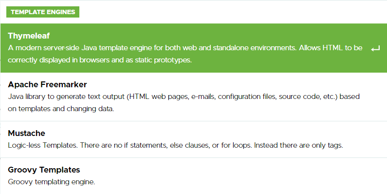

### 스프링 부트 thymeleaf viewName 매핑

-   스프링 부트가 매핑을 알아서 해줌
-   **resources:templates/ + {viewName} + .html**

```
    @GetMapping("hello")
    public String hello(Model model){
        model.addAttribute("data" , "20210124TEST");
        return "hello";
    }
```

✋ **개발에 유용한 라이브러리 추가**
{: .fh-default .fs-4 }
- `implementation 'org.springframework.boot:spring-boot-devtools'`
- **라이브러리 추가 후 재실행 , restartedMain이 뜨면 적용된 것이다.**
- 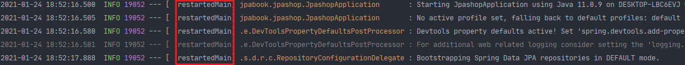
- **수정 후 recompile을 해주면 바로 적용 가능**
- 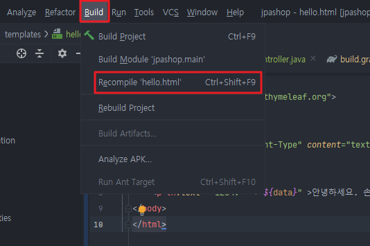

***

## **H2 데이터베이스 설치**

✅ **개발이나 테스트 용도로 가볍고 편리한 DB, 웹 콘솔 제공**
{: .fh-default .fs-4 }
✅ **윈도우 설치 버전: [https://h2database.com/h2-setup-2019-10-14.exe](https://h2database.com/h2-setup-2019-10-14.exe)**
{: .fh-default .fs-4 }

### 데이터베이스 파일 생성 방법

✅**최소 한 번, 세션키 유지하여야 생성이 가능하다.**
{: .fh-default .fs-4 }

- **h2.bat을 실행하면 커맨드 창이 뜨고 웹 창이 뜬다. (커맨드는 끄면 안된다.)**
- 
- **http://{hostIp}:8082/login.jsp?jsessionid={id}**
- 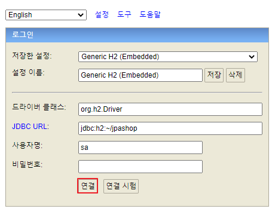

**연결 후**
{: .fh-default .fs-4 }
- 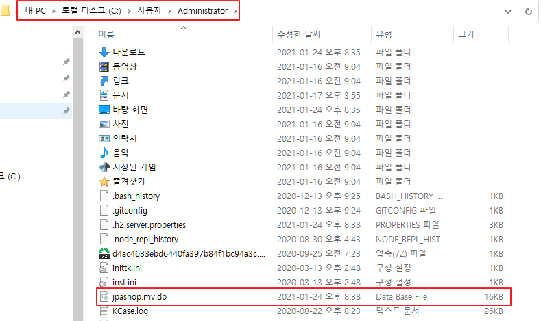
- **default 경로로 여기에 생기는지는 모르겠지만 생성되었는지 확인한다.**

**파일 생성 확인 후**
{: .fh-default .fs-4 }
- 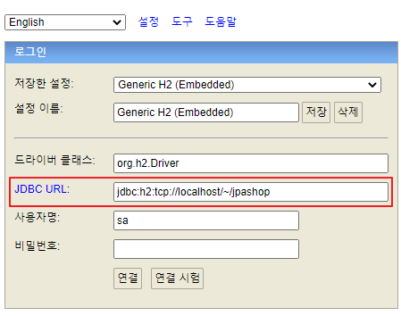
- **jdbc:h2:tcp://localhost/~/jpashop 연결하면 된다.**


***

## **JPA와 DB 설정**

✅ **application.properties 삭제 ➜ application.yml 생성**
{: .fh-default .fs-4 }

```yaml
spring:
  datasource:
    url: jdbc:h2:tcp://localhost/~/jpashop;
    username: sa
    password:
    driver-class-name: org.h2.Driver # database connection 관련 소스 설정이 완료된다.

  jpa:
    hibernate:
      ddl-auto: create      #이 옵션은 애플리케이션 실행 시점에 테이블을 drop 하고, 다시 생성한다.
    properties:
      hibernate:
        #  show_sql: true
        format_sql: true

  logging.level:
    org.hibernate.SQL: debug
#   org.hibernate.type: trace
```

-   **모든 로그 출력은 가급적 로거를 통해 남겨야 한다.**
    -   **show\_sql 옵션은 System.out에 하이버네이트 실행 SQL을 남긴다.**
    -   **org.hibernate.SQL 옵션은 logger를 통해 하이버네이트 실행 SQL을 남긴다.**

✅ **[자세한 application 속성 보기](https://docs.spring.io/spring-boot/docs/current/reference/html/appendix-application-properties.html#common-application-properties)** 

🚨 **주의**
{: .fh-default .fs-4 }

- **yml파일은 띄어쓰기(스페이스) 2칸으로 계층을 만든다.**
- **따라서 띄어쓰기 2칸을 필수로 적어주어야한다.**
- **예를 들어 아래의 datasource는 spring: 하위에 있고 앞에 띄어쓰기 2칸이 있으므로 spring.datasource가 된다.**

```yaml
spring: #띄어쓰기 없음
	datasource: #띄어쓰기 2칸
 		url: jdbc:h2:tcp://localhost/~/jpashop #4칸
 		username: sa
 		password:
		driver-class-name: org.h2.Driver
	jpa: #띄어쓰기 2칸
 		hibernate: #띄어쓰기 4칸
 			ddl-auto: create #띄어쓰기 6칸
 		properties: #띄어쓰기 4칸
 			hibernate: #띄어쓰기 6칸
				# show_sql: true #띄어쓰기 8칸
 				format_sql: true #띄어쓰기 8칸

logging.level: #띄어쓰기 없음
	org.hibernate.SQL: debug #띄어쓰기 2칸
	# org.hibernate.type: trace #띄어쓰기 2칸
```

***

## **동작 확인**

> **Entity**

```java
@Entity
@Getter @Setter
public class Member {

    @Id @GeneratedValue
    private Long id;
    private String username;
}

```

> **Repository**

```java
@Repository
public class MemberRepository {

    // Shift + Ctrl + T 테스트 코드 생성

    // 스프링 부트가 EntityManager (Raw JPA)를 주입
    @PersistenceContext
    private EntityManager em;

    public Long save(Member member){
        em.persist(member);
        return member.getId();
    }

    public Member find(Long id){
        return em.find(Member.class , id);
    }

}

```

> **SpringBootTest**

```java
@SpringBootTest
class MemberRepositoryTest {

    @Autowired MemberRepository memberRepository;

    @Test
    @Transactional
    // EntityManager를 통한 모든 데이터 변경은 Transaction안에서 실행 되어야 한다.
    // Test코드 안에서 @Transaction을 작성하면 마지막에 롤백 한다.
    @Rollback(false)
    public void testMember() throws Exception {
        // given
        Member member = new Member();
        member.setUsername("memberA");

        // when
        Long aLong = memberRepository.save(member);
        Member findMember = memberRepository.find(aLong);

        // then
        Assertions.assertThat(findMember.getId()).isEqualTo(aLong);
        Assertions.assertThat(findMember.getUsername()).isEqualTo(member.getUsername());

        // == 비교
        // [영속성 컨텍스트]
        Assertions.assertThat(findMember).isEqualTo(member);
        System.out.println("findMember = " + findMember);
        System.out.println("member = " + member);
        // 출력
        // findMember = jpabook.jpashop.Member@6c2fea95
        // member = jpabook.jpashop.Member@6c2fea95

    }
}
```

### 테스트 결과 , 쿼리
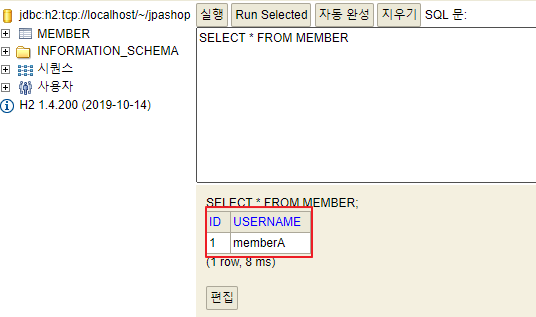
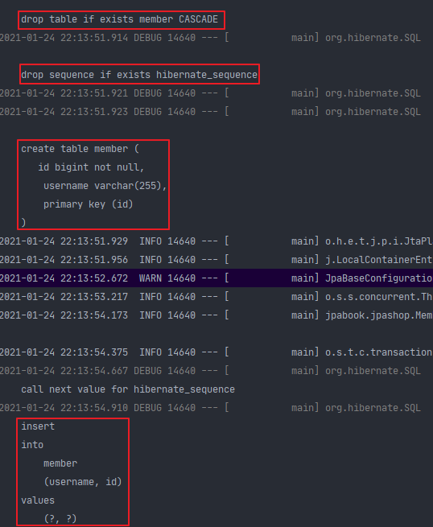

***

## **쿼리 파라미터 로그 남기기**


✅ **외부 라이브러리 사용 [https://github.com/gavlyukovskiy/spring-boot-data-source-decorator](https://github.com/gavlyukovskiy/spring-boot-data-source-decorator)**
{: .fh-default .fs-4 }

✅ **gradle 추가**
{: .fh-default .fs-4 }
`implementation 'com.github.gavlyukovskiy:p6spy-spring-boot-starter:1.5.6'`

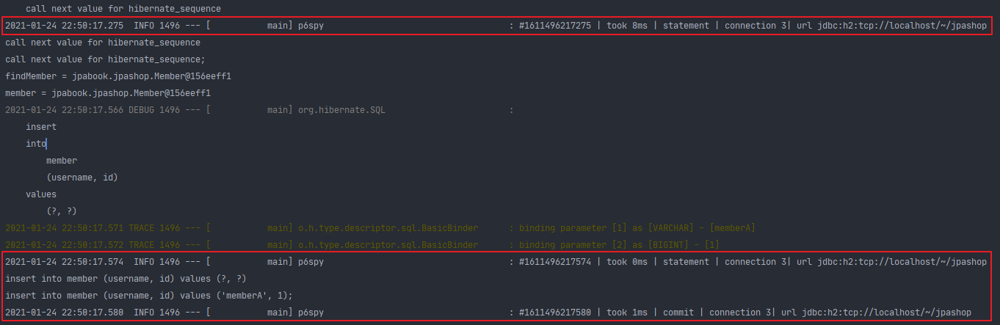


> ✋ **테스트 코드 자동 완성 커스텀**
> tdd 입력 후 자동 완성
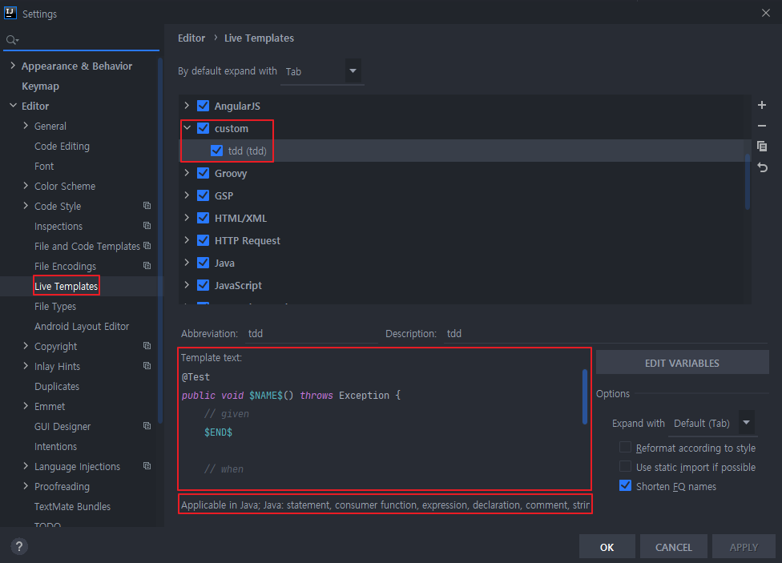
