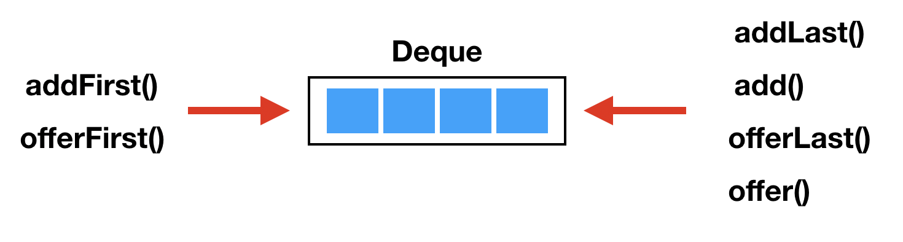
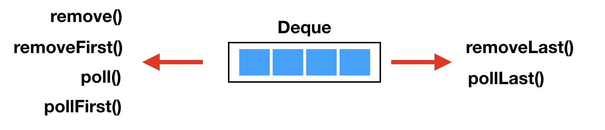
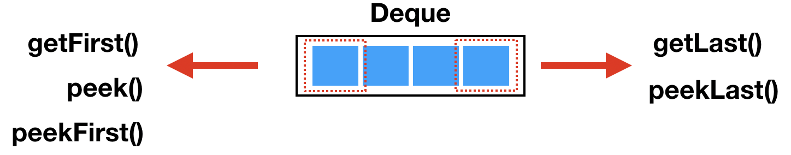

## Table of contents
{: .no_toc .text-delta }

1. TOC
{:toc}

---

# **ArrayDeque가 Stack과 Queue보다 빠르다?**
 
 > This class is likely to be 
 >
 > **faster than `Stack` when used as a `stack`**, and 
 >
 > **faster than `LinkedList` when used as a `queue`**.

- [출처 자바 8 공식문서](https://docs.oracle.com/javase/8/docs/api/)

## **Stack의 문제점**

### `synchronized` 남발

- [**LAB** `synchronized` 더보기](https://jdalma.github.io/docs/lab/synchronized/)

```java
package java.util;

public
class Stack<E> extends Vector<E> {
    public Stack() {
    }

    public E push(E item) {
        addElement(item);

        return item;
    }
    public synchronized E pop() {
        E       obj;
        int     len = size();

        obj = peek();
        removeElementAt(len - 1);

        return obj;
    }
    public synchronized E peek() {
        int     len = size();

        if (len == 0)
            throw new EmptyStackException();
        return elementAt(len - 1);
    }
    public synchronized int search(Object o) {
        int i = lastIndexOf(o);

        if (i >= 0) {
            return size() - i;
        }
        return -1;
    }
}
```

### `Vector`를 상속

 > A more complete and consistent set of LIFO stack operations is provided by the Deque interface and its implementations, 
 >
 > which should be used in preference to this class. 
 >
 > For example: `Deque<Integer> stack = new ArrayDeque<Integer>();`

- **보다 완전하고 일관된 `LIFO`의 특성을 사용할 때는 `Stack`보다는 `Deque`를 사용해라**
- `LIFO`의 특성을 지키지 않는 `Vector`를 상속하고 있다.
  - 아래는 `Vector`클래스의 `get` , `set` 메서드다.

```java
    public synchronized E get(int index) {
        if (index >= elementCount)
            throw new ArrayIndexOutOfBoundsException(index);

        return elementData(index);
    }

    public synchronized E set(int index, E element) {
        if (index >= elementCount)
            throw new ArrayIndexOutOfBoundsException(index);

        E oldValue = elementData(index);
        elementData[index] = element;
        return oldValue;
    }    
```

***

# **Deque**

- `List` 인터페이스와 달리 이 인터페이스는 **요소에 대한 인덱싱된 액세스를 지원하지 않는다**
- [ArrayDeque가 LinkedList보다 나은 이유](http://daplus.net/java-arraydeque%EA%B0%80-linkedlist%EB%B3%B4%EB%8B%A4-%EB%82%98%EC%9D%80-%EC%9D%B4%EC%9C%A0/)
- 고정된 제한을 두지 않지만 이 인터페이스는 용량 제한 `deque`와 고정 크기 제한이 없는 `deque`를 지원한다
- 각 메서드는 두 가지 형식으로 존재한다
  - **하나는 작업이 실패하면 예외를 `throw`하고 다른 하나는 특수 값(작업에 따라 `null` 또는 `false`)을 반환한다**

- [LinkedList vs ArrayDeque](http://javaqueue2010.blogspot.com/)
- [출처 - 자바 8 공식 문서 Deque Interface](https://docs.oracle.com/javase/8/docs/api/)








- [이미지 출처](https://soft.plusblog.co.kr/24)


<div class="code-example" markdown="1">

- **`Deque Methods`**

|              | `First Element (Head)` || `Last Element (Tail)` ||
|:-------------|:------------------|:------|:------|:------|
|              | *Throws Exception*| *Special Value* | *Throws Exception* | *Special Value* |
| **Insert**   | addFirst(E)   | offerFirst(E)  | addLast(e) | offerLast(E) |
| **Remove**   | removeFirst   | pollFirst      | removeLast() | pollLast() |
| **Examine**  | getFirst()    | peekFirst      | getLast() |  peekLast()   |

- **`Deque`(1.6) 인터페이스는 `Queue`(1.5) 인터페이스를 상속 받는다**

|`Queue Method`|`Deque Method`|
|:-------------|:------------------|
|add(e)	|addLast(e)|
|offer(e)|	offerLast(e)|
|remove()|	removeFirst()|
|poll()	|pollFirst()|
|element()|	getFirst()|
|peek()	|peekFirst()|

- `Deque`는 `LIFO(Last-In-First-Out)` 스택으로도 사용할 수 있습니다.
  - *이 인터페이스는 레거시 `Stack` 클래스보다 우선적으로 사용해야 한다*

|`Stack Method`|`Deque Method`|
|:-------------|:------------------|
|push(e)	| addFirst(e)|
|pop() | removeFirst()|
|peek() | peekFirst()|

</div>

```java
import java.io.IOException;
import java.util.*;

class Main {
    private static final Queue list = new LinkedList();
    private static final Queue queue1 = new LinkedList();
    private static final Queue queue2 = new ArrayDeque();
    private static final Deque deque = new ArrayDeque();

    private static int count = 2000000;
    public static void main(String[] args) throws IOException {
        System.out.println("Test starts");
        long start = System.nanoTime();

        for(int i = 1 ; i <= count ; i++){
            list.offer(i);
        }

        for(int i = 1 ; i <= count ; i++){
            list.peek();
            list.poll();
        }

        long end = System.nanoTime();
        System.out.println("Using linked list takes about:" + (end - start) / 1000000 + "ms");

        System.gc();

        start = System.nanoTime();

        for(int i = 1 ; i <= count ; i++){
            deque.offer(i);
        }

        for(int i = 1 ; i <= count ; i++){
            deque.peek();
            deque.poll();
        }

        end = System.nanoTime();
        System.out.println("Using Deque takes about:" + (end - start) / 1000000 + "ms");

        System.gc();

        start = System.nanoTime();

        for(int i = 1 ; i <= count ; i++){
            queue1.offer(i);
        }

        for(int i = 1 ; i <= count ; i++){
            queue1.peek();
            queue1.poll();
        }

        end = System.nanoTime();
        System.out.println("Using LinkedList - Queue takes about:" + (end - start) / 1000000 + "ms");

        System.gc();

        start = System.nanoTime();

        for(int i = 1 ; i <= count ; i++){
            queue2.offer(i);
        }

        for(int i = 1 ; i <= count ; i++){
            queue2.peek();
            queue2.poll();
        }

        end = System.nanoTime();
        System.out.println("Using ArrayDeque - Queue takes about:" + (end - start) / 1000000 + "ms");

        System.out.println("Test finished");

    }
}
```

- `addFirst(e)` : push , offerFirst;
- `addLast(e)` : offer , offerLast , add , 

```java
private void grow(int needed) {
    // overflow-conscious code
    final int oldCapacity = elements.length;
    int newCapacity;
    // Double capacity if small; else grow by 50%
    int jump = (oldCapacity < 64) ? (oldCapacity + 2) : (oldCapacity >> 1);
    if (jump < needed || (newCapacity = (oldCapacity + jump)) - MAX_ARRAY_SIZE > 0)
        newCapacity = newCapacity(needed, jump);

    final Object[] es = elements = Arrays.copyOf(elements, newCapacity);
    // Exceptionally, here tail == head needs to be disambiguated
    if (tail < head || (tail == head && es[head] != null)) {
        // wrap around; slide first leg forward to end of array
        int newSpace = newCapacity - oldCapacity;
        System.arraycopy(es, head,
                            es, head + newSpace,
                            oldCapacity - head);
        for (int i = head, to = (head += newSpace); i < to; i++)
            es[i] = null;
    }
}
```