## Table of contents
{: .no_toc .text-delta }

1. TOC
{:toc}

---

- 출처
  - [Loading, Linking, and Initializing](https://docs.oracle.com/javase/specs/jvms/se8/html/jvms-5.html)
  - [클래스는 언제 로딩되고 초기화되는가?](https://velog.io/@skyepodium/%ED%81%B4%EB%9E%98%EC%8A%A4%EB%8A%94-%EC%96%B8%EC%A0%9C-%EB%A1%9C%EB%94%A9%EB%90%98%EA%B3%A0-%EC%B4%88%EA%B8%B0%ED%99%94%EB%90%98%EB%8A%94%EA%B0%80) 
  - 위의 게시글을 따라 테스트 하였습니다.

# **클래스 로딩**

- 클래스 로더가 `.class`파일을 찾고 **JVM** 메모리에 올리는 작업을 의미한다.
- ⭐️ **JVM**은 실행될 때 모든 클래스를 메모리에 올려 놓지 않는다.
- **필요할 때 마다 클래스를 메모리에 올려** 효율적으로 관리하기 위함이다.

# **그럼 언제 클래스를 로딩할까?**

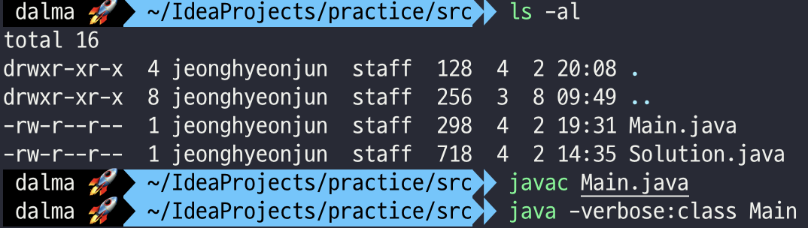

## `TestCase 0 :` 아무것도 호출하지 않음

```java
class Main {
    public static void main(String[] args){

    }
}

class Single{
    public Single() {
    }

    public static int a;

    public static final int b = 0;

    public static void test(){

    }

    public static class INNER_INSTANCE{
        public static Single INSTANCE;
    }
}
```

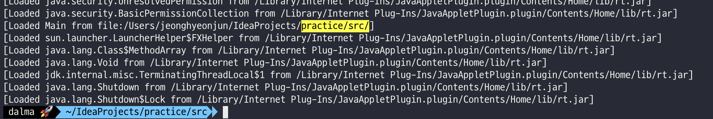

- `Main`클래스만 로딩 되었고 `Single`클래스는 로딩되지 않음

## `TestCase 1 :` 인스턴스 생성

```java
class Main {
    public static void main(String[] args){
        Single single = new Single();
    }
}

class Single{
    public Single() {
    }

    public static int a;

    public static final int b = 0;

    public static void test(){

    }

    public static class INNER_INSTANCE{
        public static Single INSTANCE;
    }
}
```

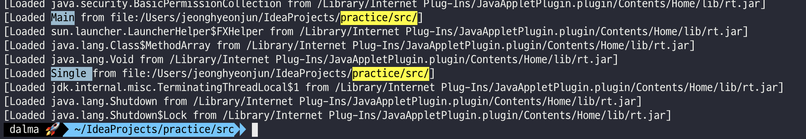

- `Main`이 실행되고 `Single`클래스가 실행되었다.

## `TestCase 2 :` `final`키워드가 없는 정적 변수 호출

```java
class Main {
    public static void main(String[] args){
        System.out.println(Single.a);
    }
}

class Single{
    public Single() {
    }

    public static int a;

    public static final int b = 0;

    public static void test(){

    }

    public static class INNER_INSTANCE{
        public static Single INSTANCE;
    }
}
```

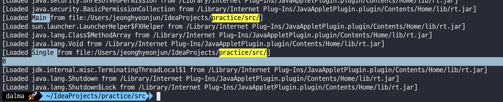

- `Main`이 실행되고 `Single`클래스가 실행되었다.
- `public static int a`변수가 출력 되었다.

## `TestCase 3 :` `final`키워드가 있는 정적 변수 호출

```java
class Main {
    public static void main(String[] args){
        System.out.println(Single.b);
    }
}

class Single{
    public Single() {
    }

    public static int a;

    public static final int b = 1000;

    public static void test(){

    }

    public static class INNER_INSTANCE{
        public static Single INSTANCE;
    }
}
```

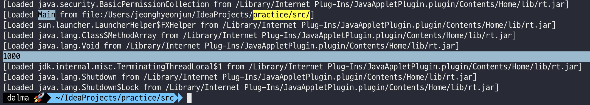

- ⭐️ `Main`클래스가 실행되고 **`Single`클래스가 실행되지 않았지만 `public static final int b`가 출력되었다.**

## `TestCase 4 :` `final`키워드가 없는 정적 메서드 호출

```java
class Main {
    public static void main(String[] args){
        Single.test();
    }
}

class Single{
    public Single() {
    }

    public static int a;

    public static final int b = 1000;

    public static void test(){
        System.out.println("static method 호출");
    }

    public static class INNER_INSTANCE{
        public static Single INSTANCE;
    }
}
```

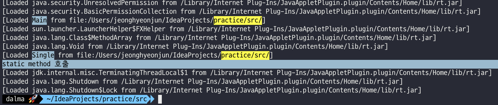

## `TestCase 5 :` `final`키워드가 있는 정적 메서드 호출

```java
class Main {
    public static void main(String[] args){
        Single.test();
    }
}

class Single{
    public Single() {
    }

    public static int a;

    public static final int b = 1000;

    public final static void test(){
        System.out.println("final static method 호출");
    }

    public static class INNER_INSTANCE{
        public static Single INSTANCE;
    }
}
```

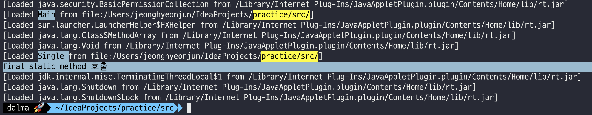

## `TestCase 6 :` 정적 내부 클래스의 정적 변수 호출

```java
class Main {
    public static void main(String[] args){
        System.out.println(Single.INNER_INSTANCE.INSTANCE);
    }
}

class Single{
    public Single() {
    }

    public static int a;

    public static final int b = 1000;

    public final static void test(){
        System.out.println("final static method 호출");
    }

    public static class INNER_INSTANCE{
        public static Single INSTANCE;
    }
}
```

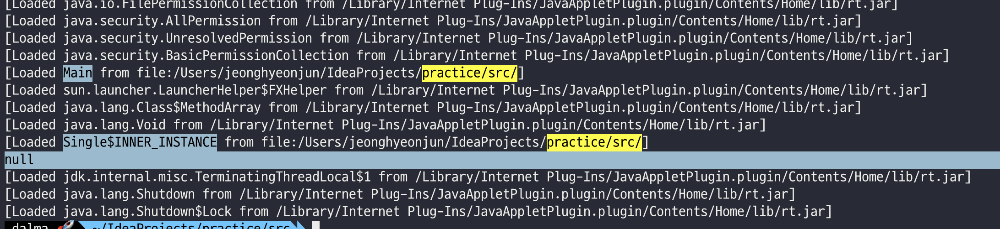

## 클래스는 한 번만 로딩됨을 보장한다.

> Java 프로그래밍 언어는 **다중 스레드이기 때문에 클래스 또는 인터페이스의 초기화는 신중한 동기화가 필요합니다.**
> 
> 다른 스레드가 동시에 동일한 클래스 또는 인터페이스를 초기화하려고 할 수 있기 때문입니다. 
> 
> 클래스 또는 인터페이스의 초기화가 해당 클래스 또는 인터페이스 초기화의 일부로 재귀적으로 요청될 수도 있습니다.
> 
> 예를 들어, 클래스 A 의 변수 이니셜라이저 는 관련 없는 클래스 B 의 메서드를 호출할 수 있으며, 이는 차례로 클래스 A 의 메서드를 호출할 수 있습니다.. 
> 
> Java Virtual Machine의 구현은 다음 절차를 사용하여 동기화 및 재귀 초기화를 처리하는 역할을 합니다.

- [출처 - `Detailed Initialization Procedure`](https://docs.oracle.com/javase/specs/jls/se17/html/jls-12.html#jls-12.4)
- 다음 코드는 10개의 스레드가 동시에 클래스의 인스턴스를 생성한다
- 결과를 보면 10개의 스레드가 동시에 클래스 로딩을 시도해도 클래스 로딩은 한번만 수행되고, 그때 한번 초기화를 수행한다. 
- 이후 인스턴스를 10개 생성한다

```java
class Main {
    public static void main(String args[]) {
        // 1. 스레드 풀 생성
        ExecutorService service = Executors.newCachedThreadPool();

        // 2. 반복문을 통해 - 10개의 스레드가 동시에 인스턴스 생성
        for (int i = 0; i < 10; i++) {
            service.submit(() -> {
                new Single();
            });
        }
        // 3. 종료
        service.shutdown();
    }
}
class Single {
    static {
        System.out.println("static 블록 호출");
    }

    public Single() {
        System.out.println("생성자 호출");
    }
}
```

- [`Executor` 참고](https://jdalma.github.io/docs/java/concurrent/#executors)

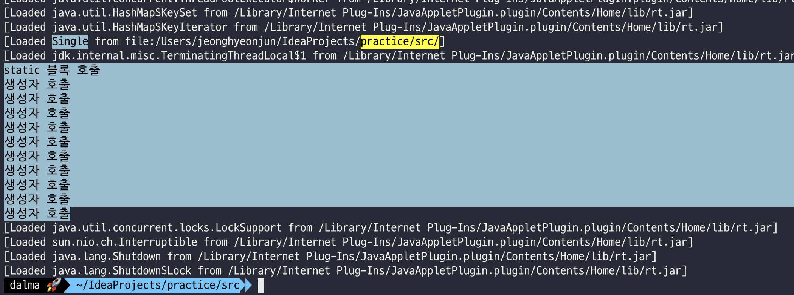

## **클래스 로딩 정리** 📌
- `Single`클래스가 로딩 될 때
  - 해당 클래스의 인스턴스를 생성했을 때
  - `final`키워드가 없는 정적 변수를 호출했을 때
  - 해당 클래스의 정적 메서드를 호출했을 때
- 🚩
  - `final`키워드가 있는 정적 변수를 호출해도 왜 `Single`클래스는 생성이 되지 않을까? 
  - **외부 클래스가 로딩 되어도 내부 클래스는 생성되지 않는다.**
  - **내부 클래스가 로딩 되어도 외부 클래스는 생성되지 않는다.**

## 위의 특성을 이용하여 싱글 톤 인스턴스 생성해보기 `LazyHolder` ✋

- <span style="color:red; font-weight:bold">실패 사례</span>

```java
class Main {
    public static void main(String args[]) {
        ExecutorService service = Executors.newCachedThreadPool();

        for (int i = 0; i < 10; i++) {
            service.submit(() -> {
                SingleTon.getInstance();
            });
        }

        service.shutdown();
    }
}

class SingleTon {
    private SingleTon() {
        System.out.println("싱글톤 인스턴스 생성");
    }

    public static SingleTon instance;

    public static SingleTon getInstance() {
        if(instance == null){
            System.out.println("인스턴스 생성");
            return new SingleTon();
        }
        return instance;
    }
}
```

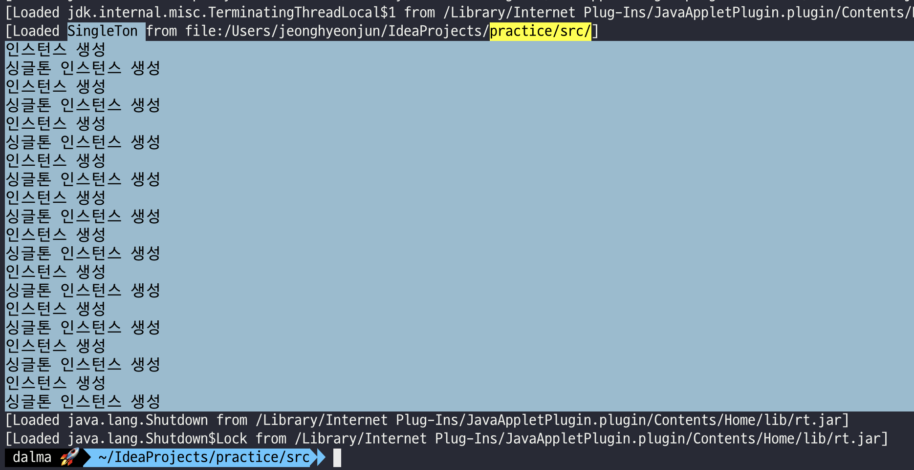

- `LazyHolder` 라는 방법으로 싱글톤 인스턴스를 생성하는데 가장 권장되는 방법중 하나이다.
  - (다른 하나는 `enum` 사용)

```java
import java.util.concurrent.ExecutorService;
import java.util.concurrent.Executors;

class Main {
    public static void main(String args[]) {
        ExecutorService service = Executors.newCachedThreadPool();

        for (int i = 0; i < 10; i++) {
            service.submit(() -> {
                SingleTon.getInstance();
            });
        }

        service.shutdown();
    }
}

class SingleTon {
    private SingleTon() {
        System.out.println("싱글톤 인스턴스 생성");
    }

    public static SingleTon getInstance() {
        return LazyHolder.INSTANCE;
    }

    // 클래스는 한 번만 로딩됨을 보장한다.
    private static class LazyHolder {
        private static final SingleTon INSTANCE = new SingleTon();
    }
}
```

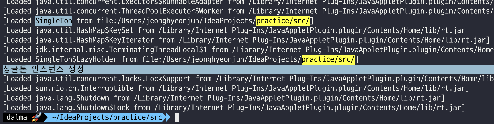

***

# **클래스 초기화** `Initialization` 단계
- 클래스 초기화는 `static`블록과 `static`멤버 변수의 값을 할당하는 것을 의미
- [`Initialization of Classes and Interfaces` 공식 문서](https://docs.oracle.com/javase/specs/jls/se17/html/jls-12.html#jls-12.4)

## 초기화가 언제 발생되나?

- 클래스 또는 인터페이스 `T` 는 다음 중 하나가 처음 발생하기 직전에 초기화된다
  - `T` 는 클래스이고 `T` 의 인스턴스가 생성 될 때
  - `T` 의 `static` 메소드가 호출 될 때
  - `T` 의 `static` 변수가 할당 될 때
  - `T` 의 `final`이 아닌 `static` 변수가 사용될 떄
- **클래스가 초기화되면 해당 수퍼클래스가 초기화되고(이전에 초기화되지 않은 경우)** 
- **기본 메서드를 선언하는 수퍼인터페이스(이전에 초기화되지 않은 경우)도 초기화된다** 
- 인터페이스의 초기화는 그 자체로 그 슈퍼인터페이스의 초기화를 일으키지 않는다.
- 필드 에 대한 참조 `static`은 하위 클래스, 하위 인터페이스 또는 인터페이스를 구현하는 클래스의 이름을 통해 참조될 수 있지만 실제로 필드를 선언하는 클래스 또는 인터페이스만 초기화한다.
- `Class`클래스 및 패키지 에서 특정 메서드를 호출 `java.lang.reflect`하면 클래스 또는 인터페이스도 초기화된다
- 클래스 또는 인터페이스는 다른 상황에서 초기화되지 않는다.

> ✋ 위의 **클래스 로드 시점과 같다.** 클래스가 로드되면 초기화도 바로 진행된다.

### 슈퍼클래스는 서브클래스보다 먼저 초기화된다.

```java
class Super {
    static { System.out.println("Super Init"); }
}
class One {
    static { System.out.println("One Init"); }
}
class Two extends Super {
    static { System.out.println("Two Init"); }
}
class Main {
    public static void main(String[] args) {
        One o = null;
        Two t = new Two();
    }
}
```

```
Super Init
Two Init
```

### 슈퍼 인터페이스는 자식 인터페이스가 호출하여도 초기화 하지 않는다.

```java
interface A {
    int A = 1;
    int AA = Main.out("AA", 2);
}
interface B extends A {
    int B = Main.out("B", 3);
    int BB = Main.out("BB", 4);
}
interface C extends B {
    int C = Main.out("C", 5);
    int CC = Main.out("CC", 6);
}
class Main {
    public static void main(String[] args) {
        System.out.println("B.A : " + B.A);
        System.out.println("C.B : " + C.B);
        System.out.println("C.C : " + C.C);
    }
    static int out(String s, int i) {
        System.out.println(s + " = " + i);
        return i;
    }
}
```

```
B.A : 1
B = 3
BB = 4
C.B : 3
C = 5
CC = 6
C.C : 5
```

## 초기화 진행 순서

```java
class Main {
    public static void main(String[] args) {
        new Single();
    }
}

class Single {
    static int A = 0;
    static int B = 0;
    public Single() {
        System.out.println("3. 생성자");
    }
    static {
        System.out.println("A : " + A);
        System.out.println("B : " + B);
        A = 10;
        B = 20;
        System.out.println("1. 정적 블록");
    }
    public static Temp temp = new Temp();

    public static void StaticClass(){
        System.out.println("X. 정적 메서드");
    }
    public static class InnerClass{
        static {
            System.out.println("X. 내부 클래스");
        }
    }
}

class Temp {
    public Temp () {
        System.out.println("2. 정적 변수");
    }
}
```

```
A : 0
B : 0
1. 정적 블록
2. 정적 변수
3. 생성자
```

***

