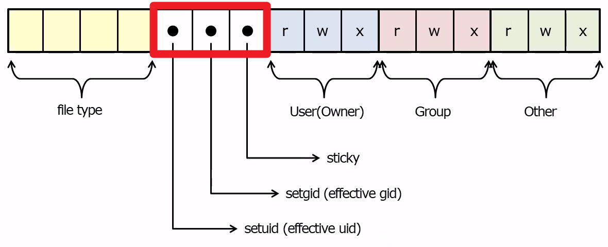
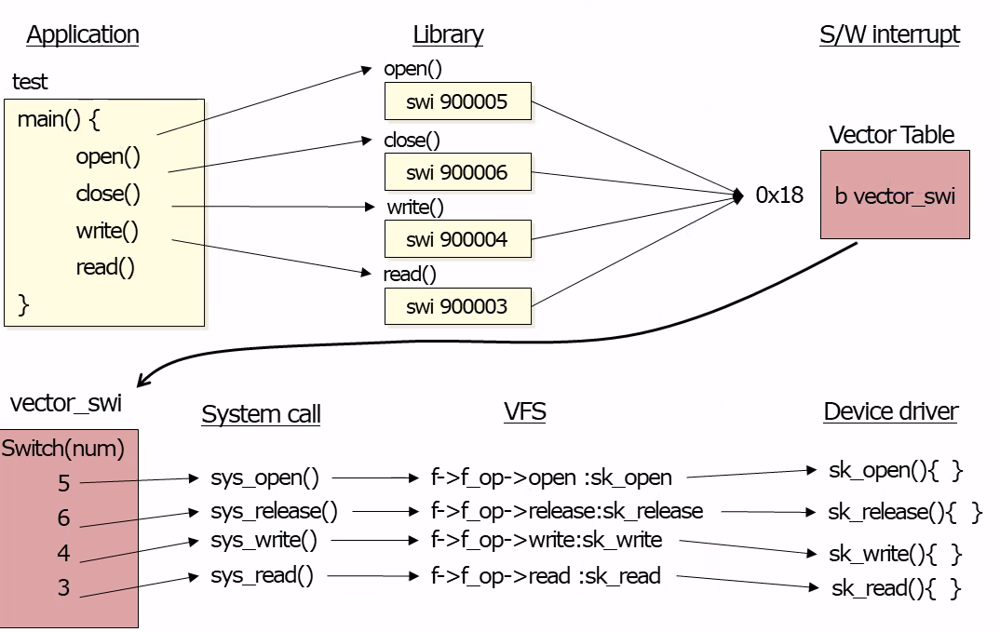
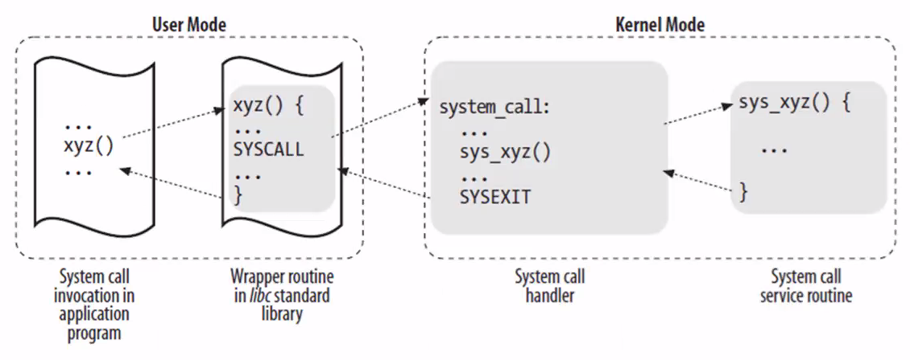
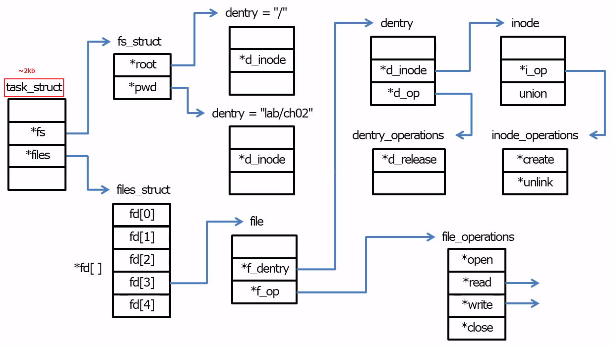

## Table of contents
{: .no_toc .text-delta }

1. TOC
{:toc}
---


# 🙋‍♂️ 추가 정리

## Linux Manual Section number

- **1** : User commands man-pages에는 GNU C 라이브러리가 제공하는 프로그램을 문서화 한 Section 1 페이지가 거의 포함되어 있지 않다.
- **2** : System Calls 리눅스 커널이 제공하는 시스템 콜에 대한 설명
- **3** : Library Functions 표준 C 라이브러리가 제공하는 라이브러리 함수에 대한 문서 ( 특별히 glibc, GNU C Library 에 초점을 맞춤)
- **4** : Devices 다양한 장치들에 대한 자세한 문서. 대부분이 /dev  안의 것들 
- **5** : Files  /proc 파일 시스템인 proc(5) 을 포함한 다양한 파일 포맷들에 대한 설명. 
- **7** : Overviews, conventions, and miscellaneous.  전체적으로 훑어보거나, 규약이나, 기타 잡다구리한 것들.
- **8** : Superuser와 시스템 관리자 명령어 man-pages는 주로 GNU C 라이브러리가 제공하는 프로그램을 문서화 한 Section 8 페이지가 거의 없다.

## 특수 권한

- `-rwxrwxr-x` mod ➜ 775
- `-rwsr-xr-x` mod ➜ **4755**
- `-rwxr-sr-x` mod ➜ **2755**
- `-rwxr-xr-t` mod ➜ **1755**



- `setuid`
  - 소유자만이 접근 가능한 파일을 일반 유저도 접근할 필요가 있을 때 사용한다
  - 소유자의 권한을 잠시 빌려오는 개념이다
  - **User 권한**의 **접근 권한 `(x)`** 자리에 `x` 대신 `s`가 들어가면 이를 **SetUID**라 칭한다
  - `s`가 아니라 **대문자 `S`** 가 들어가면 이는 일반 권한의 `-`처럼 접근 권한이 없는 것 과 같다
- `setgid`
  - 소유 그룹만 접근 가능한 파일에 일반 유저로 접근이 필요할 때 사용한다
  - **Group 권한**의 **접근 권한 `(x)`** 자리에 `x` 대신 `s`가 들어가면 이를 **SetGID**라 칭한다
  - `s`가 아니라 **대문자 `S`** 가 들어가면 이는 일반 권한의 `-`처럼 접근 권한이 없는 것 과 같다
- `sticky`
  - 파일 및 디렉토리 생성은 누구나 가능하지만 , **삭제는 생성한 유저와 디렉토리 소유자만 가능하다**
  - **일반 권한**의 **접근 권한 `(x)`** 자리에 `x` 대신 `t`가 들어가면 이를 **Sticky Bit**라 칭한다
  - `t`가 아니라 **대문자 `T`** 가 들어가면 이는 일반 권한의 `-`처럼 접근 권한이 없는 것 과 같다


# **리눅스 시스템 콜**





# **리눅스의 파일 시스템과 파일 제어**

- 모든 파일은 `inode`로 참조한다
- `inode`는 파일 시스템의 디스크에 위치한 객체이자 커널에서 `inode`데이터 구조로 표현되는 개념적 객체이기도 하다
- [리눅스의 폴더 구조](https://coding-factory.tistory.com/499)
- 열린 파일과 연관된 메타 데이터와 특정 파일 자체로 다시 매핑
- Linux 커널 내에서 해당 디스크립터는 **File Descriptor(fd)**로 불리는 **정수 (C 유형 int)에 의해 처리**
- **대부분, 파일을 열어서 fd를 할당받고 fd를 이용하여 파일을 조작하고 , 닫고 사용하는 것으로 실행된다**
- [리눅스의 File Descriptor](https://dev-ahn.tistory.com/96)


| 파일디스크립터| 목적              | POSIX 이름 | stdio 스트림 |
|:-------------|:------------------|:------|:------|
| `0`           | 표준 입력       | `STDIN_FILENO`  | `stdin` |
| `1`           | 표준 출력       | `STDOUT_FILENO` | `stdout` |
| `2`           | 표준 에러       | `STDERR_FILENO` | `stderr` |




> 사용자 공간에 있는 응용 프로그램이 파일을 지정하여 열도록 요청 하면
> 1. 커널은 파일 이름을 포함하고 있는 Directory를 연 후 
> 2. 지정된 이름을 찾고
> 3. 파일 이름에서 `inode`번호를 얻고
> 4. `inode`번호에서 `inode`를 찾는다

## 일반(Regular) 파일
- 리눅스에서 일반적으로 파일이라고하면 `Regular`파일을 말한다
- **바이트 스트림**이라 부르는 **선형 배열로 구성된 데이터 바이트를 담고 있다**
- 바이트는 임의의 값을 가질 수 있으며 . 파일 내에서 어떤 방식으로든 구성 될 수 있다
  - *Linux는 시스템 수준에서 **바이트 스트림 외에는 파일에 구조를 적용하지 않는다***
  1. 파일 내의 모든 바이트를 읽을 수 있고 , 
  2. 쓸 수 있으며 ,
  3. 파일 내의 특정 바이트에서 시작할 수 있으며 ,
  4. 이 시작하는 위치를 **`file position`**또는 **`file offset`**
     - *파일을 처음 열면 `file offset`은 **0**이며 바이트 단위로 읽거나 쓸 때 **offset 값이 증가한다**

- 동일한 프로세스 또는 다른 프로세스에서 단일 파일을 여러 번 `open`할 수 있고 , 열린 파일의 인스턴스에 고유한 `File Descriptor`(fd)가 부여된다
- 프로세스는 `fd`를 공유할 수 있고 , `fd`는 하나 이상의 프로세스에서 사용 될 수 있다
  - *커널에서 제약이 없기 때문에 사용자 공간에서 동기화에 대한 조정이 필요하다*
- **파일은 파일 이름으로 접근하지만 실제로는 파일 시스템에서 고유한 정수값이 할당된 `inode`에 의해 참조된다**
  - *할당된 `inode`정수값을 `inode number` , `i-number` , `ino`등으로 부른다*
- **inode**
  - **파일과 관련된 모든 정보를 추적하는 데이터 구조**
  - 파일과 관련된 메타 데이터 (파일을 수정한 타임 스탬프 , 소유자 , 유형 , 길이 및 파일 데이터 위치 등)를 저장하지만 파일 이름은 저장하지 않는다
  - **파일에 접근하고자 할 때 운영체제는 관련된 `inode table`에서 `inode`번호를 먼저 찾는다**

## Directory 와 Link
- **Directory**
  - 접근하고자 하는 파일에 대해 사용자 공간에게 이름을 제공하는데 사용
    - *사용자가 `inode`로 접근하는 번거로움과 보안상의 허점을 보완*
    - *사람이 읽을 수 있는 이름을 `inode`번호로 매핑하는 역할*
  - 개념적으로 , 일반 파일처럼 보이지만 `inode`에 파일을 매핑한 정보만 포함한다는 점이 다르다
    - *커널은 이 매핑을 직접 사용하여 `name-to-inode`분해와 결합을 수행*
- **Link**
  - **매핑된 타일 이름과 `inode`의 쌍**을 말한다
  1. `Hard Link`
     - 여러 링크가 서로 다른 파일 이름이 동일한 `inode`와 매핑하는 것
  2. `Symbolic Link`
     - 원본 파일을 대신하도록 원본 파일을 다른 파일명으로 지정한것으로 윈도우의 바로가기와 개념이 비슷하다
     - 파일 시스템을 확장하기 위하여 허용
     - **자신의 `inode`와 일정량의 데이터를 소유하고 있는데 , 링크된 파일의 절대 경로 정보를 담고 있다**

## 특수 파일 (Special Files)
1. **Block Device**
2. **Character Device**
   - 키보드 , 모니터 디바이스 파일에서 읽고 쓰기 (읽을 데이터가 없는 경우 `EOF`를 반환)
3. **Named Pipe**
   - `File Descriptor`를 통해서 프로세스간 통신을 위한 특수파일로 프로세스가 생성
4. **Socket** `(Unix Domain Socket)`
   - 동일 또는 다른 머신에서 실행 중인 프로세스와의 통신을 위한 것으로 **진보된 IPC 수단**

***

## `fopen` , `fwrite` , `fclose` , `fread`

```c
#include <stdio.h>
#include <stdlib.h>
#include <string.h>

int main(){
	FILE *fp;
	char data[512] = "Hello World Good Morning";
	char buf[256];
	size_t ret;
	
	// w+ 옵션은 Open for reading and writing. 
	// 파일이 없다면 생성한다
	// 기존 파일에 데이터가 저장 되어 있어도 기존 데이터를 덮어 쓴다
	// 파일 하나를 만들면 기본적으로 4096byte (4k)로 잡는다 (파일의 가장 최소 단위는 4k이다)
	fp = fopen("file01" , "w+");
	if(fp == NULL){
		perror("fopen");
		exit(1);
	}
	
	// data변수에 들어있는 1바이트 길이의 정보를 11개 "file01"에 써라
	ret = fwrite(data , sizeof(char) , strlen(data) , fp);
	printf("ret = %ld\n" , ret);
	
	fclose(fp);

	fp = fopen("file01" , "r");
	
	fread(buf , sizeof(buf) , 1 , fp);
	
	puts(buf);
	
	return 0;
}
```

- 왜 `./a.out`으로 실행시킬까?
  - **BASH**가 `a.out`이 어디에 있는지 모른다
  - `printenv PATH` 명령어를 찾는 경로 🚩
    - /usr/local/sbin:
    - /usr/local/bin:
    - /usr/sbin:
    - /usr/bin:/sbin:
    - /bin:
    - /usr/games:
    - /usr/local/games:
    - /snap/bin
- `type umask` ➜ **umask is a shell builtin**
  - builtin된 명령어를 보고싶을 때는 `help umask`
- `ls -al $(which gcc)` 🚩
- `lsof -p $(pidof a.out)` 🚩 
- `gcc 01.c -Wall`
  - `-Wall` : `warning` 확인
- `-rw-rw-r-- 1 educafe educafe    11 May 25 13:45 file01`
- 파일을 생성했는데 왜 `-rw-rw-r--`로 생성될까? 
  - `umask` **0002** **-rw-rw-r-- 1 educafe educafe     0 May 25 14:48 file02**
  - `umask` **0022** **-rw-r--r-- 1 educafe educafe     0 May 25 14:51 file03**


## 직접 `SystemCall`을 불러보자 ➜ `open` , `close` , `read`


```c
#include <sys/types.h>	// /usr/include/x86_64-linux-gnu/sys
#include <sys/stat.h>	// /usr/include/x86_64-linux-gnu/sys
#include <fcntl.h>		// /usr/include
#include <stdlib.h>
#include <stdio.h>
#include <string.h>
#include <unistd.h>

int main(){
	int fd;
	char data[512] = "I am a few good man";
	char buf[1024];
	size_t ret;
	
	// error 시에는 -1이 반환된다
    fd = open("file03" , O_CREAT | O_RDWR , 0666);
	if(fd == -1){
		perror("open");
		exit(2);
	}
	
	ret = write(fd , data , strlen(data));
	printf("RET = %ld" , ret);
	
	getchar();
	close(fd);
	
	// mode는 생성할 때 만 필요하다 (0666)
	fd = open("file03" , O_RDONLY);
	
	while(1){
		memset(buf , 0 , sizeof(buf));
		ret = read(fd , buf , sizeof(buf));
		if(ret == 0){
			break;
		}
		printf("READ = %s\n" , buf);
	}
	
    return 0;
}
```

- `man` 명령어 `section number` 🚩
- **0666**으로 만들었는데 왜 밑의 파일의 모드는 **0644**일까? - `umask -S` 🚩
- `-rw-r--r-- 1 educafe educafe     0 May 25 14:54 file03`

## `access()`

```c
#include <stdio.h>
#include <unistd.h>
#include <stdlib.h>
#include <sys/stat.h>

int main(int argc, char *argv[]) {
	struct stat fileinfo;
	
	if (argc == 1){
		printf("Usage : %s <filename>\n", argv[0]);
		exit (1);
	}
	
	if((access (argv[1], F_OK)) != 0){
		printf("not exist\n");
		exit(1);
	}
	
	stat(argv[1], &fileinfo);
	printf("File mode of %s is %o\n : ", argv[1], fileinfo.st_mode);
	
	if((access(argv[1], R_OK)) != 0){
		chmod(argv[1], fileinfo.st_mode | S_IRUSR);
	}else
		printf("readable, ");
	if((access(argv[1], W_OK)) != 0)
		chmod(argv[1], fileinfo.st_mode | S_IWUSR);
	else 
		printf("writable, ");
	if((access(argv[1], X_OK)) == 0)
		printf("executable, ");
	else 
		printf("not executable, ");
	printf("\n");
}
```

- `---------- 1 educafe educafe     0 May 25 15:48 file01`

```
File mode of file01 is 100000
 : not executable,
```

***

# **리눅스 시그널**
- 비동기 이벤트를 처리하기 위한 메커니즘을 제공하는 소프트웨어 인터럽트
- **IPC**기본 형태의 하나
- 커널에서 프로세스로 , 프로세스에서 다른 프로세스로 , 또는 프로세스에서 자체로 전송할 수 있다
- **시그널 생명 주기**
  1. 시그널 발생
  2. 커널이 시그널을 전달 할 수 있을 때 까지 저장
  3. 시그널이 전달 될 수 있을 때 커널이 적정한 방법으로 처리

# **리눅스 시그널의 종류와 기본 동작**
- `signal.h` 헤더 파일에 정의 되어 있다
- 시그널의 종류 🚩
  - **SIGINT** , **SIGQUIT**
  - **SIGKILL** , **SIGTERM**
  - **SIGCHLD**
  - **SIGSTOP**

- `trap "echo good morning" SIGINT`

## Signal Handler 등록

- 지정된 시그널을 수신 시 호출되는 함수를 정의 하는 것
  - *가장 단순하고 오래된 시그널 동작 제어 방법*
- 리눅스는 시그널 동작 제어 함수를 정의하기 위해 `typedef` , `sighandler_t`를 사용
- **handler 함수는 반드시 `void`를 반환해야 한다**


```c
#include <stdio.h>
#include <unistd.h>
#include <signal.h>
#include <stdlib.h>

void handler(int signo){
	printf("Signal number %d" , signo);
	exit(2);
}

int main(){
	
	signal(34 , handler);
	
	for(int i = 0 ; ; i++){
		dprintf(2 , "Waiting for a signal --- %d \n" , i);
		sleep(2);
	}
	
	return 0;
}
```

## Signal 수신 대기 - `pause()`
- 시그널이 수신될 때 까지 프로세스의 실행을 멈춤
- 커널은 `pause()` 시스템 콜을 수신하면 해당 프로세스를 **interruptible sleep**상태로 천이 시킨 후 **scheduler**를 통해 다른 프로세스를 실행

```c
#include <stdlib.h>
#include <stdio.h>
#include <unistd.h>
#include <signal.h>

static void handler (int signo){
	printf ("[%d] signal is caughted\n", signo);
	// exit (EXIT_SUCCESS);
}

int main (void){
	char prompt[]="Waiting for a signal : ";
	
	// SIGTERM (15번)이 들어올 시 DEFAULT 처리
	signal(SIGTERM, SIG_DFL);
	
	for(int i=1; i<31; i++){
		if(signal(i, handler) == SIG_ERR){
			fprintf (stderr, "Cannot handle signal=%d\n", i);
		} else if (signal (SIGTERM, SIG_DFL) != SIG_DFL){
			fprintf (stderr, "default action signal=%d\n", i);
		}
	}
	for (;;){
		write(1, prompt, sizeof(prompt));
		pause ();
	}
	return 0;
}
```

```
Cannot handle signal=9
default action signal=15
Cannot handle signal=19
// kill -2 $(pidof a.out)
Waiting for a signal : [2] signal is caughted 
//  kill -2 $(pidof a.out)
Waiting for a signal : [2] signal is caughted
// kill $(pidof a.out)
Waiting for a signal : Terminated
```

## 다른 프로세스에게 시그널 전송 `kill()`

```c
#include <stdio.h>
#include <stdlib.h>
#include <signal.h>
#include <errno.h>


int main(int argc, char *argv[]){
	
	if(argc < 3){
		fprintf(stderr, "Usage: %s <pid_#> <sig_#>\n", argv[0]);
		exit(1);
	}
	
	if(kill(atoi(argv[1]), atoi(argv[2])) == -1){
		if(errno == EINVAL){
			printf("Invalid signal\n");
		}else if(errno == EPERM){
			printf("No Permission\n");
		}else if(errno == ESRCH){
			printf("No such process\n");
		}
	}
	return 0;
}
```

- 위의 `pause()`예제 코드를 실행 시키고 `pause()` 상태에서
- 바로 위의 예제 코드를 이용하여 **signal**을 보내보자

```
./mykill 2022 3
./mykill 2022 4
./mykill 2022 5
```

```
Cannot handle signal=9
default action signal=15
Cannot handle signal=19
Waiting for a signal : [3] signal is caughted
Waiting for a signal : [4] signal is caughted
Waiting for a signal : [5] signal is caughted
```

## 시그널 집합 `Signal Set`
- 시그널의 종류는 약 60여 개가 넘고 , 시그널을 모아서 처리할 수 있도록 시그널 집합 `sigset_t`자료형을 만들었다
  - *`sigset_t`자료형은 비트 하나하나가 각 시그널을 의미하도록 구성한 것이다*
- 이 `sigset_t` 자료형의 시그널을 등록 , 삭제할 수 있는 함수가 지원된다
1. **sigemptyset(sigset_t *set)** 
   - 시그널 집합 모두 0으로 초기화
2. **sigaddset(sigset_t *set , int signo)**
   - 시그널 집합에 특정 시그널 등록
3. **sigfillset(sigset_t *set)**
   - 시그널 집합 모두 1로 설정
4. **sigdelset(sigset_t *set , int signo)**
   - 시그널 집합으로부터 특정 시그널 삭제
5. **sigismember(sigset_t *set , int signo)**
   - 특정 시그널이 시그널 집합에 등록되어 있는지 확인