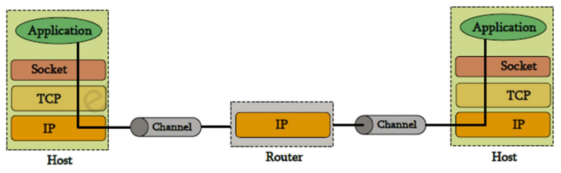

## Table of contents
{: .no_toc .text-delta }

1. TOC
{:toc}
---

# TCP/IP

## **컴퓨터 네트워크**
- 통신 채널을 통해서 컴퓨터(호스트와 라우터)들이 상호 연결된 것으로 정보 (데이터)를 이동 또는 공유
- **호스트 `Host`**
  - 네트워크 사용자
- **라우터 `Router`**
  - **하나의 통신 채널에서 다른 통신 채널로 데이터(정보)를 전달하거나 중계하는 기계**
  - 호스트와 호스트를 직접 연결하는 대신 몇 개의 호스트와 연결 , 또 다른 라우터에 연결하는 과정을 반복함으로써 네트워크를 형성
- [NAT은 무엇이며, 왜 필요한 것인가?](https://brunch.co.kr/@sangjinkang/61)

## **프로토콜**
- **상호 통신하는 프로그램 간 교환되는 패킷에 대하여 무엇을 의미하는지 등을 합의한 것**
  - *패킷 내에 착신지 정보의 위치 , 패킷의 크기 , 해석하는 방법 등*
- 프로토콜은 주어진 역량 내에서 특정 문제를 해결하기 위하여 설계
  - *http는 서버와 browse간 `hypertext`객체를 전달하는 문제를 해결*
- 유용한 네트워크는 **다른 많은 문제를 해결하는 것**
  - 관리가 쉽고 , 문제를 모듈화하기 위해서 서로 다른 문제를 해결하기 위한 다양한 프로토콜이 설계 되었다
  - *`TCP/IP` 프로토콜은 **프로토콜 술루션 중의 하나***

