## Table of contents
{: .no_toc .text-delta }

1. TOC
{:toc}
---

# 리눅스 프로세스 동작과 제어
- 리눅스는 `RAM`에서 바로 실행하는게 아니라 📌 **가상 메모리**(딱 1개 , 2<sup>64</sup>)를 사용하여 실행시킨다

# **Program**
- 소스 코드가 컴파일 된 실행 코드
- `binary`로 디스크와 같은 저장 매체에 휴면 상태로 저장되어 있는 것
- **규모가 크고 중요한 프로그램을 어플리케이션이라고도 한다**
- `/bin/ls` , `/usr/bin/cp`

# **Process**
- **실행중인 프로그램은 물론 프로그램을 실행하는데 필요한 모든 환경**
  - *즉 `context`를 통틀어 프로세스라고 한다*
- 프로세스에는 커널에서 유일한 식별자 `pid`가 할당된다
- **리눅스의 모든 프로세스는 부모와 자식 관계를 이루면서 실행된다** `(fork - exec)`

## Process의 일반적인 형식과 주소 공간 `Virtualized Memory`
- `ELF` (Executable & Loadable Format)
  - meta data & 코드와 데이터로 구성된 multiple section

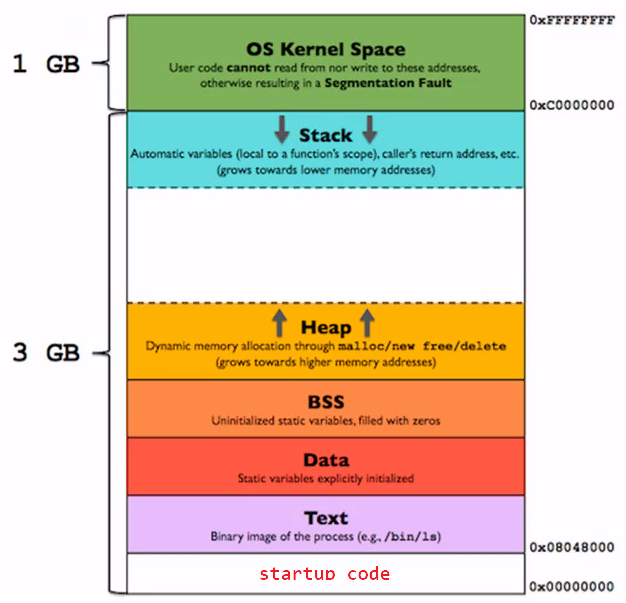

1. `Text` (read-only)
2. `Data` (initialized)
3. `Bss` (Filled with Zero)
4. `Heap` (malloc)
5. `Library`
6. `Stack`
7. `Kernel`

```c
#include <stdio.h>
#include <stdlib.h>
#include <unistd.h>
#include <string.h>

// 전역 변수
int a=10, a2=20;
int b, b2;

// 전역 함수
int f1(int x){
	return ++x;
}

int f2(int x){
	return --x;
}

int main(){
	int c=100, c2;
	char *d = "This is virtual memory layout of the process";
	// char *d; 
	char *name;
	
	name = malloc(40);
	name = "educafe";
	
	// 가상 메모리의 주소
	printf("addr(TEXT)=> \tmain:%p, f1:%p, f2:%p\n", main, f1, f2);
	printf("addr(CONST)=> \td:%p : %s\n", *(&d), d);
	printf("addr(DATA)=> \ta:%p, a2:%p, a_value:%d, a2_value:%d\n", &a, &a2,*(&a), *(&a2));
	printf("addr(BSS)=> \tb:%p, b2:%p, b_value:%d, b2_value:%d\n", &b, &b2, *(&b), *(&b2));
	printf("addr(HEAP)=> \tname_var:%p, name_addr:%p, name:%s\n", &name, name, name );
	printf("addr(STACK)=> c:%p, c_value:%d, c2:%p, c2_value:%d\n", &c, *(&c), &c2, *(&c2));
	printf("addr(STACK)=> \td:%p, d_value:%p\n", &d, *(&d));
	
	sleep(1);
	strcpy(d, "hello world");
	printf("addr(CONST)=> \td:%p : %s\n", d, d);
	return 0;
}
```

```

addr(TEXT)=>    main:0x55dc0461a1d1, f1:0x55dc0461a1a9, f2:0x55dc0461a1bd
addr(CONST)=>   d:0x55dc0461b008 : This is virtual memory layout of the process
addr(DATA)=>    a:0x55dc0461d010, a2:0x55dc0461d014, a_value:10, a2_value:20
addr(BSS)=>     b:0x55dc0461d01c, b2:0x55dc0461d020, b_value:0, b2_value:0
addr(HEAP)=>    name_var:0x7fff632a80f0, name_addr:0x55dc0461b035, name:educafe
addr(STACK)=>   c:0x7fff632a80e0, c_value:100, c2:0x7fff632a80e4, c2_value:0
addr(STACK)=>   d:0x7fff632a80e8, d_value:0x55dc0461b008
Segmentation fault (core dumped)

```

- `d`가 선언된 곳은 **STACK**이지만 실제 데이터들은 **CONST**에 있다
  - **STACK** d_value:0x5581bb57f008 ➜ **CONST** d:0x5581bb57f008 : This is virtual memory layout of the process


## 프로세스 환경 `Process Environment`
- **Start up 루틴**
  - C 프로그램의 `main()`함수가 호출되기 이전에 **커널에서 호출하는 특별한 Start-up 루틴이 존재한다.**
  - 컴파일러에 의해서 생성되는 실행 파일에는 `linker`에 의해서 정핸진 , 프로그램이 실행될 때 시작하는 **Start-up 루틴**의 시작주소가 포함되어 있다
  - **ASLR (Address Space Layer Randomization)**을 사용하면 시작 주소를 예상할 수 없다
  
- **argc 와 argv[]**
  - **Start up 루틴**은 일반적으로 커널을 사용하고 이러한 유형의 인수(argument)를 **명령줄 인수**라 한다

```c
    int main(int argc , char[] *argv[]){
        ...
    }
```

- `argc`는 정수형으로 명령줄에서 프로그램을 실행시 넘겨주는 인수의 갯수 정보를 포함
- `argv[]`는 `char array`형식으로 매개변수를 받으며 , 매개변수를 참조하는 포인터 `array`를 취급한다

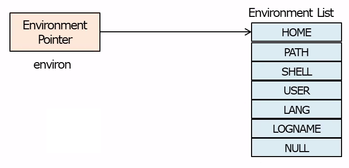

## 프로세스 관리 자료 구조 : **프로세스 서술자 `Process Descriptor`**
- **커널이 프로세스를 관리하기 위해 필요한 모든 정보는 커널 내부에서 프로세스의 프로세스 설명자에 저장**
- `struct task_struct`
  - 프로세스 ID
  - 프로세스 우선순위
  - 열린 파일
  - 프로세스 주소 공간 
  - 지연되거나 보류된 시그널들
  - 프로세스 상태 등..

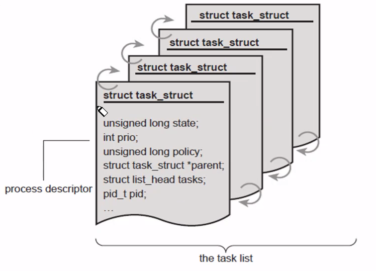

## 프로세스 상태 천이

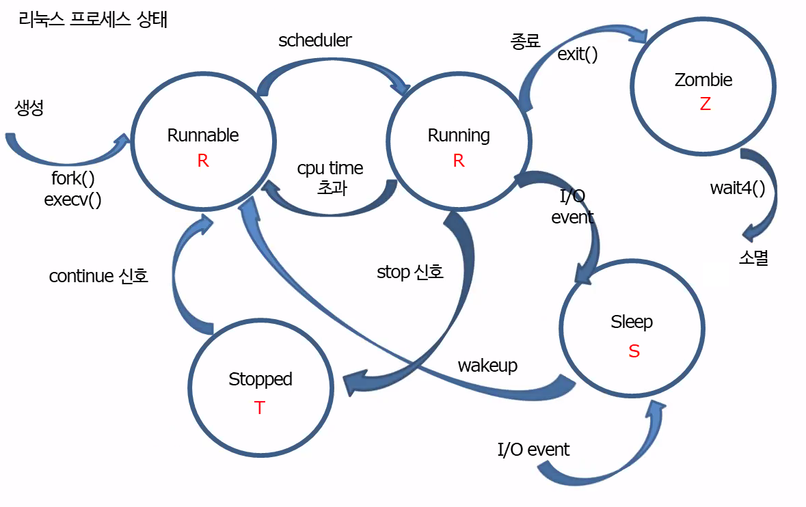

## 프로세스 **시스템 콜** (생성 / 교체 / 종료대기 / 종료 ...)
- `exec family` : 프로세스 교체 및 프로그램 실행
- `system`      : 프로세스에서 쉘 명령어 실행
- `fork`        : 프로세스 생성 
- `wait`        : 자식 프로세스가 종료될 때 까지 부모 프로세스 실행 대기
- `waitpid`     : 자식 프로세스가 종료될 때 까지 부모 프로세스 실행 대기 또는 동시 실행
- `exit`        : 프로세스 종료
- `getpid`      : 호출 프로세스의 id 반환
- `getppid`     : 호출 프로세스의 부모 프로세스 id 반환

## Zombie 프로세스
- **Signal SIGCHLD**
  - 프로세스가 종료되면 커널은 **SIGCHLD** 시그널을 부모에게 전달
- **자식이 부모보다 먼저 죽을 때 커널이 자식을 특수 프로세스 상태로 만들어야 한다고 결정한 것**
- 부모가 죽지 않아 자식이 먼저 끝나 **자식 프로세스가 좀비 상태**
- 이 상태의 프로세스는 부모가 상태 (좀비 프로세스가 대기 중)를 묻기를 대기
  - *`wait()` 또는 `waitpid()`*
- **종료된 자식이 보존한 정보를 부모에게 전달한 후에 비로소 프로세스가 공식적으로 종료되고 좀비로도 존재하지 않는다**

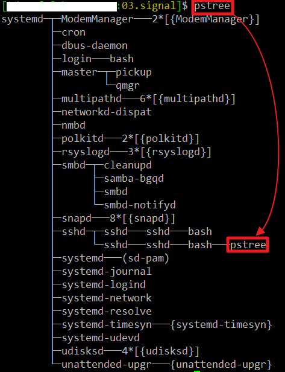

```c
#include <stdio.h>
#include <unistd.h>
#include <stdlib.h>
#include <sys/types.h>
#include <time.h>

int main(int argc, char *argv[]){
	pid_t pid;
	time_t startTimec, startTimep;
	
	if((pid = fork()) < 0){
		perror("fork");
		exit(1);
	}else if(pid == 0){		//Child process
		printf("\e[31mCHILD PROCESS---- (%d)\e[00m\n", getpid());
		for (startTimec = time(NULL); time(NULL) < startTimec + 8;){
				for(int i=0; i<100000000; i++);
				write(1, "+", 1);
		}
		exit(0);
	}else{					//Parent process
		printf("\e[00mPARENT PROCESS ---(%d)\n", getpid());
		for (startTimep = time(NULL); time(NULL) < startTimep + 10;){
				for(int i=0; i<100000000; i++);
				write(1, "*", 1);
		}
		sleep(100);
	}
	return 0;
}
```

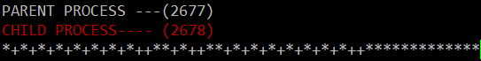

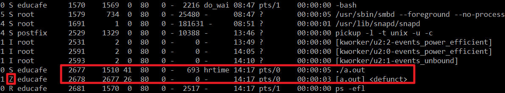

### `wait()` vs `waitpid()`
- **wait()**
  - `wait()`함수를 호출하면 커널은 종료된 자식 프로세스의 `pid`를 반환하고 종료된 프로세스가 없는 경우 종료될 때 까지 부모 프로세스의 수행을 중지 시킨다
  - `wait()`함수를 호출 시 **자식 프로세스가 이미 종료된 경우 즉시 반환**
- **waitpid()**
  - `wait()`시스템 콜에서 설정할 수 없었던 특정 프로세스에 대한 설정이나 자식 프로세스로부터 **시그널이 도착될 때 까지 동작을 조정할 수 있다**
  - **여러 개의 하위 프로세스가 있으면 모든 하위 프로세스의 종료를 기다리거나 특정 하위 프로세스의 종료를 기다릴 수 있다**

```c
void handler(int signo) {
	pid_t exit_pid;
	printf("\nhandler_pid [%d], handler_ppid [%d]\n", getpid(), getppid());
	exit_pid = waitpid(-1, NULL, WNOHANG);
	if(exit_pid == -1)
		// printf("waitpid error with ERRNO=%d meaning %s\n", errno,  strerror(errno));
		perror("waitpid");
	else
		printf("Terminated child PID = %d\n", exit_pid);
}

int main() {
	signal(SIGCHLD, handler);
	pid_t pid=fork();
	if(pid == 0){
		printf("child pid [%d] with ppid [%d] started\n", getpid(), getppid());
		switch(fork()) {
			case 0:
				printf("grand-child pid [%d] of ppid [%d] started\n", getpid(), getppid());
				int ret=system("sleep 5");
				exit(0);
			default:
				printf("original child pid [%d] of ppid [%d] continued\n", getpid(), getppid());
				sleep(10);
				exit(0);
		}
	}else{
		printf("main pid [%d] of ppid [%d] continued\n", getpid(), getppid());
		sleep(15);
		printf("\n");
	}
}
```

```
main pid [2939] of ppid [1510] continued
child pid [2940] with ppid [2939] started
original child pid [2940] of ppid [2939] continued
grand-child pid [2941] of ppid [2940] started

handler_pid [2941], handler_ppid [2940]
waitpid: No child processes

handler_pid [2940], handler_ppid [2939]
Terminated child PID = 2941

handler_pid [2939], handler_ppid [1510]
Terminated child PID = 2940
```

## `fork()` 동작과 **COW (Copy On Write) 구조**
- `fork()`시 부모의 메모리 배치를 복사
  - *동일한 데이터 참조*
- **Child가 데이터 번경을 하게 된다면**
  - 변경된 데이터가 포함된 메모리 페이지 복사
  - 부모가 자식이 서로 다른 데이터를 참조하게 된다

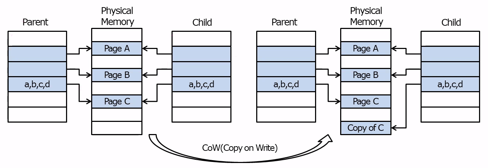

## 프로세스 종료 `_exit()` , `exit()`
- `_exit()` 시스템 콜
  - **호출하는 프로세스를 즉시 종료**
- `exit()`라이브러리 함수
  - **일반적인 프로세스 종료 절차를 야기**
  - 자식 프로세스가 종료되는 경우 **status**의 값이 부모 프로세스에게 반환된다
- **프로세스가 자신을 종료할 때 사용**
- 자식 프로세스에서의 `exit()`함수의 인수 **status**는 `wait()`이나 `waitpid()` 함수를 이용하여 자식 프로세스의 종료를 기다리는 부모 프로세스에게 전달된다
  - *일반적으로 **정상적인 종료 : 0** , **비정상적인 종료 : 0이 아닌 값***

```c
#include <stdio.h>
#include <stdlib.h>
#include <unistd.h>
#include <sys/wait.h>

void hello() {
   printf("Hello\n");
}
void world(int exit_code, void *arg) {
   printf("world with CODE=%d and MSG=%s\n", exit_code, (char *)arg);
}

int main() {
   /* register the termination function */
   atexit(hello);
   on_exit(world, "Good Bye");
   
   printf("Starting  main program...\n");

   printf("Exiting main program...\n");
   
   exit(10);
// Starting  main program...
// Exiting main program...
// world with CODE=10 and MSG=Good Bye
// Hello

  // _exit(20);
// 시스템 콜 _exit은 atexit , on_ext가 실행되지 않는다
// Starting  main program...
// Exiting main program...

   // return 100;
}
```

## 프로세스의 교체 및 실행 `exec()`
- **exec 계열 라이브러리** : execl , execlp , execv , execvp , ...
- 현재 동작중인 프로세스 이미지를 `path`에서 지정한 프로그램을 메모리에 로딩하면서 새로운 것으로 대체하면서 어드레스 주소를 바꿈
    1. pending 시그널 정보를 잃어버림
    2. signal handler가 프로세스 주소에 더 이상 존재하지 않기 때문에 모든 시그널 처리는 기본 동작으로 처리
    3. 잠궈둔 메모리가 없어짐
    4. 대부분의 쓰레드 속성이 기본값으로 돌아간다
    5. 매핑된 파일을 포함하여 프로세스의 메모리 주소 공간과 관련된 모든 항목이 지워진다
- **pid , 부모 pid , 우선 순위 및 소유 사용자 및 그룹은 모두 동일하게 유지**

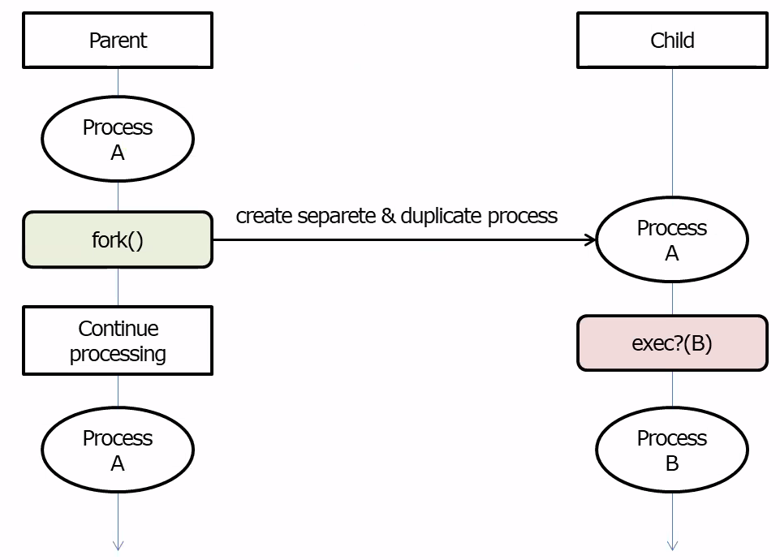


## 데몬 프로세스 생성 `Daemon`
- 주로 시스템 시작시 생성되었다가 시스템 종료 시 까지 실행되는 프로세스
  - **백그라운드 프로세스**
- **SysV** : 더블 포킹

```c
void sigHandler(int sig);

int fd;
const char pidfile[] = "/run/mydaemon.pid";
const char daemonlog[]="/tmp/mydaemon.log";

int main(int argc, char * argv[]) {
	pid_t pid, sid;
	int fd0, fd1, fd2;
	time_t now;
	
	struct sigaction action;
		
	if((pid = fork()) != 0) {
		exit(0);							//parent exit and child continues
	}
	
	sid=setsid();
	if((pid = fork()) == -1) {
		perror("Second fork failed");
		exit(0);					
	}else if(pid > 0){						//parent(child) do something before exit
		if ((fd = open(pidfile, O_RDWR | O_CREAT)) == -1){
			perror("Can't open file for writing");
			return 1;
		}
		/* write pid to file */
		dprintf(fd, "%d\n", pid); 
		close(fd); 						/* close the file pointer */
		exit(0);
	}
	
	umask(0); 			
	if(chdir("/") !=0 ) {
		perror("chdir");
		exit(1);
	}
	
	close(STDIN_FILENO); close(STDOUT_FILENO); close(STDERR_FILENO);
	fd0=open("/dev/null", O_RDONLY); 		/* 0 = stdin */
	fd1=open("/dev/null", O_WRONLY); 		/* 1 = stdout */
	fd2=open("/dev/null", O_RDWR); 			/* 2 = stderr */
	
	/* prepare for sigaction */
	action.sa_handler = sigHandler;
	sigfillset(&action.sa_mask);
	action.sa_flags = SA_RESTART;
	/* register the signals we want to handle */
	sigaction(SIGTERM, &action, NULL);
	sigaction(SIGINT, &action, NULL);
	sigaction(SIGQUIT, &action, NULL);
	sigaction(SIGABRT, &action, NULL);
	
	if((access(daemonlog, F_OK)) == 0){
	   unlink(daemonlog);
   }
	
	if ((fd = open(daemonlog, O_CREAT | O_RDWR | O_TRUNC, 0644)) == -1){
		perror("Can't open daemonlog");
		return 1;
	}
	while(1){
        // 실제 원하는 로직
		time(&now);
		dprintf(fd, "Mydaemon alive at %s", ctime(&now));
		sleep(5);
	}
	return 0;
}

void sigHandler(int sig){
    int status = 0;
    if ( sig == SIGTERM || sig == SIGINT || sig == SIGQUIT || sig == SIGABRT ){
        if ((unlink(pidfile)) == -1)			/* remove the pid-file */
            status = 1;
        if ((close(fd)) == -1)
            status = 1;
		if ((unlink(daemonlog)) == -1)			/* remove the daemonlog */
            status = 1;
        exit(status); 							/* exit with the status set*/
    }else{										/* some other signal */
        exit(1);
    }
}
```

```ini
[Unit]
Description=Mydaemon testing via by systemd
[Service]
ExecStart=/usr/local/sbin/09.mydaemon-systemd
Restart=on-failure
Type=forking
PIDFile=/run/mydaemon.pid
[Install]
WantedBy=multi-user.target
```

1. `sudo cp 09.mydaemon-systemd /usr/local/sbin`
2. `sudo cp 09.mydaemon.service /etc/systemd/system`
3. `sudo systemctl daemon-reload`
4. `sudo systemctl status 09.mydaemon.service`


```
○ 09.mydaemon.service - Mydaemon testing via by systemd
     Loaded: loaded (/etc/systemd/system/09.mydaemon.service; disabled; vendor preset: enabled)
     Active: inactive (dead)
```

5. `sudo systemctl start 09.mydaemon.service`
6. `systemctl enable 09.mydaemon.service`

```
● 09.mydaemon.service - Mydaemon testing via by systemd
     Loaded: loaded (/etc/systemd/system/09.mydaemon.service; enabled; vendor preset: enable>
     Active: active (running) since Thu 2022-05-26 16:48:34 KST; 1min 55s ago
   Main PID: 3340 (09.mydaemon-sys)
      Tasks: 1 (limit: 4580)
     Memory: 204.0K
        CPU: 3ms
     CGroup: /system.slice/09.mydaemon.service
             └─3340 /usr/local/sbin/09.mydaemon-systemd

May 26 16:48:34 ubuntu2204 systemd[1]: Starting Mydaemon testing via by systemd...
May 26 16:48:34 ubuntu2204 systemd[1]: Started Mydaemon testing via by systemd.
```

```
1 S root        3340       1  0  80   0 -   693 -      16:48 ?        00:00:00 /usr/local/sbin/09.mydaemon-systemd
```

***

# **IPC `Inter Process Communication`**

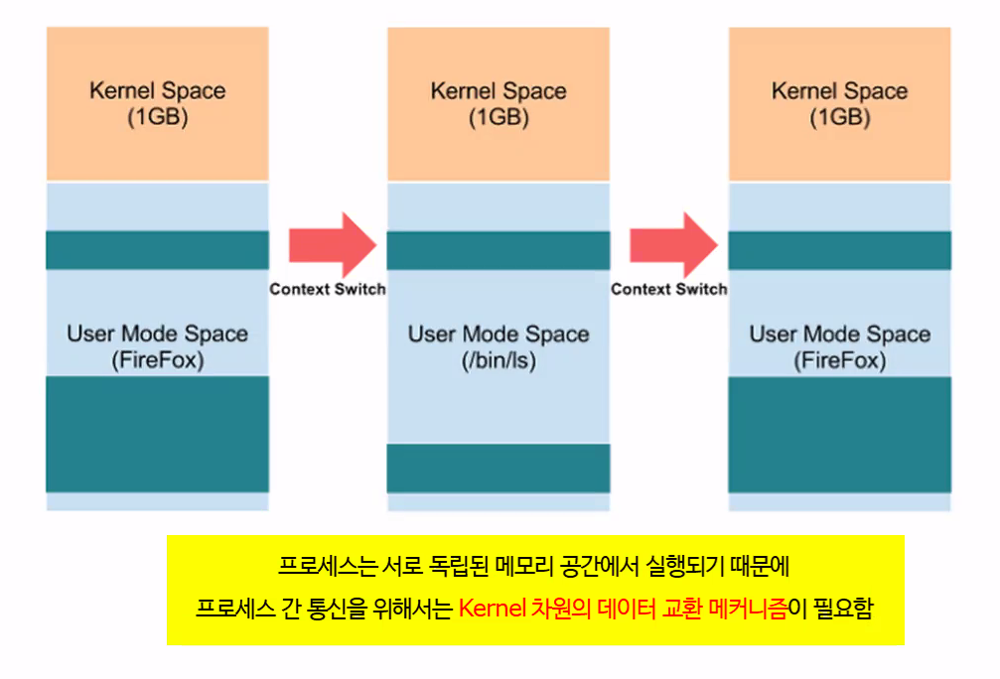

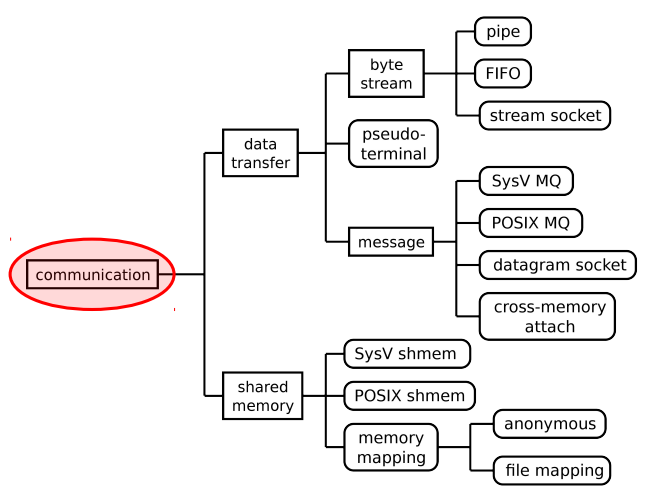

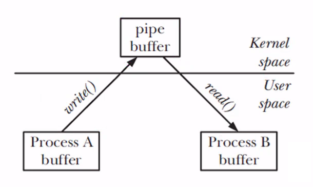

- **데이터 전송**
  - 데이터 전송의 핵심은 읽기와 쓰기

## 파이프

- **리눅스 파이프**

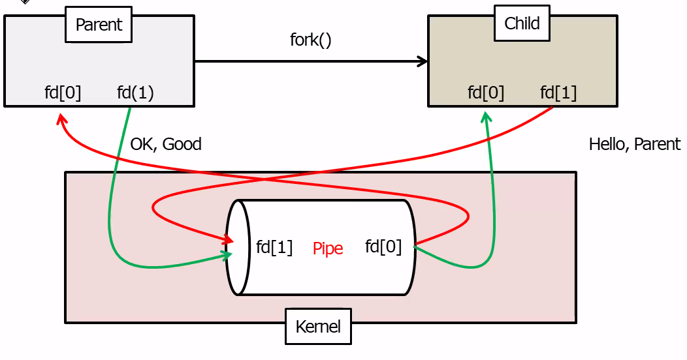

```c
#include <stdio.h>
#include <string.h>
#include <stdlib.h>
#include <unistd.h>
#include <sys/types.h>
#include <time.h>

int main(void) {
	int pd[2], read_fd, write_fd;
	pid_t pid;
	time_t timer1, timer2;
	char tx_buf[100], rx_buf[100];
	
	if ( pipe(pd) == -1 ) {
		perror("pipe");    
		exit(1);    
	}
	
	read_fd = pd[0];    
	write_fd = pd[1];
  
	switch(pid=fork()) {
		case 0: 
			close(read_fd);
			for(int i=0; i<11; i++){
				// for(timer1=time(NULL); time(NULL)<timer1 + 1;)
				// continue;
				// strcpy(tx_buf, "\e[31mHello Parent. I am child.");
				sprintf(tx_buf, "\e[31mHello Parent. I am child ---%d\n", i);
				write(write_fd, tx_buf, strlen(tx_buf)+1);
				for(timer1=time(NULL); time(NULL)<timer1 + 1;)
				continue;
				// read(read_fd, rx_buf, sizeof(rx_buf));
				// printf("\e[00m--------> CHILD: %s\n", rx_buf);
			}
			exit(0);
		default:   
#if 1
			close(write_fd);
			for(int i=0; i<10; i++){
				// for(timer2=time(NULL); time(NULL)<timer2 + 2;)
					// continue;
				// memset(&rx_buf[0], 0, sizeof(rx_buf));
				read(read_fd, rx_buf, sizeof(rx_buf));
				printf("\e[00mPARENT: %s\n", rx_buf);
				// for(timer2=time(NULL); time(NULL)<timer2 + 2;)
					// continue;
				// strcpy(tx_buf, "\e[00mHello Child. I am Parent");
				// sprintf(tx_buf, "\e[00mWeleome Child. I am Parent--%d\n", i);
				// write(write_fd, tx_buf, strlen(tx_buf)+1);
			}
#else
			for(int i=0; i<10; i++){
				for(timer2=time(NULL); time(NULL)<timer2 + 2;)
					continue;
				strcpy(tx_buf, "\e[00mHello Child. I am Parent");
				write(write_fd, tx_buf, strlen(tx_buf)+1);
				read(read_fd, rx_buf, sizeof(rx_buf));
				printf("\e[00mPARENT: %s\n", rx_buf);
			}
#endif
			exit(0);
	}
}
```

- FIFO (Named Pipe) `mkfifo`

- recv
```c
int main(){
	int fd;
	char buf[128];
	int count = 0;
	
	if((access ("/tmp/myfifo", F_OK)) != 0){
		if(mkfifo("/tmp/myfifo", S_IRUSR | S_IWUSR) == -1){
			perror("mkfifo");
			exit(1);
		}
	}
	
	if((fd = open("/tmp/myfifo", O_RDWR)) == -1){
		perror("open");
		exit(1);
	}
	
	while(1){
		memset(buf, 0, sizeof(buf));
		read(fd, buf, sizeof(buf));
		printf("Rx - %s\n", buf);
		if(strstr(buf, "end")){
			break;
		}
	}
	close(fd);
	unlink("/tmp/myfifo");
	return 0;
}
```

- send
```c
int main(){
	int fd, i;
	char buf[128];
	time_t timer1;
	
	if((fd = open("/tmp/myfifo", O_RDWR)) == -1){
		perror("open");
		exit(2);
	}
	
	for(i=0; i<5; i++){
		memset(buf, 0, sizeof(buf));
		sprintf(&buf[0], "Hello(%d)", i);
		write(fd, &buf[0], strlen(buf)+1);
		printf("Tx: %s\n", buf);
		for(timer1=time(NULL); time(NULL)<timer1 + 2;)
			continue;
	}
	memset(buf, 0, sizeof(buf));
	sprintf(buf, "end");
	write(fd, buf, strlen(buf)+1);
	close(fd);
	/* unlink("/tmp/mkfifo"); */
	return 0;
}
```

## 공유 메모리 Shared Memory


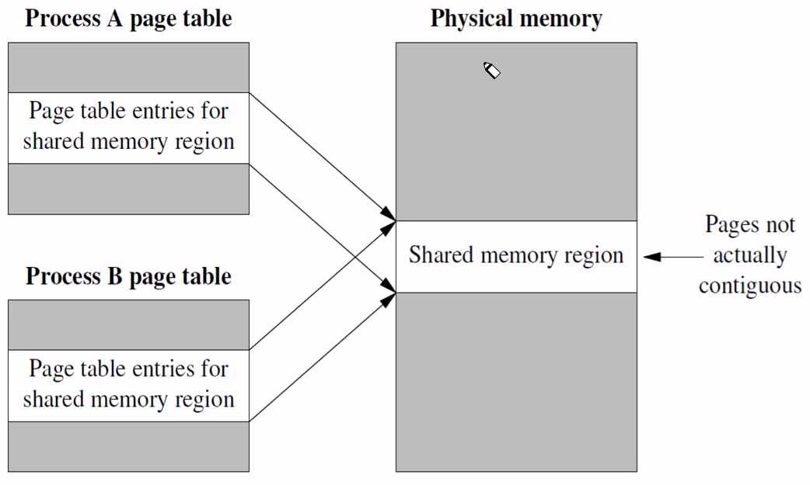

### System V Shared Memory

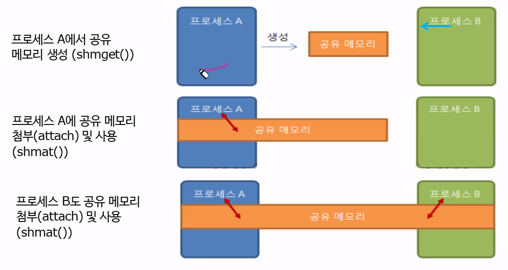


- write
```c
#define  KEY_NUM     0x2222
#define  MEM_SIZE    1024

int main() {
	int shm_id;
	void *shm_addr, *shm_addr_dt;
	int count;
	
	if((shm_id = shmget((key_t)KEY_NUM,MEM_SIZE,IPC_CREAT|0666)) == -1){
		perror("shmget");
		exit(1);
	}
	
	printf("Please enter to attach shared memory ->\n");
	getchar();
	
	
	if((shm_addr = shmat(shm_id, NULL, 0)) == (void *)-1){
		perror("shmat");
		exit(1);
	}
	shm_addr_dt = shm_addr;
	
	// write(shm_id, "hello", 5);
	
	for(count=11; count<=15; count++){
		sprintf((char *)shm_addr, "%d", count); 
		printf( "Write Counter : %s\n", (char *)shm_addr);
		shm_addr = shm_addr + sizeof(int);
		sleep(1);
	}
	
	sprintf((char *)shm_addr, "end");
	
	printf("Please enter to detach shared memory ->\n");
	getchar();
	if(shmdt(shm_addr_dt) !=0){
		perror("shmdt");
		exit(2);
	}
	
	if(shmctl(shm_id, IPC_RMID, NULL) == -1){
		perror("shmctl");
		exit(2);
	}
	
	return 0;
}
```

- read
```c
#define  KEY_NUM     0x2222
#define  MEM_SIZE    1024

int main() {
	int shm_id;
	void *shm_addr, *shm_addr_dt;
	int count=0;
	char buf[128];
	
	if((shm_id = shmget((key_t)KEY_NUM,MEM_SIZE,IPC_CREAT|0666)) == -1){
		perror("shmget");
		exit(1);
	}
	
	if((shm_addr = shmat(shm_id, NULL, 0)) == (void *)-1){
		perror("shmat");
		exit(1);
	}
	shm_addr_dt = shm_addr;
	// read(shm_id, buf, 5);
	// printf("%s\n", buf);
	while(1){
		printf("\t\e[31mRead counter %s\e[0m\n", (char *)shm_addr);
		if(!strcmp(shm_addr, "end")){
			break;
		}
		shm_addr = shm_addr + sizeof(int);
		sleep(1);
		if(count == 6){
			count = 0;
			shm_addr = shm_addr_dt;
		}
		count++;
	}
	if(shmdt(shm_addr_dt) !=0){
		perror("shmdt");
		exit(2);
	}
	return 0;
}
```

```
Please enter to attach shared memory ->

Write Counter : 11
Write Counter : 12
Write Counter : 13
Write Counter : 14
Write Counter : 15
Please enter to detach shared memory ->
```

```
    ...
    Read counter
    Read counter
    Read counter
    Read counter 11
    Read counter 12
    Read counter 13
    Read counter 14
    Read counter 15
    Read counter end
```

### POSIX 공유 메모리

- write

```c
#define  MEM_SIZE    128

int main() {
	int fd;
	void *shm_addr;
	const char *message0= "Welcome to ";
	const char *message1= "Linux Systems ";
	const char *message2= "Programming!";
	
	//메모리 객체 생성
	fd = shm_open("/mydata", O_RDWR | O_CREAT, 0666);
	
	//메모리 객체 크기 설정
	ftruncate(fd, MEM_SIZE);
		
	//메모리 객체 매핑
	shm_addr = mmap(0, MEM_SIZE, PROT_WRITE, MAP_SHARED, fd, 0);
	printf( "Map addr is %p\n", shm_addr );
#if 1	
	write(fd, message0, strlen(message0));
	write(fd, message1, strlen(message1));
	write(fd, message2, strlen(message2));
#else
	memcpy(shm_addr, message0, strlen(message0));
	shm_addr += strlen(message0);
	sprintf(shm_addr, message1, strlen(message1));
	shm_addr += strlen(message1);
	memcpy(shm_addr, message2, strlen(message2));
	shm_addr += strlen(message2);
#endif
	printf("Press enter when read ");
	getchar();
	munmap(shm_addr, MEM_SIZE);
	shm_unlink("/mydata");
	close(fd);
	return 0;
}
```

- read
```c
#define  MEM_SIZE    128

int main() {
	int fd;
	void *shm_addr;
	char buf[128];

	fd = shm_open("/mydata", O_RDONLY, 0666);
	if(fd == -1){
		perror("shm_open");
		exit(1);
	}
	
	//메모리 객체 매핑
	shm_addr = mmap(0, MEM_SIZE, PROT_READ, MAP_SHARED, fd, 0);
	if(shm_addr == (void *)-1){
		perror("mmap error");
		return EXIT_FAILURE;
	}
#if 0	
	memset(buf, 0, MEM_SIZE);
	read(fd, buf, MEM_SIZE);
	printf("%s\n", buf);
#else
	memcpy(buf, shm_addr, sizeof(buf));
	printf("Map addr is %p\n", shm_addr);
	printf("Read message: %s\n", buf);
#endif
	shm_unlink("/mydata");
	return 0;
}
```

### System V Message Queue

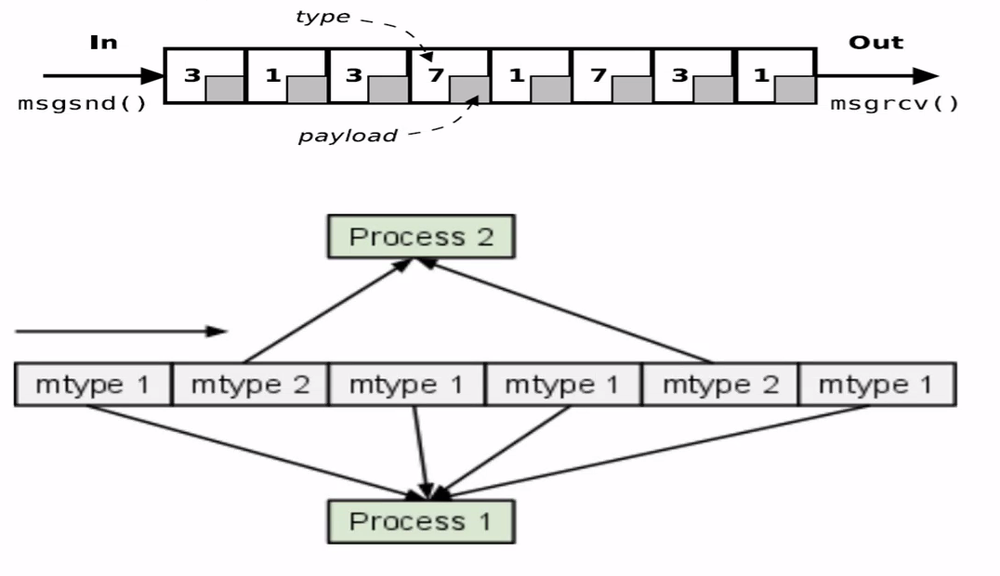
