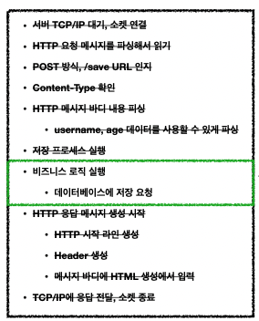
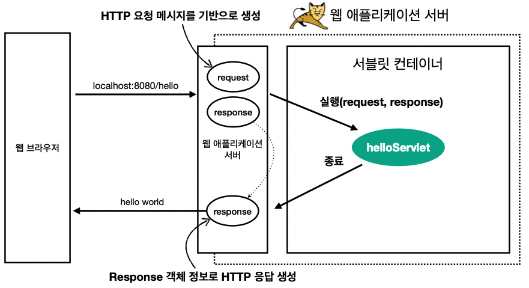
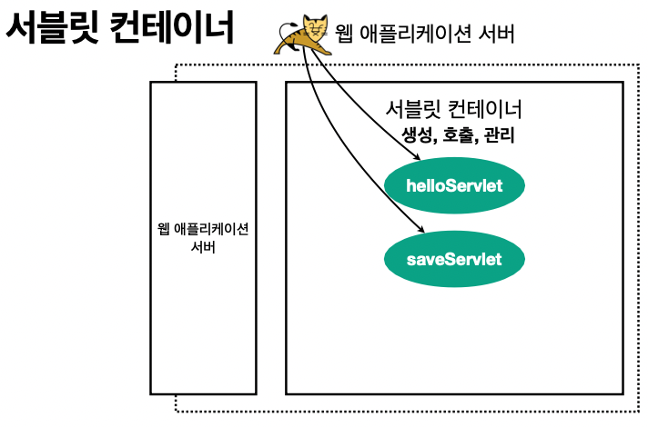
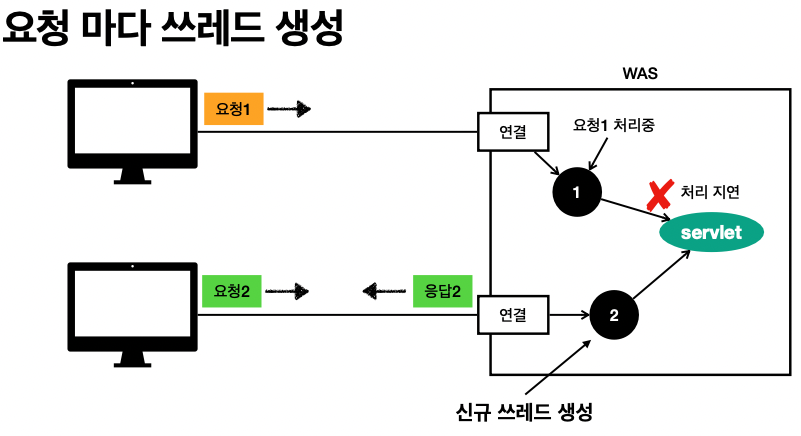

## Table of contents
{: .no_toc .text-delta }

1. TOC
{:toc}

---

# **Servlet**

- [Spring MVC 강의](https://www.inflearn.com/course/%EC%8A%A4%ED%94%84%EB%A7%81-mvc-1/dashboard)를 보다가 서블릿을 확실히 이해하고자 정리한다.





- **서블릿을 지원하는 WAS를 사용하면 위 이미지의 검은 실선의 작업들을 서블릿이 직접 수행 해준다고한다.**
- **Servlet**으로 구현한 [코드](https://github.com/jdalma/Project/blob/master/TEAM_Model2_JSP/src/com/ode/member/MemberController.java)를 확인해보자
- ~~프로젝트를 진행하면서 서블릿을 사용하였지만 확실한 개념은 없었다..~~

```java
@WebServlet("/member/*")
public class MemberController extends HttpServlet {
	
	MemberVO memberVO;
	MemberService memberService;
	HttpSession session;
	String totalEmail;
	public MemberController(){
		memberService = new MemberService();
	}


	@Override
	protected void doGet(HttpServletRequest request, HttpServletResponse response) 
			throws ServletException, IOException {
		doHandle(request,response);
	}
	
	@Override
	protected void doPost(HttpServletRequest request, HttpServletResponse response) 
			throws ServletException, IOException {
		doHandle(request,response);
	}
    ...
```



1. **WAS**는 **HTTP 요청 메세지를 기반으로** `Request`와 `Response` 객체를 새로 만들어 서블릿 객체를 호출한다.
1. `/member/*` 해당 패턴과 같다면 서블릿 코드가 실행된다.
1. **WAS**는 `Response`에 담겨있는 내용으로 **HTTP 응답 정보를 생성한다.**

## **Request 와 Response는 실제로 어떻게 객체로 만들어질까??** ❓

# **Servlet Container**



- **Servlet Container**가 `/member/*` 해당 **Servlet**을 호출하여 주고 객체의 생명주기를 담당한다. **(싱글톤으로 관리)**
- 톰캣처럼 서블릿을 지원하는 **WAS**를 **Servlet Container**라고 한다.
- JSP도 서블릿으로 변환되어서 사용한다. ❓
- **동시 요청을 위한 멀티 쓰레드 처리를 지원한다.** 📌

# **Multi Thread**

- **서블릿 객체를 누가 호출하지?** ➔ 쓰레드 



- **장점**
  - 동시 요청을 처리 가능
  - 리소스가 허용될 때 까지 처리가능
  - 하나의 쓰레드가 지연되어도 , 나머지 쓰레드는 정상 동작한다.
- **단점**
  - 쓰레드는 생성 비용은 매우 비싸다.
  - 쓰레드는 컨텍스트 스위칭 비용이 발생한다.
  - 쓰레드 생성에 제한이 없어 , CPU 또는 메모리 임계점을 넘을수도 있다.


## **Thread Pool**
- 쓰레드가 필요하면 이미 생성되어 있는 쓰레드를 꺼내어 사용 후 반납
- 초과 시 **대기 또는 거절**할 수 있다.
  - 톰캣은 최대 200개 기본 설정
- 쓰레드가 미리 생성되어 있고 , 쓰레드를 생성하고 종료하는 비용이 절약되고 , 응답시간이 빠르다.
- **WAS**의 주요 튜닝 포인트는 최대 쓰레드 수이다.
  - 적정 숫자는 로직의 복잡도 , CPU , 메모리 , IO 리소스 상황에 따라 모두 다름
  - 성능 테스트 툴 : 아파치 ab , Jmeter , **nGrinder**

## **[RequestContextHolder , Child Thread도 똑같은 RequestContextHolder 가져오기](https://gompangs.tistory.com/entry/Spring-RequestContextHolder)**
## **[Spring RequestContextHolder - 어디서든 HttpServletReqeust 사용하기](http://dveamer.github.io/backend/SpringRequestContextHolder.html)**
