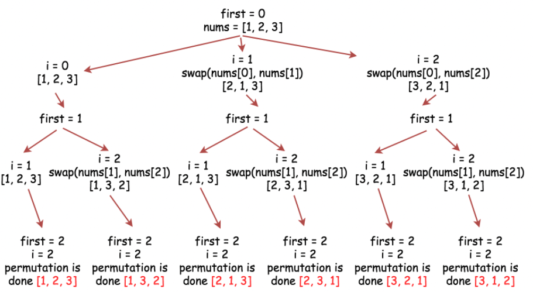

## Table of contents
{: .no_toc .text-delta }

1. TOC
{:toc}

---

## **`Binary Search` [Search Insert Position](https://leetcode.com/problems/search-insert-position/)**

```java
class Solution {
    public int searchInsert(int[] nums, int target) {
        if(nums[nums.length - 1] < target) return nums.length;
        int left = 0;
        int right = nums.length - 1;
        while(left <= right){
            int mid = left + (right - left) / 2;
            if(nums[mid] == target) return mid;
            else if(nums[mid] < target)
                left = mid + 1;
            else 
                right = mid - 1;
        }
        return left;
    }
}
```

## **`Two Pointers` [Squares of a Sorted Array](https://leetcode.com/problems/squares-of-a-sorted-array/)** ✨

```java

class Solution {
    public int[] sortedSquares(int[] nums) {
        int[] result = new int[nums.length];
        int start = 0;
        int end = nums.length - 1;
        int insert = end;
        while(start <= end){
            int pow1 = nums[start] * nums[start];
            int pow2 = nums[end] * nums[end];
            if(pow1 > pow2){
                result[insert--] = pow1;
                start++;
            }
            else{
                result[insert--] = pow2;
                end--;
            }
        }
        
        return result;
    }
}
```

***

## **`Two Pointers` [Rotate Array](https://leetcode.com/problems/rotate-array/submissions/)**

### 여분의 배열 사용 , 공간 : `O(N)`

```java
class Solution {
    public void rotate(int[] nums, int k) {
        int[] result = new int[nums.length];
        for(int i = 0 ; i < nums.length ; i++){
            result[(i + k) % nums.length] = nums[i];
        }
        for(int i = 0 ; i < nums.length ; i++){
            nums[i] = result[i];
        }
    }
}
```

### 공간 : `O(1)` 👍 

```
n = 7 , k = 3

Original List                   : 1 2 3 4 5 6 7
After reversing all numbers     : 7 6 5 4 3 2 1
After reversing first k numbers : 5 6 7 4 3 2 1
After revering last n-k numbers : 5 6 7 1 2 3 4 --> Result
```

```java
class Solution {
    public void rotate(int[] nums, int k) {
        k %= nums.length;
        reverse(nums , 0 , nums.length - 1);
        reverse(nums , 0 , k - 1);
        reverse(nums , k , nums.length - 1);
    }
    
    public void reverse(int[] nums , int start , int end){
        while(start < end){
            int tmp = nums[start];
            nums[start] = nums[end];
            nums[end] = tmp;
            start++;
            end--;
        }
    }
}
```

***

## **`Two Pointers` [Move Zeroes](https://leetcode.com/problems/move-zeroes/)**

### 👎 `임시 배열 생성`

```java
class Solution {
    public void moveZeroes(int[] nums) {
        int[] tmp = new int[nums.length];
        int tmpIndex = -1;
        int zeroCount = 0;
        
        for(int i = 0 ; i < nums.length ; i++){
            if(nums[i] == 0){
                zeroCount++;
                continue;
            }
            tmpIndex++;
            tmp[tmpIndex] = nums[i];
        }
        
        for(int i = nums.length - zeroCount ; i < nums.length ; i++){
            tmp[i] = 0;
        }
        
        for(int i = 0 ; i < nums.length ; i++){
            nums[i] = tmp[i];
        }
    }
}
```

### 👍 `최적화`

```java
class Solution {
    public void moveZeroes(int[] nums) {
        int lastNoneZeroIndex = 0;
        
        for(int i = 0 ; i < nums.length ; i++){
            if(nums[i] != 0){
                nums[lastNoneZeroIndex++] = nums[i];
                continue;
            }
        }
        
        for(int i = lastNoneZeroIndex ; i < nums.length ; i++){
            nums[i] = 0;
        }
    }
}
```

***

## **`Two Pointers` [Two Sum II - Input Array Is Sorted](https://leetcode.com/problems/two-sum-ii-input-array-is-sorted/)**

### `Two Pointers`

```java
class Solution {
    public int[] twoSum(int[] numbers, int target) {
        int[] result = new int[2];
        int left = 0;
        int right = numbers.length - 1;
        while(left < right){
            int sum = numbers[left] + numbers[right];
            if(target == sum){
                result[0] = left + 1;
                result[1] = right + 1;
                break;
            }
            else if(sum < target){
                ++left;
            }
            else{
                --right;
            }
        }
        return result;
    }
}
```


### 👍 `Binary Search`

```java
class Solution {
    public int[] twoSum(int[] numbers, int target) {
        int[] result = new int[2];
        int left = 0;
        int right = numbers.length - 1;
        while(left < right){
            int mid = (left + right) / 2;
            int sum = numbers[left] + numbers[right];
            if(target == sum){
                result[0] = left + 1;
                result[1] = right + 1;
                break;
            }
            else if(sum < target){
                left = (numbers[mid] + numbers[right] < target) ? mid : left + 1;
            }
            else{
                right = (numbers[mid] + numbers[left] > target) ? mid : right - 1;
            }
        }
        return result;
    }
}
```

***

## **`Two Pointers` [Reverse String](https://leetcode.com/problems/reverse-string/)**

```java
class Solution {
    public void reverseString(char[] s) {
        int left = 0;
        int right = s.length - 1;
        while(left < right){
            char tmp = s[left];
            s[left] = s[right];
            s[right] = tmp;
            left++;
            right--;
        }
    }
}
```

***

## **[Reverse Words in a String III](https://leetcode.com/problems/reverse-words-in-a-string-iii/)**

### `Two Pointers`

```java
class Solution {
    public String reverseWords(String s) {
        StringBuilder sb = new StringBuilder();
        String[] sArr = s.split(" ");
        int count = 1;
        for(String word : sArr){
            for(int i = word.length() - 1 ; i >= 0 ; i--){
                sb.append(word.charAt(i));
            }
            if(count != sArr.length){
                sb.append(" ");
                count++;
            }
        }
        return sb.toString();
    }
}
```

### `Stream` ✨

```java
class Solution {
    public String reverseWords(String s) {
        return Arrays.stream(s.split(" "))
            .map(word -> new StringBuilder(word).reverse().toString())
            .collect(Collectors.joining(" "));
    }
}
```

***

## **[Middle of the Linked List](https://leetcode.com/problems/middle-of-the-linked-list/)**

### `Array`

```java
/**
 * Definition for singly-linked list.
 * public class ListNode {
 *     int val;
 *     ListNode next;
 *     ListNode() {}
 *     ListNode(int val) { this.val = val; }
 *     ListNode(int val, ListNode next) { this.val = val; this.next = next; }
 * }
 */
class Solution {
    public ListNode middleNode(ListNode head) {
        ListNode[] arr = new ListNode[101];
        int depth = 0;
        while(head != null){
            arr[depth++] = head;
            head = head.next;
        }
        return arr[depth / 2];
    }
}
```

### `Pointer` ✨

```java
/**
 * Definition for singly-linked list.
 * public class ListNode {
 *     int val;
 *     ListNode next;
 *     ListNode() {}
 *     ListNode(int val) { this.val = val; }
 *     ListNode(int val, ListNode next) { this.val = val; this.next = next; }
 * }
 */
class Solution {
    public ListNode middleNode(ListNode head) {
        ListNode slow = head;
        ListNode fast = head;
        int depth = 0;
        while(fast != null && fast.next != null){
            slow = slow.next;
            fast = fast.next.next;
        }
        return slow;
    }
}
```

***

# **[Remove Nth Node From End of List](https://leetcode.com/problems/remove-nth-node-from-end-of-list/)**

## `Two Pass algorithm`

```java
/**
 * Definition for singly-linked list.
 * public class ListNode {
 *     int val;
 *     ListNode next;
 *     ListNode() {}
 *     ListNode(int val) { this.val = val; }
 *     ListNode(int val, ListNode next) { this.val = val; this.next = next; }
 * }
 */
class Solution {
    public ListNode removeNthFromEnd(ListNode head, int n) {
        int length = 0;
        ListNode currentNode = head;
        
        // find length of list
        while(currentNode != null){
            currentNode = currentNode.next;
            length++;
        }
        
        if(length == n){
            return head.next;
        }
        
        // find node to remove index = (length - n)
        int nodeBeforeRemoveIndex = length - n - 1;
        currentNode = head;
        
        for(int i = 0 ; i < nodeBeforeRemoveIndex ; i++){
            currentNode = currentNode.next;
        }
        currentNode.next = currentNode.next.next;
        
        return head;
    }
}
```

## `One Pass algorithm`

```java
/**
 * Definition for singly-linked list.
 * public class ListNode {
 *     int val;
 *     ListNode next;
 *     ListNode() {}
 *     ListNode(int val) { this.val = val; }
 *     ListNode(int val, ListNode next) { this.val = val; this.next = next; }
 * }
 */
class Solution {
    public ListNode removeNthFromEnd(ListNode head, int n) {
        ListNode currentNode = head;
        
        for(int i = 0 ; i < n ; i++){
            currentNode = currentNode.next;
        }=-]
        
        if(currentNode == null){
            return head.next;
        }

        ListNode nodeBeforeRemoved = head;
        
        while(currentNode.next != null){
            currentNode = currentNode.next;
            nodeBeforeRemoved = nodeBeforeRemoved.next;
        }
        
        nodeBeforeRemoved.next = nodeBeforeRemoved.next.next;
        
        return head;
    }
}
```

***

# **[Longest Substring Without Repeating Characters](https://leetcode.com/problems/longest-substring-without-repeating-characters/)**

## `Sliding Window`

```java
public class Solution {
    public int lengthOfLongestSubstring(String s) {
        int[] chars = new int[128];
        int left = 0;
        int right = 0;
        int res = 0;
        while(right < s.length()){
            char rightChar = s.charAt(right);
            chars[rightChar]++;
            
            while(chars[rightChar] > 1){
                char leftChar = s.charAt(left);
                chars[leftChar]--;
                left++;
            }
                
            res = Math.max(res , right - left + 1);
            
            right++;
        }
        return res;
    }
}
```

## `Sliding Window Optimized 1` ✨

```java
public class Solution {
    public int lengthOfLongestSubstring(String s) {
        int n = s.length(), ans = 0;
        Map<Character, Integer> map = new HashMap<>(); // current index of character
        // try to extend the range [i, j]
        for (int j = 0, i = 0; j < n; j++) {
            if (map.containsKey(s.charAt(j))) {
                i = Math.max(map.get(s.charAt(j)), i);
            }
            ans = Math.max(ans, j - i + 1);
            map.put(s.charAt(j), j + 1);
        }
        return ans;
    }
}
```

## `Sliding Window Optimized 2` ✨

```java
public class Solution {
    public int lengthOfLongestSubstring(String s) {
        Integer[] chars = new Integer[128];

        int left = 0;
        int right = 0;

        int res = 0;
        while (right < s.length()) {
            char r = s.charAt(right);

            Integer index = chars[r];
            if (index != null && index >= left && index < right) {
                left = index + 1;
            }

            res = Math.max(res, right - left + 1);

            chars[r] = right;
            right++;
        }

        return res;
    }
}
```

***

# **[Permutation in String](https://leetcode.com/problems/permutation-in-string/)** ✨

## `Using Array` - `2xx ms`

```java
class Solution {
    public boolean checkInclusion(String s1, String s2) {
        if(s1.length() > s2.length())
            return false;
        int[] s1Map = new int[26];
        for(int i = 0 ; i < s1.length() ; i++){
            s1Map[s1.charAt(i) - 'a']++;           
        }
        
        for(int i = 0 ; i <= s2.length() - s1.length() ; i++){
            int[] s2Map = new int[26];
            for(int j = 0 ; j < s1.length() ; j++){
                // s2의 인덱스를 하나씩 증가 시키며, s1 길이만큼 아스키코드를 이용힌 인덱스에 카운트한다.
                s2Map[s2.charAt(i + j) - 'a']++;
            }
            if(matches(s1Map , s2Map))
                return true;
        }
        
        return false;
    }
    
    public boolean matches(int[] s1Map , int[] s2Map){
        for(int i = 0 ; i < 26 ; i++){
            if(s1Map[i] != s2Map[i])
                return false;
        }
        return true;
    }
}
```

## `Sliding Window` - `1x ms`

```java
class Solution {
    public boolean checkInclusion(String s1, String s2) {
        // s1 "ab"
        // s2 "eidbaooo"        
        if(s1.length() > s2.length())
            return false;
        int[] s1Map = new int[26];
        int[] s2Map = new int[26];
        
        for(int i = 0 ; i < s1.length() ; i++){
            // s1의 길이만큼 각 s1,s2의 문자 카운트를 증가
            s1Map[s1.charAt(i) - 'a']++;
            s2Map[s2.charAt(i) - 'a']++;
        }
        for(int i = 0 ; i < s2.length() - s1.length() ; i++){
            if(matches(s1Map , s2Map)) 
                return true;
            // s2의 i + s1.length()의 문자 카운트를 증가
            s2Map[s2.charAt(i + s1.length()) - 'a']++;
            
            // matches를 통해 똑같은지 체크하였지만 다르다면 s2의 문자 카운트를 감소
            // 1. 처음 for문에서 [a , b] , [e , i]를 증가
            // 2. 해당 반복문 matches 체크
            // 3. 다르다면 앞에서 증가시켜놓은 문자 카운트를 감소 시킨다.
            
            s2Map[s2.charAt(i) - 'a']--;
        }
        
        return matches(s1Map , s2Map);
    }
    
    public boolean matches(int[] s1Map , int[] s2Map){
        for(int i = 0 ; i < 26 ; i++){
            if(s1Map[i] != s2Map[i])
                return false;
        }
        return true;
    }
}
```

***

# **`BFS` [Flood Fill](https://leetcode.com/problems/flood-fill/)**

```java
class Solution {
    int[] moveX = {-1 , 0 , 1 , 0};
    int[] moveY = {0 , 1 , 0 , -1};    
    int rowSize , colSize , beforeColor;
    boolean[][] checked;
    Queue<int[]> queue;
    public int[][] floodFill(int[][] image, int sr, int sc, int newColor) {
        rowSize = image.length;
        colSize = image[0].length;
        checked = new boolean[rowSize][colSize];
        beforeColor = image[sr][sc];
        
        queue = new LinkedList<int[]>();
        filling(image , sr , sc , newColor);
        
        while(!queue.isEmpty()){
            int[] now = queue.poll();
            for(int i = 0 ; i < 4 ; i++){
                int moveXpos = now[0] + moveX[i];
                int moveYpos = now[1] + moveY[i];
                filling(image , moveXpos , moveYpos , newColor);
            }
        }
        return image;
    }
    public void filling(int[][] image , int x , int y , int newColor ){
        if(x >= 0 && x < rowSize && y >= 0 && y < colSize){
            if(image[x][y] == beforeColor && !checked[x][y]){
                checked[x][y] = true;
                image[x][y] = newColor;
                queue.offer(new int[]{x , y});
            }
        }        
    }
}
```

***

# **`BFS` [Max Area of Island](https://leetcode.com/problems/max-area-of-island/)**

```java
class Solution {
    int[] moveX = {-1 , 0 , 1 , 0};
    int[] moveY = {0 , 1 , 0 , -1};    
    int rowSize , colSize;
    Queue<int[]> queue;
    public int maxAreaOfIsland(int[][] grid) {
        rowSize = grid.length;
        colSize = grid[0].length;
        int maxCount = 0;
        
        for(int i = 0 ; i < rowSize ; i++){
            for(int j = 0 ; j < colSize ; j++){
                if(grid[i][j] == 1){
                    maxCount = Math.max(maxCount , fillZero(grid , i , j));
                }
            }
        }
        return maxCount;
    }
    
    public int fillZero(int[][] grid , int sx , int sy){
        queue = new LinkedList<int[]>();
        queue.offer(new int[] {sx , sy});
        int areaCount = 1;
        grid[sx][sy] = 0;
        
        while(!queue.isEmpty()){
            int[] now = queue.poll();
            for(int i = 0 ; i < 4 ; i++){
                int x = now[0] + moveX[i];
                int y = now[1] + moveY[i];
                if(x >= 0 && x < rowSize && y >= 0 && y < colSize){
                    if(grid[x][y] == 1){
                        grid[x][y] = 0;
                        areaCount++;
                        queue.offer(new int[]{x , y});
                    }
                }
            }
        }
        return areaCount;
    }
}
```

***

# **`DFS` [Merge Two Binary Trees](https://leetcode.com/problems/merge-two-binary-trees/)** ✨

```java
/**
 * Definition for a binary tree node.
 * public class TreeNode {
 *     int val;
 *     TreeNode left;
 *     TreeNode right;
 *     TreeNode() {}
 *     TreeNode(int val) { this.val = val; }
 *     TreeNode(int val, TreeNode left, TreeNode right) {
 *         this.val = val;
 *         this.left = left;
 *         this.right = right;
 *     }
 * }
 */
class Solution {
    public TreeNode mergeTrees(TreeNode root1, TreeNode root2) {
        if(root1 == null) return root2;
        if(root2 == null) return root1;
        
        root1.val += root2.val;
        root1.left = mergeTrees(root1.left , root2.left);
        root1.right = mergeTrees(root1.right , root2.right);
        
        return root1;
    }
}
```


***

# **`BFS` [Populating Next Right Pointers in Each Node](https://leetcode.com/problems/populating-next-right-pointers-in-each-node/)** ✨

## `각 레벨별 순회`

```
Your input
[1,2,3,4,5,6,7]
stdout

[전위순회]

1 Node@685f4c2e Node@7daf6ecc null
2 Node@2e5d6d97 Node@238e0d81 Node@7daf6ecc
4 null null Node@238e0d81
5 null null Node@31221be2
3 Node@31221be2 Node@377dca04 null
6 null null Node@377dca04
7 null null null
```

```java
/*
// Definition for a Node.
class Node {
    public int val;
    public Node left;
    public Node right;
    public Node next;

    public Node() {}
    
    public Node(int _val) {
        val = _val;
    }

    public Node(int _val, Node _left, Node _right, Node _next) {
        val = _val;
        left = _left;
        right = _right;
        next = _next;
    }
};
*/

class Solution {
    public Node connect(Node root) {
        Queue<Node> queue = new LinkedList<>();
        queue.offer(root);
        
        while(!queue.isEmpty()){
            int queueSize = queue.size();
            for(int i = 0 ; i < queueSize ; i++){
                Node now = queue.poll();    
                if(now == null) continue;
                
                if(i < queueSize - 1){
                    now.next = queue.peek();
                }
                if(now.left != null) queue.offer(now.left);
                if(now.right != null) queue.offer(now.right);   
            }
        }
        return root;
    }
}
```

## `이전에 설정된 포인터 사용` 👍👍

```java
class Solution {
    public Node connect(Node root) {
        
        if (root == null) {
            return root;
        }
        
        // Start with the root node. There are no next pointers
        // that need to be set up on the first level
        Node leftmost = root;
        
        // Once we reach the final level, we are done
        while (leftmost.left != null) {
            
            // Iterate the "linked list" starting from the head
            // node and using the next pointers, establish the 
            // corresponding links for the next level
            Node head = leftmost;
            
            while (head != null) {
                
                // CONNECTION 1
                head.left.next = head.right;
                
                // CONNECTION 2
                if (head.next != null) {
                    head.right.next = head.next.left;
                }
                
                // Progress along the list (nodes on the current level)
                head = head.next;
            }
            
            // Move onto the next level
            leftmost = leftmost.left;
        }
        
        return root;
    }
}
```

***

# **`BFS` [Rotting Oranges](https://leetcode.com/problems/rotting-oranges/)**

## ❗️ `int[][] directions = { {-1, 0}, {0, 1}, {1, 0}, {0, -1}};`
## ❗️ `Queue<Pair<Integer, Integer>> queue = new ArrayDeque();`

## `Solve`

```java
class Solution {
    int[] moveX = {-1 , 0 , 1 , 0};
    int[] moveY = {0 , 1 , 0 , -1};
    int rowSize , colSize , freshOrangeCount = 0;
    public int orangesRotting(int[][] grid) {
        Queue<int[]> positions = findRottenOranges(grid);
        int time = 0;
        
        while(!positions.isEmpty()){
            int size = positions.size();
            boolean freshFlag = false;
            for(int i = 0 ; i < size ; i++){
                int[] now = positions.poll();
                for(int j = 0 ; j < 4 ; j++){
                    int moveXpos = now[0] + moveX[j];
                    int moveYpos = now[1] + moveY[j];
                    if(moveXpos >= 0 && moveXpos < rowSize && moveYpos >= 0 && moveYpos < colSize){
                        if(grid[moveXpos][moveYpos] == 1){
                            grid[moveXpos][moveYpos] = 2;
                            positions.offer(new int[] {moveXpos , moveYpos});
                            freshOrangeCount--;
                            freshFlag = true;
                        }
                    }
                }
            }
            if(freshFlag)
                time++;
        }
        
        return freshOrangeCount == 0 ? time : -1;
    }
    
    public Queue<int[]> findRottenOranges(int[][] grid){
        rowSize = grid.length;
        colSize = grid[0].length;
        Queue<int[]> queue = new LinkedList<>();
        
        for(int i = 0 ; i < rowSize ; i++){
            for(int j = 0 ; j < colSize ; j++){
                if(grid[i][j] == 2){
                    queue.offer(new int[]{i , j});
                }
                if(grid[i][j] == 1) freshOrangeCount++;
            }
        }
        
        return queue;
    }
}
```

***

# **[01 Matrix](https://leetcode.com/problems/01-matrix/)**

## `1의 위치 기준, Normal 4 Direction BFS` - <span class="text-red-300">Time Limit Exceeded</span>

```java
class Solution {
    int[][] dist;
    int[][] move = {{-1 , 0} , {0 , 1} , {1 , 0} , {0 , -1}};
    int rowSize , colSize;
    public int[][] updateMatrix(int[][] mat) {
        rowSize = mat.length;
        colSize = mat[0].length;
        
        dist = new int[rowSize][colSize];
        
        for(int i = 0 ; i < rowSize ; i++){
            for(int j = 0 ; j < colSize ; j++){
                if(mat[i][j] == 1)
                    findZero(mat , i , j);
            }
        }
        
        return dist;
    }
    
    public void findZero(int[][] mat , int x , int y){
        Queue<int[]> queue = new ArrayDeque<>();
        queue.offer(new int[] {x , y , 0});
        
        while(!queue.isEmpty()){
            int[] cell = queue.poll();
            for(int[] moving : move){
                int moveX = cell[0] + moving[0];
                int moveY = cell[1] + moving[1];
                int cost = cell[2] + 1;
                if(moveX >= 0 && moveX < rowSize && moveY >= 0 && moveY < colSize){
                    if(mat[moveX][moveY] == 0){
                        dist[x][y] = cost;
                        return;
                    }
                    queue.offer(new int[] {moveX , moveY , cost});
                }
            }
        }
    }
}
```

## `0의 위치 기준, Normal 4 Direction BFS , Memoization`

```java
class Solution {
    int[][] memo;
    int[][] move = {{-1 , 0} , {0 , 1} , {1 , 0} , {0 , -1}};
    int rowSize , colSize;
    Queue<int[]> queue = new ArrayDeque<>();
    public int[][] updateMatrix(int[][] mat) {
        rowSize = mat.length;
        colSize = mat[0].length;
        
        memo = new int[rowSize][colSize];
        
        for(int i = 0 ; i < rowSize ; i++){
            for(int j = 0 ; j < colSize ; j++){
                if(mat[i][j] == 0){
                    queue.offer(new int[] {i , j});
                }
                else memo[i][j] = Integer.MAX_VALUE;
            }
        }
        
        bfs();
        
        return memo;
    }
    
    public void bfs(){
        while(!queue.isEmpty()){
            int[] cell = queue.poll();
            int x = cell[0];
            int y = cell[1];
            for(int[] moving : move){
                int moveX = cell[0] + moving[0];
                int moveY = cell[1] + moving[1];
                if(moveX >= 0 && moveX < rowSize && moveY >= 0 && moveY < colSize){
                    if(memo[moveX][moveY] > memo[x][y] + 1){
                        memo[moveX][moveY] = memo[x][y] + 1;
                        queue.offer(new int[] {moveX , moveY});
                    }
                }
            }
        }
    }
}
```

## `DP` ✨✨✨

```java
class Solution {
    int[][] dist;
    public int[][] updateMatrix(int[][] mat) {
        int rowSize = mat.length;
        int colSize = mat[0].length;
        
        if(rowSize == 0) return mat;
        
        dist = new int[rowSize][colSize];
        
        //First pass: check for left and top
        for(int i = 0 ; i < rowSize ; i++){
            for(int j = 0 ; j < colSize ; j++){
                if(mat[i][j] == 0){
                    dist[i][j] = 0;
                }
                else{
                    dist[i][j] = 10000000;
                    if(i > 0)
                        dist[i][j] = Math.min(dist[i][j], dist[i - 1][j] + 1);
                    if(j > 0)
                        dist[i][j] = Math.min(dist[i][j], dist[i][j - 1] + 1);
                }
            }
        }

        //Second pass: check for bottom and right
        for (int i = rowSize - 1; i >= 0; i--) {
            for (int j = colSize - 1; j >= 0; j--) {
                if (i < rowSize - 1)
                    dist[i][j] = Math.min(dist[i][j], dist[i + 1][j] + 1);
                if (j < colSize - 1)
                    dist[i][j] = Math.min(dist[i][j], dist[i][j + 1] + 1);
            }
        }
        
        return dist;
    }
}
```

***

# **[Merge Two Sorted Lists](https://leetcode.com/problems/merge-two-sorted-lists/)**

## `Recursion` ✨✨

```java
/**
 * Definition for singly-linked list.
 * public class ListNode {
 *     int val;
 *     ListNode next;
 *     ListNode() {}
 *     ListNode(int val) { this.val = val; }
 *     ListNode(int val, ListNode next) { this.val = val; this.next = next; }
 * }
 */
class Solution {
    public ListNode mergeTwoLists(ListNode list1, ListNode list2) {
        if(list1 == null)
            return list2;
        if(list2 == null)
            return list1;
        else if(list1.val < list2.val){
            list1.next = mergeTwoLists(list1.next , list2);
            return list1;
        }
        else{
            list2.next = mergeTwoLists(list1 , list2.next);
            return list2;
        }
    }
}
```

## `Iteration` ✨✨

```java
class Solution {
    public ListNode mergeTwoLists(ListNode l1, ListNode l2) {
        // maintain an unchanging reference to node ahead of the return node.
        ListNode prehead = new ListNode(-1);

        ListNode prev = prehead;
        while (l1 != null && l2 != null) {
            if (l1.val <= l2.val) {
                prev.next = l1;
                l1 = l1.next;
            } else {
                prev.next = l2;
                l2 = l2.next;
            }
            prev = prev.next;
        }

        // At least one of l1 and l2 can still have nodes at this point, so connect
        // the non-null list to the end of the merged list.
        prev.next = l1 == null ? l2 : l1;

        return prehead.next;
    }
}
```

***

# **[Reverse Linked List](https://leetcode.com/problems/reverse-linked-list/)**

## `Iterative` ✨✨

```java
/**
 * Definition for singly-linked list.
 * public class ListNode {
 *     int val;
 *     ListNode next;
 *     ListNode() {}
 *     ListNode(int val) { this.val = val; }
 *     ListNode(int val, ListNode next) { this.val = val; this.next = next; }
 * }
 */
class Solution {
    public ListNode reverseList(ListNode head) {
        ListNode prev = null;
        ListNode curr = head;
        while(curr != null){
            ListNode nextTemp = curr.next;
            curr.next = prev;
            prev = curr;
            curr = nextTemp;
        }
        return prev;
    }
}
```

***

# **[Combinations](https://leetcode.com/problems/combinations/)**

## `DFS Solve`

```java
class Solution {
    List<List<Integer>> result = new ArrayList<>();
    int[] print;
    public List<List<Integer>> combine(int n, int k) {
        print = new int[k];
        make(n , k , 0 , 1);
        return result;
    }
    
    public void make(int numberSize , int printSize , int count , int startNumber){
        if(count == printSize){
            result.add(Arrays.stream(print).boxed().collect(Collectors.toList()));
            return;
        }
        for(int i = startNumber ; i <= numberSize ; i++){
            print[count] = i;
            make(numberSize , printSize , count + 1 , i + 1);
        }
    }
}
```

***

# **[Permutations](https://leetcode.com/problems/permutations/)**

## `DFS Solve`

```java
class Solution {
    List<List<Integer>> result = new ArrayList<>();
    boolean[] checked;
    int[] print;
    int arrSize;
    public List<List<Integer>> permute(int[] nums) {
        this.arrSize = nums.length;
        checked = new boolean[arrSize];
        print = new int[arrSize];
        
        dfs(nums , 0);
        
        return result;
    }
    
    public void dfs(int[] nums , int count){
        if(count == arrSize){
            result.add(Arrays.stream(print).boxed().collect(Collectors.toList()));
            return;
        }
        for(int i = 0 ; i < arrSize ; i++){
            if(!checked[i]){
                checked[i] = true;
                print[count] = nums[i];
                dfs(nums , count + 1);
                checked[i] = false;
            }
        }
    }
}
```

## `DFS Swap`

### ❗️ `Collections.swap(nums, first, i);`



```java
class Solution {
  public void backtrack(int n, ArrayList<Integer> nums, List<List<Integer>> output, int first) {
    // if all integers are used up
    if (first == n)
        output.add(new ArrayList<Integer>(nums));
    for (int i = first; i < n; i++) {
        // place i-th integer first 
        // in the current permutation
        Collections.swap(nums, first, i);
        // use next integers to complete the permutations
        backtrack(n, nums, output, first + 1);
        // backtrack
        Collections.swap(nums, first, i);
    }
  }

    public List<List<Integer>> permute(int[] nums) {
        // init output list
        List<List<Integer>> output = new LinkedList();

        // convert nums into list since the output is a list of lists
        ArrayList<Integer> nums_lst = new ArrayList<Integer>();
        for (int num : nums)
          nums_lst.add(num);

        int n = nums.length;
        backtrack(n, nums_lst, output, 0);
        return output;
    }
}
```

***

# **[Letter Case Permutation](https://leetcode.com/problems/letter-case-permutation/)** 🔥

## `Iterator` ✨

```java
class Solution {
    public List<String> letterCasePermutation(String S) {
        List<StringBuilder> ans = new ArrayList();
        ans.add(new StringBuilder());

        for (char c: S.toCharArray()) {
            int n = ans.size();
            if (Character.isLetter(c)) {
                for (int i = 0; i < n; ++i) {
                    ans.add(new StringBuilder(ans.get(i)));
                    ans.get(i).append(Character.toLowerCase(c));
                    ans.get(n+i).append(Character.toUpperCase(c));
                }
            } else {
                for (int i = 0; i < n; ++i)
                    ans.get(i).append(c);
            }
        }

        List<String> finalans = new ArrayList();
        for (StringBuilder sb: ans)
            finalans.add(sb.toString());
        return finalans;
    }
}
```

## `Bit Mask` ✨

```java
class Solution {
    public List<String> letterCasePermutation(String S) {
        int B = 0;
        for (char c: S.toCharArray())
            if (Character.isLetter(c))
                B++;

        List<String> ans = new ArrayList();

        for (int bits = 0; bits < 1<<B; bits++) {
            int b = 0;
            StringBuilder word = new StringBuilder();
            for (char letter: S.toCharArray()) {
                if (Character.isLetter(letter)) {
                    if (((bits >> b++) & 1) == 1)
                        word.append(Character.toLowerCase(letter));
                    else
                        word.append(Character.toUpperCase(letter));
                } else {
                    word.append(letter);
                }
            }
            ans.add(word.toString());
        }
        return ans;
    }
}
```

***

# **`DP` [House Robber](https://leetcode.com/problems/house-robber/)** ❌

***

# **`DP` [Triangle](https://leetcode.com/problems/triangle/)** ❌

***

# **`Bit Manipulation` [Power of Two](https://leetcode.com/problems/power-of-two/)** ✨

## <span class="text-red-300">Time Limit Exceeded</span>

```java
class Solution {
    public boolean isPowerOfTwo(int n) {
        if(n == 1) return true;
        
        int number = 0;
        int pow = 1;
        while(number <= n){ 
            if(number == n) return true;
            number = 1 << pow++;
        }
        
        return false;
    }
}
```

## `Solve`

```java
class Solution {
    public boolean isPowerOfTwo(int n) {
        if (n == 0) return false;
        while (n % 2 == 0) n /= 2;
        return n == 1;
    }
}
```

## `비트연산`

- **이진 표현에서 2의 거듭제곱은 1비트 1개이고 그 뒤에 0이 몇 개 오는 것입니다.**

```
1 = (0000 0001)
2 = (0000 0010)​
​4 = (0000 0100)
8 = (0000 1000)
``` 

- **2의 거듭제곱이 아닌 숫자는 이진 표현에서 하나 이상의 1비트를 갖습니다.**

```
3 = (0000 0011)
5 = (0000 0101)
6 = (0000 1010)
7 = (0000 1011)
```

### `가장 오른쪽에 있는 1비트 가져오기`

- `long`으로 캐스팅한 이유는 `-2147483648`의 오버플로우를 막기 위함이다.
- 음수를 `false`로 반환하면 캐스팅은 없어도 된다.
- `x` 와 `-x`를 `AND`연산한 것이 `x`와 같은지

```
x = 8
0 0 0 0 1 0 0 0

~x
1 1 1 1 0 1 1 1

-x = ~x + 1
1 1 1 1 1 0 0 0

x & (-x) == x ➔ true
0 0 0 0 1 0 0 0

---------------
x = 6
0 0 0 0 0 1 1 0

~x
1 1 1 1 1 0 0 1

-x = ~x + 1
1 1 1 1 1 0 1 0

x & (-x) == x ➔ false

0 0 0 0 0 0 1 0
```

```java
class Solution {
    public boolean isPowerOfTwo(int n) {
        if (n == 0) return false;
        long x = (long) n;
        return (x & (-x)) == x;
    }
}
```

### `맨 오른쪽 1비트 끄기`

```
x = 4
0 0 0 0 0 1 0 0

x - 1
0 0 0 0 0 0 1 1

x & (x - 1) == 0 ➔ true
0 0 0 0 0 0 0 0

---------------

x = 6
0 0 0 0 0 1 1 0

x - 1
0 0 0 0 0 1 0 1

x & (x - 1) == 0 ➔ false
0 0 0 0 0 1 0 0
```

```java
class Solution {
  public boolean isPowerOfTwo(int n) {
    if (n == 0) return false;
    long x = (long) n;
    return (x & (x - 1)) == 0;
  }
}
```

***

# **`Bit Manipulation` [Number of 1 Bits](https://leetcode.com/problems/number-of-1-bits/)** ✨

```java
public class Solution {
    // you need to treat n as an unsigned value
    public int hammingWeight(int n) {
        // 1.
        int bits = 0;
        int mask = 1;
        for (int i = 0; i < 32; i++) {
            if ((n & mask) != 0) {
                bits++;
            }
            mask <<= 1;
        }
        return bits;
        
        // 2.
        int sum = 0;
        while (n != 0) {
            sum++;
            n &= (n - 1);
        }
        return sum;
        
        // 3.
        return Integer.bitCount(n);
    }
}
```

***

# **`Bit Manipulation` [Single Number](https://leetcode.com/problems/single-number/)** ✨

## `List Uses` - `7xx ms`

```java
class Solution {
    public int singleNumber(int[] nums) {
        List<Integer> list = new ArrayList<>();
        
        for(int num : nums){
            if(!list.contains(num)){
                list.add(num);
            }
            else{
                list.remove(new Integer(num));
            }
        }
        
        return list.get(0);
    }
}
```

## `Hash Uses` - `x ms`

```java
class Solution {
    public int singleNumber(int[] nums) {
        HashMap<Integer, Integer> hash_table = new HashMap<>();

        for (int i : nums) {
            hash_table.put(i, hash_table.getOrDefault(i, 0) + 1);
        }
        for (int i : nums) {
            if (hash_table.get(i) == 1) {
                return i;
            }
        }
        return 0;
    }   
}
```

## `Math` 👍

```java
class Solution {
    public int singleNumber(int[] nums) {
        int sumOfSet = 0, sumOfNums = 0;
        Set<Integer> set = new HashSet();

        for (int num : nums) {
            if (!set.contains(num)) {
                set.add(num);
                sumOfSet += num;
            }
            sumOfNums += num;
        }
        return 2 * sumOfSet - sumOfNums;
    }
}
```

## `Bit 조작` 👍👍

```
If we take XOR of zero and some bit, it will return that bit
a ⊕ 0 = a
If we take XOR of two same bits, it will return 0
a ⊕ a = 0
a ⊕ b ⊕ a = (a ⊕ a) ⊕ b = 0 ⊕ b = b

[4,5,1,3,1,3,5,4,2]

(int) : 0  (bit) : 0
(int) : 4 (bit) : 100
result--------(int) : 4  (bit) : 100
(int) : 4  (bit) : 100
(int) : 5 (bit) : 101
result--------(int) : 1  (bit) : 1
(int) : 1  (bit) : 1
(int) : 1 (bit) : 1
result--------(int) : 0  (bit) : 0
(int) : 0  (bit) : 0
(int) : 3 (bit) : 11
result--------(int) : 3  (bit) : 11
(int) : 3  (bit) : 11
(int) : 1 (bit) : 1
result--------(int) : 2  (bit) : 10
(int) : 2  (bit) : 10
(int) : 3 (bit) : 11
result--------(int) : 1  (bit) : 1
(int) : 1  (bit) : 1
(int) : 5 (bit) : 101
result--------(int) : 4  (bit) : 100
(int) : 4  (bit) : 100
(int) : 4 (bit) : 100
result--------(int) : 0  (bit) : 0
(int) : 0  (bit) : 0
(int) : 2 (bit) : 10
result--------(int) : 2  (bit) : 10
```

```java
class Solution {
    public int singleNumber(int[] nums) {
        int a = 0;
        for (int i : nums) {
            a ^= i;
        }
        return a;
    }
}
```