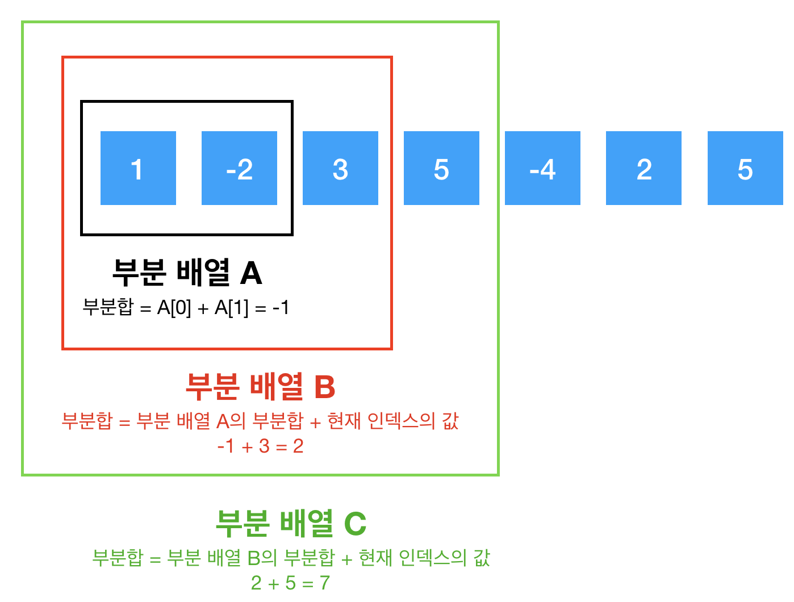
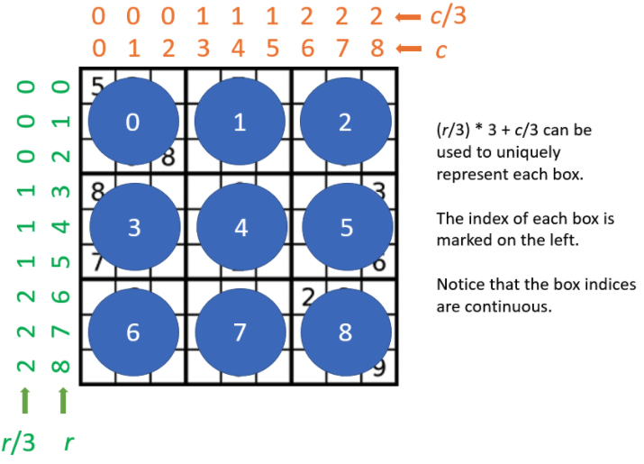
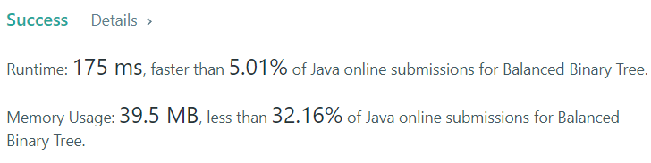
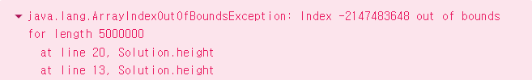

## Table of contents
{: .no_toc .text-delta }

1. TOC
{:toc}

---

# **Array**

## **[Contains Duplicate](https://leetcode.com/problems/contains-duplicate/)**

### `Sort`

```java
class Solution {
    public boolean containsDuplicate(int[] nums) {
        Arrays.sort(nums);
        for(int i = 0 ; i < nums.length - 1 ; i++){
            if(nums[i] == nums[i + 1]) return true;
        }
        return false;
    }
}
```

***

## **[Maximum Subarray](https://leetcode.com/problems/maximum-subarray/)** 🔥

### `Solve`

```java
class Solution {
    public int maxSubArray(int[] nums) {
        if(nums.length == 1) return nums[0];
        
        int result = nums[0];
        for(int i = 1 ; i < nums.length ; i++){
            nums[i] = Math.max(nums[i] , nums[i] + nums[i - 1]);
            result = Math.max(result , nums[i]);
        }
        return result;
    }
}
```

### `DP - Kadane's Algorithm` 👍




- [이미지 출처](https://medium.com/@vdongbin/kadanes-algorithm-카데인-알고리즘-acbc8c279f29)

```java
class Solution {
    public int maxSubArray(int[] nums) {
        // Initialize our variables using the first element.
        int currentSubarray = nums[0];
        int maxSubarray = nums[0];
        
        // Start with the 2nd element since we already used the first one.
        for (int i = 1; i < nums.length; i++) {
            int num = nums[i];
            // If current_subarray is negative, throw it away. Otherwise, keep adding to it.
            currentSubarray = Math.max(num, currentSubarray + num);
            maxSubarray = Math.max(maxSubarray, currentSubarray);
        }
        
        return maxSubarray;
    }
}
```

### `Divide and Conquer (Advanced)`

```java
class Solution {
    private int[] numsArray;
    
    public int maxSubArray(int[] nums) {
        numsArray = nums;
        
        // Our helper function is designed to solve this problem for
        // any array - so just call it using the entire input!
        return findBestSubarray(0, numsArray.length - 1);
    }
    
    private int findBestSubarray(int left, int right) {
        // Base case - empty array.
        if (left > right) {
            return Integer.MIN_VALUE;
        }
        
        int mid = Math.floorDiv(left + right, 2);
        int curr = 0;
        int bestLeftSum = 0;
        int bestRightSum = 0;
        
        // Iterate from the middle to the beginning.
        for (int i = mid - 1; i >= left; i--) {
            curr += numsArray[i];
            bestLeftSum = Math.max(bestLeftSum, curr);
        }
        
        // Reset curr and iterate from the middle to the end.
        curr = 0;
        for (int i = mid + 1; i <= right; i++) {
            curr += numsArray[i];
            bestRightSum = Math.max(bestRightSum, curr);
        }
        
        // The bestCombinedSum uses the middle element and the best
        // possible sum from each half.
        int bestCombinedSum = numsArray[mid] + bestLeftSum + bestRightSum;
        
        // Find the best subarray possible from both halves.
        int leftHalf = findBestSubarray(left, mid - 1);
        int rightHalf = findBestSubarray(mid + 1, right);
        
        // The largest of the 3 is the answer for any given input array.
        return Math.max(bestCombinedSum, Math.max(leftHalf, rightHalf));
    }
}
```

***

## **[Two Sum](https://leetcode.com/problems/two-sum/)**

### `Solve`

```java
class Solution {
    public int[] twoSum(int[] nums, int target) {
        int first = 0;
        int second = 0;
        Map<Integer , Integer> map = new HashMap<>();
        for(int i = 0 ; i < nums.length ; i++){
            map.put(nums[i] , i);
        }
        
        for(int i = 0 ; i < nums.length ; i++){
            int diff = target - nums[i]; 
            if(map.containsKey(diff) && map.get(diff) != i){
                first = i;
                second = map.get(diff);
                break;
            }
        }
        
        return new int[] {first , second};
    }
}
```

### `One Pass`

```java
class Solution {
    public int[] twoSum(int[] nums, int target) {
        Map<Integer, Integer> map = new HashMap<>();
        for (int i = 0; i < nums.length; i++) {
            int complement = target - nums[i];
            if (map.containsKey(complement)) {
                return new int[] { map.get(complement), i };
            }
            map.put(nums[i], i);
        }
        // In case there is no solution, we'll just return null
        return null;
    }
}
```

***

## **[Merge Sorted Array](https://leetcode.com/problems/merge-sorted-array/)**

### `Three Pointers`  ✨

```java
class Solution {
    public void merge(int[] nums1, int m, int[] nums2, int n) {
        int pointer1 = m - 1;
        int pointer2 = n - 1;
        
        for(int pointer3 = m + n - 1 ; pointer3 >= 0 ; pointer3--){
            if(pointer2 < 0) break;
            
            
            if(pointer1 < 0 || nums1[pointer1] < nums2[pointer2]){
                nums1[pointer3] = nums2[pointer2--];
            }
            else{
                nums1[pointer3] = nums1[pointer1--];
            }
        }
    }
}
```

***

## **[Intersection of Two Arrays II](https://leetcode.com/problems/intersection-of-two-arrays-ii/)**

- 중첩 원소를 반환

### `Two Pointers`

```java
import java.util.ArrayList;
import java.util.Arrays;

class Solution {
    public int[] intersect(int[] nums1, int[] nums2) {
        List<Integer> list = new ArrayList<>();
        Arrays.sort(nums1);
        Arrays.sort(nums2);
        
        int pointer1 = 0;
        int pointer2 = 0;
        
        while(true){
            if(pointer1 >= nums1.length || pointer2 >= nums2.length) break;
            
            int value1 = nums1[pointer1];
            int value2 = nums2[pointer2];  
            
            if(value1 == value2){
                list.add(value1);
                pointer1++;
                pointer2++;
            }
            else if(value1 < value2){
                pointer1++;
            }
            else{
                pointer2++;
            }
        }
    
        return list.stream().mapToInt(Integer::intValue).toArray();
    }
}
```

### `Two Pointers`

```java
    public int[] intersect(int[] nums1, int[] nums2) {
        Arrays.sort(nums1);
        Arrays.sort(nums2);
        int i = 0, j = 0, k = 0;
        while (i < nums1.length && j < nums2.length) {
            if (nums1[i] < nums2[j]) {
                ++i;
            } else if (nums1[i] > nums2[j]) {
                ++j;
            } else {
                nums1[k++] = nums1[i++];
                ++j;
            }
        }
        return Arrays.copyOfRange(nums1, 0, k);
    }
```

***

## **[Best Time to Buy and Sell Stock](https://leetcode.com/problems/best-time-to-buy-and-sell-stock/)**

### `Brute Force` ➜ <span class="text-red-300">Time Limit Exceeded</span>

```java
class Solution {
    public int maxProfit(int[] prices) {
        int diff = Integer.MIN_VALUE;
        for(int i = 0 ; i < prices.length ; i++){
            for(int j = i ; j < prices.length ; j++){
                diff = Math.max(diff , prices[j] - prices[i]);
            }
        }
        return diff;
    }
}
```

### `One Pass`

```java
class Solution {
    public int maxProfit(int[] prices) {
        int profit = 0;
        int minPrice = Integer.MAX_VALUE;
        for(int i = 0 ; i < prices.length ; i++){
            if(minPrice > prices[i]){
                minPrice = prices[i];
            }   
            else{
                profit = Math.max(prices[i] - minPrice , profit);
            }
        }
        return profit;
    }
}
```

***

## **[Reshape The Matrix](https://leetcode.com/problems/reshape-the-matrix/)**

### `Queue 사용`

```java
class Solution {
    public int[][] matrixReshape(int[][] mat, int r, int c) {
        
        if(mat.length == 0 || r * c != mat.length * mat[0].length) return mat;
        
        Queue<Integer> queue = new ArrayDeque<>();
        int[][] resultMat = new int[r][c];
        
        for(int i = 0 ; i < mat.length ; i++){
            for(int j = 0 ; j < mat[0].length ; j++){
                queue.offer(mat[i][j]);
            }
        }
        
        for(int i = 0 ; i < r ; i++){
            for(int j = 0 ; j < c ; j++){
                resultMat[i][j] = queue.poll();
            }
        }
        
        return resultMat;
    }
}
```

### `Queue 없이 One Pass`

```java
class Solution {
    public int[][] matrixReshape(int[][] mat, int r, int c) {
        
        if(mat.length == 0 || r * c != mat.length * mat[0].length) return mat;
        
        int[][] resultMat = new int[r][c];
        
        int row = 0 , col = 0;
        
        for(int i = 0 ; i < mat.length ; i++){
            for(int j = 0 ; j < mat[0].length ; j++){
                if(col == c){
                    row++;
                    col = 0;
                }
                resultMat[row][col] = mat[i][j];
                col++;
            }
        }        
        return resultMat;
    }
}
```

### `인덱스 계산` 👍

```
nums = [[1,2],[3,4]], r = 1, c = 4

resultMat[i / c][i % c] = nums[i / nums[0].length][i % nums[0].length];

i / c
0   4 = 0
1   4 = 0
..

i % c
0   4 = 0
1   4 = 1
..

Output: [[1,2,3,4]]
```

```java
class Solution {
    public int[][] matrixReshape(int[][] nums, int r, int c) {
        if(nums.length == 0 || r * c != nums.length * nums[0].length)
            return nums;
        
        int[][]resultMat = new int[r][c];
        for(int i = 0; i < r*c; i++) {
            resultMat[i / c][i % c] = nums[i / nums[0].length][i % nums[0].length];
        }
        return resultMat;
    }
}
```

***

## **[Pascal's Triangle](https://leetcode.com/problems/pascals-triangle/)**

### `DP`

- 0번 인덱스의 1을 재사용하기 때문에 `DP`

```java
class Solution {
    public List<List<Integer>> generate(int numRows) {
        List<List<Integer>> result = new ArrayList<>();
        
        result.add(new ArrayList<>());
        result.get(0).add(1);
        
        for(int row = 1 ; row < numRows ; row++){
            result.add(new ArrayList<>());
            List<Integer> nowRow = result.get(row);
            nowRow.add(1);
            for(int col = 1 ; col < row ; col++){
                List<Integer> beforeRow = result.get(row - 1);
                nowRow.add(beforeRow.get(col - 1) + beforeRow.get(col));
            }
            nowRow.add(1);
        }
        
        return result;
    }
}
```

***

## **[Valid Sudoku](https://leetcode.com/problems/valid-sudoku/)** 📝



### `HashSet`

```java
class Solution {
    public boolean isValidSudoku(char[][] board) {
        int N = 9;

        HashSet<Character>[] rows = new HashSet[N];
        HashSet<Character>[] cols = new HashSet[N];
        HashSet<Character>[] boxes = new HashSet[N];
        for (int r = 0; r < N; r++) {
            rows[r] = new HashSet<Character>();
            cols[r] = new HashSet<Character>();
            boxes[r] = new HashSet<Character>();
        }

        for (int r = 0; r < N; r++) {
            for (int c = 0; c < N; c++) {
                char val = board[r][c];

                if (val == '.') {
                    continue;
                }

                if (rows[r].contains(val)) {
                    return false;
                }
                rows[r].add(val);

                if (cols[c].contains(val)) {
                    return false;
                }
                cols[c].add(val);

                int idx = (r / 3) * 3 + c / 3;
                if (boxes[idx].contains(val)) {
                    return false;
                }
                boxes[idx].add(val);
            }
        }
        return true;
    }
}
```

### `Extra Array`

```java
class Solution {
    public boolean isValidSudoku(char[][] board) {
        int N = 9;

        int[][] rows = new int[N][N];
        int[][] cols = new int[N][N];
        int[][] boxes = new int[N][N];

        for (int r = 0; r < N; r++) {
            for (int c = 0; c < N; c++) {
                if (board[r][c] == '.') {
                    continue;
                }
                int pos = board[r][c] - '1';

                if (rows[r][pos] == 1) {
                    return false;
                }
                rows[r][pos] = 1;

                if (cols[c][pos] == 1) {
                    return false;
                }
                cols[c][pos] = 1;

                int idx = (r / 3) * 3 + c / 3;
                if (boxes[idx][pos] == 1) {
                    return false;
                }
                boxes[idx][pos] = 1;
            }
        }
        return true;
    }
}
```

***

## **[Sudoku Solver](https://leetcode.com/problems/sudoku-solver/)** 📝

```java
class Solution {
    // box size
    int n = 3;
    // row size
    int N = n * n;

    int [][] rows = new int[N][N + 1];
    int [][] columns = new int[N][N + 1];
    int [][] boxes = new int[N][N + 1];

    char[][] board;

    boolean sudokuSolved = false;

    public boolean couldPlace(int d, int row, int col) {
        /*
            Check if one could place a number d in (row, col) cell
        */
        int idx = (row / n ) * n + col / n;
        return rows[row][d] + columns[col][d] + boxes[idx][d] == 0;
    }

    public void placeNumber(int d, int row, int col) {
        /*
        Place a number d in (row, col) cell
        */
        int idx = (row / n ) * n + col / n;

        rows[row][d]++;
        columns[col][d]++;
        boxes[idx][d]++;
        board[row][col] = (char)(d + '0');
    }

    public void removeNumber(int d, int row, int col) {
        /*
        Remove a number which didn't lead to a solution
        */
        int idx = (row / n ) * n + col / n;
        rows[row][d]--;
        columns[col][d]--;
        boxes[idx][d]--;
        board[row][col] = '.';
    }

    public void placeNextNumbers(int row, int col) {
        /*
        Call backtrack function in recursion
        to continue to place numbers
        till the moment we have a solution
        */
        // if we're in the last cell
        // that means we have the solution
        if ((col == N - 1) && (row == N - 1)) {
            sudokuSolved = true;
        }
        // if not yet
        else {
        // if we're in the end of the row
            // go to the next row
            if (col == N - 1) backtrack(row + 1, 0);
            // go to the next column
            else backtrack(row, col + 1);
        }
    }

    public void backtrack(int row, int col) {
        /*
        Backtracking
        */
        // if the cell is empty
        if (board[row][col] == '.') {
            // iterate over all numbers from 1 to 9
            for (int d = 1; d < 10; d++) {
                if (couldPlace(d, row, col)) {
                    placeNumber(d, row, col);
                    placeNextNumbers(row, col);
                    // if sudoku is solved, there is no need to backtrack
                    // since the single unique solution is promised
                    if (!sudokuSolved) removeNumber(d, row, col);
                }
            }
        }
        else placeNextNumbers(row, col);
    }

    public void solveSudoku(char[][] board) {
        this.board = board;

        // init rows, columns and boxes
        for (int i = 0; i < N; i++) {
            for (int j = 0; j < N; j++) {
                char num = board[i][j];
                if (num != '.') {
                    int d = Character.getNumericValue(num);
                    placeNumber(d, i, j);
                }
            }
        }
        backtrack(0, 0);
    }
}
```

***

## **[Search a 2D Matrix](https://leetcode.com/problems/search-a-2d-matrix/)**

### `Solve`

```java
class Solution {
    public boolean searchMatrix(int[][] matrix, int target) {
        int rowSize = matrix.length;
        int colSize = matrix[0].length;
        
        for(int i = 0 ; i < rowSize ; i++){
            if(matrix[i][0] <= target && target <= matrix[i][colSize - 1]){
                for(int j = 0 ; j < colSize ; j++){
                    if(matrix[i][j] == target) return true;
                }
            }
        }
        
        return false;
    }
}
```

### `Binary Search`

```java
class Solution {
    public boolean searchMatrix(int[][] matrix, int target) {
        int rowSize = matrix.length;
        if (rowSize == 0)
            return false;
        int colSize = matrix[0].length;
        
        int left = 0, right = rowSize * colSize - 1;
        int pivotIdx, pivotElement;
        while (left <= right) {
            pivotIdx = (left + right) / 2;
            pivotElement = matrix[pivotIdx / colSize][pivotIdx % colSize];
            if (target == pivotElement)
                return true;
            else {
                if (target < pivotElement)
                    right = pivotIdx - 1;
                else
                    left = pivotIdx + 1;
            }
        }
        return false;
    }
}
```

***

# **String**

## **[First Unique Character in a String](https://leetcode.com/problems/first-unique-character-in-a-string/)**

### `HashMap`

```java
class Solution {
    public int firstUniqChar(String s) {
        Map<Character , Integer> map = new HashMap<>();
        
        for(int i = 0 ; i < s.length() ; i++){
            char ch = s.charAt(i);
            map.put(ch , map.getOrDefault(ch , 0) + 1);
        }
        
        for(int i = 0 ; i < s.length() ; i++){
            char ch = s.charAt(i);
            if(map.get(ch) == 1) return i;
        }
        
        return -1;
    }
}
```

### `ASCII코드를 이용한 배열 사용`

```java
class Solution {
    public int firstUniqChar(String s) {
        int[] count = new int[26];
        int n = s.length();

        for (int i = 0; i < n; i++) {            
            int index = s.charAt(i) - 'a';
            count[index]++;
        }
        
        for (int i = 0; i < n; i++) {
            int index = s.charAt(i) - 'a';
            if (count[index] == 1) {
                return i;
            }
                
        }
        return -1;
    }
}
```

***

## **[Ransom Note](https://leetcode.com/problems/ransom-note/)**

### `ASCII코드를 이용한 배열 사용`

```java
class Solution {
    public boolean canConstruct(String ransomNote, String magazine) {
        int[] code = new int[26];
        for(int i = 0 ; i < magazine.length() ; i++){
            code[magazine.charAt(i) - 'a']++;
        }
        
        for(int i = 0 ; i < ransomNote.length() ; i++){
            int count = code[ransomNote.charAt(i) - 'a'];
            
            if(count <= 0) return false;
            code[ransomNote.charAt(i) - 'a']--;
        }
        
        return true;
    }
}
```

***

## **[Valid Anagram](https://leetcode.com/problems/valid-anagram/)**

```
어구전철(語句轉綴) 또는 애너그램(anagram)은 단어나 문장을 구성하고 있는 문자의 순서를 바꾸어 다른 단어나 문장을 만드는 놀이이다.
```

### `Sorting`

```java
class Solution {
    public boolean isAnagram(String s, String t) {
        if (s.length() != t.length()) {
            return false;
        }
        char[] str1 = s.toCharArray();
        char[] str2 = t.toCharArray();
        Arrays.sort(str1);
        Arrays.sort(str2);
        return Arrays.equals(str1, str2);
    }
}
```

### `HashMap`

```java
class Solution {
    public boolean isAnagram(String s, String t) {
        Map<Character , Integer> sMap = getCharMap(s);
        Map<Character , Integer> tMap = getCharMap(t);

        Set<Character> keySet = sMap.keySet().size() < tMap.keySet().size() ? tMap.keySet() : sMap.keySet();
        for(char ch : keySet){
            int sCount = sMap.getOrDefault(ch , 0);
            int tCount = tMap.getOrDefault(ch , 0);
            if(sCount != tCount) return false;
        }
        return true;
    }

    private Map<Character , Integer> getCharMap(String str){
        Map<Character, Integer> map = new HashMap<>();
        char[] charArr = str.toCharArray();
        for(char ch : charArr) map.put(ch , map.getOrDefault(ch , 0) + 1);
        return map;
    }
}
```

***

# `Linked List`

## **[Linked List Cycle](https://leetcode.com/problems/linked-list-cycle/)**

### **<span class="text-red-300">Wrong Answer</span>**

- 해당 `value`를 `Set`에 넣고 값이 중복되면 `true`를 리턴했지만
- `[-21,10,17,8,4,26,5,35,33,-7,-16,27,-12,6,29,-12,5,9,20,14,14,2,13,-24,21,23,-21,5]` 해당 테케 실패
- `value`가 중복되면 `cycle`이 있는게 아닌지..?

```java
/**
 * Definition for singly-linked list.
 * class ListNode {
 *     int val;
 *     ListNode next;
 *     ListNode(int x) {
 *         val = x;
 *         next = null;
 *     }
 * }
 */
public class Solution {
    public boolean hasCycle(ListNode head) {
        Set<Integer> set = new HashSet();
        while(head != null){
            if(!set.add(head.val)) return true;
            head = head.next;
        }
        return false;
    }
}
```

### `Solve`

- `value` 기준이 아니라 **객체의 주소 기준**이였다.
- `hashCode`를 `Set`에 넣어 중복 확인 하였다.

```java
/**
 * Definition for singly-linked list.
 * class ListNode {
 *     int val;
 *     ListNode next;
 *     ListNode(int x) {
 *         val = x;
 *         next = null;
 *     }
 * }
 */
public class Solution {
    public boolean hasCycle(ListNode head) {
        Set<Integer> set = new HashSet();
        while(head != null){
            if(!set.add(head.hashCode())) return true;
            head = head.next;
        }
        return false;
    }
}
```

### `Floyd's Cycle Finding Algorithm` 👍

```java
public class Solution {
    public boolean hasCycle(ListNode head) {
        if (head == null) {
            return false;
        }

        ListNode slow = head;
        ListNode fast = head.next;
        while (slow != fast) {
            if (fast == null || fast.next == null) {
                return false;
            }
            slow = slow.next;
            fast = fast.next.next;
        }
        return true;
    }
}
```

***

## **[Merge Two Sorted Lists](https://leetcode.com/problems/merge-two-sorted-lists/)** 📝

### `Recursion`

```java
/**
 * Definition for singly-linked list.
 * public class ListNode {
 *     int val;
 *     ListNode next;
 *     ListNode() {}
 *     ListNode(int val) { this.val = val; }
 *     ListNode(int val, ListNode next) { this.val = val; this.next = next; }
 * }
 */
class Solution {
    public ListNode mergeTwoLists(ListNode list1, ListNode list2) {
        if(list1 == null)
            return list2;
        if(list2 == null)
            return list1;
        else if(list1.val < list2.val){
            list1.next = mergeTwoLists(list1.next , list2);
            return list1;
        }
        else{
            list2.next = mergeTwoLists(list1 , list2.next);
            return list2;
        }
    }
}
```

### `Iteration` ✨✨

```java
class Solution {
    public ListNode mergeTwoLists(ListNode l1, ListNode l2) {
        ListNode prehead = new ListNode(-1);

        ListNode prev = prehead;
        while (l1 != null && l2 != null) {
            if (l1.val <= l2.val) {
                prev.next = l1;
                l1 = l1.next;
            } else {
                prev.next = l2;
                l2 = l2.next;
            }
            prev = prev.next;
        }
        prev.next = l1 == null ? l2 : l1;

        return prehead.next;
    }
}
```

***

## **[Remove Linked List Elements](https://leetcode.com/problems/remove-linked-list-elements/)**

### **Step 1. `Brute Force`**

```java
/**
 * Definition for singly-linked list.
 * public class ListNode {
 *     int val;
 *     ListNode next;
 *     ListNode() {}
 *     ListNode(int val) { this.val = val; }
 *     ListNode(int val, ListNode next) { this.val = val; this.next = next; }
 * }
 */
class Solution {
    public ListNode removeElements(ListNode head, int val) {
        if (head == null) return null;
        
        List<ListNode> storage = new ArrayList<>();
        ListNode curr = head;
        
        while (curr != null) {
            if (curr.val != val) storage.add(curr);
            curr = curr.next;
        }
        
        if (storage.size() == 0) return null;
        
        // result = root
        ListNode result = storage.get(0);
        result.next = null;
        // curr은 계속 타고 들어가는 포인터 역할
        curr = result;
        for (int i = 1; i < storage.size(); i++) {
            // storage에 들어있는 ListNode를 꺼내고 next를 null로 변경
            ListNode temp = storage.get(i);
            temp.next = null;
            curr.next = temp;
            curr = curr.next;
        }
        
        return result;
    }
}
```

### **Step 2. `Optimal`** 📝

```java
/**
 * Definition for singly-linked list.
 * public class ListNode {
 *     int val;
 *     ListNode next;
 *     ListNode() {}
 *     ListNode(int val) { this.val = val; }
 *     ListNode(int val, ListNode next) { this.val = val; this.next = next; }
 * }
 */
class Solution {
    public ListNode removeElements(ListNode head, int val) {
        if (head == null) return null;
        
        ListNode result = new ListNode(-1);
        
        // prev가 tmp 역할
        ListNode prev = result;
        prev.next = head;
        
        while (head != null) {
            if (head.val == val) {
                prev.next = head.next;
            }
            else {
                prev = head;
            }
            head = head.next;
        }
        
        return result.next;
    }
}
```

### **Step 3. `Best Recursion`** 👍

```java
/**
 * Definition for singly-linked list.
 * public class ListNode {
 *     int val;
 *     ListNode next;
 *     ListNode() {}
 *     ListNode(int val) { this.val = val; }
 *     ListNode(int val, ListNode next) { this.val = val; this.next = next; }
 * }
 */
class Solution {
    public ListNode removeElements(ListNode head, int val) {
        if (head == null) return null;
        head.next = removeElements(head.next, val);
        return (head.val == val) ? head.next : head;
    }
}
```

***

## **[Reverse Linked List](https://leetcode.com/problems/reverse-linked-list/)**

```
    
    1 ➔ 2 ➔ 3 ➔ 4

---------------------

[first]

- curr = 1 ➔ 2 ➔ 3 ➔ 4
- curr.next = 2 ➔ 3 ➔ 4
- prev = null

1. temp = curr.next (2 ➔ 3 ➔ 4)
2. curr.next = prev (null)
3. prev = curr (1 ➔ null)
4. curr = temp (2 ➔ 3 ➔ 4)

---------------------

[second]

- curr = 2 ➔ 3 ➔ 4
- curr.next = 3 ➔ 4
- prev = 1 ➔ null 

1. temp = curr.next (3 ➔ 4)
2. curr.next = prev (1 ➔ null)
3. prev = curr(2 ➔ 1 ➔ null)
4. curr = temp (3 ➔ 4)

...

```

### `Swap` 

```java
/**
 * Definition for singly-linked list.
 * public class ListNode {
 *     int val;
 *     ListNode next;
 *     ListNode() {}
 *     ListNode(int val) { this.val = val; }
 *     ListNode(int val, ListNode next) { this.val = val; this.next = next; }
 * }
 */
class Solution {
    public ListNode reverseList(ListNode head) {
        ListNode prev = null;
        ListNode curr = head;
        
        while(curr != null){
            ListNode nextTemp = curr.next;
            curr.next = prev;
            prev = curr;
            curr = nextTemp;
        }
        
        return prev;
    }
}
```

***

## **[Remove Duplicates from Sorted List](https://leetcode.com/problems/remove-duplicates-from-sorted-list/)**

### `Solve`

```java
/**
 * Definition for singly-linked list.
 * public class ListNode {
 *     int val;
 *     ListNode next;
 *     ListNode() {}
 *     ListNode(int val) { this.val = val; }
 *     ListNode(int val, ListNode next) { this.val = val; this.next = next; }
 * }
 */
class Solution {
    public ListNode deleteDuplicates(ListNode head) {
        if(head == null || head.next == null) return head;
        
        ListNode curr = head;
        ListNode next = head.next;
        
        while(curr != null && next != null){
            if(curr.val == next.val){
                curr.next = next.next;
                next = next.next;
            }
            else{
                curr = curr.next;   
            }
        }
        return head;
    }
}
```

***

# **Stack**

## **[Valid Parentheses](https://leetcode.com/problems/valid-parentheses/)**

### `Solve`

```java
class Solution {
    
    Deque<Character> stack = new ArrayDeque<>();
    public boolean isValid(String s) {
        if(s.length() <= 1) return false;
        
        for(int i = 0 ; i < s.length() ; i++){
            char ch = s.charAt(i);
            if(isCloseBracket(ch)){
                if(!isSameBracket(ch)){
                    return false;
                }
            }
            else stack.push(ch);
        }
        
        return stack.isEmpty();
    }
    
    public boolean isCloseBracket(char ch){
        if(ch == ')' || ch == ']' || ch == '}') return true;
        return false;
    }
    
    public boolean isSameBracket(char closeBracket){
        if(stack.peek() == null) return false;
        
        char openBracket = stack.pop();
        if(closeBracket == ')' && openBracket != '(') return false;
        else if(closeBracket == ']' && openBracket != '[') return false;
        else if(closeBracket == '}' && openBracket != '{') return false;
        
        return true;
    }
}
```

## `Solution - Bracket Mapping`

```java
class Solution {

    private HashMap<Character, Character> mappings;

    public Solution() {
        this.mappings = new HashMap<Character, Character>();
        this.mappings.put(')', '(');
        this.mappings.put('}', '{');
        this.mappings.put(']', '[');
    }

    public boolean isValid(String s) {
        Stack<Character> stack = new Stack<Character>();

        for (int i = 0; i < s.length(); i++) {
            char c = s.charAt(i);

            if (this.mappings.containsKey(c)) {
                char topElement = stack.empty() ? '#' : stack.pop();
                if (topElement != this.mappings.get(c)) {
                    return false;
                }
            } 
            else {
                stack.push(c);
            }
        }
        return stack.isEmpty();
    }
}
```

***

# **Queue**

## **[Implement Queue using Stacks](https://leetcode.com/problems/implement-queue-using-stacks/)**


### `Solve 1`

```java
class MyQueue {

    public MyQueue() {
        
    }
    
    private Stack<Integer> s1 = new Stack<>();
    private Stack<Integer> s2 = new Stack<>();    
    private int front;

    public void push(int x) {
        if (s1.empty())
            front = x;
        while (!s1.isEmpty())
            s2.push(s1.pop());
        s2.push(x);
        while (!s2.isEmpty())
            s1.push(s2.pop());
    }
    
    public int pop() {
        int result = s1.pop();
        if (!s1.empty())
            front = s1.peek();
        return result;
    }
    
    public int peek() {
        return front;
    }
    
    public boolean empty() {
        return s1.isEmpty();
    }
}

/**
 * Your MyQueue object will be instantiated and called as such:
 * MyQueue obj = new MyQueue();
 * obj.push(x);
 * int param_2 = obj.pop();
 * int param_3 = obj.peek();
 * boolean param_4 = obj.empty();
 */
```

## `Solve 2`

```java
class MyQueue {

    public MyQueue() {
        
    }
    
    private Stack<Integer> s1 = new Stack<>();
    private Stack<Integer> s2 = new Stack<>();    
    private int front;

    public void push(int x) {
        if (s1.empty())
            front = x;
        s1.push(x);
    }
    
    public int pop() {
        if (s2.isEmpty()) {
            while (!s1.isEmpty()) s2.push(s1.pop());
        }
        return s2.pop();   
    }
    
    public int peek() {
        if (!s2.isEmpty()) {
                return s2.peek();
        }
        return front;
    }
    
    public boolean empty() {
        return s1.isEmpty() && s2.isEmpty();
    }
}

/**
 * Your MyQueue object will be instantiated and called as such:
 * MyQueue obj = new MyQueue();
 * obj.push(x);
 * int param_2 = obj.pop();
 * int param_3 = obj.peek();
 * boolean param_4 = obj.empty();
 */
```

***

# **Tree**

## **[Binary Tree Preorder Traversal](https://leetcode.com/problems/binary-tree-preorder-traversal/)**


```
/**
 * Definition for a binary tree node.
 * public class TreeNode {
 *     int val;
 *     TreeNode left;
 *     TreeNode right;
 *     TreeNode() {}
 *     TreeNode(int val) { this.val = val; }
 *     TreeNode(int val, TreeNode left, TreeNode right) {
 *         this.val = val;
 *         this.left = left;
 *         this.right = right;
 *     }
 * }
 */
```

### `Solve`

```java
class Solution {
    private List<Integer> numbers;
    public List<Integer> preorderTraversal(TreeNode root) {
        numbers = new ArrayList<>();
        preorder(root);
        return numbers;
    }
    
    public void preorder(TreeNode node){
        if(node == null) return;
        
        numbers.add(node.val);
        preorder(node.left);
        preorder(node.right);
    }
}
```

### `Morris traversal`

```java
class Solution {
    public List<Integer> preorderTraversal(TreeNode root) {
        List<Integer> res = new ArrayList<>();
        TreeNode node = root;
        while(node != null) {
            res.add(node.val);

            if(node.left == null) {
                node = node.right;
            } else {
                TreeNode left = node.left;
                TreeNode right = node.right;
                node = node.left;

                TreeNode rightMostOfLeft = left;
                while(rightMostOfLeft.right != null) {
                    rightMostOfLeft = rightMostOfLeft.right;
                }
                rightMostOfLeft.right = right;
            }
        }
        return res;
    }
}
```

***

## **[Binary Tree Inorder Traversal](https://leetcode.com/problems/binary-tree-inorder-traversal/)**

```
/**
 * Definition for a binary tree node.
 * public class TreeNode {
 *     int val;
 *     TreeNode left;
 *     TreeNode right;
 *     TreeNode() {}
 *     TreeNode(int val) { this.val = val; }
 *     TreeNode(int val, TreeNode left, TreeNode right) {
 *         this.val = val;
 *         this.left = left;
 *         this.right = right;
 *     }
 * }
 */
```

### `Solve`

```java
class Solution {
    private List<Integer> numbers;
    public List<Integer> inorderTraversal(TreeNode root) {
        numbers = new ArrayList<>();
        inorder(root);
        return numbers;
    }
    
    public void inorder(TreeNode node){
        if(node == null) return;
        
        inorder(node.left);
        numbers.add(node.val);
        inorder(node.right);
    }
}
``` 

### `Morris Traversal`

```java
class Solution {
    public List<Integer> inorderTraversal(TreeNode root) {
        List<Integer> res = new ArrayList<>();
        TreeNode curr = root;
        TreeNode pre;
        while (curr != null) {
            if (curr.left == null) {
                res.add(curr.val);
                curr = curr.right; // move to next right node
            } else { // has a left subtree
                pre = curr.left;
                while (pre.right != null) { // find rightmost
                    pre = pre.right;
                }
                pre.right = curr; // put cur after the pre node
                TreeNode temp = curr; // store cur node
                curr = curr.left; // move cur to the top of the new tree
                temp.left = null; // original cur left be null, avoid infinite loops
            }
        }
        return res;
    }
}
```

***

## **[Binary Tree Postorder Traversal](https://leetcode.com/problems/binary-tree-postorder-traversal/)**

```
/**
 * Definition for a binary tree node.
 * public class TreeNode {
 *     int val;
 *     TreeNode left;
 *     TreeNode right;
 *     TreeNode() {}
 *     TreeNode(int val) { this.val = val; }
 *     TreeNode(int val, TreeNode left, TreeNode right) {
 *         this.val = val;
 *         this.left = left;
 *         this.right = right;
 *     }
 * }
 */
```

```java
class Solution {
    private List<Integer> numbers;
    public List<Integer> postorderTraversal(TreeNode root) {
        numbers = new ArrayList<>();
        postOrder(root);
        return numbers;
    }
    
    public void postOrder(TreeNode node){
        if(node == null) return;
        
        postOrder(node.left);
        postOrder(node.right);
        numbers.add(node.val);
    }
}
```

***

## **[Binary Tree Level Order Traversal](https://leetcode.com/problems/binary-tree-level-order-traversal/)**

### `BFS`

```java
class Solution {
    public List<List<Integer>> levelOrder(TreeNode root) {
        List<List<Integer>> result = new ArrayList<>();
        if(root == null) return result;
        
        Queue<TreeNode> queue = new LinkedList<>();
        
        queue.offer(root);
        
        int level = 0;
        while(!queue.isEmpty()){
            int queueSize = queue.size();
            result.add(new ArrayList<>());
            
            for(int i = 0 ; i < queueSize ; i++){
                TreeNode node = queue.poll();
                result.get(level).add(node.val);                
                
                if(node.left != null) queue.offer(node.left);
                if(node.right != null) queue.offer(node.right);
            }
            level++;
        }
        
        return result;
    }
}
```

### `DFS`

```java
class Solution {
    List<List<Integer>> result;
    public List<List<Integer>> levelOrder(TreeNode root) {
        result = new ArrayList<>();
        if(root == null) return result;
        
        dfs(root , 0);
        return result;
    }
    
    public void dfs(TreeNode node , int level){
        if(node == null) return;
        
        if(result.size() <= level) result.add(new ArrayList<>());
        
        result.get(level).add(node.val);
        dfs(node.left , level + 1);
        dfs(node.right , level + 1);
    }
}
```

***

## **[Maximum Depth of Binary Tree](https://leetcode.com/problems/maximum-depth-of-binary-tree/)**

```
/**
 * Definition for a binary tree node.
 * public class TreeNode {
 *     int val;
 *     TreeNode left;
 *     TreeNode right;
 *     TreeNode() {}
 *     TreeNode(int val) { this.val = val; }
 *     TreeNode(int val, TreeNode left, TreeNode right) {
 *         this.val = val;
 *         this.left = left;
 *         this.right = right;
 *     }
 * }
 */
```

### `DFS`

```java
class Solution {
    public int maxDepth(TreeNode root) {
        return findDepth(root , 0);
    }
    
    public int findDepth(TreeNode node , int depth){
        if(node == null) return depth;
        int leftDepth = findDepth(node.left , depth + 1);
        int rightDepth = findDepth(node.right , depth + 1);
        
        return Math.max(leftDepth , rightDepth);
    }
}
```

***

## **[Symmetric Tree](https://leetcode.com/problems/symmetric-tree/)**

### `Recursion`

```
/**
 * Definition for a binary tree node.
 * public class TreeNode {
 *     int val;
 *     TreeNode left;
 *     TreeNode right;
 *     TreeNode() {}
 *     TreeNode(int val) { this.val = val; }
 *     TreeNode(int val, TreeNode left, TreeNode right) {
 *         this.val = val;
 *         this.left = left;
 *         this.right = right;
 *     }
 * }
 */
```

```java
class Solution {
    public boolean isSymmetric(TreeNode root) {
        return isSame(root.left , root.right);   
    }
    
    public boolean isSame(TreeNode node1 , TreeNode node2){
        if(node1 == null && node2 == null) return true;
        if(node1 == null || node2 == null) return false;
        return (node1.val == node2.val && isSame(node1.left , node2.right) && isSame(node2.left , node1.right));
    }
}
```

### `Iterative Use Queue`

```java
class Solution {
    public boolean isSymmetric(TreeNode root) {
        
        Queue<TreeNode> q = new LinkedList<>();
        
        q.offer(root.left);
        q.offer(root.right);
        
        while(!q.isEmpty()){
            TreeNode node1 = q.poll();
            TreeNode node2 = q.poll();
            if(node1 == null && node2 == null) continue;
            if(node1 == null || node2 == null) return false;
            if(node1.val != node2.val) return false;
            
            q.offer(node1.left);
            q.offer(node2.right);
            q.offer(node1.right);
            q.offer(node2.left);
        }
        
        return true;
    }
}
```

***

## **[Invert Binary Tree](https://leetcode.com/problems/invert-binary-tree/)**

### 주소를 바꿧는데..?

```java
class Solution {
    public TreeNode invertTree(TreeNode root) {
        swap(root.left , root.right);
        traversal(root);
        return root;
    }
    
    public void swap(TreeNode node1 , TreeNode node2){
        if(node1 == null && node2 == null) return;
        
        System.out.println(node1.val + " " + node2.val);
        
        TreeNode tmp = node1;
        node1 = node2;
        node2 = tmp;
        
        System.out.println(node1.val + " " + node2.val);
        
        // swap(node1.left , node1.right);
        // swap(node2.left , node2.right);
    }
    
    public void traversal(TreeNode node){
        if(node != null){
            System.out.println(node.val);
            traversal(node.left);
            traversal(node.right);
        }
    }
}
```

- 위의 코드는 `swap` 메소드 안에서 `node1`과 `node2`의 참조를 서로 바꾸었다.
- 처음 `swap(root.left , root.right)`를 넘겨서 `swap`메소드 안에서 바꾸어도 파라미터로 넘긴 `(root.left , root.right)`를 `root`가 바라보고 있는 줄 알았다....
- **하지만 정작 바뀐 참조를 들고 있는 `node1`과 `node2`를 가질 인스턴스가 없다.**


### `Solve`

```java
/**
 * Definition for a binary tree node.
 * public class TreeNode {
 *     int val;
 *     TreeNode left;
 *     TreeNode right;
 *     TreeNode() {}
 *     TreeNode(int val) { this.val = val; }
 *     TreeNode(int val, TreeNode left, TreeNode right) {
 *         this.val = val;
 *         this.left = left;
 *         this.right = right;
 *     }
 * }
 */
class Solution {
    public TreeNode invertTree(TreeNode root) {
        if(root == null) return null;
        swap(root);
        return root;
    }
    
    public void swap(TreeNode node){
        TreeNode tmp = node.left;
        node.left = node.right;
        node.right = tmp;
        
        if(node.left != null) swap(node.left);
        if(node.right != null) swap(node.right);
    }
}
```

### `Iterative Using Queue`

```java
class Solution {
    public TreeNode invertTree(TreeNode root) {
        if (root == null) return null;
        Queue<TreeNode> queue = new LinkedList<TreeNode>();
        queue.add(root);
        while (!queue.isEmpty()) {
            TreeNode current = queue.poll();
            TreeNode temp = current.left;
            current.left = current.right;
            current.right = temp;
            if (current.left != null) queue.add(current.left);
            if (current.right != null) queue.add(current.right);
        }
        return root;
    }
}
```

***

## **[Path Sum](https://leetcode.com/problems/path-sum/)**


### `Solve`

```java
/**
 * Definition for a binary tree node.
 * public class TreeNode {
 *     int val;
 *     TreeNode left;
 *     TreeNode right;
 *     TreeNode() {}
 *     TreeNode(int val) { this.val = val; }
 *     TreeNode(int val, TreeNode left, TreeNode right) {
 *         this.val = val;
 *         this.left = left;
 *         this.right = right;
 *     }
 * }
 */
class Solution {
    public boolean hasPathSum(TreeNode root, int targetSum) {
        if(root == null) return false;
        
        return nextNode(root , targetSum , 0);
    }
    
    public boolean nextNode(TreeNode node , int target , int sum){
        
        int total = sum + node.val;
        if(total == target && node.left == null && node.right == null) return true;
        
        boolean flag1 = false , flag2 = false;
        
        if(node.left != null) flag1 = nextNode(node.left , target , total);
        if(node.right != null) flag2 = nextNode(node.right , target , total);
        
        return flag1 || flag2;
    }
}
```

***

## **[Search in a Binary Search Tree](https://leetcode.com/problems/search-in-a-binary-search-tree/)**

### `Solve`


```java
/**
 * Definition for a binary tree node.
 * public class TreeNode {
 *     int val;
 *     TreeNode left;
 *     TreeNode right;
 *     TreeNode() {}
 *     TreeNode(int val) { this.val = val; }
 *     TreeNode(int val, TreeNode left, TreeNode right) {
 *         this.val = val;
 *         this.left = left;
 *         this.right = right;
 *     }
 * }
 */
class Solution {
    public TreeNode searchBST(TreeNode root, int val) {
        if(root == null) return null;
        else if(root.val == val) return root;
        else if(root.val > val) return searchBST(root.left , val);
        else return searchBST(root.right , val);
    }
}
```

### `Optimized`

```java
class Solution {
    public TreeNode searchBST(TreeNode root, int val) {
        if (root == null || val == root.val) return root;

        return val < root.val ? searchBST(root.left, val) : searchBST(root.right, val);
    }
}
```

### `Iterator`

```java
class Solution {
    public TreeNode searchBST(TreeNode root, int val) {
        while (root != null && val != root.val)
            root = val < root.val ? root.left : root.right;
        return root;
    }
}
```

***

## **[Insert into a Binary Search Tree](https://leetcode.com/problems/insert-into-a-binary-search-tree/)**

### `Solve`

```java
/**
 * Definition for a binary tree node.
 * public class TreeNode {
 *     int val;
 *     TreeNode left;
 *     TreeNode right;
 *     TreeNode() {}
 *     TreeNode(int val) { this.val = val; }
 *     TreeNode(int val, TreeNode left, TreeNode right) {
 *         this.val = val;
 *         this.left = left;
 *         this.right = right;
 *     }
 * }
 */
class Solution {
    public TreeNode insertIntoBST(TreeNode root, int val) {
        if(root == null) return new TreeNode(val);
        
        insert(root , val);
        return root;
    }
    
    public void insert(TreeNode node , int val){
        if(node.val < val){
            if(node.right == null) node.right = new TreeNode(val);
            else{
                insert(node.right , val);
            }
        }
        else{
            if(node.left == null) node.left = new TreeNode(val);
            else{
                insert(node.left , val);
            }            
        }
    }
}
```

### `Optimized`

```java
class Solution {
    public TreeNode insertIntoBST(TreeNode root, int val) {
        if (root == null) return new TreeNode(val);

        if (val > root.val) root.right = insertIntoBST(root.right, val);
        else root.left = insertIntoBST(root.left, val);
        return root;
    }
}
```

***

## **[Balanced Binary Tree](https://leetcode.com/problems/balanced-binary-tree/)** 🔥

- **높이의 균형을 확인하는 문제**
- 📌 `높이 균형이 맞는 이진 트리는 모든 노드들의 왼쪽 및 오른쪽 서브 트리의 높이 차이가 1을 초과하지 않는 트리를 의미한다.`
  - **형제 노드의 값의 차이가 1이하만 높이 균형 이진 트리라고 본다**
  - 조건부 확인 전에 재귀 호출이 있으면 상향식.
  - 조건부 확인 후 재귀 호출이면 하향식.


### `Top-down recursion`



```java
/**
 * Definition for a binary tree node.
 * public class TreeNode {
 *     int val;
 *     TreeNode left;
 *     TreeNode right;
 *     TreeNode() {}
 *     TreeNode(int val) { this.val = val; }
 *     TreeNode(int val, TreeNode left, TreeNode right) {
 *         this.val = val;
 *         this.left = left;
 *         this.right = right;
 *     }
 * }
 */
class Solution {
  // Recursively obtain the height of a tree. An empty tree has -1 height
  private int height(TreeNode root) {
    // An empty tree has height -1
    if (root == null) {
      System.out.println("null");
      return -1;
    }
    System.out.println(root.val);
    return 1 + Math.max(height(root.left), height(root.right));
  }

  public boolean isBalanced(TreeNode root) {
    // An empty tree satisfies the definition of a balanced tree
    if (root == null) {
      return true;
    }

    // Check if subtrees have height within 1. If they do, check if the
    // subtrees are balanced
    return Math.abs(height(root.left) - height(root.right)) < 2
        && isBalanced(root.left)
        && isBalanced(root.right);
  }
}
```

### **추가로 memoization 사용해보기**



- 자식 인덱스 구할 시 int의 표현 범위를 벗어나기 때문에 양수가 음수로 전환되는 것 같다
- 문제의 조건에는 노드의 개수가 `[0 , 5000]`이라고 하였기 때문에 `5000 * 2 + 1`의 배열 사이즈가 있으면 될 줄 알았다.
- 테스트로 인덱스 변수의 타입을  `long`으로 바꿔보았지만 `-9223372036854775808`의 인덱스가 나왔다...

```java
if(index < 0) {
    System.out.println(Math.abs(index) + " " + Integer.MIN_VALUE);
    // 이렇게 해도 -9223372036854775808
}
```

```java
class Solution {
    // Recursively obtain the height of a tree. An empty tree has -1 height
    int[] memArr = new int[5000000];
    private int height(TreeNode root , int index) {
    // An empty tree has height -1
        if (root == null) {
            // System.out.println("null");
            return 0;
        }
        // System.out.println(root.val);
        int leftChild = index * 2;
        int rightChild = index * 2 + 1;
        int leftResult = height(root.left , leftChild);
        int rightResult = height(root.right , rightChild);
        int value = 1 + Math.max(leftResult , rightResult);
        // System.out.println("root.val = " + root.val + ", index = " + index + ", value = " + value);
        if(index < 0) {
            System.out.println(index + " " + Integer.MIN_VALUE);
        }
        memArr[index] = value;
        // memList.add(index , leftResult);
        // memList.add(rightChild , rightResult);
        return value;

    }

    public boolean isBalanced(TreeNode root) {
        // An empty tree satisfies the definition of a balanced tree
        if (root == null) {
            return true;
        }

        height(root , 1);

        // for(int i = 1 ; i < 10 ; i++) System.out.println(i + " " + memArr[i]);
        for(int i = 1 ; i < memArr.length / 2 ; i++){
            // System.out.println(i + "-> leftLevel : " + memArr[i * 2] + " | rightLevel : " + memArr[i * 2 + 1]);
            if(Math.abs(memArr[i * 2] - memArr[i * 2 + 1]) > 1){
                return false;
            }
        }
        // Check if subtrees have height within 1. If they do, check if the
        // subtrees are balanced
        return true;
    }
}
```

### `Bottom-up recursion`

```java
// Utility class to store information from recursive calls
final class TreeInfo {
  public final int height;
  public final boolean balanced;

  public TreeInfo(int height, boolean balanced) {
    this.height = height;
    this.balanced = balanced;
  }
}

class Solution {
  // Return whether or not the tree at root is balanced while also storing
  // the tree's height in a reference variable.
  private TreeInfo isBalancedTreeHelper(TreeNode root) {
    // An empty tree is balanced and has height = -1
    if (root == null) {
      return new TreeInfo(-1, true);
    }

    // Check subtrees to see if they are balanced.
    TreeInfo left = isBalancedTreeHelper(root.left);
    if (!left.balanced) {
      return new TreeInfo(-1, false);
    }
    TreeInfo right = isBalancedTreeHelper(root.right);
    if (!right.balanced) {
      return new TreeInfo(-1, false);
    }

    // Use the height obtained from the recursive calls to
    // determine if the current node is also balanced.
    if (Math.abs(left.height - right.height) < 2) {
      return new TreeInfo(Math.max(left.height, right.height) + 1, true);
    }
    return new TreeInfo(-1, false);
  }

  public boolean isBalanced(TreeNode root) {
    return isBalancedTreeHelper(root).balanced;
  }
};
```

***

## **[Validate Binary Search Tree](https://leetcode.com/problems/validate-binary-search-tree/)** 🔥


### 실패 코드 (`모든 왼쪽 자식들 <= n < 모든 오른쪽 자식들 속성`은 **모든 노드 대해서 반드시 참이어야 한다.**)

```java
/**
 * Definition for a binary tree node.
 * public class TreeNode {
 *     int val;
 *     TreeNode left;
 *     TreeNode right;
 *     TreeNode() {}
 *     TreeNode(int val) { this.val = val; }
 *     TreeNode(int val, TreeNode left, TreeNode right) {
 *         this.val = val;
 *         this.left = left;
 *         this.right = right;
 *     }
 * }
 */
class Solution {
    private boolean left(TreeNode node , TreeNode leftNode){
        if(leftNode != null && node.val <= leftNode.val) return false;
        else return true;
    }

    private boolean right(TreeNode node , TreeNode rightNode){
        if(rightNode != null && node.val >= rightNode.val) return false;
        else return true;
    }

    private boolean dfs(TreeNode node){
        if(node == null) return true;
        else if(!left(node , node.left) || !right(node , node.right)){
            return false;
        }
        else return dfs(node.left) && dfs(node.right);
    }

    public boolean isValidBST(TreeNode root) {
        return dfs(root);
    }
}
```

### **Solution**

```java
class Solution {
    public boolean validate(TreeNode root, Integer low, Integer high) {
        if (root == null) {
            return true;
        }

        if ((low != null && root.val <= low) || (high != null && root.val >= high)) {
            return false;
        }
        return validate(root.right, root.val, high) && validate(root.left, low, root.val);
    }

    public boolean isValidBST(TreeNode root) {
        return validate(root, null, null);
    }
}
```

***

## **[Two Sum IV - Input is a BST](https://leetcode.com/problems/two-sum-iv-input-is-a-bst/)** ❌

```java
```

***


## **[LCA(Lowest Common Ancestor) - 최소 공통 조상` Lowest Common Ancestor of a Binary Tree](https://leetcode.com/problems/lowest-common-ancestor-of-a-binary-tree/)** ❌

- **[최소 공통 조상 - 동빈나](https://blog.naver.com/ndb796/221282478466)**
- 트리 구조에서 특정한 두 노드의 공통된 조상 중에서 가장 가까운 조상을 의미한다.
- 두 노드 사이의 거리를 빠르게 구하는 등 다양한 계산에 활용될 수 있다.
- 일종의 다이나믹 프로그래밍이며 최소 공통 조상을 빠르게 찾아내는 알고리즘이다.

### `Iterate`

- 아래의 코드는 `BST`이기 때문에 가능하다

```java
/**
 * Definition for a binary tree node.
 * public class TreeNode {
 *     int val;
 *     TreeNode left;
 *     TreeNode right;
 *     TreeNode(int x) { val = x; }
 * }
 */

class Solution {
    public TreeNode lowestCommonAncestor(TreeNode root, TreeNode p, TreeNode q) {
        if(root == null) return root;
        
        int value1 = p.val;
        int value2 = q.val;
        
        while(root != null){
            int nodeValue = root.val;    
            
            if(value1 > nodeValue && value2 > nodeValue){
                root = root.right;
            }
            else if(value1 < nodeValue && value2 < nodeValue){
                root = root.left;
            }            
            else break;
        }
        
        return root;
    }
}
```


 