## Table of contents
{: .no_toc .text-delta }

1. TOC
{:toc}
---

# **HTTP 기본**

**HTTP 역사**
{: .fh-default .fs-4 }

- HTTP/0.9 1991년 : GET메서드만 지원 , HTTP 헤더 X
- HTTP/1.0 1996년 : 메서드 , 헤더 추가
- **HTTP/1.1 1997년 : 가장 많이 사용 , 우리에게 가장 중요한 버전**
  - RFC2068(1997) → RFC2616(1999) →RFC7230~7235(2014)
- HTTP/2 2015년 : 성능 개선
- **HTTP/3 진행중 : TCP 대신에 UDP 사용 , 성능 개선**

**기반 프로토콜**
{: .fh-default .fs-4 }

- **TCP** : HTTP/1.1 , HTTP/2
- **UDP** : HTTP/3
- **현재 HTTP/1.1 주로 사용**
  - HTTP/2 , HTTP/3도 점점 증가

## 📌 HTTP 특징

- **클라이언트 서버 구조**
- **무상태 프로토콜(stateless) , 비연결성**
- **HTTP 메시지**
- 단순함 , 확장 가능

### 클라이언트 서버 구조
- **`Request` `Response` 구조**
- **클라이언트는 서버에 요청을 보내고 , 응답을 대기**
- 서버가 요청에 대한 결과를 만들어서 응답

### Stateless(무상태 프로토콜)
- **서버가 클라이언트의 상태를 보존하지 않는다.**
- **장점 : 서버 확장성 높음 (스케일 아웃)**
- **단점 : 클라이언트가 추가 데이터 전송**

> ✋ **Stateless 실무 한계**
> - 모든 것을 무상태로 설계 할 수 있는 경우도 있고 없는 경우도 있다.
> - **무상태**
>   - 예) 로그인이 필요 없는 단순한 서비스 소개 화면
> - **상태 유지**
>   - 예) 로그인
> - **로그인한 사용자의 경우 로그인 했다는 상태를 서버에 유지**
> - **일반적으로 브라우저 쿠키와 서버 세션등을 사용해서 상태 유지**
> - **상태 유지는 최소한만 사용**

### Connectionless(비 연결성)

- **HTTP는 기본이 연결을 유지하지 않는 모델**
- **일반적으로 초 단위 이하의 빠른 속도로 응답**
- **1시간 동안 수천명이 서비스를 사용해도 실제 서버에서 동시에 처리하는 요청은 수십개 이하로 매우 작음**
- **서버 자원을 매우 효율적으로 사용할 수 있음**

#### 비 연결성 - 한계와 극복
{: .fh-default .fs-4 }
- **TCP/IP 연결을 새로 맺어야함 - 3 way handshake 시간 추가**
- **웹 브라우저로 사이트를 요청하면 HTML뿐만 아니라 자바스크립트 , CSS , 추가 이미지 등등 수많은 자원이 함께 다운로드**
- **지금은 HTTP 지속 연결 "[Persistent Connections](https://brunch.co.kr/@sangjinkang/4)"으로 문제 해결**
- HTTP/2 , HTTP/3에서 더 많은 최적화

**Stateless를 기억하자**
- 서버 개발자들이 어려워 하는 업무
- 같은 시간에 딱 맞추어 발생하는 대용량 트래픽

***

## 📌 HTTP 메시지

**HTTP 메시지에 모든 것을 전송**
- HTML , TEXT
- IMAGE, 음성 , 영상 , 파일
- JSON , XML(API)
- **거의 모든 형태의 데이터 전송 가능**
- **서버간에 데이터를 주고 받을 때도 대부분 HTTP 사용**

### 시작 라인

**요청 메시지**
{: .fh-default .fs-4 }

- request-line이라 한다.
- **request-line** / status-line
- **request-line** = **method** SP(공백) **request-target** SP **HTTP-version** CRLF(엔터)
  - **HTTP 메서드 (GET : 조회) 중요!**
    - 종류 : GET , POST , PUT , DELETE ...
    - 서버가 수행해야 할 동작 지정
      - GET :  리소스 조회
      - POST : 요청 내역 처리
  - **요청 대상** (/search?q=hello&hl=ko)
    - absolute-path[?query]  (절대경로[?쿼리])
    - 절대경로 :  "/"로 시작하는 경로
  - **HTTP Version**

**응답 메시지**
{: .fh-default .fs-4 }

- status-line이라 한다.
- request-line / **status-line**
- **status-line** = **HTTP-version** SP **status-code** SP **reason-pharse** CRLF
  - HTTP 버전
  - HTTP 상태 코드 : 요청 성공 , 실패를 나타냄
    - 200 : 성공
    - 400 : 클라이언트 요청 오류
    - 500 : 서버 내부 오류
  - 이유 문구 : 사람이 이해할 수 있는 짧은 상태 코드 설명 글

### HTTP 헤더

- header-field = field-name ":" OWS field-value OWS  (OWS : 띄어쓰기 허용)
- field-name은 대소문자 구분 없음

**용도**
- HTTP 전송에 필요한 모든 부가정보
  - 예) 메시지 바디의 내용 , 메시지 바디의 크기 , 압축 , 인증 , 요청 클라이언트(브라우저) 정보, 서버 애플리케이션 정보 , 캐시 관리 정보 ....
- 표준 헤더가 너무 많음
- 필요시 임의의 헤더 추가 가능
  - helloworld : hihi

### HTTP 메시지 바디

**용도**
- **실제 전송할 데이터**
- **❗ HTML 문서 , 이미지 , 영상 JSON 등등 byte로 표현할 수 있는 모든 데이터 전송 가능**

***

# **HTTP 메서드**

## API URI 예시
- **회원** 목록 조회 **/read-member-list**
- **회원** 조회 **/read-member-by-id**
- **회원** 수정 **/update-member**
- **회원** 등록 **/create-member**
- **회원** 삭제 **/delete-member**

**가장 중요한 것은 리소스 식별**
{: .fh-default .fs-5 }
**리소스의 의미는 뭘까?**
- 회원을 등록하고 수정하고 조회하는게 리소스가 아니다.
- 회원이라는 개념 자체가 바로 리소스다.

**리소스와 행위를 분리**
{: .fh-default .fs-5 }
- **URI는 리소스만 식별**
- **리소스**와 해당 리소스를 대상으로 하는 **행위**를 분리
  - 리소스 : 회원
  - 행위 : 조회 , 등록 , 삭제 , 변경
- **리소스는 명사 , 행위는 동사**

***

## HTTP 주요 메서드

**주요 메서드**
{: .fh-default .fs-5 }
- **GET** : 리소스 조회
- **POST** : 요청 데이터 처리 , 주로 등록에 사용
- **PUT** : 리소스를 대체 , 해당 리소스가 없으면 생성
- **PATCH** : 리소스 부분 변경
- **DELETE** : 리소스 삭제

**기타 메서드**
{: .fh-default .fs-5 }
- **HEAD** : GET과 동일하지만 메시지 부분을 제외하고 , 상태 줄과 헤더만 반환
- **OPTIONS** : 대상 리소스에 대한 통신 가능 옵션(메서드)을 설명 (주로 CORS에서 사용)
- **CONNECT** : 대상 자원으로 식별되는 서버에 대한 터널을 설정
- **TRACE** : 대상 리소스에 대한 경로를 따라 메시지 루프백 테스트를 수행

### **GET**
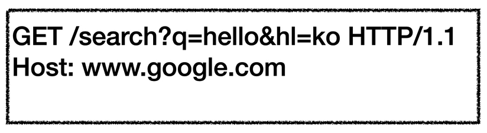
> ✋ - 리소스 조회
> - 서버에 전달하고 싶은 데이터는 query (쿼리 파라미터 , 쿼리 스트링)를 통해서 전달
> - 메시지 바디를 사용해서 데이터를 전달할 수 있지만 , 지원하지 않는 곳이 많아서 권장하지 않음

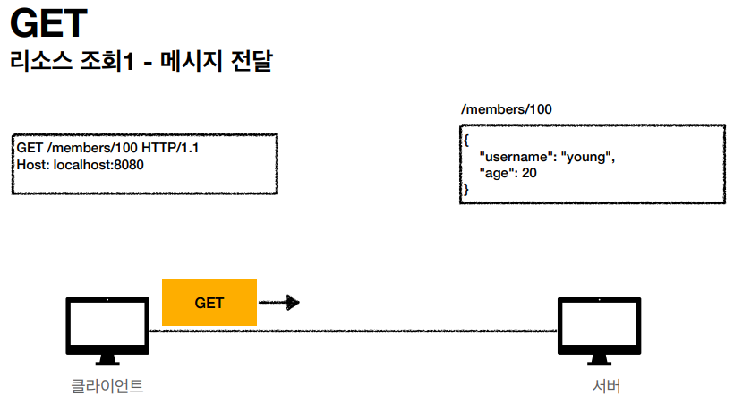
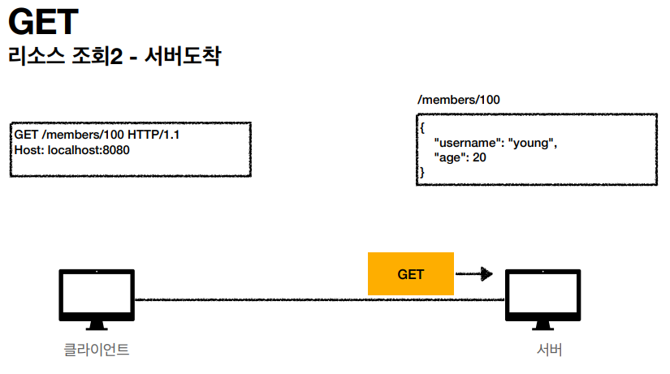
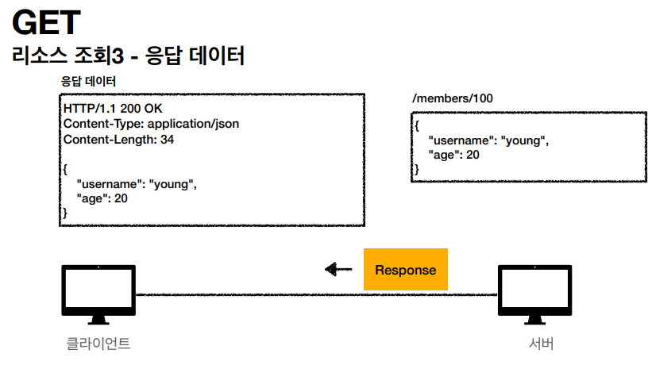

### **POST**
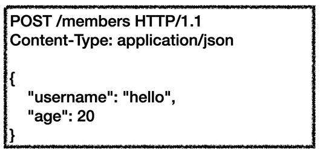
> ✋ - 요청 데이터 처리
> - **메시지 바디를 통해 서버로 요청 데이터 전달**
> - 서버는 요청 데이터를 처리
>   - **메시지 바디를 통해 들어온 데이터를 처리하는 모든 기능을 수행한다.**
> - 주로 전달된 데이터로 **신규 리소스 등록 , 프로세스 처리에 사용**

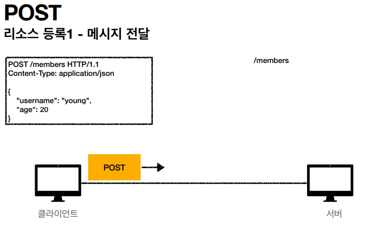
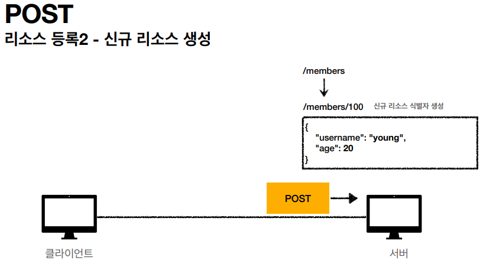
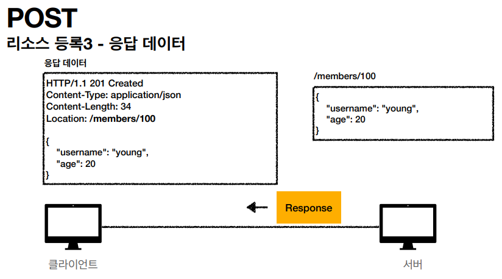

#### **❓ 요청 데이터를 어떻게 처리한다는 뜻일까**
{: .fh-default .fs-5 }
- 스펙 : POST 메서드는 **대상 리소스가 리소스의 고유한 의미 체계에 따라 요청에 포함 된 표현을 처리하도록 요청한다.**
- 예를 들어 POST는 다음과 같은 기능에 사용된다.
  - HTML 양식에 입력 된 필드와 같은 데이터 블록을 데이터 처리 프로세스에 제공
    - 예) HTML FORM에 입력한 정보로 회원가입 , 주문 등에서 사용
  - 게시판 , 뉴스 그룹 , 메일링 리스트 , 블로그 또는 유사한 기사 그룹에 메시지 게시
    - 예) 게시판 글쓰기 , 댓글 달기
  - 서버가 아직 식별하지 않은 새 리소스 생성
    - 예) 신규 주문 생성
  - 기존 자원에 데이터 추가
    - 예) 한 문서 끝에 내용 추가하기
- 정리 : **이 리소스 URI에 POST 요청이 오면 데이터를 어떻게 처리할지 리소스마다 따로 정해야 함**

**정리**
{: .fh-default .fs-5 }

**1. 새 리소스 생성(등록)**
  - 서버가 아직 식별하지 않은 새 리소스 생성
**2. 요청 데이터 처리**
   - 단순히 데이터를 생성하거나 , 변경하는 것을 넘어서 프로세스를 처리해야 하는 경우
    - 예) 주문에서 결제완료 -> 배달시작 -> 배달완료 처럼 단순히 값 변경을 넘어 프로세스의 상태가 변경되는 경우
  - POST의 결과로 새로운 리소스가 생성되지 않을 수도 있음
    - 예) **POST /orders/{orderId}/start-delivery (컨트롤URI 라고 한다.)**
**3. 다른 메서드로 처리하기 애매한 경우**
  - 예) JSON으로 조회 데이터를 넘겨야 하는데 , GET메서드를 사용하기 어려운 경우

### **PUT**
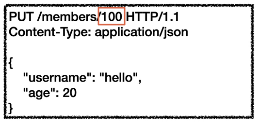
- 리소스를 대체
  - **리소스가 있으면 대체**
  - **리소스가 없으면 생성**
  - 리소스를 수정하기는 어렵다.
- **중요! 클라이언트가 리소스를 식별**
  - 클라이언트가 리소스 위치를 알고 URI, 지정
  - POST와 차이점

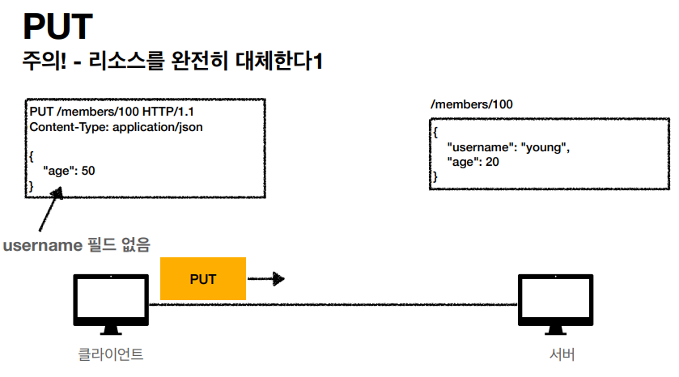
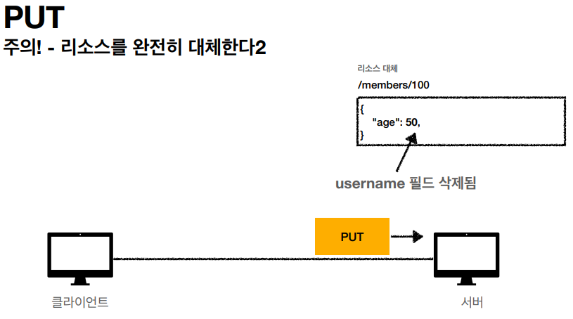

### **PATCH**
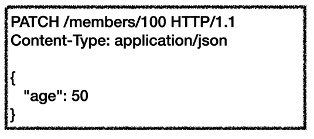
- **리소스 부분 변경**
- **간혹 PATCH를 받지 못하는 서버가 있다. 그렇다면 POST를 사용하자**

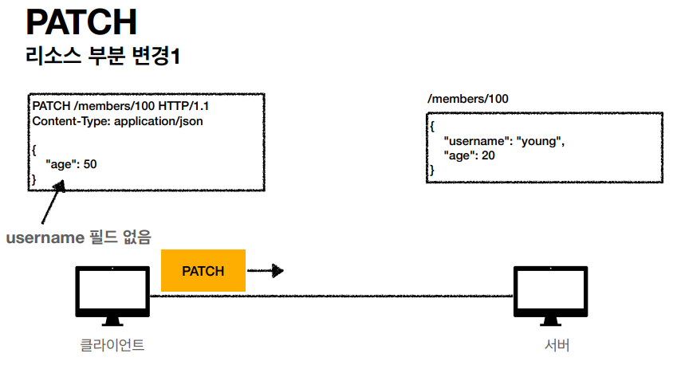
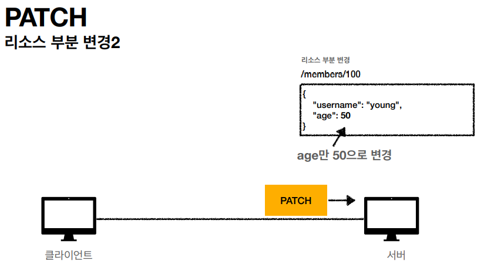

***

## **📌 HTTP 메서드의 속성**
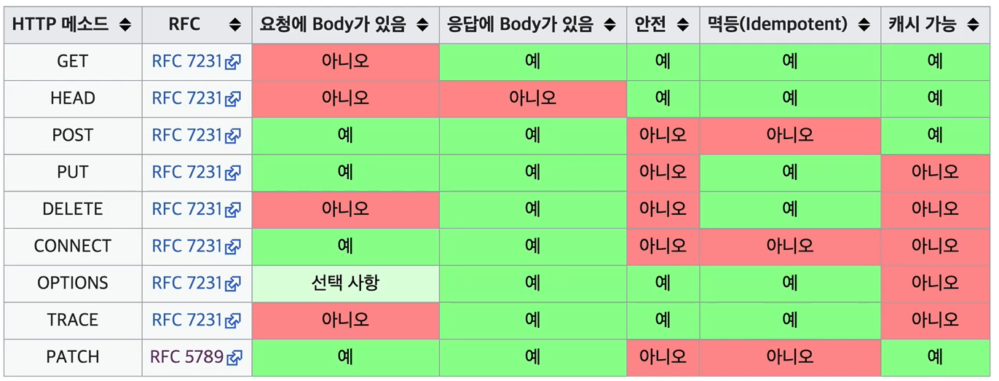

### 안전 (Safe Methods)
- **호출해도 리소스를 변경하지 않는다.**
- Q : 그래도 계속 호출해서 , 로그 같은게 쌓여서 장애가 발생하면?
- A : 안전은 해당 리소스만 고려하다. 그런 부분까지 고려하지 않는다.(해당 리소스가 변경될 가능성이 있는지만 고려)

### 멱등 (Idempotent Methods)
- **한 번 호출하든 두 번 호출하든 100번 호출하든 결과가 똑같다.**
- **멱등 메서드**
  - GET : 한 번 조회하든 , 두 번 조회하든 같은 결과가 조회된다.
  - PUT : 결과를 대체한다. 따라서 같은 요청을 여러번 해도 최종 결과는 같다.
  - DELETE : 결과를 삭제한다. 같은 요청을 여러번 해도 삭제된 결과는 똑같다.
  - POST : 멱등이 아니다! 두 번 호출하면 같은 결제가 중복해서 발생할 수 있다.
- **활용**
  - **자동 복구 메커니즘**
  - 서버가 TIMEOUT 등으로 정상응답을 못 주었을 때 , 클라이언트가 같은 요청을 다시 해도 되는가? 판단 근거
- **Q : 재요청 중간에 다른 곳에서 리소스를 변경해버리면?**
  - 사용자 1 : GET -> username:A , age:20
  - 사용자 2 : PUT -> username:A , age:30
  - 사용자 1 : GET -> username:A , age:30 -> 사용자2의 영향으로 바뀐 데이터 조회
- **A : 멱등은 외부 요인으로 중간에 리소스가 변경되는 것 까지는 고려하지 않는다.**

### 캐시 가능 (Cacheable Methods)
- **응답 결과 리소스를 캐시해서 사용해도 되는가?**
- **GET , HEAD , POST , PATCH 캐시가능**
- **실제로는 GET , HEAD 정도만 캐시로 사용**
  - **POST , PATCH는 본문 내용까지 캐시 키로 고려해야 하는데 , 구현이 쉽지 않음**
